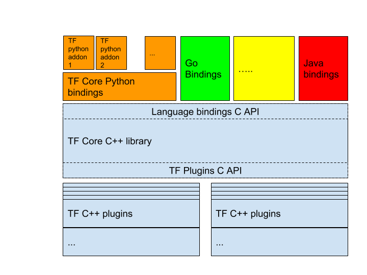
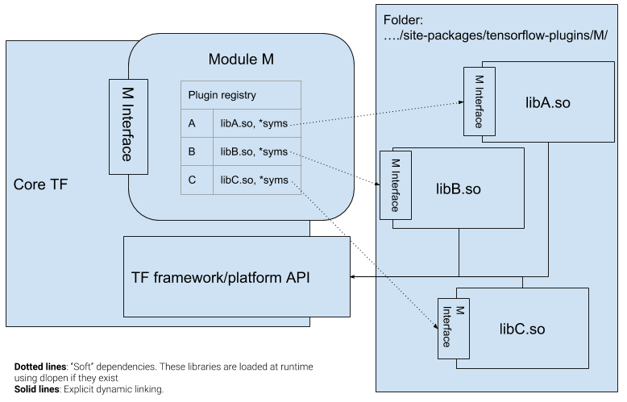
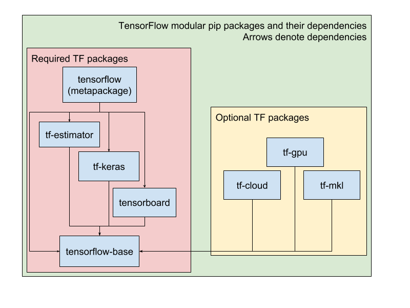
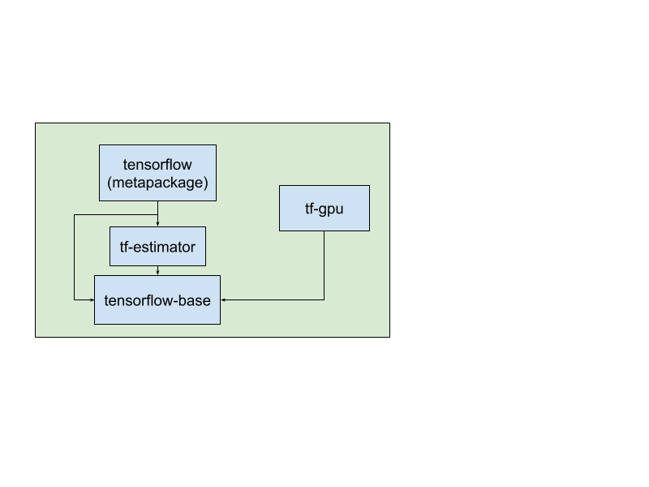
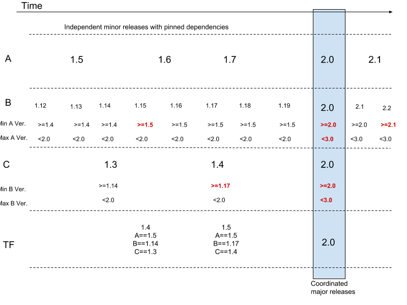

# Modular TensorFlow

| Status        | Proposed                                             |
:-------------- |:---------------------------------------------------- |
| **Author(s)** | Gunhan Gulsoy (gunan@google.com)                     |
| **Sponsor**   | Martin Wicke (wicke@google.com)                      |
| **Updated**   | 2019-11-25                                           |


## Motivation

TensorFlow is a very successful open source project. Since it has been open sourced, [1800+ contributors](https://github.com/tensorflow/tensorflow) have submitted code into TF from outside Google. However, as more and more developers contribute, it becomes more and more difficult to manage contributions in the single repository.

This project aims to split the TensorFlow codebase into **smaller, more focused**, repositories that can be released and managed separately. These modules will talk to each other using **well defined APIs**. Thanks to the module APIs, these modules are now **managed/owned/released independently.**

### Problems addressed

#### Spaghetti dependencies

Everything being in a single repository encourages everyone to freely use all other code in the repository, even when this does not make sense. This ensures the library is very difficult to modify later.

#### Long build times

Many volunteers and developers outside Google use their laptops for development. On such systems, TF development cycles require building all of tensorflow that takes around 2 hours. While there is an argument to be made that bazel caching should ensure that they build all of TF only once, without forge, bazel caching is not working as [well as expected](https://docs.bazel.build/versions/master/remote-caching.html#known-issues).

#### Adding support for new hardware is very difficult and not scalable

The ML ecosystem is constantly expanding. New hardware for accelerating ML applications is being worked on by many teams inside and outside Google. As the most popular machine learning framework, TF is expected to add support for many of these hardware as quickly as possible.

Currently, this means that all such hardware developers need to check in their code into the [main tensorflow repository](http://github.com/tensorflow/tensorflow). This means that all the changes are required to go through TF team's review. This can make merging support for new hardware very very difficult.

#### Long PR review queue

TensorFlow is a very successful opensource project. It is the [4th most forked](https://github.com/search?o=desc&q=stars:%3E1&s=forks&type=Repositories) and [5th most starred](https://github.com/search?q=stars%3A%3E0&s=stars&type=Repositories) project on github. This also means that TF receives quite a lot of opensource contributions. The TensorFlow team has to review all contributions to TensorFlow itself. This creates a bottleneck for merging the changes to the main repository.

#### Flexibility for collaborators

Currently, any partner or contributor that would like to work with us are subject to all the rules within of the main repository. Some of these can be relaxed through modularization, where work can happen in a separate repository.

#### Large TF support matrix

The TF support story is a unique beast. Our support matrix has a lot of orthogonal dimensions. Below are some of the more prominent dimensions:

*   Environment (google3, opensource)
*   Operating system (Linux, windows, macos, mobile)
*   Architecture (x86, arm, ppc64, …)
*   Accelerator (CPU, GPU,  TPU)
*   Compiler (GCC, Clang, MSVC)
*   Python version (2, 3.4, 3.5, 3.6,  3.7)

More can be added to this list where we have to rebuild TensorFlow to support different network architectures, CUDA versions, SIMD instruction sets, etc.

Having a monolithic repository means we need to rebuild all of our code for all of these different combinations. However, it makes no sense to rebuild all of our C++ code if the only difference is the Python version. Or rebuild all of our CPU kernels for different CUDA versions. Modularizing our code means we only need to rebuild and test the modules that are directly impacted by the dimensions we are changing in the support matrix.


## Overview

This project aims to split the TensorFlow codebase into **smaller, more focused**, repositories that can be released and managed separately. These modules will talk to each other using **well defined APIs** that will evolve over time. Thanks to these APIs, these modules will be **managed/owned/released independently**. There will be different strategies to break apart pieces based on the languages, but below summarizes the approach for C++ and Python:




A summary of the above is:

*   Core TF functionality will be implemented in C++
*   Core TF functionality can be extended using shared objects.
*   On top of the core C++ libraries, we will have the language bindings (Using the C API)
*   There can be more functionality built on top of the core TF bindings in different languages, which can be maintained and distributed separately.
*   All different pieces need to use well defined public APIs.

A few important points to clarify above are:

* We will try our best to make sure the APIs will stay as close as possible to
  the current APIs.
* We are aiming to avoid needing to change most existing custom op and kernel
  code.
* The APIs will evolve over time. We will modify the APIs based on our and
  user's needs. These modifications are expected to follow versioning guidelines
  [described
  here](https://github.com/tensorflow/community/blob/592221e839eb9629a9ff4c73d46ee44ccb832d97/rfcs/20190816-tf-project-versioning.md).


### Definitions

This section will briefly describe the terms we will use in the rest of this design.

**Modules:** These are the components of core TF library that will "accept" plugins to expand their capabilities. Examples of modules are networking, filesystem, (graph) optimizers.

**Plugins:** Plugins are extensions to different modules. For example, filesystem module can have a GCP plugin, an S3 plugin, an HDFS plugin.

**Shared objects:** These are  dll/so/dylib files that can house **one or more** plugins for **one or more** modules.

**Packages:** Python pip packages which may include Python files and/or shared objects.


### C++

This project aims to implement similar plugin architectures for multiple components of TF code. While these will be listed separately, **there will be a lot of shared pieces between these components**. The modules we would like to handle are:

1.  Networking module, with verbs, gdr plugins initially
1.  Filesystems module, with GCP, AWS and HDFS support
1.  Kernels module,
1.  Optimizers/Graph rewrite module,
1.  Accelerator backends module

The above is not an exhaustive list of modules we would like to introduce. These are just initial ideas for good candidates for modules. 

In the initial plan, we will keep XLA as a part of core TF, because of the large API surface. Once the initial work for the above modules are complete, we can reevaluate this decision with XLA team.

Each of these aspects require unique special treatment in addition to the common strategy defined below. These unique nuances will be discussed in separate documents. Next, we detail the module/plugin architecture we would like to implement abstracting out the specific components listed above.

This is a high level description of a single module and multiple plugins for this module:



The big pieces of this design are:

1.  Modules: Well defined components within tensorflow that need multiple implementations, and select different code paths at runtime
1.  Plugins: These will be implementations of each module. Each plug-in will implement an "interface" (i.e., the API defined as C functions rather than a pure virtual class in C++). These will be loaded dynamically at runtime, 
1.  TF framework/platform APIs: Shared functionality needed for implementing the plugins. Main purpose is to pass data/state between plugins and core.


### Python

Below diagram provides a summary of the proposed TensorFlow pip package ecosystem.





1.  TensorFlow Base pip package: This provides the core TensorFlow functionality all of TF will share. While estimator and keras provide high level neural network primitives, base will provide basic matrix operations these two packages will use to build the high level APIs.
1.  Required TensorFlow addons: These are pieces of TensorFlow that has to be included in all TF distributions. Examples to this are Estimator, Keras, TensorBoard and base. These are pieces of the public API that are promised to exist by our compatibility guarantees.
1.  TensorFlow Metapackage: This will be a thin package that only defines the composition of TensorFlow. Please see the detailed design section for more details on this package.
1.  Optional TF packages: These packages will include the optional TF features users may choose to load and enable after they have TF working. Without these, TF will work just fine. Example features we will have as optional packages are GPU support, MKL support, or cloud filesystem support. These will use the C++ modules to load the functions they provide at runtime.


## Detailed Design

We will describe each key design element here in detail. To make the points clearer, trivial examples will be created.

### Modularity in C/C++

This section will describe the key design points for C++ modularity.

#### Modules

Each module's main pieces will be a module interface in C, and a registry for plugins implementing this module. As a supporting piece, each module will also need to provide a mechanism for plugins to add themselves to the registry at runtime. Below is a toy example for the described design:


```
// A simple toy module called "M"
typedef struct M_context;

// The summary of the interface plugins need to implement
typedef struct MInterface {
  void (*M_Init)(M_context*, string);
  void (*M_Execute)(M_context*);
};

// The plugin registry for module M
// The registry here implemented uses C++ class std::map
// This is OK as it is not exposed in our example here.
// As far as module implementations are concerned, they only
// need to see and use M_RegisterPlugin method, and that method takes // care of their addition into this registry.
std::map<string, MInterface> m_plugin_registry;

// Function to call for each plugin at load time
// to add themselves to the registry
void M_RegisterPlugin(
    string plugin, 
    void (*M_Init)(M_context*, string),
    void (*M_Execute)(M_context*)) {
  // Omitting error handling.
  m_plugin_registry.insert(plugin,
                           MInterface(M_Init, M_Execute));
}

// Implementation of the interface is just a thin layer to
// get the correct plugin and call it.
// Here we assume that plugin explicitly gets selected by
// the init function. Some modules can go with implicit selection,
// Such as deducing the filesystem from the file path.
void M_Init(M_context* ctx, string id) {
  // Just a quick hacky way to select the plugin here
  ctx->interface = m_plugin_registry[id];
  ctx->interface.M_Init(ctx, id);
}

void M_Execute(M_context* ctx) {
  ctx->interface.M_Execute(ctx);
}
```


**Please note that the above is a toy example to explain the abstract ideas described above. Exact implementation can vary across different modules.**

Interface has to be pure C at the ABI level. We can have C++ header-only libraries built on top of these C ABI/APIs.


#### Plugins

Plugins need to include implementation of the interfaces declared by one module. If the module interface requires Init and Compute methods, it will need to implement these two functions, plus a TF_InitPlugin function which will be called at load time. This function will also need to register the plugin as prescribed by the module.


```
// A simple plugin implementation A, for module M.
typedef struct M_context;

// Here is the meat of the plugin:
void A_Init(M_context* ctx, string id) {
  // id can be thrown away, in this example.
  // Or can encode different ways plugin can be initialized.
  ......
  // initialize the plugin
  // Modify the context using functions exposed by core
  TF_SetFooInContext(ctx, foo);
  TF_InitBarInContext(ctx);
}

void A_Execute(M_context* ctx) {
  ..........
}

void TF_InitPlugin() {
  M_RegisterPlugin("A", A_Init, A_Execute);
}
```


When this plugin is loaded by TF at runtime, `TF_InitPlugin` method will be called. This method will register the plugin as prescribed by the module, and exit.

Plugin shared objects will need to follow some standards:


1.  These cannot export any symbols into global namespace to avoid symbol collisions.
1.  They need to communicate to TF through any provided C APIs.
1.  They can link anything they like, anyway they like in addition to TF.
1.  They can be built and distributed separately


#### How plugins are loaded

TensorFlow will look for and load plugins in two different ways:


1.  Default TF plugin directories, such as `...python_dir.../site-packages/tensorflow-plugins`
1.  User calls `tf.LoadLibrary`

Both of these will go through the tf.LoadLibrary method, which does the following:


1.  Check the directory for plugins.
1.  For each plugin, check if they are loadable using platform string, as defined in: [tensorflow/core/platform/platform_strings.h](https://github.com/tensorflow/tensorflow/blob/master/tensorflow/core/platform/platform_strings.h)
1.  dlopen the library
1.  dlsym `TF_InitPlugin symbol`, and call it
1.  exit.

To ensure that correct platform strings are generated in each shared object, each plugin library is required to include  the following code snippet:


```
#include "tensorflow/core/platform/platform_strings.h"
TF_PLATFORM_STRINGS()
```


#### TF Framework/platform API

While all the above components require a lot of careful planning, this piece of this design will require close to half of the total coding load. Currently, all planned components treat the union of all headers under TF as their API. More than 90% of these headers define C++ APIs.

Our work here will cumulatively build a large API surface in C. While we can compartmentalize work for each module, with more modules implemented there will be a lot of shared API endpoints in core framework between these modules.

Below is a 10K ft view of how the "different" APIs may look like in a simple set representation, with varying sizes, varying levels of intersection.


We expect all of this work to be cumulative and finally defining a large coherent API surface for TF.

Once this API is ready, header only C++ APIs can be defined using this API.


### Modularity in Python

This section will describe the key design points for modular Python packages for TF.


### TensorFlow base pip package

Contains the base Python API, and "Core TF" C++ shared objects

This package will be a subset of the current "tensorflow" pip package. It will include all of the core TF API except the high level API modules we will split up. It will define a public API for everything except for the required add on packages.

### Required tensorflow addons

These packages are planned to contain high level TF functionality that can be safely split up from TF. Examples for these are tensorboard, estimator and keras. Together with the base TF package, these packages will contain the full Python code of TF, except for top level API wiring. As like any addons, these are only allowed to use public APIs exposed by their dependencies. These packages have two constraints

1. They are only allowed to use public APIs exposed by their dependencies.
1. They are required to provide backwards compatible public APIs.

With the backwards compatible public APIs, we expect addons to be able to release independently as long as features they depend on are released in their dependencies.

These packages will have full control over the versions of their dependencies. We recommend they only set a minimum version for their dependencies. When they need new features, they will bump their minimum requirement to include the new API changes.


### TensorFlow Metapackage

This package will reconstruct the TF public API from the base and other requirements

Just a simple setup.py file that defines dependencies on specific versions of all required packages and base package, plus an `__init__.py` file that defines the top level tensorflow API.

The Python code for tensorflow metapackage will be a single `__init__.py` file that will look like this:


```
from tensorflow_base import *
import tensorflow_estimator as estimator
import tensorflow_keras as keras
<………… more packages as needed >
```


A new tensorflow release will mean we will pick combinations of dependencies, run all our integration tests, and then release the above python file with these dependencies in its setup.py file:


```
TENSORFLOW_DEPENDENCIES= [
    "tensorflow_base == 1.x.y",
    "tensorflow_estimator == 1.a.b",
    "tensorboard == 1.c.d",
    "tensorflow_keras == 1.e.f"
]
```


### TF Public APIs

As a part of the modularization, to be able to decouple development and releases for each of these packages, each package is required to expose a **well defined, well documented public API**.


### Optional TF packages

Mostly expected to contain the C++ plugins defined in the previous section. These will be simple pip packages that will deploy the shared objects under "site-packages/tensorflow-plugins"

These shared objects will be automatically loaded by TF core if:

*   They correctly define the compatibility strings using `TF_PLATFORM_STRINGS`
*   They are compatible with the system tf core is running on
*   They have been properly built and signed (unless running in developer mode)


## Alternatives / Potential Issues

*   **Why do we not use C++ APIs instead of C**: Compilers have no guarantees for ABIs generated for C++ code. Any C++ API used will require each shared object to be compiled with the same compiler, using the same version of the compiler, with the same compiler flags ([See github issue 23561](https://github.com/tensorflow/tensorflow/issues/23561)).
*   **Why do not we statically link everything**: Single shared object for everything: Anywhere except google does not have access to the massively parallel build system we use here at google. This causes prohibitive build times, causing major developer pain for open source developers. There are many more issues, but the summary is while this is a great solution for google, outside google this is simply infeasible.
*   **TF will become a suite of multiple packages, built by multiple authorities. What if the bugs get blamed on TF team**: With the modular model, we expect testing of 3rd party code to become easier. This can also be mitigated if the error messages are better, and if they can clearly point out which module the issue stems from. Finally, we can create an apple-swift like testing model, where we run a Jenkins setup that people can donate their machines to, and we can run continuous integration tests on their plugins.
*   **Why not have APIs but still have a monolithic repository** When everything is in a single repository, this enables developers to bypass the APIs, and depend on internals. Moreover, we cannot grant full control over different folders on our repository to our partners in a single repository. As long as they are in a single repository, they are still constrained by our build system and license. Finally, in a single repository we do not provide the option of closed source plugins for contributors.
*   **Why not go with the OSS federation solutions?** OSS federation requires all dependencies to be in the federation before adding a repository. This is simply not possible for tensorflow, as eigen, llvm and many other dependencies will never be a part of the federation.
*   **Documentation, how/where do we document everything?** With multiple repositories, structure of the documentation will need to be rethought, based on what is a part of "TensorFlow proper" and what is an optional feature.


## Testing Plan

We propose the following principles to be followed for testing in a modular world:

* Each plugin tested separately.
* Modules can plan their own integration tests.
* Cut combinatorial explosion by divide and conquer.
* Fuzzing at the core-module interface level if possible, in the case we need data marshalling between layers.
* With this proposal, we aim to also simplify testing of tensorflow code. The biggest gain we expect in the modular world will be, we will be able to "divide and conquer" the TensorFlow support matrix.
* Following describes an early modularized tensorflow package structure:




In the current setup, we need to test all of the above packages for different Python versions, operating systems, accelerators (CPU, GPU), compilers, and more variants combined. In the modularized world, each of these packages only need to be unit tested for the following:


*   tensorflow-base: Operating systems, compiler versions and python versions only with CPU
*   tf-gpu: With GPU only, for different operating systems.
*   tf-estimator: Only for different python versions

When testing a package that has dependencies, such as tf-estimator, or tf-gpu, tensorflow-base will be installed with its latest stable release, to ensure to avoid any flakes by this package.

We know that with the current release cadence this is too slow to support TF's rapid development. But with modules, we expect to be able to release much more frequently.

On top of the proposed unit testing plan above, we will need package level integration tests. We propose these to be run every night at head. We propose the following to act as the TF integration tests:


*   Miscellaneous pip utility tests. Build the nightly pip packages, install them. Then make sure you can import TF, run the command line utilities distributed with TF.
*   Tutorials/notebook tests. Build the "nightly" pip packages for all above components. Then install this package. Finally extract the Python code from notebooks and run them as graphs
*   Models tests: Build and install the nightly pip packages, then run curated models under tensorflow/models for a small amount of steps.

The above will simply check the sanity of TF, just will check if TF can run without crashing. However, TF requires much more testing. We propose expansion and adoption of the following regression tests to nightly TF test suites:

*   Convergence tests: Run a curated set of small models until convergence. Measure the time to converge, and steps to converge
*   Performance tests: Run a curated set of models for a pre-selected number of steps. Measure steps per second, and for image models images per second.


## Releases

In the multi package environment, we aim to have the following with the releases:

1.  Smaller packages: We expect to release multiple small packages, instead of the giant package we are building and releasing right now.
1.  Faster releases: We would like the smaller packages to be able to release much faster. With the ability to pin each dependency to a known good version, we would like to be able to compartmentalize issues, and only hold certain components back when only certain code in TF has issues.
1.  Independent releases: With compatibility checks, we would like to be able to independently release different packages

Below summarizes a timeline of releases for three packages, A, B and C, where B depends on A and C depends on B.





To summarize the above timeline:

*   Different packages set their own release cadences
*   Each package will set version boundaries for each of their dependencies.
*   Each package is responsible for ensuring that all of their public APIs are working as promised.
*   Packages do not need to modify the minimum version requirements unless they start using newly introduced public API symbols.
*   TF metapackage releases may choose to hold back individual packages in favor of faster releases. But dependency requirements have to be respected when doing so.
*   Major releases still need to be coordinated.


## Packaging Issue Scenarios


We will now go over a few failure modes in the proposed environment, and propose how things need to be resolved. We will use a simple example, where we have three packages, A, B and C, where C depends on B and A, and B depends on A.


#### Scenario 1: B does not work with a new release of A

Potential issues:

*   B uses non-public symbols from A:
    *   B has to release a new version avoiding non-public APIs
*   A changed public APIs:
    *   A has to revert changes to its public APIs and release a patch version replacing the bad version


#### Scenario 2: New release of B does not work with A

Potential issues:

*   B depends on unreleased APIs A exposed in a newer version
    *   B needs to release a patch version, with just a change in the minimum required version of A


#### Scenario 3: C and B depend on different minimum versions of A

As both C and B have to define a range of versions they require from A, the max version should satisfy both constraints.


#### Scenario 4: User installs C first, but then uninstalls A

This is a pip issue. To help diagnose the problem, B and C should print that A is missing, and user needs to install that to use B or C.


