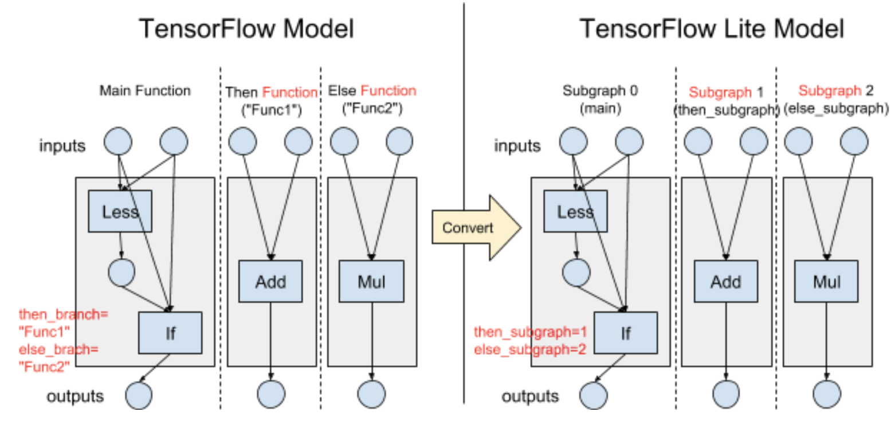
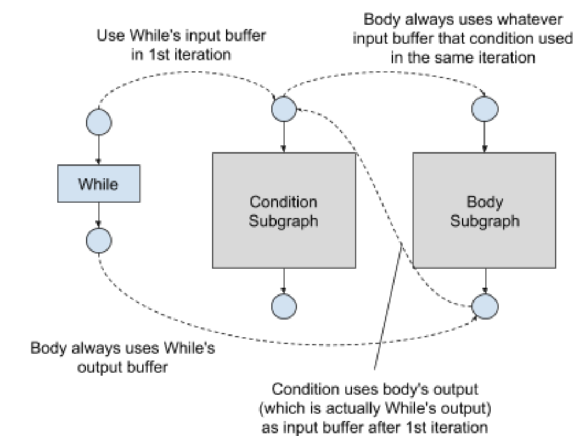

# Control Flow in TensorFlow Lite

Status        | Accepted
:------------ | :---------------------------------------------------------------
**Author(s)** | Yu-Cheng Ling (ycling@google.com)
**Sponsor**   | Andrew Selle (aselle@google.com), Jared Duke (jdduke@google.com)
**Updated**   | 2019-03-15

## Objective

Support control flow ops in TensorFlow Lite

## Goals & Non-Goals

Goals:

*   Discuss how control flow is defined, converted from TensorFlow, and
    implemented in TensorFlow Lite

Non-goals (these are on our radar, and will be discussed separately):

*   Tackle streaming RNN/LSTM use cases (e.g. process one time step in each
    invocation and preserve states)
*   Handling Tensor Lists (required for dynamic RNN and seq2seq use cases)

## Background & Motivation

We aim to make TensorFlow Lite easy to use. One of the ultimate goals is to be
able to **convert any TensorFlow model to TensorFlow Lite and run it
correctly**. The
[Select TensorFlow operators](https://www.tensorflow.org/lite/guide/ops_select)
project increased hundreds of supported ops by running TensorFlow kernels in
TensorFlow Lite. However, some of the TensorFlow ops are not supportible by this
approach. Control flow is one of the biggest missing features.

Currently TensorFlow Lite doesn't support control flow. The interpreter has a
static execution plan to run all the operators in a fixed order. There's no way
to selectively or repeatedly execute some of the operators.

Control flow is used in many important use cases, like training, dynamic RNN,
seq2seq...etc. We already implemented some fused RNN/LSTM kernels in TensorFlow
Lite, but these are restricted by the model architecture and conversion flow.

Implementing control flow is required to make any TensorFlow model convertible
to TensorFlow Lite. It is also a big step towards enabling generalized
RNN/LSTM/seq2seq models. If a RNN/LSTM only uses features that TensorFlow Lite
fused kernels support, we can further fuse these ops and get even better
performance.

## Defining control flow ops in TensorFlow Lite

In TensorFlow, users can use `tf.cond` and `tf.while_loop` functions to define
control flow directly. These functions are also called by more advanced
functions like `tf.nn.dynamic_rnn` and `tf.contrib.seq2seq.dynamic_decode`.

Internally there are 2 ways to represent control flow in a TensorFlow graph:

*   Control flow v2 is enabled by default in TensorFlow 2.0. It uses
    **functional control flow ops** like `If` and `While`, where the branches
    and loop bodies are represented with TensorFlow Functions.
*   Control flow v1 is enabled by default in TensorFlow 1.x. It uses ops like
    `Merge`, `Switch`, `Enter`, `Exit`...etc. The control flows are represented
    in the same graph.

We propose to define control flow ops in functional form in TensorFlow Lite. The
TensorFlow model and converted TensorFlow Lite model will be extremely similar,
and the graph structures will be essentially isomorphic. XLA also uses a similar
design for control flow.

The detailed guidelines of defining TensorFlow Lite control flow ops are listed
as following:

*   TensorFlow Lite control flow ops should be defined like TensorFlow control
    flow v2 ops, with exactly the same op semantic, inputs, and outputs
    definition
*   TensorFlow functions used by control flow ops should be converted to
    TensorFlow Lite subgraphs
*   For each function attribute on TensorFlow control flow ops, define an
    subgraph index field in TensorFlow op option table

### Example: Defining `If` condition op

In this section, we use a simple example to explain how `If` op is defined and
how the design guidelines are applied.

The following diagram illustrates an example which is equivalent to:
`a < b ? a + b : a * b`



Notes how the guidelines are followed:

*   The graph structure is completely isomorphic between TensorFlow and
    TensorFlow Lite models.
*   We defined TensorFlow Lite `If` with exactly the same op semantic, inputs,
    and outputs definition as TensorFlow `If`.
    *   In TensorFlow `If` operator, the 1st input is a boolean condition the
        rest of the inputs are passed into the body (then / else branch).
        `then_branch` function is called when condition is true. Otherwise
        `else_branch` function is called.
    *   All these work exactly the same way in TensorFlow Lite, except that
        Functions become Subgraphs.
*   In TensorFlow Lite, each builtin op comes with a Options FlatBuffer table.
    For each function attribute in the TensorFlow op, define an integer subgraph
    index in TensorFlow op option table.

The option table of TensorFlow Lite If will be defined as:

```
table IfOptions {
  then_subgraph_index:int;
  else_subgraph_index:int;
}
```

### Supported control flow ops

Essentially we just need 2 ops to represent any control flow logic: `If` and
`While`, and only these 2 ops are used in TensorFlow 2.0 currently. Therefore
only these 2 ops will be implemented in TensorFlow Lite initially.

If necessary, other control flow ops can be easily implemented following the
same design guidelines:

*   `Case` was introduced into TensorFlow recently (02/12/2019). We can consider
    to support it, or rewrite it to multiple `If` ops in the converter.
*   `For` is not required, and it is representable by rewriting to `While` ops.
    TensorFlow `For` was only used in previous functional control flow
    implementation. We don't expect to see `For` a lot after TensorFlow 2.0
    release, but we can support this for legacy models.
*   `StatelessIf` and `StatelessWhile` can be converted to regular `If` and
    `While` when converting to TensorFlow Lite. The converter may utilize the
    stateless information to do smart optimizations, but it doesn't matter in
    TensorFlow Lite runtime.
*   `Call` (simply invoking another subgraph) may be implemented in the future
    for other purposes. It's not required initially.

## Converting TensorFlow control flow ops to TensorFlow Lite

Since we choose to define control flow ops in functional form, it will be
relatively easy to convert TensorFlow control flow ops to TensorFlow Lite:

*   Convert each TensorFlow control flow op to the corresponding TensorFlow Lite
    builtin op
*   Convert each TensorFlow Function used by control flow ops to a TensorFlow
    Lite Subgraph

To support legacy models which uses control flow v1 ops, the converter will try
to raise control flow v1 ops to v2 ops with best effort. It's not guaranteed to
work because analysing the data flow between `Switch`, `Merge`, `Enter`, `Exit`
ops can be very tricky. However, in our experience most inference graphs should
work if users don't manually insert control flow ops into the graph.

## Implementation of control flow in TensorFlow Lite runtime

### Interpreter Implementation

In TensorFlow Lite, each Subgraph has a static execution plan, and ops are
executed according to the order in the execution plan. This works really well
with functional control flow ops:

*   In each subgraph, the ops in the execution plan are executed one by one
    normally.
*   When a control flow op kernel is executed, it may invoke another subgraph.

As of this writing, TensorFlow Lite interpreter was already refactored to be
able to parse and invoke multiple subgraph. Therefore the interpreter is already
ready to run functional control flow ops.

Currently, each subgraph has its own memory planner and preserves its own
buffer. This will unnecessarily increase memory footage when there are a lot of
subgraphs in the model, since not all subgraphs will be activated at the same
time. To optimize the memory usage, the memory allocator should be refactored to
share allocated memory between subgraphs.

### Kernel Implementation

The logic of the 2 fundamental control flow ops isn't very complex:

*   `If`: Check the condition input and invoke one of the 2 subgraphs.
*   `While`:
    *   Invoke the condition subgraph. Break out the loop if result is false.
    *   Invoke the body subgraph, use the output as the input of the next
        iteration.

It's not hard to implement TensorFlow Lite kernels to make these work. When
invoking a subgraph, a naive implementation is always copying the data between
subgraphs. The complexity comes from **optimizing by avoiding copy** to
**handling dynamic tensor shapes**.

### Avoiding copy for static shape use case

In TensorFlow Lite, each subgraph has a memory allocator. It is responsible for
allocating buffers for all tensors in the subgraph, including inputs and
outputs. When the output tensor shapes of control flow ops are static, we can
optimize the execution by avoiding copying the tensor data between subgraphs.

In the rest of this section, the implementation of `While` will be discussed as
an example. Similar design can be easily applied to `If`, which is simpler than
`While`.

The flow of `While` execution will be:

*   Copy the input buffer pointers from `While`'s inputs to condition subgraph's
    inputs
*   Copy the output buffer pointers from `While`'s outputs to body subgraph's
    outputs
*   Repeat the following steps in a loop:
    *   Invoke condition subgraph. Break out of the loop if the output is false
    *   Copy the buffer pointers from condition subgraph's inputs to body
        subgraph's inputs
    *   Invoke body subgraph
    *   Copy the buffer points from body subgraph's outputs to condition
        subgraph's inputs
    *   Repeat the loop

See also the illustration below:



The flow is carefully designed to avoid copying data between subgraphs. Since
the body subgraph writes to the output buffer of `While` op, no copy is required
after the loop. This is similar to RVO (return value optimization) technique in
compilers.

### Supporting dynamic shape use cases

Whenever a TensorFlow Lite subgraph is invoked, it will dynamically reallocate
tensor buffers if some of the tensor shapes are not static. This use case will
be supported by always propagating tensor shapes and copying tensor data
between subgraphs.

This isn't optimal, but it isn't typical to have dynamic shapes in control flow.
Note that XLA does not support dynamic use case, and we will already get better
coverage than XLA by having the simple implementation. We can further optimize
this case in the future if necessary.
