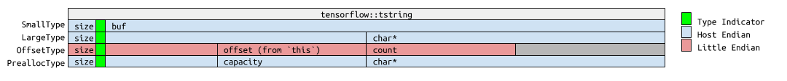

# ABI Stable Unified String Tensors

| Status        | Accepted                                             |
:-------------- |:---------------------------------------------------- |
| **Author(s)** | Dero Gharibian (dero@google.com)                     |
| **Sponsor**   | Gunhan Gulsoy (gunan@google.com)                     |
| **Updated**   | 2019-04-11                                           |

## Objective

To unify and define the byte interface of a string tensor across TensorFlow’s C
API (`TF_STRING`), TF Lite (`kTfLiteString`), and TF-Core/C++ (`DT_STRING`) with
the purpose of enabling
[modular TensorFlow](https://github.com/tensorflow/community/pull/77)
and mitigating the performance overhead of string tensor conversions.

## Background

[C++ string tensors](https://github.com/tensorflow/tensorflow/blob/r1.13/tensorflow/core/framework/types.h#L392)
([`DT_STRING`](https://github.com/tensorflow/tensorflow/blob/r1.13/tensorflow/core/framework/types.proto?#L24))
in TensorFlow are defined as a
[contiguous array](https://github.com/tensorflow/tensorflow/blob/r1.13/tensorflow/core/framework/allocator.h?#L126)
of `std::strings`.

In contrast, C string
([`TF_STRING`](https://github.com/tensorflow/tensorflow/blob/r1.13/tensorflow/c/c_api.h?#L106))
and TFLite
([`kTfLiteString`](https://github.com/tensorflow/tensorflow/blob/r1.13/tensorflow/lite/c/c_api_internal.h?#L178))
strings tensors have a different public byte layout.  In C, string tensors
[are defined as](https://github.com/tensorflow/tensorflow/blob/r1.13/tensorflow/c/c_api.h?#L205)
a list of uint64 offsets to varint prefixed char strings (where the varint
defines the length of the string).  Unlike C++ tensor strings, which can
allocate larger strings on the heap, C string tensors are defined in a single
block of contiguous memory.  Similarly, in TFLite, string tensors
[are defined as](https://github.com/tensorflow/tensorflow/blob/r1.13/tensorflow/lite/string_util.h?#L16)
a list of integer offsets to character strings.  The offset list is prefixed by
total string count and suffixed by total buffer size.  TFLite strings do not
explicitly specify the string length for each string, instead they are inferred
from the offset table.  Unlike C strings, TFLite string tensors contain explicit
string counts and the total buffer size in the buffer.  Furthermore, since the
endianness of TFLite string tensor description is explicit, TFLite strings are
self-describing, exportable, and effectively mmap-able.

When string tensors are marshalled across the C API, an expensive conversion
process, via
[`TF_TensorToTensor`](https://github.com/tensorflow/tensorflow/blob/r1.13/tensorflow/c/c_api.cc?#L417)
and
[`TF_TensorFromTensor`](https://github.com/tensorflow/tensorflow/blob/r1.13/tensorflow/c/c_api.cc?#L489),
is done to convert a
`TF_STRING` to a `DT_STRING` and vice-versa.  This results in a performance hit
at external language binding boundaries for string tensors.  Furthermore, the
current implementation of the C API does not provide setters/getters or other
ancillary methods for constructing a `TF_STRING`.  As a result, downstream
language bindings to
[Java](https://github.com/tensorflow/tensorflow/blob/r1.13/tensorflow/java/src/main/native/tensor_jni.cc?#L270),
[golang](https://github.com/tensorflow/tensorflow/blob/r1.13/tensorflow/go/tensor.go?#L395),
etc, modify a raw buffer in order to build
the index offset list of strings.  A similar conversion is done when TFLite
strings are passed to C++ kernels.

Our aim with modular TensorFlow is to facilitate the creation of externally
built and dynamically loaded kernels. With modular TensorFlow, we plan to
provide a thin header only C++ API that depends on the C API.   If we do not
update our approach to string tensors for modular TensorFlow, we will incur a
heavy cost when processing string tensors in kernels due to the constant
conversion between `DT_STRING` and `TF_STRING` across the C API.  Currently, the
marshalling of string tensors across TFLite and TFCore incurs a similar cost.

In order to mitigate unnecessary performance degradation, we need to have a
single definition of a string tensor which is ABI compatible across TFLite, C
and C++.  Furthermore, the string implementation needs to be ABI compatible
across various compilers in order to enable modular TensorFlow.

STL containers/strings are not ABI stable, and can vary across compilers,
compiler versions, and even compiler flags.  To mitigate these issues, we
propose a lightweight ABI stable replacement for the underlying objects
representing `DT_STRING`/`TF_STRING`/`kTfLiteString`s.

## Overview

We are proposing two sets of changes in order to (1) unify the definition of
string tensors across C++/Core, C-API, and TFLite; and (2) to achieve ABI
stability for string tensors across compilers on a single architecture.

In order to unify the definition of string tensors in C, we propose the addition
of new methods for creating and ingesting tensors in C.  We are also proposing
for the original method of creating tensors in the C API to be marked as
deprecated.  In order to support the transition, we will include a flag in the
`TF_Tensor` struct to track which API the tensor was created with.  Furthermore,
we plan to provide accessors and mutators for string tensors in C, in order to
simplify language bindings, and ease potential future changes to the byte layout
of string tensors.

For TFLite, we propose an additional enum for the new string tensor type,
allowing for backwards compatibility with existing kTfLiteString tensors.  The
prototypes for string creation and string accessors in `strings_util.h` and
`strings.h` do not need to change.

For ABI stability, we propose a new string type that can handle four string
variants: local “small strings” (`SmallType`), longer heap allocated strings
(`LargeType`), exportable/`mmap`-able offset based strings (`OffsetType`), and
preallocated strings---with capacity defined at string tensor
initialization---as a part of a contiguous buffer (`PreallocType`).

## Requirements

To achieve our aim of having universal ABI stable string tensors, we must adhere
to the following requirements

1. Our approach must be ABI stable
2. Our approach must work with the Eigen C++ header library.
3. For TFLite adoption, our approach must support direct memory mapping of
   string tensors.
4. For TFLite adoption, our approach must allow for the packed representation of
   a string tensor.
5. Our approach must be performant relative to the current use of std::string.
6. Our approach must allow for lvalue assignment of string values.
7. Our approach must allow for piecewise deployment externally.  In other words,
   during the migration period, downstream users must be able to opt out of our
   new string tensor implementation.

## Detailed Design

We propose a new header-only ABI-stable tstring class.  Our aim with tstring is
to provide a simplified container for strings which fits our narrow set of
requirements stipulated above.  tstring is not meant as a replacement for
`std::string`, and will not implement the full interface for std::string.  (Note
that `tensorflow::string` is currently aliased to `std::string`)

Our proposed string implementation will be similar to the canonical 'Small
Strings Optimization' (SSO) used to implement std::string in C++ libraries, but
will feature two additional underlying string container types.  In particular,
in addition to having a small local definition, and a heap allocated variant
for longer strings, we propose two additional types: an mmap-able/exportable
offset based string tensor (`OffsetType`), and a preallocated string tensor that
allocates a user-specified minimum capacity for each string as a part of a
contiguous buffer (`PreallocType`).

OffsetType strings will be used to replace the current TFLite string tensor
layout. PreallocType strings can be used in the future for performance
improvements, where N strings with M capacity can be pre-allocated from a
contiguous block of memory at tensor initialization with a single malloc
(instead of incurring N mallocs for large strings with the current `std::string`
implementation).  In the scenario where a `PreallocType` string’s capacity is
exceeded, the `PreallocType` would be converted to an `LargeType`.

The following is a layout overview of the proposed new string container type:

```cpp
namespace tensorflow {
class tstring {
 public:
  static const uint8_t kSmallType = 0x00;
  static const uint8_t kLargeType = 0x01;
  static const uint8_t kOffsetType = 0x02;
  static const uint8_t kPreallocType = 0x03;

  static const uint8_t kTypeMask = 0x03;

  struct LargeType {
    size_t size_;
    char* ptr_;

    // ...
  };

  struct PreallocType {
    uint32_t size_;
    uint32_t cap_;
    char* ptr_;
    // See “Capacity member variable” section below.

    // ...
  };

  struct OffsetType {
    uint32_t size_;
    uint32_t offset_; // `this` pointer + offset_ points to char string
    uint32_t count_;

    // ...
  };

  struct RawType {
    uint8_t raw_[16];
  };

  union UnionedType {
    LargeType p;
    OffsetType o;
    PreallocType f;
    RawType r;
  };

  enum {
    SmallTypeCapacity = (sizeof(UnionedType) - sizeof(uint8_t)) / sizeof(char),
  };

  struct SmallType {
    uint8_t size_;
    char str_[SmallTypeCapacity];

    // ...
  };

  union {
    LargeType p;
    OffsetType o;
    PreallocType f;
    SmallType s;
    RawType r;
  };

  const uint8_t type() const { return r.raw_[0] & kTypeMask; }

  // ...
};
}; // namespace tensorflow
```



Independent of endian-ness, the first two bits (lowest order) of the first byte
will denote the string type (i.e. `r.raw_[0] & 0x03` above).  For all string
types except, kOffsetType, values will be stored in host byte order.  Values
for OffsetType strings will be explicitly define little endian.

### Eigen Compatibility

Of the four string types defined above, the only type with potential eigen
compatibility issues is the `OffsetType`.  Since the `OffsetType` relies on an
offset value instead of a char pointer to point to the character string, and
since eigen is restrictive on how
[values are indexed](https://github.com/eigenteam/eigen-git-mirror/blob/branches/3.3/unsupported/Eigen/CXX11/src/Tensor/TensorMap.h#L147),
the simplest approach for
providing eigen compatibility is to define the 'offset' value as an offset from
the this pointer of a tstring scalar, and not as an offset from the start of
the tensor buffer.  More concretely, accessing the character string for an
OffsetType would be analogous to:

```cpp
    const char* data() const {
      return reinterpret_cast<const char*>(this) + offset_;
    }
```

### Lvalue assignment

In the scenario were an assignment exceeds the capacity `OffsetType`, `SmallType`,
or `PreallocType` the string is converted to `LargeType` string.  The original
string type is copied as a prefix to the `LargeType` so that it can be reverted
when the capacity falls below the original on a subsequent assignment.  This
feature will allow for lvalue assignment of OffsetType types, which, as a
corollary, will allow for the assignment of TFLite string tensors.

### Comparison of SSO implementations in gcc, llvm, and MSVC

|                                           | Size in Bytes | Small String Capacity
|------------------------------------------ | --            | --
|tensorflow::string                         | 16            | 15
|tensorflow::string w/ capacity (see below) | 24            | 23
|GCC                                        | 32            | 15
|MSVC                                       | 32            | 15
|LLVM                                       | 24            | 22

### Capacity member variable

Currently, TFLite has an ~8 byte overhead per string entry, which is used to
describe the offset.  The tstring class described above has an overhead of 16
bytes, and does not include a capacity field normally found in SSO
implementations for LargeType strings.  This comes with downsides.  Without a
capacity field LargeType strings are forced to always call realloc on
assignment.  To reduce the potential number of calls to realloc, we can add a
capacity field, at the cost of increasing the per string overhead to 24 bytes.
This would put as at parity with LLVM strings, but would result in a 3x
overhead compared to current TFLite strings.

### Updates to C API

Currently, downstream language bindings to
[Java](https://github.com/tensorflow/tensorflow/blob/r1.13/tensorflow/java/src/main/native/tensor_jni.cc?#L270),
[golang](https://github.com/tensorflow/tensorflow/blob/r1.13/tensorflow/go/tensor.go?#L395),
etc, are expected to
modify a raw buffer in order to construct and pass a string tensor.  We propose
new functions to abstract the creation of C string tensors, and a new flag in
`TF_Tensor` which tracks the method with which a C string tensor was created.
Using the new methods will effectively create C++ string tensors underneath,
and, when passed back and forth, will mitigate the conversion of `C TF_STRING`
tensors to C++ `DT_STRING` tensors and vice-versa via
[`TF_TensorToTensor`](https://github.com/tensorflow/tensorflow/blob/r1.13/tensorflow/c/c_api.cc?#L417)
and
[`TF_TensorFromTensor`](https://github.com/tensorflow/tensorflow/blob/r1.13/tensorflow/c/c_api.cc?#L489).

### Updates to TFLite

Since TFLite provides generators and accessors for TFLite string tensors, the
requisite changes needed to have TFLite conform to the `OffsetType` defined above
is on the order of a ~20 line CL.   Backwards compatibility can be maintained by
creating a new TFLite enum for tstring separate from the existing
kTfLiteString enum.
