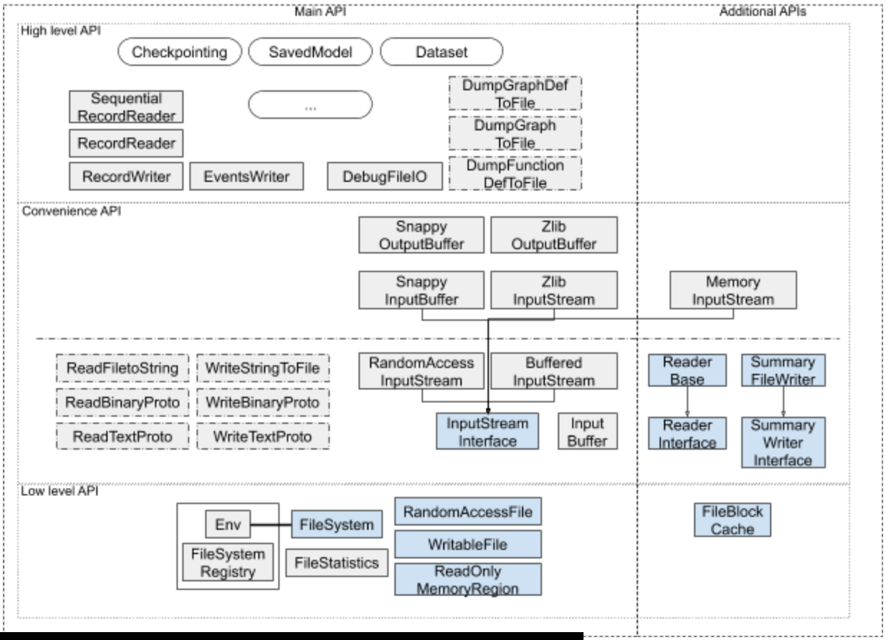
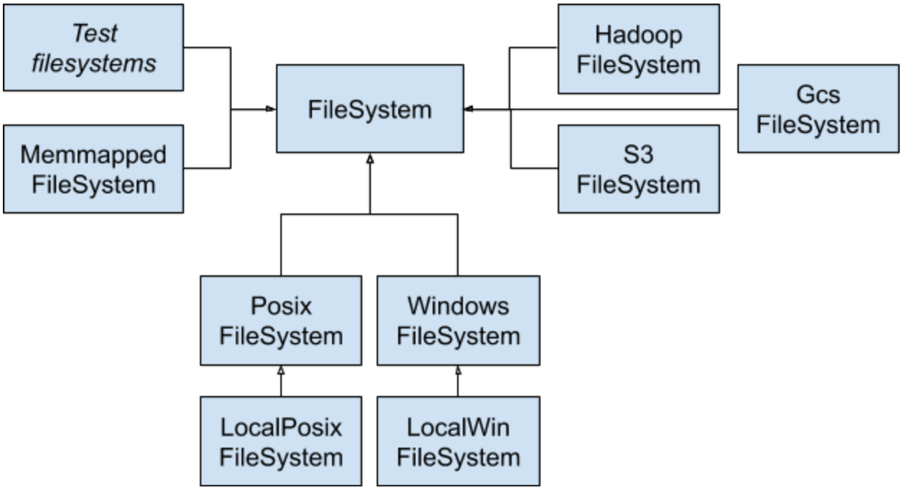
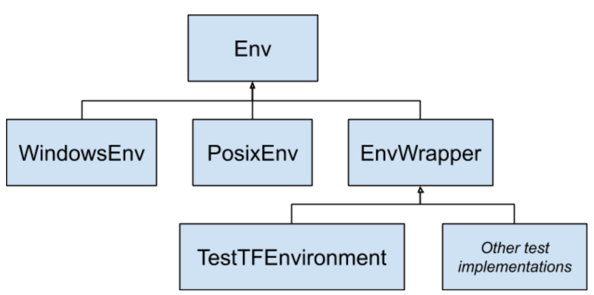

# Modular Filesystems C API

| Status        | Proposed                                             |
:-------------- |:---------------------------------------------------- |
| **Author(s)** | Mihai Maruseac (mihaimaruseac@google.com)            |
| **Sponsor**   | Gunhan Gulsoy (gunan@google.com)                     |
| **Updated**   | 2019-05-06                                           |

## Abstract

TensorFlow has grown large since its introduction and we are currently working
on ensuring a better development workflow by a team-wide effort designed to make
TensorFlow more modular according to the [current RFC][modular_rfc].

A major module of the modular TensorFlow involves all operations regarding files
and the filesystem. Saving models, checkpointing, reading files as input to
models (i.e. images, audio, etc.), and many other file manipulations are all
tasks that TensorFlow has to support.

While users can use the underlying operating system’s API (such as calling fopen
and friends on Posix environments, for example), it is definitely better to have
a cross-platform, cross-environment API that can be used everywhere. This
becomes more evident when we consider cloud environments: a user of TensorFlow
should not have to compile support for all existing cloud environments if the
program only touches local files.

TensorFlow provides such an API at the moment but it results in compiling code
for all known filesystems in the final binary. We propose a new design where all
filesystems are implemented as plugins and only the required ones are added at
runtime. To do so, we will first need to design a C API for the filesystems and
then integrate this with the rest of the modularization effort.

In a nutshell, the proposed API uses several data structures of function
pointers to mimic the current class-based API. Every plugin will fill in the
appropriate fields of these data structures during registration. When doing a
filesystem operation, core TensorFlow identifies the plugin/filesystem needed to
implement the operation, reads the function pointer from the corresponding table
and executes it. This way, we are able to offer support for all kinds of files,
including memory mapped files, remote files, compressed files or filesystem with
specific rules.

The rest of the document presents a set of requirements that this design tries
to satisfy, a (somewhat very detailed) overview of the existing implementation,
the proposed changes and estimates on the amount of work needed to integrate
this design with TensorFlow code.

## Requirements

Moving to a modular design adds several new requirements to the design, as we
want to prevent code from one plugin to interfere with code from another plugin
or the core TensorFlow. As such, here are a few requirements that we think are
needed:

1. Once a plugin is registered, the function pointer to plugin provided
   implementation should never change. Since unloading shared libraries after
   code from them has been run can lead to bad behavior (resource leaks, copies
   of pointers to functions within the library, object size mismatches, etc.) we
   will not attempt to deregister/unload plugins.

1. Interface between TensorFlow and plugins must be as simple as possible as
   well as thoroughly tested. It is better to localize errors in either
   TensorFlow core or the plugin providing the filesystem functionality than in
   the glue code between the two.

1. Plugin registration should support mandatory metadata such as version
   numbers, checks for backwards and forwards compatibility as well as optional
   fields such as author information, bug reporting URL, etc.

1. The mandatory metadata must guarantee _binary compatibility_: allow plugins
   built at one version of TensorFlow core to be loaded by a range of TensorFlow
   core versions, provided tests for API compatibility based on version metadata
   pass.

1. Furthermore, it is ideal to have compilation failures when trying to compile
   plugins against an old API interface which will surely fail the version
   metadata tests. When that is not possible we should give users good error
   messages at runtime. In other words, _source compatibility_ is guaranteed
   only as best effort.

1. We should minimize the number of times we need to cross module boundaries to
   implement a filesystem functionality. Each time the boundary is crossed we
   have to do conversions from C++ types to C types and back and that incurs
   some performance costs.

1. The API should provide some _type safety_, to ensure that plugin operations
   only act upon data structures that they should work on. Thus, instead of
   using opaque `void*` pointers, we will need to differentiate between the
   structures being operated on. We do this by having data structures which just
   wrap around these opaque pointers. These structures will only have one
   `void*` field.

1. We should provide a way for plugins to register that they don’t support some
   functionality, either because it doesn’t make sense for the specific plugin
   or because of compatibility reasons.

1. We should have a minimal amount of allocation at the boundary between plugins
   and core TensorFlow. Most of the memory should either be owned by TensorFlow
   or by the plugin and the only transfer between these should happen when
   reading/writing files as well as in converting from C++ types to C types
   (e.g. marshalling from `string` to `char*`)

1. The proposed API should minimize the amount of sweeping changes that need to
   happen on TensorFlow code. Ideally, we should allow some period of time when
   both plugins and the existing filesystem implementation will be present in
   the code, allowing users to gradually shift towards the new design.
   Fortunately, the proposed design allows for transparently rewriting the
   current C++ APIs, causing minimal disruption.

1. Although this design is mostly about C++ implementation, we should ensure
   Python code and other language bindings will be able to continue working with
   the modular design.

## Existing implementation

The existing implementation of a filesystem support in TensorFlow is hairy, due
to the complexity of operations that needs to be provided. This section is an
overview of the existing architecture.

In short summary, TensorFlow’s support for filesystems can be decomposed into 3
types of API:

* Low level API mainly focused on offering interfaces to hide complexity and
  provide cross-platform compatibility;
* Convenience API providing functions to read/write files in a generic way as
  well as providing support for compressed data and for buffered I/O;
* High level API which offers functionality needed by the kernels, ops and other
  utilities.

Furthermore, the codebase has some additional methods to access the filesystem.
These are used sporadically in some kernels and ops or for special cases such as
very special filesystems or test environments. We can translate these additional
APIs to use the design presented here, unifying API all across the codebase.



This diagram illustrates this decomposition. Classes are full gray rectangles,
interfaces are blue shaded ones and functions are rectangles with a dashed
border. Arrows represent inheritance and the line between `Env` and `FileSystem`
illustrates the coupling between these two structures as will be described in
the next subsection.

### Low level filesystem API

The low-level filesystem API in TensorFlow guarantees the same interface both
across multiple operating systems as well as across multiple filesystems hiding
the complexities arising from the differences between these platforms. Thus,
there are two different things that need consideration: implementing a new
filesystem and making it accessible for each operating system (i.e.
registering).

#### The filesystem implementation

A new filesystem is currently implemented by subclassing 4 interfaces: one for
the filesystem operation ([`FileSystem`][class FileSystem]), two for the file
operations ([`RandomAccessFile`][class RandomAccessFile], [`WritableFile`][class
WritableFile]) and one for read only memory mapped files
([`ReadOnlyMemoryRegion`][class ReadOnlyMemoryRegion]).

The `Filesystem` interface is needed to define common functionality to create or
delete files and directories as well as manipulating directory contents and
getting information about files present on a filesystem: listing directory
contents, getting statistics about files and finding paths matching a globbing
pattern.

```cpp
class Filesystem {
  // File creation
  virtual Status NewRandomAccessFile(const string& fname, std::unique_ptr<RandomAccessFile>* result) = 0;
  virtual Status NewWritableFile(const string& fname, std::unique_ptr<WritableFile>* result) = 0;
  virtual Status NewAppendableFile(const string& fname, std::unique_ptr<WritableFile>* result) = 0;
  virtual Status NewReadOnlyMemoryRegionFromFile(const string& fname, std::unique_ptr<ReadOnlyMemoryRegionFile>* result) = 0;

  // Creating directories
  virtual Status CreateDir(const string& dirname) = 0;
  virtual Status RecursivelyCreateDir(const string& dirname);

  // Deleting
  virtual Status DeleteFile(const string& fname) = 0;
  virtual Status DeleteDir(const string& dirname) = 0;
  virtual Status DeleteRecursively(const string& dirname, int64* undeleted_files, int64* undeleted_dirs);

  // Changing directory contents
  virtual Status RenameFile(const string& src, const string& target) = 0;
  virtual Status CopyFile(const string& src, const string& target);

  // Filesystem information
  virtual Status FileExists(const string& fname) = 0;
  virtual bool FilesExist(const std::vector<string>& files, std::vector<Status>* status);
  virtual Status GetChildren(const string& dir, std::vector<string>* result) = 0;
  virtual Status Stat(const string& fname, FileStatistics* stat) = 0;
  virtual Status IsDirectory(const string& fname);
  virtual Status GetFileSize(const string& fname, uint65* file_size) = 0;

  // Globbing
  virtual Status GetMatchingPaths(const string& pattern, std::vector<string>* results) = 0;

  // Misc
  virtual void FlushCaches();
  virtual string TranslateName(const string& name) const;
};
```

In TensorFlow, files are identified by a URI of form
`[<scheme>://[<host>]]<filename>`. Because sometimes we only need the filename
part, the FileSystem API defines `TranslateName()` which also ensures that paths
are canonical, properly resolving `.` and `..` entries that might be present in
the path. Although filesystems can reimplement this, by default
[`tensorflow::lib::io::CleanPath()`][CleanPath] is used.

The default `CopyFile()` implementation just calls the
[`FileSystemCopyFile()`][FileSystemCopyFile] helper method using the same
`FileSystem` argument for both source and target.

The [`FileStatistics`][class FileStatistics] class is just a value class
containing information related to a dentry:

```cpp
class FileStatistics {
  int64 length = -1;
  int64 mtime_nsec = 0;
  bool is_directory = false;
};
```

There is also a [`TF_FileStatistics`][struct TF_FileStatistics] data structure
used by the C API. Both have the same values but the `TF_FileStatistics`
structure doesn’t have constructors/destructors as it has to be pure C.

The other 3 interfaces that need to be subclassed to get a functional filesystem
are simple:

```cpp
class RandomAccessFile {
  virtual Status Name(StringPiece* result) const;
  virtual Status Read(uint64 offset, size_t n, StringPiece* result, char* scratch) const = 0;
};

class WritableFile {
  virtual Status Name(StringPiece* result) const;
  virtual Status Append(StringPiece data) = 0;
  virtual Status Append(const absl::Cord& cord);
  virtual Status Tell(int64* position);
  virtual Status Close() = 0;
  virtual Status Flush() = 0;
  virtual Status Sync() = 0;
};

class ReadOnlyMemoryRegion {
  virtual const void* data() = 0;
  virtual uint64 length() = 0;
};
```

Once  these 4 interfaces are implemented, we have a fully functioning filesystem
at the lowest API level. Each such filesystem can be tested in isolation from
the rest of TensorFlow.

If a filesystem doesn’t support one of the file types, then we don’t need to
implement the corresponding interface. Instead, the method creating the file of
that type can just error, as in this
[HadoopFileSystem][HadoopFileSystem] example.

There are multiple filesystems supported by TensorFlow, some of which are
present in the next diagram:



#### Cross operating system compatibility

The operating system compatibility is ensured by the [`Env`][class Env]
interface. This contains API calls used to access functionality that depends on
the platform the process runs on: threading, clock information, loading dynamic
libraries and filesystem methods. We will focus only on the latter in this
document. As the number of environments is usually very small, we can achieve
minimal code by using preprocessor guards and compiling only for one platform.
Alternatively, we can have a similar design as this one and create plugins for
each operating system, although this will require additional work in defining
interfaces and versioning and won’t bring much benefit over the preprocessor
macros approach.

Restricting only to the filesystem related API, the `Env` interface looks like
the following code snippet:

```cpp
class Env {
  // Filesystem registration
  virtual Status GetFileSystemForFile(const string& fname, FileSystem** result);
  virtual Status GetRegisteredFileSystemSchemes(std::vector<string>* schemes);
  virtual Status RegisterFileSystem(const string& scheme, FileSystemRegistry::Factory factory);

  // Creating files, including memory mapped
  Status NewRandomAccessFile(const string& fname, std::unique_ptr<RandomAccessFile>* result);
  Status NewWritableFile(const string& fname, std::unique_ptr<WritableFile>* result);
  Status NewAppendableFile(const string& fname, std::unique_ptr<WritableFile>* result);
  Status NewReadOnlyMemoryRegionFromFile(const string& fname, std::unique_ptr<ReadOnlyMemoryRegionFile>* result);

  // Creating directories
  Status CreateDir(const string& dirname);
  Status RecursivelyCreateDir(const string& dirname);

  // Deleting
  Status DeleteFile(const string& fname);
  Status DeleteDir(const string& dirname);
  Status DeleteRecursively(const string& dirname, int64* undeleted_files, int64* undeleted_dirs);

  // Changing directory contents
  Status RenameFile(const string& src, const string& target);
  Status CopyFile(const string& src, const string& target);

  // Filesystem information
  Status FileExists(const string& fname);
  bool FilesExist(const std::vector<string>& files, std::vector<Status>* status);
  Status GetChildren(const string& dir, std::vector<string>* result);
  Status Stat(const string& fname, FileStatistics* stat);
  Status IsDirectory(const string& fname);
  Status GetFileSize(const string& fname, uint64* file_size);

  // Globbing
  virtual bool MatchPath(const string& path, const string& pattern) = 0;
  virtual Status GetMatchingPaths(const string& pattern, std::vector<string>* results);

  // Misc
  Status FlushFileSystemCaches();
  string GetExecutablePath();
  virtual string GetRunfilesDir() = 0;
  bool LocalTempFilename(string* filename);
  bool CreateUniqueFileName(string* prefix, const string& suffix);
  virtual void GetLocalTempDirectories(std::vector<string>* list) = 0;
  static Env* Default();

  // Other methods of the class, not relevant here
};
```

Each process accesses the environment by calling the static `Env::Default()`
method and then gains access to all the functionality that depends on the
operating system. Then, to operate on the filesystem, any process will either
use the methods provided by the `Env` API or those of the `FileSystem` object
obtained from `GetFileSystemForFile()`. In fact, most of the default
implementations of the methods above use `GetFileSystemForFile()` and then
delegate to the filesystem.

Note that in the case of `RenameFile()` and `CopyFile()` the target and the
source files might be in a different filesystem. Renaming results in an error
(as it is currently not implemented), whereas copying is done via the
`FileSystemCopyFile()` helper introduced in the previous section.

The `GetMatchingPaths()` call can be used to identify all paths in the current
filesystem that match a specific pattern. The default implementation uses
[`GetMatchingPaths()`][GetMatchingPaths]:

The following diagram shows several of the implementations of the `Env`
interface:



#### Registering a filesystem to the environment

In order to access a filesystem via `GetFileSystemForFile()`, first it has to be
registered to the environment. This can be done via `RegisterFileSystem()` but
it is preferable to use the [`REGISTER_FILE_SYSTEM(scheme,
factory)`][REGISTER_FILE_SYSTEM] macro instead, where `factory` is an empty
constructor of a subclass of `FileSystem` and `scheme` is the URI scheme needed
to access the file. Any filesystem call using `scheme` in the URI will then get
handled by the subclass used for registration.

Filesystems are registered into a [`FileSystemRegistry`][class
FileSystemRegistry], which is semantically equivalent to a map from file scheme
to filesystem. Since this has to be unique over the lifetime of the program, the
interface is [opaque outside of Env][FileSystemRegistry init].

```cpp
class FileSystemRegistry {
  typedef std::function<FileSystem*()> Factory;
  virtual Status Register(const string& scheme, Factory factory) = 0;
  virtual FileSystem* Lookup(const string& scheme) = 0;
  virtual Status GetRegisteredFileSystemSchemes(std::vector<string>* schemes) = 0;
};
```

### Convenience API

All the functionality presented until this point is enough to transparently
operate with files across filesystems and operating systems. However, each such
operation requires getting the environment via Env::Default() then accessing the
needed functionality from a method of that class. This quickly becomes
repetitive, so TensorFlow has some convenience API that can be used. For
example, there are these helper methods:

```cpp
Status ReadFileToString(Env* env, const string& fname, string* data);
Status ReadBinaryProto(Env* env, const string& fname, MessageLite* proto);
Status ReadTextProto(Env* env, const string& fname, protobuf::Message* proto);

Status WriteStringToFile(Env* env, const string& fname, const StringPiece& data);
Status WriteBinaryProto(Env* env, const string& fname, const protobuf::MessageLite& proto);
Status WriteTextProto(Env* env, const string& fname, const protobuf::Message& proto);
```

#### Buffered (streaming) support

Furthermore, as some files can be large, we need a way to stream the data from
them. There are several options that we can use:

An [`InputBuffer`][class InputBuffer] is a buffer on top of a RandomAccessFile
passed to the constructor. Its API is simple:

```cpp
class InputBuffer {
  Status ReadLine(string* result);
  Status ReadNBytes(int64 bytes_to_read, string* result);
  Status ReadNBytes(int64 bytes_to_read, char* result, size_t* read);
  Status ReadVarint32(uint32* result);
  Status ReadVarint64(uint64* result);
  Status SkipNBytes(int64 bytes_to_skip);
  Status Seek(int64 position);
  int64 Tell() const;
};
```

However, the `InputBuffer` interface is too tied to a `RandomAccessFile` and
thus it is only being used in one place, by the `TextLineReaderOp` kernel.

A replacement method is provided by [`InputStreamInterface`][class
InputStreamInterface]:

```cpp
class InputStreamInterface {
  virtual Status ReadNBytes(int64 bytes_to_read, string* result) = 0;
  virtual Status SkipNBytes(int64 bytes_to_skip);
  virtual int64 Tell() const = 0;
  virtual Status Reset() = 0;
};
```

A [`RandomAccessInputStream`][class RandomAccessInputStream] object is an
`InputStreamInterface` object which wraps a `RandomAccessFile`. To provide more
functionality (e.g., `ReadLine()`, `Seek()`), this can be wrapped by a
[`BufferedInputStream`][class BufferedInputStream].

#### File compression APIs

Another descendant of `InputStreamInterface` is [`MemoryInputStream`][class
MemoryInputStream] which wraps a memory buffer and is used in
`DecodeCompressedOp`. This doesn’t use filesystem operations, although it can be
implemented in terms of `ReadOnlyMemoryRegion` if needed.

There are two more relevant compression APIs built from `InputStreamInterface`.
First, [`SnappyInputBuffer`][class SnappyInputBuffer] provides access to files
compressed using Snappy and represented as `RandomAccessFile` objects. There is
also a [`SnappyOutputBuffer`][class SnappyOutputBuffer] class to write
compressed input, but there is no `OutputStreamInterface`.

The second compression API is given by [`ZlibInputStream`][class
ZlibInputStream]. Similar to the `RandomAccessInputStream` case, this just wraps
an  `InputStreamInterface`. To write to compressed zlib files, we can use
[`ZlibOutputBuffer`][class ZlibOutputBuffer] to wrap around a `WritableFile`.

### High level filesystem API

Building on top of the convenience API, TensorFlow code has several custom
classes and helpers to provide high level access to the filesystem.

For example `tf.data` uses `TFRecord` support provided by [`RecordReader`][class
RecordReader], [`RecordWriter`][class RecordWriter] and
[`SequentialRecordReader`][class SequentialRecordReader] to build the
[`FileDataset`][class FileDataset] and [`FileIterator`][class FileIterator]
abstractions (and subclasses such as [`FileWriterIterator`][class
FileWriterIterator], [`FileReaderIterator`][class FileReaderIterator]). Then,
kernels and ops such as [`TextLineDatasetOp`][class TextLineDatasetOp] and
[`TFRecordDatasetOp`][class TFRecordDatasetOp] are built and then used in Python
APIs.

Other examples include:

* [`DumpGraphDefToFile`][DumpGraphDefToFile],
  [`DumpGraphToFile`][DumpGraphToFile],
  [`DumpFunctionDefToFile`][DumpFunctionDefToFile];
* [`Table`][class Table] - immutable mapping from strings to strings backed up
  by a file;
* [`BundleWriter`][class BundleWriter], [`BundleReader`][class BundleReader] -
  checkpointing;
* [`TensorSliceWriter`][class TensorSliceWriter], [`TensorSliceReader`][class
  TensorSliceReader] - checkpointing partitioned variables;
* [`LoadSavedModel`][LoadSavedModel]  - `SavedModel` loading;
* [`EventsWriter`][class EventsWriter];
* [`DebugFileIO`][class DebugFileIO];
* API generation tools inside TensorFlow.

### Additional APIs

For some special cases or due to historical reasons, TensorFlow has a set of
filesystem APIs which cannot be directly mapped on the hierarchy described so
far. We will mention them here for completeness, but it turns out we can either
ignore them for the rest of the design as they don’t require many changes.

#### `FileBlockCache`

The [`FileBlockCache`][class FileBlockCache] class can be used by filesystems to
cache files at the block level. Each entry in the cache is keyed by the filename
and the offset of the block in the file. Filesystem implementations are free to
ignore this class, but we’re mentioning it in this document as it is being used
by the cloud filesystems.

In the new filesystem design, filesystems needing this functionality can just
import the corresponding targets. Since this is an implementation detail, the
caching information doesn’t need to cross the module boundary.

#### `ReaderInterface`

The [`ReaderInterface`][class ReaderInterface] and its subclasses provides an
alternative method of reading records from files in a TensorFlow graph. It has
the following API:

```cpp
class ReaderInterface : public ResourceBase {
  // Reads one single record
  virtual void Read(QueueInterface* queue, string* key, string* value, OpKernelContext* context) = 0;
  // Reads up to num_records
  virtual int64 ReadUpTo(const int64 num_records, QueueInterface* queue, std::vector<string>* keys, std::vector<string>* values, OpKernelContext* context) = 0;

  // Misc
  virtual Status Reset() = 0;
  virtual int64 NumRecordsProduced() = 0;
  virtual Status SerializeState(string* state) = 0;
  virtual Status RestoreState(const string& state) = 0;
};
```

The only subclass in TensorFlow is [`ReaderBase`][class ReaderBase], which adds
API entry-points for reading while a mutex is being held:

```cpp
class ReaderBase : public ReaderInterface {
  virtual Status ReadLocked(string* key, string* value, bool* produced, bool* at_end) = 0;
  virtual Status ReadUpToLocked(int64 num_records, std::vector<string>* keys, std::vector<string>* values, int64* num_read, bool* at_end);
};
```

In this subclass, the `Read()` and `ReadUpTo()` methods are implemented in terms
of their corresponding locked methods. Furthermore, descendants of this class
only need to implement `ReadLocked()`, the only pure virtual member of the API.

Currently, there are 7 descendants of `ReaderBase` and they are used to
implement kernels and ops. All of these kernels inherit from
[`ReaderOpKernel`][class ReaderOpKernel] which handles access to the source to
be read from. Whereas [`TextLineReader`][class TextLineReader],
[`TFRecordReader`][class TFRecordReader] and [`WholeFileReader`][class
WholeFileReader] access the filesystem using the environment approach
illustrated above, the other subclasses either work with in-memory data
([`IdentityReader`][class IdentityReader], [`LMDBReader`][class LMDBReader]),
with data obtained from a remote call ([`BigQueryReader`][class BigQueryReader])
or with data that is read using the `InputStreamInterface` mechanism described
previously ([`FixedLengthRecordReader`][class FixedLengthRecordReader]).

In the modular design, most of these descendants will be converted for free. The
only class that might not be trivial to transfer to the new API might be
`BigQueryReader`. But, since currently it completely ignores the filesystem
APIs, we can continue with this design ignoring it for now and converting it in
the future.

#### `SummaryWriterInterface`

A [`SummaryWriterInterface`][class SummaryWriterInterface] allows writing
TensorFlow resources to a summary file, being a subclass of `ResourceBase`, just
like `ReaderInterface`.

```cpp
class SummaryWriterInterface : public ResourceBase {
  virtual Status Flush() = 0;
  virtual Status WriteTensor(int64 global_step, Tensor t, const string& tag, const string& serialized_metadata) = 0;
  virtual Status WriteScalar(int64 global_step, Tensor t, const string& tag) = 0;
  virtual Status WriteHistogram(int64 global_step, Tensor t, const string& tag) = 0;
  virtual Status WriteImage(int64 global_step, Tensor t, const string& tag, int max_images, Tensor bad_color) = 0;
  virtual Status WriteAudio(int64 global_step, Tensor t, const string& tag, int max_outputs_, float sample_rate) = 0;
  virtual Status WriteGraph(int64 global_step, std::unique_ptr<GraphDef> graph) = 0;
  virtual Status WriteEvent(std::unique_ptr<Event> e) = 0;
};
```

When writing to files, we use the [`SummaryFileWriter`][class SummaryFileWriter]
subclass which uses the `Env` method. However, the other subclass,
[`SummaryDbWriter`][class SummaryDbWriter], uses an `Sqlite` object to talk to a
SQL database. Similar to the `BigQueryReader` case from the previous section, we
can postpone converting this to the new filesystem API until a later time.

### IO from external libraries or other languages

To provide functionality to read/write image/audio files, TensorFlow uses some
external libraries. Although they can do their own IO, there is glue code for
[gif][gif io], [jpeg][jpeg io], [png][png io] and [wav][wav io] files. This glue
ensures that the calls into the library use strings representing file contents
instead of letting the library do its own IO. This way, the filesystem support
that TensorFlow does is the only one accessing files on disk.

However, there is nothing stopping future code development from directly reading
from a file on the disk (for example), either in the C/C++ code or in the Python
code. Preventing this is out of scope for the current design document.

### Existing C API implementation

There is an [existing C API for filesystems][c api] which we might reuse in this
design. We cannot build on top of this API as it only offers C entry points
which then call the existing C++ API functions. But, it gives us an indication
on what API we should provide, at the minimum:

```cpp
typedef struct TF_FileStatistics {
  int64_t length;
  int64_t mtime_nsec;
  bool is_directory;
} TF_FileStatistics;

// filesystem manipulation
TF_CAPI_EXPORT extern void TF_CreateDir(const char* dirname, TF_Status* status);
TF_CAPI_EXPORT extern void TF_DeleteDir(const char* dirname, TF_Status* status);
TF_CAPI_EXPORT extern void TF_DeleteRecursively(const char* dirname, int64_t* undeleted_file_count, int64_t* undeleted_dir_count, TF_Status* status);
TF_CAPI_EXPORT extern void TF_DeleteFile(const char* filename, TF_Status* status);
TF_CAPI_EXPORT extern void TF_FileStat(const char* filename, TF_FileStatistics* stats, TF_Status* status);

// writable files API
TF_CAPI_EXPORT extern void TF_NewWritableFile(const char* filename, TF_WritableFileHandle** handle, TF_Status* status);
TF_CAPI_EXPORT extern void TF_CloseWritableFile(TF_WritableFileHandle** handle, TF_Status* status);
TF_CAPI_EXPORT extern void TF_SyncWritableFile(TF_WritableFileHandle** handle, TF_Status* status);
TF_CAPI_EXPORT extern void TF_FlushWritableFile(TF_WritableFileHandle** handle, TF_Status* status);
TF_CAPI_EXPORT extern void TF_AppendWritableFile(TF_WritableFileHandle** handle, const char* data, size_t length, TF_Status* status);
```

This API is very incomplete, for example it lacks support for random access
files and memory mapped files.  Furthermore, the `TF_WritableFileHandle` object
is just an opaque struct (in C-land) which maps over a `WritableFile` pointer
from the C++ implementation.

Since this has to be pure C, Status objects are replaced by pointers to a
`TF_Status` structure. There is code to convert from one to the other. Moreover,
these APIs assume that the `TF_Status` object is created and managed from the
calling code, instead of returning the status from every function call. We will
follow a similar design in this proposal.

## Proposed implementation

Since the existing implementation is layered, as described above, we can focus
this design on the low level API part. Everything else can be incorporated into
the core of TensorFlow in the modular world and it should support any filesystem
in a transparent way (as long as the plugin is loaded).

### Filesystem interface

In this section, we present the interface that all filesystem plugins must
implement before they can be loaded and used.

Across core-plugin boundary, we can represent open files and a filesystem as
opaque pointers (`void*`) but this results in a loss of type safety. It is easy
to imagine passing a pointer to a read only file to a method expecting to write
to such a file. To prevent this from happening, we propose the following 4 data
structures which just incorporate the `void*` pointer:

```cpp
typedef struct TF_RandomAccessFile {
  void* plugin_file;
} TF_RandomAccessFile;

typedef struct TF_WritableFile {
  void* plugin_file;
} TF_WritableFile;

typedef struct TF_ReadOnlyMemoryRegion {
  void* plugin_memory_region;
} TF_ReadOnlyMemoryRegion;

typedef struct TF_Filesystem {
  void* plugin_filesystem;
} TF_Filesystem;
```

The glue code between the core TensorFlow and the plugin will
allocate/deallocate these structures but they can also be allocated/deallocated
by plugins during testing, for example:

```cpp
class PluginFilesystemIOTest : public ::testing::Test {
 protected:
  void SetUp() override {
    filesystem_ = new TF_Filesystem;
    Init(filesystem_);
    status = TF_NewStatus();
  }

  void TearDown() override {
    TF_DeleteStatus(status);
    Cleanup(filesystem_);
    delete filesystem_;
  }

  TF_Filesystem* filesystem_;
  TF_Status* status;
};

TEST_F(PluginFilesystemIOTest, TestIO) {
  // ...
}
```

These structures are useless without operations to operate on them. We could
incorporate function pointer in the structures themselves but that will result
in a lot of duplication and object size changes when one functionality gets
added/removed. This, in turn results in compatibility being harder to maintain,
which is something we don’t want.

Instead, we provide 3 different data structures to act as function tables, to
hold function pointers for files and the filesystem. Currently, these structures
are filled with the functionality already present in the existing filesystem
API:

```cpp
// Operations on a TF_RandomAccessFile
typedef struct TF_RandomAccessFileOps {
  size_t (*const Read)(const TF_RandomAccessFile*, uint64, size_t, char*, TF_Status*);
  void (*const Cleanup)(TF_RandomAccessFile*);
} TF_RandomAccessFileOps;

// Operations on a TF_WritableFile
typedef struct TF_WritableFileOps {
  void (*const Append)(const TF_WritableFile*, const char*, size_t, TF_Status*);
  void (*const Close)(TF_WritableFile*, TF_Status*);
  void (*const Cleanup)(TF_WritableFile*);
  // optional
  int64 (*const Tell)(const TF_WritableFile*, TF_Status*);
  void (*const Flush)(const TF_WritableFile*, TF_Status*);
  void (*const Sync)(const TF_WritableFile*, TF_Status*);
} TF_WritableFileOps;

// Operations on a TF_ReadOnlyMemoryRegion
typedef struct TF_ReadOnlyMemoryRegionOps {
  const void* (*const Data)(const TF_ReadOnlyMemoryRegion*);
  uint64 (*const Length)(const TF_ReadOnlyMemoryRegion*);
  void (*const Cleanup)(TF_ReadOnlyMemoryRegion*);
} TF_ReadOnlyMemoryRegionOps;


// Operations on a TF_Filesystem
typedef struct TF_FilesystemOps {
  void (*const NewRandomAccessFile)(const TF_Filesystem*, const char*, TF_RandomAccessFile*, TF_Status*);
  void (*const NewWritableFile)(const TF_Filesystem*, const char*, TF_WritableFile*, TF_Status*);
  void (*const NewAppendableFile)(const TF_Filesystem*, const char*, TF_WritableFile*, TF_Status*);
  void (*const NewReadOnlyMemoryRegionFromFile)(const TF_Filesystem*, const char*, TF_ReadOnlyMemoryRegion*, TF_Status*);

  void (*const CreateDir)(const TF_Filesystem*, const char*, TF_Status*);
  void (*const RecursivelyCreateDir)(const TF_Filesystem*, const char*, TF_Status*);

  void (*const DeleteFile)(const TF_Filesystem*, const char*, TF_Status*);
  void (*const DeleteDir)(const TF_Filesystem*, const char*, TF_Status*);
  void (*const DeleteRecursively)(const TF_Filesystem*, const char*, int64*, int64*, TF_Status*);

  void (*const RenameFile)(const TF_Filesystem*, const char*, const char*, TF_Status*);
  void (*const CopyFile)(const TF_Filesystem*, const char*, const char*, TF_Status*);

  void (*const FileExists)(const TF_Filesystem*, const char*, TF_Status*);
  bool (*const FilesExist)(const TF_Filesystem*, const char**, int, TF_Status**);
  int (*const GetChildren)(const TF_Filesystem*, const char*, char***, TF_Status*);

  void (*const Stat)(const TF_Filesystem*, const char*, TF_FileStatistics*, TF_Status*);
  void (*const IsDirectory)(const TF_Filesystem*, const char*, TF_Status*);
  uint64 (*const GetFileSize)(const TF_Filesystem*, const char*, TF_Status*);
  int (*const GetMatchingPaths)(const TF_Filesystem*, const char*, char***, TF_Status*);

  void (*const FlushCaches)(const TF_Filesystem*);
  const char* (*const TranslateName)(const TF_Filesystem*, const char*);

  void (*const Init)(TF_Filesystem*);
  void (*const Cleanup)(TF_Filesystem*);
} TF_FilesystemOps;
```

We also provide some convenience calls that plugins can use to fill in these
function tables, for example:

```cpp
void FlushCaches_NoOp(const TF_Filesystem* fs);
const char* TranslateName_Identity(const TF_Filesystem* fs, const char* name);
```

As another benefit, having separate function tables can be checked at plugin
registration to ensure that all required functionality is present. This makes it
easier to guarantee compatibility between versions. This will be the focus of
the next section.

### Plugin initialization and registration

When the shared object containing the plugin is loaded the `TF_InitPlugin`
symbol is called to register the plugin:

```cpp
TF_CAPI_EXPORT extern void TF_InitPlugin(TF_Status* status);
```

This function must allocate all of the above tables and then call a function
provided by the core TensorFlow to register plugin filesystems:

```cpp
TF_CAPI_EXPORT extern void RegisterFileSystemPlugin(
    const string& plugin, const string& scheme,
    const TF_Filesystem_Plugin_Metadata* metadata,
    const TF_FilesystemOps* filesystemOps,
    const TF_RandomAccessFileOps* randomAccessFileOps,
    const TF_WritableFileOps* writableFileOps,
    const TF_ReadOnlyMemoryRegionOps* readOnlyMemoryRegionOps,
    TF_Status* status);
```

The `RegisterFileSystemPlugin` call is the one place where we can check that all
required functionality is implemented, that the provided version number is
compatible with the current version of TensorFlow core, etc. Once everything is
validated, we register the new filesystem and it becomes available to the
runtime:

```cpp
void RegisterFileSystemPlugin(
    const string& plugin, const string& scheme,
    const TF_Filesystem_Plugin_Metadata* metadata,
    const TF_FilesystemOps* filesystemOps,
    const TF_RandomAccessFileOps* randomAccessFileOps,
    const TF_WritableFileOps* writableFileOps,
    const TF_ReadOnlyMemoryRegionOps* readOnlyMemoryRegionOps,
    TF_Status* status) {
  if (!ValidateMetadata(metadata, status)) return;
  if (!ValidateFilesystemOps(filesystemOps, status)) return;
  if (!ValidateRandomAccessFileOps(randomAccessFileOps, status)) return;
  if (!ValidateWritableFileOps(writableFileOps, status)) return;
  if (!ValidateReadOnlyMemoryOps(readOnlyMemoryRegionOps, status)) return;

  // ... rest of initialization and registration
}
```

### Incorporating C API into filesystem classes

To incorporate this new filesystem mechanism, we will provide new instances for
`RandomAccessFile`, `WritableFile` and `ReadOnlyMemoryRegion` classes: they need
to allocate the corresponding `TF_*` object (e.g., `TF_RandomAccessFile` for
`RandomAccessFile`). Furthermore, each of these classes will incorporate the
corresponding function table (e.g., `TF_RandomAccessFileOps` for
`RandomAccessFile`). Then, methods of these classes will just load the
corresponding function from the table and call it, marshalling arguments and
return values. For example, here is the implementation of
`ModularRandomAccessFile`:

```cpp
class ModularRandomAccessFile : public RandomAccessFile {
 public:
  ModularRandomAccessFile(const string& filename,
                          const TF_RandomAccessFile* file,
                          const TF_RandomAccessFileOps* ops)
      : filename_(filename), file_(file), ops_(ops) {}
  virtual ~ModularRandomAccessFile() {
    ops_->Cleanup(const_cast<TF_RandomAccessFile*>(file_));
    delete file_;
  }

  Status Read(uint64 offset, size_t n, StringPiece* result, char* scratch) const;
  Status Name(StringPiece* result) const;

 private:
  string filename_;
  const TF_RandomAccessFile* file_;
  const TF_RandomAccessFileOps* ops_;
  TF_DISALLOW_COPY_AND_ASSIGN(ModularRandomAccessFile);
};

Status ModularRandomAccessFile::Read(uint64 offset, size_t n, StringPiece* result, char* scratch) const {
  TF_Status* plugin_status = TF_NewStatus();
  size_t read = ops_->Read(file_, offset, n, scratch, plugin_status);
  *result = StringPiece(scratch, read);
  Status status = StatusFromTF_Status(plugin_status);
  TF_DeleteStatus(plugin_status);
  return status;
}

Status ModularRandomAccessFile::Name(StringPiece* result) const {
  *result = filename_;
  return Status::OK();
}
```

Similarly, we will have to implement a subclass of the `FileSystem` class,
`ModularFileSystem`, in the same vein.

Another change we have to do is to `FileSystemRegistry`: the `Register()` call
now uses a `unique_ptr<FileSystem>` argument instead of the existing
`Factory`-based implementation since the constructor of `ModularFileSystem`
needs to take as argument the function tables for the operations supported by
the filesystem.

Because of this change, we also need a new subclass of `Env`, as each instance
of `Env` has the `FileSystemRegistry` baked in at construction time. Actually,
since most of the functionality calls `Env::Default()` to obtain the static
instance of `Env` and then extract the filesystem from there, we can get rid of
the level of indirection via `Env` and create a static instance of
`ModularFileSystem`. This will be possible only after all filesystems use the
modular approach, after the changes mentioned in the next section.

Since the function tables in the filesystem interface mention this, we will have
to move `TF_FileStatistics` from `tensorflow/c/env.h` to the same location as
the filesystem plugin interface. Then, the outer level C API can just include
this header and the structure will still be visible there.

Once these changes are in place, the rest of the TensorFlow code can use the
modular filesystem API transparently, with no change.

### Optional additional changes to TensorFlow C/C++ core

Something we might elect to do is to force all future filesystem implementations
to use the plugin design suggested above. To do that, we will have to convert
all code that uses additional APIs to use this proposed API. Furthermore, we
might want to mark all filesystem classes as `final`, deprecating and removing
the current subclasses that are present in the source code, after converting
them to the modular world. This process should happen in two steps: first we
have to add deprecation warnings to the classes (printed at compile time) and
release a TensorFlow release. After that release we can convert the classes to
`final` and remove subclasses. This step will also allow us to avoid
indirections via `Env` class.

Optionally, to not have to always translate from `TF_FileStatistics` to
`FileStatistics`, we might implement a mechanism to convert from one to the
other within as few CPU cycles as possible.

### Python considerations

Since these changes only happen at the very low level of the C++ TensorFlow
core, Python and other language bindings should continue to behave the same way
without any changes to the code.

A user having a custom filesystem implementation can use it from Python by
calling [`load_library`][load_library]. When the shared library is loaded, the
plugin initialization starts, as mentioned before. Once the filesystem
implementation is available to TensorFlow core, it can also be accessed from
Python.

## Versioning

Since the code of a plugin can develop at a different velocity than the code of
core TensorFlow, we need to ensure backwards and forwards compatibility. Any
change in a method’s signature or reordering the methods in the `TF_*Ops` data
structures needs a new version as plugins compiled against one signature will
either crash or not load properly if core has a different interface.

Thus, the `TF_*Ops` data structures need to record version information which is
checked at plugin loading time. For example, this is a potential implementation
of `TF_RandomAccessFileOps`, including versioning fields:

```cpp
typedef struct TF_RandomAccessFileOps {
  // these fields must always be at the beginning
  const int version = 1;
  // alternatively: const int size = sizeof(TF_RandomAccessFileOps);
  const int num_ops = 2;

  // the real ops in the table
  size_t (*const Read)(const TF_RandomAccessFile*, uint64, size_t, char*, TF_Status*);
  void (*const Cleanup)(TF_RandomAccessFile*);
} TF_RandomAccessFileOps;
```

We will allow each structure to evolve independently. That is, the `version`
field in each one can be increased independently of the value of the field in
the other structures.

To increase the range of compatibility, we will give a guarantee that, except on
new major versions, new methods will only be added to the end of each of these
structures and that no method will be deleted from the table. Changing the
signature of a method will be handled by adding the method with the new
signature to the end of the table and marking the old method as deprecated.

Deprecation of a method will be done in two parts. First, we will add compiler
pragmas to warn the users compiling against the interface and relying on
deprecated methods. Second, at plugin’s registration, TensorFlow code can check
the function pointers sent by the plugin to see which ones are for deprecated
methods. In case there is any, a warning message should be printed.

To allow both the core and the plugin to know which methods from the tables are
supported, we also add the `num_ops` field, counting how many methods are
defined in the table. This field can be used to determine the amount of
available API calls, as it is guaranteed to only increase during minor releases.
We provide a `NUM_OPS_IN_TABLE` macro to allow the compiler to set the value of
`num_ops` automatically.

Alternatively, instead of `num_ops` field we can have a size field which is the
size of the entire structure and can be obtained via `sizeof`. The benefits of
using the `size` field is that we don’t need an additional macro but this comes
at the downside that it will be harder to determine how many methods are
available in the function table.

Major versions of TensorFlow core allow breaking changes so we can completely
change the `TF_*Ops` data structures to remove fields which are no longer used.
We will still increase the `version` field but `num_ops` can be allowed to
decrease.

Similar changes are needed for the metadata information of a plugin, for
example:

```cpp
typedef struct TF_Filesystem_Plugin_Metadata {
  const int version = 1;
  const int num_fields = 2;

  const char* plugin_version_string;
  const char* author;
} TF_Filesystem_Plugin_Metadata;
```

During registration we can check all of the fields and store some for later use
(e.g., for displaying better error message, localizing the plugin in error).


[modular_rfc]: https://github.com/tensorflow/community/pull/77 "RFC: Modular TensorFlow"

[class FileSystem]: https://github.com/tensorflow/tensorflow/blob/69bd23af10506b0adae9b9795a00d4dc05b8a7fd/tensorflow/core/platform/file_system.h#L46 "class FileSystem"
[class RandomAccessFile]: https://github.com/tensorflow/tensorflow/blob/69bd23af10506b0adae9b9795a00d4dc05b8a7fd/tensorflow/core/platform/file_system.h#L232 "class RandomAccessFile"
[class WritableFile]: https://github.com/tensorflow/tensorflow/blob/69bd23af10506b0adae9b9795a00d4dc05b8a7fd/tensorflow/core/platform/file_system.h#L271 "class WritableFile"
[class ReadOnlyMemoryRegion]: https://github.com/tensorflow/tensorflow/blob/69bd23af10506b0adae9b9795a00d4dc05b8a7fd/tensorflow/core/platform/file_system.h#L342 "class ReadOnlyMemoryRegion"
[class Env]: https://github.com/tensorflow/tensorflow/blob/69bd23af10506b0adae9b9795a00d4dc05b8a7fd/tensorflow/core/platform/env.h#L48 "class Env"
[class FileSystemRegistry]: https://github.com/tensorflow/tensorflow/blob/69bd23af10506b0adae9b9795a00d4dc05b8a7fd/tensorflow/core/platform/file_system.h#L360 "class FileSystemRegistry"
[class FileStatistics]: https://github.com/tensorflow/tensorflow/blob/69bd23af10506b0adae9b9795a00d4dc05b8a7fd/tensorflow/core/platform/file_statistics.h#L23 "class FileStatistics"
[struct TF_FileStatistics]: https://github.com/tensorflow/tensorflow/blob/69bd23af10506b0adae9b9795a00d4dc05b8a7fd/tensorflow/c/env.h#L36 "struct TF_FileStatistics"
[class InputBuffer]: https://github.com/tensorflow/tensorflow/blob/69bd23af10506b0adae9b9795a00d4dc05b8a7fd/tensorflow/core/lib/io/inputbuffer.h#L32 "class InputBuffer"
[class InputStreamInterface]: https://github.com/tensorflow/tensorflow/blob/69bd23af10506b0adae9b9795a00d4dc05b8a7fd/tensorflow/core/lib/io/inputstream_interface.h#L27 "class InputStreamInterface"
[class RandomAccessInputStream]: https://github.com/tensorflow/tensorflow/blob/69bd23af10506b0adae9b9795a00d4dc05b8a7fd/tensorflow/core/lib/io/random_inputstream.h#L27 "class RandomAccessInputStream"
[class BufferedInputStream]: https://github.com/tensorflow/tensorflow/blob/69bd23af10506b0adae9b9795a00d4dc05b8a7fd/tensorflow/core/lib/io/buffered_inputstream.h#L27 "class BufferedInputStream"
[class MemoryInputStream]: https://github.com/tensorflow/tensorflow/blob/69bd23af10506b0adae9b9795a00d4dc05b8a7fd/tensorflow/core/kernels/decode_compressed_op.cc#L30 "class MemoryInputStream"
[class SnappyInputBuffer]: https://github.com/tensorflow/tensorflow/blob/69bd23af10506b0adae9b9795a00d4dc05b8a7fd/tensorflow/core/lib/io/snappy/snappy_inputbuffer.h#L35 "class SnappyInputBuffer"
[class SnappyOutputBuffer]: https://github.com/tensorflow/tensorflow/blob/69bd23af10506b0adae9b9795a00d4dc05b8a7fd/tensorflow/core/lib/io/snappy/snappy_outputbuffer.h#L46 "class SnappyOutputBuffer"
[class ZlibInputStream]: https://github.com/tensorflow/tensorflow/blob/69bd23af10506b0adae9b9795a00d4dc05b8a7fd/tensorflow/core/lib/io/zlib_inputstream.h#L40 "class ZlibInputStream"
[class ZlibOutputBuffer]: https://github.com/tensorflow/tensorflow/blob/69bd23af10506b0adae9b9795a00d4dc05b8a7fd/tensorflow/core/lib/io/zlib_outputbuffer.h#L38i "class ZlibOutputBuffer"
[class RecordReader]: https://github.com/tensorflow/tensorflow/blob/69bd23af10506b0adae9b9795a00d4dc05b8a7fd/tensorflow/core/lib/io/record_reader.h#L59 "class RecordReader"
[class RecordWriter]: https://github.com/tensorflow/tensorflow/blob/69bd23af10506b0adae9b9795a00d4dc05b8a7fd/tensorflow/core/lib/io/record_writer.h#L50 "class RecordWriter"
[class SequentialRecordReader]: https://github.com/tensorflow/tensorflow/blob/69bd23af10506b0adae9b9795a00d4dc05b8a7fd/tensorflow/core/lib/io/record_reader.h#L120 "class SequentialRecordReader"
[class FileDataset]: https://github.com/tensorflow/tensorflow/blob/69bd23af10506b0adae9b9795a00d4dc05b8a7fd/tensorflow/core/kernels/data/cache_dataset_ops.cc#L50 "class FileDataset"
[class FileIterator]: https://github.com/tensorflow/tensorflow/blob/69bd23af10506b0adae9b9795a00d4dc05b8a7fd/tensorflow/core/kernels/data/cache_dataset_ops.cc#L112 "class FileIterator"
[class FileWriterIterator]: https://github.com/tensorflow/tensorflow/blob/69bd23af10506b0adae9b9795a00d4dc05b8a7fd/tensorflow/core/kernels/data/cache_dataset_ops.cc#L195 "class FileWriterIterator"
[class FileReaderIterator]: https://github.com/tensorflow/tensorflow/blob/69bd23af10506b0adae9b9795a00d4dc05b8a7fd/tensorflow/core/kernels/data/cache_dataset_ops.cc#L439 "class FileReaderIterator"
[class TextLineDatasetOp]: https://github.com/tensorflow/tensorflow/blob/69bd23af10506b0adae9b9795a00d4dc05b8a7fd/tensorflow/core/kernels/data/reader_dataset_ops.cc#L35 "class TextLineDatasetOp"
[class TFRecordDatasetOp]: https://github.com/tensorflow/tensorflow/blob/69bd23af10506b0adae9b9795a00d4dc05b8a7fd/tensorflow/core/kernels/data/reader_dataset_ops.cc#L740 "class TFRecordDatasetOp"
[class Table]: https://github.com/tensorflow/tensorflow/blob/69bd23af10506b0adae9b9795a00d4dc05b8a7fd/tensorflow/core/lib/io/table.h#L34 "class Table"
[class BundleWriter]: https://github.com/tensorflow/tensorflow/blob/69bd23af10506b0adae9b9795a00d4dc05b8a7fd/tensorflow/core/util/tensor_bundle/tensor_bundle.h#L108 "class BundleWriter"
[class BundleReader]: https://github.com/tensorflow/tensorflow/blob/69bd23af10506b0adae9b9795a00d4dc05b8a7fd/tensorflow/core/util/tensor_bundle/tensor_bundle.h#L182 "class BundleReader"
[class TensorSliceWriter]: https://github.com/tensorflow/tensorflow/blob/69bd23af10506b0adae9b9795a00d4dc05b8a7fd/tensorflow/core/util/tensor_slice_writer.h#L43 "class TensorSliceWriter"
[class TensorSliceReader]: https://github.com/tensorflow/tensorflow/blob/69bd23af10506b0adae9b9795a00d4dc05b8a7fd/tensorflow/core/util/tensor_slice_reader.h#L54 "class TensorSliceReader"
[class EventsWriter]: https://github.com/tensorflow/tensorflow/blob/69bd23af10506b0adae9b9795a00d4dc05b8a7fd/tensorflow/core/util/events_writer.h#L31 "class EventsWriter"
[class DebugFileIO]: https://github.com/tensorflow/tensorflow/blob/69bd23af10506b0adae9b9795a00d4dc05b8a7fd/tensorflow/core/debug/debug_io_utils.h#L147 "class DebugFileIO"
[class FileBlockCache]: https://github.com/tensorflow/tensorflow/blob/69bd23af10506b0adae9b9795a00d4dc05b8a7fd/tensorflow/core/platform/cloud/file_block_cache.h#L39 "class FileBlockCache"
[class ReaderInterface]: https://github.com/tensorflow/tensorflow/blob/69bd23af10506b0adae9b9795a00d4dc05b8a7fd/tensorflow/core/framework/reader_interface.h#L44 "class ReaderInterface"
[class ReaderBase]: https://github.com/tensorflow/tensorflow/blob/69bd23af10506b0adae9b9795a00d4dc05b8a7fd/tensorflow/core/framework/reader_base.h#L30 "class ReaderBase"
[class ReaderOpKernel]: https://github.com/tensorflow/tensorflow/blob/69bd23af10506b0adae9b9795a00d4dc05b8a7fd/tensorflow/core/framework/reader_op_kernel.h#L35 "class ReaderOpKernel"
[class TextLineReader]: https://github.com/tensorflow/tensorflow/blob/69bd23af10506b0adae9b9795a00d4dc05b8a7fd/tensorflow/core/kernels/text_line_reader_op.cc#L28 "class TextLineReader"
[class TFRecordReader]: https://github.com/tensorflow/tensorflow/blob/69bd23af10506b0adae9b9795a00d4dc05b8a7fd/tensorflow/core/kernels/tf_record_reader_op.cc#L28 "class TFRecordReader"
[class WholeFileReader]: https://github.com/tensorflow/tensorflow/blob/69bd23af10506b0adae9b9795a00d4dc05b8a7fd/tensorflow/core/kernels/whole_file_read_ops.cc#L45 "class WholeFileReader"
[class IdentityReader]: https://github.com/tensorflow/tensorflow/blob/69bd23af10506b0adae9b9795a00d4dc05b8a7fd/tensorflow/core/kernels/identity_reader_op.cc#L29 "class IdentityReader"
[class LMDBReader]: https://github.com/tensorflow/tensorflow/blob/69bd23af10506b0adae9b9795a00d4dc05b8a7fd/tensorflow/core/kernels/lmdb_reader_op.cc#L27 "class LMDBReader"
[class BigQueryReader]: https://github.com/tensorflow/tensorflow/blob/69bd23af10506b0adae9b9795a00d4dc05b8a7fd/tensorflow/contrib/cloud/kernels/bigquery_reader_ops.cc#L52 "class BigQueryReader"
[class FixedLengthRecordReader]: https://github.com/tensorflow/tensorflow/blob/69bd23af10506b0adae9b9795a00d4dc05b8a7fd/tensorflow/core/kernels/fixed_length_record_reader_op.cc#L33 "class FixedLengthRecordReader"
[class SummaryWriterInterface]: https://github.com/tensorflow/tensorflow/blob/69bd23af10506b0adae9b9795a00d4dc05b8a7fd/tensorflow/core/kernels/summary_interface.h#L30 "class SummaryWriterInterface"
[class SummaryFileWriter]: https://github.com/tensorflow/tensorflow/blob/69bd23af10506b0adae9b9795a00d4dc05b8a7fd/tensorflow/core/summary/summary_file_writer.cc#L30 "class SummaryFileWriter"
[class SummaryDbWriter]: https://github.com/tensorflow/tensorflow/blob/69bd23af10506b0adae9b9795a00d4dc05b8a7fd/tensorflow/core/summary/summary_db_writer.cc#L875 "class SummaryDbWriter"

[CleanPath]: https://github.com/tensorflow/tensorflow/blob/69bd23af10506b0adae9b9795a00d4dc05b8a7fd/tensorflow/core/lib/io/path.h#L74 "tensorflow::lib::io::CleanPath()"
[FileSystemCopyFile]: https://github.com/tensorflow/tensorflow/blob/69bd23af10506b0adae9b9795a00d4dc05b8a7fd/tensorflow/core/platform/env.h#L430 "FileSystemCopyFile()"
[GetMatchingPaths]: https://github.com/tensorflow/tensorflow/blob/69bd23af10506b0adae9b9795a00d4dc05b8a7fd/tensorflow/core/platform/file_system_helper.h#L45 "GetMatchingPaths()"
[DumpGraphDeftoFile]: https://github.com/tensorflow/tensorflow/blob/69bd23af10506b0adae9b9795a00d4dc05b8a7fd/tensorflow/core/util/dump_graph.h#L36 "DumpGraphDefToFile()"
[DumpGraphToFile]: https://github.com/tensorflow/tensorflow/blob/69bd23af10506b0adae9b9795a00d4dc05b8a7fd/tensorflow/core/util/dump_graph.h#L41 "DumpGraphToFile()"
[DumpFunctionDefToFile]: https://github.com/tensorflow/tensorflow/blob/69bd23af10506b0adae9b9795a00d4dc05b8a7fd/tensorflow/core/util/dump_graph.h#L47 "DumpFunctionDefToFile()"
[LoadSavedModel]: https://github.com/tensorflow/tensorflow/blob/69bd23af10506b0adae9b9795a00d4dc05b8a7fd/tensorflow/cc/saved_model/loader.h#L50 "LoadSaveDModel()"

[HadoopFileSystem]: https://github.com/tensorflow/tensorflow/blob/69bd23af10506b0adae9b9795a00d4dc05b8a7fd/tensorflow/core/platform/hadoop/hadoop_file_system.cc#L368-L377 "HadoopFileSystem::NewReadOnlyMemoryRegionFromFile()"
[FileSystemRegistry init]: https://github.com/tensorflow/tensorflow/blob/69bd23af10506b0adae9b9795a00d4dc05b8a7fd/tensorflow/core/platform/env.cc#L93 "initialization of FileSystemRegistry"

[REGISTER_FILE_SYSTEM]: https://github.com/tensorflow/tensorflow/blob/69bd23af10506b0adae9b9795a00d4dc05b8a7fd/tensorflow/core/platform/env.h#L480 "REGISTER_FILE_SYSTEM(scheme, factory)"

[gif io]: https://github.com/tensorflow/tensorflow/tree/69bd23af10506b0adae9b9795a00d4dc05b8a7fd/tensorflow/core/lib/gif
[jpeg io]: https://github.com/tensorflow/tensorflow/tree/69bd23af10506b0adae9b9795a00d4dc05b8a7fd/tensorflow/core/lib/jpeg
[png io]: https://github.com/tensorflow/tensorflow/tree/69bd23af10506b0adae9b9795a00d4dc05b8a7fd/tensorflow/core/lib/png
[wav io]: https://github.com/tensorflow/tensorflow/tree/69bd23af10506b0adae9b9795a00d4dc05b8a7fd/tensorflow/core/lib/wav

[c api]: https://github.com/tensorflow/tensorflow/blob/69bd23af10506b0adae9b9795a00d4dc05b8a7fd/tensorflow/c/env.h

[load_library]: https://github.com/tensorflow/tensorflow/blob/69bd23af10506b0adae9b9795a00d4dc05b8a7fd/tensorflow/python/framework/load_library.py#L132
