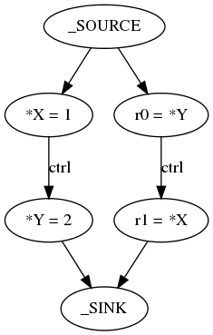
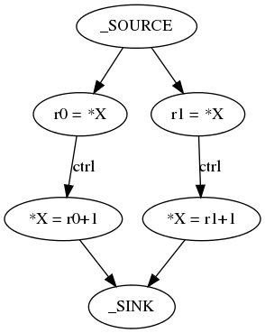
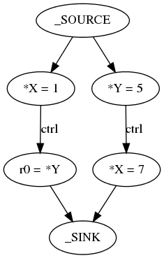

# Concurrency Semantics For TensorFlow Resource Variables

| Status        | Implemented                                          |
:-------------- |:---------------------------------------------------- |
| **Author(s)** | Sanjoy Das (sanjoy@google.com)                       |
| **Sponsor**   | Alexandre Passos (apassos@google.com)                |
| **Updated**   | 2019-06-10                                           |

This document aims to assign semantics to _concurrent accesses_ to resource variables in TensorFlow.  _Concurrent accesses_ refer to resource variable loads and stores that are not totally ordered by control or data dependencies.

The semantics presented in this doc will probably be unsurprising to people familiar with TensorFlow.  However a concrete written down semantics is a useful foundation for writing transformations and analyses over TensorFlow graphs.

We do not discuss ref variables, which are deprecated.

## Semantics

We define an _operation instance_ as a `(node, frame)` tuple, where `node` is a node in the TensorFlow graph and `frame` is a frame (see [Dynamic control flow in large-scale machine learning](https://dl.acm.org/citation.cfm?id=3190551)) in which the node was executed.

The operation instances in an execution of a graph are put in a total order such that:

1.  The total order is consistent with the partial order imposed by the control and data dependencies within the graph.  That is, if `(n1, f1)` depends on `(n0, f0)` then in the total order `(n1, f1)` will be ordered after `(n0, f0)`.
1.  The total order respects critical sections.  That is, if two nodes, `n0` and `n1` are in the same critical section, then the following total order is illegal: [(`n0`, `f0`), (`n0`, `f1`), (`n1`, `f0`), (`n1`, `f1`)].  On the other hand, the following total order is fine: [(`n0`, `f0`), (`n1`, `f0`), (`n0`, `f1`), (`n1`, `f1`)]
1.  If there are `N` graphs running in the same [TensorFlow session](https://www.tensorflow.org/api_docs/python/tf/Session), with source nodes `sub_source_i` and sink nodes `sub_sink_i`  (with `i` in `[0, N)`) then the total order is consistent with a “supergraph” with a source node that has control edges to all `sub_source_i` and a sink node that has control edges from all `sub_sink_i`.
1.  The total order is consistent with blocking semantics of TensorFlow ops.  For example if an instance of a `QueueDequeueV2` can complete only after a matching `QueueEnqueueV2` has completed then the total order cannot put the `QueueDequeueV2` instance before the `QueueEnqueueV2` instance.

Resource variable reads and writes follow sequential semantics as if they were executed in this total order.  The writes and reads themselves are atomic -- a read never sees a partial write, even when it is racing with the write.

This total order is not fixed run to run and can vary depending on various external factors like operating system thread scheduling, hardware behavior etc.

Operations that read and write resource variables at the same time, like `ResourceApplyGradientDescent`, are modeled by decomposing them into a read, compute and write sequence which does not execute atomically as a unit.  This behavior is weaker than what the executor implements and this weakening simplifies XLA’s auto-clustering.

## Examples & Consequences

### Simplest Non-Trivial Example

The graph above does two resource writes and two resource reads.  Assuming that `X` and `Y` are `0` to start with, control dependencies on the graph guarantee that _if_ `r0` is `2` _then_ `r1` is `1`.  That is, the result `r0 == 2 && r1 == 0` is disallowed.

Note that this means stores that are constrained to run in a specific order via control or data dependencies cannot be reordered.

### Resource Update Operations

Resource update operations, like `ResourceApplyGradientDescent`, are modeled as a read, compute, write sequence.  For simplicity we invent a resource update operation, `*X+=1`, that increments the tensor stored in the resource variable `X` by `1`.  With this framing, two concurrent `*X+=1` operations can be modeled as the graph below.  All total orders that are consistent with the partial order in the graph are valid.

This behavior is weaker than the memory model actually implemented by the graph executor.  Since `ResourceApplyGradientDescent` et. al. [lock out](https://github.com/tensorflow/tensorflow/blob/a53365719e445edc5b48f0877f1d85b8d5837384/tensorflow/core/kernels/training_ops.cc#L556) the resource variable being updated for the entire duration of their execution the graph executor guarantees that the two increments happen atomically and `*X` is always `2` after the graph execution.

### Load/Store Reordering

Just like two stores ordered via control dependence cannot be reordered, a load and a store ordered via control edges cannot be reordered either.  For instance, given the semantics in this document, when the execution of graph above ends if `X` is `1` then `r0` must be `5`.  This invariant breaks if we allow the `r0 = *Y` to happen before `*X = 1`.

This invariant is relevant for XLA; it means wrapping an arbitrary TensorFlow graph in an `_XlaCompile` / `_XlaRun` sequence or an `XlaLaunch` op is generally incorrect -- these XLA ops hoist all the resource variable reads to the beginning of the computation and sink all the writes to the end of the computation which may violate load/store ordering present in the TensorFlow graph.
