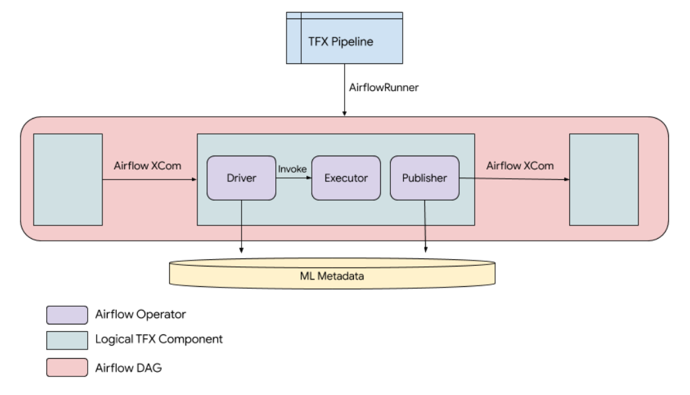
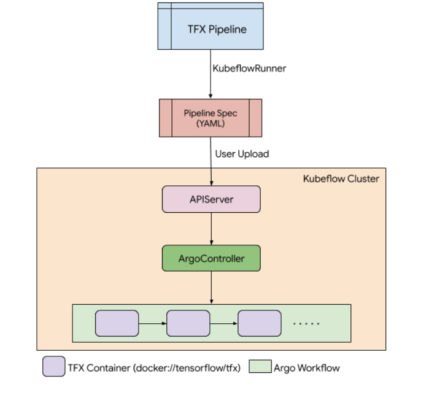
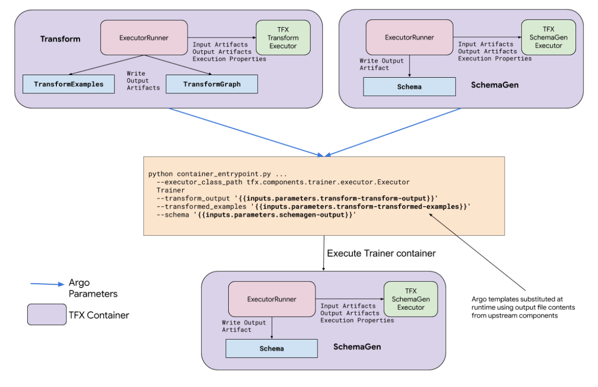
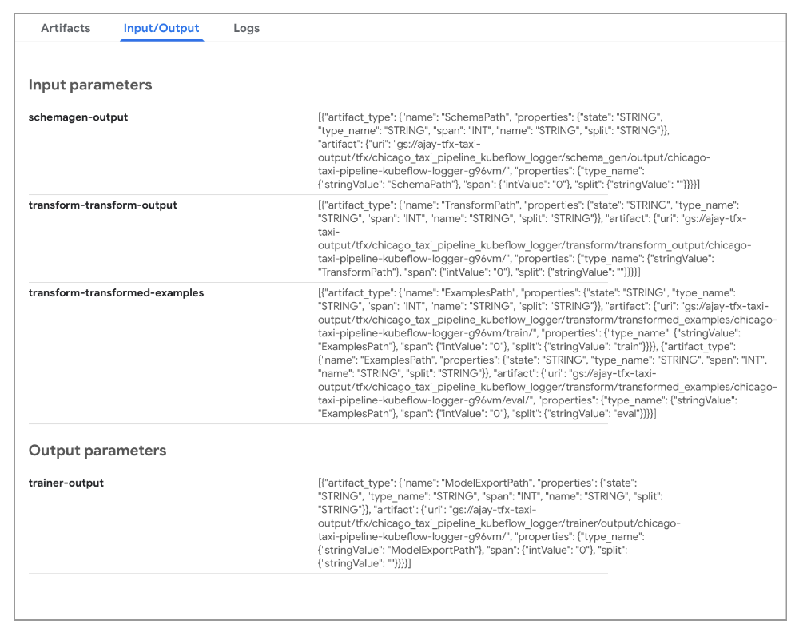
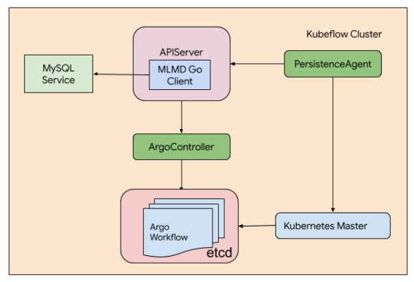

# Kubeflow Pipelines & TFX

Status        | Implemented
:------------ | :--------------------------------------------
**Author(s)** | Ajay Gopinathan (ajaygopinathan@google.com)
**Sponsor**   | Konstantinos Katsiapis (katsiapis@google.com)
**Created**   | 2019-06-30

## Objective

This RFC documents the design and engineering effort proposed by the
[Kubeflow Pipelines](https://github.com/kubeflow/pipelines) team to support
[TFX](https://www.tensorflow.org/tfx) with Kubeflow Pipelines (KFP).

TFX is an open-source effort by the TensorFlow team aimed at providing users
with tools for building production grade machine-learning (ML) workflows. TFX
provides an ML pipeline authoring framework in Python which encodes
Google’s best practices for ML pipelines, including:

*   scalable and battle-tested components
*   ML-focused pipeline design patterns
*   strongly typed artifacts
*   artifact provenance tracking through [ML Metadata](https://github.com/google/ml-metadata)

An important value-proposition of the TFX framework is that it is agnostic to
the orchestration framework. At launch, TFX supported two orchestration engines
natively:

*   [Apache Airflow](https://airflow.apache.org/) for running locally
*   [Kubeflow Pipelines](https://www.kubeflow.org/docs/pipelines/)
    for running in the cloud

This document describes how TFX pipelines are run using
Kubeflow Pipelines as its orchestration engine. It can be viewed as an extension
of the main
[TFX orchestration and configuration](https://github.com/tensorflow/community/tree/master/rfcs/20190718-tfx-orchestration.md)
design document.

## Motivation

### TFX on Kubeflow Requirements

The main focus areas for running TFX on Kubeflow were:

*   **Portability:** The user-facing code in a TFX pipeline should be portable.
    An early stated goal of our work was that we wanted the same pipeline to be
    runnable on both Airflow and KFP with a _single-line change_ in the
    pipeline construction code.
*   **Scalability:** TFX on KFP should solve the use-case of large-scale
    workloads, thereby showcasing the advantages of running on Google Cloud
    Platform (GCP). This meant enabling the use of strongly differentiating GCP
    services such as BigQuery, DataFlow and Cloud ML Engine for training and
    serving in the pipeline code.

At launch, both of these requirements were achieved. Using KFP required a
single-line change in the pipeline code, and the sample pipeline for KFP
showcased the use of GCP services for running workloads at scale.

### Overview of TFX pipelines

A TFX pipeline is a **logical pipeline** consisting of a series of components.
Each component is defined in terms of inputs, outputs, and execution properties.
Inputs and outputs are represented as channels of ML Metadata Artifacts.
Logically, each component consists of three parts:

*   `Driver`: Responsible for resolving input artifacts from the ML Metadata
    store. Determines if the execution has been previously cached and if so,
    whether the call to the `Executor` can be skipped.
*   `Executor`: Executes the main logic of the component, and provides a uniform
    interface around TFX libraries, as well as custom logic.
*   `Publisher`: Records output artifacts produced by the `Executor`, and passes
    these output artifact metadata to downstream steps.

When running a pipeline under Airflow, the logical pipeline is converted to a
series of _Airflow operators_. Each component comprises 3 operators representing
the `Driver`, `Executor` and `Publisher`:

At runtime, each `Driver` is responsible for resolving the metadata of input
artifacts for a given component from MLMD, and for determining if any previously
cached result of the component run can be used instead. If no cached result was
found, the `Driver` invokes the `Executor` which performs the main application
logic of the component. Upon completion, the `Publisher` writes the output
metadata to MLMD. In the case of Airflow, the `Publisher` operator also
publishes the same metadata for consumption by downstream components using
Apache Airflow’s
(XCom)[https://airflow.apache.org/concepts.html?highlight=xcom#xcoms] mechanism.

## Design proposal

### Kubeflow Pipelines Orchestration

KFP uses [Argo](https://argoproj.github.io/argo/) as its orchestration engine.
Argo is a Kubernetes-specific engine for orchestrating the execution of
workflows where each individual workflow step is the execution of a
containerized application. Argo employs a YAML-based specification to construct
the workflow graph, which also specifies how each container’s application should
be invoked.

Passing data from upstream components to downstream ones is accomplished via
[Argo output parameters](https://argoproj.github.io/docs/argo/examples/readme.html#output-parameters).
The output results of a component are written to named, container-local files
after every iteration. The contents of this file can then be passed as input
parameters to subsequent steps. In particular, the contents are passed as raw
strings which can be used as command-line arguments when invoking the downstream
step using a templating mechanism in the Argo specification.

In order to run a TFX pipeline on KFP, the user specifies `KubeflowRunner`
instead of `AirflowDAGRunner` in the pipeline definition file. The logical
pipeline definition itself remains unchanged, thus ensuring portability of
pipelines across orchestration engines.

In contrast to Apache Airflow, using `KubeflowRunner` and running the pipeline
file does not actually launch the pipeline. Instead, the logical pipeline is
**compiled**, resulting in a pipeline definition file in YAML, which contains
the Argo specification for a workflow that can be run on Kubernetes. The user
must then manually upload this pipeline definition file to a cluster running
Kubeflow Pipelines before it can be run.

In the Kubeflow cluster, users use an interactive UI to select and launch their
pipeline. The KFP APIServer will then submit the uploaded pipeline definition to
the **Argo controller** to orchestrate the actual workflow. The Argo
specification specifies which container to execute and which command line
invocation to use during each step.

KFP provides a [Python SDK](https://www.kubeflow.org/docs/pipelines/sdk/) for
constructing ML workflows on top of Argo. The main abstraction used is the
[ContainerOp](https://www.kubeflow.org/docs/pipelines/sdk/build-component/)
class, which can be viewed as a Python representation of a containerized
workflow step in Argo. During compilation, each TFX component in the pipeline is
transformed into a `ContainerOp`. There are three key elements of `ContainerOp`
which are used when constructing the individual steps in TFX pipelines:

*   **Image:** All TFX components are executed using the same pre-built
    [Docker image](https://hub.docker.com/r/tensorflow/tfx) which contains the
    TFX library and its dependencies.
*   **Command-line arguments:** The command-line arguments specify how the image
    should be invoked. In particular, they specify the exact TFX component and
    executor that needs to run for a given step. Metadata representing input
    artifacts are passed as arguments to a container step using Argo’s built-in
    templating mechanism.
*   **File outputs:** Argo can use the contents of container-local files
    produced within each step as input data to be passed to downstream steps.
    When the TFX container successfully completes the execution of an
    `Executor`, it writes the ML Metadata representation (that is, Artifact and
    ArtifactType protos) of output artifacts into named local files, which will
    be passed along to downstream components by Argo. This can be viewed as the
    **_publish_** step equivalent of using Airflow’s XCom mechanism.

Consider the snippet of a TFX pipeline consisting of components `Transform`,
`SchemaGen` and `Trainer`. `Transform` produces transformed examples as well as
the transform graph itself, which are consumed by the `Trainer` component.
`Trainer` also consumes the schema produced by `SchemaGen` component.

In KFP, each component is now represented as the execution of the TFX container
image. Individual components have customized command-line invocations, which are
based on their input arguments and which TFX executor to execute.
The execution of each step is controlled by instances of the
[`ExecutorRunner`](https://github.com/tensorflow/tfx/blob/master/tfx/orchestration/kubeflow/executor_wrappers.py)
base class. This class is responsible for constructing the arguments required by
all TFX executors, namely:

*   `input_dict`: A dictionary of input artifacts. These are constructed at
    runtime using the values of the Argo output-parameters that were passed in
    as inputs.
*   `output_dict`: A dictionary of output artifacts. These are pre-determined
    for each derived class of `ExecutorRunner` and specialized per-component.
*   `exec_properties`: A dictionary of runtime parameters, whose values may
    either be primitive Python types, or serialized JSON representation of
    protocol buffers.

The arguments are constructed and used to call into the specified TFX `Executor`
(for example, `tfx.components.trainer.executor.Executor`). If execution is
successful, `ExecutorRunner` writes each output artifact (as specified in
`output_dict`) and their schema types in JSON-serialized format into a container
local file. The contents of this file are then passed as ML Metadata artifacts
for consumption by downstream steps. The KFP UI visualizes both input and output
parameters for each step.

### ML Metadata Tracking

In contrast to Airflow, TFX on KFP does not have drivers and publishers.
Instead, metadata is recorded passively in KFP’s APIServer, by parsing the
status of the Argo workflow custom resource definition (CRD) periodically. Each
Argo workflow CRD status contains recorded values of Argo output parameters
(that is, the contents of the named local files) upon successful completion of
the workflow step. KFP employs a custom Kubernetes controller called
PersistenceAgent, which  periodically polls for the latest status of all Argo
workflow resources, and updates the state in the APIServer.

The APIServer parses Argo workflows and looks for Argo output parameters that
look like serialized MLMD artifacts in specially named files (by convention, the
files are named `/output/ml_metadata/{output_name}`). These artifacts and their
types are then recorded into an MLMD instance powered by the same MySQL server
that backs KFP’s persistent data.

## Future Work

While TFX on KFP works, it still does not have feature parity with the Apache
Airflow version. We are exploring the following directions concurrently to close
the gap between the two orchestrators:

*   **Metadata-driven orchestration**: The current version of TFX on KFP records
    artifacts in MLMD, but does so passively. This is due to the lack of drivers
    and publishers in the initial implementation. Hence, lineage tracking and
    caching is not currently possible.
*   **Enabling arbitrary user containers with MLMD artifacts as the interface
    between pipeline steps:** Currently, incorporating a custom step in a TFX
    OSS pipeline requires users to implement a custom executor. Users in Cloud
    frequently have an existing application, written in a non-Python language
    (such as R, Java, etc), which they would like to plug into their TFX-based
    pipeline.
*   **Unified pipeline authoring experience:** TFX and KFP both present users
    with a Python-based DSL for constructing their pipelines. The DSL constructs
    look very similar from the user’s point of view, but are fundamentally very
    different underneath. This has led to customer confusion. Unifying the DSL,
    and presenting a single user-facing experience for constructing ML pipelines
    is a goal that we’re actively exploring.
*   **Pipeline-level runtime parameters:** KFP provides the possibility of
    specifying pipeline-level parameters so users can run the same pipeline with
    different combinations of control parameters. Since the pipeline definition
    is a YAML-based file equipped with a templating mechanism, all pipeline
    runtime parameters are restricted to string types. This presents a challenge
    for specifying pipeline parameters at runtime that are not simple strings
    (for example, the number of training steps in `Trainer` is specified in a
    protocol buffer which must be serialized at runtime to be consumed by the
    component). Contrast this to the Airflow scenario, where arbitrary code can
    execute to yield runtime parameters since the pipeline definition and
    runtime environment exist in the same execution scope.

