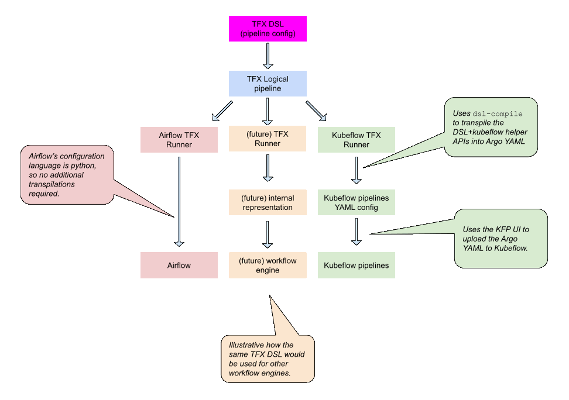
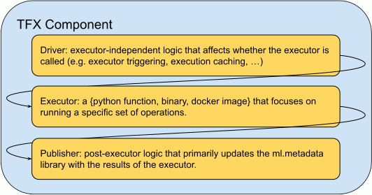
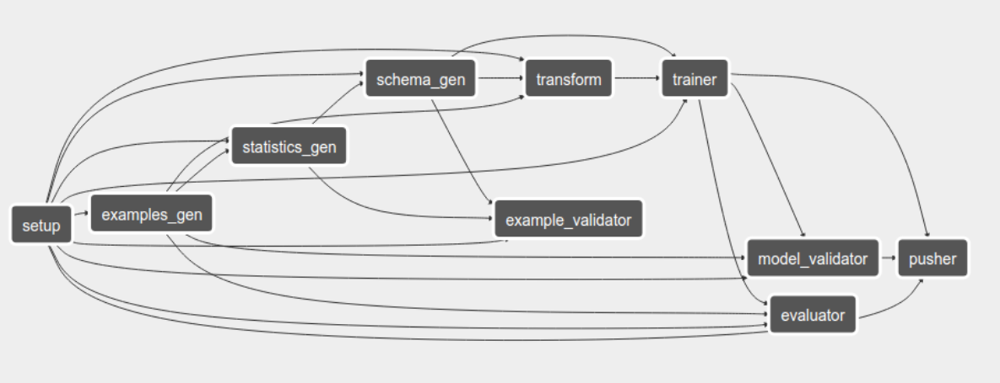

# TensorFlow Extended (TFX) orchestration and configuration

| Status        | Implemented                                         |
| :------------ | :-------------------------------------------------- |
| **Author(s)** | Kevin Haas (khaas@google.com), Zhitao Li (zhitaoli@google.com), Ruoyu Liu (ruoyu@google.com) |
| **Sponsor**   | Konstantinos Katsiapis (katsiapis@google.com)       |
| **Created**   | 2018-12-18                                          |

Note: This design document captures the initial state of the TFX design as of
Q4 2018 and is being published for historical informational purposes only. It is
not a representation of the current TFX design at the time of publication, but
rather the initial design document as proposed in Q4 2018.

## Objective

This RFC documents the initial design of TensorFlow Extended (TFX) using open
source orchestration frameworks, and defining a Python-based configuration
language (DSL).

TFX will use [Apache Beam](http://beam.apache.org) for data processing,
[ml-metadata](https://www.tensorflow.org/tfx/guide/mlmd) for artifact
management, [TensorFlow](http://tensorflow.org) for training, and will support
two OSS orchestrators ([Apache Airflow](http://airflow.apache.org) and
[Kubeflow Pipelines](https://github.com/kubeflow/pipelines/)). This is achieved
using a Python-based embedded DSL
([domain specific language](https://en.wikipedia.org/wiki/Domain-specific_language))
as an abstraction layer between the user’s pipeline configuration and the
underlying orchestrators. User pipelines will be constructed as an
implementation-agnostic Python library.

## TL;DR

*   TFX will be tightly integrated with ml-metadata for artifact tracking.
*   TFX will run on two open source orchestrators, Apache Airflow and Kubeflow
    Pipelines. It will run on a single machine as well as running at scale.
*   TFX pipelines will be configured using Python. The pipelines are also
    portable, allowing a single pipeline to be moved interchangeably between all
    open source orchestrators.
*   Wherever possible, internal TFX code will be reused for the open source TFX
    version.
*   TFX will be extensible and allows users to create their own components and
    executors to be used within a TFX pipeline.

## Motivation

### Architecture



### Overview

The goal of TFX is to allow external users to configure and run TFX pipelines
which are similar to those configured and run internally at Google. The emphasis
Note that these pipelines are similar but not identical:

*   Internal TFX pipelines are configured with service configs (protobufs),
    while external pipelines will use Python. To achieve parity, the Python DSL
    must be serializable into internal TFX service configs.
*   The internal TFX pipelines primarily use the [pubsub design
    pattern](https://en.wikipedia.org/wiki/Publish–subscribe_pattern), whereas
    the first few workflow engines targeted for orchestration are true
    orchestrators. While the pipeline DAG and the executors can be expressed
    using the same DSL, the execution of the pipeline will vary across
    orchestration and pubsub systems. Given this difference, not all
    functionality is expected to be portable across orchestrators. Ideally all
    deltas are “system internal” and do not need to be exposed to the pipeline
    authors.

Users will define their pipeline using the TFX DSL and a set of Python classes
that emulate the existing TFX protobufs. The DSL provides methods to instantiate
TFX components link the outputs of one component to the inputs of another. The
pipeline must be a [DAG](https://en.wikipedia.org/wiki/Directed_acyclic_graph)
and cycles will cause an exception to be thrown.

### Orchestration vs choreography

TFX and Kubeflow both follow a runtime design pattern generally known as
[service
orchestration](https://en.wikipedia.org/wiki/Orchestration_(computing)), which
is different from [service
choreography](https://en.wikipedia.org/wiki/Service_choreography#Service_choreography_and_service_orchestration).
While both TFX and Kubeflow have eventual plans to support both patterns, the
initial launch for each will be service orchestration.

Note: For anyone not familiar with the differences, Stack Overflow has a good
[explanation](https://stackoverflow.com/questions/4127241/orchestration-vs-choreography)
describing the differences of each.

## User Benefit

### The TFX pipeline configuration will be written in Python

Python will be used for the user-facing
[DSL](https://en.wikipedia.org/wiki/Domain-specific_language). Of the many
options to choose from (go, protos, yaml), Python was chosen due to its
popularity within the machine learning community. The TFX pipeline configuration
language will be called “DSL” for the remainder of this document.

### The DSL must be portable

The DSL must be orchestrator-agnostic, and the implementation details of the
orchestrator must not bleed up to the configuration. This will allow users to
easily migrate their pipelines across orchestrators, primarily from a local
implementation into a managed production cluster (for example, Kubeflow).

### The DSL must be extensible

As this DSL will also be used by Kubeflow, the DSL must be able to express
non-Tensorflow pipelines as well. The TFX components should be interoperable
with non-Tensorflow pipelines provided the input and output types match what the
TFX components expect.

### The DSL must be declarative

The DSL must focus on defining which operations are to be performed. The order
of operations will be determined based on data dependencies. The DSL will allow
users to configure individual components and reuse prior components’ outputs.
Some orchestrator-specific parameters may need to be configured via an external
config file.

### The DSL must support existing TFX pipelines

Wherever possible, the DSL must be capable of configuring Google-internal TFX
pipelines using the same APIs and data structures.

### Component execution must be portable

The execution of a TFX component must have the same semantics regardless of the
underlying execution environment (local, on-cloud, on-premise). This will ensure
portability of the pipeline between environments.

### Multiple orchestrators need to be supported

The initial launch of TFX is based on Apache Airflow and Kubeflow Pipelines,
both of which are
[centrally orchestrated](https://stackoverflow.com/questions/4127241/orchestration-vs-choreography).
Internally at Google, TFX also supports a
[pubsub](https://en.wikipedia.org/wiki/Publish%E2%80%93subscribe_pattern) design
pattern. Support for the pubsub orchestration pattern is intended for the
future.

The DSL must be serializable into a variety of orchestrators, including Apache
Airflow (Python-based) and Kubeflow Pipelines (argo/yaml-based). While this does
add some constraints on the orchestration functionality exposed to the DSL, this
is essential for portability as we do want TFX to be extended to additional
workflow engines as needed.

### Requirements on Orchestrator

The underlying orchestration system should support:

*   Linux, macOS and Windows;
*   Python 2.7, Python 3.5, Python 3.6, and Python 3.7;
*   Running executors/drivers in any language through subprocess and/or
    container image;
*   Local-mode and cloud execution environments, including GCP
*   Support skipping of operations, as cached artifacts from prior runs should
    not be recomputed

## Design Proposal

### Pipeline configuration

The pipeline configuration allows users to connect TFX components into a
pipeline with a high-level Python SDK that abstracts both the TFX protos and the
runtime environments (local/cloud, Apache Airflow/Kubeflow Pipelines, etc) from
the user, allowing the pipeline to be portable across all supported environments
with minimal changes. TFX leverages
[ml_metadata](https://github.com/google/ml-metadata) to provide a fully
typechecked system, where the inputs and outputs of a component are defined
using the existing TFX protos. The full definition used internally includes the
artifact names and expected types for each input or output artifact. The pipeline
config will also perform type checks on component interfaces to ensure that a
pipeline is well-constructed.

Because TFX already has a configuration API for internal usage, we will annotate
these component definitions and use code-gen to generate Python classes for each
component.

Additional helper libraries will be provided on top of components to connect
them into pipelines, which can be executed on supported orchestrators (for
example, Apache Airflow and Kubeflow).

## Detailed design

### Component

A TFX component is a wrapper around the corresponding TF/TFX libraries, and
manages existing pipeline details such as input type-checking, local/remote
worker execution, and metadata publishing. While users won’t see the internals
of a
[TFX component](https://www.tensorflow.org/tfx/guide#anatomy_of_a_component),
the components contain the following “sandwiched structure”:

*   **Driver**: The driver provides a pre-executor hook for both TFX and
    user-specific logic to be executed prior to the executor. The outcome of the
    driver may affect whether the executor runs. With the internal pubsub
    design, the driver manages the worker scheduling and monitors the actual
    work, and determines the inputs for the executor. For TFX, this task is
    performed by the workflow engine, and as a result, the drivers perform a
    different role. In both cases (orchestration and choreography), the driver
    is responsible for checking if a cached artifact already exists. If the
    artifact has already been generated using the same executor logic and input,
    the executor will be skipped and the cached artifact will be reused.
*   **Executor**: An executable, Docker image, or Python module; including
    wrappers around other TensorFlow libraries. The executor focuses on running
    a specific task. An executor performs the task with no local state
    maintained across executions. Filesystem locations of outputs are managed by
    TFX and passed down to the executor via command line flags. In some cases,
    the executor may execute functions provided by the user (for example, a
    [user-supplied preprocessing_fn](https://github.com/tensorflow/tfx/blob/master/tfx/examples/chicago_taxi_pipeline/taxi_utils.py#L106)
    for tf.transform).
*   **Metadata publisher**: [ml-metadata](http://github.com/google/ml-metadata)
    allows TFX to register the artifacts created and executions performed by
    each task to track provenance and enable further analytics on executions and
    artifacts. Component inputs and outputs are passed using artifact ids,
    ensuring all execution and artifact access is properly logged within
    ml-metadata.



The component interface is meant to be extensible to allow the open source
community to build additional components (for example, community-created
components for other machine learning libraries).

All TFX components must have strongly typed inputs and outputs. It should be
possible to connect TFX components with non-TFX components provided that the
appropriate inputs and outputs are equivalent types.

#### Driver

Driver is an optional part of the component. The responsibility of the driver is
to resolve optional inputs to the component when some inputs are neither
explicit user inputs or outputs from upstream tasks in the same execution. This
usually happens within continuous training.

Some examples how the driver will resolve ambiguous inputs:

*   The trainer component can be warm started by previous training’s checkpoints
*   The model validator component needs to resolve the
    [last blessed model](https://github.com/tensorflow/tfx/blob/master/tfx/components/model_validator/executor.py#L38)
    within the ml-metadata database and compare its evaluation metrics with
    current model
*   The pusher component needs to resolve the last pushed model to avoid a
    duplicate push to Tensorflow Serving

Drivers must implement the following interface:

```
def Driver(input_artifacts: Mapping[Text, metadata.ArtifactAndType],
           output_artifacts: Mapping[Text, metadata.ArtifactAndType],
           execution_properties: Mapping[Text, Any],
           fetch_history: Callable[[List[ArtifactAndType]], List[ArtifactAndType]])
           -> ExecutionDecision

class ExecutionDecision(object):
  __slots__ = ['input_artifacts', 'output_artifacts', 'execution_properties', execution_id']
```

It can use the `fetch_history`functor to obtain additional artifacts by type,
and augment `input_artifacts`. Drivers should be stateless, idempotent and
side-effect free Python functions so it can be easily ported among different
platforms.

We provide a _default_ driver if the component has no unresolved inputs after
pipeline construction. This usually satisfies simple one-off pipelines and can
reduce the barrier to create a custom component. In the future, users will be
able to extend the default driver with their own custom logic.

An example flow of how a driver fits in an orchestrator:

1.  Orchestrator resolves ml-metadata artifacts based on inputs from upstream
    tasks or less commonly, “external” user provided URIs;
1.  Orchestrator invokes component driver with `_fetch_history:_`
    *   Driver invokes `_fetch_history_` to fetch all `_[execution ->
        List[ArtifactAndType]] _mapping _history_mapping`._
    *   Based on `_history_mapping_`, `_input_artifacts_` and
        `_execution_properties_`, the driver either
        *   decides not to proceed to execution and skips to the _publishing the
            output to ml-metadata_ step below, **OR**
        *   decides to execute, and then augments `_input_artifacts_` and
            `_execution_properties_` accordingly.
1.  Orchestrator records a pending execution with all the inputs in ml-metadata;
1.  Orchestrator invokes the executor through Python/Docker/etc;
1.  Orchestrator publishes the outputs and executions to ml-metadata.
1.  Orchestrator records the outputs to its inter-component datastore.

#### Executor

The TFX executor is an executable, Docker image, or Python module that wrappers
and invokes TF libraries. TFX will use a common executor interface shared across
all TFX instances and add a thin wrapper on top to translate ml-metadata
artifacts into the common
[`_Do_()`](https://github.com/tensorflow/tfx/blob/master/tfx/components/base/base_executor.py#L51)
function.

Docker images containing all of the TFX components will be available. The
image(s) will have 1:1 mapped versions to the underlying PyPi packages. This
ensures that an executor always produces the same results regardless of the
environment, thus satisfies the “Execution is portable” requirement. Initially,
the executors will be based on what was shipped as part of the
[TFMA end-to-end example](https://github.com/tensorflow/tfx/tree/master/examples/chicago_taxi).
The long term goal is to open source and reuse the Google-internal TFX executors
as they become available.

##### Runtime

Common logic shared by various executors will be provided from a family of
Runtime classes, to provide an abstraction for the underlying environment so
that executors can have consistent:

*   Beam pipeline argument passing
*   Initialize logging configuration
*   Optional cloud-specific connection and runtime parameters

#### Publishing to ml-metadata

After an execution succeeds in the executor, all generated artifacts and the
execution will be **published** to ml-metadata. Only published artifacts can be
used in orchestration to avoid feeding incomplete results to downstream
executors.

Generalized publishing workflow:

1.  Ensure the executor returns with a successful return code
1.  If execution failed, mark the execution as failed in ml-metadata and skip
    all dependent downstream tasks
1.  Publish the generated output artifacts to ml-metadata
1.  Associate published artifacts with underlying execution with the component’s
    “output” attribute for consumption by dependent downstream tasks
1.  Mark the execution as **DONE** in ml-metadata

#### Type Checking

TFX is a strong-typed system, and type checking inputs/outputs of each component
is essential to the correctness of the underlying pipeline. The pipeline DSL
supports the following type checks:

##### Consistency Validation

Consistency validation ensures that output artifact type of an upstream
component matches expected type of the dependent downstream component’s input
parameter. This is implemented within the pipeline DSL level by explicitly
declaring the expected types of inputs for each component. In addition, all
artifacts generated by TFX are also strongly typed. The expected inputs and
outputs types of each component are defined by the internal TFX API component
specifications. The component specifications will not be pushed to github at the
initial launch, but will be released at a later date.

##### Parameter Type Validation

This ensures that the non-orchestrated parameters of each component have correct
type. This will be implemented by generating type hints in the codegen, allowing
us to integrate wth the
[ML Metadata’s Type System](https://github.com/google/ml-metadata) and support
more powerful type checks and semantics.

### Pipeline DSL

The following Python libraries are provided to connect components into a
pipeline and provide pipeline level configurations:

*   PipelineDecorator: A Python decorator using a context manager to register
    the pipeline being constructed in the function. Possible parameters include:

    *   pipeline_name
    *   User defined inputs:

        *   inputs for
            (ExampleGen)[https://github.com/tensorflow/tfx/tree/master/tfx/components/example_gen]
        *   Hyper-parameters
        *   user defined functions for the trainer and transform components

*   OrchestratorParameters: A family of place-holders to capture orchestrator
    specific configurations. Each supported orchestrator will sub-class this to
    allow pipeline users to configure orchestrator in the desired way. For
    Airflow this includes:

    *   ml-metadata connection config

    *   scheduling_interval if running continuously

### Orchestration

User pipelines will be constructed as an implementation-agnostic Python library.
Helper APIs will exist for the two targeted orchestrators (Airflow and
Kubeflow). The external interface for the users will be the same, so it will be
trivial for a pipeline to be moved from one orchestrator to another. This
satisfies the “DSL is portable” requirement.

#### Apache Airflow implementation

Airflow workers are named Operators, and Airflow supports a
[variety of operators](https://github.com/apache/incubator-airflow/tree/master/airflow/operators)
as part of the base install package. Of these operators, the TFX components on
Apache Airflow will use the following operators:

*   PythonOperator will be used to execute TF/TFX libraries when the pipeline is
    running in local mode, as well as any user-defined driver logic specified as
    part of the pipeline.

*   The
    [BranchPythonOperator](https://airflow.apache.org/concepts.html#branching)
    allows branches within the DAG and for the execution path to be determined
    at runtime. This approach is used as part of the artifact caching, as if the
    artifact to be generated already exists, the executor and computation of
    that artifact will be skipped. Downstream operators will continue to operate
    unaware that the computation was not recomputed.

*   The SubDagOperator facilitates composition of Apache Airflow operators into
    a single template for reuse. Currently, the TFXWorker is implemented as a
    subdag with a BranchPythonOperator (artifact caching check), an optional
    PythonOperator (the user-provided driver), and a Python/BashOperator (the
    executor).

The TFX Apache Airflow helper APIs provide the following libraries:

*   tfx_airflow.py: This file provides methods to build the Apache Airflow DAG
    from the TFX DSL as well as an Apache Airflow template for the TFX
    components. As components are defined in the TFX DSL, an internal method in
    this file will also build the DAG based on data dependencies between the
    various components.
*   tfx_types.py: deprecated in 0.12; originally used for type-checking the
    inputs. Functionality was moved to ml-metadata in 0.12.



###### Why no Kubernetes with TFX and Airflow?

While Airflow supports Kubernetes operators, we’ve chosen to use Kubeflow as the
preferred TFX-on-Kubernetes implementation.

#### Kubeflow implementation

Coming soon!

### Continuous Training

There are several requirements for continuous training:

*   There must be a mechanism for users to choose to avoid duplicated
    computation
*   The system must be able to get the status of previous runs
*   The system must provide a way to manually execute previous runs
*   The system must provide garbage collection support

We were able to fulfill the requirements above by the combination of
per-component drivers and ml-metadata integration:

*   Each driver will check for previous component runs and decide whether or not
    a new run is necessary if caching is turned on
*   If caching is turned off, the pipeline will proceed without skipping any
    component
*   Drivers in some components such as Trainer and Model Validator will fetch
    results from previous runs that are necessary for the current run. The
    driver of ExampleGen, the entrance of a TFX pipeline, will decide the data
    to process in this pipeline run.
*   We will provide Python utility function for marking artifacts as 'DELETABLE'
    when certain conditions are met, and this garbage collector can be wired as
    an optional component into a pipeline to automate the process.

A pipeline is the smallest unit to run and each component always processes the
output data (cache or uncached) from upstream components. While this is not an
asynchronous system like Google-internal TFX, it is more natural to express
continuous pipeline runs compared to continuous component runs in workflow-based
orchestration systems without losing too much flexibility.

#### Internal pipeline data representation

TFX organizes the internal pipeline data in the hierarchy of span, version and
split:

*   Span and version are monotonically increasing integers determined by
    ExampleGen driver. We also allow users to define the rule of generating span
    number through UDF support. By default, we will associate span number with
    execution time.
*   Splits are currently fixed to train and eval, but we plan to support
    customized splits through SplitConfig on split-aware components.

#### Partial Success Handling

Sometimes, a component (especially custom ones) could be a wrapper for a whole
bunch of other logic, producing multiple artifacts. If the component fails when
only part of the artifacts have been produced, this could problematic.

The proposed solution: orchestrator will keep all artifacts in _PENDING_ state
when an execution is still ongoing, and atomically publish all artifacts into
_PUBLISHED_ state only after execution successfully completes. Notice that
drivers only consider _PUBLISHED_ artifacts as valid orchestrated outputs, so a
_PENDING_ state artifact would not affect cache calculation. The downside of
this design is that the executor might waste some resources to recompute the
already successful partial output.

#### Component Hangs

For various reasons, components could be in a “hanging” state in which it is
neither dead nor making progress.

Proposed solution: Each execution of a component will be assigned a deadline,
and the executor will terminate itself with a DEADLINE_EXCEEDED status message
if work is not finished within this deadline. The deadline could be configured
to be minimum of (global deadline for current dag execution, deadline for
current component).

### Extending the Pipeline

(This is how to satisfy the “DSL must be extensible” requirement.)

There are several levels of customizations to extend a pipeline. A pipeline
author can create new executors to override the default TFX executors or create
new components to run in the TFX pipeline.

#### Custom Executor

If an existing component (defined
by same inputs and outputs) can be reused, the pipeline author could choose to provide an
alternative implementation of the executor binary when initializing the
corresponding component. The executor could either be provided in Python as a
sub-class of BaseExecutor, or a binary (docker image) supporting the same
command-line interface.

#### Custom Component

Occasionally, TFX pipeline authors will need to create custom components which
are not part of official TFX components (for example, a custom example_gen
component for other data formats). This can be achieved by providing a custom
component which can be hooked into TFX pipelines just like official components.

To implement a custom component, the component author needs to:

1.  Provide a component definition as a Python class which extends
    “BaseComponent”, or a proto definition of the component which can be fed to
    codegen
1.  Provide an executor implementation which extends a “BaseExecutor” class
1.  (Optionally) Provide a driver if the custom component requires one

The TFX team will provide supporting infrastructure:

*   Build script for packaging the executor into Docker images;
*   Abstract test class for testing component definition (mostly type checking),
    executor implementation and driver logic.

### Future work

After the initial release of TFX with 0.12, we will be exploring the following
areas:

*   Additional workflow patterns beyond Airflow and Kubeflow, including pubsub
    systems like Pulsar.
*   Apache Beam-based orchestrator.
*   Garbage collection policy.
*   Incorporating additional TFX executors as they become available.
*   Custom components and executors.
*   Support for xgboost and pytorch.
*   Composable sub-pipelines.
*   Providing a symmetric experience between on-local and on-Kubeflow-on-cloud.
*   Integration/support for a TFX frontend.

