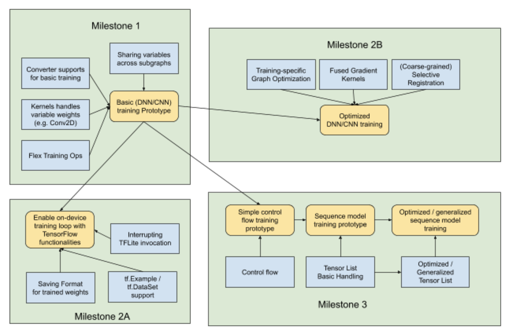
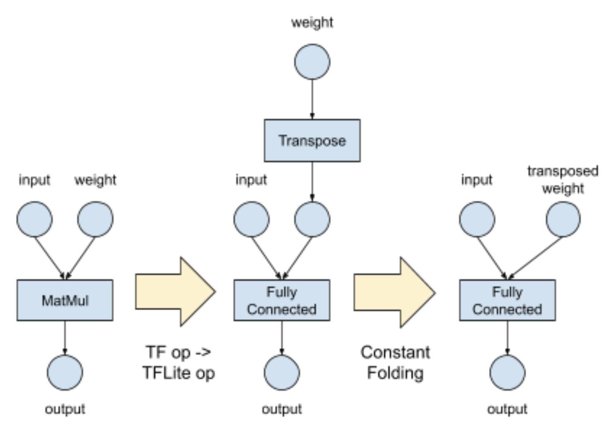
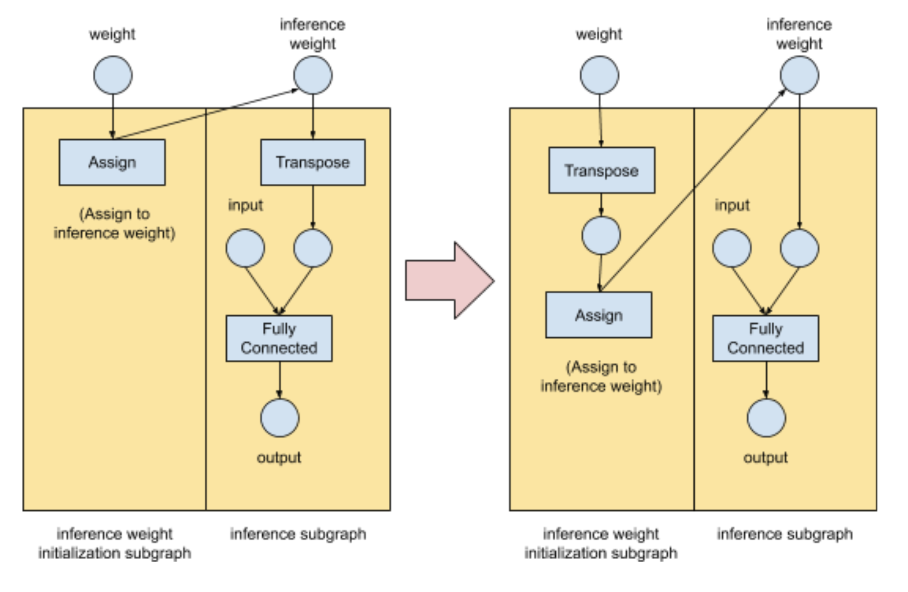

# On-Device Training with TensorFlow Lite

Status        | Accepted
:------------ | :---------------------------------------------------------------
**Author(s)** | Yu-Cheng Ling (ycling@google.com)
**Sponsor**   | Andrew Selle (aselle@google.com), Jared Duke (jdduke@google.com)
**Updated**   | 2019-07-22

## Overview & Roadmap

TensorFlow Lite is TensorFlow's recommended solution for on-device machine
learning. Initially the project focuses on inference, but more and more users
are asking for on-device training recently.

The doc scopes a multi-quarter effort to get generalized & optimized on-device
training working with TensorFlow Lite. The project can be broken down into a few
milestones:

**Milestone 1: Working prototype for basic training (e.g. fully connected / conv layers only)**<br/>
Goal: Have a working prototype to train over fully connected & convolutional layers.

**Milestone 2A: Optimized basic training**<br/>
Goal: Make inference & training performance comparable with TFMobile.

**Milestone 2B: Enable on-device training loop with TensorFlow functionality**<br/>
Goal: Encode the on-device training loop inside a TensorFlow model, with TensorFlow functionality like tf.Example and tf.data.Dataset.

**Milestone 3: Optimized & generalized training (e.g. control flow, RNN)**<br/>
Goal: Be able to train most models that are trainable with TensorFlow. Optimize the training performance for commonly used architectures.

The following diagram gives an overview of TensorFlow Lite training road map.
Yellow blocks are deliverables. Blue blocks are technical tasks to unblock the
deliverables. The details of technical tasks will be explained below.



## Goals & Non-Goals

Goals:

*   Illustrate a complete roadmap for TensorFlow Lite on-device training
*   Describe user experience of TensorFlow Lite on-device training
*   Design for functional on-device training of TensorFlow 2.x models with
    TensorFlow Lite

Non-goals:

*   Quantized training on device
*   Support TensorFlow Lite training with legacy model or TensorFlow 1.x

## User Experience

Throughout this document, **users** means developers who use TensorFlow Lite.

This section explains how users can author a TensorFlow graph, convert a
TensorFlow graph to TensorFlow Lite format, use TensorFlow Lite to run training
and inference, and test TensorFlow Lite model correctness with the proposed
design.

Note: The example defines a single TensorFlow Lite model with multiple subgraphs
for training & inference. However this isn't the only way -- You can also define
separated training model & inference model.

We're using a simplified example in this section:

*   A model with 2 convolutional layers, 2 dense layers followed by a softmax
    activation
*   The whole model is trained offline
*   The user want to retrain the 2 dense layers using personalized data on
    device

### Authoring TensorFlow graph

**Defining the model using Keras Layers**

The code defines the entire model using Keras API. Since we want to be retrain
only dense layers on device, the model is defined in 2 parts (`conv_layers` and
`dense_layers`).

```python
conv_layers = tf.keras.Sequential([
  tf.keras.layers.Conv2D(10, kernel_size=(3, 3), activation="relu"),
  tf.keras.layers.Conv2D(3, kernel_size=(3, 3), activation="relu"),
  tf.keras.layers.Flatten(),
])

dense_layers = tf.keras.Sequential([
  tf.keras.layers.Dense(50),
  tf.keras.layers.Dense(10, activation='softmax'),
])

model = tf.keras.Sequential([conv_layers, dense_layers])
```

**Creating TensorFlow Functions for training and inference**

With TensorFlow 2.0, the recommended way to use TensorFlow Lite is: Define a
TensorFlow function for each invocable behavior in TensorFlow Lite. The
converter will convert each TensorFlow function to a TensorFlow Lite subgraph,
and users can choose subgraphs to invoke.

The following code defines `inference` and `train` TensorFlow functions.

```python
@tf.function(input_signature=[
    tf.TensorSpec(shape=[None, 64, 64, 3], dtype=tf.float32)])
def inference(x):
  return model(x)

_LOSS_FN = tf.keras.losses.mean_squared_error
_OPTIMIZER = tf.optimizers.RMSprop()
@tf.function(input_signature=[
    tf.TensorSpec(shape=[None, 64, 64, 3], dtype=tf.float32),
    tf.TensorSpec(shape=[None, 10], dtype=tf.float32),
])
def train(x, y):
  with tf.GradientTape() as tape:
    prediction = model(x)
    loss = _LOSS_FN(prediction, y)
  gradients = tape.gradient(loss, model.trainable_variables)
  _OPTIMIZER.apply_gradients(zip(gradients, model.trainable_variables))
```

The `train` function can be used to train the model offline. For retraining only
dense layers, define another `train_dense_layers` TensorFlow function:

```python

@tf.function(input_signature=[
    tf.TensorSpec(shape=[None, 64, 64, 3], dtype=tf.float32),
    tf.TensorSpec(shape=[None, 10], dtype=tf.float32),
])
def train_dense_layers(x, y):
  activation = conv_layers(x)
  # Note: Gradient Tape is calculated only over the dense layers.
  with tf.GradientTape() as tape:
    prediction = dense_layers(activation)
    loss = _LOSS_FN(prediction, y)
  # Note: Gradients are only applied to trainable variables in dense layers.
  gradients = tape.gradient(loss, dense_layers.trainable_variables)
  _OPTIMIZER.apply_gradients(zip(gradients, dense_layers.trainable_variables))
```

Note that `tf.GradientTape` is calculated over only the dense layers, and
`tape.gradients` are only applied to `dense_layers.trainable_variables` too.

Though this example is simple, it's easy to extend it to support complex use
cases. For example:

*   To retrain dense layers from scratch instead of fine-tuning, define a
    `reset_dense_weights` function to reinitialize dense layer weights to zero
    or small random values
*   Returns loss when training
*   Add a function for evaluating model quality
*   Add dropout layers which only exists in training graph...etc

### Converting Training Model to TensorFlow Lite

After training the model, users can choose a few TensorFlow functions to convert
to TensorFlow Lite. The TensorFlow Lite Converter 2.0 will expose an API that
looks like:

```python
tf.lite.TFLiteConverter.from_concrete_functions(
    [func.get_concrete_function()
     for func in [inference, train_dense_layers]])
```

In this case, it's only required to run inference or train dense layers, so only
`inference` and `train_dense_layers` functions are exported. If it's required to
train the whole model on device, add the `train` function when converting.

### Using the Model in TensorFlow Lite runtime

There's an ongoing design effort to add enable users to call different subgraphs
in a TensorFlow Lite model. Tentatively the usage may look like:

```
Interpreter interpreter = Interpreter(...);
{
  auto subgraph = interpreter.SelectSubgraph("train_dense_layer");
  subgraph.SetInputTensor(0, training_feature);
  subgraph.SetInputTensor(1, training_label);
  subgraph.Invoke();
}
{
  auto subgraph = interpreter.SelectSubgraph("inference");
  subgraph.SetInputTensor(0, inference_feature);
  subgraph.Invoke();
  auto result = subgraph.GetOutputTensor(0);
}
```

Regardless of how the new API design look like, users should be able to choose
to run `train_dense_layer` or `inference` subgraph.

### Testing TensorFlow Lite Model correctness

On-device training is complex and it can be hard to troubleshoot. TensorFlow
Lite should provide guidelines and tools to make this easy. The core idea is: If
each TensorFlow function is converted to a TensorFlow Lite subgraph without
changing semantics, it will be easy to test TensorFlow and TensorFlow Lite
functionality side by side.

In addition to the common ML testing best practices, there are a few specific
suggestions for TensorFlow Lite on-device learning:

*   **Test all functions in TensorFlow** before converting to TensorFlow Lite.
    In this use case, in addition to testing `inference` and `train`, also test
    if `train_dense_layers` since it's used on device. If it doesn't work well
    in TensorFlow, it can't possibly work well in TensorFlow Lite. Check if
    there are any coding error, or you may need to tune the model structure or
    hyperparameter.
*   **Use model diff testing tool to test all functions**. TensorFlow Lite now
    has a tool which feeds the same random data into TensorFlow and TensorFlow
    Lite, and compare if the results are close enough in a threshold. The model
    should be extended to handle multiple subgraphs (including training and
    inference subgraphs) and variables. This is an end to end test which can
    capture kernel bugs or TensorFlow/TensorFlow Lite discrepancy.

## Implementation details for basic training

There is nothing magical in training. Technically, training is doing a series of
**mathematical computation** (requiring these op kernels), and update the weight
**variables** which is **accessible by other (inference) subgraphs**. The
converter also needs to be changed, to support and optimize training use cases.

### Sharing variables across subgraphs

For the variable requirement of TensorFlow Lite training, the high level goals
are:

*   Convert TensorFlow Resource Variables to TensorFlow Lite, and preserve the
    same semantic
*   Able to share variables between multiple TensorFlow Lite subgraphs

We propose to define variables in TFLite that have similar semantics to resource
variables in TensorFlow:

*   Use int32 tensor to represent variable ID in TFLite instead of defining a
    resource type
*   Only 2 ops are required to make it work: `AssignVariableOp` and
    `ReadVariableOp`
*   Other ops can be added into TFLite when necessary

### Gradient and optimizer operations

To train a model, it's required to compute **gradients**, and apply the gradient
to trainable variables with **optimizers** (e.g. SGD, ADAM...etc). Technically,
gradients and optimizers are just some mathematical computation and variable
read/write operations. When constructing training graphs in TensorFlow,
sometimes a single fused op is used (e.g. `ReluGrad`), and sometimes it produces
multiple regular ops in unfused form (e.g. `Mul`, `MatMul`, `Add`) to compute
the gradient of one op.

Today TensorFlow Lite doesn't have these training-specific ops. The following
approaches are considered to run training ops in TensorFlow Lite:

**Add training ops into Flex runtime (initial implementation)**<br/>

Note: "Flex" is the code name for
[Select TensorFlow operators to use in TensorFlow Lite](https://www.tensorflow.org/lite/guide/ops_select)
project, which enables using TensorFlow kernels in TensorFlow Lite directly.
Throughout the document, it will be referred as "Flex" to be concise.

This is the easiest approach: Just whitelist these training ops to Flex whitelist. However this means Flex runtime is required for training (bloating binary size), and Flex kernels are not optimized for mobile.

**Implement fused ops as TensorFlow Lite builtin ops (optimization)**<br/>
We can implement these fused ops as TensorFlow Lite builtin ops. This further
enables optimizing for mobile devices (e.g. writing optimized SIMD CPU kernels,
writing GPU delegate...etc). This may need a significant amount of work.

**Unfusing fused gradient ops (alternative considered)**<br/>
Another interesting thought: Most ops' gradients are representable by
combining simple mathematical calculation. For example, `ReluGrad`
 can be written using TensorFlow Lite builtin ops `Less` and `Where`.

This can be done by writing graph transformation rules in TensorFlow Lite
converter. However, the performance may not be as good as fused ops. It's more
worthwhile to put the effort into writing fused builtin ops.

### TensorFlow Lite Converter

It requires a few changes in TensorFlow Lite Converter to support training. The
API change to support multiple functions is already discussed in example section
above.

In addition, TensorFlow Lite converter **should stop freezing variables which
are written by exported functions**. Currently, the converter always freezes all
variables when converting (all variables are converted to constants). This is
fine for inference-only use case. For training, these variables should not be
converted to constants, so TensorFlow Lite can further modify the variables on
device.

In the example used in "User Experience" section above:

*   If only `inference` function is exported, all weights should be frozen.
*   If `train_dense_layers` is exported, only `conv_layers` variables should be
    frozen.
*   If `train` is exported, all variables should not be frozen.

Freezing has another important purpose: Once a variable becomes a constant, it
can be further optimized by constant folding. The implementation described so
far makes on-device training work, but **inference will be slower than the
original graph**. This leads to the next topic: How to **optimize both training
and inference** when training is enabled.

## Implementation details for related areas

### Graph Transformation and Optimization

For optimization purposes, sometimes TensorFlow Lite and TensorFlow have
different op semantics. Some ops takes transposed weights (e.g. `FullyConnected`
and `Conv2D`), and some weights are split or merged. For example, TensorFlow a
`MatMul` op will be converted to TensorFlow Lite `FullyConnected` op, with the
2nd input transposed:

```
TFMatMul(lhs, rhs) == TFLiteFullyConnected(lhs, transpose(rhs))
```

In practice, the 2nd input of `MatMul` is often a trained weight variable.
TensorFlow Lite converter will first convert TensorFlow ops to TensorFlow Lite
ops and add ops like `Transpose` or `ReorderAxis` in the same transformation
rule. If it's converted to a constant, In TensorFlow Lite converter can further
perform constant folding and optimize the execution:



However, the constant folding step can't be done if the weights are not frozen,
and the `Transpose` op will remain in the graph. This means **enabling training
may significantly slow down inference** if we don't optimize this case.

Ideally we want to optimize the inference subgraph to make the structure the
same as when training is disabled. In high level, one way to achieve this is:

*   Allow converter to define new `inference_weights` variable, which may be
    different from weights
*   Define a subgraph to initialize `inference_weights` from `weights`. Start
    from a simple assignment
*   Implement specialized graph transformation rules to move complexity from
    inference graph to initialization graph



### Control Flow

Control flow is not required for basic training. However it's useful in the
following cases:

*   **Train models with control flow**: For a model with control flow, control
    flow ops are required for both inference and training. E.g. It requires `If`
    to compute the gradient of `If`, and it requires `While` loop to compute the
    gradient of `While`.
*   **Run training loops** inside TensorFlow Lite models: To train a model, it's
    usually required to invoke the training step multiple times. It's doable by
    writing a loop in application code to invoke the training subgraph multiple
    times. It can also be implemented by using a `While` op to iterate over the
    training data.

The detailed design of supporting control flow in TensorFlow Lite is at
[This RFC](https://github.com/tensorflow/community/pull/83).

### Tensor List

Tensor List is not required for basic training. However it's important for
training models with control flow loops.

Whenever there are loops (e.g. While) in the inference graph, Tensor List is
usually required to train the model. Even if Tensor List ops aren't in the
original inference graph, when constructing the training graph, Tensor List ops
are often added automatically to memorize intermediate values, for computing
gradients over the loop.

Tensor Lists can also be used without loops but this rarely happens. In this
case, Tensor List ops are required for inference and training.

### Saving Format

In TensorFlow, users can use `tf.Session` to train a model, and use `tf.train.Saver` to save the trained weights into TensorFlow checkpoint files.

This proposal enables training with TensorFlow Lite interpreter (which is similar to `tf.Session`). In addition, we can provide utility classes (similar to `tf.train.Saver`) to save the trained format, or users can get the raw data of variables and save it by themselves.

A few approaches to handle variable saving are described below. In the near term we will focus on the recommended approach. However, note that these approaches are not conflicting with each other, so it's possible to implement multiple of these.

**Approach 1: Reuse TensorFlow CheckPoint format [recommended]**

Pros:
*   Interoperability: It's potentially easier to load a TensorFlow trained weights into TensorFlow Lite, and vice versa.
*   Avoid designing yet another format.

Cons:
*   Currently the TensorFlow checkpoint parsing code is coupled with TensorFlow core. We may need to refactor and decouple with TensorFlow core, or rewrite the parser.

**Approach 2: Write the variable value back to TensorFlow Lite model**

Pros:
*   Use the existing TensorFlow Lite format. Avoid introducing another format.

Cons:
*   Need to ship the FlatBuffer writer code into the binary.
*   Have to write the entire model (which may contain other huge frozen constants) back to storage.
*   Low interoperability with TensorFlow checkpoints

**Approach 3: Implement TensorFlow Lite's own variable saving file format**

Pros:
*   This can be an extremely simple key-value mapping format

Cons:
*   Requires defining yet another format
*   Low interoperability with TensorFlow checkpoints

### Feeding data with tf.Example / tf.data.Dataset

`tf.Example` and `tf.data.Dataset` are technically not training-specific
requirements. These features can also be used in inference.

The basic training can work by feeding the raw data (e.g. float values) into
TensorFlow Lite interpreter. On top of this, we can support tf.Example and
tf.data.Dataset to make this easier to use (likely via Flex runtime). There may be a
performance drawback using these features.

### Selective Registration

Initially we will need to rely on Flex runtime to execute some of the fused
gradient ops. This requires to add the gradient op kernels to Flex runtime, and
it will bloat up the Flex binary size.

We also plan to implement fused training ops as TensorFlow Lite builtin ops.
These kernels are not useful if training features are not used.

We aim to make TensorFlow Lite small, and developers who only run inference
shouldn't get gradient kernels. This makes selective registration (being able to
link only required op kernels) more important.

This can be done in either of 2 ways:

*   Coarse-grained: Have 2 build targets for each of the TensorFlow Lite / Flex
    library. One is inference-only, and the other is inference+training
*   Fine-grained: Only include the op kernels which are exactly used.

The coarse-grained approach is good enough for the initial version of training.
Fine-grained selective registration is a nice improvement for the future.
