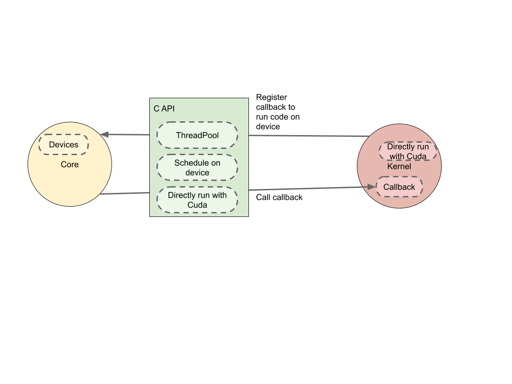

# Kernel and Op Implementation and Registration API

| Status        | Proposed                                             |
:-------------- |:---------------------------------------------------- |
| **Author(s)** | James Ring (sjr@google.com), Anna Revinskaya (annarev@google.com) |
| **Sponsor**   | Günhan Gülsoy (gunan@google.com)                                  |
| **Updated**   | 2019-08-14                                                        |

## Objective

Tensorflow (TF) currently provides a C++ API for implementing kernels and ops.
The Voltron project aims to create a modular/plugin-based TF implementation with
API and ABI surfaces. Plugins will be able to create and register custom kernel
and op implementations.

In order to provide a stable ABI, the Voltron team has chosen to provide C APIs
to plugin authors. This document introduces the C API for op and kernel
registration. For authors who wish to continue using C++ to interface with
TensorFlow, an ABI-stable C++ header-only API is provided.

## Motivation

Presently, there is no ABI-stable API for extending TensorFlow with new kernels
and ops. There is no guarantee that a plugin written with one compiler will work
with a version of TensorFlow built with another, even on the same operating
system and architecture. This makes it difficult to distribute plugins without
also distributing the source code and requiring end-users to build the plugin
alongside TensorFlow.

An ABI-stable API for extending TensorFlow will simplify the distribution of
plugins and allow plugin authors to distribute binary artifacts without
necessarily publishing plugin source code.

## User Benefit

Plugin authors will be able to publish plugins that users can use more easily.
In turn, the TensorFlow community will benefit from an increase in the number of
variety of available plugins.

## Design Overview

In general, the kernel and op registration C APIs aim to permit the
implementation of any kernel or op that is currently possible with the C++ API.
Where possible, existing C++ function implementations are reused from within a C
wrapper. The purpose of the wrapper is simply to provide ABI stability.

Since plugins will be dynamically loaded (e.g. via `dlopen` on POSIX), the API
avoids relying on static initialization.

The intention is that existing kernels should be able to be ported to the new
APIs with a minimum of reimplementation effort. This precludes a from-scratch
re-imagining of TensorFlow APIs.

The following diagram describes the components built with the proposed C and C++
APIs.

                    +----------------+ <--+
                    |                |    |
                    | Plugin         |    |
                    |                |    |
                    +----------------+    |
                    |                |    |
                    | C++ header API |    |  Plugin
                    |                |    |  my_plugin.so
               +--> +----------------+    |
               |    |                |    |
               |    | C API headers  |    |
               |    |                |    |
               |    +----------------+ <--+
               |    |                |
               |    | C API impl     |
       Core    |    |                |
    Tensorflow |    +----------------+
    libtf.so   |    |                |
               |    | Core C++ APIs  |
               |    |                |
               +--> +----------------+

In this example, there are two object files: `my_plugin.so` and
`libtensorflow.so`. `my_plugin.so` is implemented in terms of the C++
header-only API, which is in turn implemented in terms of the C API headers. The
C API implementation is provided by TensorFlow at runtime when it loads the
plugin's shared object.

This design addresses changes that are required to the existing C API that are
required to support op and kernel plugins. It also introduces the C++
header-only API, which currently does not exist.

## Ops

This section introduces changes to the C API that are required to support ops.
An alpha version of this API is already checked in at `tensorflow/c/ops.h`.

### Registration

In the C++ API, ops are registered at static initialization time using the
`REGISTER_OP` macro. For example:

```c++
REGISTER_OP("Bitcast")
  .Input("input: T")
  .Output("output: type")
  .Attr("T: {bfloat16, ...}")
  .Attr("type: {bfloat16, ...}")
  .SetShapeFn([](InferenceContext* ctx) { ... })
  .Doc("A bitcast operator");
```

The equivalent C API will be a series of functions that operate on
`TF_OpDefinitionBuilder *`, a pointer to an opaque struct (i.e. a struct whose
content is not made known to the user). The functions include, but are not
limited to:

* `TF_OpDefinitionBuilder* TF_NewOpDefinitionBuilder(const char* op_name)`:
  constructs and returns a new op registration builder for an op with the given
  name

* `void TF_OpDefinitionBuilderAddAttr(TF_OpDefinitionBuilder* builder, const
  char* attr)`: adds the given attribute to the builder (equivalent to `Attr`
  above)

* `void TF_OpDefinitionBuilderAddInput(TF_OpDefinitionBuilder* builder, const
  char* input)`: adds the given input to the builder (equivalent to `Input`
  above)

Additional functions are provided for setting other properties of the operation
(e.g. `TF_OpDefinitionBuilderSetIsCommutative`).

Registration is then actually performed using the `TF_RegisterOpDefinition`
function. This function populates a `TF_Status` indicating whether registration
was successful and frees the resources associated with the op definition
builder.

The C equivalent of the bitcast op registration example above is shown below:

```c++

#include "tensorflow/c/ops.h"

void InferBitcastShape(TF_ShapeInferenceContext* ctx,  // see the section below on
                       TF_Status* status);             // shape inference

void InitPlugin() {
  TF_OpDefinitionBuilder* b = TF_NewOpDefinitionBuilder("Bitcast");
  TF_OpDefinitionBuilderAddInput(b, "input: T");
  TF_OpDefinitionBuilderAddOutput(b, "output: type");
  TF_OpDefinitionBuilderAddAttr(b, "T: {bfloat16, ...}");
  TF_OpDefinitionBuilderAddAttr(b, "type: {bfloat16, ...}");
  TF_OpDefinitionBuilderSetShapeInferenceFunction(b, &InferBitcastShape);

  TF_Status* status = TF_NewStatus();
  TF_RegisterOpDefinition(b, status);
  if (TF_GetCode(status) != TF_OK) { /* handle errors */ }
}

```

### Shape Inference

A significant feature of certain ops is their ability to infer their output
shapes. TensorFlow will invoke the registered shape inference function (if one
is provided) when it needs to know the op's output shape. The registration
function declaration is shown below:


```c++
void TF_OpDefinitionBuilderSetShapeInferenceFunction(
  TF_OpDefinitionBuilder* builder,
  void (*shape_inference_func)(TF_ShapeInferenceContext* ctx, TF_Status* status));
```

A series of functions prefixed with `TF_ShapeInferenceContext` is provided for
the following purposes:

* Examining operator input shapes (`TF_ShapeInferenceContextGetInput`)

* Creating and deleting shape and dimension handles (`TF_{New,Delete}ShapeHandle`, `TF_{New,Delete}DimensionHandle`)

* Manipulating shape and dimension handles (`TF_ShapeInferenceContextWithRank`, `TF_ShapeInferenceContextDim`)

In general, C analogues to the C++ methods in `tensorflow::shape_inference`
(see `tensorflow/core/framework/shape_inference.h`) will be provided.

## Kernels

This section introduces changes to the C API that are required to support
kernels. An alpha version of this API is already checked in at
`tensorflow/c/kernels.h`.

### Registration

Kernel registration with the C++ API is accomplished with the
`REGISTER_KERNEL_BUILDER` macro. This macro expands to code that relies on
static initialization to register the provided kernel with the global kernel
registry. See below for an example of registering a kernel with the C++ API:

```c++

#include "tensorflow/core/framework/op_kernel.h"

class BitcastOp : public OpKernel {
  explicit BitcastOp(OpKernelConstruction* context) : OpKernel(context) { … }
  void Compute(OpKernelContext* context) override { … }
};

REGISTER_KERNEL_BUILDER(Name("Bitcast").Device(DEVICE_CPU), BitcastOp)
```

The equivalent C API provides a series of functions that operate on
`TF_KernelBuilder`, an opaque struct obtained with the `TF_NewKernelBuilder` call.
The kernel builder is registered with TensorFlow using the
`TF_RegisterKernelBuilder` function. See below for an example of registering
the bitcast kernel using the C API:

```c++
#include "tensorflow/c/kernels.h"

typedef struct bitcast_kernel { … } bitcast_kernel;

// Bitcast_Create, Bitcast_Compute and Bitcast_Delete actually implement the
// kernel. See the section below for discussion on kernel implementation.
static void* Bitcast_Create(TF_OpKernelConstruction* context) {
  bitcast_kernel* k = (bitcast_kernel*) calloc(1, sizeof(bitcast_kernel));
  /* initialize the fields of k as needed */
  return (void*) k;
}

static void* Bitcast_Compute(void* k, TF_OpKernelContext* context) {
  bitcast_kernel* kernel = (bitcast_kernel*) k;  // this is the pointer returned by
                                                 // Bitcast_Create
  /* compute the result */
  TF_SetOutput(context, ...);
}

static void Bitcast_Delete(void *k) { free(k); }

void InitPlugin() {
  TF_KernelBuilder* builder = TF_NewKernelBuilder(/*op_name*/"Bitcast", DEVICE_CPU,
      &Bitcast_Create, &Bitcast_Compute, &Bitcast_Delete);
  TF_Status* status = TF_NewStatus();
  TF_RegisterKernelBuilder(/*kernel_name*/"Bitcast", builder, status);
  if (TF_GetCode(status) != TF_OK) { /* handle errors */ }
  TF_DeleteStatus(status);
}
```

The registration function prototypes are provided below. Kernel authors must
provide a compute function. Creation and deletion functions are optional, but
if a creation function is provided that causes memory allocation, a deletion
function that frees the memory should also be provided, otherwise a leak will
occur.

```c++
TF_KernelBuilder* TF_NewKernelBuilder(
  const char* op_name, const char* device_name,
  void* (*create_func)(TF_OpKernelConstruction*),
  void (*compute_func)(void*, TF_OpKernelContext*),
  void (*delete_func)(void*));

void TF_RegisterKernelBuilder(const char* name, TF_KernelBuilder* builder,
                              TF_Status* status);
```

### Implementation

The main classes for C++ kernel implementations are `OpKernelCreation`
(provided by TensorFlow to the kernel constructor) and `OpKernelContext`
(provided to the kernel's `Compute` method). The analogues in the C API are
`TF_OpKernelCreation` and `TF_OpKernelContext`. The aim of the C API is to
provide functions for working with these structs that match, as closely as
possible, the C++ API.

### Inputs and Outputs

Kernels must be able to retrieve their inputs and provide outputs. In the C++
API, the tensorflow::OpKernelContext::GetInput and SetOutput family of
functions provide this functionality. The equivalent C calls will be
`TF_GetInput` and `TF_SetInput`. These functions operate on `TF_Tensor`, which
is already part of the existing TensorFlow C API.

String tensors will be supported in an ABI-stable way. This will require
changes to their binary representation described in the [tstring design
document](https://github.com/tensorflow/community/blob/master/rfcs/20190411-string-unification.md).

## C++ Header-Only API

As described above, the main motivation for providing a C API is ABI stability.
However, some programmers may find the C API less convenient than the
non-ABI-stable C++ API. To address this concern, we plan to provide a
header-only C++ API that is implemented in terms of the ABI-stable C API. This
API will contain classes such as `Tensor`, `OpKernelContext`, and
`OpKernelConstruction`, whose names will be familiar to existing C++ API users.
Ideally, this API will be as close as possible to the existing non-ABI-stable
Tensorflow C++ API, so that kernels and ops currently implemented in C++ may be
ported to the ABI-stable C++ with as little implementation churn as possible.

## Device C API for Kernels

So far, this document has not dealt with the challenges of providing an
ABI-stable API for kernels that run on GPUs. This section describes an API that
addresses these challenges.

There are a few approaches to running kernels on GPUs:

* Assign computation to Eigen device (for e.g. see `OneHot`, `Transpose`,
  training ops). (>200 occurrences in TensorFlow)

* Call `device.parallelFor` (for e.g. see `BatchSelect`). (4 occurrences)

* Call `ThreadPool::ParallelFor` (for e.g. see `MatrixDiag`). This is a
  TensorFlow wrapper that eventually wraps calls to Eigen. For example,
  `ThreadPool::ParallelFor` calls `device.parallelFor` in Eigen. (29
  occurrences)

* Call `Shard` (e.g. `CTCGreedyDecoder`). This approach is deprecated in favor
  of `ThreadPool::TransformRangeConcurrently` but no kernels use the latter yet.
  (42 occurrences)

* Call `GpuLaunchKernel` or `CudaLaunchKernel` directly, i.e. without calling Eigen.
(58 occurrences)

* `Matmul` op calls directly to `StreamExecutor`.

* Possibly others

In all approaches above, TensorFlow core is responsible for maintaining
respective device queues, streams or pools. Kernels then use these queues to
schedule computation. Therefore, our primary goal is to implement a C API that
enables this scheduling. To give an example, one approach we can take is have
Kernel pass a callback across C API. Tensorflow core would then call this
callback. See diagram below:



Furthermore, note that most of the approaches listed above eventually call to
Eigen to parallelize and forward computation to device. For example, the first
approach above uses Eigen APIs directly. Consequently, we need to understand how
Eigen works with devices and in some cases make changes to Eigen codebase as
well.

Finally, we should aim to create a smaller API. Some of the approaches listed in
the Background section seem to be very similar. For example, calling
`parallelFor` in Eigen is quite similar to calling into
`ThreadPool::ParallelFor`. Therefore, we will only provide C API equivalents for
the following:

* `ThreadPool` and its methods.

* `CudaLaunchKernel` function.

* Computation assignment to device in Eigen.

This proposal focuses on these 3 components for now. Due to the complexity and
variety of TensorFlow kernels, it is very likely that we will need to consider
more approaches going forward. For example, how `MatMul` op would call
`StreamExecutor` directly has not been investigated.

### ThreadPool API

Here, we can just wrap relevant methods in the `ThreadPool` class.

```c++
TF_CAPI_EXPORT extern void TF_ThreadPool_Schedule(
    TF_OpKernelContext* context,
    void (*fn)());

TF_CAPI_EXPORT extern void TF_ThreadPool_ScheduleWithHint(
    TF_OpKernelContext* context,
    void (*fn)(),
    int start,
    int limit);

TF_CAPI_EXPORT extern void TF_ThreadPool_ParallelFor(
    TF_OpKernelContext* context,
    int64_t total,
    int64_t cost_per_unit,
    void (*fn)(int64_t, int64_t));

TF_CAPI_EXPORT extern void TF_ThreadPool_ParallelForWithWorkerId(
    TF_OpKernelContext* context,
    int64_t total,
    int64_t cost_per_unit,
    void (*fn)(int64_t, int64_t, int));
```

Note that we just pass a `TF_OpKernelContext` instead of a `ThreadPool`
instance. Implementation of these interfaces on the TensorFlow core side can
then retrieve the actual ThreadPool object using:

```c++
OpKernelContext* ctx = reinterpret_cast<OpKernelContext*>(context);
auto thread_pool =
       cxt->device()->tensorflow_cpu_worker_threads()->workers;
```

For details on how we plan to switch between `std::function<void>` and `void
(*fn)()`, see Appendix 1 below.

### Device Assignment API

This approach lets us construct device objects (e.g. `Eigen::GpuDevice`) on the
plugin side. Basically, we get an Eigen device object and can apply any
operations we currently apply to an Eigen device.

We could wrap `Eigen::StreamInterface`, `Eigen::ThreadPoolInterface` and `Eigen::Allocator`. These
wrappers will consist of a C API and a C++ wrapper on top of the C API. A
sample C API for `StreamInterface` is given below:

```c++
TF_CAPI_EXPORT extern TF_EigenStream* TF_GetEigenStreamHandle(
    TF_OpKernelContext*);
TF_CAPI_EXPORT extern gpuStream_t* TF_EigenStream_GetCudaStream(
    TF_EigenStream*);
TF_CAPI_EXPORT extern gpuDeviceProp_t* TF_EigenStream_GetDeviceProperties(
    TF_EigenStream*);
TF_CAPI_EXPORT extern void* TF_EigenStream_Allocate(
    TF_EigenStream*, size_t num_bytes);
TF_CAPI_EXPORT extern void TF_EigenStream_Deallocate(
    TF_EigenStream*, void* buffer);
TF_CAPI_EXPORT extern void* TF_EigenStream_Scratchpad(
    TF_EigenStream*);
TF_CAPI_EXPORT extern int* TF_EigenStream_Semaphore(
    TF_EigenStream*);
// This would just delete the C API handle for TF_EigenStream.
TF_CAPI_EXPORT extern TF_EigenStream* TF_DeleteEigenStreamHandle(
    TF_EigenStream*);
```

The following C++ API will wrap the C API to provide a `StreamInterface` implementation
on the kernel plugin side:

```c++
class EigenGpuStream : public Eigen::StreamInterface {
 public:
  EigenGpuStream(TF_EigenStream* eigen_stream) :
      eigen_stream_(eigen_stream) {}

  const gpuStream_t& stream() const override {
    return TF_EigenStream_GetCudaStream(eigen_stream_);
  }

  const gpuDeviceProp_t& deviceProperties() const override {
    return TF_EigenStream_GetDeviceProperties(eigen_stream_);
  }

  void* allocate(size_t num_bytes) const override {
    return TF_EigenStream_Allocate(eigen_stream_, num_bytes);
  }

  void deallocate(void* buffer) const override {
    return TF_EigenStream_Deallocate(eigen_stream_, buffer);
  }

  virtual void* scratchpad() const override {
    return TF_EigenStream_Scratchpad(eigen_stream_);
  }

  virtual unsigned int* semaphore() const override {
    return TF_EigenStream_Semaphore(eigen_stream_);
  }

 private:
   TF_EigenStream* eigen_stream;
};
```

Now, a kernel can create an instance of `Eigen::GpuDevice` using this stream:

```c++
TF_EigenStream* eigen_stream = TF_GetEigenStream();
Eigen::GpuDevice* device = Eigen::GpuDevice(EigenGpuStream(eigen_stream));
...
tensor->device(device) = < computation >
...
TF_DeleteEigenStreamHandle(eigen_stream);
```

Note: `gpuStream_t` and `gpuDeviceProp_t` might be aliased to ROCm's objects
instead of Cuda structs. See Appendix 2 for details how we are going to handle
ROCm support.

Wrapping `Allocator` using similar approach should be trivial. However,
`ThreadPoolInterface` takes `std::function<void()>` and this approach would
require passing `std::function` across C API, which is non-trivial. For details
how we are going to handle it see Appendix 1.

### Alternative for GPU Device Assignment API

We can take approach similar to the CPU device assignment API. On the CPU side,
corresponding Eigen object - `ThreadPoolInterface` - has a `Schedule` method. This
method schedules a kernel function in a thread pool.

Similarly, we can add a `Launch`/`Schedule` function to `StreamInterface`. The
default implementation would have same behavior as `LAUNCH_GPU_KERNEL` in
Eigen. However, we can customize it on the TensorFlow side and implement launch
logic in core TensorFlow instead of the kernel. This way, `cudaStream_t` and
`hipStream_t` only need to be referenced in core.

<!-- TODO: add examples that are currently only available internally -->

Advantages of this approach:

* Don't need to pass `hipStream_t` and `cudaStream_t` across the API boundary.

* Supports customization of the `launchKernel` call which might be useful if we
  want to handle it differently later.

Disadvantages of this approach:

* More invasive change to Eigen.

### CudaLaunchKernel API

CudaLaunchKernel appears to be a fairly thin wrapper around `cudaLaunchKernel`
in the Cuda Runtime library and a part of their C API.

For reference, this is the signature of `cudaLaunchKernel`:

```c++
extern __host__ cudaError_t CUDARTAPI cudaLaunchKernel(
    const void *func,
    dim3 gridDim,
    dim3 blockDim,
    void **args,
    size_t sharedMem,
    cudaStream_t stream);
```

where `dim3` and `cudaStream_t` are structs.
This is trivial to either wrap with the TensorFlow C API or just call into from
plugins directly.

However, ROCm's side of things is harder than Cuda. `gpuLaunchKernel` might
call ROCm's `hipLaunchKernelGGL` here instead. Its signature uses templates.
Fortunately, AMD is planning to add an equivalent function that provides a C
API. (see Appendix 2 for details)

### Getting Status when using device APIs

Kernel Device APIs described in this document rely on wrapping certain Eigen interfaces, such as `Eigen::StreamInterface` to provide a C API. Implementations of these interfaces might set an `OpKernelContext` status, which is not on the interface surface. Therefore, I propose that we add a new function that would update a given `TF_Status` with current `OpKernelContext` status:

```c++
TF_CAPI_EXPORT extern void TF_OpKernelContext_UpdateStatus(TF_Status*);
```

This would allow kernel implementations to return as soon as they see a failing status. For example:

```c++
TF_EigenStream* eigen_stream = TF_GetEigenStream();
... run computation using eigen_stream ...

TF_Status* context_status = TF_NewStatus();
TF_OpKernelContext_UpdateStatus(context_status);
if (TF_GetCode(context_status) != TF_OK) {
  TF_DeleteStatus(context_status);
  return;
}
```

## Appendix 1

Certain parts of our design involve kernel plugins calling a function in
TensorFlow core of the form:

```c++
void foo(std::function<void()> arg) { ... }
```

We can't pass `std::function` across the C API boundary. Instead, we plan to wrap it with a struct and break this call up into 3 steps:

* Wrap `std::function<void()>` with a struct. The struct will contain pointers
  to callbacks for manipulating `std::function<void()>` pointer.  (This will happen
  on the kernel plugin side).

* Pass the struct across C API boundary.

* Wrap the struct with a callable object which can be used as
  `std::function<void()>`. (This will happen on TensorFlow core side).

Step 1: The wrapper struct will be defined as follows:

```c++
// Wraps std::function<void()> so that it can be called across C API.
struct FuncWrap {
  void* func_ptr;  // pointer to std::function<void()>

  // Function that takes std::function<void()> pointer as an argument
  // and calls that function.
  void (*call_func_ptr) (void*);

  // Function that takes std::function<void()> pointer as an argument
  // and deletes it.
  void (*delete_func_ptr) (void*);
};
```

Note that we would need to move `std::function` to the heap because `FuncWrap`
might be placed in a queue and called later. Specifically, `FuncWrap`
construction will happen on the kernel plugin side and will have the following
implementation:

```c++
// Wraps std::function<void()> with FuncWrap struct.
FuncWrap get_func_wrap(std::function<void()> f ) {
  // Move function to heap
  auto* f_heap = new std::function<void()>(f);

  return {
    // Argument to pass to callbacks to call/delete it.
    f_heap,
    // Callback that calls f_heap.
    [](void* wrapped_f) {
      std::function<void()>* f_std = static_cast<std::function<void()>*>(
          wrapped_f);
      (*f_std)();
    },
    // Callback that deletes f_heap.
    [](void* wrapped_f) {
      std::function<void()>* f_std = static_cast<std::function<void()>*>(
          wrapped_f);
      delete f_std;
    }
  };
}
```

Step 2: `FuncWrap` struct constructed in this manner can now be passed across
the C API to core.

Step 3: Since we place `std::function` on the heap, we need to manage its
deletion. Therefore, we wrap it with a class in TensorFlow core so that it can
be deleted once all references are gone:

```c++
class CallFuncWrap {
 public:
  explicit CallFuncWrap(FuncWrap wrap) :
    wrap_(new FuncWrap(wrap), [](FuncWrap* ptr) {
      ptr->delete_func_ptr(ptr->func_ptr);
      delete ptr;
    }) {};

  void operator() () {
    wrap_->call_func_ptr(wrap_->func_ptr);
  }

 private:
  // CallFuncWrap might be copied when it is passed to functions taking
  // std::function as an argument.
  // We use shared_ptr to make sure we only have one copy of FuncWrap
  // even if CallFuncWrap is copied. We want a single copy of FuncWrap
  // because the pointer stored in FuncWrap should only be deleted once.
  std::shared_ptr<FuncWrap> wrap_;
};
```

Now, the `CallFuncWrap` instance can be passed in as a `std::function<void()>` argument:

```c++
CallFuncWrap call_func_wrap(func_wrap);
foo(call_func_wrap);  // foo here takes std::function<void()> argument
```

## Appendix 2: Working with ROCm across C API

We need to access `hipStream_t` on both sides of the C API. Since its
implementation is actually in C++, we will treat it as opaque pointer that we
get from a HIP function (on the TensorFlow core side) and pass to another HIP
function (on the kernel side).

Ideally, we should only rely on extern C parts of `hip_runtime_api.h`. There is
no equivalent in the C API right now for `hipLaunchKernelGGL`. However, AMD
might add an equivalent function to the C API in the near future.

Note that we have to update `LAUNCH_GPU_KERNEL` in Eigen to call the HIP C API
once it is available.

