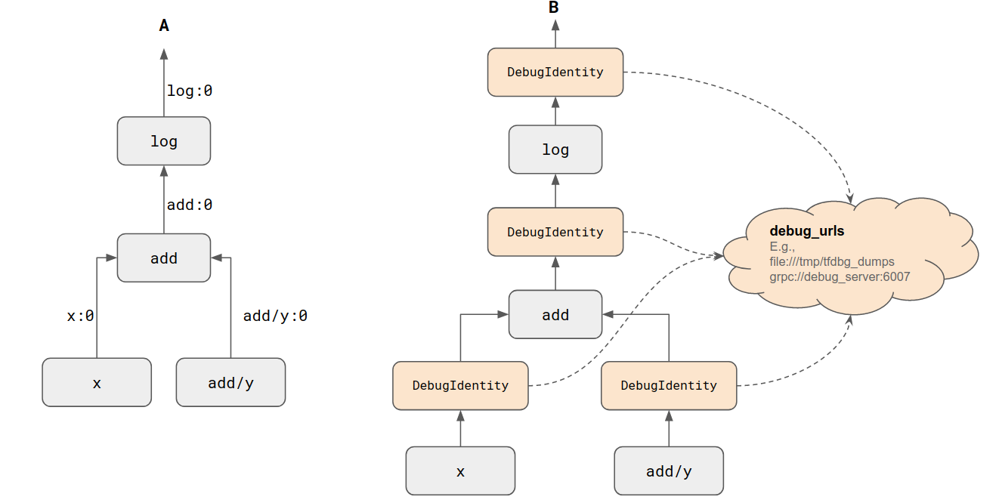

# TensorFlow Debugger v2: Callbacks for Eager Execution and `tf.function`s

| Status        | Accepted                                             |
:-------------- |:---------------------------------------------------- |
| **Author(s)** | Shanqing Cai (cais@google.com)                       |
| **Sponsor**   | Alexandre Passos (apassos@google.com)                |
| **Updated**   | 2019-08-15                                           |

## Objective

This RFC presents an API-level design for how to achieve debugging
instrumentation of [eager execution](https://www.tensorflow.org/guide/eager) and
[`tf.function`](https://www.tensorflow.org/beta/guide/autograph) in TensorFlow 2
("TF2" hereafter). This will enable users to "hook into" the following types of
events in TF2 with a unified API:

  - Eager execution of an operation ("op" hereafter) at runtime
  - Creation of an symbolic op at graph-construction time, i.e., when a
    user-defined Python functions is transformed into a graph (FuncGraph) with
    the
    [tf.function](https://www.tensorflow.org/beta/tutorials/eager/tf_function)
    API.
  - Runtime execution of FuncGraphs.

## Motivation

Such "hooks" will allow both observation and overriding of TF op's outgoing
tensors, including concrete `EagerTensor`s and symbolic `Tensor`s (see details
below.) This is a foundational part of the effort to bring [TensorFlow Debugger
(tfdbg)](https://www.tensorflow.org/guide/debugger) up-to-date with TF2's
execution paradigm.

Currently, tfdbg is compatible with only the `tf.Session` API of TensorFlow 1.x.
However, users of TF2 have raised questions and issues that indicate needs for
a dedicated debugger, ones that cannot be easily met by a generic Python
debugger such as pdb.  The most common examples of such needs involve
finding the source of numeric instability issues like NaNs (e.g., see [GitHub
issue](https://github.com/tensorflow/tensorflow/issues/26543) and [StackOverflow
question](https://stackoverflow.com/questions/55823557/converting-darknet53-gives-nan-results-in-tensorflow-2-0))

## Design Proposal

To expand on the aims listed in the Object section, the proposed API will enable
three key capabilities:

  - **Capability A**: The ability to intercept eagerly-executing TF ops.
    Specifically, we want a way to register one or more callbacks that are
    invoked immediately after an `EagerTensor` has been computed through the
    eager execution of an op. The callback should provide visibility into the
    input and output `EagerTensor`s of the execution. If so desired, the
    callback may _override_ the output `EagerTensor`s and thereby transparently
    affect downstream eager execution.
  - **Capability B**: The ability to intercept the creation of symbolic ops
    during function-to-graph conversion in `tf.function`, including the cases
    assisted by [AutoGraph](https://www.tensorflow.org/guide/autograph). This
    will form the basis for simulated stepping through lines of
    `tf.function`-decorated Python functions to assist debugging of graph
    construction in TF2. Like in Capability A, the callbacks should be able to
    override the output symbolic tensors of the op in order to affect all
    downstream graph ops.
  - **Capability C**: Similar to Capability A above, we want the ability
    to intercept the runtime execution of FuncGraphs. Note that this
    requirement could be folded into Capability A, if FuncGraphs are
    regarded as a special type of op.

Capability B will enable the interception of TF ops executing inside FuncGraphs
at _runtime_. Although this is not listed explicitly as a desired capability, it
is critical to runtime debugging in tfdbg v2. Similar to Capability A above, we
want access to all the intermediate tensor values computed in a FuncGraph.

### Design: Debug Callbacks for Op Instrumentation

The following API meets the requirements listed above. The code below shows the
API and the detailed signature and semantics of the callbacks that can be passed
to the API.

```python
# Exported publicly as: tf.debugging.op_callback()
def op_callback(callback_fn):
  """Intercepts op execution and op creation.

  The `callback_fn` will be invoked immediately after any of the three types
  of events:
    - The execution of an op under eager mode,
    - The execution of a FuncGraph under eager mode,
    - The creation of an op during graph construction (e.g., in
      @tf.function-decorated Python functions.)

  Args:
    A callback_fn that has the following signature:
      def callback_fn(op_type,
                      inputs,
                      attrs,
                      outputs,
                      op_name=None,
                      graph=None):
        # op_type: The type of the op, as a string. E.g., "MatMul".
        #          For the special case of FuncGraph execution, op_type
        #          takes the name of the graph name, e.g.,
        #          "__inference_my_func_24".
        # inputs: (`tuple` of `Tensor`s) Input tensors to the op or the
        #         FuncGraph.
        #         In eager execution, these are `EagerTensor`s.
        #         In graph construction, these are non-eager `Tensor`s
        #         that form the inputs to the just-created op.
        # attrs: The attributes of the op or FuncGraph of which the execution
        #        or creation caused the current invocation of the callback.
        #        This is applicable to both eager- and graph-based execution,
        #        as well as graph construction.
        #        This is a tuple of alternating attribute keys and attribute
        #        values, e.g., `('adjoint_a', False, 'adjoint_b', False)`.
        # outputs: (`tuple of `Tensor`s) Output tensors from the op or
        #          FuncGraph.
        #          In eager execution, these are `EagerTensor`s.
        #          In graph construction, these are non-eager `Tensor`s that
        #          are the outputs of the just-created op.
        # op_name: Name of the op or FuncGraph.
        #          If the current invocation of the callback is due to the
        #          eager execution of an op, this will be `None` as op names
        #          are meaningless in eager execution.
        #          If this invocation of the callback is due to the
        #          eager execution of a FuncGraph, this will be the
        #          internally-generated name of the FuncGraph.
        #          In graph construction, this is the name of the op.
        # graph: The graph that the op belongs to (if any).
        #        In eager execution of an op, this is `None`.
        #        In eager execution of a FuncGraph, the is the FuncGraph
        #        object per se.
        #        In graph construction, this is the op's containing graph.
        #
        # Return values:
        #   This callback function is expected to return a `list` or `tuple`
        #   of `Tensor`s, with its length matching `len(outputs)`, in the order
        #   that corresponds to that of the `output` argument.
        #   In eager execution, these returned `Tensor`s should be
        #   `EagerTensor`s. Their values will replace the original values of
        #   `outputs` for downstream eager execution.
        #   In graph construction, these returned `Tensor`s should be
        #   non-eager `Tensor`s. Their values will replace the original
        #   `outputs` for downstream graph construction.

  Returns:
    A thread-local context manager. Within the scope of the context
    manager, all eager op/graph execution and graph op construction
    will invoke `callback_fn`.

  Raises:
    ValueEror: If the `callback` does not return the a `list` or `tuple`
    of `Tensor`s with the same length as the `outputs` argument passed to it.
  """
```

This API follows the style of TF2's op API, namely a style that **unifies eager
and graph modes**. In TF2, the same op API (e.g., `tf.matmul`) executes
differently depending on where it is called. If it is called in an eager
context, it will execute eagerly, consuming `EagerTensor`s and generating new
`EagerTensor`s as outputs. If called in a graph context (i.e., in
`tf-function`), it'll construct a new symbolic op by consuming inbound symbolic
Tensors. Our proposal captures both cases with a single API.

The proposed API achieves Capabilities A and B listed above, due to the fact
that the callback(s) registered with the API will be invoked for both eager op
execution and graph op creation.

Capability C is also met by this API, due to the fact that the callbacks are
invoked not only during the eager execution of ops, but also the execution
of FuncGraphs. In this paradigm, when a FuncGraph has been constructed and
undergoes execution by TF2, it is simply treated as a special type of op.

The example code snippet below shows how Capability A is met, i.e., how eager
execution of ops is intercepted by the callback mechanism.

```python
def my_callback(op_type, inputs, attrs, outputs, op_name=None, graph=None):
  # Do something with any of the arguments. The author of the callback may:
  #   - Log any information contained in the callback's input arguments.
  #   - Return the input `outputs` arg directly as the output, which means
  #     no change to the outputs of the op. Or
  #   - Return a list or tuple of output tensors different from the original
  #     input arg `outputs`, in which case the callback will override
  #     the outputs of the op, in either eager execution or graph execution.
  return outputs

with tf.debugging.op_callback(my_callback):
  x = tf.constant(3.0)

  y = tf.math.log(1 + x)
  # ↑ During the execution of the line above, `my_callback` is invoked twice:
  #   1. With the `op_type` arg being 'AddV2' and the `outputs` arg being an
  #      EagerTensor with value 4.0.
  #   2. With the `op_type` arg being 'Log' and the `outputs` arg being an
  #      EagerTensor with value 1.386 (≈log(4.0)).
```

The code below illustrates how Capability B is met, i.e., how creation of
ops inside a user-defined Python function decorated by `tf-function`:

```python
with tf.debugging.op_callback(my_callback):

  @tf.function
  def log_1plusp(p):
    return tf.math.log(1 + p)

  x = tf.constant(3.0)

  y = log_1plusp(x)
  # ↑ During the execution of the line above, `my_callback` is invoked *three*
  #   times. The first two invocations happen during AutoGraph's transformation
  #   of the function `log_1plusp` into a FuncGraph:
  #   1. With the `op_type` arg being 'AddV2' and the `outputs` arg being the
  #      symbolic Tensor output by by AddV2 op.
  #   2. With the `op_type` arg being 'Log' and the `outputs` arg being the
  #      symbolic Tensor output by by Log op.
  #   (In reality, tf.function and AutoGraph may create additional ops such as
  #    constant ops for Python constants present in the Python function and
  #    Identity ops to marshal the FuncGraph's input and output values. Those
  #    extra ops will be captured by `my_callback` as well.)
  #
  #   The third (last) invocation of the callback is due to the eager execution
  #   of the FuncGraph, with the `op_type` arg being `tf.Graph`, the `op_name`
  #   arg being something like `_inference_log_1plusp_30`, and the `outputs` arg
  #   being an EagerTensor of value 1.386 (≈log(4.0)).
```

The example above dealt with a relatively simple FuncGraph. But the proposed API
applies to more complex FuncGraphs, including those that involve control flow
such as if-else and while loops. For instance, see the code example below.

```python
with tf.debugging.op_callback(my_callback):

  @tf.function
  def collatz(x):
    n = tf.convert_to_tensor((0,))
    while x != 1:
      n += 1
      if x % 2 == 0:
        x = x // 2
      else:
        x = 3 * x + 1
    return n

  y = collatz(tf.constant(42))
  # ↑ During the execution of the line above, `my_callback` is invoked
  #   for the creation of all ops in the TF While loop's body and condition,
  #   and the TF Cond op's branches. In addition, `my_callback` will be
  #   invoked for the runtime execution of the FuncGraph converted from
  #   `collatz`.
```

### Runtime Instrumentation of Ops in FuncGraphs

This API also supports the runtime instrumentation of ops in FuncGraphs. To see
why, realize the fact that the return values of the callback will override the
original Tensors for downstream graph construction. Hence, new ops can be
created inside the body of the callback. (The ops created inside the calbacks
themselves will be skipped the callback, which avoids infinite loops.) Such new
ops can consume the original output Tensors of the op and generate new output
Tensors for the callback function to return. This workflow results in debugging
nodes being inserted in the op’s graph.

The two code snippets listed below (labeled "Listing 1" and "Listing 2") provide
a concrete example of the workflow involved. The code in Listing 1 uses
@tf.function to construct a simple TF graph. In particular, the Python code in
my_func() is converted into a FuncGraph. The code in Listing 2 performs the same
action, but with the code placed inside an `tf.debugging.op_callback()` scope.
The callback function passed to the context manager constructs a debug op
(DebugIdentityV2) for each of the op’s output Tensor and returns the output
tensors of these debug ops, the result of which is shown in Panel B of the
figure below: each tensor now has a DebugIdentityV2 op attached to it.

```python
# Listing 1. Define a FuncGraph without `tf.debugging.op_callback()`.

@tf.function
def my_func(x):
  return tf.math.log(1 + x)
```

```python
# Listing 2. Define a FuncGraph with `tf.debugging.op_callback()` and
#            by passing a callback that overrides the symbolic output
#            tensors of the just-created graph ops.

def debugger_callback(op_type, inputs, attrs, outputs,
                      op_name=None, graph=None):
  instrumented_outputs = []
  for output_slot, output in enumerate(outputs):
    # Construct overriding output tensor.
    # Note: The `debug_identity_v2` below is not a public TensorFlow API
    # that users can use directly. This is the workflow that will be used
    # internally by tfdbg v2. However, TF users can emulate this pattern
    # by using any TF built-in or user-defined ops to override the op's output.
    # For instance, using
    # `instrumented_outputs.append(tf.math.negative(output))` will cause
    # all output tensors in the graph to be negated (i.e., sign-flipped).
    instrumented_outputs.append(gen_debug_ops.debug_identity_v2(
        output,
        tensor_name="%s:%d" % (op_name, output_slot),
        debug_urls=debug_urls))
  return instrumented_outputs

with tf.debugging.op_callback(debugger_callback):
 @tf.function
 def my_func(x):
   return tf.math.log(1 + x)
```



The debug op’s output is identical to its input, therefore the semantics of the
FuncGraph is preserved by including the callback. But the side effect of the
debug ops will support runtime debugging. Examples of such side effects include:

  - Dumping the tensor’s entire value to disk (similar to [tfdbg v1’s session
    wrappers](https://www.tensorflow.org/guide/debugger#debugging_model_training_with_tfdbg))
  - Establishing two-way communication with a gRPC debug server and await
    signals from the server before resuming execution, thereby achieving a
    “breakpoint” in the graph (similar to [tfdbg v1’s TensorBoard Debugger
    Plugin](https://github.com/tensorflow/tensorboard/blob/master/tensorboard/plugins/debugger/README.md))


### What This Proposal Offers Beyond pdb

This design is not a replacement for pdb. Instead, it is a proposal for
TensorFlow-specific debugging instrumentation that may supplement pdb. The
proposed callback API will enable the following workflows beyond what the usual
pdb-based interactive debugging can achieve.

1. It allows registration of a callback that can error out with a helpful
   error message with proper stack traces when any of the ops' output tensors
   contains NaNs or Infinities. This will catch NaN/Infinity issues in both
   eagerly computed tensors and the ones that are computed inside FuncGraphs.
2. It allows registration of a callback that can dump the full history of
   eager execution, graph building and in-graph op execution to the filesystem.
   This will facilitate post hoc analysis of crashed TF2 programs.
   Admittedly, dumping full tensor values is very expensive and not realistic
   in general. However, there are ways to reduce the cost of this history
   dumping (e.g., by dumping only concise numeric summaries of tensors,
   sample only a subset of the execution steps, or dumping only from a subset
   of the ops.)
3. It allows real-time transmisson of debug information to a gRPC server, in
   order to enable interactive debugging in the style of tfdbg v1's [TensorBoard
   Debugger
   Plugin](https://github.com/tensorflow/tensorboard/blob/master/tensorboard/plugins/debugger/README.md).

### Considerations for Various Cases

The proposed approach here will work for the following special cases of graph
construction:

- The proposed callback API will work for
  [user-defined ops](https://www.tensorflow.org/guide/extend/op) as it'll work
  for TensorFlow's built-in ops.
- The proposad callback API will also work for TensorFlow's composite tensors,
  which currently include
  [SparseTensors](https://www.tensorflow.org/api_docs/python/tf/sparse/SparseTensor)
  and [RaggedTensors](https://www.tensorflow.org/guide/ragged_tensors).
  Eager execution and graph-based execution on such tensors will trigger the
  registered op callbacks. In fact, given this is a low-level API, the callback
  mechanism does not treat composite tensors in any special way. The op types
  received by the callbacks will be low-level ops such as "SparseTensorDenseMatMul".
- Gradient graphs (i.e., graphs generated with
  [tf.GradientTape](https://www.tensorflow.org/api_docs/python/tf/GradientTape)).
- “Nested” invocation of FuncGraphs, i.e., a FuncGraph invoking another
  FuncGraph inside. As mentioned above, this includes control flow v2. In While
  v2 and Cond v2, the body and conditions of the control-flow constructs are
  themselves FuncGraphs.
- In addition, this approach of instrumenting the graph will work for
  DistributionStrategy. For instance,
  [MirroredStrategy](https://www.tensorflow.org/api_docs/python/tf/contrib/distribute/MirroredStrategy)
  replicates the computation (eager or `tf.function`) across a number of
  processors (CPU and GPUs). The proposed callback API will capture all the
  eager execution and FuncGraph construction replicated on all the involved
  processors.
- [tf.data pipeline](https://www.tensorflow.org/api_docs/python/tf/data)
  constructs, including built-in data functions such as
  [Dataset.batch()](https://www.tensorflow.org/api_docs/python/tf/data/Dataset#batch),
  as well as the graph construction and runtime execution of user-defined
  mapping functions supplied to
  [Dataset.map()](https://www.tensorflow.org/api_docs/python/tf/data/Dataset#map).
- Furthermore, the proposed API can support TPU debugging as well. In
  particular, if the inserted DebugIdentityV2 ops are placed inside
  [tpu.outside_compilation](https://www.tensorflow.org/api_docs/python/tf/tpu/outside_compilation),
  they will be properly compiled by XLA and run on TPU clusters. For
  performance, we will likely need to consolidate a large number of outside
  compilations into a smaller number. But the basic principle of instrumentation
  remains the same.

### Alternatives Considered

1. Instrumenting the graphs at C++ level. This is in fact the current approach
   of tfdbg v1. An advantage of the C++-based approach is that it can reflect
   the graph rewriting performed internally by TF (e.g., by Grappler.) However,
   compared with the Python-based approach proposed above, it is harder to make
   the instrumentation work correctly for all the special cases, including TPU
   if we were to pursue that route. The C++-level instrumentation may be pursued
   in other parts of the overall tfdbg v2 effort. But as a goal, it is outside
   the scope of this design.
2. Instrumenting the Python-level graph in a place such as
   [`_EagerDefinedFunction.__init__()`](https://github.com/tensorflow/tensorflow/blob/master/tensorflow/python/eager/function.py#L345),
   i.e., a common pathway where all `tf.function`s are created in TF2. To this
   end, a graph-rewriting function can be implemented. Compared with the
   proposed approach, this approach has the following disadvantages. It
   doesn’t result in an elegant API that unifies graph instrumentation with
   eager instrumentation (see Capability A above). In addition, it doesn’t
   support step-by-step tracing a FuncGraph’s construction phase, which is
   supported by the proposed API.

## Acknowledgments

Thanks are due to Dan Moldovan (mdan@google.com) for extensive discussion in
the process that led to this design.
