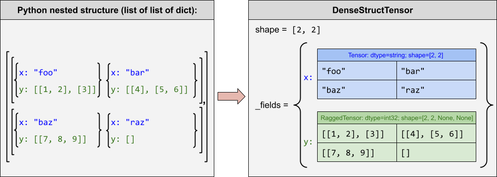

# StructuredTensor

| Status        | Accepted                                             |
:-------------- |:---------------------------------------------------- |
| **Authors**   | Edward Loper (edloper@google.com), Martin Zinkevich (martinz@google.com), Zhuo Peng (zhuo@google.com) |
| **Sponsor**   | Alex Passos (apassos@google.com)                     |
| **Updated**   | 2019-09-10                                           |

## Objective

This RFC proposes a new Python tensor type **`tf.StructuredTensor`**, which
provides a flexible and Tensorflow-native way to encode structured data such
as Protocol Buffers or Pandas DataFrames.  A ***StructuredTensor*** is a
multi-dimensional collection of ***structures*** with the same ***schema***,
where:

* A ***schema*** is a collection of fields, each of which has a name and a type.
* A ***structure*** maps each field in the schema to a tensor value
  (which could be a nested `StructuredTensor`).

As an important special case, a 1D `tf.StructuredTensor` encodes a 2D table,
where columns are heterogeneous `Tensor`s, and rows are the aligned elements
in each of those `Tensor`s.  This special case maps cleanly to a Pandas
DataFrame or an Arrow RecordBatch.

## Motivation

Structured data types are widely recognized as a useful abstraction for making
systems easier to understand and more likely to be correct.  But in TensorFlow,
it is currently up to the user to keep track of how individual tensors relate to
one another; and integrating Tensors with external data formats must be done by
hand.  This section illustrates the benefits of `StructuredTensor`s with a
motivating example.  The benefits are summarized in the next section ("User
Benefit").  Alternative solutions are discussed in the "Related Work" section.

### Example: Reading Structured Data

Tensorflow is a very powerful tool for learning deep networks to solve problems.
However, it requires that users represent data using vectors and tensors.  Most
problems can be solved by transforming inputs into tensors and operating on
those tensors, but usually the inputs to a model start out in some structured
native format.  Currently, it is common practice to use "feature extraction"
code that is outside the main TensorFlow graph to transform the input into a set
of tensors.  However, there are several advantages to performing this feature
extraction as part of the graph, and `StructuredTensor` enables this by giving
us a way to represent the original structured input in a TensorFlow-native
format.

For example, consider the problem of predicting how much a user will enjoy a
recipe, based on a structured representation of the recipe.  The structured
representation might include a pre-generated user embedding (where users with
similar tastes have similar embeddings), a recipe title, an estimated
preparation time, a list of ingredients (with amounts and types), a list of
steps, and information about what other users enjoyed the recipe.  E.g.:


In a traditional model, we might transform this structured representation into a
set of tensors using external code.  For example, the recipe step descriptions
might be normalized, tokenized, and combined into a single bag-of-words tensor.
Those tensors would then be fed as inputs into a model to predict the user's
score for a recipe.  But using `StructuredTensor`, the native representation of
the structured input can be fed directly into the model graph, and any
transformation of that structured encoding into flat tensors can be performed
inside the model.  The following diagram illustrates the difference between
these approaches:


There are several advantages to including feature extraction as part of the
model:

* **Encapsulation**: When the feature extraction code is not packaged with the
  model, it is easier for them to get out of sync.  For example, if the feature
  extraction is updated but the model doesn't get retrained, then the model will
  not perform as expected.

* **Modularity**: Packaging the feature extraction and model as a single unit
  makes it easy to experiment with new models, and to swap new models into a
  production environment, even if the new models processes the original input in
  a different way.

* **Easy integration**: `StructuredTensor`s can be constructed from a wide variety
  of popular formats, including protocol buffers, JSON, Apache Arrow and
  Parquet, and many others.

* **Training/Serving skew**: Often when feature extraction is performed
  separately, separate functions are used to process training and inference
  inputs.  For example, the training input needs to be batched, and may be
  stored in a separate format from the inference format.  This divergence
  increases the risk of "training/serving skew," where the two feature
  extraction procedures differ in subtle ways, leading to suboptimal model
  performance.  Integrating feature extraction into the model minimizes the
  chance of train/test mismatch.


* **Efficiency**: `StructuredTensor` can be read several several popular formats
  using zero-copy reads, for lightning-fast data access with minimal
  serialization overhead.  In contrast, external feature extraction usually
  involves serializing to `tf.example`, which can add substantial overhead.


### Example: Writing Structured Data

`StructuredTensor` gives us a principled way to generate and store structured
output; without `StructuredTensor`, we would need to encode the predicted structure
in some ad-hoc format.  To continue the example above, perhaps recipes are only
available in a semi-structured format, such as a webpage or a text file.  We
might therefore wish to build a model that can parse a "raw" recipe, and predict
its structure.   Using `StructuredTensor` as an output format has several
advantages:

* **Standardization**: `StructuredTensor` provides us with a standard output format
  for structured models, which can be easily converted to other popular formats,
  including protocol buffers, JSON, Apache Arrow, Parquet, and many others.

* **Efficiency**: `StructuredTensor`s can be converted to many standard output
  formats using zero-copy writes with minimal serialization overhead.


* **Joint modeling**: We can combine a model that outputs `StructuredTensor`s (such
  as recipe parsing) and a model that inputs `StructuredTensor`s (such as recipe
  rating) into a single model.  This makes it easy to do joint modeling, where
  the final loss function can be used to improve both sub-models.

### Example: Processing Structured Data

`StructuredTensor` is useful even for models that don't have structured inputs or
outputs at their boundaries, by providing a way to manage structured data, and
to track and process collections of related tensors.  Consider the joint model
constructed by combining the recipe parsing model with the recipe rating model
as a single end-to-end recipe rating model.  This model has a simple input (a
single string) and a simple output (a single score), but the two internal
components of the model share a structured intermediate representation.
Advantages of using `StructuredTensor` internally to a model include:

* **Self-documenting Tensors**: In models that use many different tensors, it
  can be difficult (and error-prone) to keep track of the meanings of the
  different dimensions for each tensor.  By wrapping tensors in `StructuredTensor`s,
  we can effectively provide a label for each dimension.


* **Shared Outer Dimensions**: Often, several different tensors will have
  "shared dimensions."  For example, we might have several different tensors
  corresponding to a recipe's ingredient list, where the outer dimension of each
  tensor indicates which ingredient is described.  Using `StructuredTensor`, we can
  combine all of these tensors into a single structure, which encodes,
  documents, and enforces the fact that this dimension is shared.


* **Zero Runtime Overhead**: As discussed below, `StructuredTensor`'s internal
  encoding is a collection of parallel tensors; and any operations on the
  `StructuredTensor` reduce to operations on those individual tensors.  Therefore,
  `StructuredTensor` adds minimal overhead at graph-construction time, and zero
  overhead at training and inference time.

## User Benefit

* **Integration*.  `StructuredTensor`s can be constructed from a wide variety of
  popular formats, often using zero-copy reads and writes.  This will make it
  much easier to integrate `StructuredTensor`s with existing systems, which may use
  a wide variety of data formats.  The following diagram gives examples of the
  formats that for which we intend to provide direct conversion:

  

* **Encapsulation**. TensorFlow models are tightly coupled with input
  transformation and feature engineering. Being able to package the model and
  the feature engineering in a single graph has a variety of advantages:

  *  It is easier to keep feature engineering and modeling in sync. Since the
     same subgraph is used for training and inference, there is less code
     duplication in feature engineering, which means that there are fewer places
     to introduce training/serving skew.
  *  It is easier to try out different feature engineering techniques within a
     model, without changing the overall infrastructure.
  *  It is simpler to swap in a new model with different input processing in a
     production environment, since the input processing and the model can be
     packaged as a single SavedModel.
  *  By directly operating on the native data, there is a possibility of trying
     completely different modeling techniques without changing the API of the
     model's TensorFlow graph.

* **Efficiency.**

  *  `StructuredTensor` can be read from and written to many popular formats using
    zero-copy reads and writes, for lightning-fast data access with minimal
    serialization overhead.  This avoids the overhead of reading from and
    writing to `tf.Example` or similar formats (which can sometimes be
    substantial).
  *  `StructuredTensor` does not introduce any additional runtime overhead to
     TensorFlow graphs, because all operations on `StructuredTensor`s reduce to
     operations on the individual contained tensors.  This also ensures that all
     applicable graph optimizations can be applied to the graph.
  *  Graph optimizations can be used to ensure that the data ingestion
     operations skip over any structured input fields that are not used by the
     model.
  *  When multiple structured models are chained together, the structured output
     of one can be fed directly in as the input of the next, with no need for
     any serialization.

* **Understandability.** It is difficult to represent structured records in
  tensorflow, and even harder to represent nested structures. By having a
  standard way to do this:

  *  It is easier to get a holistic view of feature engineering and machine
     learning. Often, decisions about feature engineering and modeling are
     intertwined. By having them in one graph, this makes it clearer ex post
     what feature engineering and modeling are useful together.
  *  We can provide clearer interfaces between stages of the graph.
  *  We can wrap tensors to document the meanings of dimensions at graph
     construction time, with no run-time cost.
  *  We can encode, document, and enforce the relationship between related
     tensors, including parallel tensors with shared dimensions.
  *  We can more easily build shareable feature engineering components.

* **Joint Modeling.**

  *  We can combine multiple structured models into a single joint model, where
     loss functions can propagate through all the submodels.

### Limitations and Drawbacks

As with any generic system, there are some compromises in the design that
deserve mention:

* **Efficiency vs custom feature engineering**.  It may be possible to perform
  input transformation and feature engineering more efficiently outside the
  graph, depending on the types of input transformation that are performed.

* **Efficiency vs custom data ingestion**.  For some input formats, a custom
  data ingestion operation could be made more efficient than the generic data
  ingestion operations that will be used for `StructuredTensor`s.  For example, if a
  model is parsing a custom protocol buffer, then a custom op that reads that
  protocol buffer could use tricks and assumptions that are not available to a
  generic input parser.  However, for several columnar input formats such as
  Apache Arrow, where zero-copy reads and writes are possible, the difference
  between a custom input parser and the generic input parser should be small.

* **Requires a shared schema.**  `StructuredTensor` requires that all structures in
  a given tensor have the same schema.  Thus, `StructuredTensor` cannot be used to
  encode arbitrary schema-free "dictionary-like" data.

* **Shared dimensions must be leading dimensions.**  A collection of tensors can
  only be combined into a single `StructuredTensor` if their shared dimensions are
  the leading dimensions.  E.g., two tensors `Tensor` with shape `[batch,
  ingredient]` could be combined into a single `StructuredTensor`; but a `Tensor`
  with shape `[batch, ingredient]` could not be combined with a `Tensor` with
  shape `[batch, recipe_step, ingredient]`.

* **Trees, not graphs.**  `StructuredTensor` encodes tree-like nested structure,
  consisting of records and lists.  It does not provide any direct support for
  encoding graph-like structured objects.

Thus, as with any generic system, we have made some sacrifices of speed for
generality and safety, but we believe that the benefits in terms of integration,
collaboration, and model understandability outweigh the limitations.

## Design Proposal

We are proposing the addition of a new Python tensor type **`tf.StructuredTensor`**,
which can be used to encode structures and struct tensors.

* A ***scalar `StructuredTensor`*** contains a single structure (whose fields may
  have any type and shape).
* A ***vector `StructuredTensor`*** or ***higher-dimensional `StructuredTensor`***
  contains a collection of structures with the same schema.

For example, we can use a `StructuredTensor` to encode the following structured
information about a user and a recipe:

```python
struct = tf.struct.constant({
  'user_embedding': [0.8, 2.1, 0.3, 0.1, 9.2, 1.8],
  'recipe': {
    'title': 'Snickerdoodle cookies',
    'est_time': 55.0,
    'ingredients': [
        {'amount': 3.0, 'unit': 'cup', 'name': 'flour'},
        {'amount': 1.0, 'unit': 'cup', 'name': 'white sugar'},
        {'amount': 0.5, 'unit': 'cup', 'name': 'brown sugar'},
        {'amount': 1.0, 'unit': 'cup', 'name': 'butter'},
        {'amount': 1.0, 'unit': 'teaspoon', 'name': 'cinnamon'},
        {'amount': 2.0, 'unit': 'teaspoon', 'name': 'cream of tartar'},
         ...],
    'step': [
         {'description': 'Preheat oven to 350 degrees F.'}
         {'description': 'Whisk together the flour, cinnamon, baking soda, salt, ...'}
         {'description': 'Using an electric mixer, cream together the butter and sugar ...'}
         {'description': 'Add the dry ingredients to the wet ingredients and mix until ...'}
         ...],
    'user_rating': [
         {'user_embedding': [0.7, 2.0, 0.3, 0.3, 5.2, 2.2], score: 0.8},
         {'user_embedding': [1.4, 0.0, 3.1, 1.1, 1.2, 0.3], score: 0.4},
         ...],
   })
```

In this example:

* The root object `struct` is a scalar `StructuredTensor` (i.e., a single
  structure).
* The `recipe` field contains a scalar `StructuredTensor` (a single nested
  structure).
* The nested fields `ingredients`, `step`, and `user_rating` contain vector
  `StructuredTensor`s (i.e. 1D collections of structures with the same schema).
* The nested fields `title`, `est_time`, `amount`, `unit`, `name`,
  `description`, and `score` contain scalar `Tensor`s.
* The nested `user_embedding` field contains a vector `Tensor`.

In the initial implementation, the value for a field may be a `Tensor`, a
`RaggedTensor`, or a nested `StructuredTensor`, where nested `StructuredTensor`s could
contain single structures (scalar `StructuredTensor`) or collections of structures
(non-scalar `StructuredTensor`).  In the future, we may add support for additional
value types, such as `SparseTensor`s.

A `StructuredTensor`'s schema constrains the type for each field:

* **For fields with `Tensor` values**, the schema specifies the field value's
  `dtype` and `shape`.
* **For fields with `RaggedTensor` values**, the schema specifies the field
  value's `dtype` and `ragged_rank`.
* **For fields with `StructuredTensor` values**, the schema specifies the nested
  `StructuredTensor` value's `shape` (e.g., a single structure vs a list of
  structures), and the name and type for each nested field.

For multidimensional `StructuredTensor` (such as a vector of structures), the
individual structures must all share the same schema.

### Usage

#### Construction

`StructuredTensor`s can be constructed from a variety of sources, including:

* Nested Python dictionaries and lists.
* Serialized protocol buffer messages.
* JSON-encoded protocol buffers.
* Apache Arrow record batches.
* Apache Parquet.
* Pandas DataFrames.
* Spanner.
* Firebase.

For more details, see the section below on "Integration with Other Formats."
`StructuredTensor`s may also be constructed directly from a shape and a field
dictionary; see the "Struct Tensor Encoding" section below for more details.

<!--

We will hold off on using dispatch to extend TF ops for now, and re-evaluate
it when we have more concrete use-cases.

#### Tensorflow Ops

We will extend standard Tensorflow array operations to support `StructuredTensor`s,
including `tf.stack`, `tf.concat`, `tf.gather`, `tf.shape`, `tf.size`,
`tf.rank`, `tf.boolean_mask`, `tf.tile`, `tf.expand_dims`, and `tf.where`.
-->

#### Indexing

For scalar `StructuredTensor`s, the Python indexing operator selects a field's
value:

```python
>>> print(struct['user_embedding'])
tf.Tensor([0.8, ...], shape=(6,), dtype=float)  # result is a Tensor vector
>>> print(struct['recipe'])
<StructuredTensor {'title': 'Snicker...', ...}>    # result is a StructuredTensor scalar
>>> print(struct['recipe']['title'])
tf.Tensor(Snicker..., shape=(), dtype=string)  # result is a string scalar
>>> print(struct['recipe']['ingredients'])
<StructuredTensor [{'name': 'flour', ...}, ...]>   # result is a StructuredTensor vector
```

For non-scalar `StructuredTensor`s, the indexing operator selects elements (as with
any other tensor):

```python
>>> print(struct['recipe']['ingredients'][0])
<StructuredTensor {'name': 'flour', ...}>          # result is a StructuredTensor scalar
```

Multi-dimensional indexing is supported:

```python
>>> print(struct['recipe', 'ingredients', 0, 'name'])
tf.Tensor(flour, shape=(), dtype=string)       # result is a string scalar
```

This includes support for slicing ranges of values in the tensor dimensions:

```python
>>> print(struct['recipe', 'ingredients', :, 'name'])
tf.Tensor(['flour' 'white sugar' ...], shape=(10), dtype=string)

>>> print(struct['recipe', 'user_rating', :, 'user_embedding', ::2])
<tf.RaggedTensor [[0.8, 0.3, 5.2], [1.4, 3.1, 1.2], ...]>
# result is a 2D float tensor with shape [num_user_ratings, 3].
```

#### Path-Based Manipulation

We will define a collection of ops that can be used to move, transform, and
combine fields within a `StructuredTensor`.  These include:

* **`broadcast`**: copies values from a source path to a target path, where the
  target path is a descendant of the source path.
* **`promote`**: copies values from a source path to a target path, where the
  target path is an ancestor of the source path.
* **`apply`**: applies a given op or function to one or more source paths, and
  writes the result to a specified target path.

#### Updating Fields

The `StructuredTensor` object is immutable.  However, several methods are provided
which can be used to construct new `StructuredTensor`s with modified field values.


`StructuredTensor.with_updates(self, **updates)`
:  Returns a copy of this `StructuredTensor` with one or more fields modified or added.

`StructuredTensor.without(self, *field_names)`
:  Returns a copy of this `StructuredTensor` with one or more fields removed.

`StructuredTensor.with_only(self, *field_names)`
:  Returns a copy of this `StructuredTensor` with only the specified fields retained.

The tensors encoding any unmodified fields are shared (not copied).


### Struct Tensor Encoding
`StructuredTensor` will be an abstract base class with two concrete subclasses:

* `DenseStructuredTensor`: A dense collection of structures.
* `RaggedStructuredTensor`: A ragged collection of structures.

#### `DenseStructuredTensor`
Internally, each `DenseStructuredTensor` is encoded using two objects:

* **shape**: A TensorShape specifying the overall shape of the `StructuredTensor`.
  For example, a `StructuredTensor` with shape `[5, 3]` contains `15` structures, in
  `5` rows of `3`.  The `shape`'s rank must be statically known -- i.e.,
  `shape.ndims` may not be `None`.  (Note: this is the shape for a collection of
  structures; it does not describe the shapes of any individual fields.)  For a
  scalar `StructuredTensor` (i.e, a single structure), `shape=()`.

* **fields**: A python dictionary mapping each field name to a `Tensor`,

  `RaggedTensor`, or `StructuredTensor` that encodes that field's values.  If `st`
  is an `N`-dimensional `StructuredTensor`, then for each field `(k, v)` in
  `st.fields.items`:

  ```
  v.shape[:N] = st.shape
  st[D1...DN][k] = v[D1...DN]
  ```

  Note that for scalar `StructuredTensor`s (where `N=0` and `s.shape=()`), this
  simplifies to just:

  ```
  st[k] = v
  ```

The following example shows the encoding for a scalar `StructuredTensor` with two
fields: `x` (whose values are string scalars), and `y` (whose values are 2-
dimensional `RaggedTensor`s).

```python
>>> st_scalar = struct_constant({"x": "foo", "y": [[1, 2], [3]]})
>>> st_scalar.shape
TensorShape([])
>>> st_scalar._fields
{'x': <tf.Tensor 'foo']>,
 'y': <tf.RaggedTensor [[1, 2], [3]]>}
```

The following example shows the encoding for a vector `DenseStructuredTensor` with
the same schema as `st_scalar`.

```python
>>> st_vector = struct_constant([{"x": "foo", "y": [[1, 2], [3]]},
                                 {"x": "bar", "y": [[4], [5, 6]]},
                                 {"x": "baz", "y": [[7, 8, 9]]}])
>>> st_vector.shape
TensorShape([Dimension(3)])
>>> st_vector._fields
{'x': <tf.Tensor ['foo', 'bar', 'baz']>,
 'y': <tf.RaggedTensor [[[1, 2], [3]], [[4], [5, 6]], [[7, 8, 9]]]>}
```

The following example shows the encoding for a 2x2 matrix `DenseStructuredTensor` with the same schema:

```python
>>> st_matrix = struct_constant(
        [[{"x": "foo", "y": [[1, 2], [3]]}, {"x": "bar", "y": [[4], [5, 6]]}],
         [{"x": "baz", "y": [[7, 8, 9]]  }, {"x": "raz", "y": []           }]])
>>> st_vector.shape
TensorShape([Dimension(2), Dimension(2)])
>>> st_vector._fields
{'x': <tf.Tensor [['foo', 'bar'], ['baz', 'raz']]>,
 'y': <tf.RaggedTensor [[[[1, 2], [3]], [[4], [5, 6]]], [[[7, 8, 9]], []]]>}
```

This last example (of a 2x2 matrix `StructuredTensor`) is illustrated below:



The `DenseStructuredTensor` encoding effectively takes the outer dimensions of the
`StructuredTensor`, and adds them into the tensors that encodes each individual
field.  This is illustrated by the following diagram:


#### `RaggedStructuredTensor`

`RaggedStructuredTensor` is used to encode ragged collections of `StructuredTensor`s.
Internally, each `RaggedStructuredTensor` consists of a values tensor (which is a
`StructuredTensor`) and one or more row-partitioning tensors.  See the
[`RaggedTensor` guide](https://www.tensorflow.org/guide/ragged_tensors) for more
information about this encoding.

### Limitations

`StructuredTensor` requires that all structures in a given tensor have the same
schema.  Thus, `StructuredTensor` cannot be used to encode arbitrary schema-free
"dictionary-like" data.  A few examples of structured values that could not be
encoded with `StructuredTensor` include:

| Structured Value                            | Reason Why It Can't be Encoded          |
:-------------------------------------------- |:--------------------------------------- |
|`[{"a": 1}, {"a": "hello"}]`                 | Field `"a"` has different dtypes        |
|`[{"b": [1, 2, 3]}, {"b": [[1, 2], [3, 4]]}` | Field `"b"` has different ranks         |
|`[{"c": {"x": 1}}, {"c": {"y": 1}}]`         | Field `"c"` has different nested fields |

Many existing struct-like encodings have provisions for "optional" values.  For
example, protobuf fields may be "`optional`" and Apache Arrow fields may be
"nullable."  In this proposal, we are not proposing to add support for optional
or nullable tensors.  However, if support for optional or nullable tensors is
added in the future, then `StructuredTensor` could take advantage of that to relax
the restriction that nested structures must have the same fields.

Similarly, many existing struct-like encodings have provisions for "union"
values.  For example, protobuf fields may use "`anyof`" and Apache Arrow defines
a `Union` type.  In this proposal, we are not proposing to add support for
union-value tensors.  However, if support for union-value tensors is added in
the future, then `StructuredTensor` could take advantage of that to to relax the
restriction that fields must have the same `dtype`.

### Integration with Other Formats

#### Row-Based Formats

##### Nested Python Dictionaries

Nested Python dictionaries can be converted into `StructuredTensor`s using
`tf.struct.constant`.  The schema for the `StructuredTensor` may be specified
explicitly; or if it is not specified, then it can be inferred from the value
itself:

* Nested `list`s of scalar values are `Tensor`s or `RaggedTensor`s.  (All scalar
  values must be at the same nesting depth, and have compatible `dtype`.)

* `Dict`s are converted into `StructuredTensor` scalars.

* Nested `list`s of `dict`s are converted into multidimensional `StructuredTensor`s.
  (All dictionaries must be at the same nesting depth, and must have the same
  schema.)

##### Protocol Buffers

A protobuf definition can easily be mapped to a `StructuredTensor` schema.  In
particular, each protobuf message type corresponds with a `StructuredTensor`, and
its protobuf field names are used as `StructuredTensor` field names.  The shape of
each `StructuredTensor` field depends on the cardinality of the corresponding
protobuf field:

* `required` protobuf fields are represented with 0D (scalar) values.
* `repeated` protobuf fields are represented with 1D (vector) values.
* `optional` protobuf fields are represented with 1D (vector) values, where each
  value has length zero or one.

The tensor type of each `StructuredTensor` field depends on the type of the
corresponding protobuf field:

* Scalar fields are represented with `Tensor` values (if the underlying tensor
  is 0D or 1D) or `RaggedTensor` values (if the underlying tensor is >1D).
* Message fields are represented with `StructuredTensor` values.

A single proto is represented as a scalar (0D) `StructuredTensor`, and a batch of
protos is represented as a vector (1D) `StructuredTensor`.

An open-source library, struct2tensor, is provided to construct a TF graph that
parses a batch of serialized protos into a `StructuredTensor`.

##### JSON

As long as a collection of JSON objects are subject to the same schema, they can
be represented similarly to Protocol Buffers.  A JSON → `StructuredTensor` converter
implementation could choose to infer the schema (like what we do for nested
python dicts) or require a schema.

#### Column-Based Formats

At its core, `StructuredTensor` uses a column-based encoding for structured data.
As such, it is highly compatible with other column-based formats.  In many
cases, the underlying data buffer used by `StructuredTensor` is identical to the
data buffer used by other formats, which enables zero-copy reads and writes from
these formas.

##### Apache Arrow

The `StructuredTensor` encoding is directly compatible with the Apache Arrow
encoding for structs.  In particular, the format and contents of all data
buffers is identical, allowing zero-copy transfers between `StructuredTensor` and
Arrow.  The following diagrams illustrate how `StructuredTensor`s relate to Arrow:

")
")

#### Pandas DataFrames

Pandas `DataFrame`s can be represented using 1D `StructuredTensor`s, where each
column corresponds to a `StructuredTensor` field.  For example, we can encode the
same set of 1D fields in both a DataFrame and a `StructuredTensor`:

```python
>>> fields = {'col1': [1, 2], 'col2': [3, 4]}
>>> df = pd.DataFrame(data=fields)
>>> st = tf.`DenseStructuredTensor`(shape=[2], fields=fields)
```

If the default `RangeIndex` is not used for the row index, then the
`StructuredTensor` must contain an additional "_index_" field.  DataFrames that use
hierarchical indexing (`MultiIndex`) can be represented as higher-dimensional
`StructuredTensor`s (for hierarchical row indices) or nested `StructuredTensor`s (for
hierarchical column indices).


## Related Work
### tensorflow.io

We plan to work with the tensorflow/io team to update their data sets to support
StructuredTensor.  For example, we will extend tensorflow_io.arrow (which currently
only supports flat unstructured Arrow files), to generate `StructuredTensor`s for
structured Arrow files.

### tf.nest

Many TensorFlow APIs support nested structures of dictionaries, lists, and
tuples.  We can use this facility to store structured data.  For example, we
could encode a recipe as a nested Python structure whose leaf elements are
scalars:

```python
recipe = {
    'title': tf.constant('Sugar cookies'),
    'ingredient': [
        {'name': tf.constant('sugar'),
         'amount': tf.constant(1),
         'unit': 'cup'},
        {'name': tf.constant('egg'),
         'amount': tf.constant(1)},
        ...],
    ...}
```

But this encoding differs from the StructuredTensor encoding in two important ways:

* Nested Python structures are only supported if the structure is entirely
  static -- and in particular, if the *length of any nested list never changes*.
  If we built a model to process recipes, then it could only process recipes
  with a fixed and predetermined number of ingredients, steps, and user_ratings.

* StructuredTensor encodes structured data using a column-based format, where all of
  the values for a given nested field (such as recipe.ingredient.amount) are
  stored in a single tensor.  This makes it possible to process all values of a
  given field in parallel, using a single op.  Using his column-based format can
  be critical for efficiently processing structured data.

## Detailed Design

### `class StructuredTensor(CompositeTensor)`

The `StructuredTensor` base class defines the following properties and methods:

#### Accessors

```python
@property
StructuredTensor.shape
    """The static shape of this StructuredTensor.

    The returned `TensorShape` is guaranteed to have a known rank, but the
    individual dimension sizes may be unknown.
    """
```

```python
@property
StructuredTensor.rank
    """The rank of this StructuredTensor (`ndims`).  Guaranteed not to be `None`."""
```

```python
StructuredTensor.field_names(self):
    """Returns the string field names for this `StructuredTensor`.

    Returns:
      tuple of string.
    """
```

```python
StructuredTensor.field_value(self, field_name):
    """Returns the tensor value for the specified field.

    If this `StructuredTensor` has shape `[D1...DN]`, then the returned tensor
    will have shape `[D1...DN, V1...VM]`, where the slice `result[d1...dN]`
    contains the value for the scalar `StructuredTensor` `self[d1...dN]`.

    If this is a scalar `StructuredTensor` (`N=0`), then the returned value is
    field value for this structure.

    Returns:
      `Tensor`, `StructuredTensor`, or `RaggedTensor`.
    """
```

#### Factories

```python
StructuredTensor.with_updates(self, **updates):
    """Returns a copy of this StructuredTensor with one or more fields modified.

    Args:
     **updates: A mapping from string field names to new field values.  Fields
       may be added or modified.  If `self.rank > 0`, then each new field
       value's shape must be prefixed with `self.shape`.  E.g., if `self` is a
       vector of structures with `n` elements, then the update values must have
       an outer dimension of size `n`, and the `i`th element will become the
       field value for the `i`th struct.

    Returns:
      A `StructuredTensor`.
    """
```

```python
StructuredTensor.without(self, *field_names):
    """Returns a copy of this StructuredTensor with one or more fields removed.

    Args:
      *field_names: The names of the fields to remove.

    Raises:
      KeyError: If a specified field is not present in this StructuredTensor.
    """
```

```python
StructuredTensor.with_only(self, *field_names):
    """Returns a copy of this StructuredTensor with only specified fields retained.

    Args:
      *field_names: The names of the fields to keep.

    Raises:
      KeyError: If a specified field is not present in this StructuredTensor.
    """
```

#### Conversion

```python
StructuredTensor.to_py(self):
    """Returns this StructuredTensor as a nested Python dict or list of dicts.

    Requires that `self` was constructed in eager execution mode.  (In graph mode,
    evaluate the `StructuredTensor` first, and then use `StructuredTensorValue.to_py()`.)

    Returns:
      A nested structure of `dict` and `list`.
    """
```

#### Operators

```python
StructuredTensor.__getitem__(self, key):
    """Returns the specified piece of this StructuredTensor."""
```

```python
StructuredTensor.__repr__(self):
    """Returns a string representation for this StructuredTensor."""
```

### `class DenseStructuredTensor(StructuredTensor)`

#### Constructor

```python
DenseStructuredTensor(self, shape, fields):
    """Creates a dense `StructuredTensor`.

    Args:
      shape: Static information about the shape of the StructuredTensor.  Must have
        a known rank (`ndims`).
      fields: A dictionary mapping from string to tensor, providing the values
        for individual fields in the struct.  If `ndims > 0`, then every tensor
        in `fields` must have the same shape in the first `ndims` dimensions;
        and that shape must be compatible with `shape`.
    """
```

### `class RaggedStructuredTensor(StructuredTensor)`

#### Factory Methods

```python
@classmethod
from_row_splits(cls, values, row_splits):
    """Creates a ragged `StructuredTensor` from row_splits.

    Args:
      values: A StructuredTensor with shape `[nvals, ...]`.
      row_splits: An integer vector with shape `[nrows+1]`.
    Returns:
      A `RaggedStructuredTensor` with shape `[nrows, None, ...]`.
    """
```

### `class DenseStructuredTensorSpec`

The `DenseStructuredTensorSpec` class is a `tf.TypeSpec` subclass that specifies the
shape and schema for a DenseStructuredTensor.

#### Constructor

```python
DenseStructuredTensorSpec(shape, field_specs):
    """Build a type specification for a StructuredTensor.

    Args:
      shape: The shape of the StructuredTensor.  shape.ndims must not be None.
      field_specs: A dictionary mapping from field name to TypeSpec, specifying
          the tensor type used to encode each field.

          These TypeSpecs should specify the type of the entire field
          (including outer dimensions which correspond to `shape`).  For
          example, if `shape=[2, 3]`, and field 'x' contains an int32 vector
          of size `10` for each structure, then `field_specs['x']` should be
          `tf.TensorSpec([2, 3, 10], tf.int32)`.
    """
```

### `class RaggedStructuredTensorSpec`

The `RaggedStructuredTensorSpec` class is a `tf.TypeSpec` subclass that specifies
the shape and schema for a `RaggedStructuredTensor`.

#### Constructor

```python
RaggedStructuredTensorSpec(shape, values_spec, row_splits_dtype):
    """Build a type specification for a RaggedStructuredTensor.

    Args:
      shape: The shape of the StructuredTensor.  shape.ndims must not be None.
      values_spec: A StructuredTensorSpec for the values of the RaggedStructuredTensor.
      row_splits_dtype: `dtype` for the `row_splits` tensor.
    """
```

### `class StructuredTensorValue` (TF-v1 only)

When the `StructuredTensor` class is used in graph mode, the `StructuredTensorValue`
class can be used to store a concrete input or output value for a given
`StructuredTensor`. Its structure is analogous to that of `StructuredTensor`, except
that field values are numpy arrays (or `RaggedTensorValues` or
`StructuredTensorValues`).

<!--

We will hold off on using dispatch to extend TF ops for now, and re-evaluate
it when we have more concrete use-cases.

### Operation Dispatchers

Tensorflow's internal operator-dispatch mechanism will be used to allow the
following operations to accept `StructuredTensor`s.  Arguments that accept
`StructuredTensor`s are marked in bold.

* `tf.batch_gather(`**`params`**`, indices, name=None)`
* `tf.boolean_mask(`**`data`**`, mask, axis=None, name=None)`
* `tf.concat(`**`values`**`, axis, name='concat')`
* `tf.expand_dims(`**`input`**`, axis=None, name=None, dim=None)`
* `tf.gather_nd(`**`params`**`, indices, name=None, batch_dims=None)`
* `tf.gather(`**`params`**`, indices, axis=None, batch_dims=0, name=None)`
* `tf.identity(`**`input`**`, name=None)`
* `tf.rank(`**`input`**`, name=None)`
* `tf.shape(`**`input`**`, out_type=tf.int32, name=None)`
* `tf.size(`**`input`**`, out_type=tf.int32, name=None)`
* `tf.squeeze(`**`input`**`, axis=None, name=None, squeeze_dims=None)`
* `tf.stack(`**`values`**`, axis=0, name='stack')`
* `tf.tile(`**`input`**`, multiples, name=None)`
* `tf.unstack(`**`input`**`, num=None, axis=0, name='unstack')`
* `tf.where(`**`condition`**`, `**`x`**`=None, `**`y`**`=None, name=None)`

In addition, several operations will support `StructuredTensor`s by virtue of the
fact that `StructuredTensor`s are `CompositeTensor`s, including:

* `tf.cond(pred, `**`true_fn`**`, `**`false_fn`**`, name=None)`
* `tf.while_loop(`**`cond`**`, `**`body`**`, `**`loop_vars`**`, ...)`
* `tf.case(`**`pred_fn_pairs`**`, `**`default`**`=None, exclusive=False, strict=False, name='case')`
* `tf.group(*`**`inputs`**`)`

### Additional ops

In addition to extending existing TensorFlow ops to support StructuredTensors, we
will also define several new ops, including:

* `tf.struct.constant`: Converts a Python value to a `StructuredTensor`
* `tf.struct.constant_value`: Converts a Python value to a `StructuredTensorValue`

## Questions and Discussion Topics

-->

### Variables

The fields in a `tf.StructuredTensor` may be `tf.Variable`s; but a
`tf.StructuredTensor` is a python-level object, and can't be stored in a
`tf.Variable` itself.


