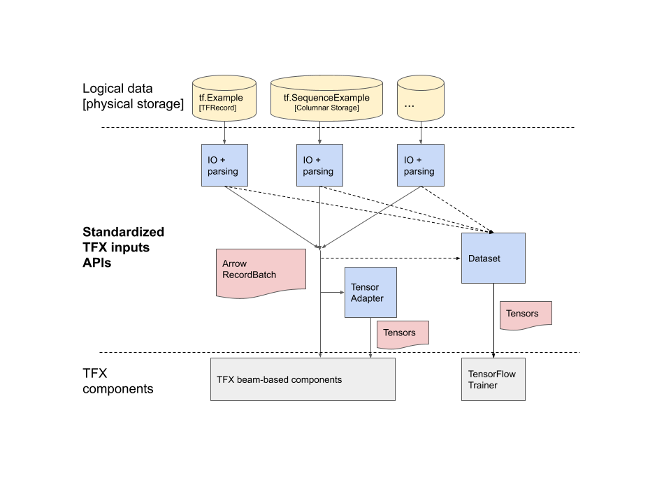
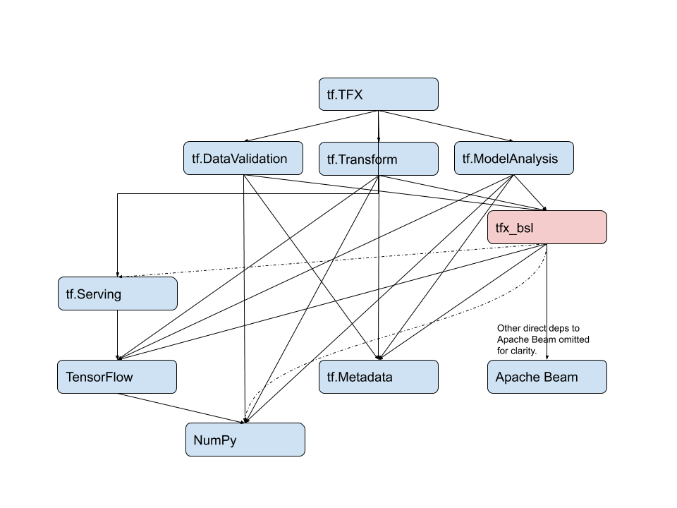
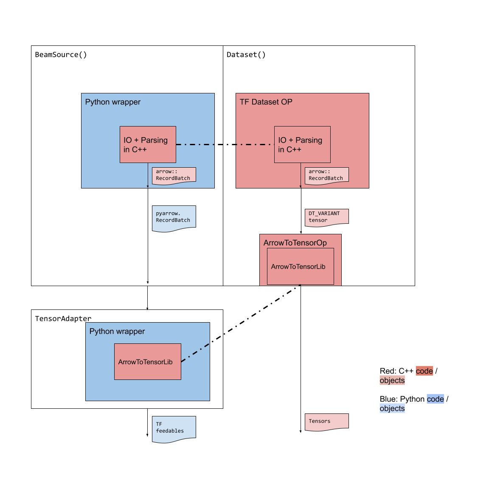

<!-- mdlint off(HEADERS_TOO_MANY_H1) -->

# Standardized TFX Inputs

Status        | Proposed
:------------ | :------------------------------------------------------------
**RFC #**     | [NNN](https://github.com/tensorflow/community/pull/NNN)
**Author(s)** | Zhuo Peng (zhuo@google.com), Kester Tong (kestert@google.com)
**Sponsor**   | Konstantinos Katsiapis (katsiapis@google.com)
**Updated**   | 2019-10-03

# Objective

*   To define a common in-memory data representation that:
    *   is powerful enough to encode the following logical training data format:
        flat
        ([`tf.Example`](https://github.com/tensorflow/tensorflow/blob/abfba15cd9734cec7ecd3d0661b146fc251c842d/tensorflow/core/example/example.proto#L88)),
        sequence
        ([`tf.SequenceExample`](https://github.com/tensorflow/tensorflow/blob/abfba15cd9734cec7ecd3d0661b146fc251c842d/tensorflow/core/example/example.proto#L298))
        or structured data (e.g.
        [Protocol Buffers](https://developers.google.com/protocol-buffers) or
        [Apache Avro](https://avro.apache.org/)).
    *   all TFX components can understand and can support their own unique use
        cases with.
*   To define an I/O abstraction layer that produces the above in-memory
    representation from supported physical storage formats, while hiding TFX’s
    choice of such storage formats from TFX users.
*   To define a bridge from the above in-memory representation to TF feedables
    (i.e. Tensors and certain
    [CompositeTensors](https://github.com/tensorflow/tensorflow/blob/abfba15cd9734cec7ecd3d0661b146fc251c842d/tensorflow/python/framework/composite_tensor.py#L1)).

# Motivation

## Fragmented in-memory data representations across TFX

A TFX component may use its input data (data generated by ExampleGen) in two
ways:

*   it may need to understand the data and conduct analysis. Usually this
    happens in [Apache Beam](https://beam.apache.org/), and does not involve a
    TF Model. For example:
    *   [TFDV](https://github.com/tensorflow/data-validation) and
        [TFT](https://github.com/tensorflow/transform) compute some statistics
        over the data.
    *   [TFMA](https://github.com/tensorflow/model-analysis) may slice the
        dataset by certain columns in the data.
*   it may feed the data to TensorFlow. Note that feeding TF alone may not
    require understanding the data. For example, TFMA may feed a TF model with
    serialized tf.Example, which may be the raw form of the data.

Currently, each TFX component has its own in-memory data representation to cover
the two use cases by a different approach:

|    | TFDV | TFT  | TFMA | BulkInference |
|:---| :--- | :--- | :--- | :------------ |
| In-memory data representation | Arrow RecordBatches | Dict[str, np.ndarray] | str (raw data records), Dict[str, np.ndarray] | str (raw data records) |
| Understand the data and conduct analysis | input data is encoded losslessly as RecordBatches. | the in-mem representation may be lossy. | Relies on the model’s input layer, and the format is Dict[str, np.ndarray]. | N/A |
| Feed TF | N/A | the in-mem representation is TF feedable. | Feed “raw data” to the model. | Feed “raw data” to the model |

This has created many issues:

*   Users of individual components need to adapt their data (if input format not
    already supported) to each component they want to use.
*   Individual components rely on unenforceable assumptions on how to interpret
    the input data consistently.
*   The complexity of adding new logical data representations (for example,
    tf.SequenceExample) scales with the number of components.

## The need for supporting new physical storage formats in TFX

Two factors drive this need:

*   TFX needs to offer users more choices of the storage format, e.g,
    [Apache Parquet](https://parquet.apache.org/).
*   TFX wants to be able to choose the optimal storage format based on user’s
    workload, in a user-transparent manner. A unified I/O abstraction would make
    it easier to support a new physical format in TFX, since one would not have
    to understand every single TFX component in order to implement such support.

## TFX interoperability with the rest of the world

If we choose a commonly available and adopted exchange format as our in-memory
representation, our users will be able to use TFX components with much less
effort on data conversion. This aligns with TFX’s long term vision.

# User Benefit

## TFX End Users

While this change is transparent to end users, it will facilitate the design and
implementation of many user-facing features, for example:

*   Columnar storage format in TFX.
*   Structured training examples.

## Individual TFX component users

We use TFXIO to refer to the proposed I/O abstraction layer. All TFX components
will start using TFXIO to ingest the data and have a unified way of representing
the data. Individual TFX component users would be able to implement TFXIO for
their own data formats / storage formats that are not supported by TFX. By
design, any such implementation will be readily accessible by all TFX
components.

## TFX developers

Developers working on TFX infrastructure will not have to understand the
internals of each component any more in order to make changes to I/O and parsing
(for example, adding support for a new storage format for the training
examples).

Developers working on TFX components would benefit from sharing common
operations against the unified in-memory representation, or even higher-level
computations. For instance, suppose that we implement a sketch-based algorithm
to compute approximate heavy hitters over this in-memory representation. We can
now share this implementation inside both TFDV and TFT for their top-K feature
value computation.

# Design Proposal

This design proposes **a common in-memory data representation**, **a way to
translate that into TF feedables** (np.ndarray or EagerTensors) and **a set of
APIs** each component can use to get both.



## Common in-memory data representation

[Apache Arrow](https://arrow.apache.org/) will be used as the common in-memory
data representation. Beam-based TFX components will accept
<code>PCollection[pyarrow.[RecordBatch](https://arrow.apache.org/docs/python/data.html#record-batches)]</code>.

Each logical data format will have its own encoding convention,
[discussed](#logical-data-encoding-in-arrow) in the detailed design.

We chose Apache Arrow because:

*   It’s Expressive enough.
    *   Lossless encoding of (conformant) tf.Example, tf.SequenceExample
    *   Can encode structured data (proto)
*   It’s a columnar format. It works well with common TFX workloads:
    *   Column (feature)-wise analysis
    *   Feed a batch of columns (features) to TensorFlow.
*   It’s OSS friendly.
    *   Community support for more storage format I/O (e.g. Apache Parquet)
    *   Friendly to other OSS data formats, both in-memory and on disk (e.g.
        Pandas)
    *   Friendly to numpy / TF: many Arrow array types share the same memory
        layout with numpy ndarrays and certain type of TF (composite) Tensors.
*   TF neutral.
    *   Leaves the possibility of supporting other ML libraries open.

## Translation from Arrow to TF feedables

The analogy to this is parsing tf.Examples into TF feedables -- extra
information is needed in this translation because a
[`Feature`](https://github.com/tensorflow/tensorflow/blob/abfba15cd9734cec7ecd3d0661b146fc251c842d/tensorflow/core/example/feature.proto#L76)
can be converted to a Tensor, a SparseTensor or a
[RaggedTensor](https://www.tensorflow.org/guide/ragged_tensor) depending on the
[feature specs](https://github.com/tensorflow/tensorflow/blob/635e23a774936b5fe6fa3ef3cb6e54b55d93f324/tensorflow/python/ops/parsing_ops.py#L46-L49).
Currently this extra information is implicitly contained in the pipeline schema
(an instance of the
[TFMD Schema](https://github.com/tensorflow/metadata/blob/master/tensorflow_metadata/proto/v0/schema.proto))
proto.

Similarly, an Arrow column can be translated to various TF feedables.
[An extension to the pipeline schema](#tensorrepresentation) is proposed to for
a user to express the intention for conversion.

The conversion can be efficient (zero-copy) in certain cases. It is
[discussed](#efficient-arrow-tensor-conversion) in the detailed design.

## Standardized Inputs APIs

We propose a set of APIs that TFX components will call, and need to be
implemented for each of the supported combination of {physical, logical} format.

```py
class TFXIO(object):
  """Abstract basic class of all Standardized TFX inputs API implementations."""
  def __init__(
      self, pipeline_env,
      schema: Optional[tfmd.Schema]=None
  ):
    pass

  @abc.abstractmethod
  def BeamSource(self,
                 projections: Optional[List[ColumnName]]=None
  ) -> beam.PTransform:
    """Returns a beam PTransform that produces PCollection[pa.RecordBatch].

    May NOT raise an error if the TFMD schema was not provided at construction time.

    Args:
      specified number of rows. Otherwise, beam will try to adjust the batch
      size automatically.
      projections: if not None, only the specified subset of columns will be
      read.
    """

  @abc.abstractmethod
  def TensorAdapter(self) -> TensorAdapter:
    """Returns a TensorAdapter that converts pa.RecordBatch to TF inputs.

    May raise an error if the TFMD schema was not provided at construction time.
    """

  @abc.abstractmethod
  def ArrowSchema(self) -> pyarrow.Schema:
  """Returns the schema of the Arrow RecordBatch generated by BeamSource().

  May raise an error if the TFMD schema was not provided at construction time.
  """

  @abc.abstractmethod
  def TFDataset(self, ...) -> tf.data.Dataset:
    """Returns a Dataset of TF inputs.

    May raise an error if the TFMD schema was not provided at construction time.
    """
```

Where `TensorAdapter` is:

```py
class TensorAdapter(object):

  def __init__(
      self,
      tensor_representations: Dict[str, TensorRepresentation]):
    """Initializer.

    Args:
      tensor_representations: keys are the names of the output tensors; values
      describe how an output tensor should be derived from a RecordBatch. See
      this section for details.
    """
    pass

  def TypeSpecs(self) -> Dict[str, tf.TypeSpec]:
    """Returns tf.TypeSpec for each tensor to be produced by ToBatchTensors().

    TypeSpecs can be used to construct placeholders or tf.function signatures.
    """

  def ToBatchTensors(
      self, record_batch: pyarrow.RecordBatch,
      projections: Optional[List[TensorName]]=None
  ) -> Dict[str, TFFeedable]:  # TFFeedable: np.ndarrays or tf.EagerTensor
                               # (or compositions of them, i.e.
                               # CompositeTensors).
    """Converts a record batch to batched tensors.

    Each will conform to the corresponding TypeSpec.

    Args:
      projections: if not None, only specified subset of tensors will be
      converted.
    """
```

Note that we will provide a default implementation of `TensorAdapter`, but TFXIO
implementations can implement their own `TensorAdapter`. A custom
`TensorAdapter` would allow a `TFXIO` implmentation to rely on a TF graph to
do parsing -- the same graph can be used in both `BeamSource` and
`TensorAdapter`.

# Detailed Design

## Logical data encoding in Arrow

On a high level, a batch of logical entities (“examples”) is encoded into a
[`pyarrow.RecordBatch`](https://arrow.apache.org/docs/python/generated/pyarrow.RecordBatch.html#pyarrow.RecordBatch).
Features or fields (from structured records) are encoded as columns in the
RecordBatch.

Note that
[`pyarrow.Table`](https://arrow.apache.org/docs/python/data.html#tables) offers
an abstraction similar to RecordBatch with the key difference being that a
column in a Table might contain multiple chunks of contiguous memory regions
while a column in a RecordBatch contains only one chunk. RecrodBatch is chosen
because we want to enforce that TFXIO implementations produce batched data in
the most efficient way (one chunk per batch). Users of TFXIO may construct a
Table from one or more RecordBatches since easy conversion from one to the other
is supported by Apache Arrow.

This design aims to support the logical structure of tf.Example,
tf.SequenceExample or structured data like Protocol Buffers. Thus only a subset
of Arrow array types are needed. All TFX components will guarantee to understand
those types, but no more. Below is a summary of supported encodings:

| Logical representation | Arrow encoding |
| :--------------------- | :------------- |
| Feature with no value | `NullArray`                                  |
| Univalent feature (one value per example) | `FixedSizeListArray` (list_size = 1) |
| Multivalent feature (multiple values per example) | `[FixedSize]ListArray` |
| Sequence feature (list of lists of values per example) | `[FixedSize]ListArray<[FixedSize]ListArray>` |
| Proto-like structured data | `ListArray<StructArray<{subfield:ListArray<recursion>}>>` |

However the design is flexible to support more complicated logical structures,
for example, k-nested sequences (tf.SequenceExample is 2-nested).

Next we show that these encodings cover the logical data formats we aim to
support:

### tf.Example

[Conformant](https://github.com/tensorflow/tensorflow/blob/abfba15cd9734cec7ecd3d0661b146fc251c842d/tensorflow/core/example/example.proto#L78)
tf.Examples are assumed. I/O + parsing should throw an error upon non-conformant
instances.

A key requirement derived from the conformant-ness is for the encoding to be
able to distinguish the following two cases:

*   a feature is present, but it’s value list is empty

    ```
    {
      features {
        "my_feature": {
          bytes_list {
          }
        }
    }
    ```

*   a feature is not present

    ```
    {
      features {
      }
    }
    ```

    or

    ```
    {
      features {
        "my_feature": {}  # none of the oneof is set
      }
    }
    ```

Each feature can be encoded as:

```
[FixedSize]ListArray<int64|float32|binary>
```

Then, the feature value in case a) is encoded as an empty sub-list, while the
feature value in case b) is encoded as null.

If we know that all the lists in a `ListArray` are of equal length (from the
schema of the data, see below sections), `FixedSizeListArray` can be used to
obviate the `O(N)` space overhead for lengths of lists.

### tf.SequenceExample

[Conformant](https://github.com/tensorflow/tensorflow/blob/abfba15cd9734cec7ecd3d0661b146fc251c842d/tensorflow/core/example/example.proto#L184)
tf.SequenceExamples are assumed. I/O + parsing should throw an error upon
non-conformant instances.

A context feature will be encoded similarly to a feature in tf.Example. A
sequence feature will be encoded as:

```
[FixedSize]ListArray<[FixedSize]ListArray<int64|float32|binary>>
```

To avoid name conflicts with context features, all the sequence features can be
grouped into one `StructArray`:

```
StructArray<{'sequence_feature1': ListArray<ListArray<int64|float32|binary>>, ...}>
```

### Structured data (e.g. Protocol Buffers / Apache Avro)

A batch of structured records can be encoded as follows:

*   Each direct leaf field of the structure can be encoded similarly to
    tf.Example. (`ListArray` of primitive types).
*   Each sub-message can be encoded as:

    ```
    ListArray<StructArray<recursion...>>>
    ```

## Arrow to TF Feedable conversion

### TensorRepresentation

One or more Arrow columns can potentially be converted to multiple types of TF
feedables.

For example, a `ListArray<int64>` can be converted to:

*   a Tensor, if given a default value to pad
*   a SparseTensor to represent a ragged array
*   a RaggedTensor

The choice depends on user’s intents, which currently is
[implicitly](https://github.com/tensorflow/transform/blob/11afcff467f779ba6163686395582e69603987d1/tensorflow_transform/tf_metadata/schema_utils.py#L172)
expressed in the pipeline schema.

We propose to create a new [TFMD](https://github.com/tensorflow/metadata)
(TensorFlow MetaData) Proto, `TensorRepresentation` to carry those intents implicitly:

```protobuf
message TensorRepresentation {
  oneof {
    DenseTensor { … }  // column_name, dtype, shape, default_value
    VarLenSparseTensor { … }  // column_name, dtype
    SparseTensor { }  // dtype, value_column_name, indice_column_names
    VarLenRaggedTensor { … } // dtype
    RaggedTensor { } // dtype, value_column_name, row_partition_column_names, ...
    StructuredTensor { } // column_names
  }
}
```

This proto is used in two places:

*   It’s part of TFMD schema:

    ```protobuf
      message TensorRepresentationGroup {
        map<string, TensorRepresentation> tensor_representation = 2;
      };

      message Schema {
       repeated Feature feature = 1;
       // …
       map<string, TensorRepresentationGroup> tensor_representation_group = 42;
      }
    ```

    Note :

    *   `TensorRepresentationGroup` allows different instances of one TFX
        component use different sets of `TensorRepresentation`s.
    *   `tensor_representation_group` is **optional**. If the user does not
        specify any, a default representation will be derived from
        schema.feature to keep backwards compatibility.
    *   this field is **not** a sub-message of Schema::Feature, because a TF
        feedable may comprise multiple columns

    Being part of the schema makes it possible to serialize and materialize the
    intents for other components to use, which allows TFT’s materialization
    functionality to have its own TFXIO implementation that hides the
    data/physical format from the user.

    When generating the initial schema from the statistics of the data, TFDV can
    propose a default set of `TensorRepresentationGroup`. The user may revise
    the proposal and TFDV can validate `TensorRepresentationGroup`s in a
    continuous manner.

*   The default implementation of TensorAdapter takes an optional `Dict[str,
    TensorRepresentation]` at construction time. If a TFXIO implementation
    choose to use the default TensorAdapter, it needs to provide them (may come
    directly from the Schema).

### Efficient Arrow->Tensor conversion

The key to efficient conversions is to avoid copying of data. The prerequisites
to do so are:

*   Same memory alignment
*   Same memory layout

Currently 64-byte alignment is the standard in both Tensorflow's `TensorBuffer`
and Apache Arrow's `Buffer`. Forthermore, it can be guaranteed by implementing
our own version of `arrow::MemoryPool` that is backed by a
`tensorflow::Allocator`.

The memory layout will be the same if right types are chosen at both ends thus
zero-copy conversion can be done, for example:

*   `FixedLengthListArray` (or `ListArray` of equal-length lists) -> dense
    Tensors.
*   `ListArray<ListArray<...>>` ->
    [RaggedTensors](https://github.com/tensorflow/tensorflow/blob/3c2dabf53dd085c21e38a28b467e52c566c0dfaf/tensorflow/python/ops/ragged/ragged_tensor.py#L1).
*   `ListArray<StructArray<... recursion>>` ->
    [StructuredTensors](https://github.com/tensorflow/community/blob/master/rfcs/20190910-struct-tensor.md)

In other cases, copies can be avoided for the values, but some computation is
needed:

*   `ListArray<ListArray<...>>` -> `tf.SparseTensor`
    *   Need to compute the sparse indices from `ListArray`'s list offsets.

The rest cases require a copy:

*   `ListArray<ListArray<...>>`(of non-equal-length lists) -> dense Tensors

With TensorRepresentation available in the Schema, a TFXIO implementation may
optimize its decoder to choose the most efficient Arrow type.

#### Conversion of string features

Arrow’s string arrays (`BinaryArray`) have a different memory layout than
TensorFlow’s string Tensors, even with
[`tensorflow::tstring`](https://github.com/tensorflow/community/blob/master/rfcs/20190411-string-unification.md).
There is always some overhead in conversion, but with `tensorflow::tstring` a
Tensor of `string_view`s is possible, thus the overhead will be a function of
the number of strings being converted, instead of the lengths of the strings.

#### TF APIs for conversions

In TF 1.x we will use np.ndarray as a bridge as Arrow has zero-copy conversion
to numpy’s ndarrays. (not for string arrays).

Starting from TF 2.x, we will be able to create EagerTensors from Python
memoryview(s) so that strings can be covered.

## TFMD Schema

[The TFMD Schema](https://github.com/tensorflow/metadata/blob/master/tensorflow_metadata/proto/v0/schema.proto)
is a pipeline-level artifact and in the scope of this proposal, it may serve two
purposes:

*   To provide optional inputs to the parsing logic for optimizations.
*   To carry user’s intents of converting data to TF feedables.

The two purposes don’t have to be served in the following cases:

*   TFDV should not require a schema to work and it does not need TF feedables.
*   Some TFXIO implementation may not need the schema for either purposes.

Therefore the TFMD schema is optional, and a TFXIO implementation:

*   should guarantee that the `BeamSource()`can return a valid
    `PCollection[RecordBatch]` without a schema.
    *   Other interfaces may raise an error when a schema was not provided.
*   does not have to require a TFMD schema for all its interfaces to work.

## (TensorFlow) Trainer integration

For TFX to freely choose the storage format for training examples for a user, we
**cannot** expose file-based or record-based interface to that user in the TF
trainer, because:

*   the user might not know how to open those files.
*   there might not be an efficient representation of a “record” (this is true
    for columnar storage formats like Apache Parquet) but only an efficient
    representation of a batch of records.

Thus we propose that to most users, the TF Trainer only exposes a handle to a
`tf.data.Dataset` of parsed (composite) Tensors.

Each `TFXIO` implementation will implement a `TFDataset()` interface to return
such a `tf.data.Dataset`. This dataset contains logically a set of batched
(composite) Tensors that are of the same type as the corresponding
`TensorAdapter()` would return for a `RecordBatch`. See
[this section](#recommended-way-of-implementing-a-tfxio) about how to minimize
the code needs to be written for a new `TFXIO` implementation.

The `TFDataset()` interface will accept common knobs that a user may need to
tweak:

*   Batch size
*   Random shuffle

## Code organization and OSS

### `tfx_bsl` package

TFXIO will be used by all TFX components as well as the TFX framework, making it
be almost at the bottom of the dependency chain. Moreover, a lot of
implementations details will be in C++, with python wrapping around, and we want
to make sure our TFX components pip packages remain pure Python for easy
maintenance. Therefore we propose a new python package
[tfx_bsl](https://github.com/tensorflow/tfx-bsl) (TFX Shared Basic Libraries) to
contain the implementations of `TFXIO` and other libraries shared across TFX
components.



## Recommended way of implementing a TFXIO

To maximize code sharing, the following way of implementing a `TFXIO` is
suggested:



One would only need to implement the IO+Parsing-to-arrow in C++ once, and reuse
it in the BeamSource() and a format-specific Dataset Op that produces a
DT_VARIANT tensor that points to the parsed Arrow RecordBatch. Then we provide
one C++ library that translates the Arrow RecordBatch to Tensors, which can also
be reused in a TF op (as the downstream of the Dataset, or in a Python wrapper).

# Alternatives Considered

We’ve considered an alternative where
[**StructuredTensor**](https://github.com/tensorflow/community/blob/master/rfcs/20190910-struct-tensor.md)
is the unified in-memory representation, and **tf.Data** is the unified I/O
abstraction.

StructuredTensor is equally powerful as Arrow’s StructArray so it’s able to
represent all our logical representations.

Because StructuredTensor is a CompositeTensor, we could imagine that I/O +
parsing of a logical data format in a physical storage format is handled by a
specific tf.Data Dataset that yields StructuredTensors.

We also need to be able to construct a beam source from such a Dataset (although
there is a non-trivial gap).

The advantages of this approach are:

*   Less effort to integrate: adding a new format == adding a new tf.Dataset.
*   Unified story across TF and beam.
*   No third-party dependencies.
    *   Note that we can still provide an Arrow -> StructuredTensor adapter to
        achieve interoperability.

What this alternative does not change / address:

*   We still need the TensorAdapter API to convert from StructuredTensor to
    other TF feedables, unless we are willing to only offer StructuredTensors to
    our end-users (which might be the case eventually, but not likely to happen
    soon). So a good portion of this proposal will remain mostly unchanged.
*   We still cannot expose file-based or record-based interface to end-users in
    the TF trainer. As that is a direct result of I/O + parsing being abstracted
    out.

The disadvantages of this approach are:

*   This tightly couples TF with TFX components, in the following ways:

    *   Components will need TF to read the data in.
    *   Components that analyze the data (e.g. TFDV) will operate against
        StructuredTensors, and the easiest way to to conduct certain
        computations (for example, slicing a StructuredTensor or computing the
        mean) with StructuredTensors is through TF ops and their python
        bindings.

    Such a coupling is not in our favor because:

    *   Some TFX components functionally do not require TF to work. For example,
        TFDV can analyze any data set. TFMA can analyze a model while treating
        the model as a blackbox. In both cases, the ML library that trained the
        model is irrelevant and TF should not be assumed. And coupling with TF
        does not only introduce a heavy dependency, but also forces the user to
        learn about TF if they need to implement a TFXIO for their data format.

    *   Operations against StructuredTensors boils down to Python + TF ops. The
        overhead of either is much higher than just calling an Arrow C++ API
        that does the same operation.

    *   The main extension point of TF is Ops which don't understand the nested
        structures. Compared to using Arrow’s C++ APIs, implementing an Op that
        deals with StructuredTensors will be much complicated.

# Questions and Discussion Topics

## OSS build / release issues

### We don’t have a strong representation in the Arrow community

This has led to some issues. For example, the PyPI/Wheel packaging for pyarrow
currently is unfunded and lacks volunteers and there is a risk of support being
dropped, but we do rely on the pyarrow wheel as TFX is released on PyPI.

### ABI compatibility with libarrow

The OSS library, tfx_bsl will depend on Arrow and TensorFlow’s DSOs (dynamic
shared objects). Because both libraries currently expose C++ APIs, there are
always risks of incompatible ABIs as TensorFlow and Arrow are likely to be built
using different toolchains, we cannot completely eliminate the risks.

With [Modular TensorFlow](https://github.com/tensorflow/community/pull/77),
which replaced all the C++ APIs with C-APIs, we will be able to eliminate the
risk by using the same toolchain that builds Arrow.

Furthermore, the Apache Arrow community is discussing about an
[ABI-stable C-struct](https://github.com/apache/arrow/pull/5442) that describes
Arrow Arrays. This will allow to build Apache Arrow from source and link
statically with our code, and only talk with pyarrow through that ABI-stable
interface.

Since in Google we build everything from HEAD, using the same toolchain, there
are no risks.

## Performance

We would have to convert from Apache Arrow dataframes to TF feedables / Tensors.
Sometimes this conversion cannot happen efficiently (requires copying out the
data or other computation).
