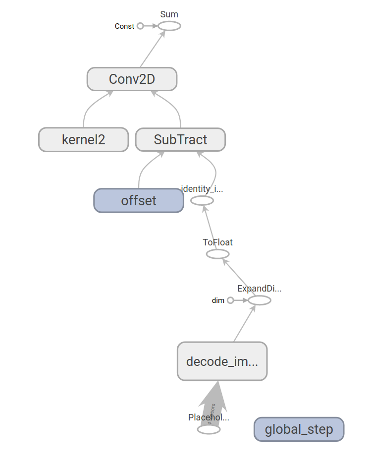
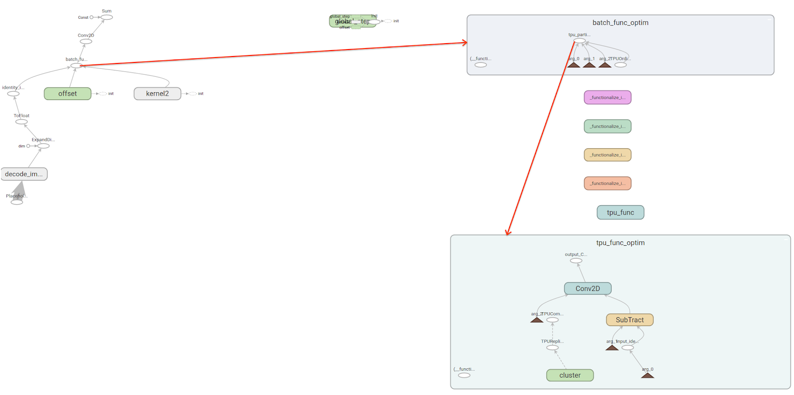
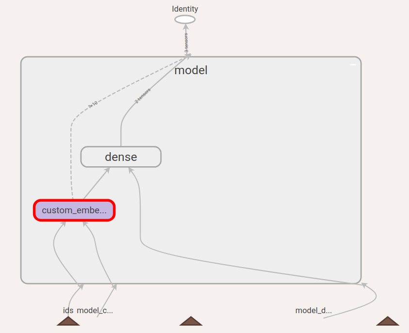
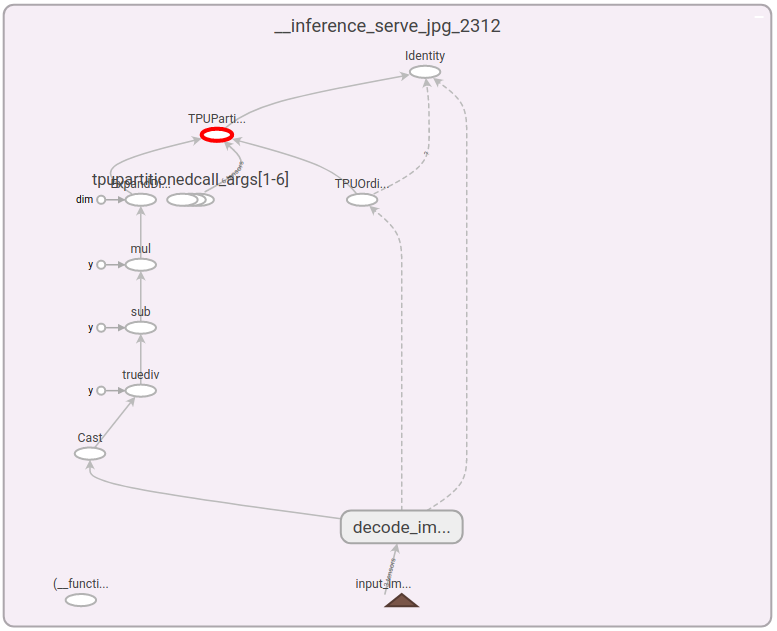

# TPU SavedModel Export API for TF2.x

| Status        | Proposed                                                |
| :------------ | :------------------------------------------------------ |
| **RFC #**     | [171](https://github.com/tensorflow/community/pull/171) |
:               : (update when you have community PR #)                   :
| **Author(s)** | Zhuoran Liu (lzr@google.com), Youlong Cheng (ylc@google.com) |
| **Sponsor**   | Jonathan Hseu (jhseu@google.com)                        |
| **Updated**   | 2019-11-06                                              |

## Objective

Provide an API to allow TF2 users to export TPU saved models <b>for
inference</b>, which:

+   Provide a user-friendly way to specify which function to run on TPU;
+   Hides Graph construction and TPU inference specific logic (multi-core
    support, etc) from users;
+   Allows specifying tags in SavedModel.

## Motivation

### Limitation of current `tf.saved_model.save()`

MetaGraphDef allows saving customized tags. Current downstream components like
TPU model-server, TFX infra-validator use the tags to load the specific
MetaGraph. However tf.saved_model.save() does not allow users to specify the set
of tags in MetaGraphDef, but hard-coded the MetaGraph to have only one ‘serve’
tag.

### Special Logic in TPU Inference Graph

Under the status quo, TPU computations have to be represented by a drastically
different graph from CPU. Inference-specific requirements (e.g. batching /
core-selection) also adds another layer of complexity.

Some major differences between CPU and TPU Graph:

+   As a protocol between TensorFlow Graph and TF2XLA, TPU device placement of a
    Node is done by attaching `_tpu_replicate` attribute;
+   For multicore efficiency, TPU computations have to be encapsulated as a
    function and saved in FunctionLibrary, and will be called by
    TPUPartitionedCall. A TPUOrdinalSelector node has to be connected to
    TPUPartitionedCall to do efficient round-robin core selection;
+   Variable nodes have to be lifted from TPU functions, rewritten as
    VarHandleOp, and consumed by ReadVariableOp.

Also for reducing the number of TPU compilation, serving platforms(For example,
Servomatic) prefers batching the inference requests with a few allowed batch
sizes. This requires wrapping TPUPartitionedCall in another function, and called
by BatchFunction.

Below is an intuitive example of how a TPU graph is different from a CPU one:


<center>Original CPU Graph.</center>


<center>TPU Graph.</center>

### User Control of Device Placement

There has to be a way for users to specify which part of computation should be
placed on TPU, because there’s no perfect device placement policy that can work
for every use case. For example even though dense embedding ops are allowed on
TPU, serving models might still want to run embedding lookups on CPU because the
embeddings are too big to fit on TPU.


<center>Example of user control. In this graph, both ‘custom_embedding’ and
‘dense’ can run on TPU. But users want ‘custom_embedding’ to run on CPU for
whatever reason, e.g. CPU computations can be parallelized, users don’t have
enough TPU resources, etc. In this case, there has to be a way for them to tell
SavedModel that only ‘dense’ is to run on TPU.</center>

## User Benefit

Enable TPU Inference.

## Design Proposal

### User Facing API

<b>For General TF2 Users</b>

Users need to do the following things to export a TPU SavedModel in TF2.x:

1.  Replace @tf.function with @tf.tpu.function for functions they wish to run on
    TPU;

    ```python
    @tf.tpu.function
    def predict_step(images):
      ...
    ```

2.  Create main serving function and call the tpu function above. The main
    function might have additional TF ops which can’t run on TPU (e.g.
    `tf.decode_image`:

    ```python
    @tf.function
    def serve(images):
      image_tensors = tf.decode_image(images)
      return predict_step(image_tensors)
    ```

    And then create a signature:

    ```python
    signatures = {
        'serving_default':
            serve.get_concrete_function(...),
    }
    tags = [tag_constants.SERVING, tag_constants.TPU]
    ```

3.  Pass the both signatures to `tf.saved_model.save()`:

    ```python
    tf.saved_model.save(
         model,
         export_dir='...',
         signatures=signatures,
         tags=tags)
    ```

The resulting TPU inference graph looks like this:


<center>Resulting TPU Graph.</center>

<b>For Advanced Users who need customized Ops</b>

In such cases, we provide the flexibility for users to tweak `@tf.tpu.function`.

1.  If users wish not to use TPUPartitionedCall, they can disable using
    TPUPartitionedCall:

    ```python
    @tf.tpu.function(use_tpu_partitioned_call=False)
    def predict_step(images):
      ...
    ```

2.  Users can nest TPU functions within BatchFunction:

    ```python
    @batch_ops.nondifferentiable_batch_function
    @tf.tpu.function
    def predict_step(images):
      ...
    ```

3.  User can also use their customized PartitionedCallOp:

    ```python
    @batch_ops.nondifferentiable_batch_function
    @my_partitioned_call_op_constructor
    @tf.tpu.function(use_tpu_partitioned_call=False)
    def predict_step(images):
      ...
    ```

<b>For Keras Users</b>

Keras users only need to pass `export_to_tpu=True` to save to TPU SavedModel.
(Currently, we require the Keras model being saved to be completely
TPU-compatible.)

```python
tf.keras.models.save_model(
    model,
    filepath='...',
    export_to_tpu=True)
```

### Changes to TF2.x API

1.  In addition to taking the keyword argument `signatures`,
    tf.saved_model.save() will take an optional argument `tags`.

    Originally, concrete functions specified by `signatures` will be saved in
    one MetaGraph, which has ‘serve’ tag hard-coded.

    `tags` is an optional argument. It is a Python iterable, representing the
    list of tags for MetaGraph. This allows user to specify customized tags.

2.  Implement an additional `@tf.tpu.function` decorator in
    `tensorflow/python/tpu/tpu.py`. This decorator handles TPU rewriting under
    the hood.

3.  An additional `use_tpu_partitioned_call` keyword argument for
    `def_function.function()` and `Function.__init__()`. This argument will be
    passed through to the place where PartitionedCallOp is created. Originally
    all stateful functions will generate StatefulPartitionedCallOp. Now we
    switch to TPUPartitionedCallOp, and this routing is done by checking the
    value of `use_tpu_partitioned_call`.

### Changes to Keras API

Keras users would like `tf.keras.models.save_model()` to work directly for
exporting TPU SavedModel, without having knowledge of tf.function / tags /
signatures. The only way to achieve this is to hide those logics under
`tf.keras.models.save_model()`.

After the change, `tf.keras.models.save_model()` will have two additional
arguments:

1.  `export_to_tpu`: Simply setting this to `True` will export TPU model;
2.  `tags_signatures`: Optionally for advanced users, if they want to have more
    control of what tags / signatures they are using, they can use this argument
    as if they are using TF2.x saving API.

## Detailed Design

### TF2.x API

Under the hood, exporter API is doing the following things:

+   The @tf.tpu.function wraps user-specified function;
+   `use_tpu_partitioned_call` as an attribute in Function class is controlling
    whether TPUPartitionedCall is generated instead of StatefulPartitionedCall;
+   Tag the MetaGraph with user-defined tags.

<b>Step 1:</b> Use a new decorator to wrap TPU version of the user-specified TPU
function. It calls tpu.rewrite inside the original function to generate a TPU
version of graph. By default, this will create a tpu function. If users wish to
preserve both CPU and TPU function, they can set `preserve_cpu_fn=True`.

```python
# tensorflow/python/tpu/tpu.py

FunctionCollection = namedtuple('FunctionCollection', ['tpu_fn', 'cpu_fn'])

def _rewrite_func_wrapper(func):
  def tpu_fn(*x):
    return rewrite(func, x)
  return tpu_fn

@tf_export("tpu.function")
def tpu_function(func=None, *args, **kwargs):
  """Compiles a TPU function into a callable TensorFlow graph."""
  def inner_func(func):
    preserve_cpu_fn = False
    if 'preserve_cpu_fn' in kwargs:
      preserve_cpu_fn = kwargs['preserve_cpu_fn']
      del kwargs['preserve_cpu_fn']

    if preserve_cpu_fn:
      cpu_fn = def_function.function(func, *args, **kwargs)

    kwargs.update({'use_tpu_partitioned_call': True})
    tpu_func = _rewrite_func_wrapper(func)
    tpu_fn = def_function.function(tpu_func, *args, **kwargs)

    if preserve_cpu_fn:
      func_collection = FunctionCollection(tpu_fn=tpu_fn, cpu_fn=cpu_fn)
      return func_collection
    else:
      return tpu_fn

  if func:
    return inner_func(func)
  else:
    return inner_func
```

<b>Step 2:</b> Pass the `use_tpu_partitioned_call` argument all the way through
to `functional_ops.py`, where TPUPartitionedCall will be created, instead of
StatefulPartitionedCall.

```python
# tensorflow/python/ops/functional_ops.py

if hasattr(f, "_use_tpu_partitioned_call") and f._use_tpu_partitioned_call:
    outputs = tpu_functional.TPUPartitionedCall(
        args=args,
        device_ordinal=tpu_ops.tpu_ordinal_selector(),
        Tout=tout,
        f=f)
```

<b>Step 3:</b> Create MetaGraph for SavedModel.

```python
# tensorflow/python/saved_model/save.py

saved_model = saved_model_pb2.SavedModel()
...
meta_graph_def = saved_model.meta_graphs.add()
asset_info, exported_graph = _fill_meta_graph_def(
    meta_graph_def, saveable_view, signatures,
    options.namespace_whitelist,
    tags=list(tags))
...
```

### Support for Keras saving API

Adding an argument `export_to_tpu` for `tf.keras.models.save_model()`, which if
set to true will rewrite the model for TPU inference.

Adding an argument `tags` for `tf.keras.models.save_model()` which has the same
semantics as that in `tf.saved_model.save()`.

```python
# tensorflow/python/keras/saving/save.py

@keras_export('keras.models.save_model')
def save_model(model,
               filepath,
               overwrite=True,
               include_optimizer=True,
               save_format=None,
               signatures=None,
               tags=None,
               export_to_tpu=False,
               options=None):
  ...
    if (export_to_tpu and
        (not tags
         or tag_constants.TPU not in tags)):
      checkpoint_graph_view = save_lib._AugmentedGraphView(model)
      signatures = find_function_to_export_tpu(checkpoint_graph_view)
      tags = [tag_constants.SERVING, tag_constants.TPU]

  saved_model_save.save(model, filepath, overwrite,
                        include_optimizer,
                        signatures,
                        tags,
                        options)
```
