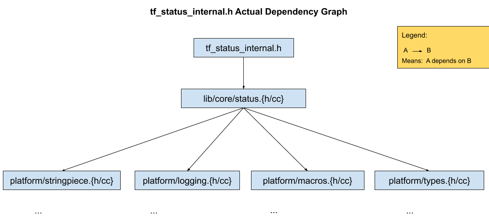
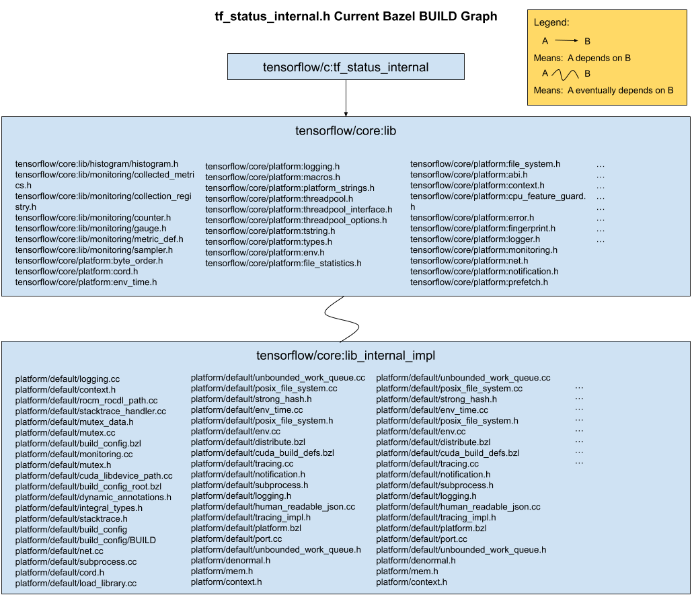
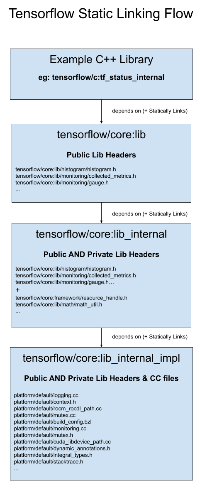
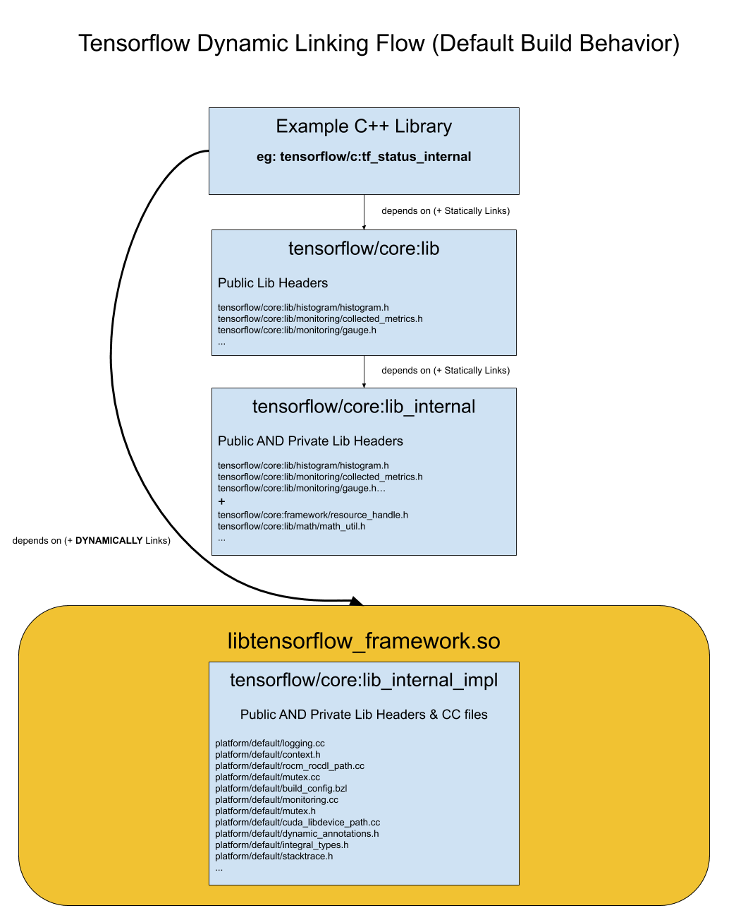

# Tensorflow Build Improvements

| Status        | Proposed                         |
| :------------ | :------------------------------- |
| **Author(s)** | Brian Zhao (bmzhao@google.com)   |
| **Sponsor**   | Gunhan Gulsoy (gunan@google.com) |
| **Updated**   | 2019-11-22                       |

## Objective

Simplify Tensorflow’s build so that
1. Builds are more granular
2. Builds are easier to reason about
3. TF’s build is well positioned to immediately benefit from [Bazel shared library support](https://docs.google.com/document/d/13nolQXvXDsJ4yjWP1FRd-WscP2-rHZcR3Zb__js6mLA)

## Background

Tensorflow was originally [open sourced 4 years ago](https://github.com/tensorflow/tensorflow/tree/f41959ccb2d9d4c722fe8fc3351401d53bcf4900), with official build support using [Bazel 0.1.0](https://github.com/tensorflow/tensorflow/blob/f41959ccb2d9d4c722fe8fc3351401d53bcf4900/tensorflow/g3doc/get_started/os_setup.md#install-bazel). Since then, Tensorflow's code base has grown [significantly](https://github.com/tensorflow/tensorflow/pulse/monthly) and Bazel has also matured, [recently hitting 1.0](https://blog.bazel.build/2019/10/10/bazel-1.0.html).

With Bazel's new [stability guarantees](https://blog.bazel.build/2019/06/06/Bazel-Semantic-Versioning.html) and experimental [shared library support on the horizon](https://github.com/bazelbuild/bazel/commit/d6c8766e3ad7042493947ea4f6f8cab0ec8c7426), we would like to start paying down the technical debt left over in Tensorflow's BUILD files, with the goals of increasing build granularity and making Tensorflow's build easier to understand. We expect this refactoring effort to facilitate long term efforts, such as [modular tensorflow](https://github.com/tensorflow/community/pull/77/files?short_path=4497fa7#diff-4497fa7db29551a9463c18c2acb81644)/[modular filesystems](https://github.com/tensorflow/community/pull/101/files?short_path=3029ddb#diff-3029ddb33c0ceefbe5430e1a4f3be93b), and generally improve the TF developer workflow. This refactoring also provides an opportunity for contributors to make meaningful improvements to Tensorflow without deep prior knowledge of the codebase.

## Vocabulary

We assume the reader is familiar with [bazel build terminology](https://docs.bazel.build/versions/master/build-ref.html). In addition, we use the capitalized term "BUILD" to refer to bazel build files, eg: [tensorflow/core/BUILD](https://github.com/tensorflow/tensorflow/blob/master/tensorflow/core/BUILD). This is distinct from lowercase "build" which refers to the process of compiling tensorflow code.

## Overview

Tensorflow's build has 4 key pain points:

1.  BUILD targets are [large](https://github.com/tensorflow/tensorflow/blob/500438a24419f8f0921bc8bb52d1951e3ee4235e/tensorflow/core/BUILD#L630-L723), and often use [globs](https://github.com/tensorflow/tensorflow/blob/500438a24419f8f0921bc8bb52d1951e3ee4235e/tensorflow/core/BUILD#L2654-L2666)

2.  BUILD files are large ([>5000 lines](https://github.com/tensorflow/tensorflow/blob/500438a24419f8f0921bc8bb52d1951e3ee4235e/tensorflow/core/BUILD))

3.  [Multiple](https://github.com/tensorflow/tensorflow/blob/500438a24419f8f0921bc8bb52d1951e3ee4235e/tensorflow/core/BUILD#L1572-L1582)  [targets](https://github.com/tensorflow/tensorflow/blob/500438a24419f8f0921bc8bb52d1951e3ee4235e/tensorflow/core/BUILD#L2654-L2666) advertise the same source files

4.  Lack of Bazel Shared Library support requires TF to maintain custom workarounds

### Large Targets

Many of Tensorflow's most commonly used build targets contain hundreds of files of source code each. For example, [tensorflow/core:framework_internal_impl](https://github.com/tensorflow/tensorflow/blob/f2f5802303c460e641a704045ae30fba7be1f8c7/tensorflow/core/BUILD#L2657-L2672) has over 200 translation units. Initially, these large targets were an expedient way to get a minimal working build in Bazel; but they are now slowing down development.

#### Wasted Machine Cycles

First, large targets cause wasted compilation + linking of code. Consider the target [tensorflow/c:tf_status_internal](https://github.com/tensorflow/tensorflow/blob/a87976312c35253071c3ea5adb79b38bd035ccc5/tensorflow/c/BUILD#L164), which has a dependency on [tensorflow/core:lib](https://github.com/tensorflow/tensorflow/blob/a87976312c35253071c3ea5adb79b38bd035ccc5/tensorflow/c/BUILD#L177). Building tf_status_internal should minimally only require [tensorflow/core/lib/status.{h,cc}](https://github.com/tensorflow/tensorflow/blob/a87976312c35253071c3ea5adb79b38bd035ccc5/tensorflow/c/tf_status_internal.h#L19), and status' transitive dependencies.



However, whenever bazel compiles tensorflow/c:tf_status_internal, bazel actually compiles all of tensorflow/core/platform/** and tensorflow/core/lib/** because tensorflow/core:lib contains all of them.



When building a binary, this also results in extra binary size or extra work by the linker to strip unnecessary code. Furthermore, large targets prevent us from pruning the set of affected tests we run on a given change, adding extra burden on CI infrastructure.

#### Wasted Dev Cycles

From a developer workflow perspective, TF's large targets introduce challenges for both newcomers and veteran contributors.

As a case study, suppose we wanted to make a modification to [tensorflow/core/util/batch_util.cc](https://github.com/tensorflow/tensorflow/blob/09d58c60128694888e2d45b513466aca754a6242/tensorflow/core/util/batch_util.cc), that required adding the line

```C++
#include "tensorflow/core/lib/monitoring/gauge.h"
```

How would we reflect this change in bazel's build graph? Finding the build target that contains batch_util.cc isn't obvious, since grepping for batch_util.cc in the closest parent BUILD file doesn't turn up anything. TF developers have to be aware of the globbing in "[framework_internal_impl](https://github.com/tensorflow/tensorflow/blob/fd4ad2ebdc5fe5113b43e2586d102e624b0f1de4/tensorflow/core/BUILD#L2658)". Similarly the build target for monitoring/gauge.{h,cc}, is also hidden in a large super-target: [tensorflow/core:lib](https://github.com/tensorflow/tensorflow/blob/fd4ad2ebdc5fe5113b43e2586d102e624b0f1de4/tensorflow/core/BUILD#L514). After checking the deps of our [framework_internal_impl](https://github.com/tensorflow/tensorflow/blob/fd4ad2ebdc5fe5113b43e2586d102e624b0f1de4/tensorflow/core/BUILD#L2658) target, we'd realize that tensorflow/core:lib is already [included as a dependency](https://github.com/tensorflow/tensorflow/blob/fd4ad2ebdc5fe5113b43e2586d102e624b0f1de4/tensorflow/core/BUILD#L2709), and that this should be a no-op.

Tensorflow's coarse build structure causes simple single-target builds to compile a large portion of the codebase. Since these builds frequently take 30 minutes to > 1 hour, developer iteration is stymied.

Tensorflow's build structure is both difficult to understand for new TF developers, and slow to iterate on for experienced contributors.

### Large Build Files

Large BUILD files also reflect opportunities for code hygiene and organization improvement. Monolithic BUILD files allow coupling between independent parts of Tensorflow's build graph. For example, tf/core/BUILD alone contains targets with sources across [tf/core/common_runtime/](https://github.com/tensorflow/tensorflow/blob/9b94c27ef6f6244be65340c05f2a5a92edd2eb5f/tensorflow/core/BUILD#L2899), [tf/core/framework/*](https://github.com/tensorflow/tensorflow/blob/9b94c27ef6f6244be65340c05f2a5a92edd2eb5f/tensorflow/core/BUILD#L635), and [tf/core/util/*](https://github.com/tensorflow/tensorflow/blob/9b94c27ef6f6244be65340c05f2a5a92edd2eb5f/tensorflow/core/BUILD#L369).

Since the smallest atom of visibility surface area is a [single package](https://docs.bazel.build/versions/master/be/common-definitions.html), and since tensorflow packages span several large subdirectories of code, code across directories can easily start depending on each other in nontrivially coupled ways, including cycles.

The simplest way to prevent this is to define more granular packages, which means adding more BUILD files, so that each BUILD file contains less targets.

### Intersecting Build Targets

When multiple build targets contain the same source files, they form parallel build graphs. This is currently the case with the build targets [//tensorflow/core:mobile_srcs_no_runtime](https://github.com/tensorflow/tensorflow/blob/500438a24419f8f0921bc8bb52d1951e3ee4235e/tensorflow/core/BUILD#L1572-L1582) and [//tensorflow/core:framework_internal_impl](https://github.com/tensorflow/tensorflow/blob/500438a24419f8f0921bc8bb52d1951e3ee4235e/tensorflow/core/BUILD#L2654-L2666) with respect to any C++ files in tensorflow/core/util/*. Any build target that accidentally includes both of these targets in its dependencies will have [ODR violations](https://en.wikipedia.org/wiki/One_Definition_Rule).

This parallel build graph exists because Android would like to produce a minimal Tensorflow shared object by pulling in only a subset of Tensorflow's codebase. The reason why Android couldn't simply use the existing Tensorflow Build targets is because they are [too large](#large-targets). Therefore, if we address [problem 1](#large-targets), we should be able to refactor the Android build to re-use these new smaller targets.

### Shared Library Workarounds

Until recently, Bazel has had no way to [partition the linking of dependencies](https://github.com/bazelbuild/bazel/issues/492) in a shared object. On the other hand, Tensorflow requires granular control over shared object linking in order to build shared object artifacts such as [libtensorflow_framework.so, pywrap_tensorflow.so, and libtensorflow.so](https://github.com/tensorflow/tensorflow/blob/500438a24419f8f0921bc8bb52d1951e3ee4235e/tensorflow/BUILD#L525-L548). Many of the design choices in Tensorflow's build are workarounds for this missing feature.

#### Header Only Targets

One such workaround is Tensorflow's reliance on "[header-only targets](https://github.com/tensorflow/tensorflow/blob/500438a24419f8f0921bc8bb52d1951e3ee4235e/tensorflow/core/BUILD#L515)" to control linkage. To clarify, we use "header-only" in the sense that the bazel build target does not contain corresponding ".cc" files in its [srcs attribute](https://docs.bazel.build/versions/master/be/c-cpp.html#cc_library), and not in the sense that the header contains the implementation details inline.

A commonly recurring pattern in TF is to have large header-only targets, which expose a set of public headers, eg: //tensorflow/core:lib. These targets then depend on an intermediate header-only target that contains additional non-public header files: eg: [//tensorflow/core:lib_internal](https://github.com/tensorflow/tensorflow/blob/7f099a45b09c28d9afa240cb3df018e0efc61d8c/tensorflow/core/BUILD#L2173). This intermediate target finally conditionally depends on a target that includes all corresponding .cc implementation files, via an ["if_static" macro](https://github.com/tensorflow/tensorflow/blob/7f099a45b09c28d9afa240cb3df018e0efc61d8c/tensorflow/core/BUILD#L2194), eg: [//tensorflow/core:lib_internal_impl](https://github.com/tensorflow/tensorflow/blob/7f099a45b09c28d9afa240cb3df018e0efc61d8c/tensorflow/core/BUILD#L2198).

What this ultimately tries to express is shown below:






Basically, if you statically compile Tensorflow into your library/binary, the header only targets will eventually depend on a target containing actual ‘.cc’ files, causing static linking of parts of libtensorflow_framework. If you want to build Tensorflow using shared objects, Tensorflow’s build cuts the dependency edge between header only targets and their implementation, which prevents the build from statically linking in sources that would otherwise be built into libtensorflow_framework.so.

#### Custom Starlark

However, bazel does not support this workflow natively. Tensorflow has worked around this using several [thousands of lines of starlark macros and rules](https://github.com/tensorflow/tensorflow/blob/500438a24419f8f0921bc8bb52d1951e3ee4235e/tensorflow/tensorflow.bzl).

One example, quoted from @[allenlavoie](https://github.com/allenlavoie), relates to the dynamic linking of libtensorflow_framework, shown above.

> Bazel will not link a binary against an explicit shared object (cc_binary with linkshared=1) unless it is directly included in the srcs of that binary. Including it in the srcs/deps of a library and depending on the library does not work (Bazel does this because otherwise it would end up implicitly duplicating static initializers). Thus we have our own tf_cc_binary and tf_cc_test rules which add libtensorflow_framework.so to the binary's srcs

Another workaround example is TF's forked version of [cc_proto_library](https://github.com/tensorflow/tensorflow/blob/500438a24419f8f0921bc8bb52d1951e3ee4235e/tensorflow/core/platform/default/build_config.bzl#L125-L247), which creates header-only targets. Ideally Tensorflow would simply use [protobuf](https://github.com/protocolbuffers/protobuf/blob/9d61eada0f47d7be793983638c4a29707b192d0c/protobuf.bzl#L227-L319)'s existing cc_proto_library.

These layers of custom starlark increase the barrier to entry for tensorflow developers and force developers to reason with custom, non-standard build behavior.

## Detailed Design

To address these pain points, we propose changing Tensorflow's BUILD structure in the incremental strategy described below. We use [tensorflow/core/BUILD](https://github.com/tensorflow/tensorflow/blob/543b91ac90a0c2fb55ba3e802760f520134bdef1/tensorflow/core/BUILD) as a concrete example.

### Phase 1: Add More Build Files

First, we will start adding BUILD files under subdirectories of tensorflow where they are currently missing. However, these BUILD files will create new [package boundaries](https://docs.bazel.build/versions/master/build-ref.html#packages). This will break the existing build because

1.  packages cannot reference cross-package files unless they are [explicitly exported](https://docs.bazel.build/versions/master/be/functions.html#exports_files)

2.  [globs](https://docs.bazel.build/versions/master/be/functions.html#glob) cannot cross package boundaries

For tensorflow/core/BUILD, we will introduce BUILD files in:

-   [tensorflow/core/common_runtime](https://github.com/tensorflow/tensorflow/tree/master/tensorflow/core/common_runtime)

-   [tensorflow/core/example](https://github.com/tensorflow/tensorflow/tree/master/tensorflow/core/example)

-   [tensorflow/core/framework](https://github.com/tensorflow/tensorflow/tree/master/tensorflow/core/example)

-   [tensorflow/core/graph](https://github.com/tensorflow/tensorflow/tree/master/tensorflow/core/graph)

-   [tensorflow/core/ops](https://github.com/tensorflow/tensorflow/tree/master/tensorflow/core/ops)

-   [tensorflow/core/protobuf](https://github.com/tensorflow/tensorflow/tree/master/tensorflow/core/protobuf)

-   [tensorflow/core/util](https://github.com/tensorflow/tensorflow/tree/master/tensorflow/core/util)

Rather than trying to refactor everything in one shot, we propose a phased pattern to make changes as incremental and reviewable as possible:

1.  Add a new BUILD file

2.  Add filegroup rules to the new BUILD file that export the exact set of files used by other packages

3.  Convert references from existing BUILD files into the new package into dependencies on the filegroups introduced in 2)

4.  Make sure this change passes CI

5.  Make a Pull Request, and add bmzhao@ or gunan@ as reviewers

This addresses [pain point 2](#large-build-files) of the build. This commit demonstrates the spirit of this process for tensorflow/core/platform/BUILD: <https://github.com/tensorflow/tensorflow/commit/a1019d9526b0033e70322712625f2572407b4555#diff-ea07d396c831000939797887d9a71e9c>

### Phase 2: Introduce Granular Targets

Now that we have new packages, we can:

1.  Start writing new, granular targets in these new BUILD files. Each of these targets should be a simple header/cc pair when possible. We will only add additional files to the target if there is an unbreakable cycle in the code.

2.  Move existing build targets that only reference files in the new package into the new package, leaving behind an alias rule.

3.  Refactor the existing large targets to depend on these new, smaller targets.

Note that at this point, the only build targets we've modified to start depending on these new targets are the existing large targets using the filegroups introduced in the "Add Build Files" phase of the refactoring. We have not changed any other Tensorflow build targets to start using the new granular targets yet.

This addresses [pain point 1](#large-targets) of the build. This commit demonstrates this process: <https://github.com/tensorflow/tensorflow/commit/aac5c1cbce63a0170a454dd112c43cf2bb1b2468#diff-cd4b7dda0a62b1ea78fa59448fc19278>.

### Phase 3: Replace Android Build Rules

Using the new granular targets created above, we should be able to remove the custom Android globs in TF, and simply have the android build depend on the new granular targets created above.

This addresses [pain point 3](#intersecting-build-targets) of the build.

### Phase 4: Start Using cc_shared_library

Unfortunately, even after we've introduced the new granular targets, we can't start refactoring all other build targets in Tensorflow to start using them. This is because we still need header only targets to ensure we don't statically link in files that would otherwise be defined in Tensorflow's shared objects.

Fortunately, the bazel team is [currently working on shared library support](https://docs.google.com/document/d/13nolQXvXDsJ4yjWP1FRd-WscP2-rHZcR3Zb__js6mLA/edit?ts=5dc40747#heading=h.7795zogmlqtv), which we hope to use soon. Adding the granular steps from phase 2 of the refactoring puts Tensorflow in a position to migrate over to bazel's cc_shared_library support immediately.

Once bazel shared library support is released, we can:

1.  Refactor all tensorflow targets to depend on the granular targets we've introduced in phase 2

2.  Replace existing cc_binary rules generating shared objects with cc_shared_library

3.  Delete all of the extra starlark code for shared object workarounds

This addresses [pain point 4](#shared-library-workarounds) of the build.

## Progress Metrics

We expect the build refactoring to yield developer velocity improvements in the long term. However, since these metrics are noisy, and are influenced by many other factors, we plan on using the following metrics to measure direct progress in the meantime.

### Build File Progress

***(Number Of Build Files) / (Number Of Folders)***

As we add more build files to subfolders of tensorflow, we expect this ratio to trend closer to 1.

### Filegroup Usage

***Number of Files in Filegroups***

We will measure the total number of files used in filegroups. For globs in filegroups, we will expand globs to their individual component files. Tensorflow uses filegroups when cc_libraries should be used instead. As we remove these, we expect this figure to decrease.

### Build Granularity

***avg(Number .cc files in srcs Attribute of Build Targets)***

As we continue adding more granular targets to the build, our expectation is that most targets become a single header/.cc pair. This metric should trend towards 1 as the refactoring continues.
