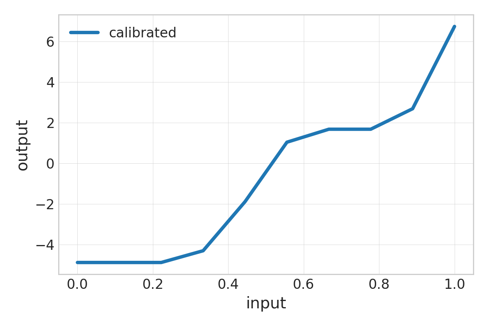
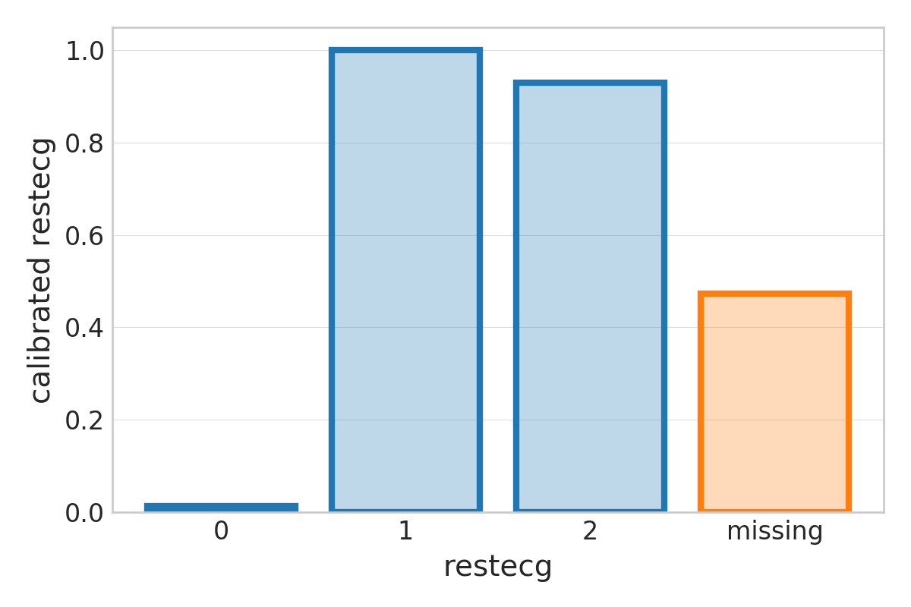
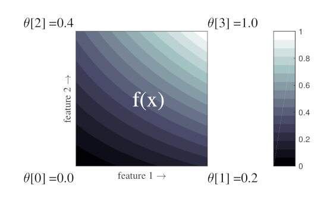
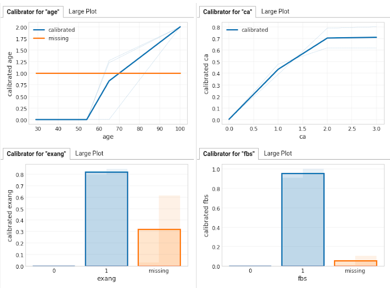
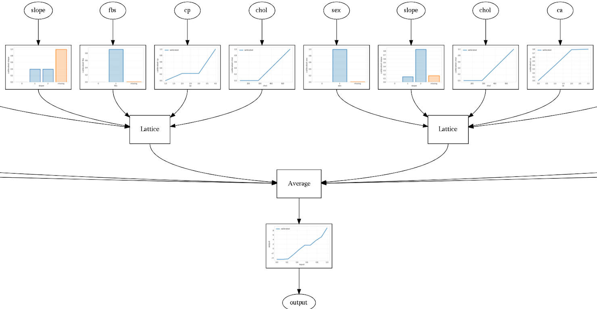

# Tensorflow Lattice 2.0

| Status        | Proposed                                                |
| :------------ | :------------------------------------------------------ |
| **RFC #**     | [NNN](https://github.com/tensorflow/community/pull/NNN) (update when you have community PR #) |
| **Author(s)** | Mahdi Milani Fard (mmilanifard@google.com), Oleksandr Mangylov (amangy@google.com) |
| **Sponsor**   | Zhenyu Tan (tanzheny@google.com), Karmel Allison (karmel@google.com) |
| **Updated**   | 2019-12-06                                              |

## Objective

TensorFlow Lattice (TFL) is an implementation of
[Deep Lattice Networks](https://arxiv.org/abs/1709.06680) in TensorFlow. Using
TFL, one can create models with guaranteed shape constraints such as
monotonicity with respect to a set of features. TFL was open sourced in 2017
(https://github.com/tensorflow/lattice) and was based on TF 1.x. This RFC covers
the goals and design details of TFL 2.0.

The main objectives of TFL 2.0 include:

*   TF library with support for both TF 2.x eager mode and TF 1.x compatibility
    and graph mode
*   Keras Layer API for lattice and calibration functions
*   Easy to construct canned estimators for typical model architectures
*   No degradation in functionality, accuracy, training speed or evaluation
    speed compared to TFL 1.x
*   Support for new
    [shape constraints](http://proceedings.mlr.press/v97/cotter19a.html)
    including convexity, concavity, unimodality and pair-wise trust
*   Easy plotting and inspection
*   Clear and useful API docs and examples

Stretch goals and future work:

*   Faster training and evaluation compared to TFL 1.x
*   More accurate models using better projection algorithms
*   Support for GPU/TPU and tf.distribute.Strategy
*   Premade Keras models with multi-phase training
*   Exposing visualization tools in TensorBoard

## Motivation

TensorFlow Lattice is a library that implements fast-to-evaluate and
interpretable (optionally monotonic) lattice based models. The library includes
layers and canned estimators that can enforce shape constraints such as
monotonicity on the model function. Such constraints can encode policy
considerations as well as common-sense and domain specific knowledge about the
underlying problem.

The currently open sourced TF implementation of these layers is based on TF 1.x
and lacks eager support. It also does not provide a Keras layers API and can be
difficult to use when building custom models. The reliance on custom ops makes
the library difficult to maintain as it requires compiling the native code for
several platforms. Users outside supported platforms (e.g. Windows users) have
to compile the library on their own, which in effect limits the library's user
base.

As part of the transition to TF 2.x, we plan to move TFL under
[TF libraries & extensions](https://www.tensorflow.org/resources/libraries-extensions)
for better visibility and integration with the rest of the TF ecosystem.

## User Benefit

There have been several requests from the open source community to add eager and
Keras support to TFL. We aim to address these requests and help avoid issues
commonly encountered with TFL 1.x. In particular:

*   Switching away from custom ops (which require compiling the library for
    several platforms) makes it possible to ship the OSS releases more
    frequently. It also helps with many of the compatibility issues with
    non-supported platforms.
*   Using Keras native constraint handling avoids the need to manually apply
    projections. This has been the source of a lot of headache and reported
    issues for TFL users.
*   Implementation as Keras layers opens up the opportunity to mix and match
    with other Keras layers and use TFL within Keras models.
*   Reworked canned estimators provide easier setup and better control over the
    model structure.
*   Additional shape constraint types offer more power and control to users.

## Design Proposal

We construct TFL 2.0 using three levels of abstraction:

*   A low-level TF-only library that implements the basics of interpolation and
    projection logic.
*   Keras layers that wrap the low-level library.
*   Canned estimators and premade Keras models that use TFL Keras layers.

### Low-level TF library

The low-level TF library implements:

*   Lattice interpolation, constraint projections and regularizers.
*   Piecewise-linear interpolation and constraint projections.
*   Partial monotonicity projection for categorical calibration.
*   Projections for monotonic linear functions.

The interpolation code for lattices and calibrators will be implemented in core
TF. It uses basic XLA compatible TF ops. In contrast TFL 1.x uses custom TF ops
with C++ implementation for interpolation. Open source binary release of the
library with custom ops requires compiling on various platforms with frequent
hard-to-fix breakage caused by slight changes in infrastructure used for the
release (TF core, Bazel, release infrastructure, etc). The ops are also
difficult to extend and optimize for newer hardware (e.g. TPUs). We thus want to
avoid using custom ops in TFL 2.0 while maintaining similar or better
performance.

The low-level TF library is 1.x and 2.x compatible, works both in graph and
eager mode and can be wrapped by higher-level APIs such as Keras.

### Keras Layer API

The Keras Layer API for TFL 2.0 mimics that of other Keras Layers, with the
addition of the shape constraints and layer-specific regularization. In
particular we want to:

*   In the layer constructor, use the same parameter names as standard Keras
    layers.
*   Use standard Keras initializer objects, with short-hand string valued
    alternatives.
*   Use standard Keras regularizer objects, with short-hand string-value pair
    alternatives.
*   Use standard Keras constraint handling for both strict and partial
    projections.
    *   Strict projections are handled by Keras standard constraints.
    *   Partial projections are handled by Keras standard constraints, followed
        by a final projection through explicit calls in Keras model callbacks or
        with estimator training hooks.

#### Linear Layer

This layer applies a linear transformation to the input tensor with an optional
bias term. It supports monotonicity and fixed-norm constraints.

```python
calibrator = tfl.linear_layer.Linear(
    num_input_dims=8,
    # Monotonicity constraints can be defined per dimension or for all dims.
    monotonicities=1,
    use_bias=True,
    # You can force the L1 norm to be 1. Since this is a monotonic layer,
    # the coefficients will sum to 1, making this a “weighted average”.
    normalization_order=1,
)
```

#### Piecewise-Linear Calibration Layer

This layer applies a piecewise-linear (PWL) function to the input tensor. PWL
keypoint inputs are fixed and passed to the layer constructor. They are
typically set to the quantiles of the input, or are uniformly spaced in the
input range.



This layer supports monotonicity, convexity, concavity and bound constraints.

```python
calibrator = tfl.pwl_calibration_layer.PWLCalibration(
    # Key-points of piecewise-linear function.
    input_keypoints=np.linspace(1., 4., num=4),
    # Output can be bounded, e.g. when this layer feeds into a lattice.
    output_min=0.0,
    output_max=2.0,
    # You can specify monotonicity and other shape constraints for the layer.
    monotonicity=1,
    # You can specify TFL regularizers as tuple ('regularizer name', l1, l2).
    # You can also pass any keras Regularizer object.
    kernel_regularizer=('hessian', 0.0, 1e-4),
)
```

#### Categorical Calibration Layer

This layer maps integer-valued input categories to float output.



This layer supports partial ordering and bound constraints.

```python
tfl.categorical_calibration_layer.CategoricalCalibration(
    # Number of categories, including oov buckets and default values.
    num_buckets=3,
    # Output can be bounded, e.g. when this layer feeds into a lattice.
    output_min=0.0,
    output_max=2.0,
    # Categorical monotonicity can be a partial order.
    # output(0) <= output(1) and output(0) <= output(2).
    monotonicities=[(0, 1), (0, 2)],
)
```

#### Lattice Layer

A lattice is an interpolated look-up table that can approximate arbitrary
input-output relationships in the data. It overlaps a regular grid onto the
input space and learns values for the output in the vertices of the grid. For a
test point *x*, *f(x)* is linearly interpolated from the lattice values
surrounding *x*.



This layer support monotonicity, unimodality,
[trust](http://proceedings.mlr.press/v97/cotter19a.html) and bound constraints.

```python
lattice = tensorflow_lattice.lattice_layer.Lattice(
    # Number of vertices along each dimension.
    lattice_sizes=[2, 2, 3, 4, 2, 2, 3],
    # You can specify monotonicity constraints.
    monotonicities=[1, 0, 1, 1, 1, 1, 1],
    # You can specify trust constraints between pairs of features. Here we
    # constrain the function to be more responsive to a main feature (index 4)
    # as a secondary conditional feature (index 3) increases (direction 1).
    edgeworth_trusts=(4, 3, 1),
    # Output can be bounded.
    output_min=0.0,
    output_max=1.0
)
```

#### MultiCalibration Layer

This layer concatenates multiple calibrators to act on a single
multi-dimensional input. This helps with construction of sequential models.

```python
model = keras.models.Sequential()

all_calibrators = tfl.lattice_layer.MultiCalibration()
all_calibrators.append(tfl.pwl_calibration_layer.PWLCalibration(...))
all_calibrators.append(tfl.pwl_calibration_layer.PWLCalibration(...))
all_calibrators.append(tfl.pwl_calibration_layer.CategoricalCalibration(...))

lattice = tfl.lattice_layer.Lattice(...)

model.add(all_calibrators)
model.add(lattice)
model.compile(...)
model.fit(...)
```

#### Projection Handling

By default, TFL applies a full projection into constraints after every gradient
update. This makes sure that all the specified constraints are satisfied after
every update to the model parameters. Alternatively you can apply faster partial
projections for each batch and a final strict projection at the end of training.

```python
lattice = LatticeLayer(
    ...,
    monotonic_at_every_step=False,
)
... (train) ...
lattice.finalize_constraints()
```

The final projection can be automatically handled by high level APIs (e.g.
callbacks in model.fit or training hooks in estimators) or manually in a custom
training setup.

### High Level Canned Estimator API

TFL 2.0 provides v2 canned estimators with several model structures. These
include:

*   Calibrated linear (generalized additive)
*   Calibrated lattice
*   Ensemble of calibrated lattices

To allow the user to define various shape constraints, regularizers and model
structures, the library provides a **configs** API. To construct a canned model,
the user first creates a model config that specifies the model structure and
various constraints about the model shape for each input feature.

```python
# Configuration for a lattice ensemble with output calibration.
model_config = configs.CalibratedLatticeEnsembleConfig(
    num_lattices=6,  # number of lattices
    lattice_rank=5,  # number of features in each lattice
    output_calibration=True,

    # Optional per feature configuration.
    feature_configs=[
        # Numeric feature with PWL calibration.
        # Feature type is inferred from the corresponding feature column.
        configs.FeatureConfig(
            name='age',
            lattice_size=3,
            # Model output must be monotonically increasing w.r.t. this feature.
            monotonicity=1,
            # Per feature regularization.
            regularizer_configs=[
                configs.RegularizerConfig(name='calib_hessian', l2=1e-4),
            ],
        ),
        # Categorical feature.
        # Feature type and vocab list is inferred from the input feature column.
        configs.FeatureConfig(
            name='thal',
            # Partial monotonicity:
            # output(normal) <= output(fixed)
            # output(normal) <= output(reversible)
            monotonicity=[('normal', 'fixed'), ('normal', 'reversible')],
        ),
    ],

    # Global regularizers
    regularizer_configs=[
        # Regularizer applied to all calibrators.
        configs.RegularizerConfig(name='calib_wrinkle', l2=1e-4),
        # Regularizer applied to the lattice.
        configs.RegularizerConfig(name='torsion', l2=1e-4),
        # Regularizer for the output calibrator.
        configs.RegularizerConfig(name='output_calib_hessian', l2=1e-4),
    ],
)
```

PWL calibration requires a list of input keypoint values. If explicit keypoints
are not provided, keypoints are set to be the quantiles of the features and are
calculated using an auxiliary input_fn (with 1 epoch or a subsample of the data)
passed to the estimator constructor. Feature types and categorical vocabulary
list can be inferred from the feature columns passed to the estimator.

```python
estimator = estimators.CannedClassifier(
    feature_columns=feature_columns,  # same as any other estimator
    model_config=model_config,        # defines model and feature configs
    feature_analysis_input_fn=make_input_fn(num_epochs=1, ...))
estimator.train(input_fn=make_input_fn(num_epochs=100, ...))
```

Premade Keras models will also be provided with the library, either in the
initial release or in future updates.

### Visualization

To help better analyze and debug TFL canned models, we implement model specific
visualization tools not already supported by
[TFMA](https://www.tensorflow.org/tfx/model_analysis/get_started) or other
standard TF analysis tools. These include calibrator plots and model graphs for
our specific canned estimators.

#### Calibrator plots

TFL 2.0 supports extracting calibrator parameters from saved models and plotting
them either individually or altogether.



#### Plotting model structure

The model structure and all layer parameters can be extracted from a saved model
and plotted in a schematic graph. This is similar to Keras model plotting.



We plan to expose these in a TFL TensorBoard extension in future launches.

### Alternatives Considered

*   **Custom interpolation kernels in C++:** although they might provide better
    performance on specific backends, we decided that the potential gains are
    not enough to counter the maintenance difficulties of binary packages. They
    also make XLA compilation difficult.
*   **Supporting v1 Estimators:** As suggested by the TF/Keras teams, we only
    support estimator v2 versions as v1 support is not adding much value either
    for new users or those migrating from TFL 1.x.
*   **Using hparams instead of a custom configs library:** hparams is going away
    in TF 2.x and each library is expected to implement its own version. hparams
    by design has a flat structure, hence making it cumbersome to represent
    hierarchies required for model configuration.

### Performance Implications

There are several end-to-end benchmarking examples that help us measure and
optimize the performance both in training and evaluation. Our current estimate
suggests that compared to TFL 1.x there is no significant regression in the
training or evaluation speed on the standard TF runtime. A separate tf/compile
benchmark shows significant improvement in evaluation time compared to the TFL
1.x. Full XLA compilation is not possible with TFL 1.x as it uses custom ops.

### Dependencies

The core library depends on TF and a handful of commonly used open source python
libraries (numpy, six, etc). The estimator has a minor dependency on the
feature_column module, and the rest of the library is based on the public TF
API.

### Engineering Impact

Since the new library is using core TF ops, the library size should be smaller
than TFL 1.x. However, since the model ends up having a lot more ops in the
graph mode, the startup time can be longer and can take more memory. We are
investigating various options to improve the performance over time.

### Platforms and Environments

The new library works on all platforms supported by TensorFlow.

**Evaluation:** We use basic and simple TF ops in the evaluation path, making
the serving saved model fully XLA compatible. We also have a tf/compile test
bench for AOT compilation.

**Training:** The training is mostly XLA compatible. Training on TPU is
possible, but can be slow to converge. Further updates and optimization to the
library for better TPU support is planned for future launches.

### Best Practices, Tutorials and Examples

Several examples and tutorials on public datasets will be available with the
library. Colabs will also be provided for a quick overview of the library.

### Compatibility

TFL 2.0:

*   Not backwards compatible with TFL 1.x, but a migration should be
    straightforward.
*   XLA compatible and can run on TPU/GPU/CPU.
*   Has some convergence issues when training with TPU distribution strategies
    due to heavy use of constraints. We plan to improve this in future launches.
*   Can be used with tf/compile AOT.
*   Supports Estimator v2 and SavedModel format.
*   Layers are eager compatible.

### User Impact

We will release migration guides to help current TFL users switch to the new
library.

## Questions and Discussion Topics

*   What other functionalities or shape constraints would be good additions to
    new library?
*   Which computational platforms should the library be optimized for?
