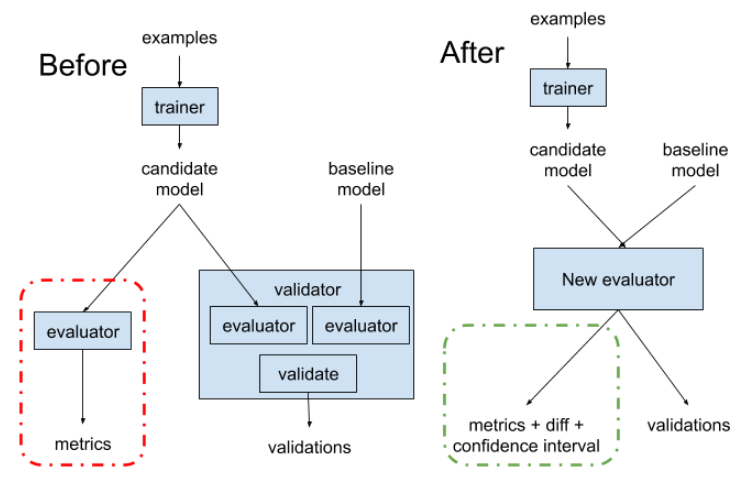
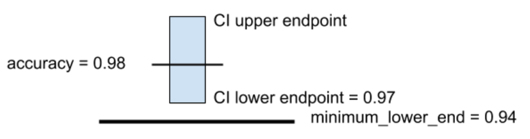
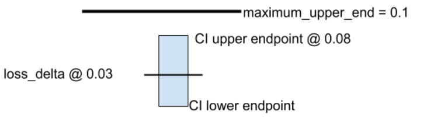
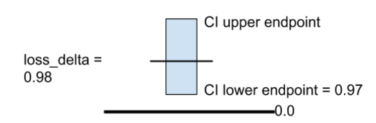
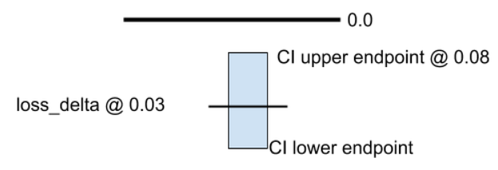

# Combining ModelValidator with Evaluator

| Status        | Proposed                                               |
| :------------ | :----------------------------------------------------- |
| **Author(s)** | Gene Huang (jinhuang@google.com), Mike Dreves (mdreves@google.com), Neoklis Polyzotis (npolyzotis@google.com) |
| **Sponsor**   | Konstantinos Katsiapis (katsiapis@google.com), Neoklis Polyzotis (npolyzotis@google.com) |
| **Updated**   | 2020-01-17                                             |

## Objective

This document discusses proposals for the next iteration of TFX Evaluator
design. The design has the following goals:

1.  Fuse the Evaluator and the ModelValidator into a single component,
    eliminating redundant evaluation runs.
2.  Adding the ModelValidator related configs into Evaluator, streamlining the
    configurations for model evaluations and model validations.
3.  Enabling new functionality, namely, model-diff metrics, confidence
    intervals, more flexible model/data selection, which was difficult in the
    previous split Evaluator/Validator design.
4.  Backwards compatibility for existing uses of the two components in TFX.

**Note**: the new Evaluator component will built on the newly released TFMA >=
v0.21.

## Motivation

Under the current TFX setup,
[ModelValidator](https://www.tensorflow.org/tfx/guide/modelval) is completely
separated from [Evaluator](https://www.tensorflow.org/tfx/guide/evaluator): they
run in separate binaries, have separate specifications, and do not communicate
with each other at all. This has several drawbacks:

1.  Computational redundancies: a typical use case of Evaluator is to run
    evaluation on the latest data with the newly trained model
    (Data<sub>latest</sub> on Models<sub>latest</sub>). A typical use case of
    ModelValidator is to compare the aforementioned evaluation
    (Data<sub>latest</sub> on Models<sub>latest</sub>) with the evaluation on
    the same data with the already blessed model (Data<sub>latest</sub>,
    Model<sub>blessed</sub>). Since, Evaluator and ModelValidator run
    separately, one evaluation (Data<sub>latest</sub> on
    Models<sub>latest</sub>) runs twice.
2.  Code redundancies: the separation makes it harder to support a consistent
    set of behaviors across the two components. For instance, today
    ModelValidator supports only a subset of the metrics computed by Evaluator
    and making them consistent would require code duplication between the two
    components. This also raises the bar to implement new requested
    functionality such as computing model diff-metrics (with confidence
    intervals) for both evaluation and validation.
3.  Config redundancies: the configurations for both Evaluator and
    ModelValidator are both partially redundant and confusing.

## User Benefits

We first introduce some terms we will use in the rest of the proposal.

*   A **model** is the conceptual output of a
    [Trainer](https://www.tensorflow.org/tfx/guide/trainer) component in the TFX
    pipeline.
*   A **model artifact** represents a single instance of a model and corresponds
    to the output of an execution of the corresponding
    [Trainer](https://www.tensorflow.org/tfx/guide/trainer) component.

Hence, if a TFX pipeline has two distinct trainers we will talk about two
models. Each execution of a Trainer will result in a model artifact. Another way
to think of this is that each model represents the “stream” of model artifacts
that result from the Trainer’s successive executions.

Henceforth we assume that each model is identified by some unique name (e.g.,
the name of the corresponding trainer component, or a trainer-generated handle)
and each model artifact is further identified by a unique id within that name
(e.g., the MLMD-generated artifact id, or trainer-generated version id for the
model).

We introduce several ways to select model artifacts within the pipeline:

*   Latest output of a model: the last model artifact in the corresponding
    “stream”.
*   Latest blessed: the last model artifact that was blessed by the TFX pipeline
    (i.e., validated by ModelValidator and InfraValidator).
*   Latest pushed: the last model artifact that was pushed by the pipeline’s
    Pusher component.

Correspondingly, we also leverage existing ways to select data artifacts within
the pipeline:

*   [Span, Version, and Split](https://www.tensorflow.org/tfx/guide/examplegen#span_version_and_split):
    a Span may correspond to a day of data, an hour of data, and so on. There
    might be multiple versions of a Span, but in this proposed work, we always
    pin on the latest version per Span. Each Span of data can be subdivided into
    multiple Splits. A typical use case would be to split a span (and a version)
    of data into training, evaluation, and validation data.

As part of the unification we plan to extend the behaviors supported by the new
component. Here are a few notable examples:

*   Within a TFX pipeline run, evaluation and validation of several models
    compared to a baseline (e.g., latest blessed model artifact from the
    pipeline). A typical case is evaluation and validation of each new artifact
    of a single model compared to the latest blessed model artifact.
*   Single component run of the validation of several models to a baseline. This
    can be used to:
    *   Unblock a previously unsuccessful validation
    *   Experiment or debug two related models.
*   More flexible data selection
    *   Include multiple selections of data (e.g., selecting rolling window of
        data and a fixed golden dataset)
    *   Exclude selections of data (e.g., selecting a rolling window of data
        with exclusion of certain spans)

In general, the new supported behaviors can be described in terms of the
following orthogonal dimensions:

*   Entire pipeline run vs single component run operation.
*   Single-model vs multi-model metrics (e.g., AUC of a single model artifact vs
    diff of AUCs between a model artifact and a baseline).
*   Single-model vs multi-model validation constraints.

This results in functionality that significantly expands on the available
functionality in TFX. For instance, (one-off, multi-model metrics, multi-model
constraints) is a new behavior that is not possible before.

### Model comparison and model validation

With a given evaluation run, we can now import two models: one candidate model
and one baseline model. The evaluation will not only calculate normal metrics
(see
[supported metrics](https://github.com/tensorflow/model-analysis/blob/master/g3doc/metrics.md)),
but also calculate corresponding diff metrics between the two models, optionally
with a confidence interval.

With the diff metrics, users can then gate the candidate model blessing using
thresholds on the diff metrics. We introduce two ways of thresholding: value
thresholding and diff thresholding. Please see
[this section](#model-validation-config) for more details.

## Design Proposal

We propose to merge the Evaluator and ModelValidator component as a single
component. Here is a diagram of what is being changed in terms of data/model
flow:

<div style="text-align:center"></div>

### Executor signature

**Input**: Input of the Evaluator, which included data, model, and optional data
validation artifacts.

*   Eval dataset artifact(s)
    *   We assume that the contents of these artifacts will be accessed through
        the
        [tfx-io](https://github.com/tensorflow/community/blob/master/rfcs/20191017-tfx-standardized-inputs.md)
        layer and so do not make assumptions about formats or example payloads.
    *   Proposed label in the input dict: “examples”
*   A list of model artifacts and an optional baseline model artifacts for
    evaluation/validation
    *   The component will support the following formats out of the box:
        SavedModel, EvalSavedModel (what is used by TFMA v0.15.x), Keras. There
        will also be customization hooks for other model formats, as supported
        in TFMA v0.21.
    *   Proposed label in the input dict: “model” (same as current evaluator)
        and/or "baseline_model" if there is a baseline model. The model
        artifacts are auto-infered from the topology of the TFX pipeline, and
        the baseline model artifact is linked to the
        [ModelSpec](https://github.com/tensorflow/model-analysis/blob/1301797060a0e0d099d05eb4994f8879bce400ff/tensorflow_model_analysis/proto/config.proto)
        with "is_baseline" being True (see also the section below on
        *Configuration*).
    *   Baseline model is needed to compare different models to a baseline
        model. It is specified in the
        [ModelSpec](https://github.com/tensorflow/model-analysis/blob/1301797060a0e0d099d05eb4994f8879bce400ff/tensorflow_model_analysis/proto/config.proto)
        with a boolean “is_baseline” turned on.
*   (optional) A data-validation artifact for each of the eval datasets
    *   The payload of such artifacts is assumed to be an
        [Anomalies](https://github.com/tensorflow/metadata/blob/master/tensorflow_metadata/proto/v0/anomalies.proto)
        message.
    *   Proposed label in the input dict: “data_validation”. Note that in the
        current setup of the executor we need to assume that the order of data
        validation results matches the order of dataset artifacts.

**Configuration**: controls which evaluation metrics are computed, slicing, how
to validate models. The fomer two parts (metrics and slicing) are built on the
existing TFMA codebase (and v0.21 adds native support for Keras and TF2
signatures). In this document, we propose to add the configuations for model
validation. We discuss the details for validation logic at this
[section](#model-validation-config).

*   Model specifications: Specify each
    [ModelSpec](https://github.com/tensorflow/model-analysis/blob/1301797060a0e0d099d05eb4994f8879bce400ff/tensorflow_model_analysis/proto/config.proto#L32)
    for each model that is linked to a model artifact in the inputs. The spec
    also identifies saved model and specifies how to load and run inference.
    Please see
    [supported model types](https://github.com/tensorflow/model-analysis/blob/master/g3doc/get_started.md#model-types-supported)
    for most updated details.
*   Evaluation specifications: Specify the
    [MetricsConfig](https://github.com/tensorflow/model-analysis/blob/1301797060a0e0d099d05eb4994f8879bce400ff/tensorflow_model_analysis/proto/config.proto#L179),
    [SlicingSpec](https://github.com/tensorflow/model-analysis/blob/1301797060a0e0d099d05eb4994f8879bce400ff/tensorflow_model_analysis/proto/config.proto#L75),
    [AggregationOptions](https://github.com/tensorflow/model-analysis/blob/1301797060a0e0d099d05eb4994f8879bce400ff/tensorflow_model_analysis/proto/config.proto#L106)
    method. Please see the
    [TFMA metrics guide](https://github.com/tensorflow/model-analysis/blob/master/g3doc/metrics.md)
    for guidance on how to set up model evaluations. Please see
    [this](https://github.com/tensorflow/model-analysis/blob/master/g3doc/setup.md#slicing-specs)
    for a brief explanation of slicing config.
*   **Model validation specifications**: Specify validation thresholds,
    including value and diff based thresholding method with or without
    confidence interval.
*   [Options](https://github.com/tensorflow/model-analysis/blob/1301797060a0e0d099d05eb4994f8879bce400ff/tensorflow_model_analysis/proto/config.proto#L201):
    miscellaneous configuration metrics.

**Output**: model evaluation and validation results. For each model artifact:

*   Evaluation results
    *   These results comprise the values of configured metrics on the eval
        dataset.
    *   If a baseline is provided, the results will also contain a comparison of
        the model to the baseline.
*   Validation results
    *   These include validations on the configured metrics.
    *   If the data-validation artifact is present, it is also taken into
        account for the result of data validation.

In what follows we describe in more detail the strategies to resolve the inputs,
the model validation configuration (i.e., what validations are possible), and
the information stored in the output artifacts (i.e., the payload for evaluation
and validation).

### Inputs

We assume that both pipeline and single component operation is feasible through
TFX’s orchestration subsystem. In the pipeline mode, the driver can trigger the
executor when any of the following conditions hold:

*   new artifact(s) for evaluation data
*   new artifact of a model under evaluation (or, latest artifact if several
    have been generated since the last component execution)
*   new baseline (if configured)
*   new data-validation results (if configured)

Note that users can exclude any of them from the triggering logic, e.g, when
both models and data are specified, user can configure the driver logic so that
only a new model export triggers a new evaluation run, while a new span of data
does not trigger a new evaluation run.

We now describe possible ways to resolve each one of the inputs, motivated by
existing and upcoming use cases for model analysis and validation.

#### Data Selection

We identify the following ways to resolve the eval dataset artifact:

*   a rolling range of input spans (e.g., last N-spans).
*   a fixed set or range of input spans.
*   use the same span(s) used to train a specific model.

Different
[Resolvers](https://github.com/tensorflow/community/blob/master/rfcs/20190828-tfx-resolver.md)
will be created to support the use cases above. Users will need to link
different resolvers to the evaluator component for different data selection
strategies.

#### Model Selection

We assume that the baseline model is resolved using some identifier and then one
of the following options:

*   latest pushed
*   latest blessed
*   latest model output
*   fixed selection (e.g., by pinning a specific model artifact)

Each evaluated model is similarly resolved using an identifier and one of the
following options:

*   fixed artifact
*   latest artifact

Similar to data selection,
[Resolvers](https://github.com/tensorflow/community/blob/master/rfcs/20190828-tfx-resolver.md)
of different functionalities should be used to specify model selection
strategies.

### Model Validation Config

The configuration primarily controls which metrics to compute per model and
which thresholds over these metrics control validation. The structure of the
proposed configuration protos follows largely from the
[existing config](https://github.com/tensorflow/model-analysis/blob/master/tensorflow_model_analysis/proto/config.proto)
. Here, we propose to add model validation related options in
[MetricConfig](https://github.com/tensorflow/model-analysis/blob/1301797060a0e0d099d05eb4994f8879bce400ff/tensorflow_model_analysis/proto/config.proto#L162)
as follows:

```proto
message MetricConfig {
  // Name of a class derived for either tf.keras.metrics.Metric or
  // tfma.metrics.Metric.
  string class_name = 1;
  // Optional name of module associated with class_name. If not set
  // then class will be searched for under tfma.metrics followed
  // by tf.keras.metrics.
  string module = 2;
  // Optional JSON encoded config settings associated with the class.
  //
  // The config settings will be passed as **kwarg values to
  // the __init__ method for the class.
  //
  // Example: '"name": "my_metric", "thresholds": [0.5]'
  string config = 3;

  // If validate_absolute is configured then the metric is used
  // for validation based on a threshold.
  oneof validate_absolute {
    GenericValueThreshold value_threshold = 4;
    GenericValueCIthreshold value_ci_threshold = 5;
  }

 // If validate_relative is configured then validation uses a comparison
 // of the metric between the model and the baseline.
  oneof validate_relative {
    GenericChangeThreshold change_threshold = 6;
    GenericChangeCIthreshold change_ci_threshold = 7;
  }
}
```

The validation constraints are embedded in metrics_specs and is defined per
metric. If there are no constraints (i.e. an empty validate_absolute and
validate_relative), then the metrics will be computed only for evaluation.

We also propose to add model validation option based on data validation result,
i.e., if there are anomalies detected by
[ExampleValidator](https://www.tensorflow.org/tfx/guide/exampleval) component,
the Evaluator will not bless the model.

Model validation succeeds if all of the following conditions are satisfied:

*   All configured validation constraints are true.
*   If provided, the data-validation artifacts indicate that there are no data
    errors.

#### Confidence Interval thresholds

The use of
[confidence intervals](http://www.stat.yale.edu/Courses/1997-98/101/confint.htm)
for validation is an important part of the supported functionality. Compared to
value threshold, confidence interval adds statistical rigor to the parameter
with which the model is validated. Confidence interval is a common method for
model validation. Next, we describe some concepts behind this feature. There are
four types of thresholds:

|                        | Absolute                | Change               |
| :-------------- |:--------------------------------- |:------------------- |
| w/o Confidence Interval | GenericValueThreshold   | GenericChangeThreshold |
| w/ Confidence Interval  | GenericValueCIThreshold | GenericChangeCIThreshold |

```proto
message GenericValueThreshold {
    double lower_bound = 1;
    double higher_bound = 2;
}

enum Direction {
 UNKNOWN = 0;
 LOWER_IS_BETTER = 1;
 HIGHER_IS_BETTER = 2;
}

message GenericValueCIThreshold {
    double significance_level = 1;
    double minimum_lower_end = 2;
    double maximum_upper_end = 3;
    double maximum_spread_when_insignificant = 4;
    Direction direction = 5;
}

message GenericChangeThreshold {
    double absolute = 1;
    double relative = 2;
    Direction direction = 3;
}

message GenericChangeCIThreshold {
     // The significance level used for hypothesis testing. Verification
     // will fail if the probability that the candidate model metric
     // equals the baseline model metric is less than the significance
     // level.
    double significance_level = 1;
     // The maximum width of the confidence interval (on the difference)
     // for a verification to succeed. Set this to avoid verifying
     // models based on unreliable metrics.
    double maximum_spread_when_insignificant = 2;
     // How to use the confidence interval on the relative difference
     // between new and old metrics ((new - old) / old) in verification.
     // For a CI on the relative diff with bounds, diff_upper and
     // diff_lower:
     //   - ABSOLUTE => fail if (diff_lower > 0) or (diff_upper < 0)
     //   - HIGHER_IS_BETTER => fail if diff_upper < 0
     //   - LOWER_IS_BETTER  => fail if diff_lower > 0
    Direction direction = 3;
}
```

##### Value CI thresholds

Consider a metric that is validated based on an absolute value using confidence
intervals (see `GenericValueCIthreshold` above). There are two ways to set the
value CI thresholds: `minimal_lower_end` or `maximum_upper_end` which can
coexist.

*   If the lower end of the interval is larger than `minimal_lower_end`, we
    consider this metric is significantly above a threshold; this is useful for
    uptrend-favored metrics like accuracy.

    <div style="text-align:center"></div>

*   On the other hand, if the upper end of the interval is smaller than
    `maximum_upper_end`, we consider the metric below a threshold, this is
    useful for downtrend-favored metrics like loss.

    <div style="text-align:center"></div>

##### Change CI thresholds

In the case of relative validation constraints, the user can still set a
significance level for the confidence intervals on the difference between old
and new metrics. There are three ways to use the change CI thresholds,
corresponding to the direction enum in the `GenericChangeCIThreshold` message:

*   `HIGHER_IS_BETTER`
*   `LOWER_IS_BETTER`
*   `ABSOLUTE`

For each metric, a validation will compute the value on the two models, and a
confidence interval on the difference between the two metrics (computed as new -
old).

*   HIGHER_IS_BETTER

    *   PASS: If the lower end of the interval is larger than 0.0, the
        validation will pass, regardless of whether the CI width is larger than
        the maximum_spread_when_insignificant. This is useful for
        uptrend-favored metrics like accuracy. A passing validation result might
        look like the result below.

    <div style="text-align:center"></div>

    *   FAIL: **If the CI upper endpoint is _below _zero**, this means that the
        new model is significantly worse than the previous model, and a
        validation error will be raised, regardless of whether the CI width is
        larger than the `maximum_spread_when_insignificant`.
    *   PASS: If the CI contains zero and the CI width is less than
        `maximum_spread_when_insignificant`, then the validation will also
        pass. 4. FAIL: If the CI contains zero and the CI width is larger than
        `maximum_spread_when_insignificant`, regardless of whether the CI
        includes zero or not, a validation error will be raised.

*   LOWER_IS_BETTER

    *   PASS: If the upper end of the interval is smaller than
        `maximum_upper_end`, regardless of whether the CI width is larger than
        the `maximum_spread_when_insignificant`, we consider the metric
        significantly negative, this is useful for downtrend-favored metrics
        like loss.

    <div style="text-align:center"></div>

    *   FAIL: **If the CI lowerendpoint is _above _zero,** this means that the
        new model metric is significantly higher than the previous model, and
        thus this represents a regression. A validation error will be raised
        regardless of whether the CI width is larger than the
        `maximum_spread_when_insignificant`.
    *   PASS: If the CI contains zero and the CI width is less than
        `maximum_spread_when_insignificant` then the validation will also
        pass. 8. FAIL: If the CI contains zero and the CI width is larger than
        `maximum_spread_when_insignificant` then a validation error will be
        raised.

*   ABSOLUTE

    *   FAIL: If the CI lower endpoint is above zero, or the upper endpoint is
        below zero a validation error will be raised, regardless of whether the
        CI width is larger than the `maximum_spread_when_insignificant`.

    *   PASS: If the CI contains zero and the CI width is less than
        `maximum_spread_when_insignificant` then the validation will also pass.

    *   FAIL: If the CI contains zero and the CI width is larger than
        `maximum_spread_when_insignificant` then a validation error will be
        raised.

### Output

The component will output the following artifacts per model:

*   A validation artifact with a [VerifierResult](#VerifierResult) payload that
    explains which metric is blocking the bless of the model.
*   A metrics artifact for all slices with a payload that allows indexing per
    slice key into a
    [MetricsForSlice](https://github.com/tensorflow/model-analysis/blob/1301797060a0e0d099d05eb4994f8879bce400ff/tensorflow_model_analysis/proto/metrics_for_slice.proto#L240)
    payload.
*   A BLESSED artifact when the model passes all the specified thresholds.

The last two outputs could be conceptually merged into a single artifact.
However, they remain separate in this proposal to help with backward
compatibility. Each output artifact is expected to carry a “model” property that
links it back to the input model.

**Note**: an alternative to the “model” property would be to record fine-grained
lineage relationships between the output artifacts and the input models. This
can be done in two ways in MLMD: by breaking up a single component execution
into multiple “smaller” executions per model; or, by using special Contexts to
associate outputs with specific inputs. One disadvantage of this approach is
that it may dramatically increase the amount of paths to be tracked by MLMD,
making the linage query for TFMA special. Currently, we do not have plan to
follow this approach so that Evaluator can be consistent with other TFX
components.

### VerifierResult

We propose the VerifierResult that contains the result of model verification run
on a pair of models, which reports the following:

*   Any runtime error during the Evaluator run (runtime_status)
*   Passing of verification (verification_ok)
*   The specifc model anomaly if verification is not passed
    (per_head_verifer_results)
*   The specifc data anomaly if verification is not passed (data_anomaly). Note
    that there is also anomaly detected by Example Validator, which is in a
    separate payload provided by Example Validator.

```proto
message VerifierResult {

  message MetricsValidationForSlice {
    message Failure {
      MetricKey metric_key = 1;
      // Textual error message about which threshold is failing.
      string message = 2;
    }
    SliceKey slice_key = 2;
    repeated Failure failures = 3;
  }

  message DataAnomaly {
    // True if there is no input for Model Validator. This is mostly likely caused
    // by empty example files.
    bool input_is_empty = 1;
  }

  // Any metrics validation failure or data anomaly will fail overall verifcation.
  bool verificaton_ok = 1;

  // Details about which threshold is blocking which metric.
  repeated MetricsValidationForSlice metric_validation_failures = 2;
  // All data related anomaly will be here.
  DataAnomaly data_anomaly = 3;
}
```

### Compatibility

With the proposed Evaluator that has combined functionalities of Model
Validator, the current Model Validator will be deprecated. The current Model
Validator takes the latest exported model, compares it against the latest
blessed model on the eval split of the examples. The only metric being used for
gating the blessing is overall accuracy. To migrate it to the proposed
Evaluator, we can deploy the Evaluator as in
[Deployment Example](#Deployment-Example), and with the following setup:

```python
 model_analyzer_with_diff = Evaluator(
     examples=example_gen.outputs['examples'],
     model=trainer.outputs['model'],
     baseline_model=latest_blessed_model_resolver.outputs['latest_blessed_model'],
     tfma_config=tfma.Config(
        model_specs=[
           tfma.ModelSpec(name="candidate", ...),
           tfma.ModelSpec(name="baseline", ..., baseline=True)
        ],
        metric_specs=[
            tfma.MetricSpec(
                model_name="candidate",
                metrics=[tfma.MetricConfig(
                    class_name="tf.keras.metrics.Accuracy",
                    value_threshold=tfma.GenericValueThreshold(lower_bound=0))])
        ],
        ...)
    )
```

## Deployment Examples

The following shows a proposed way to configure the new component in a TFX
pipeline:

```python
def _create_pipeline(pipeline_name: Text, pipeline_root: Text, data_root: Text,
                     module_file: Text, serving_model_dir: Text,
                     metadata_path: Text,
                     direct_num_workers: int) -> pipeline.Pipeline:

  """Implements the chicago taxi pipeline with TFX."""
  examples = external_input(data_root)

  # Brings data into the pipeline or otherwise joins/converts training data.
  example_gen = CsvExampleGen(input=examples)

  # Computes statistics over data for visualization and example validation.
  statistics_gen = StatisticsGen(examples=example_gen.outputs['examples'])

  # Generates schema based on statistics files.
  infer_schema = SchemaGen(
      statistics=statistics_gen.outputs['statistics'],
      infer_feature_shape=False)

  # Performs anomaly detection based on statistics and data schema.
  validate_stats = ExampleValidator(
      statistics=statistics_gen.outputs['statistics'],
      schema=infer_schema.outputs['schema'])

  # Performs transformations and feature engineering in training and serving.
  transform = Transform(
      examples=example_gen.outputs['examples'],
      schema=infer_schema.outputs['schema'],
      module_file=module_file)

  # Get the latest model so that we can warm start from the model.
  latest_model_resolver = ResolverNode(
      instance_name='latest_model_resolver',
      resolver_class=latest_artifacts_resolver.LatestArtifactsResolver,
      latest_model=Channel(type=Model))

  # Uses user-provided Python function that implements a model using TF-Learn.
  trainer = Trainer(
      module_file=module_file,
      transformed_examples=transform.outputs['transformed_examples'],
      schema=infer_schema.outputs['schema'],
      base_model=latest_model_resolver.outputs['latest_model'],
      transform_graph=transform.outputs['transform_graph'],
      train_args=trainer_pb2.TrainArgs(num_steps=10000),
      eval_args=trainer_pb2.EvalArgs(num_steps=5000))

  # Get the latest blessed model.
  latest_blessed_model_resolver = ResolverNode(
      instance_name='latest_blessed_model_resolver',
      resolver_class=latest_artifacts_resolver.LatestArtifactsResolver,
      latest_model=Channel(type=Model))

  # Performs model evaluations and model validations.
  model_analyzer_with_diff = Evaluator(
     examples=example_gen.outputs['examples'],
     model=trainer.outputs['model'],
     baseline_model=latest_blessed_model_resolver.outputs['latest_blessed_model'],
     tfma_config=tfma.Config(
        model_specs=[
           tfma.ModelSpec(name="candidate", ...),
           tfma.ModelSpec(name="baseline", ..., baseline=True)
        ]
        ...)
    )

  return pipeline.Pipeline(
      pipeline_name=pipeline_name,
      pipeline_root=pipeline_root,
      components=[
          example_gen, statistics_gen, infer_schema, validate_stats, transform,
          latest_model_resolver, latest_blessed_model_resolver, trainer, model_analyzer,
          model_validator, pusher
      ],
      enable_cache=True,
      metadata_connection_config=metadata.sqlite_metadata_connection_config(
          metadata_path),
      beam_pipeline_args=['--direct_num_workers=%d' % direct_num_workers])
```
