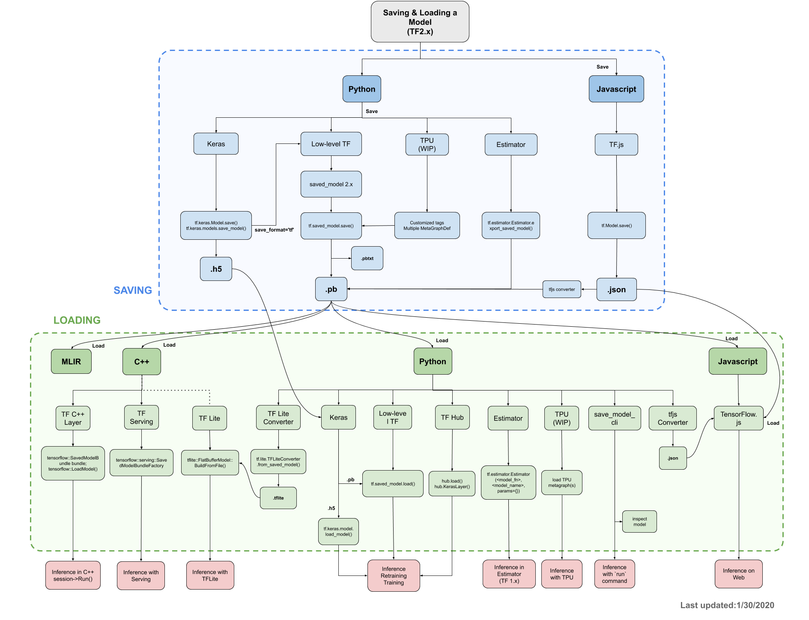

# TF SavedModel C/C++ API

| Status      | Proposed                                                                                           |
| :---------- | :------------------------------------------------------------------------------------------------- |
| **RFC #**   | [207](https://github.com/tensorflow/community/pull/207)                                            |
| **Authors** | Brian Zhao (bmzhao@google.com), Hye Soo Yang (hyey@google.com), Paige Bailey (webpaige@google.com) |
| **Sponsor** | Gunhan Gulsoy (gunan@google.com)                                                                   |
| **Updated** | 2020-02-19                                                                                         |

## Motivation

Many [developers would like to use Tensorflow’s C++ API](https://stackoverflow.com/questions/33620794/how-to-build-and-use-google-tensorflow-c-api), but the current developer user journey has a few pain points. This is a result of many factors, including: insufficient documentation, no readily-available build artifact (we do not distribute libtensorflow\_cc, forcing users to compile from source), and the general low-level nature of the APIs themselves. Since the most critical C++ API use case is production inference, we will focus on the [Saved Model API](https://github.com/tensorflow/tensorflow/blob/c347ded23c5fa658bcd315b4fdaa5e09ed4e3ef4/tensorflow/python/saved_model/README.md).

Currently, using the API requires significant setup, including [manually copying header directories from bazel outputs](https://github.com/tensorflow/tensorflow/blob/b391cb55c2861f1cf57311f85b4a893604fea3af/tensorflow/cc/BUILD#L813). For a full example loading and running inference in C++, please refer to [here](https://github.com/bmzhao/saved-model-example/blob/bee5d5a8be80eeee3134ec8f4dc8fc2a75eebf97/load_example.cc).


## Objectives

We would like to revamp the C++ saved model user journey by

1.  Examining the set of use cases we intend to support
2.  Identifying API constraints, requirements, and pain points for each use case
3.  Designing a new C++ saved model API, while being thoughtful of evolution in the surrounding space (notably TF2 and MLIR)
4.  Creating detailed documentation for C++ API and examples.

# Background

This RFC builds on top of TF2 Python SavedModel APIs, which are described in previous RFCs such as [SavedModel Save/Load in 2.x](https://github.com/tensorflow/community/blob/d066269dd0f231b8804c016c27ecfd2e809fa613/rfcs/20181116-saved-model.md) and [Keras SavedModel saving/loading](https://github.com/tensorflow/community/blob/d066269dd0f231b8804c016c27ecfd2e809fa613/rfcs/20190509-keras-saved-model.md). We assume the reader is familiar with concepts presented in these RFCs.

## Use Cases

Tooling across the TF ecosystem relies on saved model’s interface (eg: [TF.js](https://github.com/tensorflow/community/blob/d066269dd0f231b8804c016c27ecfd2e809fa613/rfcs/20190821-nodejs-saved-model.md), [TF Hub](https://www.tensorflow.org/hub/tf2_saved_model), XLA, MLIR, [Servo](https://www.tensorflow.org/tfx/serving/serving_basic#train_and_export_tensorflow_model), [TF Lite](https://www.tensorflow.org/lite/convert), etc).



Defining a unified, modern SavedModel C/C++ API:

1.  Enables features across multiple languages (Java, Go, JS, etc) through C bindings
2.  Raises the abstraction level for users in the ecosystem closer to TF Python APIs

The current set of use cases we’ve considered are documented below:

<table>
   <tr>
      <td><strong>Use Case</strong>
      </td>
      <td><strong>Priority</strong>
      </td>
      <td><strong>Supported by Current C++ SavedModel API</strong>
      </td>
   </tr>
   <tr>
      <td>
         <a href="#Inference-Use-Case">Inference</a>
      </td>
      <td>High
      </td>
      <td>Yes, but V1 style (with session)
      </td>
   </tr>
   <tr>
      <td>
         <a href="#Training-Use-Case">Data-only retraining</a> (fine-tuning weights or “resuming training after interruption”)
      </td>
      <td>Medium
      </td>
      <td>Inconvenient (possible through running session.run calls + SaverDef signature on an exported training function)
      </td>
   </tr>
   <tr>
      <td>
         <a href="#Training-Use-Case">From scratch training</a>
      </td>
      <td>Low
      </td>
      <td>Inconvenient (effectively same as above, but with no initial weights)
      </td>
   </tr>
   <tr>
      <td>
         <a href="#Introspection-Use-Case">Model Composability</a> (eg: transfer learning)
      </td>
      <td>Low
      </td>
      <td>Inconvenient (currently limited to session.run on whatever subgraphs are saved)
      </td>
   </tr>
   <tr>
      <td>
         <a href="#Introspection-Use-Case">Limited Introspection/Modification of the model</a>
      </td>
      <td>Low
      </td>
      <td>Yes (<a href="https://github.com/tensorflow/tensorflow/blob/59840cf101741aac00070a066259bf0b6d4d17ec/tensorflow/cc/saved_model/loader.h#L61">SignatureDefs</a> are exposed in the loaded model, or ahead of time usage of CLI tool <a href="https://www.tensorflow.org/guide/saved_model">saved_model_cli</a>)
      </td>
   </tr>
</table>

### <a name="Inference-Use-Case"></a> Inference

The highest prioritized use case for the C++ API is serving-time inference. Although it works today, there are a few areas for improvement.

#### TF 1 Session Coupling

The current API is still tightly coupled to TF1’s graph + session representation of the world.

Loading a savedmodel requires a [SessionOptions](https://github.com/bmzhao/saved-model-example/blob/bee5d5a8be80eeee3134ec8f4dc8fc2a75eebf97/load_example.cc#L20) object. Running the model uses a [Session object](https://github.com/bmzhao/saved-model-example/blob/bee5d5a8be80eeee3134ec8f4dc8fc2a75eebf97/load_example.cc#L54) with [“feeds” and “fetches”](https://github.com/bmzhao/saved-model-example/blob/bee5d5a8be80eeee3134ec8f4dc8fc2a75eebf97/load_example.cc#L58-L59). For newcomers to the Tensorflow community, this breaks the higher level abstraction boundary that tf.function introduces.

**Design goal: Align C++ APIs with TF 2.x concepts and paradigms** by decoupling session from SavedModel API.

#### Opaque Magic Strings

The [names of the input and output tensors required to use the API](https://github.com/tensorflow/tensorflow/blob/59840cf101741aac00070a066259bf0b6d4d17ec/tensorflow/core/public/session.h#L134-L136) are opaque implementation details outside of user control. For example, the [Keras MNIST tutorial’s](https://www.tensorflow.org/tutorials/quickstart/beginner) saved tensor names are [“serving\_default\_flatten\_input” and “StatefulPartitionedCall”](https://github.com/bmzhao/saved-model-example/blob/bee5d5a8be80eeee3134ec8f4dc8fc2a75eebf97/load_example.cc#L58-L59).

Finding these strings involves:

1.  Manually running the [saved\_model\_cli](https://www.tensorflow.org/guide/saved_model#overview_of_commands) command line tool ahead of time on the model, then hardcoding the appropriate constants, or...
2.  Dynamically iterating through the SignatureDef map, [expecting some predefined structure](https://github.com/tensorflow/serving/blob/b9602b3820dddea0d9fa9423b1ae9eaaf2aec977/tensorflow_serving/g3doc/signature_defs.md#classification-signaturedef)

**Design goal: Make the API simple and intuitive**. Do not force users to understand implementation details.

#### AOT Compilation

Another inference consideration is AOT (ahead of time) compilation of Tensorflow graphs for optimal performance. Our definition of AOT compilation is any preprocessing that occurs on a saved model to “lower” the computation into a more machine friendly representation (like flatbuffers or C++ object files). This preprocessing is typically done by a compiler which can perform additional optimizations (like variable freezing, constant folding, common subexpression elimination, etc), and may impose additional constraints (like device placement).

For example, [tfcompile](https://www.tensorflow.org/xla/tfcompile#what_is_tfcompile) allows users to convert an [XLAConfigProto](https://www.tensorflow.org/xla/tfcompile#step_1_configure_the_subgraph_to_compile) describing a TF subgraph into an [autogenerated C++ library](https://www.tensorflow.org/xla/tfcompile#step_3_write_code_to_invoke_the_subgraph) that a user can compile and link against.

We expect that an AOT workflow may be required for performance-sensitive environments (mobile, edge, etc), and that different AOT formats may be needed.

Our current thoughts are:

1.  Saved Model’s design shouldn’t preclude AOT workflow
2.  We shouldn't add AOT compilation directly in SavedModel’s API

**Design Goal:** **Decouple “serialization format” from “runtime”** **by removing the “Run” method from SavedModel**. SavedModel should be divided into a “SerializedModel” type that represents access to on-disk data only and allow “other types” to perform “running/compilation”. EG: data-only SavedModel can be used to construct another type which we call “.run()” or “.compile()” on.

### <a name="Training-Use-Case"></a> Training From Scratch/Retraining

Training support requires the ability to:

1.  Express tensor computation
2.  Compute gradients
3.  Save weights

There are a few limitations to the current C++ API that make this difficult.

First, there are _no C++ APIs today to express computation beyond “[executing ops](https://github.com/tensorflow/tensorflow/blob/59840cf101741aac00070a066259bf0b6d4d17ec/tensorflow/c/eager/c_api.h#L379)” or “[executing a session](https://github.com/tensorflow/tensorflow/blob/59840cf101741aac00070a066259bf0b6d4d17ec/tensorflow/core/public/session.h#L134)”_. This means that users must:

1.  Manually build a graph of all computation and invoke “session.run” or
2.  Write boilerplate code to call “TFE\_Execute” on each op computation.

This is rather inconvenient. An ideal solution involves designing a full-fledged C++ “eager” API like the following:

```c++
tensorflow::Tensor w({
   {1, 2},
   {3, 4}
});
tensorflow::Tensor x({100, 100});
tensorflow::Tensor b({5, 6});

// Underneath the hood this calls TFE_Execute( matmul op …), TFE_Execute( add op …)
tensorflow::Tensor y = w * x + b;
```

Second, gradient support is required for training. Today, gradients are registered in python via <code>[tf.RegisterGradient](https://github.com/tensorflow/tensorflow/blob/59840cf101741aac00070a066259bf0b6d4d17ec/tensorflow/python/framework/ops.py#L2399)</code>, and [gradients\_util.py](https://github.com/tensorflow/tensorflow/blob/59840cf101741aac00070a066259bf0b6d4d17ec/tensorflow/python/ops/gradients_util.py#L479) manipulates the graph to include necessary gradient logic. Gradient construction/registration from C++ is limited to a [small subset of ops](https://github.com/tensorflow/tensorflow/tree/59840cf101741aac00070a066259bf0b6d4d17ec/tensorflow/cc/gradients) using the [REGISTER\_OP\_GRADIENT](https://github.com/tensorflow/tensorflow/blob/59840cf101741aac00070a066259bf0b6d4d17ec/tensorflow/core/framework/function.h#L888) macro. A significant amount of per-op python gradient implementation and python logic porting to C++ would be necessary for a pure C++ training API.

For the SavedModel use case, TF python code can export a tf.function whose graph contains these gradients already. This means that training is possible in C++ today as long as TF python code first generates the saved graph.

Finally, C++ support for saving variable weights is necessary. Fortunately, this is possible today by invoking the functions referenced in a TF2 Saved Model’s [SaverDef](https://github.com/tensorflow/tensorflow/blob/31679b0d8440d2f119a2dc060b7d04fe77111bda/tensorflow/core/protobuf/meta_graph.proto#L81) proto. _Ideally_, a C++ saving API would be similar to the current [TF2 Python saving API](https://github.com/tensorflow/tensorflow/blob/59840cf101741aac00070a066259bf0b6d4d17ec/tensorflow/python/saved_model/save.py#L767) ([RFC](https://github.com/tensorflow/community/blob/master/rfcs/20181116-saved-model.md)), offering users a way to serialize an arbitrary “object hierarchy” composed of functions and variables, and would be transparently interoperable with an object hierarchy saved from python.

Building a fleshed out C++ training API will require significant investment, especially since most of Tensorflow’s high level logic is implemented only in python.

**Design Goal: Ensure current design does not preclude the creation of higher level C++ APIs described above.** We should aim for incremental delivery of small portions of functionality. Future work should be guided by a northstar of a high-level C++ API.

### <a name="Introspection-Use-Case"></a> Introspection vs Composability

In general, we don’t want to expose APIs that make assumptions on TF’s serialized representation.

For example, we could offer more advanced savedmodel “introspection/modification” APIs that manipulate the saved graph to add additional nodes, remove nodes, or fuse nodes in a saved function. These modifications might be nontrivial, or require a different API surface depending on the internal serialized representation (graph vs IR).

We want Savedmodel C++ APIs to expose the [same primitives](https://github.com/tensorflow/community/blob/d066269dd0f231b8804c016c27ecfd2e809fa613/rfcs/20181116-saved-model.md#serialization-primitives) as TF2 Python SavedModel’s object hierarchy.

**Design goal: Do not allow arbitrary introspection. Hide internal representation.** Users should only compose whatever primitives our API provides. Initially this will be limited to invoking serialized tf.functions.

### Additional Design Considerations

#### Modular Tensorflow

In accordance with [Modular Tensorflow](https://github.com/tensorflow/community/blob/master/rfcs/20190305-modular-tensorflow.md), we would like our APIs to have ABI stability, so that users can simply link against a provided shared object without worrying about compiling Tensorflow from source, or ABI compatibility issues (eg: due to mismatching compiler flags, C++ std type layout changes, etc).

To achieve this, we will implement a C++/C/C++ sandwich. A user-facing C++ header only API will internally call into a C API (exposed by [libtensorflow](https://www.tensorflow.org/install/lang_c)). This C API will wrap a C++ implementation.


## Summary of Goals

Given the above use cases and API constraints, here is a summary of our design goals.

Goals:

*   Align C++ APIs with TF 2.x concepts and paradigms (e.g. decouple session from SavedModel API)
*   Make the API simple and intuitive
*   Decouple “serialization format” from “runtime”
*   Work towards higher level C++ APIs as a northstar
*   Favor Composition over Introspection
*   Use a C layer to maintain ABI stability

Non-goal:

*   Changing current core TF runtime.

## Detailed Design

We introduce a new C++ type `tensorflow::cc::SavedModelAPI`.

`tensorflow::cc::SavedModelAPI::Load` is a static factory function that loads a SavedModel from a directory path passed as a string. It also takes two additional parameters: `tensorflow::cc::Context` (a C++ wrapper of `TFE_Context)` and an optional `std::unordered_set<std::string>` of tags.

1.  The `Context` argument can be used to provide global runtime configuration options (analogous to the existing SavedModel’s [SessionOptions](https://github.com/tensorflow/tensorflow/blob/20c1ba21a9bf0ef413c83a6bcc4e79c6f65eb868/tensorflow/core/public/session_options.h#L28) struct). This also fits TF2’s general API direction, which uses [TFE\_ContextOptions](https://github.com/tensorflow/tensorflow/blob/ee4a891f34d6f634a38eb889759f3ad49a17a22d/tensorflow/c/eager/c_api_internal.h#L53-L54) to wrap SessionOptions.
2.  `Context` provides the SavedModel a hook into the Tensorflow runtime, which decouples SavedModel from the runtime implementation.
3.  To support loading TF1 SavedModels (which may contain multiple MetaGraphs), we will add an optional “tags” argument to support loading a particular MetaGraph.

`tensorflow::cc::SavedModelAPI` has a method `GetFunction`, which _effectively_ takes a json-like path to a serialized `tf.function` in the SavedObjectGraph proto, and returns a `StatusOr<tensorflow::cc::ConcreteFunction>`. (The actual C++ types is slightly different, explained further below). This json-like function path is the set of object names (separated by dots) that the equivalent python code would have to access in order to obtain a handle to the function.

This method

4.  Removes Session from SavedModel’s interface
5.  Raises the abstraction level to TF2 type Functions
6.  Offers a way to traverse TF2’s SavedObjectGraph hierarchy.

Additionally, `tensorflow::cc::SavedModelAPI` has a method `GetSignatureDefFunction`, which takes the string key of a [SignatureDef map](https://github.com/tensorflow/tensorflow/blob/69b08900b1e991d84bce31f3b404f5ed768f339f/tensorflow/core/protobuf/meta_graph.proto#L89).

7. This allows users to continue loading TF1 SavedModels.

`tensorflow::cc::ConcreteFunction` becomes a first class C++ type that users can independently manage.

8.  Users can compose `tensorflow::cc::ConcreteFunctions` in their own “Module” like C++ classes by storing them as member variables, and invoking them.
9.  This plays nicely for a future potential `tensorflow::Module` C++ type.

`tensorflow::cc::ConcreteFunction` has a Run() method which takes vectors of input tensors and output tensors, and returns a Status.

10.  This decouples SavedModel from “Run”

`ConcreteFunction` has a method to retrieve `FunctionMetadata`, which will include additional, optional metadata objects such as SignatureDefs (for a TF1 function), InputSignatures (for TF2 tf.functions), a “funcpath” string (for TF2 functions).

11.  `FunctionMetadata` provides minimal runtime introspection of `ConcreteFunctions`, allowing users to dynamically choose which functions to run.

In the existing API, per-session.run() configuration options are exposed via <code>[RunOptions](https://github.com/tensorflow/tensorflow/blob/20c1ba21a9bf0ef413c83a6bcc4e79c6f65eb868/tensorflow/core/protobuf/config.proto#L593)</code>. In the new API, we propose using a new type `tensorflow::cc::FunctionRunOptions`. `FunctionRunOptions` is semantically equivalent to the existing `RunOptions`, but is implemented as a C++ type instead of a protobuf message.

This allows TF to:

12.  Move away from serialized protos on the API surface, which is currently the case for  <code>[RunOptions](https://github.com/tensorflow/tensorflow/blob/20c1ba21a9bf0ef413c83a6bcc4e79c6f65eb868/tensorflow/c/c_api.h#L1221)</code>
13.  Improve runtime performance, by removing a layer of proto marshalling and unmarshalling.

`tensorflow::cc::ConcreteFunction::Run()` will have a default parameter for `tensorflow::cc::FunctionRunOptions`, with suitable defaults set.

14.  This makes the default API simple to use, but gives power users (like Tensorflow Serving) the ability to tweak fine grained knobs

### C++ API

`tensorflow/cc/saved_model/experimental/saved_model_api.h`

```c++
namespace tensorflow {
namespace cc {

class SavedModelAPI {

  ConcreteFunction* GetFunction(
      const std::string& function_path,
      Status* status);

  ConcreteFunction* GetSignatureDefFunction(
      const std::string& signature_def_key,
      Status* status);

  std::vector<ConcreteFunction*> ListFunctions();

  static std::unique_ptr<SavedModelAPI> Load(
      const std::string& saved_model_path,
      const Context& context,
      Status* status,
      const std::unordered_set<std::string>* tags = nullptr);

 private:
  explicit SavedModelAPI(TF_SavedModel* model) : saved_model_(model) {}

  struct TFSavedModelDeleter {
    void operator()(TF_SavedModel* p) const { TF_DeleteSavedModel(p); }
  };
  std::unique_ptr<TF_SavedModel, TFSavedModelDeleter> saved_model_;
};

} // namespace cc
} // namespace tensorflow
```

`tensorflow/cc/saved_model/experimental/concrete_function.h`

```c++
namespace tensorflow {
namespace cc {

class ConcreteFunction {

  std::vector<TensorHandle> Run(
     const std::vector<TensorHandle>& inputs,
     Status* status,
     const FunctionRunOptions& options = FunctionRunOptions::Defaults());

  FunctionMetadata* GetFunctionMetadata();
};

class FunctionMetadata {
  // TBD; let's start with something similar to tf.function input
  // signatures
};

// Wraps a options we can pass to the runtime.
class FunctionRunOptions {

  // Fields TBD. Most likely some of these will be similar to
  // RunOptions.

  // Alternatively, we could have the default constructor do this instead  
  // by having fields set via default member initializers instead.
  static FunctionRunOptions& Defaults();
};

} // namespace cc
} // namespace tensorflow
```

### C API

`tensorflow/c/experimental/saved_model/public/saved_model_api.h`

```c++
#ifdef __cplusplus
extern "C" {
#endif

typedef struct TF_SavedModel TF_SavedModel;

// Load a SavedModel from `dirname`.
//
// Params:
//  dirname - A directory filepath that the SavedModel is at.
//  ctx - A TFE_Context containing optional load/TF runtime options.
//        `ctx` must outlive the returned TF_SavedModel pointer.
//  tags - Pointer to char* array of SavedModel tags. Conceptually,
//         this is a std::optional<std::array<std::string>>>. The first pointer
//         represents the "optional" part. If tags = nullptr, we expect the
//         SavedModel to contain a single Metagraph (as for those exported from
//         `tf.saved_model.save`). If tags != nullptr, we expect
//         *tags = char*[tags_len], and load the metagraph matching the tags.
//  tags_len - number of elements in the `tags` array.
//  status - Set to OK on success and an appropriate error on failure.
// Returns:
//  If status is not OK, returns nullptr. Otherwise, returns a newly created
//  TF_SavedModel instance. It must be deleted by calling TF_DeleteSavedModel.
// TODO(bmzhao): Before this API leaves experimental, consider introducing a
// new C API Symbol TF_LoadSavedModel that doesn't take `tags`, so that this
// function can take a `tags` double pointer instead.
TF_CAPI_EXPORT extern TF_SavedModel* TF_LoadSavedModel(
    const char* dirname, TFE_Context* ctx, const char* const* const* tags,
    int tags_len, TF_Status* status);

// Deletes a TF_SavedModel, and frees any resources owned by it.
TF_CAPI_EXPORT extern void TF_DeleteSavedModel(TF_SavedModel* model);

// Retrieve a function from the TF2 SavedModel via function path.
//
// Params:
//  model - The TF2 SavedModel to load a function from.
//  function_path - A string containing the path from the root saved python
//                  object to a tf.function method.
//                  TODO(bmzhao): Add a detailed example of this with a
//                  python tf.module before moving this out of experimental.
//  status - Set to OK on success and an appropriate error on failure.
// Returns:
//  If status is not OK, returns nullptr. Otherwise, returns a
//  TF_ConcreteFunction instance. The lifetime of this instance is
//  "conceptually" bound to `model`. Once `model` is deleted, all
//  `TF_ConcreteFunctions` retrieved from it are invalid, and have been deleted.
TF_CAPI_EXPORT extern TF_ConcreteFunction* TF_GetSavedModelConcreteFunction(
    TF_SavedModel* model, char* function_path, TF_Status* status);

// Retrieve a function from the TF SavedModel via a SignatureDef key.
//
// Params:
//  model - The SavedModel to load a function from.
//  signature_def_key - The string key of the SignatureDef map of a SavedModel:
//                      https://github.com/tensorflow/tensorflow/blob/69b08900b1e991d84bce31f3b404f5ed768f339f/tensorflow/core/protobuf/meta_graph.proto#L89
//  status - Set to OK on success and an appropriate error on failure.
// Returns:
//  If status is not OK, returns nullptr. Otherwise, returns a
//  TF_ConcreteFunction instance. Once `model` is deleted, all
//  `TF_ConcreteFunctions` retrieved from it are invalid, and have been deleted.
TF_CAPI_EXPORT extern TF_ConcreteFunction* TF_GetSavedModelSignatureDefFunction(
    TF_SavedModel* model, char* signature_def_key, TF_Status* status);

// Returns a list of all ConcreteFunctions stored in this SavedModel.
TF_CAPI_EXPORT extern TF_ConcreteFunctionList* TF_ListSavedModelFunctions(
    TF_SavedModel* model);

#ifdef __cplusplus
}
#endif
```

`tensorflow/c/experimental/saved_model/public/concrete_function.h`

```c++
#ifdef __cplusplus
extern "C" {
#endif

typedef struct TF_ConcreteFunction TF_ConcreteFunction;

// Returns FunctionMetadata associated with `func`. Metadata's lifetime is
// bound to `func`, which is bound to the TF_SavedModel it was loaded from.
TF_CAPI_EXPORT extern TF_FunctionMetadata* TF_ConcreteFunctionGetMetadata(
    TF_ConcreteFunction* func);


#ifdef __cplusplus
}
#endif
```

### Additional Implementation Considerations

#### ABI Stability

Finally, due to our ABI stability goal, all types exposed in the C++ header only API’s surface (function input and output types) must be either

1. "`std::`" types

2. C++ types implemented in a header only library (there must not be a .cc file)

3. types that wrap a C type.

For category 3 of "types that wrap a C type", we propose putting them under a new "`tensorflow::cc`" namespace. These types will have an ABI stability guarantee.

Note that this will mean the Tensorflow codebase will have the same "conceptual type" under two parallel namespaces, but the one under the "`tensorflow::cc`" namespace has the ABI stability guarantee.

For example, `SavedModelAPI`'s `GetFunction` method will have to return a `tensorflow::cc::Status`, that wraps the C <code>[TF_Status](https://github.com/tensorflow/tensorflow/blob/c347ded23c5fa658bcd315b4fdaa5e09ed4e3ef4/tensorflow/c/tf_status_internal.h#L24)</code>, instead of directly being a <code>[tensorflow::Status](https://github.com/tensorflow/tensorflow/blob/c347ded23c5fa658bcd315b4fdaa5e09ed4e3ef4/tensorflow/core/platform/status.h#L39)</code>.

#### TFE\_Execute Integration

As a result of [Single python code path for eager and graph (RFC)](https://github.com/tensorflow/community/blob/d066269dd0f231b8804c016c27ecfd2e809fa613/rfcs/20191203-single-eager-graph-path.md), Python’s FuncGraph representation is moving to C++. We expect this C++ FuncGraph to be the underlying representation of the opaque C type `TF_ConcreteFunction`. Our work aligns in building a common way to execute the FuncGraph (perhaps by dispatching a PartitionedCallOp to `TFE_Execute/TF_Execute`).

Some important caveats:

1.  Variable lifetime - In TF1, variable lifetime was managed by the VarHandleOp tied to a Session. This is no longer the case with op-by-op dispatch in TF2 style execution. We will need to implement our own variable lifetime management.
2.  `PartitionedCallOp` - For graphs that are missing `(Stateful)PartitionedCallOp`, we will need a mechanism to build the `PartitionedCallOp` for running (`TFE_Execute`) the TF function.

#### **V2 SavedModel Loader**

The [MLIR](https://mlir.llvm.org/)/[IREE](https://github.com/google/iree#project-goals) team’s work has laid an excellent foundation for the C++ TF2 SavedModel API through [bundle\_v2.h](https://github.com/tensorflow/tensorflow/blob/c347ded23c5fa658bcd315b4fdaa5e09ed4e3ef4/tensorflow/cc/saved_model/bundle_v2.h#L37). It traverses and loads the object hierarchy of a V2 saved model.

However, it comes with a few limitations such as:

1.  [requiring input\_signature specifications for each exported function](https://docs.google.com/presentation/d/1R6H_Eax6sXT2-ffpmF5zjHwS1F22D2DF2ty7EvdAUUw/edit#slide=id.g758020ea42_0_37), and
2.  requires a 1:1:1:1 mapping from [tf.function <=> SavedFunction <=> SavedConcreteFunction <=> FunctionDef](https://github.com/tensorflow/tensorflow/blob/c347ded23c5fa658bcd315b4fdaa5e09ed4e3ef4/tensorflow/compiler/mlir/tensorflow/translate/import_model.cc#L2357-L2359)

We should try to leverage this existing work to implement a V2 SavedModel loader.

#### Utility Functions

`saved_model_cli` is a Python binary tool for inspecting and running a SavedModel (.pb). There isn’t a utility tool like such in C++. We will provide basic model inspection functionalities as part of the API so that the users do not need to jump between Python and C++. This is fulfilled by the `tensorflow::cc::SavedModel::ListFunctions` `tensorflow::cc::FunctionMetadata` APIs.

#### API Usage Examples

A model can be exported and loaded in the manner described below.

Export model from Python:

```python
import tensorflow as tf
import numpy as np
 
class Dense(tf.Module):
   def __init__(self, in_features, output_features, name=None):
       super(Dense, self).__init__(name=name)
       self.w = tf.Variable(
           tf.random.normal([in_features, output_features]), name='w')
       self.b = tf.Variable(tf.zeros([output_features]), name='b')
 
   @tf.function
   def apply(self, x):
       y = tf.matmul(x, self.w) + self.b
       return tf.nn.relu(y)
 
class MyModel(tf.Module):
   def __init__(self):
       self.a = Dense(10, 3)
       self.b = Dense(10, 3)
 
   @tf.function
   def run(self, x):
       return self.a.apply(x) + self.b.apply(x)
 
x = MyModel()
input = tf.random.uniform((2, 10), minval=0, maxval=100)
print(x.run(input))
 
saved = tf.saved_model.save(x, './saved')
y = tf.saved_model.load('./saved')
 
print(y.a.apply(tf.random.uniform((2, 10), minval=0, maxval=100)))
```

Loading the model in C++:

```c++
using tensorflow::cc::Status;
using tensorflow::cc::SavedModelAPI;
using tensorflow::cc::ConcreteFunction;

// Load a model.
Status status;
std::unique_ptr<SavedModelAPI> saved_model =
      SavedModel::Load("saved", context, &status);

if (!status.ok()) {
  LOG(FATAL) << "Failed to get load model.";
}

// Get function.
ConcreteFunction* func =
      saved_model->GetFunction("a.apply", &status);
if (!status.ok()) {
  LOG(FATAL) << "Failed to get Function.";
}

// Run function.
func->Run(...)
```
