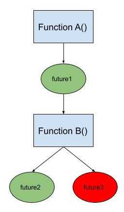

# Single-client Parameter Server Training

| Status        | Proposed                                             |
:-------------- |:---------------------------------------------------- |
| **Author(s)** | Yuefeng Zhou (yuefengz@google.com), Rick Chao (rchao@google.com) |
| **Sponsor**   | Priya Gupta (priyag@google.com)                      |
| **Updated**   | 2018-03-06                                           |


## Background

Parameter server training is a very commonly used distributed training architecture. It is especially relevant to models with large embeddings, for training on large clusters of machines with CPUs, or when scalability is preferred over determinism. Its high-level idea is to create variables on parameter servers and in each step let workers take different training inputs, pull variable values from parameter servers, compute gradients and send them to parameter servers.


### Distribution Strategy

Distribution Strategy (`tf.distribute.Strategy`) is a library that aims to allow users to write simple model code and scale up their models automatically with decent out-of-box performance. We will design parameter server training under the umbrella of `tf.distribute.Strategy` in TensorFlow 2 with a single-client architecture, in contrast to the multi-client approach which is traditionally done in TensorFlow distributed training such as `tf.estimator.Estimator` or `tf.distribute.experimental.MultiWorkerMirroredStrategy`.

Distribution Strategy’s [custom training loop](https://www.tensorflow.org/tutorials/distribute/custom_training) (CTL) API has been popular among users who want  more control in writing their training loops. User community of this API is large. We would like to focus on supporting CTL API first and later abstract out a commonly used pattern for Keras `compile`/`fit` API.


### Single-Client Distributed Training

We recommend a single client architecture for parameter server training in TensorFlow 2. This means there is only one client in a training cluster that coordinates the training of all workers in contrast to the multi-client setup in TensorFlow 1.x where each worker has its own coordinator. 

We believe that a single-client architecture can provide a simpler programming model than multi-client setup. A single source of truth can avoid bugs due to inconsistencies in multi-client setup. Furthermore, a single source of control can enable more determinism. In extreme cases, it can launch long-running tasks and turn into multi-client effectively.


## Goal

The goal of this project is to support multi-worker asynchronous training with `ParameterServerStrategy` and CTL API, and in the long term also Keras `model.fit()`. In the first stage of this project, we focus more on design ideas rather than the APIs.

The goal of this document is to discuss the high-level design and challenges of various pieces needed to support single-client parameter server training. Detailed designs for some pieces may be directed to other documents.


## Overview


### Programming Model

With a single-client architecture, the programming model will be different than the multi-client architecture. All workers and parameter servers are standard TensorFlow servers, and the user-defined program will run on the client only. Generally, no matter what high-level APIs users will use, the workflow for running a step function distributedly with single-client approach includes the following steps:


1. Connect to all remote workers and parameter servers. 
2. Create variables on parameter servers and hold references to them.
3. Create datasets and iterators on workers.
4. Create the replica function that takes an iterator as input, trace it and register it on all workers.  Note: a function may create variables as well. If not specified, they will be created on parameter servers at the time the function is traced.
5. Dispatch the step function on one available worker.
6. Repeat 5 until the end of epoch.
7. Repeat 5 - 6 until the stop criteria is reached.


### Interfaces

One of our goals is to make `ParameterServerStrategy`’s API consistent with other strategies so that users can easily switch between them. This may be challenging due to the fundamental difference between synchronous and asynchronous training. Therefore, we try to use most of the Distribution Strategy’ APIs but occasionally we will create APIs that still make sense in other strategies as well.

**Note: all proposed APIs in this document are tentative and only valid for our first version. We will revisit them once we get enough feedback from users and the community.**


#### Constraints

Function is first-class citizen. Users should only schedule functions instead of running individual ops, in addition to creating variables. We will only support `tf.function`s. Scheduling arbitrary Python functions will not be supported in the first cut.

Users can occasionally run individual ops on the client, only for reporting purposes such as printing a metric’s value.


#### Schedule/Join Primitives

The `strategy.run` API was initially developed for synchronous training. We propose a new pair of primitives to

*   hide the details of load-balancing, fault tolerance and dynamic scheduling
*   expose the non-blocking semantics to users.

```python
class ParameterServerStrategyV2:
  
  def schedule(self, replica_fn, args=(), kwargs=(), schedule_options=None):
    """Schedule the `replica_fn` on a worker.
   
    Schedule the `replica_fn` on a worker that is available, returns a future
    object immediately.

    By default, it implements at-least-once semantics for function execution. If
    client gets a retryable error, e.g. worker preemption, it will reschedule the
    function on another worker. So this method assumes that function execution can
    be out of order. 

    If `args` or `kwargs` contains distributed values such as a distributed dataset
    returned from `strategy.distribute_dataset` or
    `strategy.distribute_dataset_from_function`, the slice of the dataset
    corresponding to the scheduled worker will be substituted for the original
    distributed value.

    If some element in `args` or `kwargs` is bound to a specific worker, the
    execution of the function may fail if the worker fails. We will consider
    rebuilding the inputs to achieve at-least-once in all cases.

    The `schedule_options` will give users flexibility to specify which worker to
    schedule on. We will support more options in the future.

    If there are barriers in `replica_fn`, it is users' responsibility to make
    sure they won't cause deadlock. If `replica_fn` has collective ops that are
    bound to specific devices, we recommend users use the run method instead.
    """
    pass
  
  def join(self, futures=None):
    """Wait until all given futures are ready.

    Raises an error if any of the functions fails to execute. In this case,
    there is no guarantee that non-failing functions will complete.

    When join() is being called, it is not allowed to call `schedule`.
    """
    pass

  def done(self):
    """Returns True if there are no pending functions to be executed."""
    pass

  def local_results(self, futures):
    """Get concrete values of the futures.
    
    Poisoned future objects will give `None`.
    """
    pass


class Future(object):

  def wait(self):
    """Block until the corresponding function is executed."""
    pass
  
  def result(self):
    """Materialize the future.

    This is a blocking call. An exception will be thrown if the corresponding
    function fails to execute or schedule.
    """
    pass


class ScheduleOption(object):

  def __init__(assigned_worker=None):  # More options to be added.
    pass
```


#### Dataset Interface

The traditional training loop of `tf.distribute` passes the `get_next` results of a distributed iterator to `replica_fn`:

```
for x, y in distributed_iter:
  loss = strategy.schedule(replica_fn, x, y)
```

If we do the same thing with the `strategy.schedule` API, there are several challenges.

The first challenge is we don’t know which worker the `get_next` should return to since where the `replica_fn` will be executed will be decided later. Some later-binding mechanism can be explored.

The second challenge is calling `get_next` on an iterator is synchronous. This means that the training loop is not truly asynchronous. It is tricky to make `get_next` asynchronous because the client doesn’t know how many items will be in the iterator and thus doesn’t know how many functions to schedule. 


##### Alternative: passing iterators to `strategy.schedule`

The following training loop is less consistent with other `tf.distribute` examples but is easier to implement in the short term. It requires users to explicitly set a number of steps.

```python
# … omitted
with strategy.scope():
  # … omitted
  distributed_iter = iter(distributed_dataset)
  for i in range(total_steps):
    strategy.schedule(replica_fn, args=(distributed_iter,))
# … omitted
```

**We will start with this kind of training loop in our first version. We hope to get rid of this restriction in the future.**


#### Example: Estimator-style Training with Custom Training Loop

In Estimator, workers independently run training steps. Datasets created on each worker are usually identical but shuffled differently. The termination of training is decided based on the global step. Since workers are independent and stateless, workers can come and go freely. We can achieve similar behavior with our proposed interfaces.

To construct a custom training loop for Estimator-style training, users need to

*   use `strategy.experimental_distribute_datasets_from_function` to create one dataset per worker. The dataset should be the same but shuffled differently across workers.
*   create models under `strategy.scope` so variables will be assigned to parameter servers.
*   likewise, create a Keras metric object under `strategy.scope`. Each worker, within their `replica_fn`, updates the metric states.
*   use `strategy.schedule` to schedule the `replica_fn` into the cluster, which will end up scheduled on one remote worker. This `replica_fn` should take an iterator and perform forward and backward computation. This `strategy.schedule` returns one or several `Future` objects immediately.  
*   use `strategy.local_results` to get concrete values of results returned by `strategy.schedule`. This may be a blocking call if the result is not yet ready. With any failure that cannot be handled will be ignored and as a result some of the results may be `None`.
*   call `strategy.join` to wait until all scheduled functions are executed.

```Python
# Connect to remote servers with a user-provided `ClusterResolver` object.
strategy = ParameterServerStrategyV2(cluster_resolver)

dataset_fn = # a function that returns a dataset

# Clone the dataset on all workers, shuffled with different seeds.
distributed_dataset = strategy.experimental_distribute_datasets_from_function(
      dataset_fn)

with strategy.scope():
  # Create variables on parameter servers in a round-robin fashion.
  model = create_model()
  optimizer = tf.keras.optimizers.Adam()
  accuracy = tf.keras.metrics.CategoricalAccuracy(name="train_accuracy")
  checkpoint_manager = tf.train.CheckpointManager(
       tf.train.Checkpoint(model=model), checkpoint_dir, max_to_keep=2)

  @tf.function
  def replica_fn(iterator):
    x, y = next(iterator)
    with tf.GradientTape() as tape:
      predictions = model(x, table, training=True)
      loss = compute_loss(y, predictions)
    gradients = tape.gradient(loss, model.trainable_variables)
    optimizer.apply_gradients(zip(gradients, model.trainable_variables))
    accuracy.update_state(y, predictions)
    return loss

  for _ in range(num_epoches):
    distributed_iter = iter(distributed_dataset)
    for i in range(steps_per_epoch):
      # strategy.schedule pushes a closure in the scheduling queue and
      # returns a list of future objects immediately.
      loss = strategy.schedule(replica_fn,
                               args=(distributed_iter,))
    strategy.join()
    checkpoint_manager.save()  # save checkpoint/summary...
    print ("Loss = %f, accuracy = %f" % (
        strategy.local_results(loss) or float('nan'), accuracy.result()))
```


### Fault Tolerance

This section talks about the failure model and how we will support it. It has limitations and we will consider exposing APIs for users to define custom failure recovery policies in the future.


#### Task Failure


##### Worker failure


###### When scheduling

When a worker fails, our training will continue without this failed worker. Functions scheduled on a failed worker will be rescheduled on other workers. 

For functions that bound to a specific worker, e.g. resource creation function, they will be queued until the worker is back.

When the failed worker is back, we will update the cluster configuration with `context.update_server_def` which would also reset all the states. After resources on the restarted worker are built, we can resume scheduling functions on the worker. 


###### When materializing a `Future` object

It is possible that a function is executed but its corresponding worker fails when users try to consume its output. In this case, we will give users a `None` value and set an error in the `Future` object.

We can mitigate the problem by eagerly materializing function outputs when they are passed to `local_results`. 

We can explore mechanisms to recover these objects in the future. In the short-term, users can choose to write the results to variables on parameter servers, just like a Keras metric.


##### Parameter server failure

When a parameter server fails, the error will be propagated to the client via workers. Since the latest values of variables on the failed parameter servers are gone, there is no way for the client to recover them. Therefore the training will pause until the failed parameter server is back. The client then needs to clean up other variables on other parameter servers, rebuild all the variables and load variable values from a checkpoint. To trigger this process, the simplest method is to restart the client as well. This would require the cluster management to start the program again, once it receives an error from the client program due to parameter server failures.


##### Client failure

When a client fails, some scheduled functions will continue to run on workers. No new functions will be scheduled. When the client comes back, it will create variables, load from a checkpoint, schedule functions with a new context id. All the old variables will be garbage-collected when we reset their eager contexts.


#### Resource Management for Workers

When a worker has recovered from failure, we will need to rebuild iterators, worker-local variables, lookup tables and other resources on that worker that don’t need to be read from a checkpoint. This means that the client will have to keep track of these iterators, worker-local variables and other resources.

Keeping track of resources and rebuilding them will be achieved depending how users create their resources:

*   we will record iterators created via `tf.distribute`’s API; The state of a rebuilt iterator will be lost. We can recover their states as future work.
*   In the future we will provide users an API to create worker-local resources. We will capture these resources in the API.

If users create iterators or other resources inside a function but don’t expose them as outputs, we don’t need to rebuild them.


#### The Unknown of Scheduled Functions

For functions that have been scheduled, it is difficult for the client to know whether they have actually been executed or not when the client detects their corresponding worker failure. Therefore, in addition to inform users of this uncertainty in the case of worker failure, we should do the following to reduce this uncertainty:

*   keep the number of scheduled but not executed functions small. This may be difficult to achieve since there is not an easy way for the client to know whether a function is executed or not. The only way is to synchronize the executor. Therefore, as a workaround we will have to periodically synchronize the executor to make sure functions are actually executed, before the client schedules more functions. In the long run, we should get acknowledgement from runtime about how many functions have been executed.
*   eagerly fetch the outputs of remote functions once the outputs are passed to `strategy.local_result`. In this way, we can know the status of function execution earlier.
*   recommend users schedule only small functions. Large functions are more expensive to retry.


#### Schedule Affinity

When there is schedule affinity, specified by `ScheduleOptions` or inferred from input affinity, the aforementioned failure handling mechanism of rescheduling a function on other workers will not work. In this case, the default behavior is the client waits for the failing worker to come back until timeout and returns a schedule error to users.


### Evaluation

Historically, `tf.estimator.Estimator` uses a dedicated evaluator that periodically loads from a checkpoint, and performs evaluation with evaluation data. On the other hand, `tf.keras` typically evaluates in an alternating manner after every epoch of training, and this is also the case with `tf.keras` + `MultiWorkerMirroredStrategy`. 

With `ParameterServerStrategyV2`, we will start with two schemes: 1) evaluation done by a dedicated **** evaluator that runs alongside the training cluster, aka “sidecar evaluation”, with a supporting utility function, and 2) evaluation done by a function executed on a single worker or functions executed on multiple workers, aka “inline evaluation”, where evaluation takes place in an alternating manner with training. 

Sidecar evaluation is especially useful for those users who prefer the settings where evaluation does not interrupt training progress, if saving/loading checkpoints are not considered expensive.

Inline evaluation is especially useful for those users who would like to avoid checkpoint saving/loading, and those who feel performing evaluation isn’t too expensive so that it’s fine training is stopped for a short period of time.


#### Sidecar evaluation

In this scheme, the training client is required to generate checkpoints periodically, and the evaluator reads the latest checkpoint as it becomes available. The evaluation is asynchronous to the training progress. With our recommendation[^1], users should create a separate evaluation client that runs the same python binary as the training client. This python binary will contain the if-else clause as it bifurcates into two paths:

```Python
if cluster_resolver.task_type == "chief":
  run_training_loop()
elif cluster_resolver.task_type == "evaluator":
  run_evaluation_loop()
```

For user’s convenience, we will provide an `EvaluationLoop` API where the user provides key components for evaluation:

```Python
def run_evaluation_loop(...):
  """Run the example custom evaluation loop."""

  model, eval_dataset, checkpoint_dir, eval_metrics = ...

  utils.EvaluationLoop(
      model,
      eval_dataset,
      checkpoint_dir,
      eval_metrics).start()

class EvaluationLoop(object):
  
  def __init__(self, model, eval_dataset, checkpoint_dir, eval_metrics,
               eval_steps=None):
    """Initializes an EvaluationLoop object."""

    @tf.function
    def eval_fn(dataset):
      """Evaluation function to compute metrics given a dataset.

      This creates a tf.function'ed evaluation function, where the dataset is 
      iterated over until exhaustion, or until eval_steps is met, whichever comes
      earlier. If `eval_steps` is None, it exhausts the dataset. If dataset is
      repeated, `eval_steps` must be provided or evaluation will be performed
      indefinitely.
      """
      pass

    self._eval_fn = eval_fn
    # Other self attributes.

  def start(self):
    """Starts an evaluation loop.

    This will start an evaluation loop which attempts to read the latest
    checkpoint file. If a checkpoint file exists, and it has not been
    evaluated, it loads it into the model, and executes the `eval_fn` locally. 
    After each evaluation run, it logs the metrics requested by the user,
    writes to summary file for TensorBoard visualization, and possibly outputs
    files for chief to read for further actions such as early stopping or 
    adjusting learning rate.
    """
    pass
```

As illustrated above, evaluation loads into the model the checkpoints that were periodically saved (by the training client), does evaluation over a full pass of the eval dataset, and outputs the eval results. It may also export results to files which can be read by the training client for actions (such as reducing learning rate, early stopping, etc.)

At evaluator’s failures or preemptions, we expect the evaluator job to be restarted, pick up the latest checkpoint, and continue with the next round of evaluation.


#### Inline evaluation

In this scheme, there’s no checkpoint needed (although the training/evaluation can still involve one at user’s choice), and the same set of workers is used for evaluation after some amount of training (usually an epoch of training) has completed. No dedicated evaluator job is needed. As illustrated below, this would require users to write their `eval_fn` and schedule it to workers.

```Python
strategy = ParameterServerStrategyV2(cluster_resolver=...)

with strategy.scope():
  model, train_metric, train_dataset = ...
  @tf.function
  def train_fn():
    ...

  eval_metric = tf.keras.metrics.CategoricalAccuracy(name="eval_accuracy")
  @tf.function
  def eval_fn(shard_id, num_shards):
    eval_dataset = ...
    for x, y in eval_dataset.shard(shard_id, total_shard):
      eval_metric.update_state(y, model(x, training=False))

  for _ in range(num_epochs):
    for _ in range(num_steps):
      strategy.schedule(train_fn, args=...)  # Training for num_steps steps.
    strategy.join()  # Make sure training ends and nobody is updating PS.

    # NUM_SHARDS' some sensible number, needs to be at least the number of workers,
    # preferably much larger than that.
    for shard_id in range(NUM_SHARDS):  
      strategy.schedule(eval_fn, args=(shard_id, NUM_SHARDS))
    strategy.join()
    print("Eval result is %f." % eval_metric.result())

    # Optionally save checkpoint/summary, adjust learning rate or early stop,
    # based on the evaluation result.
    checkpoint_manager.save()  
```


If the worker that’s actively performing the evaluation encounters failures or preemptions, it is expected that `eval_fn` with a specific `shard_id` will be taken over by another available worker. This may result in duplicated evaluation on some input examples. This can be solved by having metrics as worker local resources, and returning the metric results as the return value of `eval_fn`. The user would then aggregate on the results of those `eval_fn`s.


## Implementation


### Low-level Primitives

We can potentially expose them in the future when they are more stable and when we want to allow more advanced use cases.

We will have `Cluster` and `Worker` classes to encapsulate logic related to remote function scheduling.

```Python
class Cluster(object):

  def __init__(self, cluster_resolver, failure_handler=None):
    """Create the cluster instance and connect to the remote cluster."""
    pass

  @property
  def workers(self):
    """Return all available workers."""
    return self._workers

  def schedule(self, function, args=None, kwargs=None):
    """Schedule the function on one worker.

    It adds the function to the global scheduling queue and returns future
    objects immediately.
    """
    pass

  def join(self):
    """Block until all scheduled functions are complete."""
    pass
```

We will probably merge this `Worker` with executors.

```Python
class Worker(object):

  def __init__(self,
               worker_job_name,
               cluster,
               max_scheduled_functions=100):
    """Create a scheduling queue and a thread that processes the queue."""
    pass

  def schedule(self, function, args=None, kwargs=None):
    """Schedule the function on the worker.

    It adds the function to the scheduling queue. It returns Future object
    immediately.
    """
    pass

  def healthy(self):
    """Return a boolean indicating whether the worker is health or not."""
    pass

  def _set_dead(self):
    """Declare the worker is dead and poison all future objects."""
    pass

  def _rebuild_resources(self):
    """Rebuild worker-local resources when it is recovered from failure."""
    pass
```

As we mentioned the return value of `schedule` will be `Future` objects. The `Future` works as a container and will be later-binded with states of either success or complete failure. Overall, this `Future` class has the following benefits:

*   It allows the `schedule` method to return immediately after pushing functions to its scheduling queue. It allows these methods to return without needing to wait for acknowledgement from workers.
*   It serves as the container for values or errors. It would be binded with a value or an error later. When it is rebuilt, we can replace its underlying value silently.
*   When being passed to `local_result`, we flag it to indicate that this value needs to be fetched eagerly.
*   It provides a handle for user to wait for and get the error of a particular function.
*   (Future work) It captures the lineage between functions and return values so that we can rebuild any poisoned objects. 

```Python
class Future(object):

  def __init__(self, closure):
    pass

  def wait(self):
    """Block until the corresponding function is executed."""
    pass
  
  def result(self):
    """Materialize the future.

    An exception will be thrown if the corresponding function fails to
    schedule/execute.
    """
    pass

  def _set_value(self, value):
    pass

  def _set_error(self, error):
    pass

  def _set_eagerly_fetch(self):
    pass
```

We can potentially merge this `Future` class with our `Tensor` class.


## Future Work

The following are features we have been considering to support in the future although this is not an exhaustive list. We don’t promise to support all of them. We’ll prioritize according to the feedback from the community and users.


### Dynamic Membership

Workers can come and go. To support this, we’ll probably need a mechanism to discover and remove workers and make our implementation of `tf.distribute` reactive. 


### Automated Worker Pool Resizing

Once dynamic membership is supported, it would be useful that there is automation built on top of dynamic membership, where the number of workers increases or decreases automatically based on the usage.


### Caching Variables/Resources

Some variables or resources can be cached on workers to achieve faster read and update. They can have a global copy on parameter servers and local copies on all workers. We should allow users to define policies to use cached local copies to update the global copy whenever the latest value is needed.

These variables include loss scales in mixed precision training and batchnorm statistics. These are similar to sync-on-read variables in other distribution strategies. A possible way to update the global copy using a local copy is: `global_value += (local_value - global_value) / num_workers`.

Hash tables for embedding lookup can also be cached on workers.


### Worker-local Resources

Lookup tables, replay buffers or any other worker-local resources that need to be elastic to work with the `schedule` API. The `distribute_dataset` method can also call this method to create elastic datasets for training.

```Python
class ParameterServerStrategyV2(BaseStrategy):

  def create_worker_resource(self, resource_creation_fn):
    """Create one resource per worker.

    If workers are added, the `resource_creation_fn` will be called to create
    resources on new workers.
    """
    pass

class ElasticResource(object):
  
  def __init__(self, resource_dict):
    pass

  def add_resource(self, worker_resource_pair):
    pass
  
  def remove_resource(self, worker):
    pass

  def get(self, worker):
    """Return the concrete resource on the given `worker`.
    
    If an scheduled function takes `ElasticResource` as input, the scheduler, after
    deciding which worker to schedule the function on, will call this method to
    get the underlying resource on the corresponding worker.
    """
    pass
```


### Integration with tf.data Service

In our design, we assume that `replica_fn` can be scheduled on any worker with some constraints. For example, datasets can not be sharded across workers; rebuilding iterators will lose their states. With the help of `tf.data` service, we can get rid of these constraints. 


### Keras Integration

Integrating with Keras `model.fit()` will largely be reusing previous work done when synchronous distribution strategies  were integrated with Keras. We hope from the end-user’s perspective, they will notice minimal changes when they switch from other strategies.

Most important implication of integrating with Keras `model.fit()` is that we will need support for `strategy.join()` and/or `strategy.local_results()` for callbacks. This would have performance implications but that would be the trade off for fitting the synchronous `model.fit()` semantics. 


### More ScheduleOptions

More schedule options can be added such as how many times of reschedules before returning an error to users if a function gets interrupted because of worker preemption. 


### Versioning

The client and standard server binaries may be in different versions. There is no backward or forward compatibility guarantee. For now, we recommend users run the same binary which will run standard TensorFlow servers if it is not the client. 


### Better Preemption Handling

We can leverage features of container orchestration frameworks to improve preemption handling. For example, if we can get notifications about a worker or a parameter server about to be preempted, we can save some of its state and recover much faster with this state.


### Advanced Fault Tolerance


#### Reschedule Functions with Input Affinity

Our proposed `schedule` method supports at-least-once semantics only when functions don't have input affinity. Functions that depend on inputs that only exist on one worker can not be rescheduled. We can think of ways to rebuild these inputs to achieve at-least-once in more cases.

With input-affinity, there may be futures that are bound to a worker and the worker can die and don’t come up within a reasonable timeout. We should poison these futures in this case.


#### Rebuild Arbitrary Resources and Future Objects

Any poisoned future can be rebuilt according to the lineage relationship between functions and futures. For example, in the following diagram, to rebuild `future3`, we can rerun function `A` and function `B`, likely on a different worker if the original worker is dead.





### Multi-GPU Support

We can expand the `replica_fn` into a multi-GPU function before we schedule it.


### Wrap `schedule`/`join` into a `tf.function`

It is possible to implement ops for `schedule` and `join` and make the training loop wrappable by a `tf.function`. 

When a `Cluster` object is created, we use an op to create a scheduling queue and launch a background thread in runtime to periodically check the scheduling queue and schedule items on one available worker.

The `schedule` op could just push a closure into the scheduling queue. Note any control dependency added between `schedule` ops won’t make the execution deterministic.

The `join` op could wait until the scheduling queue is empty.
