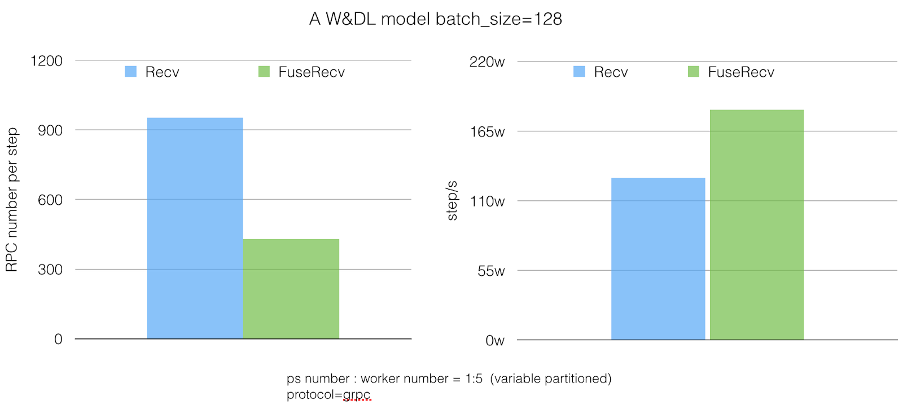

# FuseRecv

| Status        | (Proposed / Accepted / Implemented / Obsolete)       |
:-------------- |:---------------------------------------------------- |
|
| **Author(s)** | Tongxuan Liu(tongxuan.ltx@alibaba-inc.com) Peng Tao(jiankeng.pt@alibaba-inc.com) Langshi Chen (langshi.cls@alibaba-inc.com) |
| **Sponsor**   | i                                                    |
| **Updated**   | 2020-04-09                                           |

## Objective
This RFC proposes a new FuseRecv Op which would recv multiple tensors with
different types through one RPC. This feature could significantly reduce the
number of RPC calls in most rank or match models in Search, Recommend or Ad
System.

## Motivation
When very many small tensors are being transferred around the same time,
it's more efficient to transfer multiple values in a single RPC rather than
using a separate RPC for each. 

In the case the neural network graph is complicated, each iteration through
the graph may introduce tens or even hundreds of RPC calls between the running
nodes. In general there are a large number of small tensors, such as multiple
feature columns gather from the same Parameter Server which have no dependence
on each other, and each feature column results in at least one RPC call in
the forward stage. In CTR (Click Through Rate) model or most sparse models
(Match or Rank models widely used in Recommend system or Ad system), there
would be hundreds of feature columns (in our scenario, each sample includes
at least hundreds of features). One job normally have to use thousands of
workers and tens of parameter servers. One worker generally has to gather
or get variables from all the parameter servers, and each feature column
at least in the forward stage has at least one request from the parameter
server. There could be hundreds of RPC for these feature columns,
and even more some big feature columns (such as ids) would be partitioned
could be dozens of RPCs for one feature column. In summary there would be
at least hundreds of RPC per worker only for these feature columns, and
hundreds * thousands RPCs in each parameter server in the forward stage
of one step. Most feature column only gather very small data from parameter
server, normally less than 100KB. Logically these small tensors could be
sent together. Furthermore, tensors that belong to the same layer can also
be fused which would significantly reduce the number of RPC calls.

As we know, each RPC call will introduce some satellite overhead besides the
real tensor value transfer, which includes:
* Serialization/Deserialization introduce extra overhead for each RPC operation.
* The execution engine overhead for executing a recv node, and the corresponding thread pool action to execute the RPC callback.

## User Benefit

Performance improvement: From feedbacks of the feature, in a large traning job
(> 400 workers), normally traning speed would be 1.5-2x timer faster in
ps-worker mode.

## Design Proposal


In original design of Recv/Send, each Recv node only recv one tensor
even if there're Recv Ops output to same destination Op. Moreover each
Recv node would trigger one RPC call even received tensor is a scalar.

In this design, we traverse graphs, replace Recv nodes by FuseRecv node in
partitioned graphs according to its topology while iteratively searching
and fusing potential Recv node.

As shown in Figure 1 and 2, instead of adding a Recv node for each tensor
‘a’ and ‘x’, we use one FuseRecv to replace two Recv nodes which fetch two
tensors together. The FuseRecv node will have two output ‘slots’(‘ports’):
slot 0 feeds input ‘b’ and ‘c’ and slot 1 feeds ‘y’. Notice that there is
no need to fuse the send node, because the RPC call is Recv driven.

A new RPC method ‘FuseRecvTensorAsync’ and it's
Handler (FuseRecvTensorHandlerRaw) is added into WorkInterface and
WorkerService. FuseRecvTensor keeps similar optimizations as
RecvTensor to avoid copying the repsonse buffer.

### Alternatives Considered
#### Fuse the tensors into a single Send/Recv Solution 1(Derek Murray)
Pack the N tensors to be sent into a length-N DT_VARIANT vector.

Cons: Reuse currently RPC, avoid potiential intricate changes in zero-copy
repsonse buffer code.
Pros: Introduce memcopy overhead.

#### Fuse the tensors into a single Send/Recv Solution 2(Derek Murray)
Pack the tensor contents into a single flattened buffer. Pack the tensor
contents into a single flattened buffer. This would be very similar to the
ScopedAllocator optimization that +ayushd@google.com and +tucker@google.com
implemented for collectives, and it might be possible to reuse some of
the graph analysis code

Cons: Reuse currently RPC, avoid potiential intricate changes in zero-copy
repsonse buffer code.
Pros: The fused tensors could be different types and dynamic shape,
which couldn't be handled by the solution.

#### Dynamic Fusion in runtime(Paul Tucker)
Instead of adding a new FuseRecvTensor method to the Worker interface,
we add a slightly different RecvSomeTensors method. The client sends a
list of keys for which it's ready to receive values to the server and the
server streams back one or more when it's ready. It's the responsibility of
the client to retry any key that was not included in the response.

To make this work well there needs to be some dynamic bundling on each side.
For example, on the client side a call to RecvTensor on the local Rendezvous
for a remote value does not necessarily result in an immediate RPC. It might
if the value is expected to be large, but it might also just add the key to
a ready set associated with the remote host. An RPC may not be sent until
the ready set reaches a certain size, or a mininum time has elapsed since the
last RPC against that host was started. When the response is received any
missing keys go back in the ready set.

On the server side there could be some logic to decide for a RecvSomeTensors
method whether to wait for more of the requested values to be ready or just
immediately send what's available now and let the client re-request anything
missing.

Cons: Dynamic fusion in runtime seems get better result, and also brings
ability to control priority of tensors (which Recv is more important).
Pros: Potential bottleneck of the solution is the time window of ready set.
For different models it would be much different, manually set the value
would be hard. This solution is another good candidate of FuseRecv.

### Performance Implications
With a wide and deep model, the number of RPCs calls per step has been reduced
by 55%, and the overall training throughput has increased by 40%.  


### Dependencies
* None

### Engineering Impact
* Engineering impact: Once manually enable the feature (in ConfigProto.GraphOptions.do_fuse_recv), test times would be slower because FuseRecv post-partitioned optimizer would traverse and update graph.
* Maintenance: Minimal maintennace overhead. The TensorFlow team and contributors will maintain the documentation up to date. Changes should be reviewed and approved by the TensorFlow team leads.

### Platforms and Environments
* Platforms: The feature is independent of platforms.
* Execution environments (Cloud services, accelerator hardware): The first stage would support CPU & GPU device. We consider more device supported as much as possible.

### Best Practices
* We strongly suggest enable FuseRecv in rank or match models such as [W&DL](https://arxiv.org/abs/1606.07792), [Dien](https://arxiv.org/abs/1809.03672).

### Tutorials and Examples
Example enable FuseRecv feature:

```
  >>> config = tf.ConfigProto()
  >>> config.graph_options.optimizer_options.experimental.do_fuse_recv = True
```

### Compatibility
* This feature work with ParameterServerStrategy.
* This feature consider tensors on difference devices such as CPU, GPU and TPU.
* Independent with SaveModel or checkpoint.

### User Impact
* None

## Detailed Design

### FuseRecv Op
We introduce FuseRecv Op and an RPC call named FuseRecvTensorAsync in
RemoteWorker and WorkerService. FuseRecv Op definitions as follows:

```
  >>> REGISTER_OP("FuseRecv")  
  >>>   .Output("tensor: tensor_type")
  >>>   .Attr("tensor_type: list(type)")
  >>>   .Attr("tensor_name: list(string)")
  >>>   .Attr("send_device: list(string)")
  >>>   .Attr("send_device_incarnation: list(int)")
  >>>   .Attr("recv_device: list(string)")
  >>>   .Attr("client_terminated: bool = false")
  >>>   .SetIsStateful()
  >>>   .SetShapeFn(shape_inference::UnknownShape);
```

FuseRecv request list of tensors with different types from remote, generally
we only fuse the recv ops in the same recv device and the same send device.

### FuseRecv Optimizer in Grappler
In post partition phase, we add a new pass in the post-partitioning optimizer
called “FuseRecv” to fuse recv ops together. We traverse partitioned graphs &
whole graph, replace Recv ops by FuseRecv ops in partitioned graphs according
to its topology while iteratively searching and fusing potential recv
operations.


The procedure RECVFUSE takes two input arguments:  1) the TF computation
graph g, 2) a Partitioned graph. It is worth noting that the iteration of
all nodes at line 11 shall start from `root` nodes, which do not have any
source edge (node). The process between line 17 and 37 would be iteratively
executed until all of the nodes are moved from nodes to nodes_done. The
RECVFUSE also makes sure that no deadlock exists after the change to the
original graph. Also, the RPC call of FuseRecvTensor overlaps the computation
and communication by using the topology of the graph.

### FuseRecv RPC Method and Handler
A new RPC method ‘FuseRecvTensorAsync’ is added to the WorkerInterface
we extend the ‘FuseRecvTensorAsync’ method with the ability to handle
multi rendezvous keys and fetch multi key tensors.

At the server side, we add a ‘FuseRecvTensorHandlerRaw’, which handles
the multi rendezvous key for the ‘local recv’ instantiated by the local
tensor operations. As mentioned before, the sending nodes are not fused
and we therefore have to do multiple local recvs corresponding to the
multi send nodes.

Because the ‘FuseRecvTensorAsync’ handler might be executed before
the send operations happen, a call back wrapper is required. We use
a counter, initialized with the fuse count, and each send action triggers
the call back wrapper and performs an atomic decrease of the counter,
when the counter reaches 0, the real callback is executed and the tensors
are sent to the recv node.

### Dead Tensor Handling
We treat output of the FuseRecv node as dead if and only if all the
fused tensors are dead. 

### FuseRecv Error Handling
Status of FuseRecv node would be similar as Recv op, which include more
informations of every recv tensors.

## Questions and Discussion Topics

