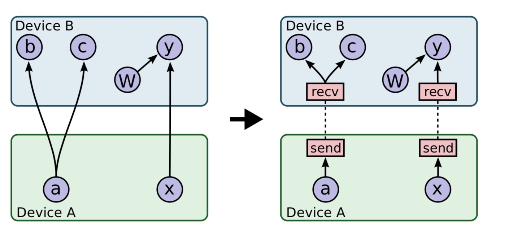
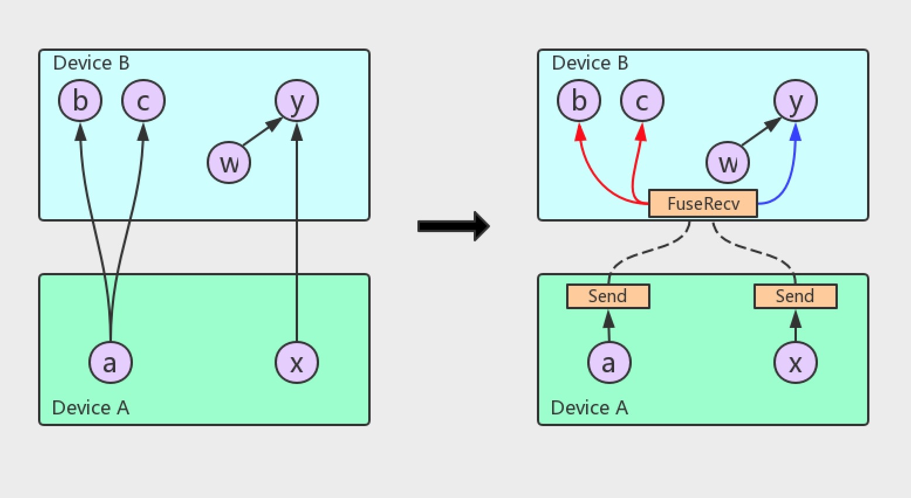
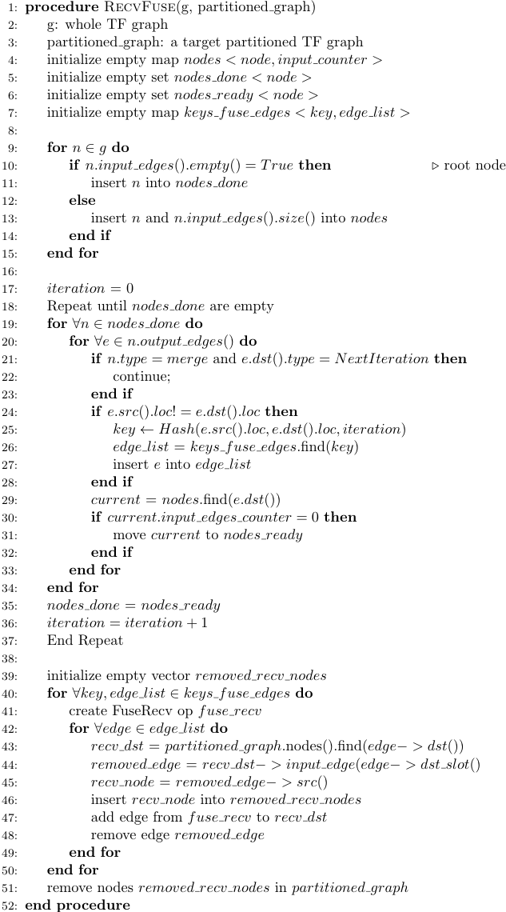

# FuseRecv

| Status        | (Proposed / Accepted / Implemented / Obsolete)       |
:-------------- |:---------------------------------------------------- |
| **Author(s)** | Tongxuan Liu(tongxuan.ltx@alibaba-inc.com) Peng Tao(jiankeng.pt@alibaba-inc.com) Langshi Chen (langshi.cls@alibaba-inc.com) |
| **Reviewers(s)** | Ayush Dubey(ayushd@google.com) Jeroen Bédorf(jeroen@minds.ai) Derek Murray(mrry@google.com) Bairen Yi(yibairen.byron@bytedance.com) Paul Tucker(paul.tucker@gmail.com) |
| **Sponsor**   |                                                      |
| **Updated**   | 2020-04-11                                           |

## Objective
This RFC proposes a new FuseRecv Op which would receive multiple tensors with
different types through one Remote Procedure Call (RPC). This feature could
significantly reduce the number of RPC calls in most rank or match models
such as Search, Recommend or Ad systems.

## Motivation
When very many small tensors are being transferred around the same time,
it's more efficient to transfer multiple tensors in a single RPC rather than
using a separate RPC for each of them. 

In the case the neural network graph is complicated, each iteration through
the graph may introduce tens or even hundreds of RPC operations between the running
nodes. In general, there are a large number of small tensors, such as multiple
feature columns that gather data from the same Parameter Server. These tensors
have no dependence on each other, and each feature column results in at least 
one RPC operation in the forward stage. In CTR (Click Through Rate) models or
models that are mostly sparse (such as Match or Rank models that are widely
used in Recommender and Ad systems), there would be hundreds of feature columns. 
In our scenario, each sample includes at least hundreds of features.
One training job normally uses thousands of workers and tens of parameter servers.
One worker generally has to get variables from all the parameter servers, and each
feature column, at least in the forward stage, receives at least one request from
the parameter server. There could be hundreds of RPC operations for these feature columns,
and even more for some of the big feature columns (such as ids). These would be partitioned
into dozens of RPCs per feature column. In summary there would be
at least hundreds of RPC per worker for these feature columns only, and
hundreds of thousands of RPCs per step, for each parameter server in the forward stage.
Most feature columns only gather very small tensors from the parameter
server, usually less than 100KB. Logically these small tensors could be
sent together (e.g. fused). Furthermore, tensors that belong to the same layer can also
be fused before transfer, which would significantly reduce the number of RPC operations.

As we know, each RPC operations introduces some satellite overhead besides the
actual tensor data transfer, which includes:
* Serialization/Deserialization which introduces additional overhead for each RPC operation.
* The execution engine overhead for executing a Recv node operation, and the corresponding thread pool
  action required to execute the RPC callback function.

## User Benefit

Performance improvement: From performance benchmarking of the feature during large
(end-user) training jobs (> 400 workers), we normally see that the training speed would
be 1.5-2x timer faster in the parameter-server/worker setup.

## Design Proposal




In the original Recv/Send design, each Recv node only receives one tensor
even if there are Recv Ops that output to the same destination Op. Moreover each
Recv node would trigger one RPC operation even if the received tensor is a scalar.

In the proposed design, we traverse (partitioned) graphs according to
its topology and iteratively replace Recv nodes with the new FuseRecv nodes.
Please refer to the details in Section [FuseRecv Optimizer in Grappler](#FuseRecv Optimizer in Grappler)

As shown in Figures 1 and 2, instead of adding a Recv node for each tensor
‘a’ and ‘x’, we use only one FuseRecv node to replace the two Recv nodes which
fetches two tensors together. The FuseRecv node will have two output
‘slots’ (‘ports’): slot 0 feeds input ‘b’ and ‘c’ and slot 1 feeds ‘y’.
Notice that, because the RPC operation is Recv driven, there is no need
to fuse the send node.

A new RPC method ‘FuseRecvTensorAsync’ and its Handler (FuseRecvTensorHandlerRaw)
is added into WorkInterface and WorkerService. FuseRecvTensor follows similar
optimization steps as RecvTensor to avoid copying the response buffer.

### Alternatives Considered
#### Fuse the tensors into a single Send/Recv Solution 1 (Derek Murray)
Pack the N tensors to be sent into a length-N DT_VARIANT vector.

Pros: Reuse currently RPC, avoid potential intricate changes in zero-copy
response buffer code.

Cons: Introduce memcopy overhead.

#### Fuse the tensors into a single Send/Recv Solution 2 (Derek Murray)
Pack the tensor contents into a single flattened buffer. This would be very
similar to the ScopedAllocator optimization that +ayushd@google.com and
+tucker@google.com implemented for collectives, and it might be possible
to reuse some of the graph analysis code

Pros: Reuse currently RPC, avoid potential intricate changes in zero-copy
response buffer code.

Cons: The fused tensors could be of different types and dynamic shapes,
which couldn't be handled by this solution.

#### Dynamic Fusion in runtime (Paul Tucker)
Instead of adding a new FuseRecvTensor method to the Worker interface,
we add a slightly different RecvSomeTensors method. The client sends a
list of keys for which it's ready to receive values to the server and the
server streams back one or more when it's ready. It's the responsibility of
the client to retry any key that was not included in the response.

To make this work well there needs to be some dynamic bundling on each side.
For example, on the client side a call to RecvTensor on the local Rendezvous
for a remote value does not necessarily result in an immediate RPC. It might
if the value is expected to be large, but it might also just add the key to
a ready set associated with the remote host. An RPC may not be sent until
the ready set reaches a certain size, or a minimum time has elapsed since the
last RPC against that host was started. When the response is received any
missing keys go back in the ready set.

On the server side there could be some logic to decide for a RecvSomeTensors
method whether to wait for more of the requested values to be ready or just
immediately send what's available now and let the client re-request anything
missing.

Pros: Dynamic fusion in runtime seems get better result, and also brings
ability to control priority of tensors (which Recv is more important).

Cons: Potential bottleneck of the solution is the time window of ready set.
For different models it would be much different, manually setting the value
would be hard. This solution is another good candidate of FuseRecv.

### Performance Implications
With a wide and deep model, the number of RPCs calls per step has been reduced
by 55%, and the overall training throughput has increased by 40%.  


### Dependencies
* None

### Engineering Impact
* Engineering impact: Once the feature is (manually) enabled (in ConfigProto.GraphOptions.do_fuse_recv), the test times would be longer because the FuseRecv post-partitioned optimizer would traverse and update the graph.
* Maintenance: Minimal maintenance overhead. The TensorFlow team and contributors will maintain the documentation and keep it up to date. Changes should be reviewed and approved by the TensorFlow team leads.

### Platforms and Environments
* Platforms: The feature is independent of platforms.
* Execution environments (Cloud services, accelerator hardware): The first stage would support CPU & GPU device. We consider supporting
additional devices as much as possible.

### Best Practices
* We strongly suggest to enable FuseRecv in rank or match models such as [W&DL](https://arxiv.org/abs/1606.07792), [Dien](https://arxiv.org/abs/1809.03672).

### Tutorials and Examples
Example of how to enable the FuseRecv feature:

```
  >>> config = tf.ConfigProto()
  >>> config.graph_options.optimizer_options.experimental.do_fuse_recv = True
```

### Compatibility
* This feature works with the ParameterServerStrategy.
* This feature considers tensors on difference devices such as CPU, GPU and TPU.
* Independent of SaveModel or checkpoint.

### User Impact
* None

## Detailed Design

### FuseRecv Op
We introduce the FuseRecv Op and an RPC operation named FuseRecvTensorAsync in
RemoteWorker and WorkerService. The FuseRecv Op definition is as follows:

```
  >>> REGISTER_OP("FuseRecv")  
  >>>   .Output("tensor: tensor_type")
  >>>   .Attr("tensor_type: list(type)")
  >>>   .Attr("tensor_name: list(string)")
  >>>   .Attr("send_device: list(string)")
  >>>   .Attr("send_device_incarnation: list(int)")
  >>>   .Attr("recv_device: list(string)")
  >>>   .Attr("client_terminated: bool = false")
  >>>   .SetIsStateful()
  >>>   .SetShapeFn(shape_inference::UnknownShape);
```

FuseRecv requests a list of tensors with different types from remote devices, generally
we only fuse the Recv ops in the same recv device and on the same send device.

### FuseRecv Optimizer in Grappler
During the post partition phase, we add a new pass to the post-partitioning optimizer
called “FuseRecv” to fuse Recv ops together. We traverse partitioned graphs &
the whole graph, replace Recv ops by FuseRecv ops in the partitioned graphs according
to its topology while iteratively searching and fusing potential Recv
operations. See Figure 4 for the formal algorithm definition.



The procedure RECVFUSE takes two input arguments:  1) the TF computation
graph g, 2) a Partitioned graph. It is worth noting that the iteration of
all nodes shall start from the `root` nodes, which do not have any
source edge (node). The process between line 17 and 37 would be iteratively
executed and output key-value pairs (value: a group of edges could be fused
into one FuseRecv node). Then based on the grouped edges, we find out Recv
nodes in partitioned graph which could be replace by FusedRecv nodes. Besides
RECVFUSE also makes sure that no deadlock exists after the change to the
original graph. Also, the RPC operation of FuseRecvTensor is able to overlap
the computation and communication by using the graph topology.

### FuseRecv RPC Method and Handler
A new RPC method ‘FuseRecvTensorAsync’ is added to the WorkerInterface.
We extend the ‘FuseRecvTensorAsync’ method with the ability to handle
multi rendezvous keys and fetch multi key tensors.

At the server side, we add a ‘FuseRecvTensorHandlerRaw’, which handles
the multi rendezvous key for the ‘local recv’ instantiated by the local
tensor operations. As mentioned before, the sending nodes are not fused
and we therefore must do multiple local recvs corresponding to the
multi send nodes.

Because the ‘FuseRecvTensorAsync’ handler might be executed before
the send operations happen, a call back wrapper is required. We use
a counter, initialized with the fuse count, and each send action triggers
the call back wrapper and performs an atomic decrease of the counter,
when the counter reaches 0, the real callback is executed and the tensors
are sent to the Recv node.

### Dead Tensor Handling
We treat the output of the FuseRecv node as dead if and only if all the
fused tensors are dead. 

### FuseRecv Error Handling
The status of the FuseRecv node would be similar as the Recv node, which 
include additional information for every Recv tensor.

## Questions and Discussion Topics

