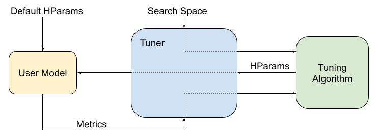

# TFX Tuner Component

| Status        | Approved                                                  |
| :------------ | :-------------------------------------------------------- |
| **Author(s)** | Jiayi Zhao (jyzhao@google.com), Amy Wu (wuamy@google.com) |
| **Sponsor**   | Zhitao Li (zhitaoli@google.com), Tom O'Malley (omalleyt@google.com), Matthieu Monsch (mtth@google.com), Makoto Uchida (muchida@google.com), Goutham Bhat (goutham@google.com) |
| **Updated**   | 2020-04-20                                                |

## Objective

### Goal

*   A new Tuner component in TFX for automated hyper-parameter tuning, which is
    based on abstractions from
    [KerasTuner library](https://github.com/keras-team/keras-tuner), in order to
    reuse abstractions and algorithms from latter.

### Non Goal

*   Natively support multi-worker tuning by the system. As TFX doesn't have
    ability to manage multi-worker clusters, running multiple trials in parallel
    (parallel tuning) and running each trial in distributed env (distributed
    training) are not supported natively. Parallel tuning may instead be
    realized by a particular implementation of TFX Tuner (custom Executor),
    e.g., in Google Cloud environment.
*   Implementation of custom tuner for
    [KerasTuner library](https://github.com/keras-team/keras-tuner) is out of
    scope of this design discussion, e.g., a built-in EstimatorTuner support.
    However, user project can still implement a tuner that inherits from
    [`kerastuner.BaseTuner`](https://github.com/keras-team/keras-tuner/blob/1.0.0/kerastuner/engine/base_tuner.py)
    and provide it to the proposed TFX Tuner component.

## Background and Motivation

A hyperparameter is a parameter whose value is used to control the learning
process of a model or the model itself (e.g., layers and number of nodes). By
contrast, the values of other parameters (typically node weights) are learned.

Hyperparameter optimization is a critical part of many machine learning
pipelines. Thus we propose a new TFX component, with the given search space
which specifies the hyperparameter configuration (name, type, range etc.). TFX
will optimize the hyperparameters based on the tuning algorithm.

## User Benefit

This document proposes a built-in TFX Tuner component, which works seamlessly
with Trainer and other TFX components. As the Tuner component will utilize the
[KerasTuner library](https://github.com/keras-team/keras-tuner), all supported
tuning methods will be available to TFX, including custom implementation of
KerasTuner.

## Design Proposal

TFX Tuner component will be built with the
[KerasTuner library](https://github.com/keras-team/keras-tuner). In the
following sections, we will first briefly go over the KerasTuner library and
several concepts in hyperparameter optimization. Then we will focus on our Tuner
component interface and how we utilize the KerasTuner library. After that, we
will discuss parallel tuning and our plan on Google Cloud integration.

### KerasTuner Library

The following graph shows a typical workflow of hyperparameter tuning under the
KerasTuner framework:

<div style="text-align:center"></div>

Given the user provided model which accepts a hyperparameter container, tuner
can search optimization through trials created by the tuning algortihm. For each
trial, values within search spaces will be assigned to hyperparameter
containers, and the user model will be trained with these hyperparameter values
and evaluated based on the objective provided to the tuner. The evaluation
results will be reported back to tuner and the tuning algorithm will decide the
hyperparameter values for the next trial. After reaching certain conditions,
e.g., max trials, the tuner will stop iteration and return the optimal
hyperparameters.

KerasTuner library provides above tuning functionality, here are some
abstractions in KerasTuner:

*   [`HyperParameters`](https://github.com/keras-team/keras-tuner/blob/1.0.0/kerastuner/engine/hyperparameters.py):
    Hyperparameter container for both search space, and current values.
*   [`Oracle`](https://github.com/keras-team/keras-tuner/blob/1.0.0/kerastuner/engine/oracle.py):
    Implementation of a hyperparameter tuning algorithm, e.g., random search,
    including state management of the algorithm’s progress.
*   [`Trial`](https://github.com/keras-team/keras-tuner/blob/1.0.0/kerastuner/engine/trial.py):
    Provided by the Oracle, contains information about Hyperparameter values for
    the current iteration.
*   [`BaseTuner`](https://github.com/keras-team/keras-tuner/blob/1.0.0/kerastuner/engine/base_tuner.py):
    a base tuner interface for above tuning workflow, responsible for the
    iteration of trial execution:
    *   Generates Trial using Oracle.
    *   Trains user model with the HyperParameters in the current Trial.
    *   Evaluates metrics and reports back to Oracle for next Trial.
*   [`Tuner`](https://github.com/keras-team/keras-tuner/blob/1.0.0/kerastuner/engine/tuner.py):
    An implementation of BaseTuner, for Keras model tuning.

Note: Other than the Tuner, abstractions defined by `HyperParameters`, `Oracle`,
`Trial` and `BaseTuner` are not restricted to Keras models, although the library
is called KerasTuner.

For more details and code examples, please refer to
[here](https://github.com/keras-team/keras-tuner).

### Component Interface

Tuner component takes raw or transformed examples as input, along with schema or
transform_graph for the feature specification, and outputs the hyperparameter
tuning results, below shows the specification of Tuner component:

```python
class TunerSpec(ComponentSpec):
  """ComponentSpec for TFX Tuner Component."""

  PARAMETERS = {
    # Specify a python module file which contains a UDF `tuner_fn`.
    'module_file': ExecutionParameter(type=(str, Text), optional=True),
    # Specify the steps for the training stage of each trial’s execution.
    'train_args': ExecutionParameter(type=trainer_pb2.TrainArgs),
    'eval_args': ExecutionParameter(type=trainer_pb2.EvalArgs),
  }

  INPUTS = {
    'examples': ChannelParameter(type=standard_artifacts.Examples),
    'schema': ChannelParameter(
            type=standard_artifacts.Schema, optional=True),
    'transform_graph':
        ChannelParameter(
            type=standard_artifacts.TransformGraph, optional=True),
  }

  OUTPUTS = {
    'best_hyperparameters':
        ChannelParameter(type=standard_artifacts.HyperParameters),
  }
```

Trainer has an optional hyperparameters input; tuning result can be fed into it
so that Trainer can utilize best hyperparameters to construct the model. Below
shows an example about how tuner and trainer are chained in the pipeline:

```python
# TrainerSpec:
  INPUTS = {
    ...
    'hyperparameters':
        ChannelParameter(
            type=standard_artifacts.HyperParameters, optional=True),
  }

# Pipeline DSL Example:
  tuner = Tuner(
      examples=example_gen.outputs['examples'],
      schema=schema_gen.outputs['schema'],
      module_file=module_file,
      train_args=trainer_pb2.TrainArgs(num_steps=1000),
      eval_args=trainer_pb2.EvalArgs(num_steps=500))

  trainer = Trainer(
      module_file=module_file,
      examples=example_gen.outputs['examples'],
      schema=schema_gen.outputs['schema'],
      hyperparameters=tuner.outputs['best_hyperparameters'],
      train_args=trainer_pb2.TrainArgs(num_steps=10000),
      eval_args=trainer_pb2.EvalArgs(num_steps=5000))
```

For Trainer, users need to define model code and training logic
([Generic Trainer](https://github.com/tensorflow/tfx/blob/r0.21.2/docs/guide/trainer.md#generic-trainer))
in the module_file. For Tuner, in addition to model code, users also need to
define hyperparameters, search space and a tuning algorithm in the module_file.
A `tuner_fn` with the following signature is required for Tuner:

```python
from kerastuner.engine import base_tuner
import tensorflow as tf
from tfx.components.trainer.executor import TrainerFnArgs

# Current TrainerFnArgs will be renamed to FnArgs as a util class.
FnArgs = TrainerFnArgs
TunerFnResult = NamedTuple('TunerFnResult',
                          [('tuner', base_tuner.BaseTuner),
                           ('fit_kwargs', Dict[Text, Any])])

def tuner_fn(fn_args: FnArgs) -> TunerFnResult:
  """Build the tuner using the KerasTuner API.

  Args:
    fn_args: Holds args as name/value pairs.
      working_dir: working dir for tuning. Automatically set by Executor.
      train_files: List of file paths containing training tf.Example data.
      eval_files: List of file paths containing eval tf.Example data.
      train_steps: number of train steps.
      eval_steps: number of eval steps.
      schema: optional schema file of the input data.
      transform_graph: optional transform graph produced by TFT.

  Returns:
    A namedtuple contains the following:
      - tuner: A BaseTuner that will be used for tuning.
      - fit_kwargs: Args to pass to tuner’s run_trial function for fitting the
                    model , e.g., the training and validation dataset. Required
                    args depend on the above tuner’s implementation.
  """
```

The TunerFnResult returned by the above tuner_fn contains an instance that
implements the
[`BaseTuner`](https://github.com/keras-team/keras-tuner/blob/1.0.0/kerastuner/engine/base_tuner.py)
interface, that’s the contract required by Tuner for tuning. The model code,
hyperparameters, search space and tuning algorithm are hidden under the
BaseTuner abstraction so the Tuner itself is generic and agnostic to the model
framework and tuning logic. Below shows an example module file with Keras model:

```python
import kerastuner
import tensorflow as tf
...

def _input_fn(file_pattern: Text, ...) -> tf.data.Dataset:
  ...

# Model code for Trainer and Tuner.
def _build_keras_model(hp: kerastuner.HyperParameters) -> tf.keras.Model:
  ...
  for _ in range(hp.get('num_layers')):
    ...
  ...
  model = tf.keras.Model(...)
  model.compile(
     optimizer=tf.keras.optimizers.Adam(hp.get('learning_rate')),
     loss='sparse_categorical_crossentropy',
     metrics=[tf.keras.metrics.Accuracy()])
  return model

# This will be called by TFX Tuner.
def tuner_fn(fn_args: FnArgs) -> TunerFnResult:
  hp = kerastuner.HyperParameters()
  # Defines search space.
  hp.Choice('learning_rate', [1e-1, 1e-3])
  hp.Int('num_layers', 1, 5)

  # RandomSearch is a subclass of Keras model Tuner.
  tuner = kerastuner.RandomSearch(
      _build_keras_model,
      max_trials=5,
      hyperparameters=hp,
      allow_new_entries=False,
      objective='val_accuracy',
      directory=fn_args.working_dir,
      project_name='test')

  train_dataset=_input_fn(fn_args.train_files, ...)
  eval_dataset=_input_fn(fn_args.eval_files, ...)

  return TunerFnResult(
      tuner=tuner,
      fit_kwargs={'x': train_dataset,
                  'validation_data': eval_dataset,
                  'steps_per_epoch': fn_args.train_steps,
                  'validation_steps': fn_args.eval_steps})

# This will be called by TFX Generic Trainer.
def run_fn(fn_args: FnArgs) -> None:
  hp = kerastuner.HyperParameters.from_config(fn_args.hyperparameters)
  model = _build_keras_model(hp)
  model.fit(...)
  model.save(...)
```

In Tuner’s executor, `tuner_fn` will be called with information resolved from
component inputs, then we call the `search` function of the returned tuner with
`fit_kwargs` to launch trials for tuning, and finally emit the best trial’s
hyperparameters:

```python
# Executor of Tuner Component:
class Executor(base_executor.BaseExecutor):

 def Do(self,
        input_dict: Dict[Text, List[types.Artifact]],
        output_dict: Dict[Text, List[types.Artifact]],
        exec_properties: Dict[Text, Any]) -> None:
  ...
  tuner_spec = tuner_fn(self._create_fn_args(input_dict, exec_properties))
  tuner_spec.tuner.search(**tuner_spec.fit_kwargs)
  # Output file contains json format string of hyperparameters.get_config().
  self._emit_best_hyperparameters(
    output_dict, tuner_spec.tuner.get_best_hyperparameters()[0])
```

### Parallel Tuning

In parallel tuning, multiple trials are executed in parallel. In this section,
we will discuss how distribution works for KerasTuner library and the status of
TFX.

In the `search` function of tuner, trials will be run in sequence instead of in
parallel. To support parallel tuning, we need to launch multiple tuners (the
tuner here refers to the one in KerasTuner library, not TFX Tuner component),
and have an optimization service for managing the state of the tuning algorithm,
with which oracle of each tuner communicates, and retrieves the trials for each
tuner.

<div style="text-align:center"></div>

The above graph shows a parallel tuning of three tuners. Each tuner runs as a
different worker, and it retrieves trials from its own oracle, which talks to
optimization service. Trials of different tuners can run in parallel but trials
within the same tuner will still execute in sequence. When launching tuners, the
same identifier will be assigned to each oracle, thus the optimization service
knows they are in the same tuning job group and will assign hyperparameter
values for their trials based on the algorithm.

The number of parallel tuners can be passed to component by the `TuneArgs` as
shown below:

```python
# Args specific to tuning.
message TuneArgs {
  # Number of trials to run in parallel.
  # Each trial will be trained and evaluated by separate worker jobs.
  int32 num_parallel_trials = 1;
}

class TunerSpec(ComponentSpec):

  PARAMETERS = {
    ...
    'tune_args': ExecutionParameter(type=tuner_pb2.TuneArgs),
  }
```

The KerasTuner library allows users to configure
[`tf.distribute.Strategy`](https://www.tensorflow.org/tutorials/distribute/kerass)
if they are using
[`kerastuner.Tuner`](https://github.com/keras-team/keras-tuner/blob/1.0.0/kerastuner/engine/tuner.py)
class (or subclasses of it). In above parallel tuning, each trial (each model
training) is executed in a single worker, as such only single machine strategy
is allowed. To support multi-worker distributed training, we need to be able to
execute the trial (training) on different workers.

At the time of writing, the KerasTuner library can be used for parallel
execution of trail with a single machine `tf.distribute.Strategy`, e.g.,
[`MirroredStrategy`](https://www.tensorflow.org/api_docs/python/tf/distribute/MirroredStrategy),
multi-worker strategy (distributed training for trial) support is on the
[roadmap of KerasTuner](https://keras-team.github.io/keras-tuner/tutorials/distributed-tuning/#data-parallelism-with-tfdistribute).
Note that cluster management of multiple worker machines is not part of the
KerasTuner library.

At the time of writing, TFX does not have the ability to manage the multi-worker
cluster and the centralized optimization service. As a result parallel tuning or
distributed training is not supported natively in TFX (local or on-prem). In
the next section, we will discuss the integration for Google Cloud. Similar
parallel tuning support can be built for other execution environments.

### Google Cloud Integration

In this section, we discuss the Tuner component with
[Google Cloud AI Platform](https://cloud.google.com/ai-platform) (CAIP),
specifically, an implementation of KerasTuner Oracle that talks to the
[AI Platform Optimizer](https://cloud.google.com/ai-platform/optimizer/docs/overview)
as the centralized optimization service, and a custom Tuner executor
implementation that makes use of the Cloud Optimizer-based Oracle (symbol names
are subject to change).

As mentioned above in the parallel tuning section, KerasTuner uses a centralized
optimization service that manages states of a tuning study and trials. In
addition to that, we will create a `CloudOracle` as a client to the AI Platform
Optimizer service, and a `CloudTuner` which inherits from Keras
[Tuner](https://github.com/keras-team/keras-tuner/blob/1.0.0/kerastuner/engine/tuner.py).
In the module file, users create the `tuner_fn` with `CloudTuner`, and then
users configure the TFX Tuner component to use the a custom Tuner executor
(`CloudExecutor`), which launches multiple `CloudTuner`s on a Google Cloud AI
Platform Training job with possibly multiple worker machines running various
trials concurrently. Below shows the workflow for in process tuning and Cloud
tuning.

<div style="text-align:center"></div>

## Future work

*   Native support for multi-worker parallel tuning.
*   Custom Tuner (inherits from BaseTuner) examples, e.g., for Estimator support
    or Keras custom training loop support.
