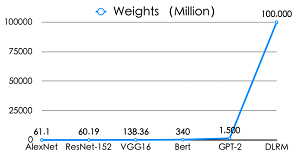
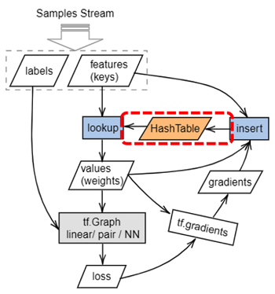
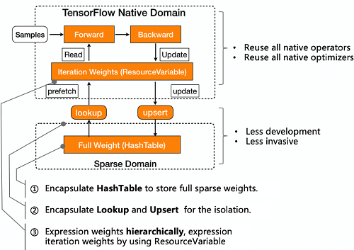
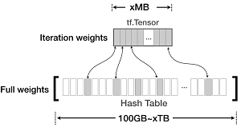
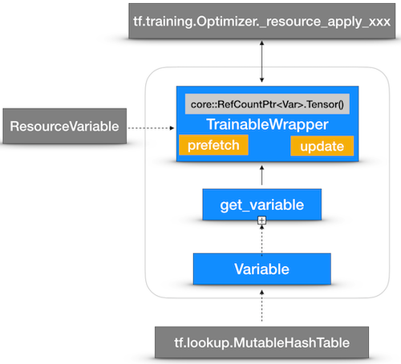

# Sparse Domain Isolation for Supporting Large-scale Recommender Systems.

| Status        | Draft                                             |
:-------------- |:---------------------------------------------------- |
| **Author(s)** | Haidong Rong (hudsonrong@tencent.com) Yafei Zhang(kimmyzhang@tencent.com) Jiandong Wang(adnywang@tencent.com) Chuan Cheng(chuancheng@tencent.com) |
| **Reviewers(s)** | Alexandre Passos(alexandre.tp@gmail.com) Bairen Yi(yibairen.byron@bytedance.com) |
| **Sponsor**   | Yuefeng Zhou (yuefengz@google.com) Zhenyu Tan (tanzheny@google.com)                   |
| **Updated**   | 2020-09-16                                           |

## Background

In recent years, many deep learning components (such as FC, RNN, etc.) and online-learning policy were introduced to the recommender systems that result in the special framework for recommender system (such as DiFacto, etc.) gradually unable to meet the demand. More and more algorithm engineers turn to use open-source general frameworks(such as Tensorflow, etc.)  to improve production efficiency.
In the industrial recommendation scenarios, the parameters are high-dimensional sparse with the following characteristics:
1. The theoretical total number of dynamic features is 2^64, the size of sparse weights is more than 100GB or even several TB which make reserving memory at the beginning too expensive.
2. The online-learning tracks user interests in real time and requires eliminating and adding weights on running-time without frequently restart training.



## Objective

Make TensorFlow support large-scale dynamic sparse weights training.

## Problem & Motivation

TensorFlow is well designed, but not support creating and training the large-scale dynamic sparse weights. The main obstacles are:
1. The `tf.Variable` is fixed size on running time and saved in continuous memory and unable to add or remove weights dynamically.
2. The typical training mode of full updating in TF is very inefficient when training xTB models.
3. Usually, the sparse weights are saved in hash table form (K-V pairs for sparse feature ID and sparse weights) but the optimizers of TF cann't train directly sparse weights and accumulators(slots) saved in hash tables.

For the above reasons, the official version of TensorFlow can only be used for offline model hyperparameter tuning with fixed size features, and the model can not exceed 100GB generally. The application in the industrial scene is very limited. At present, We customized TensorFlow and successfully applied it to large-scale sparse features training of industrial recommendation scene. We hope to contribute this work of general components to the community.

## Design Proposal

### The ideal semantics:

```python
import tensorflow as tf
import tensorflow.dynamic_embedding as de

# sparse weights defination:
w = de.get_variable(name="dynamic_embeddings",
                    devices=["/job:ps/replica:0/task:0/CPU:0",],
                    initializer=tf.random_normal_initializer(0, 0.005),
                    dim=8)
z = de.embedding_lookup(params=w,
                        ids=x, # x is got from samples.
                        name="wide-sparse-weights")
                         # z should be a trainable and variable-size instance.
# forward graph

pred = tf.xxx(...)

# backward graph
loss = tf.xxx(pred, label, ...)
opt = tf.train.AdamOptimizer(learning_rate=0.1)
update_op = opt.minimize(loss)
```

## Sparse Domain Isolation

### Overview of Design

1. Introduce a hashtable-based data structures to manage sparse weights.
2. Make the hashtable trainable.
3. Keep compatible with native key features, such as checkpoint, initializers, optimizers, distributed strategy and so on.



### Design Considerations


*   Minimize changing on Tensorflow core and try to use native components.


*   The `tf.Tensor` is still suitable for holding iteration weights, because only a small part of weights will be updated in each iterations.

#### Hash Table

Refer to `MutableHashTable` implemented in `tf.lookup`. The reason is as follows:

*   The `MutableHashTable` meets the basic requirements of sparse weights.
*   The `tf.lookup` is well designed and easy to maintain.
*   The save/restore from/to checkpoint is already supported.
*   Compatible with all kind of **distributed strategy**(including parameters server).


### Detailed Design and Implementation

The trainable warp class `resource_variable_ops.TrainableWrapper` inherted from `ResourceVariable` will be introduced, and help us reuse all optimizers.



### Patch to Core 

https://github.com/tensorflow/tensorflow/pull/41371

### APIs Overview

* Name Space(**To Be Discussed**)
    *  User API: `tf.dynamic_embedding`
    *  In TensorFlow Core: `from tensorflow.xx.xx import dynamic_embedding_ops`  
    
* Creating Weights
    * `tf.dynamic_embedding.Variable`
    * `tf.dynamic_embedding.get_variable`
    * `tf.resource_variable_ops.TrainableWrap`

* `tf.nn.embedding_lookup` likely APIs
    * `tf.dynamic_embedding.embedding_lookup`
    * `tf.dynamic_embedding.embedding_lookup_sparse`
    * `tf.dynamic_embedding.safe_embedding_lookup_sparse`

#### Name Space

All of the APIs are implemented in `tf.dynamic_embedding` package(the `tf.nn` or `tf.keras` maybe be better).

```python
import tensorflow as tf # core version
import tensorflow_recsys as tfrs # SIG version

weights = tf.dynamic_embedding.get_variable(*args, **kwargs)
```

#### Creating Sparse Weights

We design the `dynamic_embedding.Variable` based on the `tf.lookup.MutableHashTable` and make it support distributed scenario, there is no need to develop any new operators for the hash table. 
The `dynamic_embedding.Variable` backed up by a group of hashtables is responsible for actually holding the memory resource of sparse weights.

* `tf.dynamic_embedding.Variable`
    * `upsert` (update if exist else insert) 
    * `lookup`
    * `remove`
    * `export`
    * `size`
    
* `tf.dynamic_embedding.get_variable`

```python
@tf_export("dynamic_embedding.Variable")
class Variable(trackable.TrackableResource):
  """
  A Distributed version of HashTable(reference from lookup_ops.MutableHashTable)
  It is designed to dynamically store the Sparse Weights(Parameters) of DLRMs.
  """
  def __init__(self,
               key_dtype=dtypes.int64,
               value_dtype=dtypes.float32,
               dim=1,
               devices=None,
               partitioner=default_partition_fn,
               shared_name=None,
               name="DynamicEmbedding_Variable",
               initializer=None,
               trainable=True,
               checkpoint=True):
    """Creates an empty `Variable` object.

    Creates a group of tables placed on devices,
    the type of its keys and values are specified by key_dtype
    and value_dtype, respectively.

    Args:
      key_dtype: the type of the key tensors.
      value_dtype: the type of the value tensors.
      dim: the length of the value array for each key.
      devices: the list of devices holding the tables.
        One table will be created on each device.
      partitioner: partition function of keys,
        return the partition index for each key.

      Example partition func:
      ```python
      def default_partition_fn(keys, shard_num):
        return tf.cast(keys % shard_num, dtype=tf.int32)
      ```
      shared_name: No used.
      name: A name for the operation (optional).
      initializer: The value to use if a key is missing in the hash table.
        which can be a python number, numpy array or `tf.initializer` instances.
        If initializer is `None` (the default), `0` will be taken.
      trainable: True, will be treated as a trainable Variable, and add to
        to the list of variables collected in the graph under the key
        `GraphKeys.TRAINABLE_VARIABLES`.
      checkpoint: if True, the contents of the SparseVariable are
        saved to and restored from checkpoints.
        If `shared_name` is empty for a checkpointed table,
        it is shared using the table node name.

    Returns:
      A `Variable` object.
    """
    pass

  def upsert(self, keys, values, name=None):
    """Insert or Update `keys` with `values`.

    If key exists already, value will be updated.

    Args:
      keys: Keys to insert. Can be a tensor of any shape. Must match the table's
        key type.
      values: Values to be associated with keys. Must be a tensor of the same
        shape as `keys` and match the table's value type.
      name: A name for the operation (optional).

    Returns:
      The created Operation.

    Raises:
      TypeError: when `keys` or `values` doesn't match the table data
        types.
    """
    pass

  def remove(self, keys, name=None):
    """Removes `keys` and its associated values from the variable.

    If a key is not present in the table, it is silently ignored.

    Args:
      keys: Keys to remove. Can be a tensor of any shape. Must match the table's
        key type.
      name: A name for the operation (optional).

    Returns:
      The created Operation.

    Raises:
      TypeError: when `keys` do not match the table data types.
    """
    pass

  def lookup(self, keys, name=None):
    """Looks up `keys` in a Variable, outputs the corresponding values.

    The `default_value` is used for keys not present in the table.

    Args:
      keys: Keys to look up. Can be a tensor of any shape. Must match the
        table's key_dtype.
      name: A name for the operation (optional).

    Returns:
      A tensor containing the values in the same shape as `keys` using the
        table's value type.
    """
    pass

  def export(self, name=None):
    """Returns tensors of all keys and values in the table.

    Args:
      name: A name for the operation (optional).

    Returns:
      A pair of tensors with the first tensor containing all keys and the
        second tensors containing all values in the table.
    """
    pass

  def size(self, index=None, name=None):
    """Compute the number of elements in the index-th table of this Variable.

    If index is none, the total size of the Variable wil be return.

    Args:
      index：The index of table (optional)
      name: A name for the operation (optional).

    Returns:
      A scalar tensor containing the number of elements in this Variable.
    """
    pass
```

#### Embedding Lookup

We design three user APIs `embedding_lookup`, `embedding_lookup_sparse` and  `safe_embedding_lookup_sparse` .

* `tf.dynamic_embedding.embedding_lookup`
* `tf.dynamic_embedding.embedding_lookup_sparse`
* `tf.dynamic_embedding.safe_embedding_lookup_sparse`

The behaviors of the APIs are similar to APIs of the same name in package `tf.nn`.

```python
@tf_export("dynamic_embedding.embedding_lookup")
def embedding_lookup(
    params,
    ids,
    partition_strategy=None,  # pylint: disable=unused-argument
    name=None,
    validate_indices=None,  # pylint: disable=unused-argument
    max_norm=None):
  """Provides a dynamic version of embedding_lookup
    similar with tf.nn.embedding_lookup.

  Ids are flattened to a 1d tensor before being passed to embedding_lookup
  then, they are unflattend to match the original ids shape plus an extra
  leading dimension of the size of the embeddings.

  Args:
    params: A dynamic_embedding.Variable instance.
    ids: a tensor with any shape as same dtype of params.key_dtype.
    partition_strategy: No used, for API compatiblity with `nn.emedding_lookup`.
    name: A name for the operation (optional).
    validate_indices: No used, just for compatible with nn.embedding_lookup .
    max_norm: If not `None`, each embedding is clipped if its l2-norm is larger
      than this value.
  Returns:
    A tensor with shape [shape of ids] + [dim],
      dim is equal to the value dim of params.
    containing the values from the params tensor(s) for keys in ids.
  """
  pass

@tf_export("dynamic_embedding.embedding_lookup_sparse")
def embedding_lookup_sparse(
    params,
    sp_ids,
    sp_weights,
    partition_strategy=None,  # no used
    name="embedding_lookup_sparse",
    combiner="mean",
    max_norm=None,
    return_trainable=False):
  """Provides a dynamic version of embedding_lookup_sparse
    similar with tf.nn.embedding_lookup_sparse.

  This op assumes that there is at least one id for each row in the dense tensor
  represented by sp_ids (i.e. there are no rows with empty features), and that
  all the indices of sp_ids are in canonical row-major order.

  It also assumes that all id values lie in the range [0, p0), where p0
  is the sum of the size of params along dimension 0.

  Args:
    params: A single `dynamic_embedding.Variable` instance representing
      the complete embedding tensor.
    sp_ids: N x M `SparseTensor` of int64 ids where N is typically batch size
      and M is arbitrary.
    sp_weights: either a `SparseTensor` of float / double weights, or `None` to
      indicate all weights should be taken to be 1. If specified, `sp_weights`
      must have exactly the same shape and indices as `sp_ids`.
    partition_strategy: No used.
    name: Optional name for the op.
    combiner: A string specifying the reduction op. Currently "mean", "sqrtn"
      and "sum" are supported. "sum" computes the weighted sum of the embedding
      results for each row. "mean" is the weighted sum divided by the total
      weight. "sqrtn" is the weighted sum divided by the square root of the sum
      of the squares of the weights.
    max_norm: If not `None`, each embedding is clipped if its l2-norm is larger
      than this value, before combining.
    return_trainable: optional, If True, also return TrainableWrapper create by
      `dynamic_embedding.embedding_lookup`

  Returns:
    combined_embeddings: A dense tensor representing the combined embeddings
      for the sparse ids. For each row in the dense tensor represented by
      `sp_ids`, the op looks up the embeddings for all ids in that row,
      multiplies them by the corresponding weight, and combines these embeddings
      as specified.

      In other words, if

        `shape(combined params) = [+infinity, dim]`

      and

        `shape(sp_ids) = shape(sp_weights) = [d0, d1, ..., dn]`

      then

        `shape(output) = [d0, dim]`.

      For instance, if params dim=20, and sp_ids / sp_weights are

        ```python
        [0, 0]: id 1, weight 2.0
        [0, 1]: id 3, weight 0.5
        [1, 0]: id 0, weight 1.0
        [2, 3]: id 1, weight 3.0
        ```

      with `combiner`="mean", then the output will be a 3x20 matrix where

        ```python
        output[0, :] = (params[1, :] * 2.0 + params[3, :] * 0.5) / (2.0 + 0.5)
        output[1, :] = (params[0, :] * 1.0) / 1.0
        output[2, :] = (params[1, :] * 3.0) / 3.0
        ```
    trainable_wrap(Optional):
      A TrainableWrapper object used to fill the Optimizers `var_list`
        Only provided if `return_trainable` is True.
  Raises:
    TypeError: If `sp_ids` is not a `SparseTensor`, or if `sp_weights` is
      neither `None` nor `SparseTensor`.
    ValueError: If `combiner` is not one of {"mean", "sqrtn", "sum"}.
  """
  pass

@tf_export("dynamic_embedding.safe_embedding_lookup_sparse")
def safe_embedding_lookup_sparse(
    embedding_weights,
    sparse_ids,
    sparse_weights=None,
    combiner="mean",
    default_id=None,
    name="safe_embedding_lookup_sparse",
    partition_strategy=None,  # no used
    max_norm=None,
    return_trainable=False):
  """ Provides a dynamic version of `tf.nn.safe_embedding_lookup_sparse`.

  Lookup embedding results, accounting for empty features and invalid weights.

  Any IDs will be treated as valid include non-positive IDs.
  Invalid weights (<= 0) are pruned from input weights, as well as any IDs
  with non-positive weight. For an entry with no features, the embedding vector
  for `default_id` is returned, or the 0-vector if `default_id` is not supplied.

  The ids and weights may be multi-dimensional. Embeddings are always aggregated
  along the last dimension.

  Args:
    embedding_weights: A single `dynamic_embedding.Variable` instance
      representing the complete embedding tensor.
    sparse_ids: `SparseTensor` of shape `[d_0, d_1, ..., d_n]` containing the
      ids. `d_0` is typically batch size.
    sparse_weights: `SparseTensor` of same shape as `sparse_ids`, containing
      float weights corresponding to `sparse_ids`, or `None` if all weights are
      be assumed to be 1.0.
    combiner: A string specifying how to combine embedding results for each
      entry. Currently "mean", "sqrtn" and "sum" are supported, with "mean" the
      default.
    default_id: The id to use for an entry with no features.
    name: A name for this operation (optional).
    partition_strategy: A string specifying the partitioning strategy. Currently
      `"div"` and `"mod"` are supported. Default is `"div"`.
    max_norm: If not `None`, all embeddings are l2-normalized to max_norm before
      combining.

  Returns:
    combined_embeddings:
      A dense `Tensor` of shape `[d_0, d_1, ..., d_{n-1}, e_1, ..., e_m]`.
    trainable_wrap:
      A TrainableWrapper object used to fill the Optimizers `var_list`
        Only provided if `return_trainable` is True.

  Raises:
    ValueError: if `embedding_weights` is empty.
  """
  pass
```

### Trainable Wrapper

In the early scheme, the `dynamic_embedding.Variable` will directly be trained by optimizers and **we had to extand all optimizers one-by-one**.

Now we propose a new scheme which no longer require to extand all optimizers one by one: 
We design a warp class `resource_variable_ops.TrainableWrapper` which inherts from `resource_variable_ops.ResourceVariable`, and responsible for:

- Maintain the relationship between `params` and `ids` created by `embedding_lookup{, _sparse}` and `safe_embedding_lookup_sparse`.
- Look up the newest values from `dynamic_embedding.Variable` and update them to memory held by `TrainableWrapper->tensor()` before each iteration start.

So the `resource_variable_ops.TrainableWrapper` **plays a key role in making the hashtable trainable in TensorFlow**.

#### python/ops/resource_variable_ops.py:

```python

class TrainableWrapper(ResourceVariable):
  """
  This class is a trainable warp of dynamic embedding,
  and the key role is recording the map relationship of params and ids.
  inheriting from the ResourceVariable make it trainable.
  """
  def __init__(self, params, ids, max_norm, *args, **kwargs):
    """Creates an empty `TrainableWrapper` object.

    Creates a group of tables placed on devices,
    the type of its keys and values are specified by key_dtype
    and value_dtype, respectively.

    Args:
      params: A dynamic_embedding.Variable instance.
      ids: a tensor with any shape as same dtype of params.key_dtype.
      max_norm: If not `None`, each values is clipped if its l2-norm is larger
        than this value.
      other parameters is same with ResourceVariable.
    Returns:
      A `TrainableWrapper` object which is a subclass of ResourceVariable.
    """
    self.params = params
    self.ids = ids
    self.max_norm = max_norm
    self.prefetch_values = self.transform(self.params.lookup(self.ids))
    # ...

    super(TrainableWrapper, self).__init__(*args, **kwargs)
    
  ####

  """A python variable from an existing handle."""
  def _read_variable_op(self):

    # The `assign_variable_op` will be called to get before read opertion.
    # `prefetch_values` is a lookup-like operation of `TrainableWrapper`.

    if hasattr(self, "prefetch_values"):
      with ops.control_dependencies([
          gen_resource_variable_ops.assign_variable_op(
            self._handle, self.prefetch_values,  
          name="AssignBeforeReadVariable")]):
        result = gen_resource_variable_ops.read_variable_op(self._handle,
                                                            self._dtype)
    else:
      result = gen_resource_variable_ops.read_variable_op(self._handle,
                                                          self._dtype)
    _maybe_set_handle_data(self._dtype, self._handle, result)


  def update_op(self):
    return self.params.upsert(self.ids, self._read_variable_op())
```

The scheme will **reuse** the `Optimizer._resource_apply_{dense,sparse_duplicate_indices}}` API to train `resource_variable_ops.TrainableWrapper` naturally after changing a little common code in `training/optimizer.py`:

- Create the slots of `TrainableWrapper` when primary `Variable` is an instance of `TrainableWrapper`.
- Write back the trained values of primary and slots to hash tables(`dynamic_embedding.Variable`) when `Optimizer._resource_apply_{dense,sparse_duplicate_indices}` finished.

#### The pseudo-code is below: 

```python
def create_slots(primary, init, slot_name, op_name):
  """Helper function for creating a slot variable for stateful optimizers."""
  params_var_, params_ids_ = primary.params, primary.ids

  scope = variable_scope.get_variable_scope()
  scope_store = variable_scope._get_default_variable_store()
  full_name = params_var_.name + "/" + op_name + "/" + slot_name
  if full_name not in scope_store._vars:
    slot_variable_ = Variable(name=full_name,
                              key_dtype=params_var_.key_dtype,
                              value_dtype=params_var_.value_dtype,
                              dim=params_var_.dim,
                              devices=params_var_.devices,
                              partitioner=params_var_.partition_fn,
                              initializer=init,
                              trainable=False,
                              checkpoint=params_var_.checkpoint)

    scope_store._vars[full_name] = slot_variable_

  slot = None
  slot = embedding_lookup(params=scope_store._vars[full_name],
                          ids=params_ids_,
                          name=slot_name)

  return slot

```

We define a special version of `Processor` for `TrainableWrapper`:

```python

class _DenseDynamicEmbeddingTrainableProcessor(_OptimizableVariable):
  """Processor for TrainableWrapper."""

  def update_op(self, optimizer, g):
   
    # The `update_op` is a insert-like operation of `Trainclass _DenseDynamicEmbeddingTrainableProcessor(_OptimizableVariable):
  """Processor for dense DynamiceEmbedding."""

  def __init__(self, v):
    self._v = v

  def target(self):
    return self._v

  def update_op(self, optimizer, g):
    # pylint: disable=protected-access
    # for better convergence:

    with ops.colocate_with(None,  ignore_existing=True):
      _slots = [
          optimizer.get_slot(self._v, _s) for _s in optimizer.get_slot_names()
      ]
      with ops.control_dependencies([g]):
        _before = [self._v.read_value()] + [_s.read_value() for _s in _slots]
      if isinstance(g, ops.IndexedSlices):
        if self._v.constraint is not None:
          raise RuntimeError(
              "Cannot use a constraint function on a sparse variable.")

        with ops.control_dependencies(_before):
          _apply_op = optimizer._resource_apply_sparse_duplicate_indices(
              g.values, self._v, g.indices)
        with ops.control_dependencies([_apply_op]):
          _after = control_flow_ops.group([self._v.update_op()] +
                                          [_s.update_op() for _s in _slots])
          return _after
      with ops.control_dependencies(_before):
        _apply_op = optimizer._resource_apply_dense(g, self._v)
      if self._v.constraint is not None:
        with ops.control_dependencies([_apply_op]):
          return self._v.assign(self._v.constraint(self._v))
      else:
        with ops.control_dependencies([_apply_op]):
          _after = control_flow_ops.group([self._v.update_op()] +
                                          [_s.update_op() for _s in _slots])
        return _afterableWrapper`
    # which write back the trained values hold Temporarily in primary and slots `TrainableWrapper`.
    _apply_op = optimizer._resource_apply_dense(g, self._v)
    with ops.control_dependencies([_apply_op]):
      _update = control_flow_ops.group([self._v.update_op()] + \
                                       [_s.update_op()
                                        for _s in dynamic_embedding_ops.get_slots(self._v)])
    return _update
#  ...

def _get_processor(v):
  """The processor of v."""
  # ...
  if isinstance(v, resource_variable_ops.TrainableWrapper):
    return _DenseDynamicEmbeddingTrainableProcessor(v)  # get processor for `TrainableWrapper`
  # ...
```

### Compatibility

####  Compatible with all `tf.initializer`

Since the hashtable-based `dynamic_embedding.Variable` does not allocate memory on train-loop start, sparse weights cannot be initialized statically like we do on `tf.Variable`.

The logic of run-time initialization is needed. The random values will be created when some key are not found by `tf.lookup.MutableHashTable::Find`. 
In the early scheme, we call `std::normal_distribution` in `MutableHashTableOfTensors::Find` which only supports one initialization method.
Now we propose a new scheme which no longer require to hack too much on `MutableHashTableOfTensors::Find`, and we just redefine `MutableHashTable.lookup` for supporting the **dynamice full size initial values**.

The pseudo-code is as follows:

- The `dynamic_embedding.Variable` has a `initializer` as a input parameter.
- `Variable.lookup` will provide dynamic full size initial values according to the `initializer`.

```python
@tf_export("dynamic_embedding.Variable")
class Variable(trackable.TrackableResource):

  def __init__(self, 
               # ..
               initializer=None,
               # ..
               ):
    """Creates an empty `Variable` object.
      ...
    Args:
      ...
      initializer: The value to use if a key is missing in the hash table.
        which can be a python number, numpy array or `tf.initializer` instances.
        If initializer is `None` (the default), `0` will be taken.
      ...
    """
    pass

  def lookup(self, keys, name=None):
    partition_index = self.partition_fn(keys, self.shard_num)
    keys_partitions, keys_indices = _partition(keys, partition_index,
                                               self.shard_num)

    ops_ = []
    for idx in range(len(self.devices)):
      with ops.device(self.devices[idx]):
        dynamic_default_values = self._create_default_values_by_initializer(
            keys_partitions[idx])
        ops_.append(self._tables[idx].lookup(
            keys_partitions[idx],
            # `dynamic_default_values` is a sub-graph providing special initial values when missing any keys. 
            dynamic_default_values=dynamic_default_values,
            name=name))
    result = _stitch(ops_, keys_indices)

    return result
```


When `Variable.initializer` is a random `tf.initializer`, the `MutableHashTable.lookup` will **extand** the original static item-size `default_value` to full size dynamic random initial values.
```python
class MutableHashTable(LookupInterface):
  def lookup(self, keys, dynamic_default_values=None, name=None):
    """Looks up `keys` in a table, outputs the corresponding values.

    The `default_value` is used for keys not present in the table.

    Args:
      keys: Keys to look up. Can be a tensor of any shape. Must match the
        table's key_dtype.
      dynamic_default_values: The values to use if a key is missing in the
        table. If None (by default), the static default_value
        `self._default_value` will be used.
      name: A name for the operation (optional).

    Returns:
      A tensor containing the values in the same shape as `keys` using the
        table's value type.

    Raises:
      TypeError: when `keys` do not match the table data types.
    """
    with ops.name_scope(name, "%s_lookup_table_find" % self.name,
                        (self.resource_handle, keys, self._default_value)):
      keys = ops.convert_to_tensor(keys, dtype=self._key_dtype, name="keys")
      with ops.colocate_with(self.resource_handle):
        values = gen_lookup_ops.lookup_table_find_v2(
            self.resource_handle, keys, dynamic_default_values
            if dynamic_default_values is not None else self._default_value)
    return values
```

#### Compatible with distributed training

The `data_flow_ops.dynamic_partition` and `data_flow_ops.dynamic_stitch` will be used to split the `keys` to different hashtables of `dynamic_embedding.Variable`.

```python
@tf_export("dynamic_embedding.Variable")
class Variable(trackable.TrackableResource):
  """
  A Distributed version of HashTable(reference from lookup_ops.MutableHashTable).
  It is designed to dynamically store the Sparse Weights(Parameters) of DLRMs.
  """

  def __init__(self,
               #..
               partitioner=default_partition_fn,
              ):
    pass


def _partition(data, partition_index, shard_num):
  """
  Shard keys to shard_num partitions

  Args:
    data: keys or values, usually the IDs of dynamic features.
    partition_index: partitions index.
    shard_num: partition number
  Returns:
    a pair of tensor: (partition result, partition indices)
  """
  if shard_num <= 1:
    return [
        data,
    ], None
  with ops.colocate_with(data):
    partitions = data_flow_ops.dynamic_partition(data, partition_index,
                                                 shard_num)
    indices = data_flow_ops.dynamic_partition(
        math_ops.range(array_ops.shape(data)[0]),
        math_ops.cast(partition_index, dtypes.int32), shard_num)
  return partitions, indices


def _stitch(values, indices):
  if len(values) == 1:
    return values[0]
  with ops.colocate_with(indices[0]):
    all_values = data_flow_ops.dynamic_stitch(indices, values)
  return all_values


def default_partition_fn(keys, shard_num):
  """The default partition function.
    partition keys by "mod" strategy.

    keys: a tensor presents the keys to be partitioned.
    shard_num: the num of partitions
  Returns:
    a tensor with same shape as keys with type of `tf.int32`,
      represents the corresponding partition-ids of keys.
  """
  with ops.colocate_with(keys):
    ids = math_ops.cast(math_ops.mod(keys, shard_num), dtype=dtypes.int32)
  return ids
```

#### Compatible with checkpoint mechanism

The `MutablehashTable` used by `dynamic_embedding` already supports checkpoint mechanism naturally, so no change is needed.


## Appendix
### GitHub Issue

1. [https://github.com/tensorflow/tensorflow/issues/19324](https://github.com/tensorflow/tensorflow/issues/19324)
2. [https://github.com/tensorflow/tensorflow/issues/24539](https://github.com/tensorflow/tensorflow/issues/24539)

### Reference

1. [https://arxiv.org/abs/1909.04823](https://arxiv.org/abs/1909.04823)
2. [https://arxiv.org/abs/1606.07792](https://arxiv.org/abs/1606.07792) 
3. [https://arxiv.org/abs/1703.04247](https://arxiv.org/abs/1703.04247)
4. [https://arxiv.org/abs/1804.07931](https://arxiv.org/abs/1804.07931) 
5. [https://www.usenix.org/system/files/conference/osdi16/osdi16-abadi.pdf](https://www.usenix.org/system/files/conference/osdi16/osdi16-abadi.pdf)
