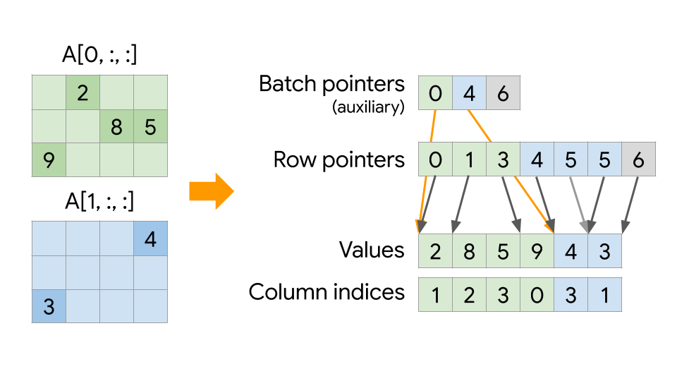
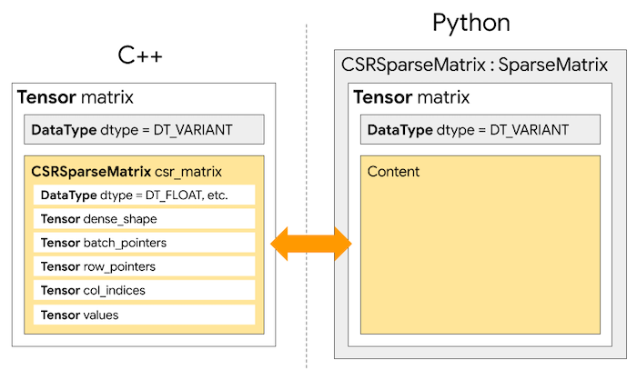

# CSR Sparse Matrix

| Status        | Proposed                                             |
:-------------- |:---------------------------------------------------- |
| **RFC #**     | [NNN](https://github.com/tensorflow/community/pull/NNN) (update when you have community PR #)|
| **Author(s)** | Penporn Koanantakool (penporn@google.com)            |
| **Sponsor**   | Rasmus Larsen (rmlarsen@google.com), Tatiana Shpeisman (shpeisman@google.com)|
| **Updated**   | 2019-05-19                                           |

## Objective

Support the [compressed sparse row (CSR)](https://en.wikipedia.org/wiki/Sparse_matrix#Compressed_sparse_row_(CSR,_CRS_or_Yale_format)) sparse matrix format in TensorFlow. Implement linear algebra and other common neural networks operations on both CPU and GPU devices for seamless user experience.

### Goals
* Enable storing batched sparse matrices in CSR format in TensorFlow.
* Provide efficient linear algebra and other common neural network kernels for the CSR format on both CPU and GPU.
* Provide clean and easy to use Python APIs.
* Support backpropagation.

### Non-goals
* Support for other sparse formats such as Block CSR, CSC, etc. Block CSR is a future work.
* Implement XLA / TPU kernels.


## Motivation

Sparse tensor representation has a significant impact on performance. Modern architectures are most suited for non-random, bulk memory accesses. Sparse formats that optimize for data locality and reuse can achieve large performance gains. TensorFlow currently stores sparse tensors in [coordinate (COO)](https://www.tensorflow.org/api_docs/python/tf/sparse/SparseTensor) format, which is inefficient for sparsities observed in most deep learning and sparse linear algebra applications. The compressed sparse row (CSR) format is one of the most commonly used formats. It generally requires less storage and is faster than COO, sometimes by up to orders of magnitudes.

We propose supporting the CSR format in TensorFlow to accelerate sparse linear algebra and applicable deep learning applications in TensorFlow. 


## User Benefits

* Fast sparse linear algebra routines such as matrix multiplications, tensor contractions (convolutions), Cholesky, LU, and QR factorizations on CPU and GPU.
* Users can add existing CSR kernels from other libraries and directly use it without format conversion.


## Design Proposal

A k-dimensional sparse tensor is stored as a batch of sparse CSR matrices. The k-2 outermost dimensions are batch dimensions, and the two innermost dimensions are matrix dimensions. All batches share the same values, column indices, and row pointers arrays. The figure below shows how `CSRSparseMatrix` stores a 2x3x4 sparse tensor A. `Values` stores all nonzero values in rowmajor order. `Column indices` stores the corresponding column indices of each nonzero in Values. `Row pointers` stores the position of the beginning of each matrix row in Values. `Batch pointers` stores the position of the beginning of each batch in `Values`.



All kernel implementations are in C++, with a Python wrapper for Python APIs. During the experimental phase, `CSRSparseMatrix` APIs will be in the `tf.linalg.experimental.sparse` package.


### Supported Operations
See APIs in the Detailed Design section.
* Sparse linear algebra ops: 
  * Sparse matrix-vector multiplication (SpMV)
  * Sparse-dense matrix multiplication (SpMM)
  * Sparse-sparse matrix multiplication (SpGEMM)
  * Sparse-sparse matrix addition (SpGEAM)
  * Sparse matrix transpose
  * Sparse Cholesky factorization
  * Sparse LU factorization
  * Sparse QR factorization
* Conversions ops: 
  * Convert to and from dense tensor
  * Convert to and from SparseTensor.

General ops, borrowing APIs from numpy and scipy ([sparse](https://docs.scipy.org/doc/scipy/reference/sparse.html), [sparse.csr_matrix](https://docs.scipy.org/doc/scipy/reference/generated/scipy.sparse.csr_matrix.html)) packages.
* Construction ops: [eye](https://docs.scipy.org/doc/scipy/reference/generated/scipy.sparse.eye.html) and [rand](https://docs.scipy.org/doc/scipy/reference/generated/scipy.sparse.rand.html)
* Unary ops that preserve sparsity structure:
  * [sin](https://docs.scipy.org/doc/numpy/reference/generated/numpy.sin.html), [cos](https://docs.scipy.org/doc/numpy/reference/generated/numpy.cos.html), [tan](https://docs.scipy.org/doc/numpy/reference/generated/numpy.tan.html), [sinh](https://docs.scipy.org/doc/numpy/reference/generated/numpy.sinh.html), [cosh](https://docs.scipy.org/doc/numpy/reference/generated/numpy.cosh.html), [tanh](https://docs.scipy.org/doc/numpy/reference/generated/numpy.tanh.html)
  * [arcsin](https://docs.scipy.org/doc/numpy/reference/generated/numpy.arcsin.html), [arcsinh](https://docs.scipy.org/doc/numpy/reference/generated/numpy.arcsinh.html), [arccos](https://docs.scipy.org/doc/numpy/reference/generated/numpy.arccos.html), [arccosh](https://docs.scipy.org/doc/numpy/reference/generated/numpy.arccosh.html), [arctan](https://docs.scipy.org/doc/numpy/reference/generated/numpy.arctan.html), [arctanh](https://docs.scipy.org/doc/numpy/reference/generated/numpy.arctanh.html)
  * [conj](https://docs.scipy.org/doc/numpy/reference/generated/numpy.conj.html), [sign](https://docs.scipy.org/doc/numpy/reference/generated/numpy.sign.html)
  * [ceil](https://docs.scipy.org/doc/numpy/reference/generated/numpy.ceil.html), [floor](https://docs.scipy.org/doc/numpy/reference/generated/numpy.floor.html), [trunc](https://docs.scipy.org/doc/numpy/reference/generated/numpy.trunc.html), [rint](https://docs.scipy.org/doc/numpy/reference/generated/numpy.rint.html)
  * [deg2rad](https://docs.scipy.org/doc/numpy/reference/generated/numpy.deg2rad.html), [rad2deg](https://docs.scipy.org/doc/numpy/reference/generated/numpy.rad2deg.html)
  * [expm1](https://docs.scipy.org/doc/numpy/reference/generated/numpy.expm1.html), [log1p](https://docs.scipy.org/doc/numpy/reference/generated/numpy.log1p.html), [power](https://docs.scipy.org/doc/numpy/reference/generated/numpy.power.html), [sqrt](https://docs.scipy.org/doc/numpy/reference/generated/numpy.sqrt.html)
  * [astype](https://docs.scipy.org/doc/scipy/reference/generated/scipy.sparse.csr_matrix.astype.html)
* Unary ops that change sparsity structure:
  * [softmax](https://docs.scipy.org/doc/scipy/reference/generated/scipy.special.softmax.html), [clip](https://docs.scipy.org/doc/numpy/reference/generated/numpy.clip.html), [threshold](https://docs.scipy.org/doc/scipy-0.15.1/reference/generated/scipy.stats.threshold.html)
  * [eliminate_zeros](https://docs.scipy.org/doc/scipy-0.14.0/reference/generated/scipy.sparse.csr_matrix.eliminate_zeros.html)
  * [sum_duplicates](https://docs.scipy.org/doc/scipy/reference/generated/scipy.sparse.csr_matrix.sum_duplicates.html)
  * [transpose](https://docs.scipy.org/doc/scipy/reference/generated/scipy.sparse.csr_matrix.transpose.html)
* Binary element-wise ops (may change sparsity structure):
  * [maximum](https://docs.scipy.org/doc/scipy/reference/generated/scipy.sparse.csr_matrix.maximum.html), [minimum](https://docs.scipy.org/doc/scipy/reference/generated/scipy.sparse.csr_matrix.minimum.html)
  * add, sub, [multiply](https://docs.scipy.org/doc/scipy/reference/generated/scipy.sparse.csr_matrix.multiply.html), divide, [dot](https://docs.scipy.org/doc/scipy/reference/generated/scipy.sparse.csr_matrix.dot.html)
* Binary element-wise ops that changes sparsity structure:
  * [setdiag](https://docs.scipy.org/doc/scipy/reference/generated/scipy.sparse.csr_matrix.setdiag.html)
  * [kron](https://docs.scipy.org/doc/scipy/reference/generated/scipy.sparse.kron.html), [kronsum](https://docs.scipy.org/doc/scipy/reference/generated/scipy.sparse.kronsum.html)
* Reduction ops:
  * [max](https://docs.scipy.org/doc/scipy-0.18.1/reference/generated/scipy.sparse.csr_matrix.max.html), [count_nonzero](https://docs.scipy.org/doc/scipy-0.18.1/reference/generated/scipy.sparse.csr_matrix.count_nonzero.html), [getnnz](https://docs.scipy.org/doc/scipy-0.18.1/reference/generated/scipy.sparse.csr_matrix.getnnz.html), [min](https://docs.scipy.org/doc/scipy-0.18.1/reference/generated/scipy.sparse.csr_matrix.min.html), [mean](https://docs.scipy.org/doc/scipy-0.18.1/reference/generated/scipy.sparse.csr_matrix.mean.html), [sum](https://docs.scipy.org/doc/scipy-0.18.1/reference/generated/scipy.sparse.csr_matrix.sum.html)
* Shape manipulation ops: 
  * [getcol](https://docs.scipy.org/doc/scipy-0.18.1/reference/generated/scipy.sparse.csr_matrix.getcol.html), [getrow](https://docs.scipy.org/doc/scipy-0.18.1/reference/generated/scipy.sparse.csr_matrix.getrow.html), [reshape](https://docs.scipy.org/doc/scipy/reference/generated/scipy.sparse.csr_matrix.reshape.html), slice, [concatenate](https://numpy.org/devdocs/reference/generated/numpy.concatenate.html), [stack](https://docs.scipy.org/doc/numpy/reference/generated/numpy.stack.html)
* Ops that returns indices: 
  * [argmax](https://docs.scipy.org/doc/scipy/reference/generated/scipy.sparse.csr_matrix.argmax.html), [argmin](https://docs.scipy.org/doc/scipy/reference/generated/scipy.sparse.csr_matrix.argmin.html), [diagonal](https://docs.scipy.org/doc/scipy/reference/generated/scipy.sparse.csr_matrix.diagonal.html), [nonzero](https://docs.scipy.org/doc/scipy/reference/generated/scipy.sparse.csr_matrix.nonzero.html)


### Alternatives Considered
We have considered several other sparse formats in addition to CSR.
* [Compressed Sparse Column (CSC)](https://en.wikipedia.org/wiki/Sparse_matrix#Compressed_sparse_column_(CSC_or_CCS)): CSC is another common and performant format. But CSR still has more kernel implementations in existing libraries. CSC is a column-major format and is less suitable for TensorFlow which uses row-major storage, similar to CSR.
* [Doubly-Compressed Sparse Row (DCSR) and Doubly-Compressed Sparse Column (DCSC)](https://people.eecs.berkeley.edu/~aydin/hypersparse-ipdps08.pdf): DCSR and DCSC compress both dimensions of a matrix. DCSR is CSR with row pointers compressed. DCSC is CSC with column pointers compressed. These formats are more beneficial than CSR and CSC when matrices are hypersparse, i.e., have much fewer than one nonzero per row or column. Hypersparse matrices are not very common in TensorFlow’s current workload. 
* [Block Compressed Sparse Row (BSR or BCSR)](https://scipy-lectures.org/advanced/scipy_sparse/bsr_matrix.html): BSR is the CSR format with fixed-size dense blocks for each nonzero position instead of just a scalar value. 
  * It is more efficient than CSR, but matrices with block sparsity occur less often in scientific computing. There aren’t as many efficient kernels provided in existing libraries yet. Our immediate goal is to enable efficient sparse linear algebra processing, so we picked CSR first. 
  * We plan to support BSR in a future proposal, as block sparsity is used increasingly in neural network weight pruning. 
* [Compressed Sparse Fiber (CSF)](https://www.cs.umn.edu/sites/cs.umn.edu/files/tech_reports/15-015.pdf): CSF is a generalization of CSR/CSC to multi-dimensional tensors. CSF can compress one user-specified dimension of the tensor. For example, on a matrix,  CSF is CSR when compressing the row dimension, and CSC when compressing the column dimension. Even though CSF is used often in tensor factorizations in scientific computing, it does not have highly optimized kernels in vendor libraries yet. 
* [Tensor algebra compiler (Taco)](http://tensor-compiler.org/kjolstad-oopsla17-tensor-compiler.pdf): Taco is a compiler for sparse tensor algebra. Its storage format is exponentially more generic compared to CSF. 
  * Taco supports any traversal order, and can compress any number of dimensions at once.
  * For a rank k tensor, Taco can express k! * 2^k storage formats, even more so if the tensor is blocked. All the aforementioned formats (CSR, CSC, DCSR, DCSC, BSR, and CSF) can be represented with Taco. 
  * Taco has also been [extended](http://tensor-compiler.org/chou-oopsla18-taco-formats.pdf) to support COO and other niche formats such as DIA, ELLPACK, etc.
  * Taco can generate fast single-threaded CPU code for arbitrary kernels comprised of basic tensor algebra. 
  * Taco is not quite ready for production use yet. There aren’t vendor-supplied kernels and Taco’s efficient parallel CPU/GPU code generation is still under the work. We are keeping an eye on Taco as a candidate for TensorFlow’s generic sparse tensor support in the future.
* Hierarchical formats such as [Hierarchically Semi-Separable (HSS)](https://arxiv.org/pdf/1803.10274.pdf) and [Hierarchical COOrdinate (HiCOO)](https://ieeexplore.ieee.org/stamp/stamp.jsp?tp=&arnumber=8665782): These format stores matrix/tensor partitions recursively. They are too application-specific for our scope.

We picked the CSR format because 
* It is generally suitable for the sparsity levels and patterns observed in TensorFlow workloads.
* It has a vast amount of vendor-optimized kernels readily available.


### Performance Implications
* We expect significant speed improvements from CSRSparseMatrix over SparseTensor in general. We observed from 2x to over 100x speedups in a multithreaded SpMV benchmark on CPUs. Even in the rare cases where CSRSparseMatrix is slower, there shouldn’t be regressions as CSRSparseMatrix doesn’t automatically replace SparseTensor. (Users can keep using SparseTensor in these cases.)
* There will be microbenchmarks for each sparse linear algebra op.
* We will create a few end-to-end tests and benchmarks once the library is ready.


### Dependencies
* CSRSparseMatrix does not add any new dependencies to TensorFlow. 
* It depends on two existing dependencies: Eigen and CUDA.
* It wouldn’t affect any TensorFlow components or its dependents.


### Engineering Impact
* CSRSparseMatrix would increase the binary size, build and test times, but we don’t expect the increase to be significant. The library shouldn’t affect TensorFlow’s startup time.
* The library will be maintained by penporn@, with possible help from rmlarsen@, ebrevdo@, and collaborators from other teams outside of TensorFlow.


### Platforms and Environments
CSRSparseMatrix is compatible with all platforms supported by TensorFlow.


### Best Practices
* Make sure all the ops that CSRSparseMatrix flows through support CSRSparseMatrix. Avoid converting back-and-forth between dense and sparse tensors.
* If a tensor is not sparser than a certain threshold (usually over 90%, depending on tensor size, sparsity distribution, and hardware), keeping it as a dense tensor will achieve better performance.


### Tutorials and Examples
The following snippet shows how CSRSparseMatrix can be used in Python.
```Python
import tf.linalg.experimental.sparse as csr

# CSR matrix creation. A can be a dense tensor or SparseTensor (COO format).
A_csr = csr.CSRSparseMatrix(A)

# Conversion to other formats.
A_dense = A_csr.to_dense()  # To dense tensor, using a member method.
A_dense = csr.to_dense(A_csr)  # To dense tensor, using API.
A_coo = A_csr.to_sparse_tensor()  # To COO, using a member method.
A_coo = csr.to_sparse_tensor(A_csr)  # To COO, using API.

# Generic matrix multiplication interface.
C = csr.matmul(A_csr, B)  # Sparse-dense matmul.
C = csr.matmul(A, B_csr)  # Dense-sparse matmul.
C_csr = csr.matmul(A_csr, B_csr)  # Sparse-sparse matmul.
y = csr.matmul(A_csr, x)  # Sparse matrix-vector multiplication (SpMV).
C_csr = A_csr * B_csr  # Operator overloading.

# Matrix addition.
C = csr.add(A_csr, B)  # A and B can be dense or sparse.
C = A + B_csr  # Operator overloading.

# Transpose.
A_tranpose_csr = A_csr.transpose()  # Through a member method of CSRSparseMatrix.
A_transpose_csr = csr.transpose(A_csr)  # Directly through API.

# Sparse Cholesky.
L_csr = csr.cholesky(A_csr) 

# Matrix creation.
I = csr.eye(5)  # Creates a 5x5 Identity matrix.
A_csr = csr.rand(rows, cols, density)  # Generates a random matrix.

# Set diagonal.
A_csr.setdiag(diag)  # Through a member method.
C_csr = csr.setdiag(A_csr, diag)  # Through API.

# Element-wise processing.
T_csr = csr.threshold(A_csr, threshmin=0)  # Thresholding.
C_csr = csr.maximum(A_csr, B_csr)  # Element-wise max between two matrices.
nonzero_idx = csr.nonzeros(A_csr)  # Returns indices of nonzeros.

# Reduction.
s = csr.sum(A_csr, axis=0)  # Sums A_csr along the row dimension.

# Concatenates matrices along a specified axis.
D_csr = csr.concat([A_csr, B_csr, C_csr], axis=1)
```

### Compatibility
* This design will conform to the backward and forward compatibility requirements once it is moved outside the experimental package. It only adds new functionalities without making changes to existing features.
* How this proposal interacts with other parts of the TensorFlow Ecosystem:
  * TFLite: TFLite already supports the CSR format. TensorFlow should be able to pass the format to TFLite without problems.
  * Distribution strategies: Don’t plan on interacting with this in this initial phase. Could overlap with DTensor.
  * tf.function: Should work just like any other ops.
  * GPU: We plan to make all CSRSparseMatrix operations work on GPUs.
  * TPU: We don’t plan on supporting CSRSparseMatrix on TPUs yet.
  * SavedModel: Should work just like any other ops/tensors.


### User Impact
* The library will be rolled out as an experimental package first (tf.linalg.experimental.sparse).
* There might be backward incompatible changes while the library is in the experimental phase.
* Once out of the experimental phase, the package will have official TensorFlow APIs and will conform to TensorFlow’s backward and forward compatibility requirements. 


## Detailed Design

There are CSRSparseMatrix classes on both C++ and Python sides. The C++ CSRSparseMatrix object is stored as a blob in TensorFlow’s Variant tensor. The Python CSRSparseMatrix class is a wrapper of the Variant tensor with some basic matrix manipulation functions such as conversions. The figure below shows the relationship between both classes.




### C++ Layer
The C++ [CSRSparseMatrix](https://cs.opensource.google/tensorflow/tensorflow/+/master:tensorflow/core/kernels/sparse/sparse_matrix.h;l=35) class has the following properties:

<table>
    <tr><th align="left">Property</th><th align="left">Description</th></tr>
    <tr><td>dtype</td><td>The data type of the values.</td></tr>
    <tr valign="top">
        <td>dense_shape</td>
        <td>
            The shape of the tensor.
            <ul>
                <li>Host int64 vector of size k >= 2.</li>
                <li>Takes on values: (batch_dim_0, …, batch_dim_k-2, rows, cols).</li>
                <li>The batch dimensions are optional.</li>
            </ul>
        </td>
    </tr>
    <tr valign="top">
        <td>batch_pointers</td>
        <td>
            Batch offset pointers into col_indices and values.
            <ul>
                <li>Host int32 vector of size (batch_size + 1), where batch_size = batch_dim_0 * … *  batch_dim_k-2.</li>
                <li>Takes on values: (0, nnz[0], nnz[0] + nnz[1], …, total_nnz).</li>
            </ul>
        </td>
    </tr>
    <tr valign="top">
        <td>row_pointers</td>
        <td>
            Row offset pointers into col_indices and values.
            <ul>
                <li>Device int32 vector of size ((rows + 1) * batch_size).</li>
                <li>Each batch b of size (rows + 1) takes on values: (0, num_rows[b][0], num_rows[b][0] + num_rows[b][1], …, nnz[b]).</li>
            </ul>
        </td>
    </tr>
    <tr valign="top">
        <td>col_indices</td>
        <td>
            Column indices of each nonzero.
            <ul>
                <li>Device int32 vector of size nnz.</li>
                <li>Takes on values: (col_index_of_the_first_nonzero, …, col_index_of_the_last_nonzero).</li>
            </ul>
        </td>
    </tr>
    <tr valign="top">
        <td>values</td>
        <td>
            Value of each nonzero.
            <ul>
                <li>Device dtype vector of size total_nnz.</li>
                <li>Takes on values: (value_of_the_first_nonzero, …, value_of_the_last_nonzero).</li>
            </ul>
        </td>
    </tr>
</table>


### Python Layer
The Python [CSRSparseMatrix](https://cs.opensource.google/tensorflow/tensorflow/+/v2.2.0-rc4:tensorflow/python/ops/linalg/sparse/sparse_csr_matrix_ops.py;l=315) class is a subclass of [SparseMatrix](https://cs.opensource.google/tensorflow/tensorflow/+/v2.2.0-rc4:tensorflow/python/ops/linalg/sparse/sparse_csr_matrix_ops.py;l=248), which stores common sparse matrix properties. Other new sparse formats can be added as subclasses of SparseMatrix. CSRSparseMatrix has the following properties:

| Property  | Description                          |
| :-------- | :----------------------------------- |
| shape     | The shape of the tensor.             |
| dtype     | The data type of the content values. |
| csr_matrix | A DT_VARIANT tensor storing the C++ CSRSparseMatrix object blob. Auto-generated Python APIs for CSRSparseMatrix kernels take this as input. |


### Shape Inference
`Variant tensors` are perceived as scalars in TensorFlow. For proper shape inferences, we store `CSRSparseMatrix`’s shape and data type in a shape inference primitive, [ShapeAndType](https://cs.opensource.google/tensorflow/tensorflow/+/v2.2.0-rc4:tensorflow/core/framework/shape_inference.h;l=133), and access them through [input_handle_shapes_and_types](https://cs.opensource.google/tensorflow/tensorflow/+/v2.2.0-rc4:tensorflow/core/framework/shape_inference.h;l=584) and [set_output_handle_shapes_and_types](https://cs.opensource.google/tensorflow/tensorflow/+/v2.2.0-rc4:tensorflow/core/framework/shape_inference.h;l=588) during shape inference.


### APIs
`CSRSparseMatrix` class APIs
* `__init__(input, indices=None, name=None)`: `input` can be SparseTensor or dense tensor.
* `to_dense()`: Convert to dense tensor.
* `to_sparse_tensor()`: Convert to SparseTensor.
* `conj()`: Returns the conjugated matrix.
* `transpose()`: Returns the transposed matrix.
* `hermitian_transpose()`: Returns the Hermitian transpose of the matrix.

Generic Linear algebra API
* `matmul(a, b, transpose_a, transpose_b)`
  * `a` and `b` can be sparse or dense. 
  * Also handles SpMV

`CSRSparseMatrix`-specific APIs 
* `sparse_matrix_add(a, b, alpha, beta)`
* `sparse_matrix_ordering_amd(a)`: Returns the approximate minimum degree (AMD) permutation vector of sparse matrix `a`. Used in sparse Cholesky factorization.
* `sparse_matrix_sparse_cholesky(a, ordering_amd)`: Cholesky factorization.
* `sparse_matrix_sparse_qr(a)`: Returns QR factorization and possibly a permutation matrix `P`.
* `sparse_matrix_sparse_solve(A, b, triangular=false)`: Solves `Ax = b`.
* `sparse_matrix_softmax(logits)`
* `sparse_matrix_softmax_grad(softmax, softmax_grad)`

Other sparse APIs follow NumPy and SciPy APIs. See links in [Supported Operations](#supported-operations).


## Questions and Discussion Topics

* Any comments on the APIs?
* Are there any more operations that we should support?
* Should we add `CSRSparseMatrix` support to existing standard ops as well, e.g., `tf.math.{add,asin,atan,ceil}`, etc?
* Would love to hear about more use cases. 
* For neural networks, would CSR be useful for you (while Block CSR is still a future work)?
* Should we make CSRSparseMatrix a [CompositeTensor](https://cs.opensource.google/tensorflow/tensorflow/+/v2.2.0-rc4:tensorflow/python/framework/composite_tensor.py;l=31)? Would the effort be worth it since we will transition to the new TFRT/MLIR backend soon? How should this be prioritized?
* Should `SparseMatrix` replace `SparseTensor`?


