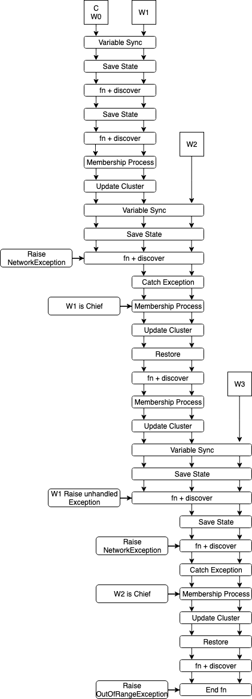
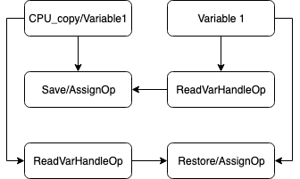
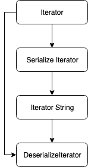
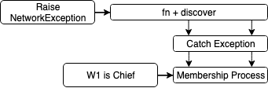
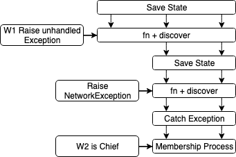

# Elasticity and Fault tolerance in MultiWorkerMirroredStrategy (MWMS)

|Status	|Proposed|
|---	|---	|
|**RFC #**	|[NNN](https://github.com/tensorflow/community/pull/NNN) (update when you have community PR #)	|
|**Author(s)**	|Samuel Oshin ([sboshin@amazon.com](mailto:me@example.org))|
|**Sponsor**	|A N Expert ([whomever@tensorflow.org](mailto:whomever@tensorflow.org))	|
|**Updated**	|2020-05-25	|


## Objective

Elastic training will enable distributed training to leverage dynamic clusters. This will help users leverage pre-emptible instances, allows users to start training faster, and potentially reduce cost to train. 
The goal is to enable elastic training in the MultiWorker Mirrored Strategy.

## Motivation

**Value**

Elastic training gives users flexibility between performance and cost. Current distributed training methods don’t allow for fault tolerance, which means all nodes have to be healthy throughout the duration of the training session. If a node goes down, the whole training sequence will have to be restarted, or in well planned scenarios, the user will have to manually continue the training session from a saved checkpoint. The other problem this solves is allowing the utilization of preemptible instances, which can save up to 80% in training cost in a cloud environment. Elastic training also allows for distributed training jobs to begin faster by only waiting for the minimum number of required nodes, with additional nodes being incorporated into the training process as resources become available. Elastic training also enables dynamic resource management in environments where resources are fixed

**Background**

The native method for distributed training is to use one of the many distribution strategies created. There are several distribution strategies created for a specific purpose

|Distribution Strategy	|Use Case	|
|---	|---	|
|MirroredStrategy	|Multiple GPUs one machine	|
|TPUStrategy	|Multiple TPUs one machine, TPU collectives	|
|MultiWorkerMirroredStrategy	|Multiple nodes, potentially multiple GPUS (GPUs need to be uniform)	|
|CentralStorageStrategy	|Multiple GPUS one machine; Variables are stored on the CPU	|
|ParameterServer	|Parameter servers, Multiple nodes, Multiple GPUs	|
|OneDeviceStrategy	|Single Device	|

Elastic training applies to MultiWorkerMirroredStrategy (MWMS) and ParameterServerStrategy (PSS). For this design we will focus on MWMS but the foundation of MWMS should apply to PSS. 
MWMS is a distributed strategy that takes a user provided function, where all its operations are created within the strategy’s scope, and runs this function while keeping all the variables in sync between all workers in the cluster. This is accomplished by using a distributed coordinator which uses a GRPC session and collective communication algorithms. Currently the cluster specifications are static. Also, the graph compute and collective operation faults aren’t handled. This means non-recoverable hardware failures will halt, hang, or crash the training job.

**Users affected**

Currently the users affected by this problem are users with large distributed training jobs, users who can’t afford dedicated cloud hardware, and users with very strict hardware resources. 

1. Large distributed training jobs
    1. As the number of nodes increase, so does the chance of a failure
    2. As the number of nodes increase so does the chance of getting faulty hardware
2. Expensive dedicated cloud hardware
    1. Preemptable instances are about 3x cheaper than on-demand instances in average across different cloud providers
3. On-premise clusters with shared worker pool

**Related Work**

Horovod, an API used to achieve distributed training in several ML Frameworks has started implementation of elastic training. 
https://github.com/horovod/horovod/issues/1907
https://github.com/horovod/horovod/pull/1849 [MERGED]

Pytorch has released 2 pre-release versions with different architectures.
https://github.com/pytorch/elastic/tree/master/torchelastic

Tensorflow ParameterServerStrategy RFC: Future work aims to address elasticity, but current RFC will address fault tolerance
https://github.com/tensorflow/community/blob/master/rfcs/20200306-single-client-parameter-server.md

MxNet Dynamic Training
https://github.com/awslabs/dynamic-training-with-apache-mxnet-on-aws

## User Benefit

*How will users (or other contributors) benefit from this work? What would be the headline in the release notes or blog post?*
Users will benefit by having a fault tolerant and potentially cost savings distributed training feature.


## _Design Proposal_

## MWMS Background

MultiWorkerMirroredStrategy has two roles: a chief and worker. Both roles run the graph and participate in collective communication. The chief is responsible for a few extra tasks such as checkpointing. Depending on the run mode (graph or eager) a distributed coordinator will be used or regular standard server created with the cluster spec representing the cluster, respectively. This will setup the GRPC session which is responsible for communicating between nodes. 
The graph is loaded within the strategy scope which will load the variables and operators in the graph. Running the training step function will run the graph inside the GRPC session allowing synchronization across the nodes.  Within this function when the user wants to modify a variable, they can [synchronize](https://www.tensorflow.org/api_docs/python/tf/distribute/StrategyExtended#update) the variable modification across the cluster by explicitly running a merge_call on the variables and updates. With this strategy the distributed graphs can always be kept in sync.
Example: https://github.com/tensorflow/tensorflow/blob/master/tensorflow/python/training/moving_averages.py#L111

For simple synchronous training, these variable updates are handled inside of the optimizer when [applying gradients](https://github.com/tensorflow/tensorflow/blob/master/tensorflow/python/keras/optimizer_v2/optimizer_v2.py#L545). The user can manually update the variable by following these steps.

[How to update a variable](https://www.tensorflow.org/api_docs/python/tf/distribute/StrategyExtended)

The standard pattern for updating variables is to:

1. In your function passed to tf.distribute.Strategy.experimental_run_v2, compute a list of (update, variable) pairs. For example, the update might be the gradient of the loss with respect to the variable.
2. Switch to cross-replica mode by calling tf.distribute.get_replica_context().merge_call() with the updates and variables as arguments.
3. Call tf.distribute.StrategyExtended.reduce_to(VariableAggregation.SUM, t, v) (for one variable) or tf.distribute.StrategyExtended.batch_reduce_to (for a list of variables) to sum the updates. and broadcast the result to the variable's devices.
4. Call tf.distribute.StrategyExtended.update(v) for each variable to update its value.

### [Roles](https://www.tensorflow.org/tutorials/distribute/multi_worker_with_keras#multi-worker_configuration)

There are two components of `TF_CONFIG`: `cluster` and `task`. `cluster` provides information about the training cluster, which is a dict consisting of different types of jobs such as `worker`. In multi-worker training, there is usually one `worker` that takes on a little more responsibility like saving checkpoint and writing summary file for TensorBoard in addition to what a regular `worker` does. Such worker is referred to as the 'chief' worker, and it is customary that the `worker` with `index` 0 is appointed as the chief `worker` (in fact this is how `tf.distribute.Strategy` is implemented). `task` on the other hand provides information of the current task. The first component `cluster` is the same for all workers, and the second component `task` is different on each worker and specifies the `type` and `index` of that worker. 


## _**Adding Elasticity**_

To add elasticity and fault tolerance to MWMS, the system needs to be fault tolerant, and expandable. For fault tolerance, certain faults need to be identifiable and handled explicitly such as communication errors, user error, node errors. These faults will have certain impacts to the system which can reduce the system size and force the system to recover a previously known state. To expand, the system needs to be able to identify new nodes and modify the system to use the new nodes.

Currently in TF, keras has implemented a fault tolerance mechanism. When a node gets pre-empted and is able to restart, keras will wait for the node to come back online, and [everyone will restart from the last saved checkpoint](https://www.tensorflow.org/tutorials/distribute/multi_worker_with_keras#fault_tolerance). 

### **_Design Summary_**

This design aims to augment the Multi-Worker Mirrored Strategy to add elasticity while avoiding start/initialization times. In the event of cluster shrinkage or expansion, we don’t want to restart the process/session, but want session to adapt to the cluster changes, avoiding re-compilation, re-optimization, and other usual first time costs. 


### **_CAVEAT: Model Determinism_**

In the event of membership changes, to accommodate the new cluster size, the dataset will have to be re-distributed among the new set of working nodes. This will cause the model to lose determinism while training the model.
Prefetching datasets
Any stateful variables that are not created under the MWMS scope, will not be restored. All pertinent variables needed have to be created under the MWMS scope.


### _Workflow_




The workflow shown above goes through major and typical situations during elastic training. This occurs within the strategy run function.

* Normal process where the state is saved, but the function runs correctly. 
* A membership change process that adds a new node (W2, W3). 
* A communications failure where NetworkExceptions are raised, which initiates a membership change process to remove failing node. 
* A node failure which causes a node to fail, and propagate by causing the system a network failure on the next iteration. 
* A normal termination process by OutOfRangeException

### _Variable Sync Process_

The variable sync process is where the chief broadcasts its variables to the other workers to keep them in sync at the beginning. On a new cluster, each node will create their variables locally, then they will synchronize their variables with the chief. The Variable sync process can also be started when there is a new node being added to the cluster. This new node will need to synchronize its variables with the chief. Currently the chief will broadcast to everyone and only the new nodes will actually modify their variables. 

* Broadcast from chief
    * Catch NetworkError and start Membership Change Process
* Assign variables from broadcast

**Datasets**

When a new process joins the run call, the dataset of the new nodes and the old nodes will be out of sync. Each dataset operator internally has an iterator object which can be restored through MakeIteratorFromCheckpoint. The chief will send its serialized iterator to be restored on the new nodes. This will bring the new nodes to the last iterated state of the dataset. 


### _Membership Change Process_

The membership change process happens when the cluster needs to be modified. This will take place when new nodes are being added to the cluster, or there is a NetworkException raised. The membership change process will attempt to figure out failed nodes, new nodes, and send out cluster spec updates to each worker. 

* Everyone ping chief
    * timeout for chief to respond
    * If chief doesn’t respond ping next chief candidate
* Run discovery and add any new nodes up to max number of nodes
* Blacklist nodes that did not ping chief (or next candidate)
* broadcast new cluster spec
* if number of nodes doesn’t meet minimum threshold, restart membership process

### _Update Cluster_

The update cluster process happens when a node receives a new cluster spec. This cluster spec needs to modify the worker node to discover or blacklist nodes. Currently TensorFlow doesn’t allow for dynamic cluster sizes. There are several identified things that need to be changed in order to allow for dynamic sizes. 

* Collective algorithms will need to be dynamic
    * There are a node def attributes that need to become inputs that can be set at runtime
        * **group_size** and **group_key** will need to be Inputs
```
        * REGISTER_OP("CollectiveReduce")
                .Input("input: T")
                .Output("data: T")
                .Attr("T: {float, float16, float64, int32, int64}")
                .Attr("group_size: int")
                .Attr("group_key: int")
                .Attr("instance_key: int")
                .Attr("merge_op: {'Min', 'Max', 'Mul', 'Add'}")
                .Attr("final_op: {'Id', 'Div'}")
                .Attr("subdiv_offsets: list(int)")
                .Attr("wait_for: list(int) = []")
                .Attr("communication_hint: string = 'auto'")
                .SetIsStateful()
                .SetShapeFn(shape_inference::UnchangedShape);
```
* The Server Class in server_lib.py will need a new api “update_cluster_spec”
    * This will update the server with the new cluster spec, to add new nodes and remove new nodes
    * This will also require all necessary C++ changes needed to update_cluster_spec
        * server_lib.cc

_**Datasets**_

MWMS currently has an experimental distributed dataset function. This function automatically shards the dataset across the different workers and tries to Rebatch the dataset to enforce a local batch size from the global batch size.

```
def _experimental_distribute_dataset(self, dataset):
    input_context = self._make_input_context()
    return input_lib.get_distributed_dataset(
        dataset,
        self._input_workers,
        self._container_strategy(),
        split_batch_by=self._num_replicas_in_sync,
        input_context=input_context)
```

To enforce the global batch to local batch ratio, RebatchDataset Operator num_replicas will need to be updated to reflect the new cluster. 

```
REGISTER_OP("RebatchDataset")
    .Input("input_dataset: variant")
    .Input("num_replicas: int64")
    .Output("handle: variant")
    .Attr("output_types: list(type) >= 1")
    .Attr("output_shapes: list(shape) >= 1")
    .Attr("use_fallback: bool = true")
    .SetShapeFn(shape_inference::ScalarShape);
```

Another aspect of the dataset distribution is the auto sharding process.

```
class _AutoShardDataset(dataset_ops.UnaryDataset):
  """A `Dataset` that shards the `Dataset` automatically.

  This dataset takes in an existing dataset and tries to automatically figure
  out how to shard the dataset in a multi-worker scenario. Currently, it uses
  Grappler to walk up the dataset graph until it finds a reader dataset (e.g.
  CSVDataset, TFRecordDataset), then inserts a ShardDataset op before that node
  so that each worker only sees some files.

  Args:
    num_workers: Total number of workers to shard this dataset across.
    index: The current worker index (out of the total number of workers) this
      dataset is for.

  Raises:
    NotFoundError: If we cannot find a suitable reader dataset to begin
      automatically sharding the dataset.
  """
```

The sharddataset operator is defined

```
REGISTER_OP("ShardDataset")
    .Input("input_dataset: variant")
    .Input("num_shards: int64")
    .Input("index: int64")
    .Output("handle: variant")
    .Attr("require_non_empty: bool = false")
    .Attr("output_types: list(type) >= 1")
    .Attr("output_shapes: list(shape) >= 1")
    .SetShapeFn([](shape_inference::InferenceContext* c) {
      shape_inference::ShapeHandle unused;
      // num_shards should be a scalar.
      TF_RETURN_IF_ERROR(c->WithRank(c->input(1), 0, &unused));
      // index should be a scalar.
      TF_RETURN_IF_ERROR(c->WithRank(c->input(2), 0, &unused));
      return shape_inference::ScalarShape(c);
    });
```

Since the ShardDataset Operator takes index, and num_shards as inputs, these values need to be variable at runtime to resume the dataset iteration from the restored point with a new sharding policy.

All nodes will modify their num_shards input to the AutoSharding added ShardDataset Operator to reflect the new cluster size, and the new nodes will have their index changed to match their task_id.

*There might be additional graph components that depend on cluster_spec that must be updated in addition to the items listed above.*

### _Saving and restoring State_

When a fault occurs in the function being run, the current state of the cluster will need to be discarded because the cluster will be in an undetermined state. To continue training, the cluster will need to be restored to a previously known stable state. This state should be saved often enough to be able to further the training progress but not too often to the point of degrading the training. Saving the state can be a relatively expensive operation relative to the function being run. There will be a strategy option to set how often the state should be saved relative to the number of times the function is run. This will allow the user to balance the trade off between restart progress and performance.
The Strategy doesn’t take a model, optimizer, or dataset as an input directly. This means we can’t directly checkpoint the model, optimizer, and dataset. The strategy does have access to all the variables created under the scope. It also has access to the dataset if the user uses the experimental distribute dataset function. With these options, to save the state, for each variable created we will copy each variable to CPU memory, which will still reside in the graph. 





* Saving State
    * Strategy has access to the function being run, the current graph, and all variables that have been created in the graph.
    * If using a distributed dataset, it also has access to the dataset, and its distributed iterator
    * To save state of variables (Cover optimizers and weights)
        * Read each variable into CPU memory by creating copies of variables on the CPU device (To save CPU memory, do this for only 1 GPU, and restore to all GPUs)
    * To save state of iterators (Covers dataset index)
        * Serialize state of iterator using [SerializeIterator](https://github.com/tensorflow/tensorflow/blob/master/tensorflow/core/ops/dataset_ops.cc#L820) Op (This is the iterator resource stored in the resource manager)
* Restoring State
    * Re-assign variables with backup data
    * Deserialize state of iterator using [DeserializeIterator](https://github.com/tensorflow/tensorflow/blob/master/tensorflow/core/ops/dataset_ops.cc#L829)

_**All nodes Saving vs Chief Saving**_

If only the chief saves its state to restore the others nodes when needed. The chief will be responsible for broadcasting its state in the event of a roll back. This will add a broadcast overhead. A restore only happens when a failure occurs.
An example overhead for a 500MB model on a 10GB/s network would be about 49ms.

**_Alternate Designs (Do any of these alternate designs help?)_**

Design #1

Create a new API in the strategy for checkpointing. The new api will take in a checkpoint obj that will be used to save and restore the graph variables. Checkpoint will need to be extended to also checkpoint iterators to rewind datasets, this will be checkpointing to an in-memory filesystem.

```
checkpoint = tf.train.Checkpoint(optimizer=optimizer, model=model)
mwms_strategy.set_checkpoint(checkpoint)
```

Design #2

In TF2.0 variables are created in the resource manager, and so are iterators. Creating an operator to directly save and restore the resource manager, should save and restore the variables without modifying the graph. 

* Create SerializeResourceMgr, DeSerializeResourceMgr operators

Design #3

There is a ResourceMgr per device. Create a backup CPU device, which will backup other devices resource managers.
Session will have a new api to backup and restore resource managers

Design #4

Modify the ResourceMgr to backup directly to CPU memory.


### _Fn + Discovery_

While running the function, a separate thread per node should run a simple check with the chief. This thread will expect a small broadcast call to be made. This might impact network stability of the fn, but the broadcast itself is an ack to move to membership change process from the chief. 

* Start MRT (MirrorReplicaThreads) for GPU compute
* Start discovery thread
    * If chief, run discovery script
    * chief will then broadcast to workers to start a membership change or continue
* If a membership change process is requested
    * After fn has finished that iteration, it will start a membership change process

### _Additional Chief Duties_

* The chief role is given to Worker 0 in the cluster spec

    * `'cluster': {'worker': ["localhost:12345", "localhost:23456"]}`
    * New cluster specs will only change order if that node has been blacklisted
    * Chief will only change if the chief has been blacklisted
    * New nodes are added to the end of the worker list

* Run script to discover new nodes
* Update cluster spec and send cluster spec to other workers
* Initialize variables
    * broadcast to workers
* Determine faulty nodes
    * A health check in membership process

### **_Fault Tolerance_**

To add fault tolerance to MWMS there are a few major changes that need to take place. The strategy needs to be able to handle different types of faults, save a state, and recover from said state. In synchronous training, there are several types of faults that can happen. We will classify these faults into two main sections, recoverable and non-recoverable faults. 

_**Non-recoverable faults**_

These are faults that put the system in a position it won’t recover from. For example, a hung system, a deadlocked system, user error which causes the system to crash. These faults can’t be recovered from because the system has no way of either fixing the error, or knowing there is an error to be fixed. For such situations an appropriate error will be raised if possible. 

_**Recoverable faults**_

Recoverable faults are the faults which the MWMS strategy can recover from. The MWMS strategy can recover from a network fault, a node fault, or a hardware fault. 

A **network fault** is any failure arising from a node being uncommunicative, or failing anywhere in the communication code. This fault can manifest through communicating with other nodes. A **node fault** is any fault that causes the entire node to crash, and a **hardware fault** would specifically be any hardware going bad. A hardware fault and node fault are treated similarly because MWMS can’t run with heterogeneous number of GPUs in the cluster, which means if a GPU goes down, the node will also go down. 

For networking faults, MWMS strategy uses collective operators for cross device communication. These functions will have to raise a NetworkingError exception when there is a fault. This exception will be handled by the coordinator. 
For example, the [batch_reduce_to](https://github.com/tensorflow/tensorflow/blob/master/tensorflow/python/distribute/mirrored_strategy.py#L630) function of the MWMS strategy should raise a NetworkingError on a communication error. 

If a worker gets a NetworkingError exception, the worker will go into a membership change state.



A **hardware fault** manifests by GPU or CPU failure. This will be assumed to be any other fault that isn’t handled by the distributed coordinator. These faults should bring the offending node down. Once the node is down, on the next function call, the system will receive a NetworkingException, and since the offending node is down, it will blacklist it, restore and continue.

A **node fault** manifests from the node itself going down. This usually means the node was pre-empted, a sudden shutdown, a sudden restart. These faults are the same as hardware faults once the node is down. The system will know a node is down on the next function call.




## Elastic Features for TF Config Cluster Resolver

Elastic features of MWMS need extra information: min_nodes, max_nodes, discovery_script location
Extend tf_config_cluster_resolver to handle these optional parameters.

## Multi-Worker Runner

The multi worker runner is a cli that is used to run the multi worker jobs, while setting all the required environment variables and roles that are required to run. This will automatically set the TF_CONFIG env, and assign different roles to each node based on the discovery script defined.  This is useful regardless of elastic training, elastic training will add min nodes, max nodes and discovery script options.

```
tensorflowrun --min_nodes Y --max_nodes Z \
    --discovery disco_script.py --hostfile hostfile python train_script.py
```

Basic design:

* run discovery script
* Parse hostfile
* Create inital per worker cluster_spec
    * run training script with available hosts.
* keep running discovery script
    * if new hosts, start training script with updated cluster spec

## Programming Flow

* Create Training script as you would for tf.MultiWorkerMirroredStrategy
* Create discovery script for your cluster
* Use tensorflowrun to run your script [this can be a specific, or general cli]
    * tensorflowrun —discovery_script discovery_script.sh —min_nodes X —max_nodes Y python training_script.py

### Alternatives Considered

* Similar to the above design, but only save the state before every run call (This is usually the start of an epoch)
    * Before executing run call, Save state
    * During runs, before OutOfRangeException
        * If any nodes fail, Run membership process, restore all nodes to saved state, continue
    * Frequent node failures, and longer epochs are prone to restarts and less progress will be made
* Similar to the above design, but on membership changes, completely rebuild the whole session with the updated cluster spec. 
    * This will incur any huge startup costs, which up to 3 mins is normal
        * https://github.com/tensorflow/tensorflow/issues/25057
* Add Checkpointing to Strategy
    * On failure Auto restart from Checkpoint
        * Restarting can either No session rebuild or Full session rebuild
    * Documentation of proper usage of Saving state (should only be saved at start/end of epoch)

### Performance Implications

* Speed Implications
    * As variables are being updated, there will be a backup process to enable recovery. This process will have performance implications. 
    * Additional network calls will impact communication time
    * Time taken to modify cluster size, initialize variables of new nodes will also impact performance
* Memory implications
    * CPU memory will increase as we save the variables in CPU memory.
* Benchmarks comparing dedicated nodes vs nodes with planned failure to measure impact of elasticity
* End to end tests will utilize the Multiprocess runner and run small training jobs with planned failures. These tests will be added to collective_all_reduce_strategy_test.py

### Tutorials and Examples

* The run script to specify min/max nodes will be a new cli
    * tensorflowrun —min_nodes X —max_nodes Y —discovery_script discover.sh —hostfile hostfile python training_script.py
* Alternative
* `multiworker_strategy = tf.distribute.experimental.MultiWorkerMirroredStrategy(min_nodes=X, max_nodes=Y)`
* A tutorial on creating discovery scripts
    * This will be platform dependent

### User Impact

* New documentation changes to elaborate the elastic and fault tolerant features
* How to create discovery scripts to discover new nodes

## Questions and Discussion Topics

* Are there any missing effects of changing the cluster spec?
    * Currently identified are collective algorithms, GRPC Server
    * Main effects that change the graph will need to be dynamic to avoid graph re-optimization
