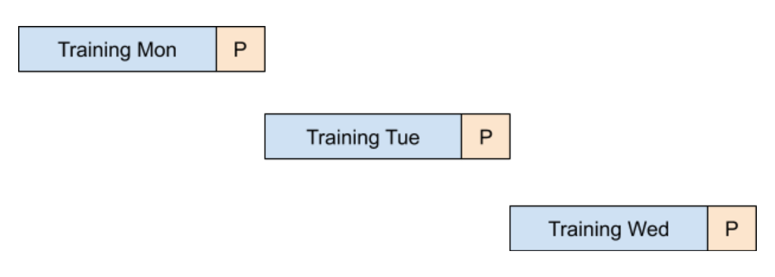
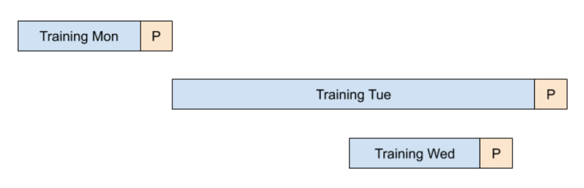
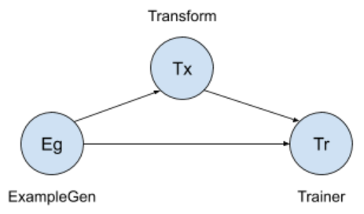
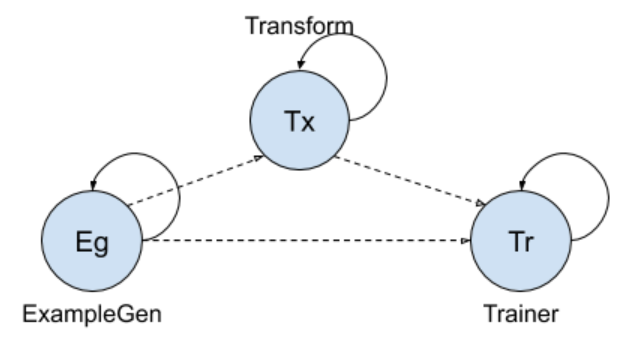
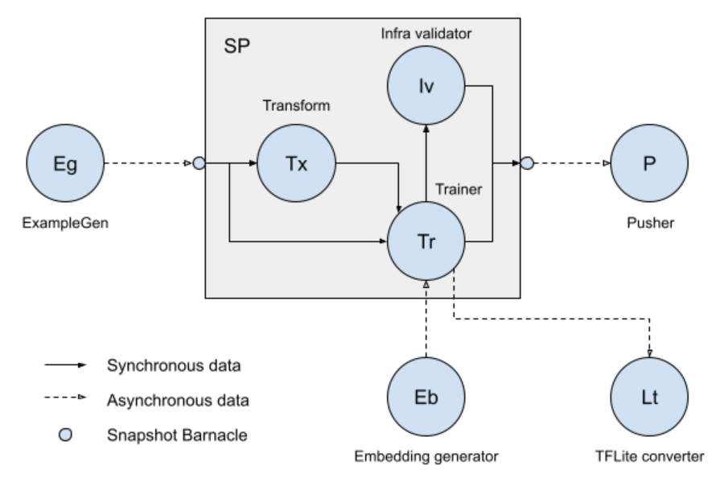

# Advanced TFX DSL semantics

| Status        | Proposed                                                    |
| :------------ | :---------------------------------------------------------- |
| **Author(s)** | Ruoyu Liu (ruoyu@google.com), Konstantin Shtoyk (kostik@google.com), Mitch Trott (trott@google.com), Zhitao Li (zhitaoli@google.com) |
| **Sponsor**   | Konstantinos Katsiapis (katsiapis@google.com)               |
| **Updated**   | 2020-04-08                                                  |

## Background

The existing TFX DSL mainly focuses on one-shot pipelines with static execution
plan. While it is good enough for many use cases, there are some scenarios that
the current DSL fails to support. Some of those scenarios are becoming more and
more crucial to modern ML production pipelines. The rest of this section will go
through some scenarios that this proposal is trying to address.

### Components with different schedules

Until now, all components in a TFX pipeline are expected to be executed the same
number of times if no failure occurs. For example, in the
[Chicago Taxi](https://github.com/tensorflow/tfx/tree/v0.21.2/tfx/examples/chicago_taxi_pipeline)
example, the `ExampleGen` component will be executed no more or no less than the
`Trainer` component or any other component if every pipeline run finishes
successfully. This is a strong guarantee but also a strict limitation. The use
cases shown below are common patterns that require relaxation of this
limitation.

#### Different input sources

It is common that a ML pipeline uses more than one input sources. It is also
common that different input sources are generated with different frequencies. In
this case, it is undesirable to fit the components consuming different data
sources into the same pipeline with the same schedule since it prevents the
optimization between data freshness and resources efficiency. On the other hand,
it is also undesirable to break a logical pipeline into several pieces and run
them separately since the 'wait for all inputs available' semantics in the
original pipelines is broken which might result in unintended behaviors such as
consuming partially ready data. Thus, it is important to be able to author a
pipeline that consists of components with different schedules and we want such
experience to be well defined and intuitive.

#### 'Best effort' components

There are some components that are not regarded as _essential_ to a pipeline but
take very long to run. Thus, we do not want to put them into the critical path
of the pipeline nor spend too much resource to make sure they are executed
successfully for every pipeline run. A possible approach to address these
requirements is to make these components optional and do not tie them to the
same schedule as other components in the pipeline. Similar to the previous use
case, this also requires us to support components with different schedules in a
pipeline.

#### Limited computation resource, too much data

Data is the most critical piece to ML engineering. And the recent advanced
technologies in data collection and log processing enable us to get more data
faster. Sometimes the data volume is too high and arriving speed is too fast
that the data exceeds the computation resource limit of a system. For example:

*   New data arrives every hour but the entire ML pipeline takes one day to run
    end-to-end.

In most cases, there is one (or a few components) that take(s) significantly
more time than other components. Indeed, from what we observed within Google,
`Trainer` is more likely to be the one that cannot catch up with the speed of
other components such as `ExampleGen`. We have a couple of options in the
existing TFX DSL under this context:

1.  Adapt the pipeline scheduling to the data arriving frequency. In the context
    of the previous example, the pipeline will be scheduled to run every hour.
2.  Adapt the pipeline scheduling to the pipeline running time. In the context
    of the previous example, the pipeline will be scheduled to run every day.
3.  Split the pipeline into multiple parts, each of which employs a different
    schedule.

Option 1 is fine in an ideal world, where the computation resource is unlimited.
However in real world, this option will likely cause pipeline runs to pile up in
a certain stage which is problematic due to resource contention. Option 2 will
not have the resource contention problem but it gives up the benefit of the
timely-arriving data. It is likely that the `Trainer` is training on some old
data despite of more recent data being available, which is a compromise of model
freshness and is not ideal for scenarios that are sensitive to model freshness.
Option 3 can potentially solve the problem but is not user-friendly and is prone
to future changes of individual components and pipeline shape.

On the other hand, if we are able to support components with different schedules
in a pipeline, the problem can be naturally solved.

### Synchronization barrier

It is not recommended to have concurrent pipeline runs since it will cause
problems for components that need to be guarded by a 'synchronization barrier'
such as `Pusher`. However, this is not avoidable sometimes even if the intention
is not to have pipeline runs concurrently.

<div style="text-align:center"></div>

The figure above shows a daily ML pipeline in an ideal world. For
simplification, we combine all components but `Pusher` into a single stage. As
you can see, we expect a pipeline run to finish within a day so it will not have
overlap with other runs. However, there might be cases that the pipeline
overruns and result in concurrent pipeline runs. The figure below shows an
extreme but possible case, where the Tuesday run actually finishes after the
Wednesday run. This is problematic since Tuesday run will push an older model
into production which is likely to cause regression.

<div style="text-align:center"></div>

To address the problem, we need to guarantee that:

*   There is only one instance of `Pusher` running at any time.
*   Each `Pusher` run always pushes a model that is considered better than any
    previously pushed model.

However, there is no good solution to provide such guarantees without compromise
in the existing TFX DSL.

## Design proposal

### A new way to categorize ML pipelines

Before going into the design details, we would like to introduce a new way to
categorize ML pipelines. Understanding these concepts is critical to evaluate
the rest of this RFC.

#### Synchronous execution & Asynchronous execution

Synchronous execution refers to the pipeline execution style we have seen so far
in the TFX DSL. It has several properties:

*   A synchronous execution pipeline can be represented as a _Directed Acyclic
    Graph_ (DAG) where any edge in the DAG represents the task dependency
    relationship between two components in the pipeline.
*   A synchronous execution pipeline is scheduled in the unit of pipeline runs.
    In each pipeline run, components in the pipeline will be visited in
    topological order according to the pipeline DAG.
*   Every component in the pipeline will be executed *exactly once* for each
    pipeline run. For example, `ExampleGen` (represented by `Eg`), `Transform`
    (represented by `Tx`) and `Trainer` (represented by `Tr`) in the figure
    below will share the same number of executions if no error occurs.
*   A component in the pipeline will only be triggered when all its upstream
    components finish. For example, `Trainer` will only be triggered when
    `ExampleGen` and `Transform` all finish in the figure below.

<div style="text-align:center"></div>

Asynchronous execution refers to the pipeline execution style where each
component in the pipeline is a stand-alone job (usually a long-running job). It
has the following properties:

*   There is no explicit task dependencies in asynchronous execution pipelines.
    Components are loosely connected through data dependencies. For example in
    the figure below, we considered `ExampleGen` and `Transform` is connected
    (through dashed line) only because that `Transform` will consume the output
    from `ExampleGen`.
*   There is no 'pipeline run' for asynchronous execution pipelines. Each
    component in the pipeline runs on its own schedule.
*   Each component in an asynchronous execution pipeline can be triggered by
    newly available data of any of its data dependencies. For example, `Trainer`
    can be triggered by either new example data produced by `ExampleGen` or a
    new transform graph produced by `Transform`.
*   At a certain time, there is at most one instance per component that is
    running.

More details about the usage of asynchronous execution pipelines within Google
can be found in this
[paper](https://www.usenix.org/system/files/opml19papers-baylor.pdf).

<div style="text-align:center"></div>

#### Synchronous data & Asynchronous data

Under the context of TFX, a component is running in synchronous data mode if it
only consumes the immediate outputs of its upstream components in the **same**
pipeline run. This is **only** possible if the pipeline is in synchronous
execution mode mentioned in previous section.

On the other hand, if a component is able to consume more than the immediate
outputs of its upstream components but also the historical outputs of its
upstream components in previous pipeline runs, it is running in asynchronous
data mode:

-   In synchronous execution pipelines, this means that a component consumes not
    only the outputs of its direct upstream component runs, but also the
    historical data from previous runs. This can be achieved by leveraging
    [Resolvers](https://github.com/tensorflow/community/blob/master/rfcs/20190828-tfx-resolver.md)
    in the existing TFX DSL [^1].
-   In asynchronous execution pipelines, all components are running in
    asynchronous data mode naturally.

[^1]: Existing examples of
    [warm start](https://github.com/tensorflow/tfx/blob/r0.21.4/tfx/examples/chicago_taxi_pipeline/taxi_pipeline_warmstart.py#L102-L115)
    and
    [base model selection](https://github.com/tensorflow/tfx/blob/r0.21.4/tfx/examples/iris/iris_pipeline_native_keras.py#L111-L139)
    all use Resolvers to achieve asynchronous data.

### Support asynchronous execution pipelines

The table below lists all possible combinations of execution mode and data mode
for an ML pipeline. As we discussed previously, TFX DSL already supports both
combinations with synchronous execution in it. We propose to support
asynchronous execution, which will help us to cover all combinations in the
table.

|                       | Synchronous execution | Asynchronous execution|
| :-------------------: | :-------------------: | :-------------------: |
| **Synchronous data**  | Default mode in existing TFX DSL | Not meaningful |
| **Asynchronous data** | Supported through [Resolvers](https://github.com/tensorflow/community/blob/master/rfcs/20190828-tfx-resolver.md) | Introduced in this RFC |

By supporting asynchronous execution pipelines, we are able to address all use
cases mentioned in the [Background](#Background) section:

*   Components are naturally running with different frequencies in asynchronous
    execution pipelines. The running frequencies are decided by the combination
    of the following:
    *   The frequencies of the new data arrival that can trigger a run.
    *   The time needed to finish a run.
    *   Potentially scheduling optimizer.

Note: Self-determined running frequency, as explained above, is not the same as
statically-defined running schedule that normally happens in the synchronous
execution pipeline world. However it can achieve similar goal in this context.

*   Synchronization barrier is also conveniently available since it is
    guaranteed that only one instance of a component will be running at any
    time.

The rest of this section will go into details about what additional semantics
and syntax will be added to TFX DSL to support asynchronous execution pipelines.

### Execution mode

A piece of good news is that components in the existing TFX DSL are already
connected through data dependencies, instead of direct explicit task
dependencies. The only place we need to change in the syntax is to add an
`execution_mode` option to the pipeline constructor interface.

```python
def create_pipeline():
  eg = ExampleGen(...)
  tr = Trainer(...)
  p = Pusher(...)

  return Pipeline.pipeline(
      components=[eg, tr, p],
      # The only difference compared with the existing DSL. Also note that this
      # field is optional and default to `SYNC` for backward compatibility.
      execution_mode=ASYNC,
      ...)
```

### Sub-pipeline

Asynchronous execution pipelines are able to provide a lot flexibility and
unblock many use cases. However, vanilla asynchronous execution pipelines have
their own problems.

Consider the example below, for which there is no good way to express the intent
that `Trainer` needs to read examples and transform graph that satisfy:

-   If the transform graph produced by a `Transform` execution E<sub>1</sub> is
    used by a `Trainer` execution E<sub>2</sub>, then E<sub>1</sub> and
    E<sub>1</sub> should use the same examples.

This is a typical data synchronization problem inside an asynchronous execution
pipeline. For simple cases like the one above, it is still possible (although
strongly not recommended) to workaround by hardcoding the synchronization logic
into a specific component (in this case, `Trainer`) and some special stamping on
related artifacts. However it will soon become unmanageable when the number of
components involved the data synchronization problem increases. What we need is
a mechanism to make part of the asynchronous execution pipelines to run
synchronously.

<div style="text-align:center"></div>

To address the problem, we propose 'sub-pipeline', which refers to a synchronous
execution pipeline inside a parent pipeline. In this case, we can have a mix of
synchronous execution and asynchronous execution together in one pipeline
definition. There are several attributes related to sub-pipeline:

1.  If we view sub-pipeline as a node in its parent pipeline, there is only one
    execution mode (synchronous vs asynchronous) in the parent pipeline.
2.  A sub-pipeline is **always** in synchronous execution mode, i.e., all nodes
    inside the sub-pipeline are executed synchronously in topological order.
3.  Each node inside the sub-pipeline can be configured to run with synchronous
    data mode or asynchronous data mode.
4.  Sub-pipeline inputs and outputs can be wired in either synchronous or
    asynchronous fashion (introduced below).

We will use the scenario represented by the figure below to better demonstrate
the proposal. There are 5 nodes in the parent pipeline:

-   An `ExampleGen` component, represented by `Eg`.
-   An `EmbeddingGenerator` component, represented by `Eb`.
-   A sub-pipeline that consists of three nodes:
    -   A `Transform` component, represented by `Tx`. It will take the examples
        produced by `ExampleGen` and output a transform graph.
    -   A `Trainer` component, represented by `Tr`. It will take three inputs:
        (1) the examples produced by `ExampleGen`; (2) the transform graph
        produced by `Transform`; (3) the embedding produced by
        `EmbeddingGenerator`. It will output a model artifact. There are two
        special requirements for these inputs:
        -   `Trainer` and `Transform` should use the same examples.
        -   The embedding used by a `Trainer` execution should be as fresh as
            possible.
    -   An `InfraValidator` component, represented by `Iv`. It will take the
        model produced by `Trainer` and evaluate whether the model can be
        deployed without correctness or performance issue. The `InfraValidator`
        component will output a validation result artifact.
-   A `Pusher` component, represented by `P`. It will take the model produced by
    `Trainer` in the sub-pipeline and push the model to the model server. For a
    model to be regarded as 'valid', there is a requirement that the `Pusher`
    will only read a model that has gone through infra validation.
-   A `TFLiteConverter` component, represented by `Lt`. It will take the model
    produced by `Trainer` in the sub-pipeline and convert it into a mobile
    friendly model. Since the conversion does not rely on server side infra
    validation, we want it to start process as soon as a new model is produced
    by `Trainer`.

<div style="text-align:center"></div>

#### Inputs to sub-pipelines

There are two flavors for a node inside the sub-pipeline to get input artifacts
that are **NOT** produced inside the sub-pipeline:

-   Asynchronous inputs. This is the same behavior as a normal node in an
    asynchronous pipeline. If there are two nodes inside a sub-pipeline that are
    trying to read the output of a node outside of the sub-pipeline
    asynchronously, they might get different results. This is demonstrated by
    `Trainer` reading the output of `EmbeddingGenerator`. Note that this is only
    available when the parent pipeline is in asynchronous execution mode.
-   Synchronous inputs. As a comparison, if two nodes in a sub-pipeline are
    reading from the same synchronous input, it is guaranteed that they will get
    the same set of artifacts. This is done through snapshotting the inputs at
    the beginning of the pipeline (as represented by the small barnacle attached
    to the left side of the sub-pipeline box in the figure above). In our
    example, `Trainer` and `Transform` are all reading the output of
    `ExampleGen` as synchronous input. Note that if the parent pipeline is in
    synchronous execution mode, the nodes inside the sub-pipeline will always
    read synchronous inputs.

NOTE: By default, a sub-pipeline can be triggered by any newly available
synchronous input but it will not be triggered by any newly available
asynchronous input. We will also discuss and provide custom triggering options
in future designs.

#### Outputs of sub-pipelines

As a symmetry, there will be two flavors for a node outside the sub-pipeline to
read the outputs of a node inside the sub-pipeline:

-   Asynchronous outputs. This is the same behavior as normal asynchronous data
    fetching. `TFLiteConverter` above demonstrates this behavior: it can be
    triggered as soon as `Trainer` in the sub-pipeline produces a new model.
    Note that this is only available when the parent pipeline is in asynchronous
    execution mode.
-   Synchronous outputs. As a comparison, when a node outside of the
    sub-pipeline tries to read the synchronous outputs of a node inside the
    sub-pipeline, the outside node will not get the artifacts until all the
    nodes inside the sub-pipeline finish execution. This is demonstrated by
    `Pusher` in the example above: It will be able to read a model produced by a
    `Trainer` execution only when all nodes in the sub-pipeline finish execution
    for that sub-pipeline run. Similar to synchronous inputs to a sub-pipeline,
    this is achieved by snapshotting the outputs of nodes inside a sub-pipeline
    after all nodes finish execution (as represented by the small barnacle
    attached to the right side of the sub-pipeline box in the figure above).

### Syntax

The example code below demonstrates the syntax for all proposed semantics in
this RFC. The example code also adopts the same example in the figure above.

```python
def create_subpipeline(eg, eb):
  b = tfx.experimental.SubpipelineInputs(
      inputs={'examples': eg.outputs['examples']},
      async_inputs={'embedding': eb.outputs['embedding']})
  tx = tfx.Transform(
      examples=b.inputs['examples'])
  tr = tfx.Trainer(
      examples=b.inputs['examples'],
      embedding=b.async_inputs['embedding'],
      transform_graph=tx.outputs['transform_graph'])
  iv = tfx.InfraValidator(model=tr.outputs['model'])

  return tfx.experimental.Subpipeline(
      components=[tx, tr, iv],
      inputs=b,
      outputs={
          'model': tr.outputs['model'],
          'validation_result': iv.outputs['validation_result']
      },
      async_outputs={'model': tr.outputs['model']})


eg = tfx.ExampleGen(...)          # Irrelevant parts omitted
eb = tfx.EmbeddingGenerator(...)  # Irrelevant parts omitted
sp = create_subpipeline(eg, eb)
p = tfx.Pusher(
    model=sp.outputs['model'],
    validation_result=sp.outputs['validation_result'])
lt = tfx.TFLiteConverter(model=sp.async_outputs['model'])

return pipeline.Pipeline(
    components=[eg, eb, sp, p, lt], execution_mode=ASYNC)
```

## Future work

There are multiple topics that we would like to address in future design
proposals.

Most importantly, we will introduce the data model and a serialization format of
ML pipelines that will uniformly support:

-   Both synchronous execution mode and asynchronous execution mode.
-   Both synchronous data mode and asynchronous data mode.

Beside that, we will also explore:

-   Options and APIs to support custom triggering logic for single node as well
    as sub-pipelines.
-   Options and APIs to support parallel executor runs within a component to add
    more efficiencies and flexibilities.
