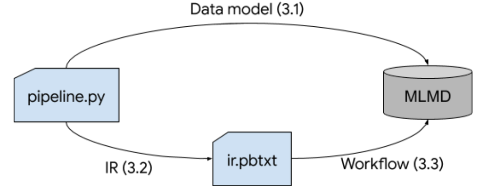
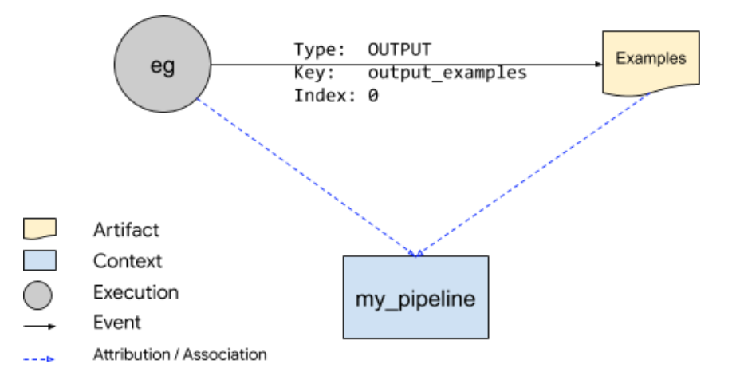
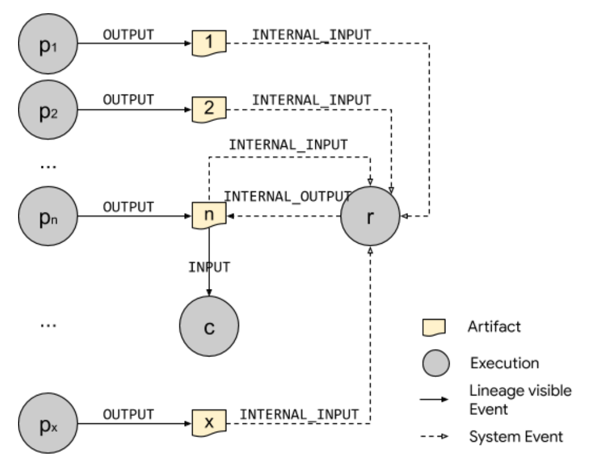
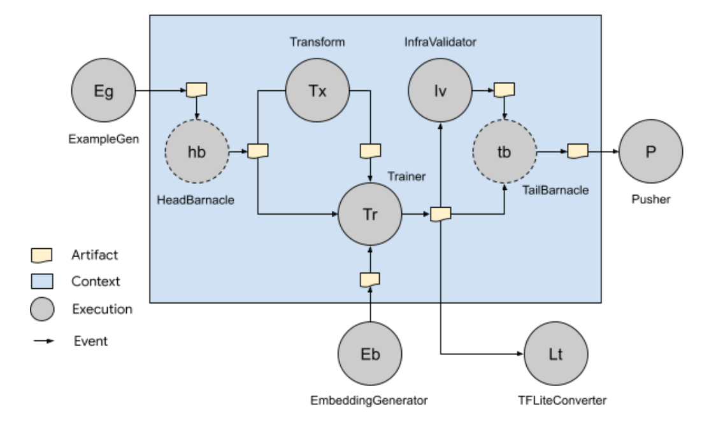

# Data Model and Intermediate Representation of TFX DSL

| Status        | Proposed                                                     |
| :------------ | :----------------------------------------------------------- |
| **Author(s)** | Ruoyu Liu (ruoyu@google.com), Hui Miao (huimiao@google.com), Hongye Sun (hongyes@google.com), Renmin Gu (renming@google.com) |
| **Sponsor**   | Konstantinos Katsiapis (katsiapis@google.com), Mitch Trott (trott@google.com), Zhitao Li (zhitaoli@google.com) |
| **Updated**   | 2020-07-05                                                   |

## 1. Objective

This RFC documents the data model that supports the TFX DSL
[semantics](https://github.com/tensorflow/community/blob/master/rfcs/20200601-tfx-uDSL-semantics.md).
It also introduces the TFX DSL intermediate representation (IR) and the workflow
based on that. The IR is the bridge between the DSL and its orchestration /
execution on all supported platforms and the workflow is the procedure that all
platforms should follow to reflect the data model in MLMD.

NOTE: While this doc has more than usual details than a typical design doc, it's
still a design doc rather than a spec doc. However the long term goal is to make
IR a specification for ML pipelines.

## 2. Background and Motivation

### 2.1. The importance of a uniform data model

When TFX DSL and orchestration were first
[introduced](https://github.com/tensorflow/community/blob/master/rfcs/20190718-tfx-orchestration.md),
artifact-centric and lineage-driven were among the core properties of the stack.
Although these properties are guaranteed by the underlying data model of
[ML Metadata](https://www.tensorflow.org/tfx/guide/mlmd), it was arguably hard
to notice the importance of the data model at that time since the TFX stack only
supported pipelines with synchronous artifact fetching (each node only consumes
artifacts that are produced within the pipeline run).

Later on, the
[Resolver](https://github.com/tensorflow/community/blob/master/rfcs/20190828-tfx-resolver.md)
node was introduced, which enables asynchronous artifact fetching (a
`ResolverNode` is able to fetch artifacts produced from past pipeline runs).
This is essential to supporting more advanced features such as warm-start
training and model validation. As a result, the importance of a consistent data
model became more visible since it would be infeasible to define different
`Resolver` logic reliably without every pipeline run following the same data
model when reading and writing ML metadata.

The importance of the data model was further amplified with the proposal of the
[advanced DSL semantics](https://github.com/tensorflow/community/blob/master/rfcs/20200601-tfx-TFX DSL-semantics.md),
in which the concept of synchronous versus asynchronous execution pipelines and
synchronous versus asynchronous data pipelines was formalized. It is also in
this proposal that asynchronous execution pipelines are considered to be the
future of ML productionisation as training data becomes more and more accessible
and the data volume is likely to overwhelm the computing power of systems
running training pipelines. One of the consequences of this trend is that
asynchronous artifact fetching will become the mainstream, as it is by nature a
property of asynchronous execution pipelines. However, synchronous artifact
fetching is still needed and is likely to dominate for use cases where one-shot
pipelines are good enough. It is also useful even in the context of asynchronous
execution pipelines, where data synchronization is required. A good example will
be the
[sub-pipeline](https://github.com/tensorflow/community/blob/master/rfcs/20200601-tfx-TFX DSL-semantics.md?#sub-pipeline)
idea.

Thus, it is highly desired to have a uniform data model that is consistent
across synchronous artifact fetching and asynchronous artifact fetching.
Moreover, the data model should also be flexible and extensible enough so that
it can adapt to not only existing features, but also future features including
but not limited to sub-pipeline and conditionals.

### 2.2. The importance of a consistent data model across platforms

Besides consistency across synchronous and asynchronous artifact fetching, a
consistency across platforms of the data model is also important as TFX is
designed to be a portable stack that is platform agnostic. This is especially
important for the 'local development first and cloud deployment after'
experience.

A good example is the `Resolver` logic, which is supposed to be written once and
deployed anywhere. However, if the data models are inconsistent across
platforms, the artifact resolution behaviors on different platforms are likely
to be different. This will potentially cause problems that are often hard to
debug.

Beyond correctness and consistent behavior across platforms of existing
features, a consistent data model also helps to make the adoption of future
semantics / features easier, and potentially reduces duplicate work. Although it
is still possible to implement the same semantics / features (e.g.,
sub-pipeline) with the same behavior on top of different data models, the
efforts will be super-linear to the number of features added and are likely to
become unmanageable over time.

### 2.3. Motivation of the intermediate representation

Under the existing layering of TFX DSL / orchestration, it is not easy to
guarantee a consistent data model across platforms since the data model is
mostly embedded in the implementation. Since code reuse is possible for some
platforms but might be hard or even infeasible for others (e.g., a golang-based
platform can hardly reuse a python-based module), a more explicit contract is
desired to serve as the bridge between the pipeline definition script and the
platforms that run the pipelines. For this reason, we would like to introduce
TFX Intermediate representation (IR) in this RFC.

The IR should provide a serialized format of TFX DSL that has the following
properties:

1.  Carries over all TFX DSL semantics in a uniform way. This means that the
    same TFX DSL IR should be able to support the following pairs:

    *   Synchronous execution & asynchronous execution
    *   Synchronous data fetching & asynchronous data fetching
    *   Data dependencies & task dependencies
    *   Basic semantics & advanced semantics (sub-pipeline, conditional, etc)

2.  Provides a fully declarative specification of a TFX pipeline. As a
    comparison, a large chunk of the specification is hidden in the code (in the
    current, pre-IR world).

3.  Provides flexibility and extensibility in the following ways:

    *   Enables using different frontend languages to compose TFX pipelines.
    *   Enables attaching platform specific extensions to IR in a transparent
        way so that it can be understood by specific platform runners.
    *   Enables applying different optimization strategies on top of the
        pipeline graph. These optimization strategies can be generic (e.g.,
        combining `ResolverNode` and its only consumer) or can be specialized to
        a certain platform (e.g., better leverage
        [Fusion](https://cloud.google.com/dataflow/docs/guides/deploying-a-pipeline#fusion-optimization)
        in Dataflow to make data processing more efficient).

IR, together with the workflow based on it should be able to:

1.  Reflect the TFX DSL data model by describing how a pipeline definition
    should be executed and what the MLMD representation of the execution should
    look like.
2.  Provide portability across all existing platforms and enable running TFX
    pipelines on more platforms. The portability can be further categorized into
    the following:

    *   Portability of scheduling semantics (i.e., what gets run, and when it
        runs)
    *   Portability of underlying recorded data model (i.e., what gets stored in
        MLMD)
    *   Portability of data I/O semantics (i.e., how input selection happens,
        and how dependency between inputs and executions are enforced)

## 3. Design proposal

The design will be introduced in three sections:

-   Section [3.1](#data-model) describes how a TFX pipeline execution will be
    represented in MLMD database (a.k.a., the end result of a pipeline
    execution).
-   Section [3.2](#intermediate-representation-ir) describes a specification of
    a TFX pipeline.
-   Section [3.3](#workflows-scenarios-and-examples) describes how the detailed
    workflow given a specification of a pipeline and how that works for
    different semantics.

<div style="text-align:center"></div>

### 3.1. Data model

As mentioned previously, the data model of TFX DSL is built on top of
[ML Metadata](https://www.tensorflow.org/tfx/guide/mlmd) (MLMD) which provides a
graph data model that is specialized for machine learning workflows.

#### 3.1.1. Basic elements

In TFX, the three types of vertices in MLMD are used as follows:

*   **Artifact**: an `Artifact` maps to an output of a node in a TFX pipeline
    and can be potentially fed into another node as an input. An `artifact` is
    always typed and the payload of the data is always referenced by the `uri`
    field in the `artifact`. Once published (marked as `LIVE`), the payload and
    most metadata of an `artifact` in TFX will not be mutated, with a few
    exceptions (e.g., system-owned metadata fields such as `state`).
*   **Execution**: an `Execution` records a node run in a TFX pipeline. It takes
    zero or more `Artifacts` and produces zero or more `Artifacts`. The
    non-Artifact inputs (e.g., parameters) of the execution will be stored as
    the properties of the `Execution` instance.
*   **Context**: a `Context` describes grouping concepts of workflow elements.
    In TFX, it does not map to any specific entity, instead it groups artifacts
    and executions under certain meanings (e.g., a pipeline run). Note that an
    `Execution` or an `Artifact` can be linked to more than one `Contexts`.

There are also three types of edges that are used in TFX, linking the
aforementioned vertices:

*   **Event**: an `Event` links an `Artifact` and an `Execution`. In TFX, the
    `Event` contains the following info:
    *   The type of the `Event`. For example, type `INPUT` means that the
        `Artifact` is an input of the `Execution`.
    *   The key of the input / output `Artifact`. For example, a `Trainer` might
        produce two groups of models: one group of models are normal TensorFlow
        models and the other group of models are optimized for mobile. The key
        can be used to differentiate them.
    *   The index of the input / output `Artifact`. For example, an `ExampleGen`
        might produce a list of outputs with the same output key. To
        differentiate them, the index will be used.
*   **Attribution**: an `Attribution` links an `Artifact` to a `Context`.
*   **Association**: an `Association` links an `Execution` to a `Context`.

#### 3.1.2. Data model of a Channel

In TFX DSL, artifacts flow between components in
[`Channels`](https://www.tensorflow.org/tfx/api_docs/python/tfx/types/Channel).
In the simple example below, `MyTrainer` uses the output `Channel` of
`MyExampleGen` as its input `Channel` for examples data. In other words,
`MyExampleGen` is writing to its output `Channel` and `MyTrainer` is reading
from the same `Channel`.

```python
def create_pipeline():
  eg = MyExampleGen(param_one=...)
  tr = MyTrainer(input_examples=eg.outputs['output_examples'], ...)

  return Pipeline.pipeline(
      pipeline_name='my_pipeline',
      components=[eg, tr],
      execution_mode=SYNC
      ...)
```

<div align="center"><em><a id="table1">Table 1</a>: A simple pipeline.</em></div>

`Channel` is an abstract concept in TFX instead of a real entity in MLMD like
`Artifact`. `Channel`. It is built on top of the basic elements described
previously. When being mapped to MLMD, a `Channel` is essentially a view of a
collection of `Artifact` that satisfies a set of restrictions defined by five
categories of predicates shown below. Note that the predicates soly rely on
information from MLMD and `ArtifactType` is the only required one.

Required? | Type of Predicates
:-------: | :------------------------------------------------------------------
Yes       | Predicates on the type of artifacts
No        | Predicates on the properties of the artifacts
No        | Predicates on the `Context` attribution
No        | Predicates on the producer `Execution` of the artifacts
No        | Predicates on the `Event` linking the artifacts and the `Execution`

<div align="center"><em><a id="table2">Table 2</a>: Predicates contained in a Channel.</em></div>

Although ‘writing to a `Channel`’ and ‘reading from a `Channel`’ are percepted
as a pair of symmetrical actions under the context of TFX DSL, they are very
different when being mapped to the underlying data model:

*   ‘Writing to a `Channel`’ essentially means publishing artifacts to MLMD. In
    addition, lineages of those artifact are also kept in MLMD, such as its
    producer execution, related contexts (e.g., pipeline run) and the edges
    linking them. The entries published to MLMD follow the data model so that
    the consumers of the writer's outputs can get the artifacts correctly.
*   ‘Reading from a `Channel`’, on the other hand, refers to a node getting
    desired `Artifact` entries (not payload) from MLMD by a query (in
    implementation, a set of MLMD API calls) that is constructed from the
    information of the `Channel`. In other words, a `Channel` should contain all
    the information that can be used to precisely recreate all the predicates
    needed to construct the query, with which the reader can get all the desired
    artifacts.

Taking the code snippet above as an example:

*   In `MyExampleGen`, an `Artifact` along with other entities are published to
    MLMD as shown in the figure below.
*   In `MyTrainer`, it queries MLMD (currently in the form of a set of MLMD API
    calls) to cover the following restrictions:
    *   The type of the artifacts matches desired types (In this case,
        `Examples`).
    *   The artifacts are linked to the correct `Context`(s). In this case, it
        should be at least linked to a `Context` representing the pipeline
        subgraph of `my_pipeline`.
    *   The artifacts are produced by the `MyExampleGen` node in the pipeline.
        If there are more than one `MyExampleGen` nodes, the query should be
        able to distinguish one from the others.
    *   The artifacts are produced through the output key of `output_examples`.

<div style="text-align:center"></div>

`Channel` construction happens during DSL compilation time. The compiler will
generate channels containing different information for different DSL features /
semantics (more in the next section). The second part of the design proposal
will cover how `Channel` is represented in IR.

##### 3.1.2.1. Consistent for both data modes

A `Channel` for synchronous data mode (synchronous artifacts fetching) and a
`Channel` for asynchronous data mode (asynchronous artifacts fetching) is only
different in that, the final query created for the former always includes a rule
with predicate on the MLMD `Context` representing a particular synchronization
group run (e.g., pipeline run, which is the same pipeline run as the component
doing the query is in). This aligns with the goal to have a uniform data model
for both data modes.

##### 3.1.2.2. Consistent for all platforms

The `Channel` data model is also consistent across all platforms since it only
relies on reading and writing to MLMD, which is platform agnostic.

##### 3.1.2.3. Consistent for all features

Data model of `Channel` described above is the core of TFX data model. Not only
the basic functionalities but also those advanced semantics such as sub-pipeline
and (future) conditionals are all built on top of it. We will visit the details
of these features along with their IR form in the next section.

#### 3.1.3. Data model in advanced semantics

The previous section introduced the data model and its mechanism for most cases.
This section introduces how the same data model supports more advanced semantics
like resolvers and sub-pipelines. Similarly, the data model can be applied to
potential future features like conditionals, which will not be covered in this
RFC.

##### 3.1.3.1. ResolverNode

A `ResolverNode` is an auxiliary node which runs a `Resolver` definition. It is
a special 'execution' since simply marking input artifacts for the downstream
nodes, instead of really consuming or producing any data. From the end user’s
perspective, a `ResolverNode` does not perform actual work, while from an
orchestrator's perspective, a `ResolverNode` marks the inputs for the downstream
components.

```python
...
a = ComponentA(...)
b = ComponentB(...)
r = ResolverNode(
    key_one=a.outputs[...],
    key_two=b.outputs[...], ...)
c = ComponentC(
    input_one=r.outputs['key_one'],
    input_two=r.outputs['key_two'],)
...
```

<div align="center"><em><a id="table3">Table 3</a>: Simple ResolverNode example.</em></div>

When mapped to TFX data model, the `Execution` of a `ResolverNode` does not
publish any artifact entry into MLMD. Instead, they are captured as internal
events linking the `ResolverNode` execution with existing artifacts. These
internal events (with event types `INTERNAL_INPUT` and `INTERNAL_OUTPUT`) are
hidden from end users when using `INPUT` / `OUTPUT` events during lineage
tracking.

<div style="text-align:center"></div>

For the simple example code in [*Table 3*](#table3), the figure above
demonstrates two views of the MLMD graph stored in the database. To better
illustrate the entities involved, the figure shows a base (degenerate) case
where the `ResolverNode` only needs to resolve an artifact from a candidate list
containing a single artifact per each key.

-   The left part of the graph is the workflow lineage view. It is what end
    users typically want to see and use. The execution of the `ResolverNode` and
    related events are hidden as they do not affect the lineage.
-   The right part of the graph is the system view. It contains every node and
    edge in the MLMD subgraph after the code runs. [*Table 4*](#table4) below
    lists out information of all events for the execution. As discussed
    previously, events {`e3`, `e4`, `e5`, `e6`} will not be visible to end users
    (since they are of type `INTERNAL_INPUT` and `INTERNAL_OUTPUT`).
    ResolverNode execution `r` will not be visible to end users either. This
    hidden information will be used by the orchestrator / system to resolve
    input artifacts for individual executions (details in the next paragraph).

Event | Event type        | Related execution | Related artifact
:---: | :---------------- | :---------------: | :--------------:
e1    | `OUTPUT`          | a                 | 1
e2    | `OUTPUT`          | b                 | 2
e3    | `INTERNAL_INPUT`  | r                 | 1
e4    | `INTERNAL_INPUT`  | r                 | 2
e5    | `INTERNAL_OUTPUT` | r                 | 1
e6    | `INTERNAL_OUTPUT` | r                 | 2
e7    | `INPUT`           | c                 | 1
e8    | `INPUT`           | c                 | 2

<div align="center"><em><a id="table4">Table 4</a>: MLMD Events in the simple ResolverNode example.</em></div>

After executing the `ResolverNode` `r` and the last node `c`, the interactions
with MLMD data model are listed in details below:

1.  `r` constructs a set of MLMD API calls based on the information in the input
    channels (one from `a` and one from `b`) and get candidate artifacts
2.  Based on the resolver policy and config, `r` further filters the candidate
    artifacts it received from (1) and publishes the following atomically:
    1.  An execution.
    2.  One or more events of INTERNAL_INPUT linking the execution in (2.1) and
        the artifacts got from (1).
    3.  One or more events of INTERNAL_OUTPUT linking the execution in (2.1) and
        the artifacts that pass the filter.
3.  `c` constructs a set of MLMD API calls based on the information in the input
    channels. The API calls will include the following:
    1.  Gets the execution that has the same execution type and instance name as
        `r` (and associated with some specific pipeline run context, if under
        synchronous execution mode).
    2.  Gets the output events of the execution returned in (3.1). Note that the
        events will be filtered by event state direction (input or output) but
        will not be filtered by end-user visibility. In our example, there will
        only be an output event with type `INTERNAL_OUTPUT`, linking the
        execution and the artifact we want to get.
    3.  Gets the artifact id of the event(s) returned in (3.2) and fetch the
        artifact(s).
4.  `c` executes and publishes its execution and output artifacts along with
    events linking them into MLMD.

In contrast with the base case illustrated above, the figure below shows a more
common case where the `ResolverNode` takes in the output artifacts of `x`
executions of the same node across multiple pipeline runs and marks a subset of
it (in this case, one artifact) as the output of itself through
`INTERNAL_OUTPUT` event so that the consumer `c` can use it as its input.

<div style="text-align:center"></div>

##### 3.1.3.2. Sub-pipeline

Recall that a
[sub-pipeline](https://github.com/tensorflow/community/blob/master/rfcs/20200601-tfx-udsl-semantics.md#sub-pipeline)
is a synchronous execution pipeline inside an asynchronous parent pipeline. A
run graph of a sub-pipeline in TFX DSL can be mapped as a subgraph in MLMD. The
border of the subgraph is drawn w.r.t. an MLMD context. All executions in the
sub-pipeline are linked with the context through associations and all the
artifacts that are consumed or produced by those executions are linked with the
context through attributions. For better illustration, let's use the example
from the
[advanced semantics RFC](https://github.com/tensorflow/community/blob/master/rfcs/20200601-tfx-udsl-semantics.md#sub-pipeline)
shown below.

```python
def create_subpipeline(eg, eb):
  b = tfx.experimental.SubpipelineInputs(
      inputs={'examples': eg.outputs['examples']},
      async_inputs={'embedding': eb.outputs['embedding']})
  tx = tfx.Transform(
      examples=b.inputs['examples'])
  tr = tfx.Trainer(
      examples=b.inputs['examples'],
      embedding=b.async_inputs['embedding'],
      transform_graph=tx.outputs['transform_graph'])
  iv = tfx.InfraValidator(model=tr.outputs['model'])

  return tfx.experimental.Subpipeline(
      pipeline_name='my_sub_pipeline',
      components=[tx, tr, iv],
      inputs=b,
      outputs={
          'model': tr.outputs['model'],
          'validation_result': iv.outputs['validation_result']
      },
      async_outputs={'model': tr.outputs['model']})

eg = tfx.ExampleGen(...)          # Irrelevant parts omitted
eb = tfx.EmbeddingGenerator(...)  # Irrelevant parts omitted
sp = create_subpipeline(eg, eb)
p = tfx.Pusher(
    model=sp.outputs['model'],
    validation_result=sp.outputs['validation_result'])
lt = tfx.TFLiteConverter(model=sp.async_outputs['model'])

return pipeline.Pipeline(
    pipeline_name='my_pipeline',
    components=[eg, eb, sp, p, lt], execution_mode=ASYNC)
```

<div align="center"><em><a id='table5'>Table 5</a>: Sub-pipeline example.</em></div>

The figure below demonstrates how the example in [*Table 5*](#table5) maps to
the MLMD representation. The big blue box represents the `Context` of the
sub-pipeline. Instead of explicitly showing the `attribution` and `association`
edges to the `Context`, all `Executions` and `Artifacts` that are linked to the
`Context` are placed within the box.

The only special things for a sub-pipeline are the 'Barnacle' nodes (with dashed
edges) alongside with the nodes representing executions of explicitly-defined
components (`ExampleGen`, `Trainer`, etc.). These 'Barnacle' nodes are
artificial nodes similar to `ResolverNode` that are added as the head and the
tail of a sub-pipeline and will be used for different flavors of inputs access
and outputs access that will be discussed in the next paragraph.

<div style="text-align:center"></div>

There will be two flavors for a node inside the sub-pipeline to get input
artifacts that are NOT produced inside the sub-pipeline:

-   **Asynchronous inputs**: This is the same behavior as a normal node in an
    asynchronous pipeline. If there are two nodes inside a sub-pipeline that are
    trying to read from the same input `Channel` produced outside of the
    sub-pipeline asynchronously, they might get different results. In the
    example above, `Trainer` is reading the outputs of `EmbeddingGenerator` in
    this way.
-   **Synchronous inputs**: As a comparison, reading inputs synchronously
    guarantees that the **same** set of artifacts will be returned as the result
    of the read throughout the sub-pipeline lifetime. This is achieved by
    atomically snapshotting inputs at the beginning of the sub-pipeline. The
    snapshotting (represented as the 'Head Barnacle' in the figure above) is
    modeled in the same way as a `ResolverNode` is modeled. In the example
    above, both `Transform` and `Trainer` are reading the outputs of
    `ExampleGen` in this flavor. As a result, they are all linked with the
    `Execution` of the 'Head Barnacle' when mapped to MLMD.

Symmetrically, there are also two flavors for a node outside of the sub-pipeline
to read the outputs of a node inside the sub-pipeline:

-   **Asynchronous outputs**: This is the same behavior as normal asynchronous
    data fetching for two nodes inside an asynchronous execution pipeline: The
    consumer node is able to get the outputs of the producer node right after
    the producer node finishes an execution. In the example above, `TFLite
    converter` is reading the outputs of `Trainer` in this fashion.
-   **Synchronous outputs**: As a comparison, if a node is trying to read the
    synchronous outputs of a node inside the sub-pipeline, the consumer node
    will not get the outputs until all the nodes inside the sub-pipeline finish
    execution. This is achieved by adding a 'Tail Barnacle' as the 'sink' of the
    sub-pipeline. The 'Tail Barnacle' will snapshot (similar to `ResolverNode`
    and 'Head Barnacle') all the outputs produced in the sub-pipeline. The
    consumer nodes that need synchronous outputs will be linked to the execution
    of the 'Tail Barnacle' instead of the real producer of the artifacts. In the
    example above, `Pusher` is trying to read synchronous outputs produced by
    the nodes inside the sub-pipeline and thus will read the results of
    `Trainer` and `InfraValidator` simulnateously. This guarantees that the
    combination of model and infra validation it gets is always meaningful.

The 'Barnacles' will be generated automatically during compilation time and will
share the same representation as any other node in the pipeline. There will be a
[section](#ir-for-sub-pipelines) below that discusses the details.

### 3.2. Intermediate representation (IR)

The intermediate representation (IR) of TFX DSL provides a way to structurally
describe a TFX pipeline. The design of the IR is tightly coupled with the TFX
data model discussed in the previous section. As the reader will see, this is
especially obvious in the design of the representation of a pipeline node, which
is the core part of the IR. Thus this section will first go through the pipeline
node representation design first, followed by the pipeline representation
structure and finally explore the IR for some semantics and features in TFX DSL
as a demonstration.

#### 3.2.1. Pipeline node representation

A pipeline node is the basic unsplittable execution unit in a pipeline.
Components, Importer node, Resolver node, other special nodes are all considered
pipeline nodes. A sub-pipeline, however, is not considered as a simple node and
will be discussed separately.

```proto
// Basic info of a pipeline node, including the type and id of the node.
// The information in `NodeInfo` should stay stable across time. Asynchronous
// data fetching behavior might change if this changes.
message NodeInfo {
  // The MLMD type of the node. For example, is it an `ExampleGen` or `Trainer`.
  ml_metadata.ExecutionType type = 1;
  // The unique identifier of the node within the pipeline definition. This id
  // will be used in upstream and downstream nodes to indicate node
  // dependencies. This is generated by the system.
  string id = 2;
}
// Pipeline node definition.
message PipelineNode {
  // Basic info of a pipeline node.
  NodeInfo node_info = 1;
  // Specification for contexts that this node belongs to.
  NodeContexts contexts = 2;
  // Specification for node inputs.
  NodeInputs inputs = 3;
  // Specification for node outputs.
  NodeOutputs outputs = 4;
  // Specification for node parameters.
  NodeParameters parameters = 5;
  // Specification for the executor of the node.
  ExecutorSpec executor = 6;
  // Ids of the upstream nodes of the current node.
  repeated string upstream_nodes = 7;
  // Options for executing the node.
  NodeExecutionOptions execution_options = 9;
}
```

<div align="center"><em><a id="table6">Table 6</a>: PipelineNode structure in IR.</em></div>

The basic structure of a pipeline node is defined above. Most of the fields are
optional, except `node_info`, which contains the basic information of the node
such as the type of the node and the unique id of the node within the outermost
pipeline definition. **Note that `node_info` is supposed to be stable across
time. Otherwise it will potentially break asynchronous data fetching**.

While some of the fields are explicit enough through their names and comments,
we will use the remainder of this section to zoom into the rest fields that are
more interesting.

##### 3.2.1.1. NodeContexts

The `NodeContexts` message specify the contexts that the node belongs to. This
means the execution of the node and the artifacts used by the execution (both
input artifacts and output artifacts) will be attributed / associated with the
contexts. There should be at least one `ContextSpec` message to mark the scope
of the pipeline the node is in. For synchronous execution, a `ContextSpec`
message to mark the specific pipeline run is also expected. This information
will be used by the consumers of the node to locate the search scope when
resolving input artifacts. Also, the flexibility to add more `ContextSpec`
messages is an important extension point to support customized grouping (e.g.,
experiments).

```proto
// Spec of a context.
message ContextSpec {
  // The type of the context.
  ml_metadata.ContextType type = 1;
  // The name of the context.
  Value name = 2;
  // Properties of the context.
  map<string, Value> properties = 3;
}
// Specifications of contexts that this node belongs to. All input artifacts,
// output artifacts and execution of the node will be linked to the (MLMD)
// contexts generated from these specifications.
message NodeContexts {
  repeated ContextSpec contexts = 1;
}
```

<div align="center"><em><a id="table7">Table 7</a>: NodeContexts structure in IR.</em></div>

##### 3.2.1.2. NodeParameters

`NodeParameters` represent non-artifact inputs to a node. They will be resolved
during runtime and passed into Executor as `exec_properties`. The definition of
parameters is a map from key to `Value`. As shown below, a `Value` can be either
a static `field_value`, or a dynamic value (detailed of the two runtime
parameter definitions are omitted and can be found
[here](https://github.com/tensorflow/tfx/blob/r0.22.0/tfx/proto/orchestration/pipeline.proto#L42-L78).
Also note that the SDK for the dynamic value is under developing and is only
[partially](https://github.com/tensorflow/tfx/blob/r0.22.0/tfx/orchestration/data_types.py#L172)
available). The same `Value` definition will also be used broadly in other
message definitions in IR.

```proto
// Definition for Value in DSL IR. A Value instance can be either a field value
// that is determined during compilation time, or a runtime parameter which will
// be determined during runtime.
message Value {
  oneof value {
    ml_metadata.Value field_value = 1;
    RuntimeParameter runtime_parameter = 2;
    StructuralRuntimeParameter structural_runtime_parameter = 3;
  }
}
// Specifications for node parameters.
message NodeParameters {
  map<string, Value> parameters = 1;
}
```

<div align="center"><em><a id="table8">Table 8</a>: NodeParameters structure in IR.</em></div>

##### 3.2.1.3. NodeInputs

Input specs provide instructions of how to fetch and resolve input artifacts
that are needed for a specific pipeline node execution. It has two parts:

*   A map between input key and `InputSpec` message. This map is required for
    all use cases.
*   A `ResolverConfig` message. This is optional and is only needed for
    asynchronous data fetching. We will defer the design and discussion for
    `ResolverConfig` as it requires more consideration and is highly coupled
    with MLMD declarative query efforts. For now, let’s treat it as a global
    filter applied on top of regular artifact resolution specified by the
    `InputSpec` map.

```proto
// A proto message wrapping all information needed to query one set of artifacts
// from MLMD.
message InputSpec {
  message Channel {...}
  repeated Channel channels = 1;
  // The minimum number of artifacts desired. If minimum requirement is not met,
  // the execution should not be triggered. If min_count is less than or equal
  // to 0, it means this input is optional.
  int32 min_count = 2;
}
// The proto message describes specs of all inputs needed for a component
// execution.
message NodeInputs {
  // A map between the input tag and specs for the inputs of that tag.
  map<string, InputSpec> inputs = 1;
  // Optional resolver configs. This will apply on top of the results of all
  // inputs.
  ResolverConfig resolver_config = 2;
}
```

<div align="center"><em><a id="table9">Table 9</a>: NodeInputs structure in IR.</em></div>

As shown above, `InputSpec` represents a union of `Channels` while `Channel`
represents a 'Channel' that was discussed previously in the 'Data model'
section. Note that all `Channel` instances within an `InputSpec` should share
the same artifact type. This will be enforced during pipeline compilation time.

Zooming into `Channel`: recall that in TFX data model, a Channel contains
information of 5 categories of predicates. As the serialized representation of
that, a `Channel` message includes all the information for those predicates so
that the system can get desired artifacts through three stages:

1.  **Contexts filtering**: Uses the `ContextQuery` message(s) to locate the
    search scope. Each `ContextQuery` represents a predicate on a `Context`
    attribution. When multiple `ContextQuery` are specified, the search scope
    will be the intersection of all contexts.
2.  **Executions filtering**: Uses `ProducerNodeQuery` message to find all
    qualified producer executions within the search scope defined by (1). The
    `ProducerNodeQuery` message specifies information about qualified executions
    such as node id as well as some predicates on the properties of the
    executions (detailed of `PropertyPredicate` is omitted and can be found
    [here](https://github.com/tensorflow/tfx/blob/r0.22.0/tfx/proto/orchestration/pipeline.proto#L95-L149)).
    This maps to the predicates on the producer `Execution` of the artifacts.
3.  **Artifacts filtering**: Uses the `output_key` field to get the candidate
    artifacts from the executions obtained from (2). This maps to the predicate
    on the `Event` linking the artifacts and producer `Execution`. Note that an
    implicit rule not specified in the message is that the `Event` should have a
    valid output `Event` type (e.g., `OUTPUT`).

    Then uses `ArtifactQuery` message to further filter the candidate artifacts
    to get the final result. Predicate on the artifact type and the predicate(s)
    on the artifacts (properties) are applied.

~~~proto
// A proto message wrapping all information needed to query one set of artifacts
// from MLMD.
message InputSpec {
  message Channel {
    // Information to query the producer node of the artifacts.
    message ProducerNodeQuery {
      // The unique identifier of the node that produced the artifacts.
      string id = 1;
      // Predicate on producer node properties.
      PropertyPredicate property_predicate = 2;
    }
    // Information to query the contexts the desired artifacts are in.
    message ContextQuery {
      // The type of the Context.
      ml_metadata.ContextType type = 1;
      // The name of the context.
      Value name = 2;
      // Predicate on the context properties.
      PropertyPredicate property_predicate = 3;
    }
    // Information to query the desired artifacts.
    message ArtifactQuery {
      // The type of the artifact.
      ml_metadata.ArtifactType type = 1;
      // Predicate on the artifact properties.
      PropertyPredicate property_predicate = 2;
    }
    ProducerNodeQuery producer_node_query = 1;
    repeated ContextQuery context_queries = 2;
    ArtifactQuery artifact_query = 3;
    // The output key of the channel. Consider a `Trainer` with two output
    // channels: when downstream nodes consume its outputs, output key(s) need
    // to be specified:
    // ```
    // evaluator = tfx.Evaluator(model=trainer.outputs['some_output_key'])
    // ```
    // where 'some_output_key' is the output key for the channel that evaluator
    // uses as one of its input.
    string output_key = 4;
  }
  repeated Channel channels = 1;
  // The minimum number of artifacts desired. If minimum requirement is not met,
  // the execution should not be triggered. If min_count is less than or equal
  // to 0, it means this input is optional.
  int32 min_count = 2;
}
~~~

<div align="center"><em><a id="table10">Table 10</a>: InputSpec structure in IR.</em></div>

##### 3.2.1.4. NodeOutputs

The definition of `NodeOutputs` message is shown below. It represents the
outputs of a node. Each entry in the map represents an output key and the output
specification for that key. The output specification currently contains the
artifact information such as artifact type and additional properties that should
be attached to the output artifact.

```proto
// A proto message wrapping all information needed to query one set of artifacts
// from MLMD.
message OutputSpec {
  // Information of the desired artifacts.
  message ArtifactSpec {
    // The name of the artifact type.
    ml_metadata.ArtifactType type = 1;
    // Additional properties to set when outputting artifacts.
    map<string, Value> additional_properties = 2;
  }
  ArtifactSpec artifact_spec = 1;
}
// Specifications for node outputs.
message NodeOutputs {
  map<string, OutputSpec> outputs = 1;
}
```

<div align="center"><em><a id="table11">Table 11</a>: NodeOutputs structure in IR.</em></div>

##### 3.2.1.5. ExecutorSpec

`ExecutorSpec` specifies the executor of a node. Currently it only includes
Python class based specification in the definition as defining executor specs
for different platforms is not the goal of this RFC.

NOTE: `ExecutorSpec` is meant to be a platform-specific extension point. Later
evolution of the IR will include more updates on this part to make it more
extensible for different form factors of executors such as containers.

```proto
// ExecutorSpec is still WIP
message ExecutorSpec {
  // Executor specification for Python-class based executors.
  message PythonClassExecutorSpec {
    // The full class path of the executor.
    string class_path = 1;
  }
  oneof spec {
    PythonClassExecutorSpec python_class_executor_spec = 1;
  }
}
```

<div align="center"><em><a id="table12">Table 12</a>: ExecutorSpec structure in IR.</em></div>

##### 3.2.1.6. NodeExecutionOptions

Similar to `ExecutorSpec`, `NodeExecutionOptions` is another place for
platform-specific extensions. Currently it only contains some simple options for
caching control, but in the future we plan to further enhance this, and
introduce configurations that are specific to different platforms.

```proto
// Options for executing the node.
message NodeExecutionOptions {
  message CachingOptions {
    // Whether or not to enable cache for this node.
    bool enable_cache = 1;
  }
  CachingOptions caching_options = 1;
}
```

<div align="center"><em><a id="table13">Table 13</a>: NodeExecutionOptions structure in IR.</em></div>

#### 3.2.2. Pipeline representation

The definition of a pipeline is shown below. Since most of the fields should be
self-explanatory, we will not go through all the fields but only highlight some
of them instead:

-   The `pipeline_info` must be stable across time. Otherwise it will break
    asynchronous data fetching.
-   The `ExecutionMode` definition reflects the design for TFX DSL semantics:
    Each pipeline should be in either `SYNC` mode or `ASYNC` mode, corresponding
    to synchronous execution and asynchronous execution respectively. Only the
    outermost pipeline can be in `ASYNC` mode.
-   A pipeline can have an arbitrary number of nodes. Those nodes can be either
    of the following:
    -   A `PipelineNode` instance, representing a normal pipeline node, which is
        the unsplittable execution unit.
    -   A `Pipeline` instance, representing a sub-pipeline.

```proto
// Message struct that contains pipeline runtime specifications.
message PipelineRuntimeSpec {
  // Required field. Base directory of the pipeline. If not specified in DSL,
  // sub-pipelines will be compiled to use the same pipeline root as the parent
  // pipeline.
  Value pipeline_root = 1;
  // A unique id to identify a pipeline run. This will not be set during
  // compilation time but is required for synchronous pipeline execution.
  Value pipeline_run_id = 2;
}
// Basic info of a pipeline.
// The information in `PipelineInfo` should stay stable across time.
// Asynchronous data fetching behavior might change if this changes.
message PipelineInfo {
  // Required field. A pipeline must have an id.
  string id = 1;
}

// Definition for a pipeline. This is also the definition of a sub-pipeline.
message Pipeline {
  enum ExecutionMode {
    EXECUTION_MODE_UNSPECIFIED = 0;
    SYNC = 1;
    ASYNC = 2;
  }
  // A node inside a pipeline can be either a `PipelineNode` or a `Pipeline` as
  // a sub-pipeline.
  message PipelineOrNode {
    oneof node {
      // A normal pipeline node. This is the unsplittable execution unit.
      PipelineNode pipeline_node = 1;
      // Sub-pipelines should only have execution mode `SYNC`.
      Pipeline sub_pipeline = 2;
    }
  }

  PipelineInfo pipeline_info = 1;
  repeated PipelineOrNode nodes = 2;
  PipelineRuntimeSpec runtime_spec = 3;
  // Execution mode of the pipeline. Only the outermost pipeline can be `ASYNC`.
  ExecutionMode execution_mode = 4;
  // Configs for different platforms, keyed by tags for different platforms that
  // users provide.
  map<string, google.protobuf.Any> platform_configs = 5;
  // TFX DSL SDK version for this pipeline.
  string sdk_version = 6;
}
```

<div align="center"><em><a id="table14">Table 14</a>: Pipeline structure in IR.</em></div>

### 3.3. Workflows, scenarios and examples

In this section, we will first go through the standard workflow of a pipeline
(especially a pipeline node) execution and then see how the IR can instruct the
executions of pipelines in different scenarios.

#### 3.3.1. Standard workflows

We will mainly focus on the execution of a single pipeline node as the full
pipeline execution is just a collection of pipeline node executions under the
DSL data model.

Here are the steps for a standard pipeline node execution:

1.  Input artifacts resolution. In this step, `NodeInputs` is leveraged to
    produce instructions to fetch artifacts from MLMD, as discussed previously.
    The end result will be a `Dict[Text, List[Artifact]]`. Note that if
    `ContextSpec` is specified for a pipeline run, the data fetching will be
    synchronous as the search scope is limited to the pipeline run.

2.  Execution properties resolution. In this step, values of execution
    properties will be resolved (potentially from runtime parameters) from
    `NodeParameters` in the IR. The end result will be a `Dict[Text, Any]`.

3.  Register contexts. Create and register contexts for this node, using
    instructions specified by `NodeContexts` messages. Contexts that are already
    registered will not be registered again but reused. Note that nodes inside a
    synchronous pipeline will have an extra context for pipeline run than an
    asynchronous pipeline. The pipeline run context can uniquely identify a
    pipeline run, thus it can guarantee synchronous data fetching when being
    specified as a `ContextQueries` message in the `InputSpec` definition for
    one of the input of a consumer node.

4.  [Optional] Search for cache. Queries MLMD to see whether there is an cached
    execution available given the input artifacts (got from step (1)), execution
    properties (got from step (2)) and output specification (`NodeOutputs` in
    IR). This step and the next step are optional. If cache is not enabled,
    directly go to step (6).

5.  [Optional] If cache is hit in (4). We do not need to re-execute:

    1.  In synchronous execution, we publish the execution with state `CACHED`
        with all the resolved input artifacts, execution properties and the
        cached output artifacts linked to it. All the execution and artifacts
        will be associated with the contexts obtained from step (3).
    2.  In Asynchronous execution, we do nothing and simply return.

    NOTE: For asynchronous execution, the current design can be problematic for
    nodes which do not expect every input to be part of its trigger condition.
    This will be addressed in a follow-up design on `TriggerPolicy`.

6.  Prepare outputs. This step prepares the output artifacts based on
    `NodeOutputs`, including the URIs of the outputs for the upcoming execution.
    The end result is a `Dict[Text, List[Artifact]]`. This and the following two
    steps are needed if (a) cache is disabled, or (b) cache not available.

7.  Execute. `ExecutorSpec` message will be used to instruct the execution.

8.  Publish execution. This step publishes the following things atomically to
    MLMD:

    *   The execution.
    *   The output artifacts.
    *   Newly created contexts if any.
    *   Events linking all the input and output artifacts to the execution.
    *   Associations between the new execution and the contexts from (3).
    *   Attributions between the artifacts (both input and output) and contexts
        from (3).

#### 3.3.2. Scenarios and examples

In this section, we will use some typical scenarios to showcase how the IR helps
to drive pipeline executions.

##### 3.3.2.1. Standard synchronous execution pipeline mode

This is the simplest scenario:

-   Pipeline in synchronous execution mode
-   Data fetching is synchronous. This means that a downstream node strictly
    depends on the output of its direct upstream node(s).

[*Table 18*](#table1) that was defined previously demonstrates this scenario
well, containing only two nodes. The IR representation of the two nodes are
shown in [*Table 15*](#table15) and [*Table 16*](#table16).

While much of the representation is straightforward, the connection between two
nodes is the interesting part. As we discussed in the [previously](#NodeInputs),
there are three stages to get the input artifacts for a node:
<span style="background-color:aqua">context filtering</span>,
<span style="background-color:gold">execution filtering</span> and
<span style="background-color:darksalmon">artifact filtering</span>. The
information used to instruct those filterings are colored accordingly in
[*Table 16*](#table16). The part with the same color in [*Table 15*](#table15)
represents how the producer node registers itself with the same information so
that the consumer node can find the desired artifacts.

<pre class="prettyprint">
node_info: {
  type: {name: "MyExampleGen"}      <em># execution info</em>
  id: "MyExampleGen"                <em># execution info</em>
}
contexts {                          <em># context info</em>
  contexts {                                 .
    type: {name: "pipeline"}                 .
    name: "my_pipeline"                      .
    properties {...}                         .
  }                                          .
  contexts {                                 .
    type: {name: "pipeline_run"}             .
    name: "my_pipeline.my_run"               .
    properties {...}                         .
  }                                          .
}                                   <em># context info</em>
parameters{
  parameters {
    key: "param_one"
    value {...}
  }
}
outputs {
  outputs {
    key: "output_examples"          <em># artifact info</em>
    value {                                  .
      artifact_spec {                        .
        type {                               .
          name: "my_examples_type"           .
        }                                    .
      }                             <em># artifact info</em>
    }
  }
}
executor {...}
</pre>

<div align="center"><em><a id="table15">Table 15</a>: IR representation for producer node (ExampleGen).</em></div>

<pre class="prettyprint">
node_info: {
  type_name: "MyTrainer"
  id: "MyTrainer"
}
contexts {...}
parameters {...}
inputs {
  inputs {
    key: "input_examples"
    value {
      channels {
        producer_node_query {                  <em># execution filtering</em>
          id: "MyExampleGen"                            .
        }                                      <em># execution filtering</em>
        context_queries {                      <em># context filtering</em>
          type: {name: "pipeline"}                      .
          name: "my_pipeline"                           .
        }                                               .
        context_queries {                               .
          type: {name: "pipeline_run"}                  .
          name: "my_pipeline.my_run"                    .
        }                                      <em># context filtering</em>
        artifact_query {                       <em># artifact filtering</em>
          type: {name: "my_examples_type"}              .
        }                                               .
        output_key: "output_examples"          <em># artifact filtering</em>
      }
      required: True
    }
  }
}
outputs {...}
executor {...}
upstream_nodes: "MyExampleGen"
</pre>

<div align="center"><em><a id="table16">Table 16</a>: IR representation for consumer node (Trainer).</em></div>

##### 3.3.2.2. Asynchronous execution pipeline mode

<pre class="prettyprint">
def create_pipeline():
  example_gen = MyExampleGen(param_one=...)
  trainer = MyTrainer(input_examples=example_gen.output['output_examples'])

  return Pipeline(
      pipeline_name='my_pipeline',
      components=[example_gen, trainer],
      <span style="background-color:yellow">execution_mode=ASYNC</span>, ...)
</pre>

<div align="center"><em><a id="table17">Table 17</a>: A simple asynchronous execution pipeline.</em></div>

The representation of a pipeline node under asynchronous mode shares the same
structure as a pipeline node under synchronous mode. The differences between
these two are (as highlighted in [*Table 18*](#table18) and
[*Table 16*](#table19), for producer and consumer respectively):

-   A node under asynchronous mode will **NOT** be associated with a pipeline
    run context.
-   A node under asynchronous mode will have a `ResolverConfig` message in its
    input specification. This is because that the search scope for a node under
    asynchronous mode will be the historical results of all previous runs under
    the same pipeline definition, which means further filtering is needed. The
    resolver policy can be as simple as ‘latest one’.

```diff
node_info: {
  type: {name: "MyExampleGen"}
  id: "MyExampleGen"
}
contexts {
  contexts {
    type: {name: "pipeline"}
    name: "my_pipeline"
    properties {...}
  }
- # contexts {
- #   type: {name: "pipeline_run"}
- #   name: "my_pipeline.my_run"
- #   properties {...}
- # }
}
parameters{
  parameters {
    key: "param_one"
    value {...}
  }
}
outputs {
  outputs {
    key: "output_examples"
    value {
      artifact_spec {
        type {
          name: "my_examples_type"
        }
      }
    }
  }
}
executor {...}
```

<div align="center"><em><a id="table18">Table 18</a>: IR representation for producer node (MyExampleGen) under async mode.</em></div>

```diff
node_info: {
  type_name: "MyTrainer"
  id: "MyTrainer"
}
contexts {
  contexts {
    type: {name: "pipeline"}
    name: "my_pipeline"
    properties {...}
  }
  contexts {
    type: {name: "pipeline_run"}
    name: "my_pipeline.my_run"
    properties {...}
  }
}
parameters {...}
inputs {
  inputs {
    key: "input_examples"
    value {
      channels {
          producer_node_query {
          id: "MyExampleGen"
        }
        context_queries {
          type: {name: "pipeline"}
          name: "my_pipeline"
        }
-       # context_queries {
-       #   type: {name: "pipeline_run"}
-       #   name: "my_pipeline.my_run"
-       # }
        artifact_query {
          type: {name: "my_examples_type"}
        }
        output_key: "output_examples"
      }
      required: True
    }
  }
+ resolver_config {...}
}
outputs {...}
executor {...}
upstream_nodes: "MyExampleGen"
```

<div align="center"><em><a id="table19">Table 19</a>: IR representation for consumer node (MyTrainer) under async mode.</em></div>

##### 3.3.2.3. IR for ResolverNodes

The IR for a `ResolverNode` does not have an executor specification. What is
more, it will not have specification messages for outputs either. The consumer
of the resolver node will be encoded to use the key of the inputs in resolvers
as the `output_key` in the their input specification definition.

A `ResolverNode` will always carry a `resolver_config` definition (highlighted),
which will be applied on top of all inputs to a resolver for further filtering.
This is the same as the nodes under asynchronous execution pipelines since they
are all in asynchronous data mode.

Since a `ResolverNode` is a mix of synchronous execution mode and asynchronous
data mode, the contexts related representation is special:

-   The `Contexts` specification will contain at least one specification for the
    pipeline and one specification for the pipeline run. This is because the
    result of a `ResolverNode` will be consumed synchronously by its downstream
    nodes in the same synchronous execution pipeline.
-   The `ContextQueries` specification will **NOT** contain the specification
    for pipeline run context related queries. This is because it needs to use
    the entire pipeline sub-graph as its search scope to find right artifacts.

```diff
node_info: {...}
contexts {...}
parameters {...}
inputs {
  inputs {
    key: ...
    value {
      channels {
        producer_node_query {...}
        context_queries {
          type: {name: "pipeline"}
          name: "my_pipeline"
        }
        artifact_query {...}
        output_key: ...
      }
      required: True
    }
  }
+ resolver_config {...}
}
...
```

<div align="center"><em><a id="table20">Table 20</a>: IR representation for ResolverNode.</em></div>

##### 3.3.2.4. IR for Sub-pipelines

In this section, we will use the example in [*Table 5*](#table5) to illustrate
how the [data mode](#sub-pipeline) of sub-pipelines are represented in IR.

[*Table 21*](#table21) shows the structure of the entire pipeline (including the
parent pipeline and the sub-pipeline). There are several places worth noting:

-   The execution mode of the sub-pipeline is `SYNC`. As discussed in the
    semantics
    [RFC](https://github.com/tensorflow/community/blob/master/rfcs/20200601-tfx-udsl-semantics.md#sub-pipeline),
    a sub-pipeline should be always in `SYNC` execution mode.
-   The sub-pipeline has its own pipeline id. As we shall see later, this will
    also be encoded into the context related specifications for nodes that are
    either inside the sub-pipeline or consumes the outputs of nodes that are
    inside the sub-pipeline.
-   There are two artificial nodes that are added into the sub-pipeline: a 'Head
    Barnacle' node and a 'Tail Barnacle' node, as mentioned in the
    [data mode](#sub-pipeline) section.

```diff
execution_mode: ASYNC
pipeline_info {
  id: 'my_pipeline'
}
nodes {
  pipeline_node {...}  // ExampleGen
}
nodes {
  pipeline_node {...}  // EmbeddinGenerator
}
nodes {
+ sub_pipeline {
+   execution_mode: SYNC
+   pipeline_info {
+     id: 'my_sub_pipeline'
+   }
+   nodes {...}        // Head barnacle</span>
    nodes {...}        // Transform
    nodes {...}        // Trainer
    nodes {...}        // InfraValidator
+   nodes {...}        // Tail barnacle</span>
  }
}
nodes {
  pipeline_node {...}  // Pusher
}
nodes {
  pipeline_node {...}  // TFLite converter
}
...
```

<div align="center"><em><a id="table21">Table 21</a>: IR structure of the parent pipeline.</em></div>

Some nodes in the pipeline are not different from any other nodes inside an
asychronous execution pipeline (`ExampleGen`, `EmbeddingGenerator`) or a
synchronous execution pipeline (`InfraValidator`). We will focus on the nodes
that are special to a sub-pipeline.

###### 3.3.2.4.1. 'Head Barnacle'

[*Table 22*](#table22) demonstrates the IR of the ‘Head Barnacle’ node. Similar
to `ResolverNode`:

-   It does not have a specification for executor.
-   It does not have a specification for outputs.

Beside that, there are a couple of points to pay attention to: The ‘Head
Barnacle’ node, along with all the nodes inside the sub-pipeline, will have at
least three `ContextSpec` messages for the following contexts that the nodes
will be associated to. This should be verifiable on the execution backend.

-   Parent pipeline context
-   Sub-pipeline context
-   Sub-pipeline run context

<pre class="prettyprint">
node_info: {
  type: {name: "HeadBarnacle"}
  id: "head_barnacle"
}
contexts {
  contexts {...}  # parent pipeline context
  contexts {...}  # sub-pipeline context
  contexts {...}  # sub-pipeline run context
}
inputs {
  inputs {
    key: "examples"
    value {
      channels {
        producer_node_query {
          id: "example_gen"
        }
        context_queries {
          type {name: "pipeline"}
          name: "my_pipeline"  # The context of the parent pipeline.
        }
        artifact_query {
          type: {name: "Example"}
        }
        output_key: "examples"
      }
      required: True
    }
  }
}
</pre>

<div align="center"><em><a id="table22">Table 22</a>: IR of the 'Head Barnacle'.</em></div>

###### 3.3.2.4.2. Using synchronous and asynchronous inputs in a sub-pipeline

Next, let's take a look at how synchronous and asynchronous inputs access are
represented in IR. We will use `Trainer` as the example as it has one
synchronous input and one asynchronous input.

-   For synchronous inputs, the `Trainer` is encoded to read from the 'Head
    Barnacle' to get the snapshot that is also used by `Transform` (omitted as
    it shares the same behavior as `Trainer`). This is shown in the first
    `inputs` block below.
-   For asynchronous inputs, the `Trainer` is encoded in the same way as a node
    inside an asynchronous execution pipeline, reading directly from `Embedding
    generator`. This is shown in the second `inputs` block below.

Moreover, it also reads from `Transform` in the same way one as one might expect
for a normal synchronous execution pipeline. This is shown in the third `inputs`
block below.

<pre class="prettyprint">
node_info: {
  type: {name: "Trainer"}
  id: "trainer"
}
contexts {
  contexts {...}  # parent pipeline context
  contexts {...}  # sub-pipeline context
  contexts {...}  # sub-pipeline run context
}
inputs {
  <b># 1. synchronous input to a sub-pipeline.</b>
  inputs {
    key: "examples"
    value {
      channels {
        producer_node_query {
          id: "head_barnacle"
        }
        context_queries {          # The context query for the parent pipeline.
          type {name: "pipeline"}
          name: "my_pipeline"
        }
        context_queries {          # The context query for the sub-pipeline.
          type {name: "pipeline"}
          name: "my_sub_pipeline"
        }
        context_queries {          # The context query for the sub-pipeline run.
          type {name: "pipeline_run"}
          name: "my_sub_pipeline.run_id"
        }
        artifact_query {
          type: {name: "Example"}
        }
        output_key: "examples"
      }
      required: True
    }
  }
  <b># 2. asynchronous input to a sub-pipeline.</b>
  inputs {
    key: "embedding"
    value {
      channels {
        producer_node_query {
          id: "embedding_generator"
        }
        context_queries {         # The context query for the parent pipeline.
          type {name: "pipeline"}
          name: "my_pipeline"
        }
        artifact_query {
          type: {name: "Embedding"}
        }
        output_key: "embedding"
      }
      required: True
    }
  }
  <b># 3. The same way as in normal synchronous execution pipelines.</b>
  inputs {
    key: "transform_graph"
    value {
      channels {
        producer_node_query {
          id: "transform"
        }
        context_queries {...}  # The context query for the parent pipeline.
        context_queries {...}  # The context query for the parent pipeline.
        context_queries {...}  # The context query for the parent pipeline.
        artifact_query {
          type: {name: "TransformGraph"}
        }
        output_key: "transform_graph"
      }
      required: True
    }
  }
  resolver_config {...}
}
</pre>

<div align="center"><em><a id="table23">Table 23</a>: IR of the `Trainer` inside the sub-pipeline.</em></div>

###### 3.3.2.4.3. Tail Barnacle

The 'Tail Barnacle' will be symmetric to the 'Head Barnacle', snapshotting the
output artifacts produced by the nodes inside the sub-pipeline so that they can
be accessed as synchronous outputs from the outer pipeline. For simplicity, the
represnetation of the 'Tail Barnacle' is not shown but its node id
`tail_barnacle` will be used by the `Pusher` discussed next.

###### 3.3.2.4.4. Consuming synchronous and asynchronous outputs of a sub-pipeline

Consuming asynchronous outputs of a node inside a sub-pipeline is similar to the
normal pattern in asynchronous excution pipelines. The only difference is that
the `ContextQueries` will need to contain the context for the sub-pipeline.

Consuming synchronous outputs of a node inside a sub-pipeline, on the other
hand, will be encoded differently. As shown below, the `ProducerNodeQuery` of
the input indicates the data model underneath that the `Pusher` is actually
reading from the output `Channel` of the 'Tail Barnacle'.

```proto
node_info: {
  type: {name: "Pusher"}
  id: "pusher"
}
contexts {
  contexts {...}  # parent pipeline context
}
inputs {
  inputs {
    key: "model"
    value {
      channels {
        producer_node_query {
          id: "tail_barnacle"
        }
        context_queries {          # The context query for the parent pipeline.
          type {name: "pipeline"}
          name: "my_pipeline"
        }
        context_queries {          # The context query for the sub-pipeline.
          type {name: "pipeline"}
          name: "my_sub_pipeline"
        }
        artifact_query {
          type: {name: "Model"}
        }
        output_key: "model"
      }
      required: True
    }
  }
  inputs {
    key: "validation_result"
    value {...}                    # Similar to 'model', omitted.
  }
  resolver_config {...}
}
...
```

<div align="center"><em><a id="table24">Table 24</a>: IR of `Pusher` which consumes synchronous outputs.</em></div>

## 4. Future work

There are three directions of future improvement on the data model and IR:

1.  Better extensibility

    -   `ExecutorSpec` needs to be enhanced to support more executor form
        factors and platforms.
    -   `NodeExecutionOptions` needs to be enhanced to support platform-specific
        configs.

2.  Richer functionality / expressiveness

    -   `ResolverConfig` needs to be enhanced for better flexibility.
    -   `TriggerPolicy` needs to be introduced, in order to better support
        asynchronous execution pipelines, conditionals and potentially custom
        trigger logic of a node.
    -   Output specification needs to be enhanced to better support the scenario
        of multiple outputs per `Channel`.

3.  Better performance

    -   Needs to be able to support parallel executions within a node. This is
        needed for scenarios like batch backfill and
        [SIMD](https://en.wikipedia.org/wiki/SIMD)-style components.
    -   Graph optimization is another potential performance optimization. With
        some of the technology TFX depends on (e.g., Apache Beam), fusion /
        merging of different nodes can potentially reduce resource usage and
        shorten the processing time of the entire pipeline.
