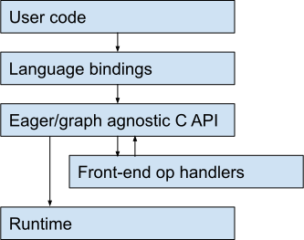

# Front-end op handlers

| Status        | Proposed       |
:-------------- |:---------------------------------------------------- |
| **RFC #**     | [NNN](https://github.com/tensorflow/community/pull/NNN) (update when you have community PR #)|
| **Author(s)** | Allen Lavoie (allenl@google.com), Ashish Agarwal (agarwal@google.com), Peng Wang (wangpeng@google.com), Alexandre Passos (apassos@google.com) |
| **Sponsor**   | Alexandre Passos (apassos@google.com)  |
| **Updated**   | 2020-08-05                                           |

## Summary

This document proposes _op handlers_ which serve as a unified mechanism for defining transformations like `tf.GradientTape`, `tf.vectorized_map`, parallel execution, and graph optimizations.

The document illustrates how these manifest to the user (as scopes), and discusses common concerns like compositionality, handling of state / stateful operations and lifetime management. Detailed design of different handlers is out of scope of this document.


## Motivation

1.x TensorFlow programs were a flat graph, and they were relatively easy to transform. We now have [eager execution and tf.function](https://github.com/tensorflow/community/blob/master/rfcs/20180918-functions-not-sessions-20.md), which make transformations more difficult to specify.


### Make existing APIs more consistent

TensorFlow has a collection of transformations that should compose seamlessly and work consistently when executing eagerly and when building a `tf.function`. Examples include gradients, forward-mode autodiff, vectorized map, and parallel execution. Since we do not currently have a framework for writing transformations, we are either left with gaps in our APIs (a degraded user experience when using distribution APIs with eager execution, no eager vectorized map) or many independent re-implementations of logic for jumping into and out of functions (e.g. both reverse- and forward-mode autodiff have complicated special cases in the `tf.function` code and still don’t compose very well with control flow).


### Make it easier to add new transformations

Since specifying a transformation correctly is difficult and ad-hoc, we don’t have a way to write plugins for them that live outside the main TensorFlow codebase. For example there’s no way to create an eager-friendly version of [gradient checkpointing](https://github.com/cybertronai/gradient-checkpointing) (we have `tf.recompute_grad` where the user says what to recompute, but gradient checkpointing requires recursively recomputing). Providing external developers this kind of flexibility means we need to be able to write the transformations in our core API in terms of a plugin mechanism.


### Goals


*   Transformations work more consistently across eager execution and graph building
*   Transformations are available in languages other than Python
*   Provide the flexibility needed to implement `GradientTape`, `vectorized_map`, a parallel handler, forward-mode autodiff, and a Mesh TensorFlow-style handler.
*   (Eventually) A stable public API for third-party transformations
    *   This RFC will not lock in a concrete C API. We’ll start with an experimental API and write `GradientTape` and other transformations using it, with a second RFC once we’re confident we know what the API should look like. This RFC attempts to capture the necessary behaviors. The [relationship to existing prototype](#relationship-to-existing-prototype) section has links to C APIs which are close to what we’ll eventually want.


### Non-goals


*   Identify implementations of particular transformations or their APIs. Some transformations may need their own design reviews.
*   Replace TFRT op handlers. Front-end op handlers integrate with front-end APIs like gradients, `print`, `.numpy()`/resolve, etc.; TFRT op handlers are for integrating with the runtime and are implemented in terms of TFRT APIs.
*   Make runtime changes. Front-end op handlers will be processed in the C API layer.
*   Provide a framework for implementing graph rewrites/optimizations. Defining such transformations as handlers allows them to be composed, e.g. alternating autodiff and constant folding/arithmetic optimization, but the graph transformations themselves have no special support and are best done with compiler infrastructure like MLIR.


### Existing transformations which could be op handlers

This list is not exhaustive, but is intended to give a sense of the benefits of having a framework for transformations and the required flexibility.


#### Transformations with special cases in the tf.function implementation


*   `tf.GradientTape`
*   `tf.autodiff.ForwardAccumulator`
*   Automatic control dependencies
*   (Possible, see [discussion topic](#tracing-as-a-handler)) function graph building


#### Transformations which are currently graph-only


*   `tf.vectorized_map`
*   Parallelism (MirroredStrategy has limited eager support, TPUStrategy has none)
*   Layout optimization (NHWC / NCHW switching depending on hardware type)


#### Other transformations useful as building blocks


*   Asynchronous execution (`tf.experimental.async_scope`); an added benefit is that async as an op handler can hide overheads from other op handlers by being the outer transformation.
*   Shape inference
*   Physical device string merging can be coerced into an op handler implementation for consistency
*   Graph/Grappler optimizations, e.g. constant folding on function bodies.
*   Tracing eager operations and “LazyTensor”-like setups where subgraphs are accumulated, optimized, and then executed once a request is made


#### Other APIs implementable with op handlers


*   [op\_callback](https://github.com/tensorflow/tensorflow/blob/442c7015fce8889fac11f415f20d43e0576520a3/tensorflow/python/framework/op_callbacks.py#L25) and TensorFlow debugger (tfdbg)
*   Numeric checking (inf/NaN) / `tf.compat.v1.add_check_numerics_ops`


### Things that would be a poor fit phrased as front-end op handlers


*   Physical devices; these need lower-level interactions with the runtime and to work with remote execution, and would not compose with other handlers
*   New datatypes or other features with per-kernel interactions
*   Heavy integration with language bindings isn’t impossible, but structured communication that isn’t purely tensors/op attributes is quite awkward and has no special support.


## Proposal

Op handlers will plug into TensorFlow’s [public C APIs](https://github.com/tensorflow/community/blob/master/rfcs/20191203-single-eager-graph-path.md), intercepting and transforming operations destined either for eager execution or for inclusion in a graph.



The handlers themselves are written to use public C APIs while implementing hooks. These hooks (e.g. triggered by and wrapping `TF_ExecuteOperation`) are defined by function pointers when the handler is registered.

Handlers are triggered by placing operations on them as we place operations on physical devices today (but using `tf.handler` in place of `tf.device`), or by interacting with tensors already placed on them (e.g. copy-off, resolve).

Handlers have a _handler state_ and a _tensor representation_. The handler is responsible for defining these representations, and from TensorFlow’s perspective they are opaque (`void*`), analogous to the opaque nature of tensors placed on accelerators (from the host’s perspective). When implementing hooks, handlers have access to both their handler state and the representations of any relevant tensors (e.g. the inputs to `TF_ExecuteOperation`).

From the perspective of a user executing ops on a handler those executions conform to the same contracts as any other op execution: they take and return tensors which satisfy the registered OpDef and shape function for the given op. The handler is free to implement seemingly-standard execution by using other ops/shapes/dtypes or no ops at all.

For example forward-mode autodiff might have a tensor representation which contains the primal and its tangent (i.e. a struct with two C API tensors), and a trivial handler state. The execution hook would run the regular computation on the primal tensor and look up a Jacobian-vector product function to run on the tangent.

Backprop might have a trivial tensor representation but store a tape in its handler state. Its execution hook would forward computation as-is, holding references to some tensors in its handler state. When the user requests gradients it would choose gradient functions to run based on that stored tape.


### Available hooks

While execution is the most obvious hook handlers will implement, others are necessary to allow handlers implementation flexibility.


*   Execute ([sketch](#execution-hook-sketch)). Includes implementing `CopyOn`/`CopyOnGrad` and `CopyOff`/`CopyOffGrad`, see [Copies and their gradients](#copies-and-their-gradients). May include handler-specific operations, see [Handler-specific operations](#handler-specific-operations).
*   [Merge with another handler](#composition--stacking-op-handlers), creating a new handler state which will be registered with the inner handler’s type.
*   Delete: when registered, handlers will come with a pre-packaged `void*` state which the `TFE_Context` creates references to. Handler states will be reference counted and deleted when the count drops to zero (in general eager training loops may allocate new handlers every iteration, e.g. a `GradientTape`).
*   Shape methods to implement `tensor.shape`/`TFE_TensorHandleDim` and [avoid blocking waiting for remote TFE\_TensorHandles to be ready](#location-of-handlers-for-distributed-computation).
*   A way to implement/forward `tf.get_static_value`, i.e. optionally provide a static ndarray for a tensor. This is used for short-circuiting in gradient functions. For example a parallel op handler might check that all of a tensor’s components have the same static value, and if so return that.
*   A way to indicate which ops require a [copy operation](#copies-and-their-gradients). For example a pack operation on a parallel handler would want to avoid copy-ons, or a `GradientTape`’s watch operation.

`TFE_TensorHandleResolve` and `.numpy()` will be implemented by first running `CopyOff` to the host device, but if there is a use-case (a handler which wants to implement resolve but not general copy-offs) it could instead be its own hook. Other hooks may be added over time with default implementations.

Some hooks provide optional but nice-to-have interface enhancements:


*   Tensor debug string (e.g. to handle Python’s `__repr__`). This may require adding a C API for fetching a tensor’s debug string and using that from Python (rather than combining it with copy-off as we do now).
*   Handler debug string for identifying handlers in error messages.
*   A way to specify what is displayed in `tensor.device` in Python and the equivalent property in other languages; some handlers will want to forward this to the next handler in the stack (e.g. `GradientTape`) to preserve existing behavior and allow the physical device to be inspected. Others like a parallel handler will not have a single physical device to specify, and may use their handler identifier.


### Composition / stacking op handlers

Since op handlers each override execution, their composition with each other isn’t trivial. Consider `tf.GradientTape` and two other handlers:


```python
x = tf.constant(...)
with ParallelHandler("GPU:0", "GPU:1") as parallel:
  with TraceAndExecute() as trace:
    with tf.GradientTape() as tape:
      tape.watch(x)
      y = tf.sin(x)
tape.gradient(y, x)
```


Existing semantics have `tape` watching `tf.sin`. This means that `tf.sin` needs to call the execute hook from `GradientTape`’s op handler. But the op and its gradient should run on the tracing handler and the parallel handler, so `GradientTape`’s execute hook needs to know where to place them.

To support these use-cases handlers will define a merge operation, taking their handler state and a second handler to execute on and producing a new handler state (a second `void*`; any memory sharing is up to the handler implementation). The merged handler will have its own identity, so `with tf.handler(other_op.handler):` will run ops on the same stack of handlers `other_op` ran on (see [Re-entering a merged handler stack, gradient function placement](#re-entering-a-merged-handler-stack-gradient-function-placement) for details).

When handler scopes are opened the two outermost handlers are repeatedly merged until only one remains, the inner scope handler executing on the outer. This means that the scope that was entered last determines the handler that sees an op execution first, and handlers from outer scopes see executions transformed by handlers nested inside them. This is how `GradientTape`/`tf.autodiff.ForwardAccumulator` nest today.

In the `GradientTape` example above, first the parallel and tracing handler are merged, and then the `GradientTape` handler is merged with the combined handler. `y.handler` points to this merge of all three handlers, while the `GradientTape` itself executes ops on the merge of only the two outer handlers.


### Op handlers inside functions and control flow

Handlers need the flexibility to implement their transformations inside and outside of functions. This section describes the likely needs of several handlers and how those can be addressed across `tf.function` boundaries.


#### Three types of interactions with functions

Handlers will interact with functions in three ways: while the user’s code is executed to trace a function, as a replay before function execution (cached), and optionally by intercepting function call operations themselves.


##### During tracing

While tracing a function, ops placed on an op handler will trigger that op handler as an intermediate step before adding to the underlying graph (since the handler is written in terms of [the eager/graph agnostic C API](https://github.com/tensorflow/community/blob/master/rfcs/20191203-single-eager-graph-path.md), it can handle either seamlessly). Values captured from outside the function will be signaled by a `FunctionInput(exterior_tensor) -> interior_tensor` operation running on the op handler for `exterior_tensor`. As with other operations, op handlers can add their own `FunctionInput`s in response. The initial trace will not have return values or non-capture inputs specified; it is presented at this point so handlers can operate purely inside the graph (e.g. calling `tape.gradient` while tracing) or perform shape-inference-like checking.


```python
@tf.function(input_signature=[tf.TensorSpec(shape=[], dtype=tf.float32)])
def trace_time_handler(x):
  with tf.GradientTape() as tape:
    tape.watch(x)
    y = 2. * x
  # The gradient handler runs at trace time, adding ops to the function
  # body. After constant folding the function body will just have
  # `tf.constant(2.)`.
  return tape.gradient(y, x)

# The handler runs at trace time
concrete = trace_time_handler.get_concrete_function()

# The handler is not involved once the trace is complete.
concrete(tf.constant(3.))
```


##### Replay before function execution

When running a function call operation with handler inputs the traced function body will be replayed into a new function. For inputs to the function (captured or otherwise) there is a `FunctionInput` operation which may run on an op handler, as during tracing. This replay may place new ops in the body of the function onto op handlers if one of their inputs is from an op handler ([type-based dispatch](#placement-of-ops-on-handlers)).

Since the function has a call operation at this point handlers also see returns. `FunctionOutput(interior_tensor) -> exterior_tensor` operations add function outputs, and as with arguments op handlers may intercept and add their own.

A function’s replay will be cached based on a handler-determined cache key and equality operator computed on each exterior function input. Cached replays will still trigger `FunctionInput` and `FunctionOutput` operations, with different exterior tensors specified each time the function is called. For two calls of the same function, handlers must reemit intercepted `FunctionInput` and `FunctionOutput` operations in the same order if the equality operator matches for all of the inputs (since the cached function has a fixed signature).

Since replay caching cannot hold on to tensors themselves from previous function calls, handlers will need to emit summary objects, with equality defined between summary objects and the current tensor inputs. Two handlers with the same summary function pointer (e.g. two `GradientTape` objects from different training iterations) may re-use cached function replays; how they share information about the trace is left to the handler implementation.

For example a `GradientTape` handler might cache based on whether or not it is watching a particular input: if it watches a function’s inputs in the same pattern, it can use the symbolic function output’s metadata to look up the appropriate pre-computed backward function for the exterior tensors. When it sees a `FunctionOutput` operation, it triggers `FunctionOutput` operations for tensors in the function body required by the backward function (e.g. all of the tensors in the function body it has a reference to).


```python
@tf.function(input_signature=[tf.TensorSpec(shape=[], dtype=tf.float32)])
def no_handler(x):
  y = 2. * x
  return y

# Handlers are not involved in tracing this function
concrete = no_handler.get_concrete_function()

with tf.GradientTape() as tape:
  a = tf.constant(3.)
  tape.watch(a)
  # The handler re-interprets the function with the argument watched, adding
  # side outputs to the original call.
  b = concrete(a)
# The handler emits a second function call which contains gradient functions
# chained together.
tape.gradient(b, a)
```


Handlers opened outside a `tf.function` call like this will not be active while tracing the function. They are instead presented with the function body during replay. This will behave the same way the handlers would have if no `tf.function` intervened: the handlers surrounding the function call operation will still see operations processed first by the handlers in the function body like they would have in a single merged stack. The advantage is that functions require fewer retracings and can be safely stored in SavedModels without special-casing.

The danger of not inheriting the outer handler stack while tracing a tf.function is that more code becomes trace-unsafe. For example a function that closure-captured a handler object active around its call operation and interacted with it would behave differently than it would without the `tf.function` boundary, and inspecting the stack of handlers would give different results. We will attempt to provide good error messages in such cases.


##### Transforming full function call operations

Reinterpretation takes one multi-device function instantiation containing ops placed on handlers (due to call-site handler scopes or input placements) and produces a second multi-device function without op handlers, and likewise trace-time op handlers operate op-by-op. At no point does an op handler have a chance to intercept the call operation. Access to the eager function call operation is quite powerful: a parallel op handler which runs eager operations in multiple threads would be forced to duplicate graph nodes (or use a special graph replication primitive) in an op-by-op function replay scheme, but if given access to the call operation could treat function calls more or less like any other operation.

During tracing and op-by-op replay, handlers will have the option to mark a node for delayed processing. All of the nodes marked this way for each op handler will be separated from the rest of the function (inserting `Send` and `Recv` nodes as necessary). Each op handler which marked nodes for delayed processing will then see its own section of the function as a call operation. For nested function calls op handlers may repeatedly delay processing until they see an eager function call operation.

Handlers which delay processing would also delay processing for any outer handlers they are expected to execute on. This would interfere with trace-time interaction: `tape.gradient` would still work if implemented as an op which runs on the tape handler, but e.g. fetching a `TraceAndExecute` handler’s trace without going through an op would not. This is a good reason to limit interaction with handlers to ops.

Since they contain `Send` and `Recv` nodes (and so may block waiting for each other), eager function call operations for functions partitioned in this way will be run in parallel from multiple threads.


```python
@tf.function
def delayed_handlers():
  z = tf.constant(3.) ** 2.
  parallel_gpu = ParallelHandler(["GPU:0", "GPU:1"])
  parallel_cpu = ParallelHandler(["CPU:0", "CPU:1", "CPU:2"])
  with parallel_gpu:
    x = tf.ones([]) * z
  with parallel_cpu:
    y = tf.ones([]) * z
  return x, y

# Handlers operate op-by-op during tracing, but may delay processing. If so
# they end up as annotations in `concrete.as_graph_def()`.
concrete = no_handler.get_concrete_function()

# First partitioned into three functions (compute `z`, run `x * z`, run `y *
# z`), two of which go through a whole-function transformation and then have
# their call operations run in parallel by their handlers.
#
# The function computing `z` sends its tensor only twice based on the original
# partitioning (once to each other function), so the parallel handlers need to
# receive it only once and then broadcast it (e.g. with a collective).
x_out, y_out = concrete()
parallel_gpu.unpack(x_out)  # [Tensor(9.), Tensor(9.)] both on GPUs
parallel_cpu.unpack(y_out)  # 3 * [Tensor(9.)] all on CPUs
```


#### Control flow

Like regular functions, op handlers are active during the tracing and replay of `func`-type inputs to control flow operations, and possibly active for the control flow operations themselves.

Inputs to an `If` are created with `IfInput(exterior) -> (true_interior, false_interior)` ops, analogous to `FunctionInput`, and `IfOutput(interior_true, interior_false) -> exterior`, analogous to `FunctionOutput`. `Case`’s inputs are similarly constructed with `CaseInput(exterior) -> branch_interior: List[Tensor]`. If the condition boolean input to a cond is placed on an op handler, the handler sees the `If` op itself.

Inputs to `While` are created with `WhileInput(exterior) -> (condition_placeholder, body_placeholder)` and outputs with `WhileOutput(body) -> exterior`.

In general every control flow construct (any op with a `func`-type input) will need its own input and output indicators. These allow op handlers to intercept and expand control flow, and not least would allow a `GradientTape` handler to construct corresponding gradient control flow while still operating op-by-op.

Otherwise the `func`-type arguments to control flow constructs are replayed just like the bodies of function call operations.

If the condition of an `If` or any op in the condition of a `While` is placed on an op handler after replay (requiring partitioning) then the whole control flow op is placed on that handler and its body/condition may not have delayed-processing ops placed on other op handlers. This only affects handlers which delay processing to see call operations: the body of the control flow construct may have been generated by other op handlers which disappeared during replay.


#### Relationship to SavedModels

Handlers which are active during tracing, e.g. a `tf.GradientTape` whose `gradient` method is called while tracing, will generally add ops placed on physical devices (or with no assigned placement) to functions which will appear in SavedModels.

Handlers which rely on reinterpreting functions do not appear in function bodies: functions are instead placed onto handlers when executed. This means existing SavedModels can be loaded and run on an op handler, and that handlers do not need to persist for a SavedModel to make sense.

If a handler is active during tracing but delays processing in order to transform the function call operation, e.g. a run-in-parallel op handler used inside a function, it will appear in function bodies. This will initially be an error on save, which fits with existing advice to save inference-style functions and apply transformations on load (e.g. a hypothetical distribution strategy which uses a run-in-parallel handler generally would not want to save traced replication anyway). Given a strong use-case handlers could be serialized in order to relax this constraint.


## Risks


*   Reinterpreting graphs is incompatible with 1.x-style control flow (switch/merge). Handlers will not be able to process cyclic graphs. While we support this kind of control flow (including from SavedModels) we also need to support the existing implementations of API endpoints.
*   Handlers will not be usable from any language until the language binding wraps the [eager/graph agnostic C API](https://github.com/tensorflow/community/blob/master/rfcs/20191203-single-eager-graph-path.md). This is currently planned for Python.
*   Third-party extensions are [dependent on TF’s Python bindings migrating to use libtensorflow.so](#third-party-op-handlers-and-dynamic-linking).
*   Getting handlers to compose with non-handler transformations will be tricky in many cases. For example moving backprop without forwardprop would break their nesting (currently Python manages a stack of both). If we decide to use handlers we should use them for all of our transformations.


## Detailed design

Op handlers are a simple concept: a hook to transform op executions. There are subtleties around gradients, memory, and registration which this section explores in detail.


### Placement of ops on handlers

Since handlers maintain their own tensor representations, they put some constraints on where ops can run.


#### Placement policy

Without an explicit placement, a non-function op with an input placed on an op handler will be placed on that op handler, unless another input is placed on a different op handler, which is an error. For functions, partitioning may fail for the same reason (inputs from multiple op handlers feed directly into the same op).


##### Alternatives considered

_See the discussion topic [Placement: type-based dispatch vs. scope-only](#placement-type-based-dispatch-vs-scope-only)_

For the case of inputs from two or more handlers, implicitly inserting a copy-off for one of the handlers is an alternative to throwing an error, but is likely surprising and error-prone.

For inputs from one handler and one or more physical devices, the alternatives to forcing the op onto that handler are to throw an error or insert a handler copy-off, since a physical device will not be able to use the black-box input from an op handler. Most op handlers will be able to handle the implicit copy-on from a physical device since they simply wrap tensors.


#### Copies and their gradients

Copying a tensor onto a handler may involve a broadcast or other linear operation. For example a parallel handler duplicates a value for each component device. Such operations need a forward operation and gradient defined, which will be `CopyOn(input: Tensor) -> Tensor` and `CopyOnGrad(dcopied: Tensor, original_device: String attribute) -> Tensor`. For example:


```python
a = tf.constant(2.)
with ParallelHandler(
    ["cpu:0", "cpu:1"]) as parallel:  # tape sees un-replicated operations
  with tf.GradientTape() as tape:
    tape.watch(a)  # When CopyOn runs for `a`, watch it
    b = tf.fill(dims=[], value=3.)
    tape.watch(b)
    c = a * b  # broadcast `a` by running CopyOn
    first_c = parallel.unpack(c)[0]  # gradient uses pack
a_grad, b_grad = tape.gradient(first_c, [a, b])  # uses the forward op placements
assert a.handler == a_grad.handler  # CopyOnGrad sums off `parallel`
print(a_grad)  # <tf.Tensor: shape=(), dtype=float32, numpy=3.0>
print(b_grad)  # <tf.Tensor: [...] ParallelValue({"cpu:0": 2., "cpu:1": 2.})>
```


For a parallel handler, `CopyOn` would duplicate the tensor for each device and `CopyOnGrad` would sum the parallel tensor’s gradients (`AddN`).

The gradient of `CopyOnGrad` is defined to be `CopyOn` in order to support higher-order gradients, which constrains `CopyOn` to be a linear mapping. For many handlers these operations are trivial: for example the `GradientTape` would conceptually use `Identity` for both.

Similarly some handlers may implement `CopyOff(handler_tensor: Tensor, new_device: String attribute) -> Tensor`. Its gradient is `CopyOffGrad` (same signature as `CopyOn`) and the gradient of `CopyOffGrad` is `CopyOff`. Some handlers (e.g. a parallel handler) may choose to instead throw an error to disable copy-offs. For handlers which implement both, `CopyOff` and `CopyOnGrad` should be identical, as should `CopyOffGrad` and `CopyOn`; keeping them separate just allows handlers to implement one without the other.

Copies may be elided with a similar mirroring scheme to the one used for physical device tensors, caching the target tensor based on its source tensor and destination. Some handler operations like a parallel handler’s pack operation may be [special-cased in their handler to not use a copy operation on their inputs](#available-hooks).


#### Re-entering a merged handler stack, gradient function placement

Handlers which run computation referencing existing tensors will often want to run the dependent computation on the original handlers. `GradientTape` is a good example:


```python
tape = tf.GradientTape()

with tape:
  w = tf.constant(1.)
  tape.watch(w)
  x = tf.sin(w)

with ParallelHandler(["CPU:0", "CPU:1"]) as parallel:
  with tape:
    y = tf.square(x)
    y0, y1 = parallel.unpack(y)

with tape:
  z = y0 + y1

tape.gradient(z, w)
```


Roughly the sequence of forward-pass operations is:


```python
w = tf.constant(1.)  # CPU:0
x = Sin(w)  # CPU:0
x_parallel = CopyOn(x)  # parallel
y = Square(x_parallel)  # parallel
y0, y1 = ParallelUnpack(y)  # parallel
z = Add(y0, y1)  # CPU:0
```


And the backward pass, assuming the tape colocates backward-pass operations with their corresponding ops in the forward pass (which may be optional):


```python
with tf.handler(z.handler):  # CPU:0
  z_grad = Ones([])
with tf.handler(y0.handler):  # CPU:0
  y0_grad, y1_grad = AddGrad(z_grad)
with tf.handler(y.handler):  # parallel
  y_grad = ParallelUnpackGrad([y0_grad, y1_grad])
with tf.handler(x_parallel.handler):  # parallel
  x_parallel_grad = SquareGrad(x, y_grad)
with tf.handler(x_parallel.handler):  # parallel
  x_grad = CopyOnGrad(x_parallel_grad, original_device="CPU:0")
with tf.handler(w.handler):  # CPU:0
  w_grad = SinGrad(w, x_grad)
```


This becomes more complicated when the derived computation is executed on new handlers:


```python
tape = tf.GradientTape()

with ParallelHandler(["CPU:0", "CPU:1"]) as parallel:
  with tape:
    x = tf.constant(1.)
    tape.watch(x)
    y = tf.square(x)

with RecordAndExecute() as trace:
  tape.gradient(y, x)
```


The natural extension of the first example from the tape’s perspective is to run the following:


```python
with RecordAndExecute() as trace:
  with tf.handler(y.handler):
    y_grad = Ones([])
  with tf.handler(x.handler):
    x_grad = SquareGrad(x, y_grad)
```


If this required first copying off `parallel` and then copying onto the merge of `parallel` with `trace`, it would throw an exception because the parallel handler can’t implement copy-off. The error can be avoided if `parallel` is instead allowed to copy `x`’s components onto `trace` directly.

To support this, `CopyOn(previous_handler_tensor)` runs on `new_handler` in order to transfer `previous_handler_tensor` to `new_handler`. Handlers may recognize their own tensors from a previous merge and copy them over directly. If `previous_handler_tensor` propagates to the bottom of the execution stack and `CopyOn(previous_handler_tensor)` runs on a physical device, it is implemented by running `CopyOff(previous_handler_tensor, new_device=physical_device)` on `previous_handler` (which propagates through the handler stack the tensor was produced on).

If handlers recognize their own tensors in `CopyOn` and if the new stack contains the previous stack as a subsequence then copying off the previous stack explicitly is not required.

Re-opening a previously merged stack inside an existing handler stack re-opens the previous stack handlers in their original order one by one inside the existing stack. If opening a handler scope would create a duplicate (because the existing stack already had the handler) it is skipped.

This means re-entering a handler stack while already inside it does nothing:


```python
with ParallelHandler(["CPU:0", "CPU:1"]) as parallel:
  with tape:
    x = tf.constant(1.)
    tape.watch(x)
    y = tf.square(x)

  # tf.handler(y.handler) just checks that `parallel` is already active
  tape.gradient(y, x)
```


#### “Final” handlers, reordering

Physical device specifications are incompatible with further op handlers executing (i.e. merging an inner physical device to execute on an outer handler doesn’t make sense). But we want code like the following to preserve existing semantics:


```python
with tf.GradientTape() as tape:
  with tf.device("CPU"):
    x = tf.constant(...)
    tape.watch(x)
    # [...]
```


This is not only a problem for physical devices. Some handlers will be difficult to support well when executing on other transformations, e.g. a parallel handler with many devices multiplying the overhead of recording gradients. Others may not be able to call another handler, e.g. a handler providing an interface to runtime functionality.

Physical devices may be represented as op handlers anywhere in the stack, but their effect will naturally accumulate in the context at the bottom of the execution stack, which will maintain a “current” physical device. Since outer handlers run later they should be careful to respect the placements requested by inner handlers rather than overriding them.

For other handlers, limited re-ordering may be added if necessary.

`tensor.device` in Python will continue to reflect only physical devices for some handlers, which preserves its current meaning while transformations like `GradientTape` are implemented as op handlers. This will be up to the handlers; see [necessary hooks](#available-hooks).


### Memory management


#### Handler and tensor lifetimes

Tensors placed on a handler have a reference to that handler and will keep it alive. Merged handlers also have references to the handlers they were merged from.

A handler keeping a reference to one of its own tensors would create a reference cycle. Handlers will naturally keep references to tensors from the next handler in the execution stack instead: a `GradientTape` maintaining a tape in its handler state might represent tensors with a `TapeTensor` struct owning a reference to the `TF_TensorHandle` being tracked, and this `TapeTensor` struct might be the tape’s `TF_TensorHandle` representation (cast to `void*` from TensorFlow’s perspective). The tape has no reason to hold on to the outer `TF_TensorHandle` rather than using the `TapeTensor` struct directly.


#### Placement of resource handles

Resource-dtype tensors are typically persistent, lasting multiple training iterations. They may be placed on a stack of handlers, and if so, may be copied on and off like any other tensor. Since a variable placed on a merged handler will have a reference to that handler stack, transient handlers may choose not to return a handler tensor for ops producing resource handles (instead returning a tensor placed on the next handler in the execution stack).


```python
v = None
for training_iteration in range(10):
  with tf.GradientTape() as tape:
    if v is None:
      # It would be unfortunate if the iteration-zero tape were kept alive by `v`.
      v = tf.Variable(1.)
    y = (v - 2.) ** 2.
  v.assign_sub(0.1 * tape.gradient(y, v))
```


In this case the resource tensor will be copied onto the handler when it is an input to an op (e.g. `ReadVariableOp`). Other handlers will want to handle resource-dtype tensor placement like any other tensor, maintaining ownership of the variable’s memory:


```python
v = None
with ParallelHandler(["CPU:0", "CPU:1"]) as parallel:
  for training_iteration in range(10):
    if v is None:
      v = tf.Variable(1.)
    v.assign_add(0.1)
  # Reading from a parallel variable yields a parallel tensor
  parallel.unpack(v.read_value())

with tf.device("CPU:0"):
  # Attempt to copy the parallel resource handle off the parallel handler, which
  # is an error (since there are 2 handles).
  tf.raw_ops.ReadVariableOp(resource=v.handle, dtype=v.dtype)
```


Handlers are free to throw errors to disallow copying handles on or off. The Python `tf.Variable` object will run `DestroyResourceOp` on the handler the output of the `VarHandleOp` was placed on to free the backing buffer (which need not be the handler the op ran on).

Placing a variable on a stack of handlers where the inner handler(s) take ownership of the resource tensor will keep any outer handlers alive for the lifetime of the variable.


### Registering handlers

Handler infrastructure is much more “framework” than “library”, so their functionality is tied to the [available hooks](#available-hooks). This proposal does not include a specific C API for registering handlers, which will have its own RFC.


#### Handler-specific operations

Handler functionality that takes or returns tensors will be registered like any other op, but possibly without corresponding kernels. These may be relatively simple, like `unpack` for a parallel handler, or quite complicated like `tape.gradient`. Using ops means we do not need  a separate mechanism for language bindings to wrap and unwrap tensors (e.g. the C type &lt;-> EagerTensor for Python) and third-party op handlers can use the existing custom op infrastructure.


#### Naming / representation

To fit in the existing device naming scheme, handlers will be named `/device:handler_type:index`. The job/replica/etc. fields will be specified at registration (allowing handlers to look like remote physical devices, useful for specifying computation that will run in another environment), but will typically indicate the coordinator. Each [merged handler](#composition--stacking-op-handlers) will have its own device index, taking the inner handler’s type/job/replica.

When registered handlers will specify their device string without an index, and a handler state (`void*`). The registration API will indicate the newly registered handler’s index. Multiple handlers may be registered with the same type (e.g. two `GradientTape` instances); the fact that handlers can have different type names (rather than a generic `/device:HANDLER:index`) is mostly for debugging.

The expectation is that device strings for a particular handler are mostly hidden from users; they will show up in `op.handler` properties, but will be specified through wrapper APIs like `tf.GradientTape`. Opening a `tf.handler` scope manually with an op handler specified should be unnecessary. To avoid repeated string parsing, such objects may keep a reference to the handler they registered and specify it directly rather than through a device string.


#### Location of handlers for distributed computation

Handlers execute on the coordinator. At the moment there are no plans for remote front-end op handlers, although handlers are free to use runtime functionality directly, in which case they may simply provide front-end access to more efficient distributed execution (a parallel handler is a likely candidate for this treatment, dealing with things like gradients but deferring efficient batch execution to the runtime).

This means handlers should be written not to block waiting for remote tensor handles to be ready. Since handlers often wrap other tensors in their tensor representations, they should be able to create wrapper tensors (`TFE_NewTensorHandleFromDeviceMemory` today) without requiring exact shapes, instead deferring exact shape computation to hooks on demand (e.g. a hook to implement `TFE_TensorHandleNumDims`).


#### Execution hook sketch

As an example, a parallel handler which executes every operation on multiple devices might have an execution hook that looks something like the following sketch. A pointer to this function would be passed as part of the handler’s registration.

_Note: the exact APIs are not part of this RFC and may change significantly; see [Relationship to existing prototype](#relationship-to-existing-prototype) for links to a complete prototype on the eager C APIs, which are similar to the eager/graph agnostic C APIs used here._


```cpp
// Similar arguments as TF_Execute
void parallel_execution_hook(TF_AbstractOp* op, int num_inputs,
                             TF_AbstractTensor* const* inputs, TF_OutputList* o,
                             void* handler_state, TF_Status* s) {
  // Fetch the handler state, cast it from void*
  ParallelHandlerState* handler_state =
      reinterpret_cast<ParallelHandlerState*>(handler_state);

  switch (TF_AbstractOpGetOpTypeAsEnum(op)) {
    case TF_OP_TYPE_COPY_ON:
      // Handle copy-on: broadcast a tensor
      return;
    case TF_OP_TYPE_COPY_OFF:
      // Handle copy-off, just returning a bad status for ParallelHandler.
      return;
    // ... other special-cased ops
    case default:
  }
  // General case, ParallelHandler runs ops in parallel

  // First cast the input tensors to the ParallelHandler's tensor representation
  std::vector<ParallelTensor*> typed_inputs;
  typed_inputs.reserve(num_inputs);
  for (int input_index = 0; input_index < num_inputs; ++input_index) {
    if (TF_AbstractTensorGetHandler(inputs[input_index]) !=
        handler_state->registered_handler) {
      // Bad status: the input should always already be on the handler unless
      // this is a copy operation.
      return;
    }
    typed_inputs.push_back(reinterpret_cast<ParallelTensor*>(
        // Fetch the handler's tensor representation as a void*
        TF_TensorHandleDevicePointer(inputs[input_index], s)));
    if (TF_GetCode(s) != TF_OK) return;
  }

  std::vector<std::unique_ptr<ParallelTensor>> outputs;
  for (int handler_index = 0;
       handler_index < handler_state->underlying_handlers.size();
       ++handler_index) {
    // Run one op per underlying handler, transferring attributes from `op` and
    // inputs from the components of parallel tensors in `typed_inputs` to new
    // `TF_Execute` calls.
    //
    // Results are collated into `outputs`.
  }
  for (int output_index = 0; output_index < outputs.size(); ++output_index) {
    TF_DataType output_dtype = outputs[output_index]->dtype();
    void* untyped_output = static_cast<void*>(outputs[output_index].release());
    TF_OutputListPushBack(
        o, TF_NewTensorHandleFromDeviceMemory(
               TF_AbstractOpGetContext(op), untyped_output, output_dtype,
               deallocator_callback, shape_callback, s));
    if (TF_GetCode(s) != TF_OK) return;
  }
}
```


#### Third-party op handlers and dynamic linking

Op handlers will be specified using a C API for eventual ABI stability.

Currently Python uses its own version of the C API folded into a larger shared object (`_pywrap_tensorflow_internal.so`). Third-party extensions which affect Python would be possible only if Python instead linked against the public `libtensorflow.so` for its use of the C API, since op handlers need to link against the same C API symbols their caller is using. In the short term TF-internal transformations can be linked into the Python shared object.

Making third-party op handler support useful will require an end-to-end guide, from creating, building, and linking the handler to wrapping it in Python. The [custom op guide](https://www.tensorflow.org/guide/create_op) is a good template.


### Relationship to existing prototype

Named “custom devices”, we have several transformations including a [parallel device](https://github.com/tensorflow/tensorflow/blob/2ec0214b48878b94763c4f41e095b4579d78b58f/tensorflow/c/eager/parallel_device/parallel_device.h#L26-L60) on top of an [eager-only experimental C API](https://github.com/tensorflow/tensorflow/blob/2ec0214b48878b94763c4f41e095b4579d78b58f/tensorflow/c/eager/c_api_experimental.h#L457-L520). The parallel device includes [Python bindings](https://github.com/tensorflow/tensorflow/blob/2ec0214b48878b94763c4f41e095b4579d78b58f/tensorflow/python/distribute/parallel_device/parallel_device_test.py#L265-L288) (with no public API at the moment).

In contrast, the proposed front-end op handler support will handle functions (in part by migrating to the eager/graph agnostic C API), composition of handlers, and gradients of copy-on/copy-off. As in the existing prototype handlers will need to take a representation of an operation including its attributes; this may require small additions to the eager/graph agnostic API itself.


## Questions / Discussion Topics


### Tracing as a handler

Should graph building also be represented as a handler? As-is the proposal assumes that `TF_Execute` eventually ends in a physical device which is either traced or executed eagerly depending on how it is configured. We could instead represent tracing as a trace-and-forward handler with an optional dead-end handler to prevent ops from executing eagerly. This would provide some flexibility for tracing at different levels of the handler stack, and would allow a hybrid execute+trace mode that we do not currently support.


### Placement: type-based dispatch vs. scope-only

The [placement section](#placement-of-ops-on-handlers) indicates type-based dispatch: ops with inputs on a handler will be placed on that handler unless there is another explicit placement.

An alternative is to insert a copy-off operation and never run ops on handlers unless their scope is active:


```python
p = ParallelHander(["GPU:0", "GPU:1"])
x = tf.constant(1.)
with p:
  y = x * 2.  # copy on to the parallel handler
z = y * 2.  # placed on p, or triggers a copy-off (an error for a parallel handler)
```


The behavior when a second scope is opened explicitly is more clear:


```python
p = ParallelHander(["GPU:0", "GPU:1"])
x = tf.constant(1.)
with p:
  y = x * 2.  # copy on to the parallel handler
with tf.device("CPU:0"):
  z = y * 2.  # triggers a copy-off (an error for a parallel handler)
```


If we eventually want type-based dispatch for physical devices too, starting handlers out with that behavior might be a good idea. If we never want to do type-based dispatch for physical devices then having it for handlers may be confusing.

Variables placed on handlers are a weird case for scope-only placement; are variables placed on the handler unusable outside the scope, or do resource tensors have a special case?


### Access to eager function call operations

An alternative to the partitioning described in [Transforming full function call operations](#transforming-full-function-call-operations) is to throw an error when handlers which would need this access are used inside a `tf.function`.


```python
@tf.function
def f():
  with ParallelHander(["GPU:0", "GPU:1"]) as p:  # error
    #[...]

with ParallelHander(["GPU:0", "GPU:1"]) as p:
  g()  # Calling a function under a parallel handler is OK
```


This would avoid the partitioning step and simplify handler infrastructure, but would prevent a `ParallelHandler`-based `tf.distribute` `strategy.run` from working inside a `tf.function`, which is the current suggested usage. This could complicate migrations significantly.
