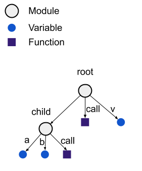
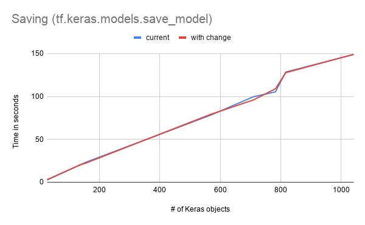
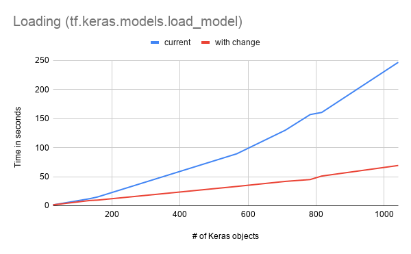

# Keras SavedModel Update

| Status        | Proposed                                             |
:-------------- |:---------------------------------------------------- |
| **RFC #**     | [281](https://github.com/tensorflow/community/pull/281)|
| **Author(s)** | Kathy Wu (kathywu@google.com)                        |
| **Sponsor**   | Karmel Allison (karmel@google.com)                   |
| **Updated**   | 2020-08-19                                           |
| **Obsoletes** | Obsoletes some of the implementation details in [20190509-keras-saved-model.md](https://github.com/tensorflow/community/blob/master/rfcs/20190509-keras-saved-model.md)          |

## Objective

The goal of this proposal is to separate core SavedModel and Keras Model serialization. 
By doing so, Keras will only rely on external API when saving and loading models from the
SavedModel format. This allows us to define what the process of serializing and
deserializing high-level objects should be, in clear and unconvoluted terms. 

This document does not solve existing problems in the Keras model serialization, such as dealing with shared 
variables between layers.

This document introduces a change that may impact some users. Please see the [Breaking Changes](#breaking-changes) section for details.

## Motivation

The integration between core SavedModel serialization and serialization of Keras models is interwoven to an extreme, so that the implementation is hard to understand and replicate. Besides the issue of maintainability, this also raises the question of whether it is possible to write serialization frameworks for high-level TensorFlow libraries utilizing SavedModel without in-depth knowledge about SavedModel and access to internal TensorFlow APIs. Thus this proposal contains the changes needed for the separation of the core SavedModel serialization and Keras model serialization.

### Why separate core vs high-level serialization?
The core SavedModel saver builds an [`SavedObjectGraph`](https://github.com/tensorflow/tensorflow/blob/r2.3/tensorflow/core/protobuf/saved_object_graph.proto#L24) that stores the metadata and connectivity information of every object connected to the root. When loading, this data is used to recreate every object and reattach the edges between each object. This is sufficient when saving and loading `tf.Modules`, `tf.Variables` and `tf.function`s. However, from the experience of implementing serialization and deserialization for Keras layers, using the metadata and children to load a high-level object isn't so simple.

In the Keras library, there are predefined layers and model networks, which can be serialized with a config object. When loading a layer using the config, both the layer and its weights are created. This introduces some delicate concerns:
* Layers objects must be loaded in different ways depending on whether there is a config or not (custom vs predefined layer)
* Layer objects must be loaded first, since loading from the config may cause the creation of other nodes in the ObjectGraph.
* Functional and Sequential models must be loaded after the layers, to reconnect the model layer network.
* Any objects *not* created during the above steps should still be loaded. Meaning all objects created by a config must be tracked.
* Dealing with shared objects that can be created by multiple constructors raises lots of complications.

Thus, introducing a new deserializer API that addresses all these concerns is likely to be complicated and clunky. The core SavedModel API should focus on a single task -- that is saving/loading an object graph with low-level objects. Having a solid base API makes it easier to define serialization for high-level frameworks.

### What should high-level serialization look like?
High level libraries should utilize the core tf.saved_model.save and tf.saved_model.load functions to save and load the TensorFlow object graph and functions. Anything that is not saved or loaded by the core functions should be saved and loaded separately by the library. 

The functions `_list_functions_for_serialization` and `_list_extra_dependencies_for_serialization` can be used to extend the saved TensorFlow object graph. For example, the `variables` attribute in Keras layers is a dynamically calculated property, so is not technically part of the object graph. The `variables` attribute can be added by overriding `_list_extra_dependencies_for_serialization`.


## Design Proposal

To separate Keras from core SavedModel serialization, the following changes are proposed:

1. (breaking) Remove Keras Metadata from the SavedModel proto. More details in [Keras Metadata](#keras-metadata)
2. Add a `LoadOption` that allows users to specify specific nodes to load. More details in [Loading specific nodes](#loading-specific-nodes)
3. Make the [Trackable](https://github.com/tensorflow/tensorflow/blob/r2.3/tensorflow/python/training/tracking/base.py#L530)
`_list_functions_for_serialization` and `_list_extra_dependencies_for_serialization` functions
public. These attributes are used to extend the object graph serialized in the SavedModel.
4. Have `tf.saved_model.save` return an ordered list of nodes saved to the SavedModel object 
graph. This is used to write the Keras metadata file.

### Keras metadata
The metadata stored in each node in the `SavedObjectGraph` in the SavedModel proto will be moved to a separate `keras_metadata.pb` file in the same directory. 

Specs:
```
KerasMetadata [
  KerasObject {
    int node_id, 
    string node_path, 
    string identifier, 
    string metadata
  },
  ...
]
```
The node ID and node path are used to identify the Keras objects (layers, models, metrics) in the SavedModel. 

### Loading specific nodes
To load specific nodes in the `SavedObjectGraph`, add a `nodes_to_load` load option. This option takes a list or dictionary of node paths. A node path is a string containing the path from the root object to the child object. The loader will load all of the specified nodes and all recursive descendants.

When `nodes_to_load` is a dictionary, the values can be None or an already initialized object. The loader will take care of creating all nodes which have None as the value, and connecting the nodes to their children.

The loader returns a dictionary mapping all node paths to the created nodes.

**Example**

Say that the following object is saved as a SavedModel:



Some valid node paths are: `root.v`, `root.child`, `root.child.call`.

When loading with `LoadOptions(nodes_to_load=["root.child"])`, the loader will return a dict `{"root.child": UserObject}`. The object will have the `a`, `b`, and `call` attributes.

Alternatively, say the user has already created the `child` object, with the `a` variable but no `b` variable:
```
child_obj = tf.Module()
a_var = child_obj.a = tf.Variable(5.)
tf.saved_model.load(
    path, 
    options=tf.saved_model.LoadOptions(
        nodes_to_load={"root.child": child_obj}))
print(a_var is child_obj.a)  # True
print(child_obj.b)  # tf.Variable
```
The loader will create the b variable but will not overwrite the a variable.

### Updated Keras Serialization
To summarize, Keras SavedModels will be produced and loaded following these steps:

*Saving*

1. Call the core SavedModel saver to save the TensorFlow object graph and tf.functions.
2. Write a `keras.metadata` file to the directory, containing data for all Keras object nodes.

*Loading*

1. Read the `keras.metadata` file (or metadata from the SavedModel proto if the file is not present).
2. Create all Keras objects. If the config is available for an object, call the Keras layer deserializer. If the config is not available, then create a RevivedLayer object.
3. Call the core SavedModel loader using the `nodes_to_load` option. The loader will not overwrite the already-created objects and variables.

#### Benchmarks
With the modified implementation, saving takes a bit more time in order to generate the Keras metadata file, while loading is a lot faster. These measurements are taken from the Keras applications SavedModel benchmarks.




### Alternatives Considered
An alternative that was long considered was having the user register serializer and deserializer functions to each class that should be specially handled during SavedModel serialization and deserialization. However, this idea was put to rest due to the recursive nature of the TensorFlow object graph and the complicated issues [mentioned above](#why-separate-core-vs-high-level-serialization).

### Breaking changes
`tf.saved_model.save` will no longer save the metadata added to Keras models. With this, only the Keras `model.save` function will create SavedModels that are compatible with the Keras model loader `tf.keras.models.load_model`. When using the core loader (`tf.saved_model.load`), an object with specific endpoints is loaded. Please see the Keras SavedModel RFC for the list of all attributes that are stored: https://github.com/k-w-w/community/blob/master/rfcs/20190509-keras-saved-model.md#serialization-details

| Saver  | Loader |  |
| ---- | ---- | ---- | 
| `tf.saved_model.save` | `tf.saved_model.load` | No change |
| `tf.keras.models.save_model` | `tf.saved_model.load` | No change |
| `tf.saved_model.save` | `tf.keras.models.load_model` | **Error** |
| `tf.keras.models.save_model` | `tf.keras.models.load_model` | No change |


#### TF Hub compatibility
This does not break TensorFlow Hub compatibility, because the library uses the core loader `tf.saved_model.load`, which does not rely on the Keras metadata. TF Hub uses attributes (e.g. variables, call_and_return_conditional_losses) that are part of the extended object graph, which is automatically saved and loaded with core SavedModel functions. 

#### Metadata removal schedule

There will be an adjustment period where `tf.saved_model.save` still produces SavedModels that are compatible with the Keras model loader, but will raise a deprecation notice when either saving or loading. 

These changes will be announced pending the RFC approval to relevant user mailing lists.

##### Part 1 [tf 2.4]

*Saving changes*

1. Start saving `keras.metadata` file to the SavedModel directory. 
2. Add temporary deprecation notice when saving a Keras model with `tf.saved_model.save`.

*Loading changes* 

3. Adjust the Keras SavedModel loader to read from the `keras.metadata` file. 
4. Add permanent deprecation notice when loading a Keras model with the metadata saved in the SavedModel proto.
5. Error out when using the Keras model loader to load SavedModels without any Keras objects.

*Misc*

6. Announce deprecation and breaking change to mailing lists.
7. Modify tutorials that mention `tf.saved_model.save` and `model.save` are equivalent.

##### Part 2 [Tf 2.5]

*Saving changes*

1. Remove metadata from SavedModel proto.
2. Remove deprecation notice when saving Keras model with `tf.saved_model.save`.

## Questions and Discussion Topics

- Better name for `nodes_to_load`?

