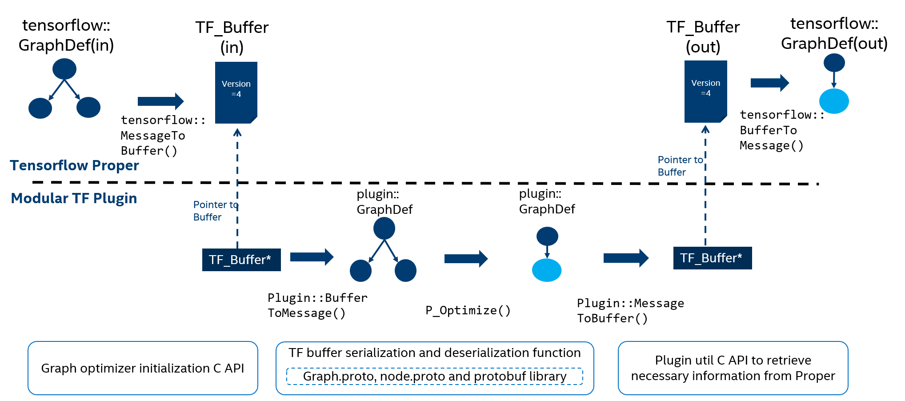
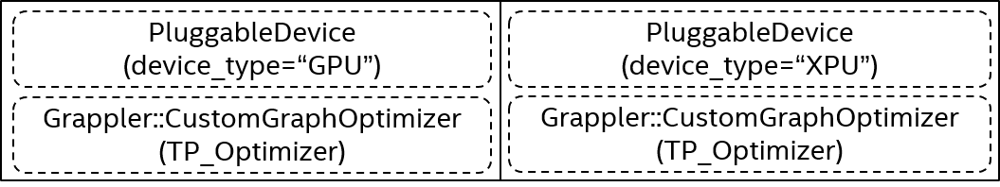
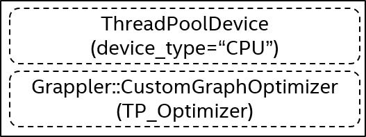
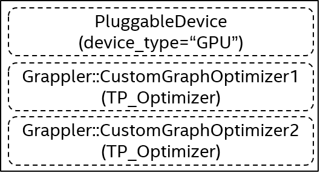

# Modular TensorFlow Graph C API

| Status        | Proposed                                             |
:-------------- |:---------------------------------------------------- |
| **RFC #**     | [318](https://github.com/tensorflow/community/pull/318)|
| **Author(s)** | Yang Sheng (yang.sheng@intel.com), Zhoulong Jiang (zhoulong.jiang@intel.com), Yiqiang Li (yiqiang.li@intel.com),  Eric Lin (eric.lin@intel.com), Jianhui Li (jian.hui.li@intel.com) |
| **Sponsor**   | Eugene Zhulenev (ezhulenev@google.com)                  |
| **Updated**   | 2020-10-27                                           |

## **Objective**

TensorFlow currently provides a C++ API for registering a custom graph optimizer in [Grappler](https://www.tensorflow.org/guide/graph_optimization). This project aims to create a modular/plugin-based TensorFlow implementation with C APIs. Plugins will be able to register custom graph optimizers. Users only need to install the plugin in a specified directory, and the mechanism is able to discover and plug in the capabilities offered by the plugin.

This RFC is based on the Modular TensorFlow [RFC](https://github.com/tensorflow/community/blob/master/rfcs/20190305-modular-tensorflow.md), which aims at extending the TensorFlow design to plug in capabilities like adding a new graph optimizer.

## **Motivation**

When extending TensorFlow to support a graph optimizer, one needs to inherit a new optimizer from `CustomGraphOptimizer`. However, there are no ABI-stable APIs provided. 
Modular TensorFlow RFC designs a plugin architecture for several TensorFlow components(`Networking`, `Filesystems`, `Kernel`, `Graph` and `Accelerator backends`) through a stable ABI. This RFC describes the `Graph` module in the TensorFlow proper side, by introducing pluggable custom graph optimizer to the TensorFlow Grappler classes.
The pluggable graph optimizer discovery and initialization is transparent to end users. As long as the graph plugin libraries follow the design described in this RFC, it can be plugged to TensorFlow proper and add a new graph optimizer into TensorFlow Grappler.

Caveat:
- The proposed C API in its current form will not be compatible with the new TensorFlow runtime ([TFRT](https://blog.tensorflow.org/2020/04/tfrt-new-tensorflow-runtime.html)) and graph compiler.
  1. The nature and order of passes in the new compiler will differ significantly, probably allowing only limited reuse of algorithms or patterns from plugins developed for the existing runtime.
  2. The graph compiler will not communicate with the plugin using a GraphDef based format, but some TBD format, likely based on serialized [MLIR](https://www.tensorflow.org/mlir).
- Execution order. Plugin optimizers will be registered at the end of Grappler’s meta-optimizer. Plugin authors should be aware of the restrictions of their pass running at this specific point in the execution pipeline.


## **User Benefit**

This RFC provides a plugin infrastructure for TensorFlow to optimize graph with new custom optimizers, as long as users set up the system properly installing the graph plugin.

## **Design Proposal**

### Design Overview

This RFC is intended to provide a new mechanism for custom graph optimizers, along with C APIs for users to implement and register their own plugable graph optimizers in Grappler.
The C APIs follows current implementation C++ API, [TF_Buffer](https://github.com/tensorflow/tensorflow/blob/r2.3/tensorflow/c/c_api.h#L109-L113) and related proto files are the interface between proper and plugin.
When initializing, TensorFlow loads the plugin and registers a new graph optimizer into Grappler. In the [Optimize](https://github.com/tensorflow/tensorflow/blob/r2.3/tensorflow/core/grappler/optimizers/graph_optimizer.h#L58) function, plugin authors need to deserialize `TF_Buffer` to `plugin::GraphDef` object to do some graph transformations, and serialize the optimized `plugin::GraphDef` object back to `TF_Buffer` as output.

<p align="center">
 
</p> 

### Struct/Function/Object Overview
- Struct
  - Struct that should be filled by the plugin: `TP_OptimizerConfigs`, `TP_Optimizer`, `TP_OptimizerRegistrationParams`
  - Struct that should be filled by the proper: `TF_GrapplerItem`, `TF_GraphProperties`, `TF_FunctionLibraryDefinition`
- Function
  - Function that should be implemented by plugin:
    - Creation/Deletion/Optimization function of optimizer.
    - `plugin::MessageToBuffer`, `plugin::BufferToMessage`: Serialization/Deserialization of objects generated by protobuf.
    - `TF_InitGraphPlugin`: Optimizer registration.
    - (Optional)Internal util functions for graph transformation.
- Object:
  - Object defined in plugin: [Object](#proto) generated by protobuf

### Usage Overview

* **Graph Optimizer function**

  Graph [Optimize](https://github.com/tensorflow/tensorflow/blob/r2.3/tensorflow/core/grappler/optimizers/graph_optimizer.h#L58) function is the main part that plugin authors need to implement. The C API looks like below. Both input and output graphs are represented by serialized `TF_Buffer` objects:
  ```cpp
  void P_Optimize(void* optimizer, TF_Buffer* graph_buf, TF_Buffer* optimized_graph_buf, TF_Status* s);
  ```

* **Registration**
  1. Core TensorFlow links to plugin's dynamic library and loads the function `TF_InitGraphPlugin`.
  2. In `TF_InitGraphPlugin`, plugin populates `TP_OptimizerRegistrationParams`, including `TP_OptimizerConfigs` and `TP_Optimizer`.

* **TF_Buffer and protobuf class**

  Grappler uses `GraphDef` to represent a graph and operations. It is a C++ object and is generated by protobuf toolchain with a predefined structure in graph.proto. `TF_Buffer` is a C struct representing a pointer to a block of data and its associated length, thus it can be used as a serialized protobuf object across the C API.
   
  In plugin side, plugin authors should first deserialize `TF_Buffer` into a `plugin::GraphDef` object, and then transform the graph. To successfully deserialize the buffer, plugin authors must keep a copy of `graph.proto` in plugin, and make it exactly the same as that in proper side, along with all other proto files which help to build a graph. Here lists all files needed and objects generated:<a id="proto"></a>
  - [attr_value.proto](https://github.com/tensorflow/tensorflow/blob/r2.3/tensorflow/core/framework/attr_value.proto): AttrValue, NameAttrList 
  - [cost_graph.proto](https://github.com/tensorflow/tensorflow/blob/r2.3/tensorflow/core/framework/cost_graph.proto): CostGraphDef
  - [function.proto](https://github.com/tensorflow/tensorflow/blob/r2.3/tensorflow/core/framework/function.proto): FunctionDefLibrary, FunctionDef, GradientDef
  - [graph.proto](https://github.com/tensorflow/tensorflow/blob/r2.3/tensorflow/core/framework/graph.proto): GraphDef
  - [node_def.proto](https://github.com/tensorflow/tensorflow/blob/r2.3/tensorflow/core/framework/node_def.proto): NodeDef
  - [op_def.proto](https://github.com/tensorflow/tensorflow/blob/r2.3/tensorflow/core/framework/op_def.proto): OpDef, OpDeprecation, OpList
  - [op_performance_data.proto](https://github.com/tensorflow/tensorflow/blob/r2.3/tensorflow/core/grappler/costs/op_performance_data.proto): SessionInfo, OpInfo, NormalDistribution, LogNormalDistribution, OpPerformance, OpPerformanceList
  - [resource_handle.proto](https://github.com/tensorflow/tensorflow/blob/r2.3/tensorflow/core/framework/resource_handle.proto): ResourceHandleProto
  - [tensor.proto](https://github.com/tensorflow/tensorflow/blob/r2.3/tensorflow/core/framework/tensor.proto): TensorProto, VariantTensorDataProto
  - [tensor_shape.proto](https://github.com/tensorflow/tensorflow/blob/r2.3/tensorflow/core/framework/tensor_shape.proto): TensorShapeProto
  - [types.proto](https://github.com/tensorflow/tensorflow/blob/r2.3/tensorflow/core/framework/types.proto): DataType, SpecializedType
  - [versions.proto](https://github.com/tensorflow/tensorflow/blob/r2.3/tensorflow/core/framework/versions.proto): VersionDef

  After optimizing, plugin authors need to serialize the optimized `GraphDef` object into `TF_Buffer` as output.

  Serialization function `tensorflow::MessageToBuffer` is already defined, desearization function `tensorflow::BufferToMessage` will be added in proper to convert plugin passed `TF_Buffer` back to proper's `GraphDef`. In plugin side, plugin authors need to define `plugin::MessageToBuffer` and `plugin::BufferToMessage`, which should be the same as those defined in proper, except the namespace of protobuf. To be noticed, these two are internal defined functions, they are not a part of C API interface.

  Proper:
  ```cpp
  Status tensorflow::MessageToBuffer(const tensorflow::protobuf::MessageLite& in, TF_Buffer* out);
  Status tensorflow::BufferToMessage(const TF_Buffer* in, tensorflow::protobuf::MessageLite& out);
  ```

  Plugin:
  ```cpp
  Status plugin::MessageToBuffer(const plugin::protobuf::MessageLite& in, TF_Buffer* out);
  Status plugin::BufferToMessage(const TF_Buffer* in, plugin::protobuf::MessageLite& out);
  ```

* **Plugin util C API**

  Plugin util C API provides additional structs to help retrieve necessary graph information:
  - `TF_GrapplerItem` represents a combination of a graph, and some more information about feed/fetch nodes, reserved nodes.
  - `TF_GraphProperties` can be used to infer OpInfo::TensorProperties, typical use case is to infer tensor shapes.
  - `TF_FunctionLibraryDefinition` maintains a map between op names and op definitions, typical use case is to look up an OpDef by op name, and then get some op attributes.

* **Internal util functions**

  TensorFlow proper provides a series of functions to help modify graphs more conveniently in [core/grappler/utils](https://github.com/tensorflow/tensorflow/tree/r2.3/tensorflow/core/grappler/utils) folder. Since creating C APIs for these functions is very messy, they would not be included in C APIs. Plugin authors can manually copy this part into plugin side, or they can write their own util functions.

### Supported User Scenarios

This section describes user scenarios for plugin graph optimizer.

* **Supported scenario**: Each plugin can register its own graph optimizer.

  Plugin graph optimizer is targeting backend device specific optimization. Proper should fully control the behaviour of plugin, plugin can register its own graph optimizer, and optimizers with other device types are not allowed. TensorFlow proper would run plugin optimizer if graph device type and registered device type are matched.

  <p align="center">
    
  </p> 

* **Supported scenario**: Registering graph optimizer without pluggable device.

  <p align="center">
    
  </p>

* **Unsupported scenario**: Plugin can not register multiple graph optimizers.

  To simplify multiple optimizers coordination and avoid optimization conflict, multiple optimizers cannot register to the same device type. If more than one optimizer is registered to the same device type, these optimizers's initialization would fail due to registration conflict. Users need to manually select which optimizer they want to use by unloading the conflicting plugin.
  <p align="center">
    
  </p>

### Front-end python use case

Flag `use_plugin_optimizers` is provided for front-end python users to turn on/off the plugin graph optimizers.
```python
## TF-1.x
>> from tensorflow.core.protobuf import rewriter_config_pb2
>> config = tf.compat.v1.ConfigProto()
>> config.graph_options.rewrite_options.use_plugin_optimizers = rewriter_config_pb2.RewriterConfig.OFF
## TF-2.x
>> tf.config.optimizer.set_experimental_options({"use_plugin_optimizers", False})
```

This API can be used to:
* Turn on/off all registered plugin graph optimizers. By default, the registered optimizers are turned on if they are successfully registered, users can turn off them. If the registered optimizers are turned on and the graph device type is matched with registered device type, they would be runnning.
* Use recommended configuration of existing optimizers.
  If pluggable graph optimizer is registered to a device type, e.g., GPU, plugin authors can provide a recommended configuration indicate whether some of existing optimizers in proper can be turned on/off, by populating flags in `TP_OptimizerConfigs`. If user turns on the optimizer, the recommended configuration is automatically applied. Otherwise user-set configuration is used.

  ```cpp
  void TF_InitGraphPlugin(TP_OptimizerRegistrationParams* params, TF_Status* status) {
    // Plugin authors can turn on/off some optimizers.
    params->configs->remapping = TF_TriState_Off;
    params->configs->auto_mixed_precision = TF_TriState_On;
    // ...
  }
  ```

  When multiple plugins are successfully registered and running for a graph, their recommended configurations may differ with each other. If any of the config has turned off the optimizer, the optimizer will be disabled. The following table lists all possible scenarios. In the table, plugin's config is represented by tristates, `ON` means turn on optimizer, `OFF` means turn off optimzier, and `DEFAULT` means uses proper's config.

  | Proper's config | Plugin1's config | Plugin2's config  | Final config | Notes|
  |:-------------- |:-------------- |:-------------- |:-------------- |:-------------- |
  | ON    | ON/DEFAULT | ON/DEFAULT | **ON**| The optimizer is enabled. |
  | ON    | OFF | OFF | **OFF**| The optimizer is disabled, unless users manually unload the plugin. Grappler prints warnings to remind users that config has been changed based on plugin's config.|
  | ON    | ON/DEFAULT | OFF | **OFF**| The optimizer is disabled if at least one plugin turns off it. Grappler prints warnings to remind users that config has been changed based on plugin's config, and potention performance regression may happen due to the conflict configs.|
  | ON    | OFF | ON/DEFAULT | **OFF**| Same as previous scenario.|
  | OFF   | ON/DEFAULT/OFF | ON/DEFAULT/OFF | **OFF**| The optimizer is always disabled when user turns off it. |

### Versioning Strategy and Stability

* **Graph C API**

  Version strategy of Graph C API follows Semantic Versioning 2.0.0 ([semver](http://semver.org/)). Each release version has a format `MAJOR.MINOR.PATCH`, as outlined in [TensorFlow version compatibility](https://www.tensorflow.org/guide/versions#semantic_versioning_20). Struct size is used to track compatibility. More details can be found in [StreamExecutor C API Versioning Strategy RFC](https://github.com/tensorflow/community/blob/master/rfcs/20200612-stream-executor-c-api/C_API_versioning_strategy.md)

* **GraphDef**

  The compatibility of `GraphDef` between plugin and proper is guaranteed by protobuf library.

### Detailed C APIs

* **Graph optimizer initialization**

  ```cpp
  #ifdef __cplusplus
  extern "C" {
  #endif

  // TF_TriState is the C API typedef for tri-state.
  typedef enum TF_TriState {
    TF_TriState_Default = 0,
    TF_TriState_Off,
    TF_TriState_On,
  } TF_TriState;

  // Flags indicating whether existing optimizers should be turned on/off.
  // It's optional for plugin to set functions to return true/false. If not
  // set, proper uses configuration set by user.
  typedef struct TP_OptimizerConfigs {
    size_t struct_size;
    void* ext;  // reserved for future use
    TF_TriState disable_model_pruning;
    TF_TriState implementation_selector;
    TF_TriState function_optimization;
    TF_TriState common_subgraph_elimination;
    TF_TriState arithmetic_optimization;
    TF_TriState debug_stripper;
    TF_TriState constant_folding;
    TF_TriState shape_optimization;
    TF_TriState auto_mixed_precision;
    TF_TriState auto_mixed_precision_mkl;
    TF_TriState pin_to_host_optimization;
    TF_TriState arithmetic_optimization;
    TF_TriState layout_optimizer;
    TF_TriState remapping;
    TF_TriState loop_optimization;
    TF_TriState dependency_optimization;
    TF_TriState memory_optimization;
    TF_TriState auto_parallel;
    TF_TriState scoped_allocator_optimization;
  } TP_OptimizerConfigs;

  #define TP_OPTIMIZER_CONFIGS_STRUCT_SIZE \
    TF_OFFSET_OF_END(TP_OptimizerConfigs, scoped_allocator_optimization)

  // Struct for Optimizer. Plugin authors must provide an optimize function.
  // Creation and deletion functions are optional.
  typedef struct TP_Optimizer {
    size_t struct_size;
    void* ext;  // reserved for future use
    void* (*create_func)();
    void (*optimize_func)(void*, TF_Buffer*, TF_Buffer*);
    void (*destory_func)(void*);
  } TP_Optimizer;

  #define TP_OPTIMIZER_STRUCT_SIZE \
    TF_OFFSET_OF_END(TP_Optimizer, destory_func)

  typedef struct TP_OptimizerRegistrationParams {
    size_t struct_size;
    void* ext;  // reserved for future use

    int32_t major_version;
    int32_t minor_version;
    int32_t patch_version;

    // device_type optimizer is registered.
    const char* device_type;
    TP_OptimizerConfigs* configs;
    TP_Optimizer* optimizer;
  } TP_OptimizerRegistrationParams;

  #define TP_OPTIMIZER_REGISTRARION_PARAMS_STRUCT_SIZE \
    TF_OFFSET_OF_END(TP_OptimizerRegistrationParams, optimizer)

  void TF_InitGraphPlugin(TP_OptimizerRegistrationParams* params, TF_Status* status);

  #ifdef __cplusplus
  }  // extern "C"
  #endif
  ```

* **Plugin util C API**

  ```cpp
  #ifdef __cplusplus
  extern "C" {
  #endif

  // TF_GrapplerItem represents a combination of a graph, one of more fetch nodes,
  // and potentially a set of nodes to feed.
  typedef struct TF_GrapplerItem TF_GrapplerItem;

  // Get TF_GrapplerItem from TF_Buffer.
  TF_GrapplerItem* TF_GetGrapplerItem(TF_Buffer* buffer);

  // Get a set of node names that must be preserved. They can not be transformed
  // or removed during the graph transformation. This includes feed and fetch
  // nodes, keep_ops, init_ops. Fills in `num_values` and `storage_size`, they
  // will be used in `TF_GetNodesToPreserveList`.
  void TF_GetNodesToPreserveSize(TF_GrapplerItem* item, int* num_values,
                                 int* storage_size);

  // Get a set of node names that must be preserved. They can not be transformed
  // or removed during the graph transformation. This includes feed and fetch
  // nodes, keep_ops, init_ops. Fills in `values` and `lengths`, each of which
  // must point to an array of length at least `num_values`.
  //
  // The elements of values will point to addresses in `storage` which must be at
  // least `storage_size` bytes in length.  `num_values` and `storage` can be
  // obtained from TF_GetNodesToPreserveSize
  //
  // Fails if storage_size is too small to hold the requested number of strings.
  void TF_GetNodesToPreserveList(TF_GrapplerItem* item, void** values,
                                 size_t* lengths, int num_values, void* storage,
                                 size_t storage_size, TF_Status* status);

  // Get a set of node names for fetch nodes. Fills in `values` and `lengths`,
  // they will be used in `TF_GetFetchNodesList`
  void TF_GetFetchNodesSize(TF_GrapplerItem* item, int* num_values, int* storage_size);


  // Get a set of node names for fetch nodes. Fills in `values` and `lengths`,
  // each of which must point to an array of length at least `num_values`.
  //
  // The elements of values will point to addresses in `storage` which must be at
  // least `storage_size` bytes in length.  `num_values` and `storage` can be
  // obtained from TF_GetFetchNodesSize
  //
  // Fails if storage_size is too small to hold the requested number of strings.
  void TF_GetFetchNodesList(TF_GrapplerItem* item, void** values, size_t* lengths,
                            int num_values, void* storage, size_t storage_size,
                            TF_Status* status);

  // Infer OpInfo::TensorProperties for graph nodes inputs/outputs.
  //
  // Typical use case, is to infer tensor properties from a graph, before doing
  // optimization pass. Nodes modified during optimization pass have to be
  // invalidated, to prevent further incorrect optimizations based on wrong shape
  // and data type properties.
  typedef struct TF_GraphProperties TF_GraphProperties;

  // Create GraphProperties. The item must outlive the properties.
  TF_GraphProperties* TF_NewGraphProperties(TF_GrapplerItem* item);

  // Delete GraphProperties.
  void TF_DeleteGraphProperties(TF_GraphProperties* p);

  // Infer tensor shapes through abstract interpretation.
  // If assume_valid_feeds is true, it can help infer shapes in the fanout of fed
  // nodes. This may cause incorrectness in graph analyses, but is useful for
  // simulation or scheduling.
  // If aggressive_shape_inference is true, nodes are executed on the host to
  // identify output values when possible and does other aggressive strategies.
  // This may cause incorrectness in graph analyses, but is useful for simulation
  // or scheduling.
  // If include_input_tensor_values is true, the values of constant
  // tensors will included in the input properties.
  // If include_output_tensor_values is true, the values of constant tensors will
  // be included in the output properties.
  void TF_InferStatically(TF_GraphProperties* g_prop, TF_Bool assume_valid_feeds,
                          TF_Bool aggressive_shape_inference,
                          TF_Bool include_input_tensor_values,
                          TF_Bool include_output_tensor_values, TF_Status* s);

  // Get the size of input OpInfo::TensorProperties given node name.
  void TF_GetInputPropertiesSize(TF_GraphProperties* g_prop, const char* name,
                                 int* size);

  // Get the size of output OpInfo::TensorProperties given node name.
  void TF_GetOutputPropertiesSize(TF_GraphProperties* g_prop, const char* name,
                                  int* size);

  // Get a list of input OpInfo::TensorProperties given node name.
  // OpInfo::TensorProperties is represented as TF_Buffer*.
  void TF_GetInputPropertiesList(TF_GraphProperties* g_prop, const char* name,
                             TF_Buffer** prop, int size);

  // Get a list of output OpInfo::TensorProperties given node name.
  // OpInfo::TensorProperties is represented as TF_Buffer*.
  void TF_GetOutputPropertiesList(TF_GraphProperties* g_prop, const char* name,
                              TF_Buffer** prop, int size);

  // Helper to maintain a map between function names in a given
  // FunctionDefLibrary and function definitions.
  // Typical use case, is to look up an OpDef by type name.
  typedef struct TF_FunctionLibraryDefinition TF_FunctionLibraryDefinition;

  // Create NewFunctionLibraryDefinition.
  TF_FunctionLibraryDefinition* TF_NewFunctionLibraryDefinition(
      TF_Buffer* graph_buf);

  // Delete NewFunctionLibraryDefinition.
  void TF_DeleteFunctionLibraryDefinition(TF_FunctionLibraryDefinition* f_lib);

  // Shorthand for calling LookUp to get the OpDef from FunctionLibraryDefinition
  // given op name. The returned OpDef is represented by TF_Buffer.
  void TF_LookUpOpDef(TF_FunctionLibraryDefinition* f_lib, const char* name,
                      TF_Buffer* buf, TF_Status* s);

  #ifdef __cplusplus
  }  // extern "C"
  #endif
  ```

### Usage Example
* **Plugin**

  Define creation, optimization, deletion function for custom optimizer.

  ```cpp
  typedef struct PluginOptimizer { ... } PluginOptimizer;

  // Plugin authors must provide an optimize function. Creation and deletion functions are optional.
  static void* P_Create() {
    auto* optimizer = new PluginOptimizer;
    return (void*)optimizer;
  }
  static void P_Destory(void* optimizer) {
    delete static_cast<PluginOptimizer*>(optimizer);
  }
  static void P_Optimize(
      void* optimizer, TF_Buffer* graph_buf,
      TF_Buffer* optimized_graph_buf, TF_Status* s) {
    // 1. Get TF_GrapplerItem from graph_buf(optional)
    TF_GrapplerItem* item = TF_GetGrapplerItem(graph_buf);

    // 2. Deserialize graph_buf into plugin::GraphDef
    plugin::GraphDef graph_def;
    plugin::BufferToMessage(graph_buf, graph_def);

    // 3. Infer shapes(optional)
    TF_GraphProperties g_prop = TF_NewGraphProperties(item);
    TF_InferStatically(g_prop, 0, 0, 0, 0);
    int size;
    TF_GetInputPropertiesSize(g_prop, "node1", &size);
    std::vector<TF_Buffer*> in_prop_buf(size);
    for (int i = 0; i < size; i++) {
      in_prop_buf[i] = TF_NewBuffer();
    }
    TF_GetInputPropertiesList(g_prop, "node1", in_prop_buf.data(), &size);
    plugin::OpInfo::TensorProperties in_prop;
    plugin::BufferToMessage(in_prop_buf, in_prop);
    for (int i = 0; i < size; i++)
      TF_DeleteBuffer(in_prop_buf[i]);

    // 4. Get OpDef(optional)
    TF_FunctionLibraryDefinition* f_lib = TF_NewFunctionLibraryDefinition(graph_buf);
    plugin::OpDef op_def;
    TF_Buffer* op_buf = TF_NewBuffer();
    plugin::NodeDef node_def = graph_def.node(0);
    TF_LookUpOpDef(f_lib, node_def.name(), op_buf);
    plugin::BufferToMessage(op_buf, op_def);
    TF_DeleteBuffer(op_buf);
    plugin::DataType dt = op_def.input_arg(0).type();

    // 5. Transform graph(optional)

    // 6. Serialize output plugin::GraphDef into optimized_graph_buf.
    plugin::MessageToBuffer(graph_def, optimized_graph_buf);
    TF_DeleteGraphProperties(g_prop);
    TF_DeleteFunctionLibraryDefinition(f_lib);
  }
  ```

  Define `TF_InitGraphPlugin` that TensorFlow will call when registering the plugin:

  ```cpp
  void TF_InitGraphPlugin(TP_OptimizerRegistrationParams* params, TF_Status* status) {
    params->device_type = "GPU";
    // Define some flags indicating whether existing optimizers should be turned on/off
    params->configs->remapping = TF_TriState_Off;
    params->configs->auto_mixed_precision = TF_TriState_On;
    // ...
   
    // Set functions to create a new optimizer.
    params->optimizer->create_func = P_Create;
    params->optimizer->optimize_func = P_Optimize;
    params->optimizer->destory_func = P_Destory;
  }
  ```

* **Proper**

  During the plugin library initialization, TensorFlow proper calls `TF_InitGraphPlugin` API (part of Graph C API). It is defined in plugin and plugin authors need to implement it to register a new custom graph optimizer.

  ```cpp
  static Status InitGraphModule(void* dso_handle) {
    void* dso_symbol;
    tensorflow::Env* env = tensorflow::Env::Default();
    env->GetSymbolFromLibrary(dso_handle, "TF_InitGraphPlugin", &dso_symbol).IgnoreError();
   
    using TF_InitGraphPlugin = void(*)(TP_OptimizerRegistrationParams*, TF_Status*);
    auto init_plugin_fn = reinterpret_cast<TF_InitGraphPlugin>(dso_symbol);
   
    TP_OptimizerRegistrationParams params{TP_OPTIMIZER_REGISTRARION_PARAMS_STRUCT_SIZE};
    TP_OptimizerConfigs configs{TP_OPTIMIZER_CONFIGS_STRUCT_SIZE};
    TP_Optimizer optimizer{TP_OPTIMIZER_STRUCT_SIZE};
    params->configs = &configs;
    params->optimizer = &optimizer;

    TF_Status* status = TF_NewStatus();
    init_plugin_fn(&params, status);
    TF_DeleteStatus(status);
  }
  ```

  Optimizers relies on `CCustomGraphOptimizer`, which might look as follows:
  ```cpp
  class CCustomGraphOptimizer : public CustomGraphOptimizer {
   public:
    explicit CCustomGraphOptimizer(
        const char* device_type, TP_Optimizer* optimizer) : optimizer_(optimizer) {
      if (create_func != nullptr) {
        c_optimizer_ = (*create_func)();
      } else {
        c_optimizer_ = nullptr;
      }
    }
    Status Optimize(Cluster* cluster, const GrapplerItem& item, GraphDef* optimized_graph_def) override {
      // Call C optimize_func
    }
   private:
    TP_Optimizer* optimizer_;
    void* c_optimizer_;
  }
  ```

### Testing

Minor TensorFlow releases may break graph optimizations in plugins, since op versions and graph patterns used to implement a particular public TensorFlow python API are not covered by TensorFlow’s compatibility guarantees. Therefore, plugin authors have to test both end to end python tests and golden graphs to ensure that their optimizers work as expected.

### **Alternatives Considered** 

### **Performance Implications**

The roundtrip serialization of protobuf objects is a performance risk, but it should be acceptable since it is only done once per session or concrete function instantiation.

### **Dependencies**

* It depends on third-party library [ProtoBuf](https://developers.google.com/protocol-buffers/)

* It depends on a series of proto files defined in TensorFlow. Plugin authors must keep a copy of those files in plugin.

* It depends on Modular TensorFlow [RFC](https://github.com/tensorflow/community/blob/master/rfcs/20190305-modular-tensorflow.md)

### **Engineering Impact**

* The impact to binary size / startup time / build time / test times are minimum. 

* The TensorFlow team will maintain this code. Graph C API will be packaged along with other C APIs that TensorFlow currently has.

### **Platforms and Environments**

* The pluggable graph mechanism is based on `LoadLibrary()` so it should work on all the platforms supported by `LoadLibrary`. The other enhancement to TensorFlow proper is platform independent.

### **Best Practices**

* This works with Modular TensorFlow which will be the only way to integrate new custome graph optimizers to the current TensorFlow stack.

### **Compatibility**

* The RFC promotes the current TensorFlow ecosystem as it supports plugging new graph optimizers to TensorFlow.

* We don't expect this proposal to impact other parts of the TensorFlow ecosystem. It doesn't support TFLite and the new TensorFlow runtime(TFRT). It should not impede distribution strategies and would not interact with tf.function and SaveModel.
