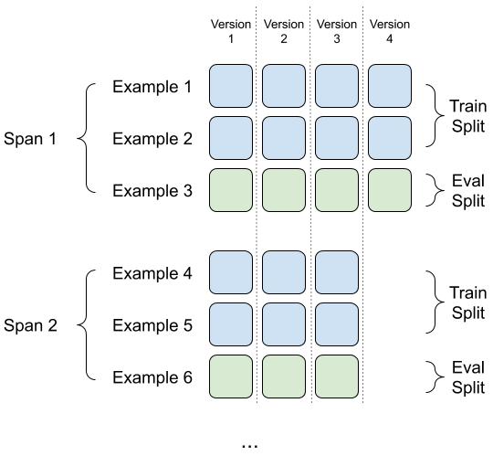
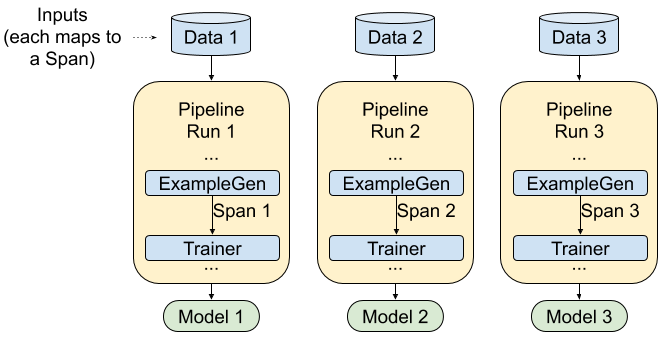
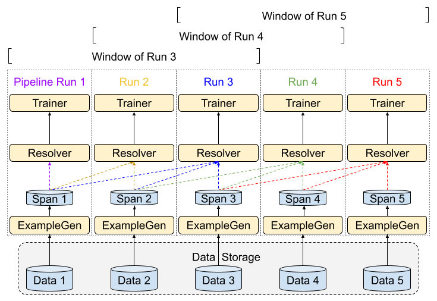
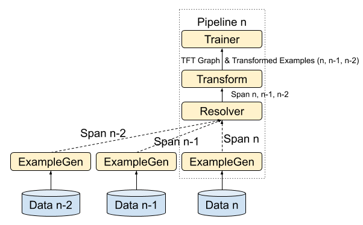
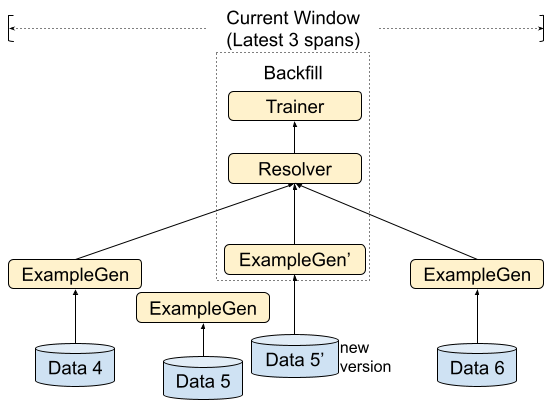

# TFX Periodic Training

Status        | Proposed
:------------ | :--------------------------------------------------------------
**Author(s)** | Jiayi Zhao (jyzhao@google.com), Ruoyu Liu (ruoyu@google.com)
**Sponsor**   | Zhitao Li (zhitaoli@google.com), Mitch Trott (trott@google.com)
**Updated**   | 2021-01-15

## Objective

This doc proposes a periodic batch pipeline for training on regularly arriving
blocks of data. For each new arriving data block, a batch pipeline run is
scheduled for training. In each run, ExampleGen processes and outputs one Span,
which contains the new increment of data. The Resolver is responsible for
retrieving Spans within the rolling window for training. If an older Span needs
to be updated, a new version of the Span is generated by a backfill pipeline run
with specified Span id.

### Goal

*   Propose TFX periodic batch pipeline, which provides basic automation for
    continuously arriving blocks of data, as an extension to current one-shot
    batch pipeline support.
*   Clearly delineate the boundary between automation and manual handling of
    exception cases.
*   Provide explicit versioning of data.

### Non Goal

*   Detailed user interface (component configs) are not included in this
    proposal.
*   This RFC only addresses cases in which processing is naturally divided into
    discrete epochs. Streaming data ingestion and processing is not part of this
    proposal.
*   The discrete epochs of data arrival should be stable (e.g., daily), so that
    exactly one end-to-end synchronous pipeline run can be scheduled for each
    epoch. All other data arrivals are handled by manual exception processing.
*   Garbage collection to prevent unbounded accumulation of artifacts will be
    discussed separately in a follow-up proposal.
*   Backward compatibility will be guaranteed after 1.0: within the same major
    version, the new release of TFX components shall take artifacts produced by
    an older version of TFX, updating TFX library shouldn't break the existing
    workflow.

Periodic batch pipelines are simple to understand and suffice for many
applications. But they also have limitations:

*   Overlapping pipeline runs may cause uncertain behavior, and should be
    guarded against. Details are discussed in the
    [Exception Cases](#exception-cases) section.
*   Automation of exception handling, e.g., for automatic error recovery and
    automatic backfill, is best done using asynchronous and data-driven pipeline
    execution modes, which we do not consider here. See
    [Advanced DSL Semantics RFC](https://github.com/tensorflow/community/blob/master/rfcs/20200601-tfx-udsl-semantics.md)
    instead.

## Background and Motivation

In real-world machine learning tasks, as the distributions of features and
labels shift over time, recent data might be more useful and pertinent than
older data. Thus, depending on the application, we might need to periodically
update the model to fit the new data.

A model trained on continuously arriving data is often based on a sliding-window
of incoming data. For example, new data is generated every day, but the model is
trained based on a rolling 7 days’ data to cover the data pattern of the entire
week. In this doc, we discuss the critical user journey and propose the pipeline
setup for periodically training using TFX on continuously arriving data.

Related requests on TFX Github repo:
[2275](https://github.com/tensorflow/tfx/issues/2275),
[1540](https://github.com/tensorflow/tfx/issues/1540),
[421](https://github.com/tensorflow/tfx/issues/421),
[352](https://github.com/tensorflow/tfx/issues/352),
[210](https://github.com/tensorflow/tfx/issues/210).

## Design Proposal

### Interaction Workflow

The figure above shows the interaction workflow of the proposed TFX periodic
training. It’s based on the current one-shot batch pipeline, but with additional
functionality for updating models based on continuously arriving blocks of data.

*   For normal operation, a periodic scheduling system such as cron initiates
    TFX pipeline runs, which process the new input data and update the model.
*   For exception cases (e.g., a pipeline fault, or processed input data has a
    new version available to fix a data quality issue), users should disable the
    normal schedule logic, ensure existing pipeline runs are finished, then
    manually issue a pipeline run to handle the exception before re-enabling the
    normal pipeline scheduling. We call this pipeline run for handling exception
    cases a <strong>backfill run</strong>.

One goal of this RFC is to provide robust automation for periodic training.
Robust automation should not fail silently. Achieving this depends on the
operating environment. Here are a some potential problems:

*   The periodic scheduling system may fail to trigger or may trigger more than
    once.
*   The TFX pipeline execution may stall and overrun into the next scheduling
    cycle.
*   The TFX pipeline execution may fail (e.g., due to bugs, resource exhaustion,
    missing/late input data, etc.).

There are many ways to guard against these issues. For example, if the periodic
scheduler is a robust service with alerting, one can address TFX pipeline
failures by plumbing the TFX error status back to the periodic scheduler.
Alternatively, one could use an external monitoring system to alert if a model
has not been pushed in a timely manner. Pipeline overruns (Item 2 above) are of
particular concern because they can result in overlapping pipeline executions,
which should be avoided in many cases (see [Exception Cases](#exception-cases)).

Responding to exceptions such as late data is not automated by the TFX periodic
training pipeline. As such, the solution in this RFC is best suited to cases
where new input data is available in a stable way (e.g., daily, weekly). If
greater automation is desired, asynchronous and data-driven pipeline execution
([Advanced DSL Semantics RFC](https://github.com/tensorflow/community/blob/master/rfcs/20200601-tfx-udsl-semantics.md))
can automatically address some of the exception conditions enumerated above.

In the following sections, we introduce the Span and Version concepts in TFX for
continuously arriving blocks of data. Then we describe common scenarios and
discuss how our TFX batch pipeline handles them. ExampleGen’s data selection
logic and exception cases are covered in later sections. Streaming data
ingestion and asynchronous component execution are out of scope for this
proposal. For details, please refer to the [future work](#future-work) section.

### Span and Version

A Span is a grouping of training examples. The semantics of a Span are not
hardcoded into TFX; a Span may correspond to a day of data, an hour of data, or
any other grouping that is meaningful to your task. Spans usually (but not
always) encode partition semantics, which means a training example entry is
present in at most one Span.

Each Span can hold multiple Versions of data. To give an example, if you remove
some examples from a Span to clean up poor quality data, this could result in a
new Version of that Span.

Span and Version are generated by ExampleGen which is the first component of TFX
pipelines. ExampleGen ingests the input data and generates TFX training examples
with Span id and Version id based on the pattern in input config. Note that Span
and Version is a concept of ExampleGen’s output; this information will be
recorded in ML Metadata for lineage tracking.

Consider the following example, in which the input data of the TFX pipeline is
persisted on a filesystem, and there is a one-to-one relationship between input
filesets and Spans/Versions. In the example, each input data block that
corresponds to a Span is stored in a separate directory, and different versions
of an input data block are a subdirectory under it. Assuming the pattern is
`root/day-{SPAN}/attempt{VERSION}/*`, the following shows how ExampleGen’s input
file paths map to ExampleGen’s output Span and Version id:

*   `root/day-1/attempt1/data_1_of_2` maps to Span 1 Version 1
*   `root/day-1/attempt1/data_2_of_2` maps to Span 1 Version 1
*   `root/day-1/attempt2/data_updated` maps to Span 1 Version 2
*   `root/day-2/attempt1/data` maps to Span 2 Version 1

Note that the new generated data Version must have a bigger Version id. On the
other hand, Span id semantics are up to the user: it can be the generation order
(new generated data has bigger id), or the timeline order depends on the data
content instead of generation time (e.g., each Span represents the data of a
certain date). In the latter case, the Span of day 1 might be generated after
the Span of day 2 due to the late arriving of day 1’s raw input data. The latest
Span/Version below refers to the one with the highest id instead of the new
generated one.

For the purposes of this RFC (which is restricted to synchronous pipeline
execution), ExampleGen generates one Span at a time. Normally, ExampleGen picks
up the input data corresponding to the latest Span. However, for this RFC the
recommended configuration for ExampleGen uses an explicitly specified Span id,
which can (for example) be generated automatically from the timestamp of the
periodic run or selected manually for a backfill run. Within a Span, ExampleGen
always picks up the input data corresponding to the latest Version.

Span and Version ids don’t need to be contiguous. For example, you can use only
odd numbers. But for simplicity the following discussion assumes the ids are
contiguous starting from 1.

The following sections focus on the abstract Span concept, but we provide some
examples with concrete Span semantics for better understanding.

### Periodic Training Pipeline

In this section, we discuss how a TFX periodic batch pipeline handles Spans and
Versions. The scenarios we want to support are:

*   Users can update the model to capture newly arrived input data.
*   Users can update the model when previously processed input data is updated.
*   Models can be trained based on the single Span generated in the current
    pipeline run, or based on a rolling window of Spans including Spans
    generated in previous pipeline runs.

The design focuses on the TFX batch pipeline itself; it’s up to users to define
how and when to schedule the batch pipeline for the updated input data.

#### Single Span

If model training only requires a single Span (rolling window size equals to 1),
the setup is simple: TFX pipeline run should be periodically scheduled at the
time that the new input data block is available. ExampleGen will pick up the new
data, and the model will be trained based on the ExampleGen’s output Span.

*For example, assume a Span corresponds to a week of data, and every Monday, the
previous week’s data is finalized. Users can set up a routine TFX pipeline to
run every Wednesday, so that ExampleGen will pick up the previous week’s data
and generate a corresponding output Span for training.*

#### Rolling Window

If model training requires multiple Spans, a
[Resolver](https://github.com/tensorflow/community/blob/master/rfcs/20190828-tfx-resolver.md)
(can access artifacts generated in previous pipeline runs) is used to select a
set of ExampleGen’s output Spans for training. For each pipeline run, ExampleGen
only generates one Span at a time. The Resolver selects a rolling window of
Spans to use as the Trainer’s input data. The Resolver is downstream of
ExampleGen as it depends on ExampleGen’s output
[Channel](https://github.com/tensorflow/tfx/blob/r0.26.0/tfx/types/channel.py),
and it retrieves
[Artifacts](https://github.com/tensorflow/tfx/blob/r0.26.0/docs/guide/understanding_tfx_pipelines.md#artifact)
(each artifact represents a Span) within the rolling window from the Channel by
looking up ML Metadata. Below shows a graph with rolling window size equal to
three Spans:

*For instance, assume we have a model that needs one year’s data for training.
Instead of treating the entire year’s data as a single Span and updating the
model once a year, we can treat each month’s data as the Span with a rolling
window of 12 Spans. Then each month, we can schedule the pipeline to update the
model, e.g., for pipeline runs on May 1st, ExampleGen will process the data of
April and generate a Span, and Resolver will retrieve 12 Spans from last year
May till current April for training.*

Note that the Transform component might contain calculations (e.g., avg) based
on the entire dataset, so if Transform is required in the pipeline with a
rolling window, it should take Resolver’s result. Transform generates one
transform graph artifact for all input Spans and multiple artifacts of
transformed examples, corresponding to each input Span. Trainer only needs to
depend on the outputs of the current pipeline’s Transform component. The graph
would look like below:

To speed up the transformation processing of the rolling window pipeline, we
will enable
[analyzer cache optimization](https://www.tensorflow.org/tfx/transform/api_docs/python/tft_beam/analyzer_cache)
for the Transform component, which will cache certain results of previously
processed Spans. For Trainer, warm-starting can be enabled to continue the
training of an existing model
([Trainer instruction](https://github.com/tensorflow/tfx/blob/r0.26.0/docs/guide/trainer.md#component),
currently supported for
[Estimator](https://www.tensorflow.org/api_docs/python/tf/estimator/Estimator),
while [Keras](https://www.tensorflow.org/guide/keras) is WIP).

#### Version Handling

Sometimes a Span might need correction, for example to remove poor quality data,
to fix a bug, to incorporate updates from a late-arriving data source, or for
compliance (e.g., GDPR). After the corrected input data is available, users need
to perform a backfill run to update the model corresponding to the input data.
At execution time, ExampleGen is configured with the target Span, and will pick
up the input data corresponding to the latest Version of that Span. The rest of
the pipeline will train and update the model based on the new version of data.

*For example, assume a Span corresponds to a week of data, and a periodic
pipeline run is scheduled weekly on Wednesday. The diagram below shows the
timeline of the current week. The pipeline run on Wednesday picks up the version
of last week’s data generated on Tuesday. Another version of that data arrives
on Thursday, and on Friday a decision is made to refresh the model, so a
backfill run is triggered manually which will materialize the latest version of
last week’s data and retrain the current model.*

Backfilling a new Version of a Span that is out of rolling window range is
unnecessary. After ExampleGen generates the latest Version of a Span within the
rolling window, Resolver will retrieve the newest available (i.e., materialized)
Version of each Span in the rolling window for Trainer.

*For example, assume a Span corresponds to a day of data, and we have a Resolver
that resolves the latest 3 days’ Span. On day 6, a model is generated based on
data of day 4 to 6, and then an updated input data of day 5 is available. To
backfill, we rerun the pipeline with specified Span id #5, ExampleGen will
generate the new Version of Span 5, Resolver of that pipeline will retrieve
ExampleGen’s output Spans of day 4 to 6 (not day 3 to 5, Resolver retrieves the
latest window unless specified) for Trainer. Below shows the graph for backfill
pipeline:*

Note that the normal run and backfill run need to have the same pipeline name
for correct ML metadata tracking.

##### Partial pipeline execution

In certain backfill cases users may not want to run the entire pipeline. For
example, when there are multiple spans in the rolling window that need to be
backfilled, it’s not necessary to retrain the model multiple times. In such
cases, user might want to (conceptually) divide the pipeline in two for a faster
backfill:

*   The first portion contains components like ExampleGen, StatisticsGen and
    ExampleValidator. This part of the pipeline is scheduled for each Span.
*   The second portion contains a Resolver plus components like Transform,
    Trainer, Evaluator and Pusher. This part of the pipeline only needs to run
    once for updating the model after all Spans are updated.

We plan to provide the ability to specify a partial pipeline to execute at
runtime (see Future Work below) to enable this workflow.

An alternative approach is to define the two pipeline portions as TFX pipelines
in their own right, to make backfill easier. This is not recommended because it
makes the normal case of periodic training more brittle: the two pipelines must
now be triggered in sequence by some non-TFX mechanism, thereby multiplying the
possible fault conditions.

##### Training Considerations for Backfill Runs

When there are issues with input data which require new versions of a span, the
models that have been trained with the problematic data may be of low quality.
Warmstarting can propagate this damage forward in an unpredictable way. To
recover a pipeline that uses warmstarting, it’s advisable to retrain from
scratch. If full retraining is too costly, consider manually picking up a valid
previous model to warmstart using
[Importer](https://github.com/tensorflow/tfx/blob/r0.26.0/tfx/components/common_nodes/importer_node.py).

#### ExampleGen Data Selection

As mentioned above, each ExampleGen execution generates only one Span at a time.
ExampleGen can be configured to process a specific Span (always taking its
latest Version); if a Span is not specified, ExampleGen selects the input data
corresponding to the latest Version of the latest Span by default. The latest
here means the one that has the highest Span id.

Relying on “latest Span” semantics in periodic automation introduces a new
failure mode: if the data isn’t available as expected the pipeline will
reprocess old data. While it’s possible to guard against this with upstream
monitoring and alerting, we recommend specifying the span as runtime parameter
when triggering the run. For example, for a daily cron-triggered pipeline, pass
the scheduled date to the job for calculating target span of ExampleGen. The
pipeline will fail when the specified span’s input data is not available. This
provides deterministic behavior for each periodic run and makes it easier for
the pipeline owner to identify which span needs to be backfilled after failure.

### Exception Cases

In this section we discuss some exception cases during periodic training and
provide some solutions.

#### Backfill

As mentioned in the above [Version Handling](#version-handling) section, the
late-arriving or updated input data can be handled by a backfill pipeline run
with specified Span id. If there is more than one Span that needs to be
backfilled, but it is desired to train only a single new model, consider the
execution of [partial pipelines](#partial-pipeline-execution) as a solution.

Note that a Span that is processed is finalized and cannot be rolled back.
Manually deleting artifacts from finished pipeline runs and/or manually
adjusting records in the MLMD database is error-prone and not recommended as it
might cause potential issues for ML Metadata status; users should instead roll
forward, i.e., create a new version of input data and do backfill to update the
previous results.

#### Concurrent Runs

Concurrent Runs of the same pipeline are not encouraged as pipelines that run in
parallel might cause unexpected behaviour. The execution of TFX Components
depends on the ML Metadata status before executing, and so changing status after
artifacts have been retrieved won’t be captured. For example, the Evaluator of
pipeline A gets the previous model X from ML Metadata, and blesses the current
model A based on the comparison of A and X, while at the same time, if the
Evaluator of pipeline B also blesses model B based on the comparison of B and X,
then model B might get pushed first and model A will overwrite B without
actually do an A vs. B comparison.

Some periodic schedulers have policy settings that can prevent concurrent
pipeline executions. If pipeline runtime is longer than the interval of
scheduling, the periodic scheduler needs to be able to support either of the
following overrun policy to prevent concurrent runs:

*   <strong>killandrun</strong>: The current pipeline run to be terminated and a
    new run launched.
*   <strong>allowtocomplete</strong>: The already-running job to remain
    untouched, without launching a new pipeline run.

Overruns are an abnormal condition and should trigger an alert to the pipeline
owner. If overrun happens frequently, one should consider optimizing the
pipeline or adjusting the scheduling interval. To recover from an overrun, the
killed or skipped runs can be manually backfilled using a specified Span id. Or,
if a skipped run is unrecoverable, a [rolling window](#rolling-window) Resolver
can be designed to tolerate one or more missing spans.

If the periodic scheduling system lacks an overrun policy, switching to
asynchronous pipeline operation (with clearly defined behavior via
[Advanced DSL Semantics RFC](https://github.com/tensorflow/community/blob/master/rfcs/20200601-tfx-udsl-semantics.md))
is preferable to inventing an ad hoc mechanism to prevent concurrent runs.

Backfill run might also cause concurrency with the routine periodic run or
another backfill. The pipeline support team should make sure the normal
scheduling logic is disabled and ensure existing pipeline runs are finished
before starting backfill. After this, backfilling one run at a time is always
safe. Parallel backfills can be safe in some cases, e.g., for
[partial pipelines](#partial-pipeline-execution) when the pipeline owner is
certain that there is no cross dependency between the updated ML Metadata of the
parallel runs.

## Future work

As the proposed solution in this doc is based on a batch pipeline, all input
data required by the pipeline run should be available before the run starts.
Using small batch pipelines to mimic streaming for faster data ingestion is not
recommended for the following reasons:

*   Data ingestion (ExampleGen) frequency is tied to training (Trainer)
    frequency in synchronous components execution mode (the mode currently
    available in TFX).
*   Scheduling pipeline runs too frequently might result in
    [concurrent runs](#concurrent-runs) and cause unexpected behaviour.

Asynchronous component execution is a better fit to keep training at a certain
frequency (e.g., daily) but have a faster data ingestion (e.g., hourly). And
async orchestration semantics can also provide better automation and exception
handling (e.g., for automatic backfill of late-arriving data, or automatic
recovery if a pipeline component stalls) compared to cron scheduling. We will
introduce asynchronous component execution in the future.

Some future work items:

*   Integrate with Google Cloud AI Platform, e.g., utilize
    [Pub/Sub](https://cloud.google.com/pubsub) and
    [Beam Streaming](https://beam.apache.org/documentation/sdks/python-streaming/)
    for input data generation, and use
    [Cloud Functions](https://cloud.google.com/functions) for auto triggering of
    TFX pipelines.
*   Support partial pipeline execution.
*   Trainer warm-start support for Keras.
*   Asynchronous execution for components.
*   Custom ExampleGen guidance.
