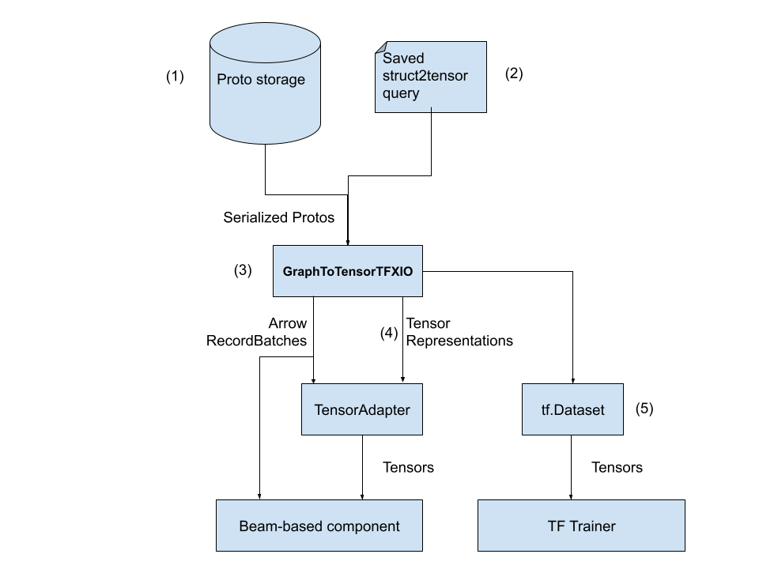

# Support structured data in TFX through `struct2tensor` and `DataView`

Status        | Proposed
:------------ | :--------------------------------------------------------------
**Author(s)** | Zhuo Peng (zhuo@google.com)
**Sponsor**   | Zhitao Li (zhitaoli@google.com)
**Updated**   | 2021-03-05

## Objective

This RFC proposes several additions to TFX in order to support building ML
pipelines that process __structurally richer__ data that TFX does not have
apriori knowledge about how to parse. Such knowledge is provided by the
user, through __`struct2tensor`__ (showcased in this RFC) or other TensorFlow
graphs and made available to all TFX components through __Standardized TFX
inputs__ and __`DataView`s__.

### Background

### `struct2tensor`

[`struct2tensor`](https://github.com/google/struct2tensor) is a library to
create TF graphs (a `struct2tensor`
"[expression](https://github.com/google/struct2tensor/blob/master/g3doc/api_docs/python/s2t/Expression.md)")
that parse serialized Protocol Buffers (protobuf) into a representation (a bag
of TF (composite) Tensors) that preserves the protobuf structure (for example
`tf.RaggedTensor`s and `tf.SparseTensor`s). It also allows manipulation of such
structure.

### Standardized TFX inputs

The
[Standardized TFX inputs RFC](https://github.com/1025KB/community/blob/875c04645f9029cb3c5d75bfdb8bf63e5560e9d9/rfcs/20191017-tfx-standardized-inputs.md)
introduced a common in-memory data representation to TFX components and an I/O
abstraction layer that produces the representation. The chosen representation,
Apache Arrow, is powerful enough to represent protobuf-like structured data, or
what the `tf.Tensor`, `tf.RaggedTensor`, or `tf.SparseTensor` logically
represent.

### Goal

* Propose a `TFXIO` for `struct2tensor`.
  * Note that although designed for `struct2tensor`, this `TFXIO` only sees
    the TF Graph that `struct2tensor` builds, which means it can support other
    TF Graphs that decode string records into (composite) Tensors.

* Propose the orchestration support needed by the proposed `TFXIO`.

### Non Goal

*   Address how components / libraries can handle the new Tensor / Arrow types.
    For example, TF Transform needs to be able to accept `tf.RaggedTensors` and
    output `tf.RaggedTensors`. These need to be addressed separately in each
    component, perhaps by separate designs, if needed.
*   Address how TF serving can allow serving a model that has a (composite)
    Tensor-based Predict signature, or any other signatures that do not use
    `struct2tensor` to parse input protobufs. In this doc, it is assumed that
    the
    exported serving graph would take a dense 1-D Tensor of dtype `tf.string`
    whose values are serialized protobufs.
    -   The reason why the above problem might be relevant to this design is
        that in certain use cases, it might be desirable to use a different
        format in serving than in training (e.g. using protobufs in training
        while
        using JSON in serving -- as long as they parse to the same (composite)
        tensors fed into the model graph).

## Motivation

TFX has historically assumed that `tf.Example` is the data payload format and
it is the only format fully supported by all the components. `tf.Example`
naturally represents flat data, while certain ML tasks need *structurally
richer* logical representations. For example, in the list-wise ranking problem,
one “example” input to the model consists of a list of documents to rank, and
each document contains some features. [`tensorflow_ranking`](https://github.com/tensorflow/ranking)
is a library that helps build such ranking models. Supporting
`tensorflow_ranking` in TFX has been a hot feature request.

<i>
  left: flat data represented by tf.Examples 
  right: typical data for ranking problems -- each “example” contains
  several “candidates”
</i>

While it’s possible to encode anything in `tf.Examples`, this approach poses
challenges to any component that needs to understand the data (e.g. Data
Validation and Model Validation), and would also lead to bad user experience as
they are forced to devise hacks.

It’s also possible to address the problem in a case-by-case fashion by making
TFX support a standard “container format” for each category of problem. We have
compared that with the generic solution based on `struct2tensor` in previous
efforts and concluded that we do
not want another first-class citizen container format.

Given that `struct2tensor` is able to decode an arbitrary protobuf (thus a good
subset of all kinds of structured data) into a Tensor representation that
preserves the structure (`tf.RaggedTensor`), we propose to
solve the problem of supporting structured data in TFX through supporting
`struct2tensor`.

Thanks to Standardized TFX Inputs, a large portion of the solution is to create
a `TFXIO` implementation for `struct2tensor`, and (as we will see later), the
proper orchestration support needed for instantiating such a `TFXIO` in
components.

## Design Proposal

### `GraphToTensorTFXIO`

The diagram above shows how the proposed `GraphToTensorTFXIO` works:

*   (1) The “Proto storage” is a format that Apache Beam can read from and
    produce `PCollection[bytes]`. While the most naive example of such a format
    is TFRecord, it does not have to be a row-based format. The only requirement
    is that Beam can read it and produce `PCollection[bytes]`.

*   (2) It relies on the fact that the `struct2tensor` query can be compiled to
    a TF graph that converts a string tensor (containing serialized protos) to a
    bunch of composite tensors, and thus can be stored in a file (SavedModel).

*   (3) For beam-based components, `TFXIO` creates a PTransform that: decodes
    the serialized records of protos to (batched) tensors using the saved TF
    graph converts the tensors to arrow RecordBatches.

*   (4) `TFXIO` will also create `TensorRepresentations` according to the output
    signature of the saved TF graph, so that the following is identity: PICTURE
    3

*   (5) For TF trainers, `TFXIO` creates a `tf.data.Dataset` that:

    -   reads the serialized records of protobufs as a string tensor
    -   `.map()` the string tensor to decoded it into tensors using the saved
        `struct2tensor` query.

### `struct2tensor` query as an artifact

We realize that the saved `struct2tensor` query (a TF SavedModel) should be an
artifact, rather than merely a property of the Examples artifact, because it
may be updated frequently (e.g. new fields in the protobuf to be parsed can be
added), and updates will affect most components that consume it, thus it needs
to become part of the provenance of an affected artifact. It may be updated
independently of Examples artifact. A pipeline may use multiple `struct2tensor`
queries, and the user may determine, for each component, which query to use to
apply to the input Examples.

To make it a proper artifact the following orchestration changes are proposed:

  * A new artifact type, DataView
  * New properties in the Examples artifact
    * `container_format` (e.g. `FORMAT_TF_RECORD_GZIP`)
    * `payload_format` (e.g. `FORMAT_TF_EXAMPLE`, `FORMAT_PROTO`)
    * `data_view_uri`
    * `data_view_id` (the MLMD artifact id of DataView)
  * A new custom component, DataViewProvider that takes the module_file (
    which contains the `struct2tensor` query) as an ExecutionProperty and
    no input Artifact, and outputs a DataView Artifact.
  * A new custom component, DataViewBinder that takes Examples and DataView as
    input, and outputs Examples Artifacts that are identical to the input except
    that their `data_adapter_uri` properties are populated.

With the proposed new properties in Examples artifact, some logic to determine
which `TFXIO` implementation to use to read an Examples artifact is needed. Thus
we also propose a util function that lives in TFX to create a `TFXIO` given an
Examples artifact.

The topology of a pipeline may look like the right half of the following
diagram:

<i>
  left: a tf.Example-based pipeline topology 
  right: proposed topology of a struct2tensor-based pipeline
</ig

Note that:

*   The outputs of DataViewBinder are different instances of the Examples
    artifacts than the input ones. Thus MLMD will be able to record events that
    establish the lineage of the input and output.

*   This design allows multiple DataViews to be bound to the same data, yielding
    different bound Examples artifacts.

*   This design also allows components to take Examples without a bound adapter
    as input (this way TFDV will be able to analyze both adapted and unadapted
    data, and establish links between raw proto fields and transformed ones).

### Garbage Collection of Artifacts

In this section we discuss some of the constraints / requirements that this
proposal impose on the design of GC (at the time of writing this doc, there’s
not a concrete plan yet).

#### Artifacts sharing URIs -- GC for Examples Artifacts

DataViewBinder outputs an Examples Artifact that shares URI with its input.
While MLMD allows this, the garbage collector must be aware when making the
decision of deleting a URI, that multiple Artifacts are sharing them, and only
if all the referring Artifacts are being GC’ed can the URI be deleted.

#### Artifacts referring to multiple URIs -- GC for DataView Artifacts

Note that a component that consumes adapted data only needs to use the output
Examples Artifact from DataViewBinder, which means at execution time, only the
URI of the Examples Artifact will be “locked”, however, that Examples Artifact
is also referring to the URI of a DataView Artifact. The garbage collector needs
to be aware of the existence of that URI and also lock it appropriately.

One way to add such support, is to have an extension property in an Artifact,
say, `gc_context`, which could contain additional URIs. Then the DataView
component is able to set that property.
