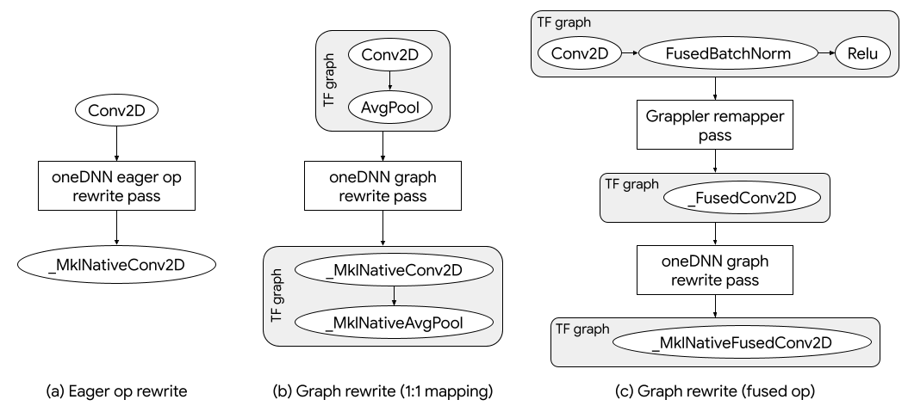
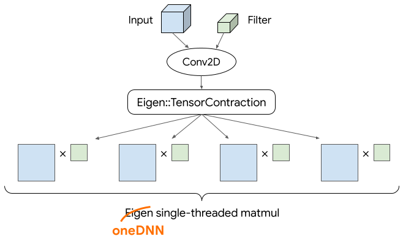

# Enabling oneDNN operations for x86 CPUs

| Status        | Proposed                                             |
:-------------- |:---------------------------------------------------- |
| **RFC #**     | [400](https://github.com/tensorflow/community/pull/400) |
| **Author(s)** | Penporn Koanantakool (penporn@google.com)            |
| **Sponsor**   | Tatiana Shpeisman (shpeisman@google.com)             |
| **Updated**   | 2021-09-30                                           |

## Objective

Default TensorFlow Linux packages can efficiently utilize CPU hardware features. Make it easier to support new features.

### Goals
* CPU performance improvements in default TensorFlow Linux packages ([`tensorflow`](https://pypi.org/project/tensorflow/), [`tensorflow-cpu`](https://pypi.org/project/tensorflow-cpu/), and [`tensorflow-gpu`](https://pypi.org/project/tensorflow-gpu/)).
* Default TensorFlow Linux packages could use recent and upcoming Intel hardware features, such as int8 and bfloat16 vectorizations (AVX512-VNNI and AVX512-BF16), with minimal code changes.
* Get user feedback on using custom oneDNN operations.

### Non-goals
* Optimize TensorFlow for every random model.


## Motivation

Machine learning is a fast-moving field with a wide range of applications and rapidly growing workloads. To keep up, various hardware accelerators have added ML-specific computing units such as Tensor Cores in Nvidia GPUs, MXUs (Matrix Multiplication Units) in TPUs, etc. CPU vendors have also recently adopted this trend: Intel has added int8 vectorization ([AVX512_VNNI](https://en.wikichip.org/wiki/x86/avx512_vnni)) to its CPUs starting in 2019, bfloat16 vectorization ([AVX512_BF16](https://en.wikichip.org/wiki/x86/avx512_bf16)) in 2020, and will soon release the new Advanced Matrix Extension ([AMX](https://en.wikichip.org/wiki/x86/amx)) instructions [early next year](https://www.nextplatform.com/2021/06/29/intel-delays-sapphire-rapids-server-chips-confirms-hbm-memory-option/). Arm announced its [bfloat16 hardware support plan](https://community.arm.com/developer/ip-products/processors/b/ai-and-ml-blog/posts/bfloat16-processing-for-neural-networks-on-armv8_2d00_a) in 2019 and launched the [Neoverse-V1](https://community.arm.com/developer/ip-products/processors/b/processors-ip-blog/posts/neoverse-v1-platform-a-new-performance-tier-for-arm) CPU with both bfloat16 vectorization and int8 2x2 matrix multiply instructions (I8MM) in April 2021. IBM introduced its Matrix-Multiply Assist ([MMA](https://arxiv.org/pdf/2104.03142.pdf)) instructions in 2020.

As CPUs become more diverse and powerful, it is important that TensorFlow can properly utilize these new instructions when they are available. However, most standard TensorFlow CPU kernels are implemented with the [Eigen library](http://eigen.tuxfamily.org/), which lacks proper dynamic support for this task. TensorFlow is pursuing two parallel efforts to address this: compilers and vendor-optimized libraries. The compiler-based approach will be done through XLA and MLIR. This RFC discusses a library-based approach. Official TensorFlow Linux packages currently only support x86 platforms, so we are focusing on the [oneAPI Deep Neural Network Library (oneDNN)](https://github.com/oneapi-src/oneDNN) for x86 CPUs.

oneDNN is a library of performant deep learning primitives with bleeding edge support for new Intel CPUs. It detects CPU architecture at runtime and dynamically generates specialized kernels with the best available vector instructions (just-in-time compilation). [Intel-optimized TensorFlow](https://software.intel.com/content/www/us/en/develop/articles/intel-optimization-for-tensorflow-installation-guide.html) (TF-oneDNN) is a separate TensorFlow build / package ([`intel-tensorflow`](https://pypi.org/project/intel-tensorflow/)) which replaces a set of compute-intensive standard TF ops at runtime with custom ops that builds upon oneDNN primitives. TF-oneDNN has been used in Google Cloud deep learning images, in Anaconda, and on supercomputers over the past few years. Beginning with TF 2.5, we have incorporated several key oneDNN custom ops into default TensorFlow packages. These ops are not used unless users enable them through an environment variable. This RFC proposes turning them on by default to maximize the benefits. 

## User Benefits

Enabling oneDNN-based operations will bring benefits of TF-oneDNN to default TensorFlow packages.
* **Performance speedups on x86 CPUs.** oneDNN’s primitives are highly optimized. Its just-in-time compilation and dynamic dispatch also let it use available hardware instructions efficiently. Enabling custom oneDNN ops achieves throughput speedups up to [3⨉ in inference and 2.4⨉ in training](https://medium.com/intel-analytics-software/leverage-intel-deep-learning-optimizations-in-tensorflow-129faa80ee07) on a Cascade Lake CPU.
* **Timely support of new hardware features in Intel CPUs.** oneDNN can use new Intel hardware instructions as soon as they are launched. TF-oneDNN receives the same benefit.
* **Mixed precision computation on CPU.** Default TF CPU ops don’t support bf16/fp32 mixed precision computations yet. oneDNN ops enable this feature on CPU. We observed additional [1.7-1.9⨉ speedups](https://blog.tensorflow.org/2020/06/accelerating-ai-performance-on-3rd-gen-processors-with-tensorflow-bfloat16.html) with bfloat16 hardware vectorization on a Cooper Lake CPU.
* **Additional int8 / quantization support on CPU.** oneDNN ops have more int8 coverage than default TF CPU ops. We also observed [3-4⨉ speedups](https://www.intel.com/content/www/us/en/artificial-intelligence/posts/accelerating-tensorflow-inference-with-intel-deep-learning-boost-on-2nd-gen-intel-xeon-scalable-processors.html) on top of software quantization benefits with int8 hardware vectorization on a Cascade Lake CPU.

## Design Proposal

The design consists of three main components: oneDNN custom ops, graph rewrite passes, and a software-managed cache.

**oneDNN custom ops** are TensorFlow ops that perform some set up (e.g., creating oneDNN compute primitives, memory descriptors, etc) before calling oneDNN routines.
* **Visibility:** These custom ops are hidden from users in the Python layer, cannot be saved in SavedModels, and are only introduced into the TensorFlow graph by graph rewrite passes in the C++ layer.
* **Scope and signature:** Most ops have a 1:1 mapping to a standard TensorFlow op, with the same op signatures (inputs, attributes, outputs, etc). The rest are fused operations (one op is equivalent to a sequence of standard TensorFlow ops).
* **Expected tensor format:** oneDNN ops process tensors directly in TensorFlow’s native format (NHWC), e.g., no tensor layout conversions.
* **Threading:** All oneDNN primitives are configured to use TensorFlow’s intra-op threadpool for parallelization to prevent resource contention with other standard TensorFlow ops that could  run at the same time. 

See the full list of ops in the [Supported Operations](#supported-operations) section.

**Graph rewrite passes** are graph optimizations on the TensorFlow graph. They are run in the C++ layer, before each graph is executed. We use two graph rewrite passes to substitute applicable standard TF ops with oneDNN custom ops, one pass per each execution mode:
* **Eager mode:** Because TensorFlow processes one op at a time in eager execution, [oneDNN eager op rewrite pass](https://cs.opensource.google/tensorflow/tensorflow/+/master:tensorflow/core/common_runtime/mkl_layout_pass.cc) only does 1:1 op mappings (replaces the op with its corresponding oneDNN op if it has one).
* **Graph mode:** In graph mode (this includes tf.function graph from eager mode), TensorFlow sees more than one ops at a time, so the [oneDNN graph rewrite pass](https://cs.opensource.google/tensorflow/tensorflow/+/master:tensorflow/core/common_runtime/mkl_layout_pass.cc) can either do 1:1 op mapping or replace a sequence of standard TF ops with a single fused oneDNN custom op. See examples in Figure 1.

<div align="center">
  
</div>

**Figure 1.** oneDNN custom ops are introduced to the graph through graph rewrite passes. Each op could substitute for one standard TF op, e.g., (a) and (b), or a sequence of ops, e.g., (c). oneDNN ops names are prefixed with “_MklNative”. (“Mkl” comes from oneDNN’s old name, MKL-DNN.)

**Software-managed cache** is an internal data structure that lives throughout a TensorFlow session. It is used to store oneDNN primitives and temporaries constructed by oneDNN ops for reuse next time the same op or other applicable ops are run. Its purpose is purely for reducing the framework overhead, i.e., it is not needed for correctness. The caching process is automatic and is not visible to users.

The whole mechanism has been added to the official TensorFlow builds since TF 2.5, but the graph rewrite passes that introduce oneDNN ops are disabled by default. Users can enable the passes to try oneDNN ops by setting the environment variable `TF_ENABLE_ONEDNN_OPTS=1`.

When we switch to running the rewrite passes by default, users can fall back to standard TensorFlow ops by setting the environment variable `TF_ENABLE_ONEDNN_OPTS=0` instead.

### Supported Operations
The table below shows operations that are already supported in TF 2.7 for each execution mode. We plan to gradually add support for more quantized ops from the TF-oneDNN build in the future.

<table>
    <tr><th colspan=2>Ops</th><th>Eager Mode</th><th>Graph Mode</th></tr>
    <tr>
        <th rowspan=7>Contractions</th>
        <td>BatchMatMul, BatchMatMulV2</td><td>✔</td><td>✔</td>
    </tr>
    <tr><td>Conv2D, Conv2DBackpropInput, Conv2DBackpropFilter</td><td>✔</td><td>✔</td></tr>
    <tr><td>Conv2DWithBias, Conv2DBackpropFilterWithBias</td><td>-</td><td>✔</td></tr>
    <tr><td>Conv3D, Conv3DBackpropInputV2, Conv3DBackpropFilterV2</td><td>✔</td><td>✔</td></tr>
    <tr><td>DepthwiseConv2dNative, DepthwiseConv2dNativeBackpropInput, DepthwiseConv2dNativeBackpropFilter</td><td>✔</td><td>✔</td></tr>
    <tr><td>Einsum</td><td>✔</td><td>✔</td></tr>
    <tr><td>MatMul</td><td>✔</td><td>✔</td></tr>
    <tr>
        <th rowspan=3>Batch norm</th>
        <td>FusedBatchNorm, FusedBatchNormGrad</td><td>✔</td><td>✔</td>
    </tr>
    <tr><td>FusedBatchNormV2, FusedBatchNormGradV2</td><td>✔</td><td>✔</td></tr>
    <tr><td>FusedBatchNormV3, FusedBatchNormGradV3</td><td>✔</td><td>✔</td></tr>
    <tr>
        <th rowspan=4>Pooling</th>
        <td>AvgPool, AvgPoolGrad</td><td>✔</td><td>✔</td>
    </tr>
    <tr><td>AvgPool3D, AvgPool3DGrad</td><td>✔</td><td>✔</td></tr>
    <tr><td>MaxPool, MaxPoolGrad</td><td>-</td><td>✔</td></tr>
    <tr><td>MaxPool3D, MaxPool3DGrad</td><td>-</td><td>✔</td></tr>
    <tr>
        <th rowspan=3>Quantization</th>
        <td>QuantizedConv2D</td><td>-</td><td>✔</td>
    </tr>
    <tr><td>QuantizedMaxPool, QuantizedAvgPool</td><td>-</td><td>✔</td></tr>
    <tr><td>QuantizeV2, Dequantize</td><td>-</td><td>✔</td></tr>
    <tr>
        <th>Transpose</th>
        <td>Conjugate Transpose, Transpose</td><td>-</td><td>✔</td>
    </tr>
    <tr>
        <th rowspan=5>Fused ops</th>
        <td>FusedBatchNormEx</td><td>-</td><td>✔</td>
    </tr>
    <tr><td>FusedConv2D</td><td>-</td><td>✔</td></tr>
    <tr><td>FusedDepthwiseConv2dNative</td><td>-</td><td>✔</td></tr>
    <tr><td>FusedMatMul</td><td>-</td><td>✔</td></tr>
    <tr><td>PadWithFusedConv2D</td><td>-</td><td>✔</td></tr>
</table>

### Testing and Issues
Any TensorFlow test targets that go through normal execution paths (i.e., ones which triggers graph rewrite passes) will test oneDNN ops if they are turned on through the environment variable. 

oneDNN ops have been tested regularly through community build GitHub [presubmit](https://tensorflow-ci.intel.com/job/tensorflow-mkl-linux-cpu-pr/) and [nightly](https://tensorflow-ci.intel.com/job/tensorflow-mkl-build-whl-nightly/) CI tests. Once oneDNN ops are enabled by default, they will be tested in the official TensorFlow Linux CPU GitHub presubmit and nightly CI tests. 

oneDNN-related issues in TensorFlow will be triaged by Intel. Please report them on the [TensorFlow GitHub repository](https://github.com/tensorflow/tensorflow) and tag @TensorFlow-MKL. 


### Alternatives Considered
We considered two alternatives: using compilers to generate code and adding support for new hardware to Eigen. 

#### Compiler-based Approach
This is done through XLA and MLIR and is under active development. The oneDNN-based approach is ready now. 

#### Adding Support to Eigen
A large number of default TensorFlow CPU kernels are implemented with the [Eigen library](http://eigen.tuxfamily.org/). While Eigen has various optimizations for different CPU architectures, it only supports compile-time selection of the target vector extensions. To be able to run on most machines available today, default TensorFlow packages are built with only AVX support, missing possible performance gains from newer vector instructions on more advanced machines. For example, a user running default TensorFlow v1.12 or older on Intel Skylake processor will see this warning message:

```
Your CPU supports instructions that this TensorFlow binary was not compiled to use: AVX2 AVX512F FMA
```

From TF 1.13 onwards, we mitigate this issue for contraction ops, i.e., matrix multiplications and convolutions, which account for the majority of model execution time. TensorFlow contraction ops relies on Eigen’s [tensor contraction](https://gitlab.com/libeigen/eigen/-/blob/master/unsupported/Eigen/CXX11/src/Tensor/TensorContractionBlocking.h), which shards the work into many small, L1-cache-fitted matrix multiplications, enqueues them as tasks in the thread pool, and calls Eigen’s single-threaded [general block-panel kernel (gebp)](https://gitlab.com/libeigen/eigen/-/blob/master/Eigen/src/Core/products/GeneralBlockPanelKernel.h) to compute each task. By replacing the gebp call with oneDNN’s single-threaded [matrix multiplication (dnnl_sgemm)](https://github.com/oneapi-src/oneDNN/blob/073206ba120b51668eb4e47ecc938af77d449a8e/include/oneapi/dnnl/dnnl.h#L3742) which has dynamic dispatch, TensorFlow can use CPU instructions newer than AVX in all contraction ops. Figure 2 illustrates the process.

<div align="center">
  
</div>

**Figure 2.** Replacing Eigen single-threaded matrix multiplication with oneDNN’s lets TensorFlow use CPU instructions newer than AVX in contraction ops such as matrix multiplications and convolutions.

However, this workaround has limitations:
* It only covers contraction ops and not other ops (such as element-wise ops) which could also benefit from newer instructions, e.g., AVX-512 instructions for int8 and bfloat16 data types.
* Some hardware might need fine-grained subtask scheduling for best performance, e.g., interleaving each small matrix multiplication task with some other computations.

There are additional factors that make Eigen less preferable compared to the compiler-based and oneDNN approaches:
* **No mixed precision support:** Eigen’s type template is not structured to support a different accumulator type in a kernel. There is ongoing work for this, but it will take a while since it requires fundamental changes.
* **Large binary size:** All kernels with all registered combinations of data types are compiled statically and added to the TensorFlow package size. In contrast, just-in-time compilation can compile kernels with less common data type combinations only when they are used.
* **Long compilation time and large memory requirements:** Eigen’s heavy usage of C++ templating is a major contributor to TensorFlow’s long compilation time and large memory requirements.

### Performance Implications
We expect reduced running times in most cases. (See [User Benefits](#user-benefits) for example speedups.) In rare cases, oneDNN ops can be slower than standard TF CPU ops due to overheads such as oneDNN primitive preparation, oneDNN graph rewrite, etc. For those cases, users can disable usage of oneDNN ops by setting the environment variable `TF_ENABLE_ONEDNN_OPTS=0`.

### Dependencies
* **Dependencies:** This proposal doesn’t add new dependencies to TensorFlow. oneDNN is already a dependency.
* **Dependent projects:** This proposal affects all projects that depend on TensorFlow in terms of performance and numerical accuracy on CPUs. See [User Impact](#user-impact) for more details.

### Engineering Impact
* There will be no change to binary size, startup time, and build time. Test times might vary slightly due to different computation times, but they should be negligible.
* Intel and the TensorFlow team will maintain the code.


### Platforms and Environments
* **Platforms:** oneDNN ops work with x86 Linux and Windows. We are turning them on by default only in Linux first. The ops are not included in the TensorFlow packages for other platforms (such as MacOS, Android, etc) and cannot interfere with their functionality.
* **Execution environments:** 
    - **Cloud services:** TF-oneDNN ([`intel-tensorflow`](https://pypi.org/project/intel-tensorflow/)) has already been used on cloud services in the past few years. Turning on oneDNN ops in default TensorFlow packages would make the experience closer to the TF-oneDNN packages.
    - **Accelerator hardware:** oneDNN ops do not interfere with accelerators.

### Best Practices
Users should observe if using oneDNN ops is beneficial for them, and disable them if not.

### Tutorials and Examples
oneDNN ops are included in TF 2.5 and newer, disabled by default. To test them, the user only needs to set the environment variable `TF_ENABLE_ONEDNN_OPTS=1`, then run TensorFlow as usual.

When this proposal is in effect and oneDNN ops are enabled by default, users won’t have to do anything to use them. They can still disable them by setting the environment variable  `TF_ENABLE_ONEDNN_OPTS=0`. 

### Compatibility
* This design conforms to the backwards and forwards compatibility requirements. Most of the changes are in the C++ layer during graph rewrite. They are not visible to the users.
* Interactions with other parts of the TensorFlow ecosystem:
    - **TFLite:** This proposal doesn’t affect TFLite, although some of the oneDNN custom int8 ops overlap functionally with TFLite ops. We will look into reducing the redundancy in the future.
    - **Distribution strategies:** Turning on oneDNN ops usually improves the performance. It gives no performance improvement at worst.
tf.function: oneDNN custom ops work normally with tf.function.
    - **GPU/TPU:** oneDNN custom ops are for CPUs only. Turning on oneDNN ops in a CUDA build doesn’t interfere with CUDA ops. oneDNN custom ops can be used for CPU code in CUDA build.
    - **SavedModel:** oneDNN ops are hidden and won’t be serialized to a SavedModel. On the other hand, models from SavedModel will be able to use oneDNN ops, as they are read into TF Graphs and will go through oneDNN graph rewrite in the C++ layer during execution.

### User Impact
Users will see changes in model execution time on CPUs (see [Performance Implications](#performance-implications)). They will also see changes in numerical accuracy due to floating point round-off errors from different computation orders. Tests that use hard-coded golden values may need to be updated. If these changes are not acceptable, users can always disable usage of oneDNN ops by setting the environment variable `TF_ENABLE_ONEDNN_OPTS=0`.

## Questions and Discussion Topics

We would appreciate it if the community could help test the feature (by setting the environment variable `TF_ENABLE_ONEDNN_OPTS=1` in TF 2.5 and newer)  and let us know on this RFC if there are any concerns. For performance / correctness issues, please report them at the [TensorFlow repository](https://github.com/tensorflow/tensorflow) and tag @TensorFlow-MKL.

