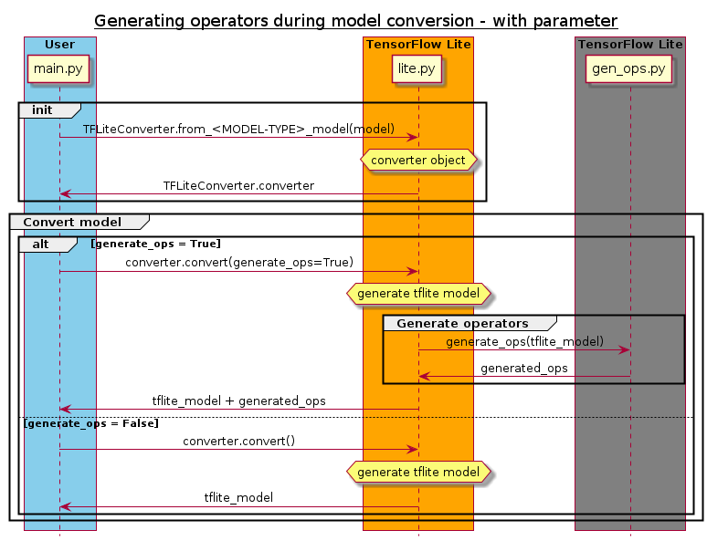
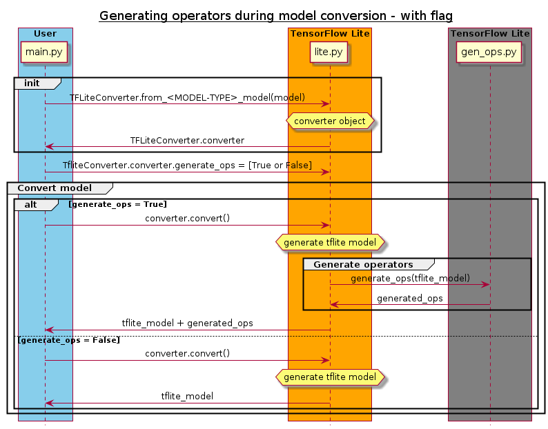

# MicroMutableOpResolver Generation

| Status        | Proposed      |
:-------------- |:---------------------------------------------------- |
| **RFC #** | [408](https://github.com/tensorflow/community/pull/408)|
| **Author(s)** | Sebastian Larsson (sebastian.larsson@arm.com), Oscar Andersson (oscar.andersson@arm.com), Måns Nilsson (mans.nilsson@arm.com) |
| **Sponsor**   | Pete Warden (petewarden@google.com)                 |
| **Updated**   | 2022-01-03                                           |

## Objective
The objective is to simplify the process of parsing a tflite file for operators, and to generate code that can easily be integrated into an application.
### Goals
* Make it easier to extract operators used in a model.
* Make it easier to integrate the code for the extracted operators, into the users program.
## Motivation

When using an interpreter, you need an operator resolver. For this, you have two options:

1) Using the **AllOpsResolver** will link all the TFLM operators into the executable, which will add significantly to the memory footprint. A model typically only requires a small subset of operators and considering that microcontrollers have a limited memory size, **MicroMutableOpResolver** is a better option. Example usage of **AllOpsResolver**:
```cpp
#include "tensorflow/lite/micro/all_ops_resolver.h"

tflite::AllOpsResolver resolver;
```
2) Using the **MicroMutableOpResolver** will include the operators specified by the user. This requires manually finding out which operators are used in the model, through the use of a visualization tool. Due to the smaller memory footprint this is preferable for real world usage, but it does require some more work for the user. This becomes impractical when running automated tests as you manually need to find the operators and add them. Example usage:
```cpp
#include "tensorflow/lite/micro/micro_mutable_op_resolver.h"

tflite::MicroMutableOpResolver<8> micro_op_resolver;

micro_op_resolver.AddConv2D();
micro_op_resolver.AddStridedSlice();
micro_op_resolver.AddMul();
micro_op_resolver.AddAdd();
micro_op_resolver.AddRelu6();
micro_op_resolver.AddPad();
micro_op_resolver.AddAveragePool2D();
micro_op_resolver.AddReshape();
```

## User Benefit

This RFC will provide a simple way to extract the operators used in a model, for __TensorFlow Lite for Microcontrollers__ users.

## Design Proposal
### Adding an optional parameter to each respective convert function
We propose adding a script that extracts the operators used in a given model. This can be done conveniently at a high level during the convert stage. Currently, `convert()` converts a TensorFlow model of any type into a tflite model and returns it as bytes. During `convert()` it would be possible to call a script that extracts the operators from the tflite model and returns it to the user as a string, along with the tflite model. This can be done with an optional argument, generate_ops. If set to True it will perform the script that extracts the operators. This can be seen in the diagram below.


### Adding a flag
 It can also be achieved by adding a flag to the [TFLiteConverterBase](https://github.com/tensorflow/tensorflow/blob/6c1d5066ddb5d460c7fc5477c1992a0ad94dd561/tensorflow/lite/python/lite.py#L457) class as can be seen below.




### Standalone script
A third option is to make the script standalone, seperated from the the convert API. This could be part of the tf.lite namespace, and would not require any changes in the convert API. It could also be a command line tool.

### Proposed output
The resulting string will be C++ formatted such as:
```cpp
#include "tensorflow/lite/micro/micro_mutable_op_resolver.h"

const int NUMBER_OF_OPS = 8;

tflite::MicroMutableOpResolver<NUMBER_OF_OPS> get_resolver()

{
	tflite::MicroMutableOpResolver<NUMBER_OF_OPS> micro_op_resolver;

	micro_op_resolver.AddStridedSlice();
	micro_op_resolver.AddPad();
	micro_op_resolver.AddAdd();
	micro_op_resolver.AddAveragePool2D();
	micro_op_resolver.AddMul();
	micro_op_resolver.AddReshape();
	micro_op_resolver.AddRelu6();
	micro_op_resolver.AddConv2D();

	return micro_op_resolver;
}
```

### Alternatives Considered
Three alternatives were considered. An optional parameter in convert, a flag in [TFLiteConverterBase](https://github.com/tensorflow/tensorflow/blob/6c1d5066ddb5d460c7fc5477c1992a0ad94dd561/tensorflow/lite/python/lite.py#L457), and as a standalone parser script, which takes a tflite file as input, and has the same output as mentioned in [Proposed output](#proposed-output).

### Performance Implications

In comparison with `AllOpsResolver`, we expect a smaller memory footprint in the final runtime binary.

We expect no memory- or speed gains in comparison with a `MicroMutableOpResolver` during runtime.

### Dependencies
* Dependencies: Introduces no new dependencies.
* Dependent projects: None, this is an optional feature.

### Engineering Impact
We expect a smaller binary, compared to when using an `AllOpsResolver`, but not when comparing with a `MicroMutableOpResolver`.

### Platforms and Environments
This only affects tooling and runs on host.

### Best Practices
From what we can tell, this will not change any best practices.

### Tutorials and Examples
To extract operators using the new feature, run:
```python
converter = tf.lite.TFLiteConverter.from_keras_model(model)
tflite_model, generated_ops = converter.convert(generate_ops=True)
```
or
```python
converter = tf.lite.TFLiteConverter.from_keras_model(model)
converter.generate_ops = True
tflite_model, generated_ops = converter.convert()
```
and the write to file.
```
with open('generated_file.h', 'w') as f:
   f.write(generated_ops)
```
The generated header file is included just like any other would be. The final step is to declare a `MicroMutableOpResolver` and assign the value of `get_resolver()` to it.
```cpp
#include "generated_ops.h"

tflite::MicroMutableOpResolver<NUMBER_OF_OPS> micro_op_resolver = get_resolver();
```
The resolver now contains all of the required operator information, and is ready to be used.
### Compatibility
The feature is backward compatible. Any use case of `convert()` that has worked in the past, will work the same way with this feature, as it is optional.

### User Impact
Generating calls to `MicroMutableOpResolver` will simplify creation of interpreter interaction for inexperienced users.

Any user who wishes to implement their resolver like they have done in the past, will be able to do so.

## Detailed Design
The generator script mentioned earlier needs to be added to TensorFlow, along with changing the parameter list of the convert functions in [lite.py](https://github.com/tensorflow/tensorflow/blob/6c1d5066ddb5d460c7fc5477c1992a0ad94dd561/tensorflow/lite/python/lite.py). Since each TensorFlow model type has its own convert function, each function needs the addition of the additional argument. The functions will use this argument once it has a tflite model, to check whether it should call the generator function and return the generated string. Alternatively, a flag can be added to the [TFLiteConverterBase](https://github.com/tensorflow/tensorflow/blob/6c1d5066ddb5d460c7fc5477c1992a0ad94dd561/tensorflow/lite/python/lite.py#L457) class instead of adding an argument to each `convert()` function. The flag would have the same functionality as the function parameter.

Implementation for conversion of a keras model:
```python
def convert(self, generate_ops=False):

	...

	if generate_ops:
		generated_ops = gen_ops.generate_ops(tflite_model)
		return tflite_model, generated_ops
	return tflite_model
```

## Questions and Discussion Topics

Having the operator extraction within `convert()` would limit the use cases. If the user already has a tflite file, it would not be possible to make use of the new functionality. On the other hand, if the feature was a standalone script, it would be possible.

A standalone script could reside in [tflite-micro](https://github.com/tensorflow/tflite-micro), but the other two options would require the functionality to be included in [TensorFlow](https://github.com/tensorflow/tensorflow).