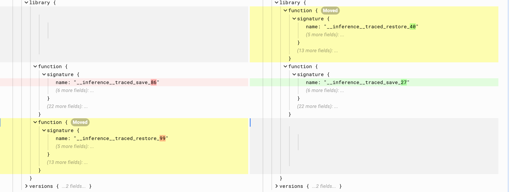
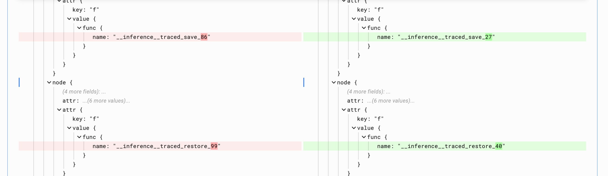

# SavedModel Fingerprinting

| Status        | Proposed                                             |
:-------------- |:---------------------------------------------------- |
| **RFC #**     | 415 |
| **Author(s)** | Monica Song (monicadsong@google.com)                 |
| **Sponsor**   | Cesar Crusius (ccrusius@google.com)                  |
| **Updated**   | 2022-06-10                                           |

## Objective

Following the convention of other types of electronic files and artifacts, the SavedModel format would benefit from having a fingerprint that uniquely identify the program it serializes. This fingerprint will better enable users to track their SavedModels in ML pipelines and other infrastructure using native metadata.

## Motivation

SavedModels represent machine learning models in protocol buffer format. These machine learning models are composed of the TensorFlow graph defining the computation and the values of the weights of the nodes (a.k.a. the checkpoint).

Many users of TensorFlow have requested a fingerprint in the SavedModel format, to enable them the ability to track the usage and lineage of their models in research and production. Since the SavedModel contains several parts (the graphdef, the functiondef library, the checkpoint, etc) that are not all used in the loaded program, this design will provide a fingerprint consisting of multiple parts as well. Clients are free to pick and choose which parts of the fingerprint they want to use to meet their needs.


## User Benefit

SavedModel fingerprinting has been requested by many users to enable them to track their impact by counting the number of SavedModels using their service or by counting the number of SavedModels in production that they created.

Clients of the SavedModel fingerprinting feature should understand how they consume SavedModel protobufs to identify and select which parts of the fingerprint fit their use cases. For example, some serving infrastructure is in C++ and relies on the SignatureDef to figure out what to load; thus, they would ignore the part of the fingerprint that describes the ObjectGraphDef which is only used in Python.

This document proposes a fingerprint that is comprised of a set of hashes, each with various guarantees to serve the requirements of our users.

## What is SavedModel Fingerprinting

By [definition](https://en.wikipedia.org/wiki/Fingerprint_(computing)), a fingerprint maps a large amount of data to a much shorter bit string. In this case, our goal is to map the serialized contents of the SavedModel protobuf to a set of 64-bit hashes. We choose 64 bits because fingerprints are typically 64 bits long and the consequences of collision are not so terrible that we need to make it 128 bits.

**The SavedModel fingerprint contains 5 parts total:**

1. **A File Checksum:** This is a hash of the contents of the `saved_model.pb`
2. **Program hash of the GraphDef**
3. **Program hash of the SignatureDef**
4. **Program hash of the ObjectGraphDef**
5. **Hash of checkpoint file**

The rationale for this selection is that:
  - The SignatureDef defines the necessary computation in C++
      - Serving in C++ for inference uses the SignatureDef, which is determined by the `signatures` options of the `tf.saved_model.save` API.
  - GraphDef has the FunctionDefLibrary
  - ObjectGraphDef is very useful when  loading in Python (however, it is ignored in C++)
  - The checkpoint contains the weights of the model.

### Properties


When two SavedModels have the same file checksum, this means that they are identical in their persisted format on disk, provided there is no collision.

When two SavedModels have all 3 identical program hashes, they are said to be **isomorphic.** This means their data in the SavedModel protobuf that is persisted on disk could be different, however they describe the same computation in their graphs. So, in effect, the program should behave the same. This is why it is called a “program hash.”

In order to make a program hashes, we have to **regularize** (a.k.a. **canonicalize**) the protobuf to remove the sources of non-determinism that could result in two computationally equivalent models having different contents in the SavedModel.

For example, when we try to serialize the following model in two different programs:
```
  x = tf.Module()
  x.v = tf.Variable(1.0)
  tf.saved_model.save(x, model_path)
```

we see that the names of the functions change as well as their order in the FunctionDefLibrary:






In the above example, the two models should have **different** file checksums but **identical** program hashes.

The reason we have a file checksum and a regularized/canonicalized set of program hashes is to allow users the ability to select which ones to use for their use cases.


<table>
  <tr>
   <td><strong>Part of Fingerprint</strong>
   </td>
   <td><strong>Use case</strong>
   </td>
   <td><strong>Deterministic?</strong>
   </td>
   <td><strong>Content-based?</strong>
   </td>
   <td><strong>Unique?</strong>
   </td>
   <td><strong>Useful for:</strong>
   </td>
  </tr>
  <tr>
   <td>File Checksum
   </td>
   <td>Enable tracking of the specific savedmodel
   </td>
   <td>No
   </td>
   <td>Yes
   </td>
   <td>Yes
   </td>
   <td>Tracking specific protobufs in production, such as those available on TF Hub
   </td>
  </tr>
  <tr>
   <td>Regularized hashes
   </td>
   <td>Enable tracking of the source code
   </td>
   <td>Yes
   </td>
   <td>Yes
   </td>
   <td>Yes
   </td>
   <td>Library authors who want to know who is using their code
   </td>
  </tr>
</table>


## Comparison of the File Checksum and Program Hashes

What parts of the fingerprint change?


<table>
  <tr>
   <td><strong>Case</strong>
   </td>
   <td><strong>File Checksum</strong>
   </td>
   <td><strong>Program Hashes</strong>
   </td>
  </tr>
  <tr>
   <td>Model A and Model B are produced by calling `tf.saved_model.save(model, “/tmp)` function twice in a row in the same process.
   </td>
   <td>Different
   </td>
   <td>Same
   </td>
  </tr>
  <tr>
   <td>Model A and Model B are produced by the exact same program using `bazel run`.
   </td>
   <td>Different
   </td>
   <td>Same
   </td>
  </tr>
  <tr>
   <td>Model B is a copy of Model A (e.g. you ctrl-C, ctrl-V the file).
   </td>
   <td>Same
   </td>
   <td>Same
   </td>
  </tr>
</table>


## Design Proposal

The engineering impact of this project is significant in that it adds an additional file (`fingerprint.pb`) to the SavedModel format.


### A Separate File for the Fingerprint

We plan to add an additional protobuf in the SavedModel directory:

*   `assets/`
*   `saved_model.pb`
*   **<code>fingerprint.pb</code>**
*   <code>variables/</code>

The advantages of having a separate file for the fingerprint are:
- It neatly encapsulates the changes that this design proposes
- It does not interfere with the MetaGraphDef in the saved_model.pb. The MetaGraphDef protobuf is already extremely large so we want to avoid adding fields to it.

One drawback of having a separate file is that it is a potentially significant change to the SavedModel format and could break any users who are using the SavedModel format in ways not endorsed by our library.

### API for reading and writing the fingerprints

All fingerprints will be written to disk automatically, and there is no way to bypass or customize writing fingerprints when serializing a SavedModel.

To read the fingerprint, users can load the protobuf into memory and read the field. At first, there will not be dedicated APIs in Python to get the fingerprint, since no other part of the SavedModel has special APIs to access its value. However, if the need arises, we can add APIs under the `tf.saved_model` namespace to read the fingerprint.

### Validation

When loading the SavedModel, we will log a warning (absl logging) if the fingerprint does not match the contents of `saved_model.pb`.

It should not be possible to create an invalid fingerprint if clients use our APIs correctly. The fingerprint and the SavedModel
should always be in sync. If there’s a mismatch, then we assume that someone has changed the `fingerprint.pb` or `saved_model.pb` in ways not endorsed by TensorFlow.

The SavedModel CLI is also a good place for verification as well. We can check that the fingerprint is valid for the corresponding `saved_model.pb` file, based on an option in the CLI. We can display (in colored text) the result of the match.

We can also explore the option of adding a Python API such as `tf.saved_model.check_fingerprint(file_name)` to enable clients to validate the SavedModel.

### Implementation Details

The fingerprinting will be added as a final step of serialization. The fingerprint infrastructure will take as input the MetaGraphDef and hash each component of it, doing the necessary regularization as well.

The hashing will occur in C++, since it is easier to find an open source hashing algorithm in C++ than in Python. Hashing in C++ is also much faster. There will be pybinded wrappers for access from Python. This will require passing the protobuf across the Python and C++ boundary which may require an extra cycle of de/serialization.

### Launch Plan

**We will implement fingerprinting behind a flag such that it will not introduce any behavioral changes.**

Once all testing has been done, writing the fingerprint protobuf will be the default behavior for all SavedModels written.


### Alternatives Considered


#### Modifying the MetaGraphDef
We considered adding another section to the MetaGraphDef. There are currently seven parts of the MetaGraphDef (Metainfodef, GraphDef, SaverDef, CollectionDef, SignatureDef, AssetFileDef, ObjectGraphDef). This alternative proposed adding a FingerprintDef as the 8th section of the MetaGraphDef. However, we wanted to avoid cluttering the MetaGraphDef any further.

We also considered tagging the parts of the MetaGraphDef with hashes. This idea also adds unwanted complexity to the MetaGraphDef.

#### Not persisting fingerprint on disk

We considered only providing APIs for reading and calculating on the fly the fingerprint from the serialized protobuf, as opposed to storing them in a separate file.

Advantages:
  - No changes to the format.
  - Always “correct”

Disadvantages:
  - No verification possible since the fingerprint is always computed on the fly.
  - Extra time to compute.
  - Need to provide an API to allow clients to use.


#### Python Protocol Method

This alternative proposed a a protocol method `def __fingerprint__(self)` to the following classes in TensorFlow that inherit from Trackable:
  - `def_function.Function`
  - `Module`
  - `Dataset`
  - `ConcreteFunction`
  - `Asset`
  - `Constant`
  - `Variable`

When creating the SavedModel proto, we’d collect the fingerprints of each of these instances in the model. And then combine each of them into a single hash them again to create a final fingerprint that uniquely identifies the part of the SavedModel proto they belong to.

The disadvantage of this approach is that it is primarily in Python and works with the objects as defined in Python. Working in C++ is preferable to working in Python.

### Future Ideas

#### Changes to the CLI

The SavedModel CLI will display the fingerprint in its output. This will be useful for clients to troubleshoot any problems with fingerprinting such that they do not need to load the SavedModel protobuf in Python and instead use only the commandline.

#### UUID

A UUID is not a good idea because it produces non-deterministic artifacts which are major resource wasters for build systems.

To prevent this from happening, we could have a flag to disable fingerprinting (manually or automatically if we detect we are using Bazel) that could be activated by clients who need to have deterministic artifacts. However, we are wary of introducing another knob to an already complex system.

## Appendix

### Concerns (to be verified by experiments)

- Roundtrip-ability: is the fingerprint same before and after loading?
  - A fingerprint for the same program is not guaranteed to be the same depending on the type of fingerprint.
- How much overhead does it add to serialization?
  - Since we are hashing the protobuf, we need to serialize it to a string twice. First, to calculate the hash. And second, to write the protobuf (with the hash field populated) to disk.
  - Additionally, how long will the hashing algorithm take?
- Any security concerns?

### Dealing with Serialization Non-Determinism
Non-determinism of the SavedModel protobuf makes fingerprinting tricky. This is why the fingerprint has a non-regularized file checksum and several regularized hashes, with the latter attempting to guarantee determinism. The additional work needed to remove sources of non-determinism from the protobuf makes the implementation of fingerprinting a complex project.

#### What changes between binaries in the graphdef?

This is not an exhaustive list:

- The variable names are suffixed with an ever-increasing integer since there is a UID in `tensorflow/python/framework/ops.py`, which starts at 0 and is incremented every time it is called from Python or C++.
- Function names are also non-deterministic and are suffixed with a UID as well.
- The order of functions in the function library is non-deterministic as well, since protobufs do not guarantee the order of maps.

#### Steps to deal with the non-determinism
- Remove the UID from names
- Add an auxiliary name to variable names
- Do a “compiler pass” to recognize the auxiliary variable names and replace them with known names-> variable name regularization


## Questions and Discussion Topics

(To be added)

