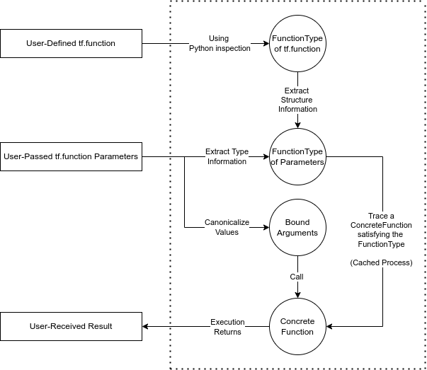

# FunctionType for tf.function

| Status        | Proposed         |
:-------------- |:---------------------------------------------------- |
| **RFC #**     | [TODO](https://github.com/tensorflow/community/pull/NNN) |
| **Author(s)** | Faizan Muhammad (fmuham@google.com)|
| **Sponsor**   | Yanhua Sun (yanhuasun@google.com)                 |
| **Updated**   | 2022-08-24                                           |


##  Objective

This document details the introduction of a new `FunctionType` to represent the type of tf.function and ConcreteFunction instances. 


## Motivation

### Goals
*   Build a practical, fundamental concept for a TensorFlow function’s “type” 

*   Reduce tf.function “magic” by simplifying its mental model (and implementation)
    *   Be able to provide users with a simple, predictable story of what is going on
    *   Easier to eventually replicate/lower the logic in C++ 

*   Greatly simplify argument-handling code for tf.function:
    *   Remove tech debt and pursue engineering excellence
    *   Speed up development velocity 

*   Resolve/unblock ~14 relevant existing `tf.function` bugs (b/hotlists/4425735) 

*   Open up the path for further `tf.function` and `ConcreteFunction` layering 

*   Have minimal change in user-facing behavior (except for error messages, undetected contract violations etc.)


### Vision

This diagram should be the **comprehensive** mental model for both users and developers about `tf.function `without **any** unpredictable exceptions.


 \
(See the *Example Run Through* section for sample code as called in practice)

Some examples of ways things currently do not hold up to this model:


*   **Tech Debt:** Concepts like BoundArguments and FunctionType already exist implicitly and are emulated through code that can be made much simpler by their actualization 

*   **Layering Violations:** Tracing logic should only use placeholder values derived from the FunctionType and be completely unaware of the actual values 

*   **Serialization Inconsistency:** tf.function deserialized from SavedModel does not currently share the dispatch system of this model. 

*   **Contract Violations:** ConcreteFunction lets through certain arguments that it should not support.


### Problems

*   ConcreteFunction is unaware of the exact monomorphic type it actually is:
    *   `FullArgSpec` and Graph’s `structured_input_signature` is used instead
    *   Type information is lost during serialization so SavedModel has a hacky dispatch
    *   Root cause of several inconsistencies and user frustration

*   Extremely convoluted and redundant logic to manually do things like:
    *   **Type Validation**: Since `FunctionSpec` does not use `TraceType`
    *   **Argument Parsing**: Since `FunctionSpec `does not use inspect.Signature
    *   **Argument Conversions**: Original `*args` and `**kwargs` pass through multiple small mutating/validating/type casting functions 

*   For the C++ API, we also need a clear notion of function types so that we can do things like dispatch without having to worry about all the intricacies and tech debt above

*   inspect.FullArgSpec that we use for inspection has been [replaced](https://docs.python.org/3/library/inspect.html#inspect.getfullargspec) by inspect.Signature in Python 3


## Background


### The TF Function Zoo

**Polymorphic vs Monomorphic:** A polymorphic function accepts multiple different types for a particular argument. In the tf.function world, TraceType denotes argument types and therefore if two (or more) mutually non-subtype types can be accepted by a function, then it is polymorphic. Otherwise it is monomorphic.

**Differentiable vs Non-Differentiable:** A function that has an associated gradient function is considered differentiable otherwise it is non-differentiable. Not having a “gradient function” does not mean that mathematically one does not exist, it means that one has simply not been generated/registered for this particular instance.

Given these definitions, the hierarchy of different “function”s in TF ecosystem can be described as:

`tf.function` -> Polymorphic, Differentiable Function

`ConcreteFunction` -> Monomorphic, Differentiable Function

`_EagerDefinedFunction/FuncGraph` -> Monomorphic, Non-Differentiable Function

A `tf.function` enables its polymorphism by using multiple monomorphic `ConcreteFunction `under the hood. `ConcreteFunction` enables its differentiability by associating a forward pass with a backward pass that computes the gradient. If higher-order gradients are needed, it associates a higher order backward pass with the lower order backward pass recursively. This trick is enabled by the fact that a backward pass inside a `ConcreteFunction `is actually another `ConcreteFunction`. The “gradient” functions are simply `ConcreteFunction `whose forward pass is the backward pass of another `ConcreteFunction`.

`FunctionType` will describe the input contract of all these kinds of functions including arguments, keyword-arguments with default values and captures.


### Current Implementation

The notion of “signature” for the polymorphic tf.function and the monomorphic ConcreteFunction is handled entirely by `FunctionSpec:`

*   Automatically derived from the python function using inspect.fullargspec
*   Defined for every `tf.function `annotated Python function
*   Used to perform input validation
*   Used to transform tf.function/ConcreteFunction arguments to graph inputs
*   Optionally also has the `input_signature`
    *   Constrains the types accepted by `tf.function/ConcreteFunction`
    *   Generalizes the traced concrete function to be as generic as the `input_signature`
*   Inherited by `ConcreteFunction` from its parent tf.function with slight modifications


## Design Proposal

### Introduce FunctionType (inspect.Signature + TraceType)

All functions will use `FunctionType` to represent their input contract which is composed of a bunch of `Parameters`:


```
CAPTURED_DEFAULT_VALUE = object()

class Parameter(inspect.Parameter):
  """Represents a parameter to a function."""

  def __init__(self, name: str, kind: Any, optional: bool,
               type_constraint: Optional[trace.TraceType]):
    super().__init__(
        name,
        kind,
        default=CAPTURED_DEFAULT_VALUE if optional else self.empty,
        annotation=type_constraint
        if type_constraint is not None else self.empty)

  @property
  def optional(self) -> bool:
    """If this parameter might not be supplied for a call."""
    return self.default is not self.empty

  @property
  def type_constraint(self) -> Optional[trace.TraceType]:
    """A supertype that the parameter's type must subtype for validity."""
    return self.annotation if self.annotation is not self.empty else None


class FunctionType(inspect.Signature):
  """Represents the parameters of a polymorphic function."""

  @classmethod
  def from_callable(cls, obj, *, follow_wrapped=True) -> "FunctionType":
    """Generate FunctionType from a python Callable."""
    signature = super().from_callable(obj, follow_wrapped=follow_wrapped)

    parameters = [
        Parameter(p.name, p.kind, p.default is not p.empty, None)
        for p in signature.parameters.values()
    ]

    return FunctionType(parameters)
```


Key takeaways:

*   Directly extends the [canonical](https://docs.python.org/3/library/inspect.html#inspect.Signature) Python function signature representation, except:
    *   Default values are not stored in `FunctionType`, only that a parameter is optional
    *   Type annotations are strictly TraceTypes associated with that particular parameter

*   Automatically inherited [FunctionType.bind](https://docs.python.org/3/library/inspect.html#inspect.Signature.bind) makes 100s of lines of manual argument validation/canonicalization redundant 

*   [BoundArguments](https://docs.python.org/3/library/inspect.html#inspect.BoundArguments) will be used to enforce a strict immutability of user args, kwargs except for functions that explicitly transform BoundArguments to another set of BoundArguments under a well-defined contract 

*   Direct integration of `TraceType` will make 100s of lines of recurrent, manual and insufficient `isinstance`-based type checking redundant 

*   `FunctionType` is trivially ready for lossless serialization. TraceType is already serializable and the rest of the structure is pretty simple.


### Why are Default Values not in FunctionType?

Similar to how the TraceType of a particular argument instance is enough to describe it for the purposes of a `ConcreteFunction`, we only need to compute the TraceType of the default value and keep that in our FunctionType instead of the actual value. 

For example:


```
@tf.function
def foo_int(x=1):
  # FunctionType maps kwarg x to type Literal(1)

@tf.function
def foo_tensor(x=tf.constant([1])):
  # FunctionType maps kwarg x to type TensorSpec(shape=[1], dtype=tf.int32)
  # Note how the default tensor value is not stored.
```


In the above cases, the typing makes sense because `foo_int` needs to retrace for `foo_int(x=2)` after calling `foo_int()` but `foo_tensor(x=tf.constant([2])) `can re-use the trace of `foo_tensor()`.

Currently, `get_concrete_function` does not produce a `ConcreteFunction` that remembers default values for either example:


```
@tf.function
def foo(x, y=tf.constant([1.0])):
    return x + y

f1 = foo.get_concrete_function(tf.TensorSpec(None))

f1(tf.constant([1.0])) 
# Raises 'TypeError: foo(x, y) missing required arguments: y.'

f1(tf.constant([1.0]), tf.constant([3.0]))
# Returns 4 (overriding default value of y)
```


That being said, the actual default values still need to be stored _somewhere_. Normally, we can just refer to the python function’s arg spec to access it but that will be lost during serialization. The solution is that **default values are actually a special type of captures**.

Similar to how for captures, we retain their type in `CaptureSnapshot`, we only retain the type of default value in FunctionType. And we can maintain the actual values separately outside it as part of the set of captures of the function. The reasons are:

*   We use the same serialization/deserialization process for default values that we use for captures
    *   FunctionType should not need to concern itself with how to serialize a “value” (e.g. Tensor)
    *   Have parity between supported serializable default values and captures
    *   Reuse code 

*   The actual graphs traced don't actually depend on the value so it shouldn’t be part of the type
    *   Imagine if you swap a default value of `tf.constant([1.0]) `with` tf.constant([2.0]), `everything still works as expected since they have the same type

We can extract the default values as a dictionary mapping parameter names to values using the inspect library:


```
def get_default_values(obj, follow_wrapped=True):
  signature = inspect.Signature.from_callable(obj, follow_wrapped)
  default_values = {}
  for p in signature.parameters.values():
    if p.default is not p.empty:
      default_values[p.name] = p.default
  return default_values
```


### Deprecate experimental\_follow\_type\_hints

There are only [24 usages](https://source.corp.google.com/search?q=experimental_follow_type_hints%3DTrue) (including tests) so it is not a heavily used feature. It also does not align with the notion of parameter type that we have established through TraceType and implicitly exists through the input\_signature API.  \
 \
For example, for a function that takes in an arbitrary Tensor, the parameter type is not `tf.Tensor` but rather `tf.TensorSpec(shape=None)`. `tf.Tensor` is simply the python class for representing the value. Therefore, the type annotations (if in future, we want to support) should be TraceType rather than Python classes.

This proposal does not add a public TraceType annotations feature, but since FunctionType uses inspect.Signature’s annotation field for TraceType, we can no longer use it for Python classes.


### Integrate FunctionType inside FunctionSpec

Currently, the constructor for FunctionSpec accepts a `fullargspec` and an `input_signature` but it will be updated to take FunctionType and default values instead (might be possible to remove `is_method` field as well):


```
def __init__(self,
               function_type,
               default_values,
               is_method,
               is_pure=False,
               experimental_follow_type_hints=False,
               name=None,
               jit_compile=None):
```


However, we do this without any change to FunctionSpec serialization or current methods by having a converter function that can transform FunctionType into a FullArgSpec if needed:


```
def get_fullargspec(function_type, default_values):
  """Generate a FullArgSpec from FunctionType."""
  names = list(function_type.parameters.keys())

  ordered_default_values = []
  for name in names:
    if name in default_values:
      ordered_default_values.append(default_values[name])

  defaults = None if not ordered_default_values else tuple(
      ordered_default_values)
  return tf_inspect.FullArgSpec(
      args=names,
      varargs=None,
      varkw=None,
      defaults=defaults,
      kwonlyargs=[],
      kwonlydefaults=None,
      annotations={})

```


Now that FunctionSpec has FunctionType, we can replace all usages of FullArgSpec with FunctionType and simplify the code everywhere.

Finally, we can replace the Python inspection code to use inspect.signature directly as well instead of producing a FullArgSpec.

In the future, we can swap out the fullargspec in the proto file as well with FunctionType but until then if TraceType annotations are needed they can be serialized in as part of the FullArgSpec as well and recovered properly. \


### Example Run Through 

Say you have a tf.function of the form:


```
@tf.function(input_signature= [tf.TensorSpec(shape=None)])
def foo(x, y=1):
  return x + y
```


 \
As part of the tf.function declaration, we generate the `FunctionType` for the polymorphic function `foo`:


```
foo._function_spec.function_type = FunctionType.from_callable(foo)
assert foo._function_spec.function_type == FunctionType(
    Parameter(name="x", optional=False, type_constraint=tf.TensorSpec(shape=None)),     
    Parameter(name="y", optional=True,type_constraint=None)
  )
```


Now the user calls `foo`:


```
x = foo(2.0)
```


 \
We first produce `BoundArguments` using `FunctionType` of tf.function:  \
(Note how the Python float was transformed to a Tensor due to the `type_constraint`)


```
bound_args = function_type_lib.bind_type_constrain((2.0,), {},   
                                                  foo._function_spec.function_type)
assert bound_args ==
  BoundArguments(
    Argument(name="x", value = tf.constant(2.0))),     
    Argument(name="y", value = CAPTURED_DEFAULT_VALUE)
  )

bound_args = insert_default_values(bound_args, function_spec.default_values)

assert bound_args ==
  BoundArguments(
    Argument(name="x", value = tf.constant(2.0))),     
    Argument(name="y", value = 1)
  )
```


And now we use `bound_args` to generate the `FunctionType` of `ConcreteFunction` we need:


```
concrete_function_type = function_type_lib.from_args(bound_args, 
                                                  foo._function_spec.function_type)

assert concrete_function_type ==  FunctionType(
    Parameter(name="x", optional=False, type_constraint=tf.TensorSpec(shape=None)),     
    Parameter(name="y", optional=False, type_constraint=Literal(1))
  )
```


Then we use that type to trace a new `ConcreteFunction` (or re-use a cached one):


```
matching_concrete_function = foo._lookup_or_trace(concrete_function_type)
```


 \
Finally, we can now call the `ConcreteFunction` with the arguments and return the result:


```
return matching_concrete_function(*bound_args.args, **bound_args.kwargs)
```


** \


## Future Possibilities

### Use TraceType for SavedModel Dispatch

Now that we have a way to pass type information of a ConcreteFunction through SavedModel, we can recover it and use it to build a dispatch table at loading time, resolving b/203440205.


### TraceType-based Python Type Annotations

We can deprecate/discourage `input_signature` in favor of a more Pythonic approach:


```
# Old:
@tf.function(input_signature=[tf.TensorSpec(shape=None),tf.TensorSpec(shape=None)])
def foo(x, y):
  ...

# New:
@tf.function
def foo(x: tf.TensorSpec(shape=None), y: tf.TensorSpec(shape=None)):
  ...

```


### Include Side Inputs (Captures) in FunctionType

Long term, side input types should also be represented in `FunctionType` but support for side inputs is still underway and the topic can be revisited once that work is completed.


### Serialize FunctionType Directly (Instead of as FullArgSpec)

For a C++ API to provide similar levels of functionality such as TraceType-based dispatch, having `FunctionType` information would be critical. While a `FunctionType` could theoretically be generated in C++ from the current FullArgSpec serialization, the extra effort can be eliminated by just serializing `FunctionType` directly. It would also allow for more advanced features that are currently not supported such as representing side input types.


### Expose FunctionType to Users for Debugging and Explainability

As described above, the mental model that we want to move towards is very FunctionType-centric, as a result, exposing it to users would allow them to intuitively understand why certain behaviors are occurring.

Since FunctionType is a canonical Python Signature as well, we can also return it through the `__signature__` dunder as well, which will allow for a tighter integration of tf.function within the Python landscape. \


# Alternatives Considered

*   Replace FunctionSpec entirely by FunctionType
    *   Too big of a scope
    *   Can’t get rid of FunctionSpec proto since current SavedModels use it

*   Include default values in FunctionType
    *   Makes serialization complex and raises some layering issues

*   Don’t support all the [5 canonical parameter kinds](https://docs.python.org/3/library/inspect.html#inspect.Parameter.kind)
    *   Not possible since current behavior can not be emulated by a subset

*   Have a different class for tf.function and ConcreteFunction FunctionTypes
    *   FunctionSpec is already used commonly by both
    *   The extra invariants don’t need to be enforced by the representing data structure but could be in the generating code

# User & Engineering Impact

This would mostly be an internal layering effort.

Any code that is broken due to subtle changes in API semantics will be fixed by the TensorFlow team unless the users were relying on non-guaranteed aspects such as private functions.

The proposed code will be implemented and maintained by the TensorFlow Team.


# Performance Implications

There are no significant performance implications expected.


# Compatibility

This design doc is focused entirely on pure ayering changes with no behavioral changes. It does unblock a lot of possibilities to make tf.function more consistent and simple at the cost of some breaking changes but they are not a part of this doc.


# Dependencies

No new library dependencies are added.


# Platforms and Environments

No implications for platforms and environments.


# Tutorials/Examples and Documentation

No user-facing implications, the newly written code will be supplemented with test suites and comments as appropriate.


# Third Parties

No particular third-party implications.