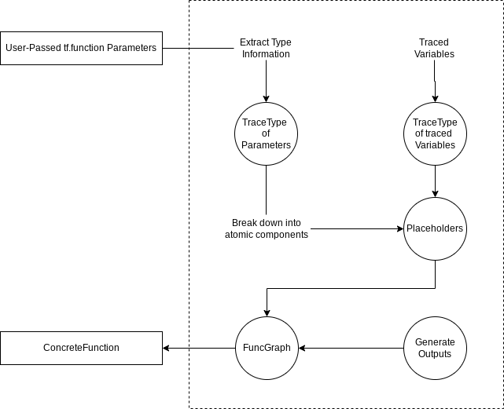

# CompositeTensor Layering for tf.function

| Status        | Proposed       |
:-------------- |:---------------------------------------------------- |
| **RFC #**     | [437](https://github.com/tensorflow/community/pull/437) |
| **Author(s)** | Umer Javed (ujaved@google.com) |
| **Sponsor**   | Faizan Muhammad (fmuham@google.com)                 |
| **Updated**   | 2022-11-17                                           |


## Objective

This document proposes updates to the tf.function tracing API for layering CompositeTensor and removing dependencies on CompositeTensor for  tf.function and its components. It is a part of the tf.function layering effort to reduce the complexity of tf.function and abstract various logic away from tf.function to simplify its mental model.

Scope of this document


*   Updates to tf.function, TraceType, and FuncGraph to Support the layering efforts for CompositeTensors
*   A fluid migration from current code to expected changes from proposed solution
*   Basic implementation proposals with code snippets


## Motivation


### **Goals**


*   Move dependency on CompositeTensor away from tf.function, tracing\_compiler, and func\_graph
*   Reduce the complexity of tf.function by simplifying its mental model and implementation
    *   Users should be able to design a custom Tensor API and be able to trace it with tf.function
    *   Inputs should be dealt as TraceTypes and not individual Tensors or Variables
*   Move dependencies towards TraceTypes for tracing logic and abstract logic to said TraceTypes
    *   `_placeholder_value `
    *   `_destruct_to_graph_io`
    *   `_construct_from_graph_io`
    *   `_cast`


### **Vision**

The vision for this project is a simplified mental model of tf.function and how it handles tracing. Particularly, a function that is wrapped by tf.function should abstract away any dependency on CompositeTensor. Consider the following diagram for creating a ConcreteFunction from a tf.function wrapped function





The ways in which things currently do not uphold this model:


*   <b>Layering Violations:</b> The tracing logic should only rely on the TraceType of composite tensors and input to generate placeholders and not the actual values
*   <b>Input Variance:</b> The tracing logic should not need to deal with the inputs being different depending on the input. Instead, the input should be in the form of TraceType and logic should be abstracted to Tracetypes.
*   **Placeholder Generation: **The placeholder value generation logic should be dealt with by the input (ideally a TraceType) itself and not within the tracing logic.


### **Problems**


*   ConcreteFunction, currently, takes in various types of Tensors, Variables, and TraceTypes and deals with them individually, making the logic very messy
    *   Various uses of `isinstance` to handle logic for different inputs differently
    *   Refer to [this code](https://github.com/tensorflow/tensorflow/blob/f6287e953b19cc1f0a2b8d20b87741a0df6b62eb/tensorflow/python/framework/func_graph.py#L1507) to see an example of the redundant use of `isinstance` within the tracing logic
    *   Encoding and decoding also requires checking for types
*   CompositeTensors are broken down into their atomic parts using tf.nest, making the individual logic within the tracing function messy and redundant.
    *   <b>Placeholders:</b> Placeholders are not abstracted to their individual TraceTypes, resulting in the tracing logic having dependencies on CompositeTensors, TensorSpecs, VariableSpecs, etc. 
    *   Operations used by tf.nest should ideally be handled by the TraceTypes and not the tracing logic


## Background


### **Uses of CompositeTensor, tf.nest, and TypeSpec within tf.function and its codebase**


#### **polymorphic\_function.py**

Currently, when a CompositeTensor has a class method that is the instance of a <code>polymorphic_function.Function<strong> </strong></code>and the <code>CompositeTensor</code> has a <code>type_spec</code>, the method type is returned when <code>\_\_get__</code> is invoked for the polymorphic Function. Refer to [polymorphic\_function.py](https://github.com/tensorflow/tensorflow/blob/f6287e953b19cc1f0a2b8d20b87741a0df6b62eb/tensorflow/python/eager/polymorphic_function/polymorphic_function.py#L1250) on line 1250:


```
if (isinstance(instance, composite_tensor.CompositeTensor) and
     instance._type_spec is not None):
    return types_lib.MethodType(self, instance)
```


Note that this check also requires a `CompositeTensor`. To have a `type_spec` and there is currently a bug to fix the CompositeTensor classes that have no `type_spec` and remove that check for a typespec. 


#### **func\_graph.py**

Within [func\_graph.py](https://github.com/tensorflow/tensorflow/blob/master/tensorflow/python/framework/func_graph.py), when converting a py\_func to a graph\_func, the `args` and `kwargs` are converted to placeholders and added to the func\_graph. When the func\_graph’s structured\_input\_signature is defined, the existing argument structures are converted to signatures (TraceTypes)  on line 1203 where the arguments are encoded by 

<code>def encode_arg(arg, path)</code>. When encoding the arguments to a signature, the argument is specifically checked if it an instance of a <code>CompositeTensor</code> on [line 112](https://github.com/tensorflow/tensorflow/blob/f6287e953b19cc1f0a2b8d20b87741a0df6b62eb/tensorflow/python/framework/func_graph.py#L112)


```
if isinstance(arg, composite_tensor.CompositeTensor):
    # TODO(b/133606651) Do we need to inject arg_name?
    return arg._type_spec  # pylint: disable=protected-access
```


Note that the `type_spec` of the `CompositeTensor` is returned as the encoded argument, specifically to create the signature.

There are also various helper functions for dealing with `CompositeTensors` within func\_graph.py such as 


*   `def flatten(sequence)` on [line 1409](https://github.com/tensorflow/tensorflow/blob/f6287e953b19cc1f0a2b8d20b87741a0df6b62eb/tensorflow/python/framework/func_graph.py#L1409)
*   `def pack_sequence_as(structure, flat_sequence)` on [line 1426](https://github.com/tensorflow/tensorflow/blob/f6287e953b19cc1f0a2b8d20b87741a0df6b62eb/tensorflow/python/framework/func_graph.py#L1426)


#### <strong>monomorphic\_function.py</strong>

Within [monomorphic\_function.py](https://github.com/tensorflow/tensorflow/blob/master/tensorflow/python/eager/polymorphic_function/monomorphic_function.py), there are various helper functions depending on `CompositeTensors` such as


*   `def _structured_signature_check_arg_type(self, arg, spec, name, signature_context)` on [line 1612](https://github.com/tensorflow/tensorflow/blob/8ce3b0a232928fb7fe0860d47fa475be6688054d/tensorflow/python/eager/polymorphic_function/monomorphic_function.py#L1612)
*   `def _call_flat(self, args, captured_inputs, cancellation_manager=None)` on [line 1668](https://github.com/tensorflow/tensorflow/blob/8ce3b0a232928fb7fe0860d47fa475be6688054d/tensorflow/python/eager/polymorphic_function/monomorphic_function.py#L1668)
*   `def output_shapes(self)` on [line 1960](https://github.com/tensorflow/tensorflow/blob/8ce3b0a232928fb7fe0860d47fa475be6688054d/tensorflow/python/eager/polymorphic_function/monomorphic_function.py#L1960)
*   `def output_dtypes(self)` on [line 1969](https://github.com/tensorflow/tensorflow/blob/8ce3b0a232928fb7fe0860d47fa475be6688054d/tensorflow/python/eager/polymorphic_function/monomorphic_function.py#L1969)</code>


#### <strong>function\_spec.py</strong>

References of TypeSpecs such as `ResourceSpec` at


*   `def cast_numpy_inputs(inputs)` on [line 615](https://github.com/tensorflow/tensorflow/blob/8ce3b0a232928fb7fe0860d47fa475be6688054d/tensorflow/python/eager/polymorphic_function/function_spec.py#L615)


#### <strong>Helper files</strong>

There exists a helper file to accommodate the use of `CompositeTensors` and its operations. Refer to [composite\_tensor\_utils.py](https://github.com/tensorflow/tensorflow/blob/master/tensorflow/python/eager/polymorphic_function/composite_tensor_utils.py). 


### **Placeholders**

When creating a placeholder, if <code>def<strong> </strong>func_graph_from_py_func</code> is called with <code>arg_names </code>such as in tracing\_compiler.py, then the arg names are propagated down to the method where placeholders are created and if the argument passed does not contain a name of its own, then the name from arg\_names is assigned to placeholder for that argument. You may be asking why it is necessary to have a user-defined name for a placeholder. In tracing\_compiler.py on [line 203](https://github.com/tensorflow/tensorflow/blob/8ce3b0a232928fb7fe0860d47fa475be6688054d/tensorflow/python/eager/polymorphic_function/tracing_compiler.py#L203) when getting the garbage collected concrete function, it expects the placeholders to have a <code>"_user_specified_name"</code> which is created when a placeholder has a name. 

Another thing to note about placeholders is that for Variables and VariableSpecs, the placeholders are not returned but instead the argument itself. Instead, the Variable’s handle is captured to ensure that placeholders are not duplicated for the same Variable.


### **Current implementation**

Currently, when a user-defined function is wrapped with tf.function, unless an input\_signature is specified, the inputs are passed in as Tensors or Variables. Specifically, when creating a monomorphic ConcreteFunction in TracingCompiler, the arguments to the tf.function and their respective names are passed to FuncGraph.

When a CompositeTensor is passed to tf.function, during the ConcreteFunction creation, the CompositeTensor is broken down into its atomic components with `composite_tensor_utils.flatten_with_variables_or_variable_specs` before a placeholder is created for each atomic component. The atomic components are then combined and flattened before being assigned as the FuncGraph’s inputs. Refer to the following steps that occur


1. Input arguments and argument names are passed to FuncGraph for generating a ConcreteFunction. 
2. The arguments are broken down into their atomic components (Variables or Tensors) and placeholders are generated for each component using CompositeTensor helper libraries and tf.nest
3. Resources Tensors are added to the FuncGraph as resource\_tensor\_inputs
4. The arguments are converted to their signatures (TraceTypes) and flattened
5. Traced variables are captured by their handle to deal with placeholder duplication
6. The outputs are generated and converted to tensors and captured for outputs
7. The FuncGraph is returned

As a result, it is clear that the majority of the logic that uses CompositeTensor inputs is for placeholder generation and with their TraceType.


## Proposed Solution


### **Move all dependencies on CompositeTensor for func\_graph away from and towards TraceType**

Note that all <code>CompositeTensors<strong> </strong></code>have a <code>type_spec<strong> </strong></code>as their TraceType. Hence, all the logic within <code>polymorphic_function.Function</code> really only requires the TraceTypes of the inputs. 


### **Abstracting Placeholder logic away from func\_graph**

func\_graph.py currently relies on checking for specific TypeSpec subclasses independently via `isinstance` to create placeholder values which includes dependencies on Tensors, TypeSpec, CompositeTensors, etc. Instead, the creation of placeholders will be done by the member function of all TraceTypes `def _placeholder_value(self)` which is an abstracted implementation. Note that the CompositeTensor can be broken down into its atomic components with TraceTypes of TensorSpec and VariableSpec.

However, there are cases where different TraceTypes are handled differently when creating a FuncGraph. VariableSpecs currently need to keep track of `alias_id` which is used to trace Variables and prevent duplicate placeholder creation for same Variables. FuncGraph, to avoid this duplication, captures the Variable’s handle. A solution to this issue is the introduction of a `PlaceholderContext` container class. Consider the following snippet of code,


```
class PlaceholderContext(metaclass=abc.ABCMeta):
    """Contains information for scoping placeholders in a   FunctionType.

    `PlaceholderContext` is a container class for flags and mappings that contain information of mapped placeholders and their attributes. Different TraceTypes (__tf_tracing_type__) require different information for generating a placeholder. This context will be shared across all _placeholder_value calls when constructing a placeholder for a TraceType.
    """
    pass
```


```
class InternalPlaceholderContext(trace.PlaceholderContext):
    """Container for mappings shared across all calls to _placeholder_value."""

    def __init__(self):
        self._alias_id_to_placeholder = {}

    def has_placeholder(self, alias_id: Hashable) -> bool:
        if alias_id in self._alias_id_to_placeholder:
            return True
        return False

    def get_placeholder(self, alias_id: Hashable) -> Hashable:
        if not self.has_alias_id(alias_id):
            raise KeyError(f"key: {alias_id} not found in this instance of placeholder context.")
        return self._alias_id_to_placeholder[alias_id]

    def add_placeholder(self, alias_id: Hashable, placeholder: Hashable) -> None:
        if alias_id in self._alias_id_to_placeholder:
            raise KeyError(f"alias id: {alias_id} is already stored in this instance of placeholder context.")
        self._alias_id_to_placeholder[alias_id] = placeholder
```


This `InternalPlaceholderContext` class contains a dictionary named  `self._alias_id_to_placeholder` which keeps track of which Variable within the function has been traced and to reuse placeholders when the same `alias_id` is traced. This also means that Variables no longer need to be captured by their handle.

With the implementation of `InternalPlaceholderContext`, an implementation of 

`def _placeholder_value(self)` for VariableSpec can now work. Consider the following implementation of `def _placeholder_value(self)` for VariableSpec,	


```
def _placeholder_value(self, placeholder_context):
    if self.alias_id is None:
        raise NotImplementedError(f"VariableSpec._placeholder_value doesn't "
        f"support alias_id=None, got self: {self}.")
    if not self.name and placeholder_context.has_name():
        self.name = placeholder_context.get_name()
    # Reuse placeholder for variables traced multiple times
    if placeholder_context.has_alias_id(self.alias_id):
        return placeholder_context.get_placeholder(self.alias_id)
    placeholder = graph_placeholder(self.dtype, self.shape, self.name)
    if self.name:
        placeholder.op._set_attr(
         "_user_specified_name",
         attr_value_pb2.AttrValue(s=compat.as_bytes(self.name)))
    placeholder_context.add_placeholder_from_alias_id(
        self.alias_id, placeholder)
    return placeholder
```


With the `PlaceholderContext`, we can also implement the `placeholder_value` implementation for TensorSpec. Consider the following implementation of `TensorSpec._placeholder_value(self)`


```
def _placeholder_value(self, placeholder_context):
    """Generates a graph_placholder with the given TensorSpec information."""
    requested_name = self.name
    try:
        placeholder = graph_placeholder(
            self.dtype, self.shape, name=requested_name)
    except ValueError as e:
        # Sometimes parameter names are not valid op names, so fall back to
        # unnamed placeholders.
        logging.warning(e)
        placeholder = graph_placeholder(self.dtype, self.shape)
    if requested_name is not None:
        # Record the requested/user-specified name in case it's different than
        # the uniquified name, for validation when exporting signatures.
        placeholder.op._set_attr(
            "_user_specified_name",
            attr_value_pb2.AttrValue(s=compat.as_bytes(requested_name)))
    return placeholder
```


     

Once each TraceType has an implementation of \_placeholder\_value, FuncGraph can call `TraceType._placeholder_value(self, placeholder_context)` to generate the graph placeholder value without any direct dependency to any Tensor type or any specific TraceType but only the generic TraceType.

With the implementation of the Atomic TraceTypes of a CompositeTensor, we can implement a generic `def _placeholder_value(self) `for TypeSpec (TraceType of CompositeTensor) as such:

```
def _placeholder_value(self, placeholder_context):
    component_placeholders = tf.nest.map_structure(
        lambda x: x_placeholder_value(placeholder_context), 
        self._component_specs) 
    return self._from_components(component_placeholders)
```

This generic implementation works recursively by going through each of the TypeSpec’s components and getting the placeholders for that component. By doing so, a `CompositeTensor` can be traced and placeholders can be generated without knowing that it is a `CompositeTensor`.

With the proposed changes, func\_graph.py can now be abstracted to only depend on TraceType. Now, since only the TraceType is dealt with and with the help of the `PlaceholderContext`, the function that creates placeholders can be reduced from

```
def _get_defun_input(arg, name):
    """Maps a python function arg to a graph-construction input."""
    func_graph = ops.get_default_graph()
    if isinstance(arg, (ops.Tensor, tensor_spec.TensorSpec)):
        arg_is_spec = isinstance(arg, tensor_spec.TensorSpec)
        if arg_is_spec and arg.name:
            requested_name = arg.name
        else:
            requested_name = name
        try:
            placeholder = graph_placeholder(
                arg.dtype, arg.shape, name=requested_name)
        except ValueError as e:
            # Sometimes parameter names are not valid op names, so fall back to
            # unnamed placeholders.
            logging.warning(e)
            placeholder = graph_placeholder(arg.dtype, arg.shape)
        if not arg_is_spec:
            handle_data_util.copy_handle_data(arg, placeholder)
        if name is not None:
            # Record the requested/user-specified name in case it's different than
            # the uniquified name, for validation when exporting signatures.
            placeholder.op._set_attr(
            "_user_specified_name", 
            attr_value_pb2.AttrValue(s=compat.as_bytes(requested_name)))
        return placeholder
    # TODO(b/246437883): Investigate how to remove this branch.
    elif isinstance(arg, (resource_variable_ops.BaseResourceVariable,
                       resource_variable_ops.VariableSpec)):
        if isinstance(arg, resource_variable_ops.VariableSpec):
            name = arg.name or name
            with func_graph.outer_graph.as_default():
                placeholder = graph_placeholder(dtypes.resource, [], name=name)
                # TODO(b/246438937): Replace this with nest.pack_sequence_as after we
                # can expand Variables.
                arg = resource_variable_ops.ResourceVariable(
                    shape=arg.shape,
                    dtype=arg.dtype,
                    handle=placeholder,
                    trainable=arg.trainable)

        # Capture arg variables to create placeholders for them. These will be
        # removed as captures after the function is traced (since otherwise we'd
        # just add it back with a new placeholder when the variable was referenced).
        placeholder = func_graph.capture(arg.handle, name=name)
        placeholder.op._set_attr(
            "_user_specified_name",
            attr_value_pb2.AttrValue(s=compat.as_bytes(name)))
        return arg
    else:
        return arg
```
To the following,

```
def _get_defun_input(arg, placeholder_context):
    """Maps a python function arg to a graph-construction input."""
    return arg._placeholder_value(placeholder_context)
```
The last step to take into account is when Variables that are not inputs are traced within the function. Because the PlaceholderContext keeps track of the `alias_ids` that have been traced, we can use the PlaceholderContext to generate new placeholders if the tf.Variable was not created inside the current graph or, if the Variable was already traced, and return the placeholder value associated with that `alias_id`.


### **Deconstruct to graph io**

The purpose of `_deconstruct_to_graph_io` is to break a complex/composite tensor into its atomic components. The composite\_tensor\_util library has a method called `composite_tensor_utils.flatten_with_variables_or_variable_specs`
that breaks a value into its atomic components

```
def _deconstruct_to_graph_io(self, value):
    return composite_tensor_util.flatten_with_variables_or_variable_specs(value)
```


### **Construct from graph io**

The purpose of `_construct_from_graph_io` is to pack flattened variables and tensors back to their original form such as a composite tensor or any other complex tensor. The idea here is to pass in an iterable with the flattened atomics and recursively obtain values from the iterable depending on the number of components a TypeSpec has
```
def _construct_from_graph_io(self, iterator):
    # base case is when the Spec is an atomic TraceType
    if isinstance(self, TensorSpec) or isinstance(self, VariableSpec):
        return iterator.next() 

    components = tf.nest.map_structure(
        lambda x: x._construct_from_graph_io(iterator), 
        self._component_specs)
      
   return self._from_components(components)
```
Note, this function expects the Spec to have the correct number of atomics.

### **Casting**

A method in TraceType `_cast`, that takes a value and `casting_context`, and converts value to necessary tf.types. We employ rules on what's allowed and not allowed.


*   Cast numpy array to Tensors
*   CompositeTensors recursively call \_cast on its components
*   TraceType call `_cast` on its components
*   `casting_context` may require some information

The value passed will be converted to the TraceType that \_cast is being called from. For example, Calling cast from TensorSpec will return a value that is a Tensor. Furthermore, only TensorSpec will support casting from a numpy array. An example pseudocode implementation of `_cast` for TensorSpec with a numpy array


```
def _cast(self, value, casting_context):
   if value is numpy_array:
      value = numpy_to_tensor(value)
   else:
      value = ops.convert_to_tensor(value)
   
   ...
   
   return value
```


For more details on how the conversion occurs, refer to the existing casting code within FunctionType on [line 615](https://github.com/tensorflow/tensorflow/blob/259becca3d3a93f280d8ec920d4c3a1541f4df3c/tensorflow/python/eager/polymorphic_function/function_spec.py#L615) or [line 649](https://github.com/tensorflow/tensorflow/blob/259becca3d3a93f280d8ec920d4c3a1541f4df3c/tensorflow/python/eager/polymorphic_function/function_spec.py#L649) for non-numpy inputs.


## Future Possibilities


### **Push arg names assignment up the call stack and eventually remove them**

With the layering of CompositeTensors and dependency only on TraceType, tf.function can assign naming to the inputs higher in the class stack and not in the FuncGraph tracing logic. This reduces complexity and opens a possibility to remove argument names more easily without breaking tracing logic. Note that currently


*   Arguments names are assigned at the placeholder level which makes it difficult to remove user-specified names
*   Proposed solution moves argument name assignment to the tracing logic and away from placeholder logic via a transformation function
*   TracingCompiler relies on user-specified argument names to create a ConcreteFunction proposal (refer to [line 203](https://github.com/tensorflow/tensorflow/blob/259becca3d3a93f280d8ec920d4c3a1541f4df3c/tensorflow/python/eager/polymorphic_function/tracing_compiler.py#L203))


### **Introduction of new CompositeTensor APIs or custom tensor APIs**

With the implementation of TraceType placeholders, creating graph IOs, and casting, the API opens up possibilities for introducing new types of Tensors or Variables without having to change the tf tracing logic. Particularly, if the TraceType is implemented, the tracing logic would use the TraceType to construct its placeholders within the Function Graph. With the proposed solution, implementing new Tensor types with tf.function will become much more streamlined both for Google, internally, and users.


### **TraceType uses by TracingCompiler**

Once dependencies are removed from FuncGraph, TracingCompiler can be updated to deal with only TraceTypes instead of values directly.


# **Alternatives Considered**


*   Create a utility library to handle all the logic discussed in the proposed solution.
    *   Making changes to placeholders will still not be trivial as type checking will still occur but within the library
    *   Making changes to CompositeTensors will not be trivial as instead of tf.function depending on it, the util library will
*   For construct and deconstructing graph IOs, create a mapping function that iterate over values given a TraceType to construct and deconstruct values
    *   Would not work for new Tensor APIs that may be introduced that do not follow the mapping protocol and rules.
    