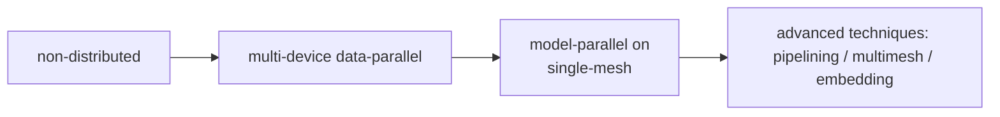

# A new TensorFlow Distribution API with DTensor

Status                    | (Proposed / Accepted / Implemented / Obsolete)
:------------------------ | :---------------------------------------------
**RFC #**                 | [NNN](https://github.com/tensorflow/community/pull/NNN) (update when you have community PR #)
**Author(s)**             | Yu Feng(feyu@google.com), Bruce Fontain (bfontain@google.com) Yuefeng Zhou(yuefengz@google.com) Scott
Zhu (scottzhu@google.com) |
**Sponsor**               | A N Expert (whomever@tensorflow.org)
**Updated**               | 2023-02-21

## Objective

The new TensorFlow Distribution API extends the TensorFlow Core API, such as
tf.Variable, tf.function, and tf.Module with distributed tensor computation.

The low level component of the Distribution API, built with DTensor, provides a
uniform SPMD semantics across CPU, GPU, and TPU device types. DTensor is an
intrinsic part of TensorFlow that defines a representation of distributed
Tensors with Mesh and Layout data structures. Users and high level libraries
(such as Keras) can depend on Mesh and Layout just as other components of the
TensorFlow low level API. An initial experimental implementation is covered here
(on TensorFlow.org): DTensor Concepts; DTensor ML Tutorial; DTensor Keras
Tutorial

This RFC defines the integration between TensorFlow and DTensor, the low level
of TensorFlow's Next generation Distribution API. DTensor defines a uniform and
generic API for composing distributed TensorFlow programs for accelerator types
supported by TensorFlow. Common distribution patterns in machine learning,
including data and model parallelism, spatial partitioning, and pipelining can
all be expressed with primitives offered in this RFC. A very basic form of
interoperability with other ML frameworks, such as JAX is also supported in the
API described in this RFC. This document also demonstrates a potential path for
integration with the Keras modeling primitives in the form of DTensorStrategy, a
new subclass of `tf.distribute.Strategy`.

## Disclaimer

This is a draft RFC, API endpoints in this document are not final. This document
may refer to but does not cover the following topics for which we expect follow
on RFCs:

*   Keras integration

*   Saved Model/C++ API

*   Automatic sharding

*   Mixed use of DTensor and non-DTensor execution in tf.functions

*   tf.data integration

*   Representation of DTensor primitives in the TF Graph

## Glossary

Distributed Tensor: A Tensor that is distributed to multiple devices. A
Distributed Tensor can be viewed as a single Tensor, in the **'Global
Perspective'**; or in the **'Local Perspective'**, as a collection of Tensors,
one per device.

The 'Global Tensor Perspective' and the 'Local Tensor Perspective' are related
by DTensor's Layout and Mesh, which are defined below. A distributed Tensor can
be 'shard', 'replicated', or a hybrid of both, although sometimes the
terminology 'shard' is used interchangeably with 'distribute'.

*   **Mesh**: A cartesian grid of devices. The dimensions of the grid are named.
    The following example is a 2 by 3 mesh on 6 CPU devices.

```python
mesh = tf.dtensor.Mesh({'x': 2, 'y' : 3}, devices=[
    'CPU:0', 'CPU:1', 'CPU:2',
    'CPU:3', 'CPU:4', 'CPU:5'])
```

*   **Layout**: A list of sharding specifications. A sharding specification is a
    string that controls how an axis of Tensor is distributed. The axis can be
    either sharded to a mesh dimension, or replicated. A sharded axis is always
    associated with a mesh dimension. The Global Perspective Tensor is evenly
    split along all of the sharded axes. Each segment of the split becomes a
    Local Perspective Tensor component. A replicated axis is not associated with
    a mesh dimension. The axis is present in all of the Local Perspective Tensor
    components. For example, on the 2 by 3 mesh defined above,

```python
tf.Tensor(shape=[5, 4, 6],
       layout=tf.dtensor.Layout([tf.dtensor.Mesh.UNSHARDED, 'x', 'y'], mesh))
```

The Global Perspective Tensor has a shape of `[5, 4, 6]`. The 6 components in
the Local Perspective all have the shape of `[5=5, 2=4//2, 2=6//3]`.

### Runtime Architectures:

The Distribution API supports the following runtime architectures:

*   Local mode: 1 local Process with multiple (local) accelerator devices.

*   Multi-client Distributed mode: N Processes each with one or more local
    accelerator devices, running identical programs. The user application runs
    as the N processes, which are also called clients. A typical example of a
    multi-client mode is a multinode system, where one or more processes are
    launched per machine (node).

*   Single-controller Distributed mode: 1 Process as the Controller + N generic
    Processes as Workers. Each worker has one or more local accelerator devices.
    The user application runs as the controller that coordinates the workers. A
    typical example of a single-controller mode is to deploy the controller to
    an external machine with a slower connection to a cluster that runs N of the
    workers.

## Design Proposal

### Data Structures: tf.dtensor.Mesh and tf.dtensor.Layout

Mesh and Layout defines how a Tensor is distributed by the Distribution API.
Mesh provides the abstraction for the topology of devices. Layout defines the
policy that a Tensor is distributed to a mesh.

```python
class tf.dtensor.Mesh:
  def __init__(self,
               dims: OrderedDict[str, int],
               devices: List[Union[str, tf.DeviceSpec]]):
    """Creates a device Mesh.
    Args:
      dims: Dict for the dimension names and the sizes of the
        dimensions. e.g. {'x':3, 'y':2} creates a 3 by 2 mesh.
      devices: a list of device names.
        This is the global list of devices across all clients.
        len(devices) shall equal to the product of the mesh sizes.
    """

  @classmethod
  def distributed(cls, dims, devices):
    """Create a device Mesh that is evenly distributed across all clients.
    Args:
      dims: Dict for the dimension names and the sizes of the
        dimensions. e.g. {'x':3, 'y':2} creates a 3 by 2 mesh.
      devices: a list of device names.
        This is the client-local list of devices. A global list
        is constructed by using the same list of devices on each client.
        e.g. ["GPU:0"] creates a mesh that uses "GPU:0" from all
        clients.
    """
```

```python
class tf.dtensor.Layout(LayoutLike):
  def __init__(self,
               sharding_spec: List[str],
               mesh: tf.dtensor.Mesh):
    """Create a Layout.
    Args:
      sharding_spec: a list of sharding specifications.
        Sharding specifcation is a string, either refers to a
        dimension name, indicating an axis
        is sharded to the corresponding mesh dimension, or UNSHARDED,
        indicating the axis is replicated.
        When sharding_spec is shorter than the rank of the Tensor, the
        additional axes are treated as UNSHARDED.
      mesh: the mesh of this Layout.
    """
```

```python
class tf.dtensor.XlaOpSharding(LayoutLike):
  def __init__(self, op_sharding: `Xla.OpSharding`,
               mesh: Optional[tf.dtensor.Mesh]):
    """Create a Layout from an XLA OpSharding specification.

    OpSharding is used in XLA by gSPMD and JAX. The sharding style
    directly defines how a Tensor is sharded to a list of devices.
    This constructor is provided to simplify the interporation with
    these sharding systems. A DTensor mesh can be either provided or
    created automatically based on the provided OpSharding.
    (e.g. jax.OpShardingSharding).

    Args:
       op_sharding: An Xla OpSharding protobuf message.
         Only some forms of XLA OpSharding are supported by DTensor.
         Type 3 (OTHER) is partially supported.
         An unsupported OpSharding raises a ValueError.
       mesh: If provided, attempt to create a layout for the mesh. If
        no compatible layout can be found, raise ValueError.
        If not provided, returns any layout that satisifies the OpSharding spec.
        The returned layout may change in future versions.
    """
```

### Distribution API and tf.function

Eagerly invoked tf.function is the unit of execution by the Distribution API
(note: Since TensorFlow 2.9 Eager Operations also run as functions). When a
tf.function is executed by the Distribution API, the following behaviors are
observed:

*   Non-DTensor input arguments are converted to distributed Tensor values with
    replicated layouts. If such conversion is unsafe (e.g. at risk of consuming
    large amounts of memory), a TypeError is raised that directs the user to
    explicitly perform the conversion. This conversion is commonly referred to
    as autobroadcast.

*   TensorFlow/DTensor SPMD expansion passes lower the function body to post
    SPMD functions suitable for execution for devices listed in the Mesh.

*   SPMD expansion ignores the tf.device annotations inside the tf.function
    body. relayout copies a Tensor between Meshes, offering an equivalent
    functionality to tf.device annotations when Mesh with a single device is
    used.

### Tensor Creation

When used eagerly, the following TensorFlow API functions create a DTensor with
the provided layout, and a non-DTensor if the layout argument is omitted. In a
tf.function, the layout will be respected if set, otherwise it will be
determined by the Distribution API.

The new Layout argument is appended to the end of the argument list, after the
optional `name` argument to maintain backward compatibility.

```python
def tf.zeros(shape, dtype=dtypes.float32, name=None,
             layout: Optional[tf.dtensor.LayoutLike])
def tf.ones(shape, dtype=dtypes.float32, name=None,
            layout: Optional[tf.dtensor.LayoutLike])
def tf.fill(dims, value, name: Optional[str],
            layout: Optional[tf.dtensor.LayoutLike])
def tf.zeros_like(param, dtype=dtypes.float32, name=None,
                  layout: Optional[tf.dtensor.LayoutLike])
def tf.ones_like(param, dtype=dtypes.float32, name=None,
                 layout: Optional[tf.dtensor.LayoutLike])
```

```python
def tf.random.stateless_random_uniform(shape, seed, minval=0, maxval=None,
        dtype=dtypes.float32, name=None,
        layout: Optional[tf.dtensor.LayoutLike])
def tf.random.stateless_random_normal(shape, seed, minval=0, maxval=None,
        dtype=dtypes.float32, name=None,
        layout: Optional[tf.dtensor.LayoutLike])
def tf.random.stateless_random_truncated_normal(shape, seed,
        minval=0, maxval=None, dtype=None, name=None,
        layout: Optional[tf.dtensor.LayoutLike])
```

The list is non-exhaustive.

### Data transfer/reformatting

Refer to the relayout rules section for more information on source Layout and
destination Layout. Note that these operations support tf.GradientTape.

```python
def tf.dtensor.relayout(source: tf.Tensor,
                mesh_or_layout: Union[LayoutLike, Mesh]):
  """Makes a copy of source to the new layout or mesh.

  If a mesh is provided, preserve sharding specifications of the source.
  If the sharding specifications refers to any dimension names,
  the destination mesh and the source mesh shall have the
  same shape and dimension names.
  """
```

```python
def tf.dtensor.relayout_like(source: tf.Tensor,
    reference: tf.Tensor,
    use_mesh_only: Bool=False):
  """Makes a colocation copy of source according to Layout of reference.

  If use_mesh_only is True, use the mesh of reference_tensor,
  preserve the sharding specifications.
  If use_mesh_only is False, use the layout of the reference_tensor.

  Example:

    >>> a = tf.ones((16, 3), layout=Layout([], mesh1))
    >>> x = tf.ones((4, 3), layout=Layout(['batch'], mesh2))
    >>> y = tf.dtensor.relayout_like(a, reference=x)
    >>> z = tf.dtensor.relayout_like(a, reference=x, use_mesh_only=True)

  y is batch sharded on mesh2, z is replicated on mesh2.
  """
```

### Distributed Variable

`tf.Variable` gains an additional argument to create distributed Variable.

```
def tf.Variable(initial_value,
                shape: Optional[],
                dtype=None,
                ...,
                layout: Optional[Layout]):
  """Creates a Variable.
  The only new argument is layout.
  Args:
    layout:
      If provided, declares the Layout of the Tensor this Variable
      intends to hold.
      read() and assign() methods produce / consume distributed
      tensors of the provided layout. An ValueError is raised if
      the layout differs from the Variable's.
      If None, use the layout of initial_value, or creates a
      Variable that holds a non-distributed Tensor.
  """
```

### Global and Local Perspective

Currently, the functions for converting between Global and Local perspective
Tensors is only supported eagerly. Following the traditions of TensorFlow,
`pack` and `unpack` are not added as member methods of the `Tensor` class, but
as module functions under the dtensor namespace.

```python
attr tf.Tensor.layout(self) -> Optional[Layout]:
  """The layout of a DTensor, or None."""
```

```python
def tf.dtensor.pack(
                   component: Sequence[Tensor],
                   layout: Layout) -> Tensor:
  """Creates a distributed tensor from Local Perspective components.
  Args:
    components: a list of Tensors to become the components of the
    distributed Tensor.
    Note: Copies the component Tensors to the mesh devices if needed.
  """
```

```python
def tf.dtensor.unpack(dtensor) -> List[Tensor]:
  """Extracts Local Perspective components from a distributed Tensor.

  Returns:
    A list of Tensors, one per device, that contains the
    local data on that device.

  Raises:
    ValueError if tensor is not a distributed Tensor.
  """
```

### Summary of Changes to TensorFlow Python API

Changes to the tensorflow namespace:

*   Addition of new layout argument to many tensor creation methods (e.g.
    tf.ones, tf.Variable).
*   Addition of new methods in tf.Tensor type: Tensor.layout.

New APIs added to tf.dtensor:

*   tf.dtensor.relayout
*   tf.dtensor.pack
*   tf.dtensor.unpack
*   tf.dtensor.Layout
*   tf.dtensor.Mesh
*   tf.dtensor.XlaOpSharding

## Examples and API User Journey

**A Typical Path For Scaling Up:**



With the new Distribution API, all of these can be implemented with the same set
of primitives.

### Starting example: a typical non-distributed Training Loop

This example follows the well-lit path for training a model with TensorFlow Core
API, using a custom training loop. In the next sections, this example will be
expanded to demonstrate applying TensorFlow's new Distribution API.

```python
# Starting example: a single-device Training Loop

class Model(tf.keras.Model):
  def __init__(self):
     self.var = tf.Variable(initial_value_fn=...)
     self.embedding_layer = keras.EmbeddingLayer(...)

  def call(self, x):
     …
     t = BatchNorm()(t)
     …
     return y


model = Model()
optimizer = tf.keras.optimizers.SGD()
metric = tf.keras.metrics.Sum()

dataset = tf.data.Dataset(['0.txt', '1.txt', …]).batch(batchsize=32)

def train_step(item):
  x, y = item
  with tf.GradientTape() as tape:
    y_pred = model(x)
    loss, metric_update = ...
  metric.update(metric_update)

  g_var = tape.gradient(model.var)
  optimizer.apply_gradients(zip(g_var, model.var))

for _ in range(NUM_EPOCHS):
  dataset_iter = iter(dataset)
  for _ in range(0, STEPS_PER_EPOCH, nsteps):
    train_step(next(dataset_iter))
  print(metric)
```

### Example for Simple Data and Model Parallel Training

An advantage of the new Distribution API is that data and model parallel
training are programmed uniformly via a single API. In the examples, the
available devices are arranged into a rank 2 Mesh, with one dimension for the
data parallelism, and the other dimensions for the model parallelism. Pure data
parallelism is achieved when the model parallel dimensions of the mesh is
omitted or of size 1 (e.g. mesh of shape 4x1 is a four way data parallelism
mesh).

Note the following changes comparing to the single-device (non-distributed)
case:

*   An iterable is created from a dataset object representing the full input
    dataset (`ALL_DATA_FILES`). The iterable yields distributed tensors for the
    global training, constructed by concatenating multiple elements of the input
    dataset along a mesh axis.
*   The right panel of the examples demonstrate the direct use of the low level
    Distribution API.
*   The left panel demonstrates a potential high level tf.distribute class
    ‘DTensorStrategy’ along with a potential Keras integration. The interaction
    with Keras demonstrated in the left panel is only a vision of how things may
    work, but not a binding design.

<table>
<tr>
<th>Phase</th>
<th>High Level API Example: Keras and DTensorStrategy  </th>
<th>Low Level API Example: DTensor and from-scratch tf.Module </th>
</tr>

<tr>
<td></td>
<td valign="top"></td>
<td valign="top"></td>
</tr>

<tr>
<td>Model Definition</td>
<td valign="top">

```python

# Variable layouts are set after the model/layer instantiation.

class Model(tf.keras.Model):
  def __init__(self):
    self.var = tf.Variable(tf.random.uniform,
                           shape=(30, 30),
                           dtype=tf.float32)
    self.embedding_layer = tf.keras.Embedding(
                               vocab_size=1000,
                               embedding_dim=30)

  def call(self, x):
    …
    t = self.embedding_layer(ind)
    t = BatchNorm(sync=False)(t)
    …
    return y

```

</td>
<td valign="top">

```python

# Variable layouts are set during the model instantation

class Model(tf.Module):
  # Note the additional mesh argument.
  def __init__(self, mesh):
    self.var = tf.Variable(tf.random.uniform,
                           shape=(30, 30),
                           dtype=tf.float32,
                           layout=tf.dtensor.Layout(UNSHARDED, mesh))
    self.table = tf.Variable(
                           tf.random.uniform,
                           shape=(1000, 30),
                           dtype=tf.float32,
                           layout=tf.dtensor.Layout(['model'], mesh))

  def call(self, x):
    …
    t = tf.gather(ind, table)
    t = tf.batch_norm(sync=False)(t)
    …
    return y

class CustomSGDOptimizer(tf.Module):
  def __init__(self, model):
    self.vars = model.trainable_variables
    self.momentum_slots = [tf.Variable(tf.zeros_like(var))
                  for var in self.vars]
    ...
  def apply(self, grads):
    ...
```

</td>
</tr>

<tr>
<td></td>
<td valign="top"></td>
<td valign="top"></td>
</tr>

<tr>
<td>Model Instantiation</td>
<td valign="top">

```python

mesh = tf.dtensor.Mesh(
    dims=[('batch', 4), ('model', 2)],
    devices=['TPU:i' for i in range(8)])

mp = tf.distribute.DTensorStrategy(default_mesh=mesh, batch_dim='batch',
    layout_map=tf.LayoutMap({"v.*": tf.dtensor.Layout(...)}))

with mp.scope():
  model = Model()
  optimizer = tf.keras.optimizers.SGD()
  metric = tf.keras.metrics.Sum()

```

</td>
<td valign="top">

```python

mesh = tf.dtensor.Mesh(
    dims=[('batch', 4), ('model', 2)],
    devices=['TPU:i' for i in range(8)])

model = Model(mesh)
optimizer = CustomSGDOptimizer(model)
# TensorFlow creates a DTensor Variable when there is a layout argument.
metric = tf.Variable(tf.zeros((),
                     layout=tf.dtensor.Layout(UNSHARDED, mesh))

```

</td>
</tr>

<tr>
<td></td>
<td valign="top"></td>
<td valign="top"></td>
</tr>

<tr>
<td>Dataset</td>
<td valign="top">

```python

ALL_DATA_FILES = [f"{i}" for i in range(128)]

# A standard tf.distribute dataset function.
def dataset_fn(context):
  # shard input data according to the context
  LOCAL_DATA_FILES = ALL_DATA_FILES[...]
  dataset = tf.data.SSTableDataset(LOCAL_DATA_FILES)
  dataset = dataset.batch(64)
  return dataset

dataset = mp.distribute_dataset_from_fn(dataset_fn)

# global batch size is 64 * mesh.dim_size('batch') = 128

```

</td>
<td valign="top">

```python

ALL_DATA_FILES = [f"{i}" for i in range(128)]

dataset = tf.data.SSTableDataset(ALL_DATA_FILES)
dataset = dataset.batch(32)

dataset = tf.create_dtensor_iterable(
    dataset,
    element_layouts=Layout(['batch', 'unsharded'], mesh),
    batch_dimension='batch',
    num_elements_per_batch=8)

# global batch size is 32 * 8 = 128

```

</td>
</tr>

<tr>
<td></td>
<td valign="top"></td>
<td valign="top"></td>
</tr>

<tr>
<td>Training</td>
<td valign="top">

```python

@tf.function
def train_step(x, y):
  with tf.GradientTape() as tape:
    y_pred = model(x)
    loss, metric_update = ...
  metric.update(metric_update)

  g_var = tape.gradient(model.vars)
  optimizer.apply_gradients(zip(g_vars, model.vars)))

# The more standard training loop inside a tf.function also
# works.
for _ in range(NUM_EPOCHS):
  for _ in range(0, STEPS_PER_EPOCH):
    result = mp.run(train_step, next(dataset_iter))

```
</td>
<td valign="top">

```python

@tf.function
def train_step(x, y):
  with tf.GradientTape() as tape:
    y_pred = model(x)
    loss, metric_update = ...
  metric.assign_add(metric_update)

  g_var = tape.gradient(model.vars)
  optimizer.apply_gradients(zip(g_vars, model.vars)))


for _ in range(NUM_EPOCHS):
  for _ in range(0, STEPS_PER_EPOCH):
    result = train_step(iter(global_dataset))
```

</td>
</tr>

<tr>
<td></td>
<td valign="top"></td>
<td valign="top"></td>
</tr>
</table>

### Example for Distributed Embedding

The new Distribution API also offers a uniform API for distributed embeddings.
For distributed embeddings, the embedding table variable can be on a different
mesh than the primary computational mesh. One such placement would be on a
submesh of the main computational mesh (in order to manually spread embedding
tables among devices).

This API can potentially be extended to represent embedding using special
embedding devices. These devices can be colocated with the computation hosts, or
remote (like ParameterServer). The design will be addressed in an extension RFC.

<table>
<tr>
<th>Phase</th>
<th>Distributed Embedding Example: Keras and Strategy</th>
<th>Distributed Embedding Example: Low Level DTensor</th>
</tr>

<tr>
<td></td>
<td valign="top"></td>
<td valign="top"></td>
</tr>

<tr>
<td>
Mesh definition
</td>
<td valign="top">

```python

mesh = tf.dtensor.Mesh(
    dims=[('batch', 4), ('model', 2)],
    devices=['GPU:i' for i in range(8)])

# Mesh for the embedding tables
embedding_mesh = tf.dtensor.Mesh(
    dim=[('embedding', 2)],
    devices=["/worker:0/GPU:0", "/worker:0/GPU:1"])

```

</td>
<td valign="top">

```python

mesh = tf.dtensor.Mesh(
    dims=[('batch', 4), ('model', 2)],
    devices=['GPU:i' for i in range(8)])

# Mesh for the embedding tables
embedding_mesh = tf.dtensor.Mesh(
    dim=[('embedding', 2)],
    devices=["/worker:0/GPU:0", "/worker:0/GPU:1"])

# Support for ParameterServer will arrive later.
# embedding_mesh = tf.dtensor.Mesh(
#    dims=[('embedding', 2)],
#    devices=['/ps:0/cpu:0', '/ps:1/cpu:0']))

```

</td>
</tr>

<tr>
<td></td>
<td valign="top"></td>
<td valign="top"></td>
</tr>

<tr>
<td>Model Definition</td>
<td valign="top">

```python

class Model(tf.keras.Model):
  def __init__(self):
    self.embedding_layer = tf.keras.layers.Embedding(
        vocab_size=1000, embedding_dim=30)


  def call(x):
    ind, img, ... = x
    t = self.embedding_layer(ind)   # Runs on embedding devices
    t = tf.batch_norm(sync=False)(t)  # Runs on accelerators
    ...
    return y

```

</td>
<td valign="top"></td>

```python

class Model(tf.Module):
  def __init__(self, mesh, embedding_mesh):
    self.table = tf.Variable(
        tf.random.uniform,
        shape=(1000, 30),
        layout=tf.Layout(['unsharded', 'embedding'],
                         mesh=embedding_mesh))

  def call(self, x):
    ind, img, ... = x
    t = tf.gather(ind, self.table)  # Runs on embedding devices
    t = tf.dtensor.relayout_like(t, img)
    t = tf.batch_norm(sync=False)(t)  # Runs on accelerators
    ...
    return y
```
</tr>

<tr>
<td></td>
<td valign="top"></td>
<td valign="top"></td>
</tr>

<tr>
<td>Model Instantiation</td>
<td valign="top">

```python

with mp.scope():
  model = Model()
  ...
layout_map = tf.LayoutMap(
    {"embedding": tf.dtensor.Layout(['unsharded', 'embedding'],
                            mesh=embedding_mesh)})
for var in model.variables:
  var.set_layout(layout_map.get(var))

```
</td>
<td valign="top">

```python

model = Model(mesh, embedding_mesh)
```

</td>
</tr>

</table>

### Dependencies

*   Dependencies: does this proposal add any new dependencies to TensorFlow?
*   Dependent projects: are there other areas of TensorFlow or things that use
    TensorFlow (TFX/pipelines, TensorBoard, etc.) that this affects? How have
    you identified these dependencies and are you sure they are complete? If
    there are dependencies, how are you managing those changes?

### Engineering Impact

*   Do you expect changes to binary size / startup time / build time / test
    times?
*   Who will maintain this code? Is this code in its own buildable unit? Can
    this code be tested in its own? Is visibility suitably restricted to only a
    small API surface for others to use?

### Platforms and Environments

*   Platforms: does this work on all platforms supported by TensorFlow? If not,
    why is that ok? Will it work on embedded/mobile? Does it impact automatic
    code generation or mobile stripping tooling? Will it work with
    transformation tools?
*   Execution environments (Cloud services, accelerator hardware): what impact
    do you expect and how will you confirm?

### Best Practices

*   Does this proposal change best practices for some aspect of using/developing
    TensorFlow? How will these changes be communicated/enforced?

### Compatibility

*   Does the design conform to the backwards & forwards compatibility
    [requirements](https://www.tensorflow.org/programmers_guide/version_compat)?
*   How will this proposal interact with other parts of the TensorFlow
    Ecosystem?
    -   How will it work with TFLite?
    -   How will it work with distribution strategies?
    -   How will it interact with tf.function?
    -   Will this work on GPU/TPU?
    -   How will it serialize to a SavedModel?

### User Impact

*   What are the user-facing changes? How will this feature be rolled out?

## Questions and Discussion Topics

Seed this with open questions you require feedback on from the RFC process.
