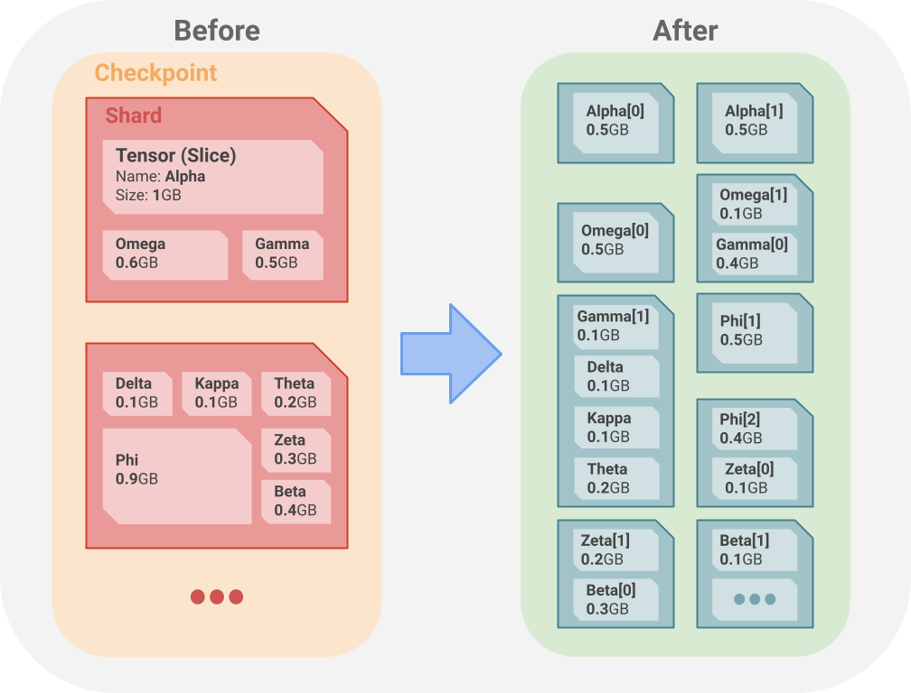

# Checkpoint Sharding Callback

| Status        | Implemented                                                                                  |
:-------------- |:-------------------------------------------------------------------------------------------- |
| **RFC #**     | [454](https://github.com/tensorflow/community/pull/454)                                      |
| **Author(s)** | Adam Cogdell (<adamcogdell@google.com>)                                                      |
| **Sponsor**   | Ivan Petrychenko (<petrychenko@google.com>)                                                  |
| **Updated**   | 2023-12-13                                                                                   |

## Objective

I am proposing a new callback mechanism that allows the user to have more control over how checkpoints are sharded. The purpose of this RFC is to publicize the design of this new checkpointing feature, which has been implemented (see [tensorflow/python/checkpoint/sharding](https://github.com/tensorflow/tensorflow/tree/master/tensorflow/python/checkpoint/sharding)), but is open to comments and changes from the open source community.

## Motivation

Users come to TensorFlow's low-level API for greater control and flexibility. They want to build models with the power of our API's infrastructure, but without the burden of high-level API restrictions. The previous checkpoint sharding policy was not flexible enough for some users with demanding use cases. Specifically, the sharding policy created checkpoint file shards according to the number of devices being used, which led to unreasonably large file sizes and OOM errors.

## User Benefit

Users will now be able to create checkpoint shards in ways that suite their use-cases. Common sharding policies like sharding by task and sharding according to a maximum file size will be provided by the checkpointing api (see [`tf.train.experimental.ShardByTaskPolicy`](https://github.com/tensorflow/tensorflow/blob/master/tensorflow/python/checkpoint/sharding/sharding_policies.py#L33) and [`tf.train.experimental.MaxShardSizePolicy`](https://github.com/tensorflow/tensorflow/blob/master/tensorflow/python/checkpoint/sharding/sharding_policies.py#L70)).

## Design Proposal

Checkpoints are simply a collection of model data/state stored on disk. More specifically, checkpoints can save tensor state from *trackable objects*, such as `tf.Variable`s, `tf.data.Dataset`s, or `tf.keras.Model`s. When `tf.saved_model.save()` or `Checkpoint.save()` are called, tensor data is gathered from these trackable objects, along with the model structure in the form of the [*object graph*](tensorflow/core/protobuf/trackable_object_graph.proto). Tensors are stored in the memory of a specific device. After the gather operation, `MultiDeviceSaver` used to just organize the serialized tensors by their devices into *shards*, which are files that make up the checkpoint. This was a reasonable way to separate the tensors for sharding, but resulted in the main issue presented in this document; a potentially large amount of data per file shard.

To rectify this, a callback function option was added to `CheckpointOptions` that allows the user to specify their own sharding policy. It's worth noting that this is a feature for advanced users, so the API change has advanced (but intuitive!) options that reflect that.

### Usage Example

Here's an example of how to use the api to shard checkpoints with a max shard size:

```python
import tensorflow

c = tf.train.Checkpoint(my_model)
c.save(
  "file_path",
  options=tf.train.CheckpointOptions(
    experimental_sharding_callback=(
      tf.train.experimental.MaxShardSizePolicy(
        max_shard_size=(500 * 2**20) )))) # 500MB
```

It's as simple as providing a callback and the necessary keyword arguments. The most common use case of the api will almost certainly be to shard with a max shard size, so a `MaxShardSizePolicy` default is provided (see [`tf.train.experimental.MaxShardSizePolicy`](https://github.com/tensorflow/tensorflow/blob/master/tensorflow/python/checkpoint/sharding/sharding_policies.py#L70) for implementation), but the user may create a custom callback if desired.

For teams that previously had large and unwieldy shards, this results in a much different checkpoint layout:



On the left is the checkpoint layout for the default `ShardByTaskPolicy`. In the first **Shard** file, we have tensor (slice)s **Alpha**, **Omega**, and **Gamma**. These tensors are placed in this shard since they were stored in the same device memory before saving. Therefore, Alpha, Omega, Gamma all belong to one device, while Delta, Kappa, and the other tensors in the second shard belong to a different device. With `max_shard_size`, these tensors would instead be split into different **Shards**, as shown on the right. Every shard on the right has a maximum size of 500MB, so some tensors are split among multiple shards. For example, Alpha is a 1GB tensor, so it is split into two 500MB shards. Additionally, tensors that belong to a particular device can be grouped with tensors that belong to a different device, as in the case of the shard on the right containing Gamma[1].

### Detailed Design

This approach requires a change to TensorFlow checkpointing, specifically the `MultiDeviceSaver` class. Currently, `MultiDeviceSaver.save()` shards tensors according to their respective devices (only relevant code is shown):

```python
class MultiDeviceSaver(object):
 def __init__(self, serialized_tensors):
  # Extract serialized tensors and separate by device.
  tensors_by_device = {}  # device -> checkpoint key -> (slice_spec ->) tensor
  self._single_device_savers = {
      device: _SingleDeviceSaver(tensor_slice_dict)
      for device, tensor_slice_dict in tensors_by_device.items()}

 def save(self, file_prefix):
  for shard, (device, saver) in enumerate(
      sorted(self._single_device_savers.items())):
    with ops.device(saveable_object_util.set_cpu0(device)):
      with ops.device(device):
        sharded_saves.append(saver.save(shard_prefix, options))
```

The `tensors_by_device` dict organization scheme makes sense during runtime, since the tensors are first organized by device memory placement (CPU, GPU, TPU), then by name (checkpoint key), then optionally by slice spec (in the case that the tensor is not whole). While sharding tensors like this works in many cases, we cannot assume this policy works for everyone. Leaving it as the default sharding policy seems reasonable, but an option for custom sharding is necessary. To this end, I propose adding an `experimental_sharding_callback` option to `CheckpointOptions`.

#### Sharding Callback

The callback function will take a list of `ShardableTensor`s as input. `ShardableTensor` is a new class that contains all the information about a tensor that a user will need to perform custom sharding, including `TensorSpec`, checkpoint key, and `Trackable`.

```python
class ShardableTensor:
  """Tensor wrapper containing data necessary for sharding."""
  _tensor_save_spec: saveable_object.SaveSpec
  tensor: tensor_lib.Tensor
  dtype: dtypes.DType
  device: device_lib.DeviceSpec
  name: str
  shape: tensor_shape.TensorShape
  slice_spec: variables.Variable.SaveSliceInfo
  checkpoint_key: str
  trackable: base.Trackable
```

The `shardable_tensors` argument is constructed from the original `serialized_tensors` structure given to `MultiDeviceSaver.__init__`. It is flattened for easier processing by the user, and each tensor is guaranteed to be wrapped in a `SaveSpec`. The user may process the `shardable_tensors`, organize them by shard in whatever way they see fit, and output them in `tensors_by_shard`, which is a list of dictionaries. Each dictionary maps a tensor (slice)'s unique `checkpoint_key` to the `tensor` itself.

The `experimental_sharding_callback` option is a `ShardingCallback` class, which contains the `__call__` method implementation itself and a text `description` of how the callback alters the tensor collection. The `description` is saved alongside the tensor data in the checkpoint, and can be used to assist with debugging during checkpoint restoration.

```python
class ShardingCallback(NamedTuple):
  """Checkpoint sharding callback function, along with a text description."""
  description: str

  @property
  @abc.abstractmethod
  def description(self) -> str:
    pass

  @abc.abstractmethod
  def __call__(
      self, shardable_tensors: Sequence[ShardableTensor]
  ) -> Sequence[TensorSliceDict]:
    pass
```

```python
class CheckpointOptions(object):
 def __init__(..., experimental_sharding_callback):
   """
   Args:
     ...
     experimental_sharding_callback: `tf.train.experimental.ShardingCallback`.
       A pre-made or custom callback that determines how checkpoints are
       sharded on disk. Pre-made callback options are
       `tf.train.experimental.ShardByDevicePolicy` and
       `tf.train.experimental.MaxShardSizePolicy`. You may also write a custom
       callback, see `tf.train.experimental.ShardingCallback`.
   """
```

Sharding by device and shard size will most likely be the majority use cases for this callback option, so utility callbacks will be provided:

```python
class ShardByDevicePolicy(ShardingCallback):
  """Callback to split tensors into shards based on their device."""

tf.train.CheckpointOptions(
  experimental_sharding_callback=(
    tf.train.experimental.ShardByDevicePolicy()))
```

```python
class MaxShardSizePolicy(ShardingCallback):
  """Callback to split tensors into shards with a max shard size."""

tf.train.CheckpointOptions(
  experimental_sharding_callback=(
    tf.train.experimental.MaxShardSizePolicy(
      max_shard_size=(...) )))
```

##### kwargs

Note that `MaxShardSizePolicy` requires the user to provide a keyword argument `max_shard_size`. However, the `experimental_sharding_callback` option is a `ShardingCallback`, which only contains a `__call__` method and text `description`, so we need some additional machinery to pass kwargs. This is done via the `ShardingCallback` constructor:

```python
class MyShardingPolicy(ShardingCallback):
  def __init__(self, my_kwarg):
    self.my_kwarg = my_kwarg

  def __call__(self, shardable_tensors):
    # code that uses self.my_kwarg

c = tf.train.Checkpoint(my_model)
c.save(
  "file_path",
  options=tf.train.CheckpointOptions(
    experimental_sharding_callback=MyShardingPolicy(
      my_kwarg=(...) )))
```

`__init__` is called when we pass `MyShardingPolicy` as a `CheckpointOption` when saving the checkpoint, which saves the kwarg for use later when the callback is executed. The checkpointing code only knows to call the callback with the `shardable_tensors` argument, so we need to pass our kwarg along manually in `__call__`.

**What about `functools.partial`?**

`partial(callback, kwargs)` would allow us to specify kwargs when initially constructing the `ShardingCallback`, but would not allow the user to specify kwargs when actually saving the checkpoint.

##### Design Considerations

This provides the user with a variety of options for rearranging/modifying the tensors from their in-memory layout to their on-disk layout. However, there are a few design questions to consider:

**Why not have the callback operate on each tensor in the collection?**

Keeping a coarse granularity on the callback gives the user more flexibility with sharding policies. If the callback were to instead operate on individual tensors instead of the entire tensor collection, then there would be severe limitations, such as the constraint that the number of shards must be >= the number of tensors. (Unless the main *shards* collection was accessible between callback calls, but this would be functionally equivalent to the original scheme.)

**Why not have the user supply a `tensors_by_shard` iterable upfront?**

It's a lot of work to track down all the tensors to be saved to a checkpoint. We shouldn't make the user do that. With the callback, we're essentially asking the user "Once I've found the tensors to save, how would you like to update/organize them?"

**Why not use `tensors_by_device` as the input to the callback?**

As mentioned previously, organizing the tensors by their in-memory location is a natural default. So, `tensors_by_device` would be a reasonable input for the callback, but it does restrict the user in niche cases. For example, having `shardable_tensors` as input allows the user to perform `isinstance()` checks and shard based on the tensor's `Trackable` type. This is another example of how this change gives advanced TensorFlow users more flexibility with regards to checkpointing.

**How does this impact loading and variable restoration?**

`MultiDeviceSaver.restore()` will need some refactoring to account for the switch from `_single_device_savers` to `_shardable_tensors`. Additionally, since the user can re-slice tensors in the sharding callback, `restore()` will need to combine those to form the original tensor (slice). Fortunately, the RestoreV2 Op currently does this combining for us, since we specify the full tensor metadata in the slice's `SaveSliceInfo`. This should not impact checkpoint loading in any way, including [Lazy Loading]().

**How does this impact performance?**

Constructing `shardable_tensors` in `MultiDeviceSaver.__init__` replaces construction of `serialized_tensors`, so performance impact is neutral. In `_single_device_save`/`_single_device_restore`, we're no longer iterating over the `_single_device_savers` dict, but instead over the user-specified `tensors_by_shard`, so the performance changes from `O(num_devices * num_tensors * num_slices)` to `O(num_user_specified_shards * num_tensors * num_slices)`. In the callback itself, the user is free to perform whatever computation they like, but they will likely iterate over all the tensors in the `shardable_tensors` list, which will incur a cost of `O(num_tensors)`. The callback will only be called once for a given `checkpoint.save()` call.

In regards to space/memory complexity, the callback really only works with the tensor metadata (it doesn't actually move around GBs of data when sharding), so the callback and the machinery that supports it will have a negligible impact on memory usage.

##### Restrictions

There are certain stipulations that must be considered when writing a sharding callback.

**Tensors must not be removed from the checkpoint.**

This will only lead to confusion and hard debugging. When loading a checkpoint, the general expectation is that all variables present before saving will be available for loading and restoration. There's no good reason to break this assumption now.

**Tensors must not be reshaped.**

Similar reasoning here. The user expects the tensor's shape to stay consistent between saving/loading. Tensor re-slicing in the callback is totally fine, though.

**Tensor dtypes must not change.**

Changing a tensor's data type changes its layout in memory and on disk. In the same vein as the reasoning above, loading a tensor with an altered dtype, when expecting the original dtype, would result in confusion and hard debugging.

**Tensors within a shard must belong to the same task.**

Tensors with different host devices cannot be saved reliably using the same device. A single device must be used to save a shard, so all tensors in a shard must belong to the same task. Note, however, that tensors belonging to the same task but to different devices within that task may be saved using any device belonging to the task.

`MultiDeviceSaver.save()` will perform validation checks after running the callback function.

#### Some Usage Scenarios

So, what's it like to actually use this feature? We've seen a couple of examples of usage in previous sections, but let's go through a painfully explicit example:

```python
import tensorflow as tf

class MyModel(tf.Module):
  def __init__(self):
    self.x = tf.Variable(
      tf.random.uniform(shape=[10_000_000_000], dtype=tf.float32))
    # 10 billion floats!!

with device("cpu:0"):
  m = MyModel()

c = tf.train.Checkpoint(m)
c.save(
  "file_path",
  options=tf.train.CheckpointOptions(
    experimental_sharding_callback=(
      tf.train.experimental.MaxShardSizePolicy(
        max_shard_size=(500 * 2**20) )))) # 500MB
```

Without the `max_shard_size_callback`, those 10 billion floats (**40GB**) would've been saved to a single shard. With the custom sharding scheme, we've spread those tensors out across **80** shards, **500MB** each. And wait a minute... that wasn't painful at all! Since the `MaxShardSizePolicy` is provided as a utility, the most common use case of this API is covered. Any advanced sharding policy would require a custom callback, but even that's easy to do. Here are some creative uses of the callback option. (More usage scenarios can be found in the Appendix.)

##### Model Separation

Each model gets its own shard.

```python
class OneModel(tf.Module):
  def __init__(self):
    self.x = tf.Variable(1.0)

class TwoModel(tf.Module):
  def __init__(self):
    self.x = tf.Variable(2.0)

class ModelSeparationPolicy(ShardingCallback):
  @property
  def description(self) -> str:
    return "Separates tensors into shards based on the model they belong to."

  def __call__(
      self, shardable_tensors: Sequence[ShardableTensor]
  ) -> Sequence[TensorSliceDict]:
    tensors_by_shard = [{}, {}]
    for shardable_tensor in shardable_tensors:
      trackable = shardable_tensor.trackable
      checkpoint_key = shardable_tensor.checkpoint_key
      slice_spec = shardable_tensor.slice_spec
      tensor = shardable_tensor.tensor_save_spec.tensor

      if isinstance(trackable, OneModel):
        (tensors_by_shard[0]
        .set_default(checkpoint_key, {})[slice_spec]) = tensor
      elif isinstance(trackable, TwoModel):
        (tensors_by_shard[1]
        .set_default(checkpoint_key, {})[slice_spec]) = tensor
    return tensors_by_shard

c.save(
  "file_path",
  options=tf.train.CheckpointOptions(
    experimental_sharding_callback=ModelSeparationPolicy))
```

##### Importance

After saving, tensors may be lazily restored from the checkpoint if they do not appear in the object graph. In this case, those tensors are restored when they are later added to the model and needed from the saved checkpoint. We can take advantage of this by sharding important tensors separately so that they are loaded more quickly.

```python
class MyModel(tf.Module):
  def __init__(self):
    self.x = tf.Variable(1.0, name="important")
    self.y = tf.Variable(2.0)

class ImportancePolicy(ShardingCallback):
  def __init__(self, important_tensor_names: ImmutableSet):
    self.important_tensor_names = important_tensor_names

  @property
  def description(self) -> str:
    return "Separates important tensors into their own shards."

  def __call__(
      self, shardable_tensors: Sequence[ShardableTensor]
  ) -> Sequence[TensorSliceDict]:
    tensors_by_shard = [{}]
    for shardable_tensor in shardable_tensors:
      checkpoint_key = shardable_tensor.checkpoint_key
      slice_spec = shardable_tensor.slice_spec
      tensor = shardable_tensor.tensor_save_spec.tensor

      if tensor.name in self.important_tensor_names:
        tensors_by_shard.append({checkpoint_key: {slice_spec: tensor}})
      else:
        (tensors_by_shard[0]
        .set_default(checkpoint_key, {})[slice_spec]) = tensor
    return tensors_by_shard

c.save(
  "file_path",
  options=tf.train.CheckpointOptions(
    experimental_sharding_callback=ImportancePolicy(
      important_tensors={"my_important_tensor",} )))
```

##### Normalize

Every float32 tensor is normalized according to specified minimum/maximum values. Note that not only can the sharding callback rearrange tensors, but also modify tensors. See the Restrictions section for limits to this.

```python
class NormalizePolicy(ShardingCallback):
  def __init__(self, min_val: Tensor, max_val: Tensor):
    self.min_val = min_val
    self.max_val = max_val

  @property
  def description(self) -> str:
    return "Normalize float32 tensor values."

  def __call__(
      self, shardable_tensors: Sequence[ShardableTensor]
  ) -> Sequence[TensorSliceDict]:
    tensors_by_shard = [{}]
    for shardable_tensor in shardable_tensors:
      trackable = shardable_tensor.trackable
      tensor = shardable_tensor.tensor_save_spec.tensor
      dtype = shardable_tensor.dtype
      checkpoint_key = shardable_tensor.checkpoint_key
      slice_spec = shardable_tensor.slice_spec

      if dtype == tf.float32:
        normalized = (tensor - min_val) / (max_val - min_val)
        tensors_by_shard.append(
          {checkpoint_key: {slice_spec: normalized}})
      else:
        tensors_by_shard.append(
          {checkpoint_key: {slice_spec: tensor}})
    return tensors_by_shard

c.save(
  "file_path",
  options=tf.train.CheckpointOptions(
    experimental_sharding_callback=NormalizePolicy(
      min_val=tf.constant(1.0), max_val=tf.constant(10.0) )))
```

#### Metrics and Monitoring

##### Latency

A simple and informative metric to track callback latency will be added. This will help the user keep track of how efficient their callback is and whether optimizations need to be made.

##### Shards Summary

Other metrics will give a summary of the shards collection (number of shards, callback description).

### Alternatives Considered

#### CheckpointOptions.max_shard_size

A much more rigid approach would be to provide a `CheckpointOptions.max_shard_size` that allows the user to accomplish sharding in the same way as the aforementioned `MaxShardSizePolicy`. This would solve the problem, but, unfortunately, this is a Band-Aid. TensorFlow has an unfortunate amount of short-term fixes that evolved into long-term supported features, each having caused avoidable loss of time and resources for the company. The root of the problem is not a lack of a checkpointing option for specifying a maximum shard size, it is an inflexible checkpointing api. Adding a callback option greatly reduces the chance of running into sharding inflexibility issues again, saving time and resources.

In the absence of this callback option, TF users experienced OOMs, implemented a temporary Reshard() solution, and coordinated with our team for a long-term solution, costing their team time and resources. The Reshard() boundary is inefficient and slow, costing downstream teams time and resources. If users in the future run into a sharding issue (not solved by the `max_shard_size` default), they will simply need to add their own custom callback (possibly with the help of the PAL team), saving them time and resources.

As showcased in the Composition usage scenario in the Appendix, this callback scheme is extremely flexible, given the technical know-how. Additionally, as shown in the Importance usage scenario, with enough creativity, this callback option has a myriad of use cases, including runtime efficiency gains beyond reducing a shard's memory footprint. Of course, these advanced use cases are for advanced users, and defaults for common use cases will be provided (`MaxShardSizePolicy`, `ShardByTaskPolicy`).

This flexibility is not absolute, however, as detailed by the Restrictions section in Detailed Design. Tensors may not be removed or reshaped in the callback, so the bulk of destructive possibilities is eliminated. An api is at its best when it's flexible enough to aid user creativity, and safeguarded enough to prevent unintended consequences. I believe the callback design strikes this balance.

#### Callback with serialized_tensors

The `ShardableTensor` data class neatly packages all the info that the user needs into a flat structure of tensors with metadata. An alternative approach is to provide the `serialized_tensors` dictionary as the callback argument instead. This would give the user the same structure that `MultiDeviceSaver` deals with in `__init__`. The main downside here is usability.

```python
def my_callback(serialized_tensors):
  for trackable, tensor_slice_dict in serialized_tensors.items():
    for checkpoint_key, tensor_slices in tensor_slice_dict.items():
      for slice_spec, tensor in tensor_slices.items():
        # do stuff
```

This organization of tensors is a bit clunky for the callback use case, so everything is moved into a flat list of `ShardableTensor`s in the final design.

### Appendix

#### Tensor Partitioning

The main goal of the `MaxShardSizePolicy` is to place tensors in shards without those shards exceeding a specified size. If a given tensor can fit in the remaining space available in the current shard, then the policy's job is simple: it appends the tensor to the list of tensors in the shard. If not, the tensor must be partitioned. We want to partition along the axis that results in the most amount of remaining shard space being filled up, so we don't create more shards than is necessary. We do this by partitioning the tensor up into chunks of maximum size <= the remaining shard size. We do this along each axis to find the partitioning scheme that best fits in the remaining shard space. (A multidimensional tensor partitioning algorithm is not in the scope of this project.) If the partition is larger than the max shard size, then we log a warning. If the partition is larger than the remaining shard space, we start over with a new shard. Otherwise, we add the partition to the current shard, then get the remaining tensor slice (without the partition) to shard on the next iteration of the loop.

#### More Usage Scenarios

##### All In One

What if I actually want every tensor in a single shard?

```python
class AllInOnePolicy(ShardingCallback):
  @property
  def description(self) -> str:
    return "Places all tensors in a single shard."

  def __call__(
      self, shardable_tensors: Sequence[ShardableTensor]
  ) -> Sequence[TensorSliceDict]:
    tensors = {}
    for shardable_tensor in shardable_tensors:
      tensor = shardable_tensor.tensor_save_spec.tensor
      checkpoint_key = shardable_tensor.checkpoint_key
      slice_spec = shardable_tensor.slice_spec

      tensors.set_default(checkpoint_key, {})[slice_spec] = tensor
    return [tensors]

  c.save(
    "file_path",
    options=tf.train.CheckpointOptions(
      experimental_sharding_callback=AllInOnePolicy()))
```

##### Composition

With a little hacking, we can even get some callback composition going. This callback first separates tensors by the model they belong to, then shards those with a max shard size of 500MB.

```python
class ModelSeparationWithMaxSizePolicy(ShardingCallback):
  def __init__(self, max_shard_size):
    self.max_shard_size = max_shard_size

  @property
  def description(self) -> str:
    return ("Separates tensors into shards based on the model they belong to, "
            "while keeping each shard to <= 500MB in size.")

  def __call__(
      self, shardable_tensors: Sequence[ShardableTensor]
  ) -> Sequence[TensorSliceDict]:
    model_separation_callback = ModelSeparationPolicy()
    model_separation_shards = model_separation_callback(shardable_tensors)
    new_shardable_tensors = []
    for task, shards in model_separation_shards:
      for shard in shards:
        for ckpt_key, tensor_slice in shard.items():
          for slice_spec, tensor in tensor_slice.items():
            new_shardable_tensors.append(
                sharding_util.ShardableTensor(
                    _tensor_save_spec=None,
                    tensor=tensor,
                    dtype=tensor.dtype,
                    device=tensor.device,
                    name=tensor.name,
                    shape=tensor.shape,
                    slice_spec=slice_spec.strip(),
                    checkpoint_key=ckpt_key,
                    trackable=None))
    max_shard_size_callback = MaxShardSizePolicy(max_shard_size=self.max_shard_size)
    return max_shard_size_callback({
      
      for tensor_slice_dict in
        model_separation_callback(shardable_tensors)})

c.save(
  "file_path",
  options=tf.train.CheckpointOptions(
    experimental_sharding_callback=ModelSeparationWithMaxSizePolicy(
      max_shard_size=(500 * 2**20) )))
```

Leaving `_tensor_save_spec` and `trackable` as None is fine since neither are used by `MaxShardSizePolicy`.
